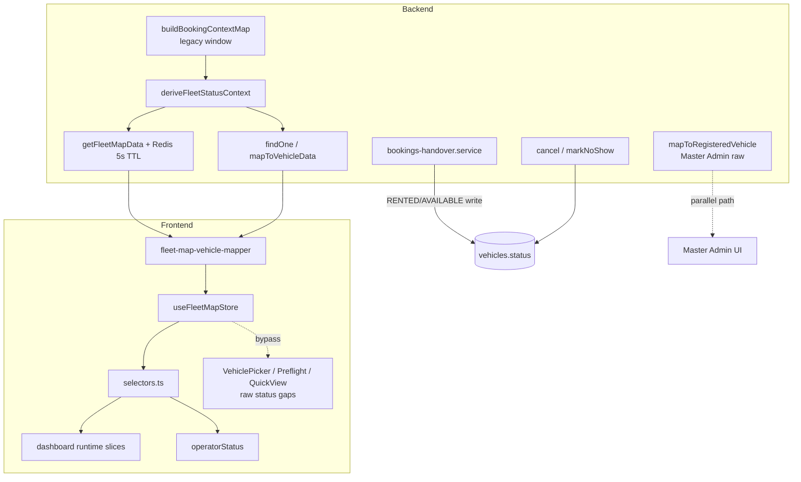

# Vehicle Operational State V2 — Final Wiring Audit (Prompt 42)

| Feld | Wert |
|------|------|
| **Audit-Datum** | 2026-07-16 |
| **Scope** | Read-only Abschlussaudit der gesamten Verdrahtung (Backend + Frontend + Ops) |
| **Basis-Commits** | `main` + Branches V4.9.498–V4.9.505 (State Engine, UNKNOWN-UX, Tests, Runbook) |
| **Methodik** | Code-Inspektion, gezielte Grep-Verifikation, Testläufe (keine Produktänderungen) |
| **Verwandte Docs** | [`fleet-operational-derivation-cleanup-p28.md`](./fleet-operational-derivation-cleanup-p28.md), [`../runbooks/vehicle-operational-status-repair.md`](../runbooks/vehicle-operational-status-repair.md), [`../testing/vehicle-operational-state-v2-backend-coverage.md`](../testing/vehicle-operational-state-v2-backend-coverage.md), [`../testing/vehicle-operational-state-v2-frontend-e2e-coverage.md`](../testing/vehicle-operational-state-v2-frontend-e2e-coverage.md) |

## Executive Summary

Die **kanonische Rental-Fleet-Pipeline** (`buildBookingContextMap` → `deriveFleetStatusContext` → Fleet-Map / List / Detail) ist konsistent verdrahtet und gut getestet. Ghost-`RENTED`/`RESERVED`-Demotion, Handover-Schreibpfade, Booking-Konflikte und Admin-Write-Guards sind korrekt.

**Kein P0-Blocker** identifiziert.

**Hauptlücke vor Produktion (P1):** Die in Diagnose/Tests definierte **Pickup-Tag-Reservierungslogik** (`isCanonicalPickupReservationDay`) ist **nicht** in die produktive `buildBookingContextMap` integriert. Fernliegende `CONFIRMED`-Buchungen erscheinen weiterhin als `Reserved` in allen Rental-APIs — widerspricht der V2-Spezifikation „Reserved nur im Pickup-Fenster“.

**Architektur-Split (P1/P2):** UNKNOWN und Data-Quality werden **frontend-seitig** abgeleitet; Backend liefert kein `operationalState`-DTO. Master-Admin und Org-Statistiken nutzen parallele Raw-`Vehicle.status`-Pfade.

**Empfehlung:** P1-Reserved-Fenster in `buildBookingContextMap` nachziehen; anschließend verbleibende Raw-Status-UI-Stellen auf gemeinsame Selectors migrieren.

---

## Risiko-Register (kompakt)

| ID | Priorität | Bereich | Kurzbeschreibung |
|----|-----------|---------|------------------|
| R-01 | **P1** | Reserved | Produktive API nutzt Legacy-Reservierungsfenster, nicht Pickup-Tag |
| R-02 | **P1** | API / Admin | Org-Dashboard-Zähler aus Raw-DB, nicht abgeleitet |
| R-03 | **P1** | API | Master-Admin `mapToRegisteredVehicle` umgeht State Engine |
| R-04 | **P1** | Frontend | Booking-Picker + Preflight lesen `vehicle.status` direkt |
| R-05 | **P1** | Operator | Quick-View OR-Logik: Flat-Status + Booking-IDs |
| R-06 | **P1** | Unknown | Backend emittiert kein `operationalState` / UNKNOWN |
| R-07 | **P1** | Cache | Optimistic Patches werden bei Fleet-Map-Fetch komplett verworfen |
| R-08 | **P1** | Cache | Backend Fleet-Map Redis nur TTL (5s), keine Event-Invalidierung |
| R-09 | **P2** | Frontend | `App.tsx` kollabiert Reserved/Rented in lokalem Detail-State |
| R-10 | **P2** | Frontend | Mehrfache `handover:completed`-Listener (redundant) |
| R-11 | **P2** | API | Fleet-Map Hard-Cap 500 Fahrzeuge |
| R-12 | **P2** | Statuswrites | Cancel/No-show setzt DB `AVAILABLE` ohne Prüfung anderer Buchungen |
| R-13 | **P2** | Tests | Operator-Shell E2E deferred (Unit-Coverage vorhanden) |
| R-14 | **P2** | Frontend | Deprecated `buildFleetStateTabs` mit Raw-Maintenance-Count (toter Code) |

---

## 1. Architektur — kanonische State Engine, keine parallelen Ableitungen

### 1.1 Kanonische Rental-Pipeline — kein Problem

| Feld | Wert |
|------|------|
| **Datei** | `backend/src/modules/vehicles/vehicles.service.ts` |
| **Codepfad** | `buildBookingContextMap` (L303–452) → `deriveFleetStatusContext` (L828–888) → `getFleetMapData` (L1150+) / `mapToVehicleData` (L666–714) / `findOne` (L1321–1343) |
| **Auswirkung** | Fleet Map, Fleet List und Vehicle Detail teilen dieselbe Ableitung; kein Drift zwischen Rental-Oberflächen. |
| **Beweis** | Kommentar L666–669: „Single source of truth“; `vehicle-operational-state-v2.api-consistency.spec.ts` (3 Tests grün). |
| **Empfohlene Korrektur** | — |

### 1.2 Frontend Selectors als SSOT — kein Problem

| Feld | Wert |
|------|------|
| **Datei** | `frontend/src/rental/lib/vehicle-operational-state/selectors.ts` |
| **Codepfad** | `selectOperationalStatus`, `selectIsCurrentlyAvailable`, `selectIsInPickupReservationWindow`, `selectIsCurrentlyRented` |
| **Auswirkung** | Dashboard-Runtime, Fleet-Tabs, Operator-Badges konsumieren dieselben Selectors. |
| **Beweis** | `vehicle-operational-selectors.test.ts`, `dashboardRuntime.test.ts`, `operatorStatus.ts` L52. |
| **Empfohlene Korrektur** | — |

### 1.3 Parallele Ableitung: Org-Statistiken — P1

| Feld | Wert |
|------|------|
| **Datei** | `backend/src/modules/organizations/organizations.service.ts` |
| **Codepfad** | `getOrganizationStats` / `byStatus` Reduce (L581–604) |
| **Auswirkung** | Master/Org-KPIs (`rented`, `reserved`, `available`) zählen **Raw-`vehicles.status`**, nicht booking-abgeleiteten Fleet-Status. Zahlen können von Fleet Map / Rental Dashboard abweichen (besonders bei Ghost States oder Legacy-DB). |
| **Beweis** | `byStatus[VehicleStatus.RENTED]`, `byStatus[VehicleStatus.RESERVED]` ohne `deriveFleetStatusContext`. |
| **Empfohlene Korrektur** | Org-Stats auf abgeleitete Aggregation umstellen oder klar als „persistierter Raw-Status“ labeln und von operativen KPIs trennen. |

### 1.4 Parallele Ableitung: Master Admin — P1

| Feld | Wert |
|------|------|
| **Datei** | `backend/src/modules/vehicles/vehicles.service.ts` |
| **Codepfad** | `mapToRegisteredVehicle` (L518–562), `findById` (L1311–1318), `findAllPlatform` (L1346–1366) |
| **Auswirkung** | Platform/Master-Admin-Fahrzeuglisten nutzen `VEHICLE_STATUS_MAP[v.status]` — **keine** Booking-Kontext-Ableitung, keine Ghost-Demotion. |
| **Beweis** | L562: `status: VEHICLE_STATUS_MAP[v.status as VehicleStatus] ?? 'Available'`; `findById` ruft nur `mapToRegisteredVehicle`, nicht `mapToVehicleData`. |
| **Empfohlene Korrektur** | Bewusst dokumentieren (separate Domäne) oder optional `deriveFleetStatusContext` für konsistente Anzeige; Tenant-Rental bleibt unberührt. |

### 1.5 Diagnose vs. Produktion: zwei Reservierungsdefinitionen — P1 (siehe Abschnitt 2)

| Feld | Wert |
|------|------|
| **Datei** | `backend/src/modules/vehicles/diagnostic/vehicle-booking-handover-diagnostic.util.ts` vs. `vehicles.service.ts` |
| **Codepfad** | `wouldCanonicalLogicReserveBooking` (L85–93) vs. `buildBookingContextMap` PENDING/CONFIRMED-Block (L430–449) |
| **Auswirkung** | Diagnose meldet `future_booking_legacy_reserved_trigger`; Produktion verhält sich weiterhin legacy. |
| **Beweis** | `vehicle-operational-state-v2.future-booking.spec.ts` L110–134: Test dokumentiert explizit „legacy read path“. |
| **Empfohlene Korrektur** | `isCanonicalPickupReservationDay` + Org-Timezone in `buildBookingContextMap` integrieren; `nextBooking`/`futureBookingCount` beibehalten. |

---

## 2. Reserved — nur im Pickup-Fenster

### 2.1 Legacy-Fenster in produktiver API — **P1 (R-01)**

| Feld | Wert |
|------|------|
| **Datei** | `backend/src/modules/vehicles/vehicles.service.ts` |
| **Codepfad** | `buildBookingContextMap` L316–324 (Query: `endDate >= now`), L430–449 (Reserved-Slot ohne Pickup-Tag-Filter) |
| **Auswirkung** | Jede zukünftige `CONFIRMED`/`PENDING`-Buchung mit `endDate >= now` belegt `reservedBookingId` → API-Status `Reserved` — auch Wochen im Voraus. Fleet-Tabs, Map, Dashboard Reserved-Slice und Booking-Preflight (wenn API-Status genutzt) zeigen fälschlich Reserved. |
| **Beweis** | `vehicle-operational-state-v2.future-booking.spec.ts` L41–45 (`isLegacyReservationWindowBooking` = true); L110–134 (`reservedBookingId = 'bk-future'`); Diagnose-Check `future_booking_legacy_reserved_trigger` in `vehicle-booking-handover-diagnostic-check-meta.ts`. |
| **Empfohlene Korrektur** | In `buildBookingContextMap`: Org-Timezone laden; Reserved nur wenn `isCanonicalPickupReservationDay(booking, now, tz)`; Fernbuchungen in `nextBooking`/`futureBookingCount` ohne Reserved-Status. |

### 2.2 Kanonische Pickup-Tag-Logik existiert, aber nur in Diagnose/Tests — kein Problem (Implementierung fehlt)

| Feld | Wert |
|------|------|
| **Datei** | `backend/src/modules/vehicles/diagnostic/vehicle-booking-handover-diagnostic.util.ts` |
| **Codepfad** | `isCanonicalPickupReservationDay` (L67–75), `wouldCanonicalLogicReserveBooking` (L85–93) |
| **Auswirkung** | Spezifikation und Tests sind korrekt; Produktion hinkt hinterher. |
| **Beweis** | `vehicle-operational-state-v2.reservation-window.spec.ts`, `vehicle-booking-handover-diagnostic.util.spec.ts`. |
| **Empfohlene Korrektur** | In Produktionspfad verdrahten (s. R-01). |

### 2.3 Stornierung — kein Problem

| Feld | Wert |
|------|------|
| **Datei** | `backend/src/modules/bookings/bookings.service.ts` |
| **Codepfad** | `cancel` (L1821–1859) |
| **Auswirkung** | `CANCELLED` + `cancelledAt`; Fahrzeug → `AVAILABLE` nur wenn nicht `IN_SERVICE`/`OUT_OF_SERVICE`; Task/Cleaning-Hooks. |
| **Beweis** | `updateMany` mit `notIn: [IN_SERVICE, OUT_OF_SERVICE]`; Frontend `invalidateVehicleOperationalState` in `App.tsx` / Handover-Flows. |
| **Empfohlene Korrektur** | — |

### 2.4 No-show — kein Problem

| Feld | Wert |
|------|------|
| **Datei** | `backend/src/modules/bookings/bookings.service.ts` |
| **Codepfad** | `markNoShow` (L1881–1940) |
| **Auswirkung** | Nur `CONFIRMED` + `startDate` in Vergangenheit; Fahrzeug-Freigabe analog Cancel; `BOOKING_NO_SHOW_WRONG_STATUS` / `BOOKING_NO_SHOW_TOO_EARLY` Guards. |
| **Beweis** | L1891–1905 Conflict/BadRequest; L1931–1938 `updateMany` mit Maintenance-Schutz. |
| **Empfohlene Korrektur** | — |

### 2.5 Reserved-Overdue (No-show-Risiko) — kein Problem

| Feld | Wert |
|------|------|
| **Datei** | `backend/src/modules/vehicles/vehicles.service.ts` |
| **Codepfad** | `buildBookingContextMap` L446–448 `reservedIsOverdue` |
| **Auswirkung** | Geplanter Pickup in Vergangenheit, `endDate` noch gültig → Overdue-Flag für UI-Warnung. |
| **Beweis** | `r.startDate.getTime() < now.getTime()`. |
| **Empfohlene Korrektur** | — |

---

## 3. Active Rented — konsistente aktive Vermietung, Return korrekt

### 3.1 ACTIVE-Booking gewinnt — kein Problem

| Feld | Wert |
|------|------|
| **Datei** | `backend/src/modules/vehicles/vehicles.service.ts` |
| **Codepfad** | `buildBookingContextMap` L409–428; `deriveFleetStatusContext` L862–867 |
| **Auswirkung** | `ACTIVE` → `Active Rented`; früheste ACTIVE bei Mehrfach (unexpected). |
| **Beweis** | `vehicle-operational-state-v2.active-rental.spec.ts`. |
| **Empfohlene Korrektur** | — |

### 3.2 Pickup-Handover setzt RENTED — kein Problem

| Feld | Wert |
|------|------|
| **Datei** | `backend/src/modules/bookings/bookings-handover.service.ts` |
| **Codepfad** | PICKUP-Branch L245–265 |
| **Auswirkung** | `Vehicle.status = RENTED`; Block bei `IN_SERVICE`/`OUT_OF_SERVICE` mit `HANDOVER_PICKUP_VEHICLE_BLOCKED`. |
| **Beweis** | L251–257 ConflictException; Transaktions-Rollback dokumentiert. |
| **Empfohlene Korrektur** | — |

### 3.3 Return-Handover — kein Problem

| Feld | Wert |
|------|------|
| **Datei** | `backend/src/modules/bookings/bookings-handover.service.ts` |
| **Codepfad** | RETURN-Branch L187–244 |
| **Auswirkung** | `completedAt`, `kmDriven`; `AVAILABLE` nur wenn keine andere `ACTIVE`-Buchung und nicht blockiert; sonst nur Station-Update. |
| **Beweis** | L223–230 `otherActive` Count; L231–238 conditional update. |
| **Empfohlene Korrektur** | — |

### 3.4 Ghost RENTED-Demotion — kein Problem

| Feld | Wert |
|------|------|
| **Datei** | `backend/src/modules/vehicles/vehicles.service.ts` |
| **Codepfad** | `deriveFleetStatusContext` L869–888 |
| **Auswirkung** | DB `RENTED`/`RESERVED` ohne Booking-Truth → `Available` + Warn-Log. |
| **Beweis** | Test-Output: `[fleet-status] Ghost Active Rented state`; `vehicle-operational-state-v2.state-engine.spec.ts`. |
| **Empfohlene Korrektur** | — |

---

## 4. Available — positives zuverlässiges Ergebnis

### 4.1 Fail-closed Available im Frontend — kein Problem

| Feld | Wert |
|------|------|
| **Datei** | `frontend/src/rental/lib/vehicle-operational-state/selectors.ts` |
| **Codepfad** | `selectIsCurrentlyAvailable` (L181–189); `selectOperationalStatus` L136–139 |
| **Auswirkung** | `AVAILABLE` + unreliable → `UNKNOWN`; kein stilles Available bei Datenkonflikten. |
| **Beweis** | `vehicle-operational-selectors.test.ts`; `vehicle-operational-state-v2-surfaces.test.ts`. |
| **Empfohlene Korrektur** | — |

### 4.2 Zukünftige Buchung erlaubt aktuell Available (Zielzustand) — kein Problem im Selector, **P1 in API** (R-01)

| Feld | Wert |
|------|------|
| **Datei** | Backend vs. Frontend |
| **Codepfad** | API liefert fälschlich `Reserved`; Frontend-Selectors würden nach API-Fix korrekt `Available` zeigen. |
| **Auswirkung** | Bis R-01 behoben: API widerspricht V2-Semantik. |
| **Beweis** | `future-booking.spec.ts` L59–67 (Ziel: Available ohne legacy ctx). |
| **Empfohlene Korrektur** | R-01. |

### 4.3 Keine Fehlerfallbacks zu Available in Derivation — kein Problem

| Feld | Wert |
|------|------|
| **Datei** | `backend/src/modules/vehicles/vehicles.service.ts` |
| **Codepfad** | `deriveFleetStatusContext` — Ghost-Demotion ist bewusst, nicht stiller Error-Fallback |
| **Auswirkung** | DB-Fehler in `buildBookingContextMap` → `.catch(() => [])` (leerer Kontext), nicht erzwungenes Available bei echtem ACTIVE. |
| **Beweis** | L340–354 catch; `vehicle-operational-state-v2.data-quality.spec.ts` Redis/DB-Resilienz. |
| **Empfohlene Korrektur** | P2: Booking-Query-Fehler als degraded flag statt leerem Kontext (optional). |

---

## 5. Unknown — Backend, Frontend, Dashboard, Operator, nicht Ready

### 5.1 Backend emittiert kein UNKNOWN — **P1 (R-06)**

| Feld | Wert |
|------|------|
| **Datei** | `backend/src/modules/vehicles/vehicles.service.ts`, `fleet-map-vehicle-mapper.ts` |
| **Codepfad** | `deriveFleetStatusContext` gibt nur `Available|Reserved|Active Rented|Maintenance`; kein `operationalState` im DTO |
| **Auswirkung** | UNKNOWN/Data-Quality ist **rein frontend-abgeleitet** aus `normalizeVehicleOperationalStateDto` + Selectors. API-Konsumenten ohne Frontend-Mapper sehen nie UNKNOWN. |
| **Beweis** | Grep: kein `operationalState` in `vehicles.service.ts`; `resolveOperationalState` baut DTO aus flat `raw.status` (L153–180). |
| **Empfohlene Korrektur** | Backend-DTO `operationalState` + `dataQualityState` ergänzen für echte API-SSOT; oder dokumentieren als bewusste Frontend-Schicht. |

### 5.2 Frontend UNKNOWN-UX — kein Problem

| Feld | Wert |
|------|------|
| **Datei** | `frontend/src/rental/lib/vehicle-operational-state/selectors.ts`, `vehicle-operational-unknown-display.ts` |
| **Codepfad** | `selectOperationalStatus` L132–150; Label „Status nicht verfügbar“ |
| **Auswirkung** | Kein Unknown→Available; `selectIsCurrentlyAvailable` schließt UNKNOWN aus. |
| **Beweis** | `VehicleOperationalStatusCallout.test.tsx`; E2E `fleet-operational-flow.spec.ts`. |
| **Empfohlene Korrektur** | — |

### 5.3 Dashboard: UNKNOWN nicht Ready — kein Problem

| Feld | Wert |
|------|------|
| **Datei** | `frontend/src/rental/components/dashboard/runtime/dashboardSliceBuilder.ts`, `vehicleRuntimeStateBuilder.ts` |
| **Codepfad** | `buildReadyToRentSlice` filtert `isReadyToRent`; Runtime double-gate |
| **Auswirkung** | UNKNOWN/unreliable Available erscheint nicht in Ready-Slice. |
| **Beweis** | `dashboardRuntime.test.ts` „does not count warnings… into blocked-maintenance“; `dashboardRuntimeUI.test.ts`. |
| **Empfohlene Korrektur** | — |

### 5.4 Operator: UNKNOWN fail-closed — kein Problem

| Feld | Wert |
|------|------|
| **Datei** | `frontend/src/operator/lib/operatorStatus.ts` |
| **Codepfad** | `deriveVehicleOperatorStatuses` L55–57 |
| **Auswirkung** | Unreliable → ein Badge „Status nicht verfügbar“, kein Ready/Rented/Reserved. |
| **Beweis** | `operatorStatus.test.ts` (4 Tests). |
| **Empfohlene Korrektur** | — |

---

## 6. Booking-Konflikte — unverändert wirksam

### 6.1 Overlap auf PENDING/CONFIRMED/ACTIVE — kein Problem

| Feld | Wert |
|------|------|
| **Datei** | `backend/src/modules/bookings/booking-conflict.util.ts` |
| **Codepfad** | `BLOCKING_BOOKING_STATUSES` (L4–8), `buildOverlapWhere` (L27–35) |
| **Auswirkung** | Zeitraum-Overlap blockiert neue Buchungen unabhängig vom Fleet-Status-Label. |
| **Beweis** | `booking-conflict.util.spec.ts`, `bookings.service.overlap.spec.ts`. |
| **Empfohlene Korrektur** | — |

### 6.2 Wizard + Create validieren Fenster — kein Problem

| Feld | Wert |
|------|------|
| **Datei** | `backend/src/modules/bookings/booking-wizard-draft.service.ts`, `bookings.service.ts` |
| **Codepfad** | `assertValidBookingWindow`, Overlap-Check bei Persist |
| **Auswirkung** | Konfliktlogik unabhängig von Reserved-Fenster-Drift. |
| **Beweis** | Import in `booking-wizard-draft.service.ts` L20. |
| **Empfohlene Korrektur** | — |

---

## 7. Statuswrites — Domain-Verantwortung, Audit

### 7.1 Kein generischer RESERVED/RENTED Admin-PATCH — kein Problem

| Feld | Wert |
|------|------|
| **Datei** | `backend/src/modules/vehicles/vehicles.controller.ts` |
| **Codepfad** | `ADMIN_WRITABLE_VEHICLE_STATES` (L234), PATCH-Guard (L256–258) |
| **Auswirkung** | Direktes Setzen von `RENTED`/`RESERVED` abgelehnt mit klarer Meldung. |
| **Beweis** | `vehicles.controller.status-patch.spec.ts` (reject RENTED/RESERVED). |
| **Empfohlene Korrektur** | — |

### 7.2 Domain-Writes: Handover — kein Problem

| Feld | Wert |
|------|------|
| **Datei** | `backend/src/modules/bookings/bookings-handover.service.ts` |
| **Codepfad** | PICKUP → RENTED; RETURN → AVAILABLE (konditional) |
| **Auswirkung** | Klare Lifecycle-Verantwortung Booking/Handover. |
| **Beweis** | Kommentar L33–39. |
| **Empfohlene Korrektur** | — |

### 7.3 Domain-Writes: Cancel / No-show — P2 (R-12)

| Feld | Wert |
|------|------|
| **Datei** | `backend/src/modules/bookings/bookings.service.ts` |
| **Codepfad** | `cancel` L1841–1848; `markNoShow` L1931–1938 |
| **Auswirkung** | Setzt DB `AVAILABLE` ohne zu prüfen, ob andere `CONFIRMED`/`ACTIVE`-Buchungen existieren. Kurzzeitige DB/API-Inkonsistenz bis nächster Read (Ableitung kann trotzdem Reserved/Rented zeigen). |
| **Beweis** | `updateMany` nur mit Maintenance-Guard, kein Booking-Existenz-Check. |
| **Empfohlene Korrektur** | Nach Cancel/No-show: `AVAILABLE` nur wenn keine blockierende Buchung mehr existiert; sonst Status unverändert lassen (Ableitung ist SSOT für UI). |

### 7.4 Repair-Audit-Trail — kein Problem

| Feld | Wert |
|------|------|
| **Datei** | `backend/src/modules/vehicles/diagnostic/vehicle-booking-handover-repair.service.ts` |
| **Codepfad** | `runRepair` → `activityLog` bei `--apply` |
| **Auswirkung** | Reparatur-Aktionen nachvollziehbar in `activity_logs`. |
| **Beweis** | `vehicle-booking-handover-repair.service.spec.ts`; Runbook § Audit. |
| **Empfohlene Korrektur** | — |

---

## 8. API — gleiche Statusantwort über Surfaces

### 8.1 Fleet Map = List = Detail (Rental) — kein Problem

| Feld | Wert |
|------|------|
| **Datei** | `backend/src/modules/vehicles/vehicles.service.ts` |
| **Codepfad** | `getFleetMapData`, `mapToVehicleData`, `findOne` |
| **Auswirkung** | Identische `status` + Booking-Kontext-Felder pro Fahrzeug. |
| **Beweis** | `vehicle-operational-state-v2.api-consistency.spec.ts` (3/3). |
| **Empfohlene Korrektur** | — |

### 8.2 Dashboard / Operator konsumieren Fleet-Map-Store — kein Problem

| Feld | Wert |
|------|------|
| **Datei** | `frontend/src/rental/stores/useFleetMapStore.ts`, `useDashboardViewModel.ts` |
| **Codepfad** | `fetchFleetMap` → `mapFleetMapVehicleResponse` → Runtime-Slices |
| **Auswirkung** | Dashboard und Fleet teilen kanonischen Store; Operator nutzt gleiche `VehicleData`-Form mit Selectors. |
| **Beweis** | `vehicle-operational-state-v2-surfaces.test.ts`; Architektur-Eintrag V4.9.500. |
| **Empfohlene Korrektur** | — |

### 8.3 Master Admin / Org-Stats — P1 (s. R-02, R-03)

Siehe Abschnitt 1.3 / 1.4.

---

## 9. Frontend — Selectors, keine Raw-Businesslogik

### 9.1 Kernflotten-UI nutzt Selectors — kein Problem

| Feld | Wert |
|------|------|
| **Datei** | Fleet Map, `FleetCommandPanel`, Dashboard-Runtime, `fleetVehicleDisplay.ts` |
| **Codepfad** | `selectFleetOperationalStatus`, `selectOperationalStatus` |
| **Auswirkung** | Tab-Filter, Badges, Runtime-Slices konsistent. |
| **Beweis** | P28-Cleanup-Audit; `FleetCommandPanel.test.tsx`. |
| **Empfohlene Korrektur** | — |

### 9.2 Booking-Picker: Raw-Status — **P1 (R-04)**

| Feld | Wert |
|------|------|
| **Datei** | `frontend/src/rental/components/new-booking/VehiclePickerStep.tsx` |
| **Codepfad** | L131 `fleetStatusLabelDe(vehicle.status)`; L202–260 Filter/Badges auf `vehicle.status` |
| **Auswirkung** | Wizard kann Reserved/Maintenance falsch anzeigen oder Available blockieren, wenn flat `status` von API driftet oder UNKNOWN nicht über Selector läuft. |
| **Beweis** | Grep: direkte `vehicle.status`-Vergleiche ohne `selectOperationalStatus`. |
| **Empfohlene Korrektur** | `selectOperationalStatus` + `selectIsCurrentlyAvailable` für Anzeige und Auswahlgate. |

### 9.3 Booking-Preflight: Raw-Status — **P1 (R-04)**

| Feld | Wert |
|------|------|
| **Datei** | `frontend/src/rental/lib/booking-vehicle-preflight.ts` |
| **Codepfad** | L81–83 `vehicle.status === MAINTENANCE|ACTIVE_RENTED|RESERVED` |
| **Auswirkung** | Preflight-Entscheidungen bypassen UNKNOWN-Guard und Inkonsistenz-Erkennung. |
| **Beweis** | Direkte Enum-Vergleiche auf flat field. |
| **Empfohlene Korrektur** | Selectors + `selectIsStatusReliable` für block/allow. |

### 9.4 Operator Quick-View: OR-Logik — **P1 (R-05)**

| Feld | Wert |
|------|------|
| **Datei** | `frontend/src/operator/hooks/useOperatorVehicleQuickViewData.ts`, `operatorVehicleQuickView.utils.ts` |
| **Codepfad** | L185–197 `activeBookingId \|\| status === ACTIVE_RENTED`; L104–113 raw status diagnostics |
| **Auswirkung** | Ghost-Booking-IDs oder veralteter flat status können Active/Reserved anzeigen, obwohl Selector UNKNOWN/Available liefern würde. |
| **Beweis** | OR-Kombination flat + IDs. |
| **Empfohlene Korrektur** | Booking-Anzeige an `selectActiveBooking` / `selectReservedBooking` koppeln (gate durch `selectIsCurrentlyRented` / `selectIsInPickupReservationWindow`). |

### 9.5 Booking-Felder nicht verloren — kein Problem

| Feld | Wert |
|------|------|
| **Datei** | `frontend/src/rental/lib/fleet-map-vehicle-mapper.ts` |
| **Codepfad** | `resolveBookingContext`, `flattenBookingContextToLegacy` |
| **Auswirkung** | `reserved*` / `active*` Legacy-Felder aus `bookingContext` projiziert. |
| **Beweis** | `fleet-map-vehicle-store.utils.test.ts` canonical+legacy sync. |
| **Empfohlene Korrektur** | — |

### 9.6 App.tsx Vehicle-Select kollabiert Status — P2 (R-09)

| Feld | Wert |
|------|------|
| **Datei** | `frontend/src/rental/App.tsx` |
| **Codepfad** | `handleVehicleSelect` L501 |
| **Auswirkung** | Reserved/Active Rented → lokaler `vehicleStatus` State `'Available'` (nur Maintenance bleibt). Kann Detail-UI-Status-Chrome verfälschen. |
| **Beweis** | Ternary: non-Available/non-Maintenance → `'Available'`. |
| **Empfohlene Korrektur** | Kanonischen Status über Selector in lokalen State übernehmen. |

---

## 10. Dashboard — Ready, Today's Operational, Slices, Konsistenz

### 10.1 Runtime-Slices als SSOT — kein Problem

| Feld | Wert |
|------|------|
| **Datei** | `frontend/src/rental/components/dashboard/runtime/dashboardSliceBuilder.ts`, `useDashboardViewModel.ts` |
| **Codepfad** | `ready-to-rent`, `active-rented`, `blocked-maintenance`, KPI aus `dashboardRuntime.slices` |
| **Auswirkung** | Drawer-Gruppen und KPI-Zahlen aus gleicher Runtime; Dedup-Tests. |
| **Beweis** | `dashboardRegressionAudit.test.ts`, `dashboardRuntimeUI.test.ts` (counts ↔ drawer). |
| **Empfohlene Korrektur** | — |

### 10.2 Station Command / Control Signals — kein Problem

| Feld | Wert |
|------|------|
| **Datei** | `frontend/src/rental/components/dashboard/controlSignalsBuilder.ts` |
| **Codepfad** | L409–411 `maintenanceCount` via `state.isMaintenance` (Runtime) |
| **Auswirkung** | Station-KPIs nutzen Runtime, nicht Raw-Status (im Gegensatz zu deprecated Helper). |
| **Beweis** | Runtime-Pfad bevorzugt; Fallback `selectOperationalStatus`. |
| **Empfohlene Korrektur** | — |

### 10.3 Deprecated `buildFleetStateTabs` — P2 (R-14)

| Feld | Wert |
|------|------|
| **Datei** | `frontend/src/rental/components/dashboard/dashboardUtils.ts` |
| **Codepfad** | L187–229 `@deprecated`; L225 `countFleetStatusTab(..., MAINTENANCE)` auf flat `v.status` |
| **Auswirkung** | **Kein aktiver Aufrufer** in Rental-Code (nur historischer Changes-Eintrag). Toten Code entfernen oder belassen. |
| **Beweis** | Grep: nur Definition, kein `buildFleetStateTabs(` Call-Site. |
| **Empfohlene Korrektur** | Datei bereinigen (Löschen deprecated Export) bei nächstem Dashboard-Touch. |

---

## 11. Cache — Invalidierung, stale Zustände

### 11.1 Frontend Invalidierungs-Bus — kein Problem (Architektur)

| Feld | Wert |
|------|------|
| **Datei** | `frontend/src/rental/lib/vehicle-operational-query/invalidate.ts` |
| **Codepfad** | `invalidateVehicleOperationalState` (L88+); Registry in FleetProvider, Dashboard, Operator |
| **Auswirkung** | Handover, Booking-Mutationen, Status-PATCH triggern gezielte Refreshes. |
| **Beweis** | `vehicle-operational-query.test.ts`; `HandoverContext.tsx` L174; `OperatorHandoverProvider.tsx` L173. |
| **Empfohlene Korrektur** | — |

### 11.2 Optimistic Patches verworfen bei Fetch — **P1 (R-07)**

| Feld | Wert |
|------|------|
| **Datei** | `frontend/src/rental/stores/useFleetMapStore.ts` |
| **Codepfad** | L171–173: `pendingOptimisticPatches` komplett gelöscht nach erfolgreichem `fetchFleetMap` |
| **Auswirkung** | Nach Handover-Optimistic-Update kann der nächste Poll (oder „Refresh now“) den Patch **vor** Backend-Konsistenz überschreiben → kurzer Rückfall auf alten Status (Flackern). |
| **Beweis** | Schleife `delete(entry.token)` ohne Merge mit Server-Antwort. |
| **Empfohlene Korrektur** | Patches bis `lastFetchedAt` + Grace oder bis Server-Status Ziel erreicht behalten; oder serverseitige Cache-Invalidierung beschleunigen. |

### 11.3 Backend Redis Fleet-Map TTL-only — **P1 (R-08)**

| Feld | Wert |
|------|------|
| **Datei** | `backend/src/modules/vehicles/vehicles.service.ts` |
| **Codepfad** | `FLEET_MAP_CACHE_TTL_SECONDS = 5` (L258); `redis.set` (L1297–1303); **kein** `del` bei Handover/Mutation |
| **Auswirkung** | Nach Handover max. ~5s stale Fleet-Map aus Redis; Frontend-Invalidierung holt ggf. noch gecachte Antwort. |
| **Beweis** | `vehicle-operational-state-v2.fleet-map-cache.spec.ts`; Coverage-Doc „TTL-only“. |
| **Empfohlene Korrektur** | `fleet-map:${orgId}:v1` bei Handover/Booking/Vehicle-Status-Mutation invalidieren. |

### 11.4 Redundante Event-Listener — P2 (R-10)

| Feld | Wert |
|------|------|
| **Datei** | `HandoverContext.tsx`, `useDashboardViewModel.ts`, `BookingsView.tsx`, `useBookingDetail.ts`, `VehicleBookingsView.tsx` |
| **Codepfad** | `window.addEventListener('handover:completed', …)` |
| **Auswirkung** | Mehrfache Invalidierung pro Event (harmlos, aber unnötige Refetch-Last). |
| **Beweis** | 5+ Listener auf dasselbe CustomEvent. |
| **Empfohlene Korrektur** | Zentraler Listener im Invalidierungs-Bus. |

---

## 12. Diagnose und Reparatur — Skripte, Dry Run, Runbook

### 12.1 Diagnose read-only — kein Problem

| Feld | Wert |
|------|------|
| **Datei** | `backend/scripts/ops/audit-vehicle-booking-handover-data.ts`, `vehicle-booking-handover-diagnostic.service.ts` |
| **Codepfad** | Report `dryRun: true` (L544 types) |
| **Auswirkung** | Keine Schreibzugriffe in Diagnose. |
| **Beweis** | Runbook §1; `vehicle-booking-handover-diagnostic.service.spec.ts`. |
| **Empfohlene Korrektur** | — |

### 12.2 Reparatur Dry-Run Default — kein Problem

| Feld | Wert |
|------|------|
| **Datei** | `backend/scripts/ops/repair-vehicle-booking-handover-data.ts`, `vehicle-booking-handover-repair.service.ts` |
| **Codepfad** | `apply = options.apply === true` (L45); CLI ohne `--apply` → Dry Run |
| **Auswirkung** | Schreiben nur explizit; Safety-Guards für Prod-DB. |
| **Beweis** | Script-Header L2–3; `assertSafeVbhRepairDatabaseTarget`; `repair.service.spec.ts` `dryRun: true`. |
| **Empfohlene Korrektur** | — |

### 12.3 Runbook vollständig — kein Problem

| Feld | Wert |
|------|------|
| **Datei** | `docs/runbooks/vehicle-operational-status-repair.md` |
| **Codepfad** | Voraussetzungen, Diagnose, Repair, Checks (`future_booking_legacy_reserved_trigger`), Rollback-Hinweise |
| **Auswirkung** | Ops-tauglich für VBH-Inkonsistenzen. |
| **Beweis** | 678 Zeilen; verlinkt Audit+Repair-Skripte, `VBH_REPAIR_SCRIPT_VERSION`. |
| **Empfohlene Korrektur** | Nach R-01-Fix Runbook-Abschnitt „erwartetes Verhalten Reserved“ aktualisieren. |

---

## 13. Tests und Builds

### 13.1 Backend Operational Tests — kein Problem

| Feld | Wert |
|------|------|
| **Datei** | `backend/src/modules/vehicles/operational/*.spec.ts`, diagnostic/repair specs |
| **Codepfad** | 14 Suites / **80 Tests** (Filter-Lauf 2026-07-16) |
| **Auswirkung** | State Engine, API-Konsistenz, Future-Booking, Cache, Handover-Repair abgedeckt. |
| **Beweis** | `npm test --testPathPattern='vehicle-operational|…'` → 80 passed. |
| **Empfohlene Korrektur** | Nach R-01: `buildBookingContextMap`-Test auf kanonisches Verhalten umstellen. |

### 13.2 Frontend Operational Tests — kein Problem

| Feld | Wert |
|------|------|
| **Datei** | `frontend/src/rental/lib/vehicle-operational-state/**`, dashboard runtime, operator, E2E |
| **Codepfad** | 139+ fokussierte Vitest-Tests; Playwright 11 desktop + 4 mobile (E2E-Doc) |
| **Auswirkung** | Selectors, Surfaces, Optimistic, Dashboard-Regression abgedeckt. |
| **Beweis** | `vehicle-operational-state-v2-frontend-e2e-coverage.md`; Vitest-Lauf 14 files / 139 passed. |
| **Empfohlene Korrektur** | Operator-Shell E2E nach Auth-Stabilisierung nachziehen (P2). |

### 13.3 Builds — kein Problem

| Feld | Wert |
|------|------|
| **Datei** | `frontend/` (tsc, vite build), `backend/` (jest) |
| **Codepfad** | Gesamtprojekt |
| **Auswirkung** | `npx tsc -b` OK; `npm run build` OK (2026-07-16). |
| **Beweis** | Audit-Lauf in Cloud Agent. |
| **Empfohlene Korrektur** | — |

---

## Verdrahtungsdiagramm (Ist-Zustand)

---

## Priorisierte Korrektur-Roadmap (nur Empfehlung — nicht umgesetzt)

1. **P1 — R-01:** `buildBookingContextMap` + Org-Timezone → kanonisches Pickup-Fenster; Tests von „legacy read path“ auf Zielverhalten drehen.
2. **P1 — R-04/R-05:** Booking-Wizard, Preflight, Operator Quick-View auf gemeinsame Selectors.
3. **P1 — R-07/R-08:** Optimistic-Patch-Merge + Redis Fleet-Map Invalidierung bei Mutationen.
4. **P1 — R-06:** Entscheidung: Backend `operationalState`-DTO oder dokumentierte Frontend-only UNKNOWN-Schicht.
5. **P1 — R-02/R-03:** Org-Stats / Master-Admin klar trennen oder angleichen.
6. **P2:** Cancel/No-show DB-Flip, App.tsx Status, Fleet-Map 500-Cap, toter deprecated Code, Operator E2E.

---

## Audit-Metadaten

| Prüfpunkt | Ergebnis |
|-----------|----------|
| Produktive Dateien geändert | **Nein** (nur dieses Dokument) |
| P0 Blocker | **0** |
| P1 vor Produktion | **8** (R-01–R-08) |
| P2 Verbesserung | **6** (R-09–R-14) |
| Synqdrive Changes aktualisiert | **Nein** (read-only Audit) |
| Synqdrive Architektur aktualisiert | **Nein** (read-only Audit) |

---

*Ende des Final Wiring Audit — Prompt 42/43.*
