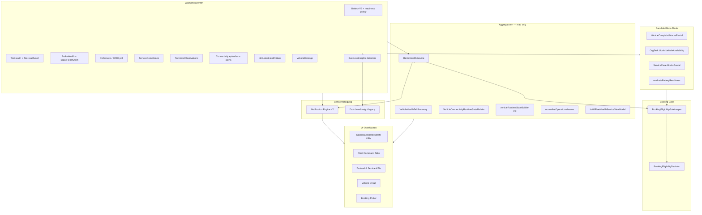

# Vehicle Warnings — Repository Inventory (Prompt 2/26)

| Feld | Wert |
|------|------|
| **Audit-ID** | `vehicle-warnings-production-readiness-2026-07` |
| **Prompt** | **2 von 26** — Repository-Inventur |
| **Erstellt (UTC)** | 2026-07-25 |
| **Basis-Commit** | `1d0f2caebe56aa1ecd23295aa33d20e953daa95d` (`main`) |
| **Charter** | [`00-audit-charter-2026-07.md`](./00-audit-charter-2026-07.md) |
| **Maschinenlesbare Tabelle** | [`evidence/repository-warning-components.csv`](./evidence/repository-warning-components.csv) |
| **Modus** | **Analyse only** — keine Remediation |
| **Produktionsdaten verändert** | **Nein** |

---

## 1. Executive Summary

Systematische Code-Inventur aller Komponenten, die Fahrzeugwarnungen **erzeugen**, **speichern**, **verändern**, **aggregieren**, **anzeigen** oder als **Entscheidungsgrundlage** dienen.

### 1.1 Zählung (164 inventarisierte Komponenten)

| Kategorie | Anzahl | Definition |
|-----------|-------:|------------|
| **Warnproduzenten** | **62** | Services, Worker, Detektoren, Policies, Prisma-Modelle, die Warn-/Alert-/Finding-/Block-Zustand erzeugen oder persistieren |
| **Aggregatoren** | **31** | Lesemodelle, die mehrere Quellen zu einem Status/Count zusammenführen, ohne kanonischer Owner zu sein |
| **APIs (Controller)** | **6** | REST-Endpunkte, die Warn-/Health-/Notification-Daten ausliefern |
| **UI-Konsumenten** | **34** | React-Komponenten, Hooks, Stores, die Warnungen anzeigen oder zählen |
| **Eigenständige Statusberechnungen** | **47** | `derives_status=yes` — potenzielle Parallelwahrheit (alle Risikostufen) |
| **Davon Risiko medium/high** | **84** | Komponenten mit dokumentiertem SSOT-Risiko in Folgeaudit |

> **Hinweis:** Eine Komponente kann mehreren Kategorien angehören (z. B. Producer + derives_status). Die CSV-Spalten `producer` und `derives_status` sind orthogonal.

### 1.2 Architektur-Überblick

---

## 2. Methodik

### 2.1 Durchsuchte Bereiche

| Bereich | Pfad | Status |
|---------|------|--------|
| Backend-Quellcode | `backend/src` | **CODE_VERIFIED** |
| Prisma-Schema | `backend/prisma/schema.prisma` | **CODE_VERIFIED** |
| Backend-Tests | `backend/src/**/*.spec.ts` (co-located) | **CODE_VERIFIED** |
| Monitoring | `backend/monitoring/prometheus`, `backend/monitoring/grafana` | **CODE_VERIFIED** |
| Frontend | `frontend/src/rental/**` | **CODE_VERIFIED** |
| E2E | `frontend/e2e/*.spec.ts` | **CODE_VERIFIED** |
| Architektur | `architecture/`, `docs/architecture/` | **CODE_VERIFIED** |
| Audits / Runbooks | `docs/audits/`, `docs/runbooks/` | **CODE_VERIFIED** |
| Audit-Skripte | `scripts/audits/` | **CODE_VERIFIED** |
| Migrations | `backend/prisma/migrations/` | Referenziert via Schema |
| `backend/test` | — | **Keine Treffer** — Tests co-located unter `backend/src` |

### 2.2 Suchbegriffe (Auszug)

`warning`, `alert`, `finding`, `observation`, `critical`, `severity`, `rental readiness`, `rental_blocked`, `blocksRental`, `blocksVehicleAvailability`, `telemetry`, `freshness`, `offline`, `operationalState`, `deriveIsReadyForRenting`, `normalizeOperationalIssues`, `DTC`, `Notification`, `DashboardInsight`, `Fleet Command`, `Zustand & Service`, deutsche UI-Begriffe (`Warnung`, `Bereitschaft`, `technisch prüfen`, `Nicht bereit`, `Verfügbar`).

---

## 3. Kanonische SSOT-Schichten (Ist-Hypothese)

| Dimension | Kanonischer Owner | Verifiziert in Prompt 2 |
|-----------|-------------------|-------------------------|
| Technische Mietblockade | `RentalHealthService.isRentalBlocked()` | **CODE_VERIFIED** |
| Health-Modul-Aggregation | `rental-health.types.ts` → `computeOverallState` | **CODE_VERIFIED** |
| Booking-Gate | `BookingEligibilityGatekeeperService` | **CODE_VERIFIED** |
| Dashboard-Mietbereitschaft | `deriveIsReadyForRenting` (FE) | **CODE_VERIFIED** |
| Dashboard-Runtime | `buildVehicleRuntimeStates` (FE) | **CODE_VERIFIED** |
| Telemetry-Freshness | `classifyTelemetryFreshness` (BE) + `resolveTelemetryFreshness` (FE) | **CODE_VERIFIED** — zwei Dateien, gleiche Semantik zu prüfen |
| Connectivity-Runtime | `VehicleConnectivityRuntimeStateBuilder` (BE) | **CODE_VERIFIED** |
| Operative Issues (UI) | `normalizeOperationalIssues` (FE) | **CODE_VERIFIED** |
| Fleet Command Tab-Counts | `runtimeSliceConsistency.canonicalTabCounts` (FE) | **CODE_VERIFIED** |
| Zustand & Service KPIs | `buildFleetHealthServiceViewModel` + `deriveHealthSeverityBand` (FE) | **CODE_VERIFIED** |
| Benachrichtigungen | `Notification` V2 + `NotificationCoreService` (BE) | **CODE_VERIFIED** — parallel `DashboardInsight` V1 |

---

## 4. Backend — Warnproduzenten

### 4.1 Rental Health (Aggregator, kein Producer)

| Pfad | Komponente | Rolle | Input | Output | Persistenz | orgId | derives_status | Tests | Risiko | Folgeaudit |
|------|------------|-------|-------|--------|------------|-------|----------------|-------|--------|------------|
| `backend/src/modules/rental-health/rental-health.service.ts` | `RentalHealthService` | **Zentraler Aggregator** — 7 Module → `VehicleHealth` | Module-DTOs (Battery, Tire, Brake, DTC, Service, HM, Complaints) | `rental_blocked`, `overall_state`, `blocking_reasons` | Keine (read-only) | `orgId` + `vehicleId` | **ja** | `rental-health.service.spec.ts` | **P0** | SSOT-Verifikation Cross-Surface |
| `backend/src/modules/rental-health/rental-health.types.ts` | `resolveRentalBlockedState`, `computeOverallState` | State-Mapping-Regeln | Modul-States | `RentalHealthState`, blocked flag | — | — | **ja** | `rental-health.types.spec.ts` | **P0** | Block-Logik vs. Gatekeeper |
| `backend/src/modules/rental-health/rental-health-fleet.service.ts` | `RentalHealthFleetService` | Fleet-API mit Cache | Cache + DB | Paginierte Fleet-Rows | Redis | `orgId` | ja | `rental-health-fleet.service.spec.ts` | P1 | Count-Drift vs. Dashboard |
| `backend/src/modules/rental-health/tire-rental-health.policy.ts` | `buildTireModuleHealth` | Tire-Modul + Hard-Block | TireHealth + Overrides | Modul-DTO | — | — | **ja** | spec | **P0** | Override-Ablauf |
| `backend/src/modules/rental-health/brake-rental-health.policy.ts` | `buildBrakeModuleHealth` | Brake-Modul + Hard-Block | BrakeHealth + Overrides | Modul-DTO | — | — | **ja** | spec | **P0** | Override-Ablauf |

### 4.2 Vehicle Intelligence — Modul-Produzenten

| Pfad | Komponente | Rolle | Persistenz | derives_status | Risiko |
|------|------------|-------|------------|----------------|--------|
| `vehicle-intelligence/battery-health/battery-readiness.policy.ts` | `evaluateBatteryReadiness` | Battery `blocksRental` | — | **ja** | **P0** — paralleler Block-Pfad |
| `vehicle-intelligence/battery-health/canonical-battery-health.service.ts` | `CanonicalBatteryHealthService` | Kanonische Battery-API | Postgres | ja | P1 |
| `vehicle-intelligence/battery-health/battery-v2.service.ts` | `BatteryV2Service` | V2-Pipeline | Postgres | ja | P1 |
| `vehicle-intelligence/tires/tire-health.service.ts` | `TireHealthService` | Tire-Summary | Postgres | ja | P1 |
| `vehicle-intelligence/tires/tire-health-alert.service.ts` | `TireHealthAlertService` | **Alert-Sync** → `TireHealthAlert` + Notifications | Postgres | ja | P1 |
| `vehicle-intelligence/brakes/brake-health.service.ts` | `BrakeHealthService` | Brake-Summary | Postgres | ja | P1 |
| `vehicle-intelligence/brakes/brake-health-alert.service.ts` | `BrakeHealthAlertService` | **Alert-Sync** → `BrakeHealthAlert` | Postgres | ja | P1 |
| `vehicle-intelligence/dtc/dtc.service.ts` | `DtcService` | DTC-Ingest + Severity | Postgres | **ja** | **P0** |
| `vehicle-intelligence/service-compliance/service-compliance.service.ts` | `ServiceComplianceService` | TÜV/BOKraft/Service overdue | Postgres | **ja** | **P0** |
| `vehicle-intelligence/dashboard-warning-lights/dashboard-warning-lights.service.ts` | `DashboardWarningLightsService` | OEM-Warnleuchten | — | ja | P2 |
| `vehicle-intelligence/health-summary/vehicle-health-tab-summary.service.ts` | `VehicleHealthTabSummaryService` | UI-Findings-Aggregator | — | ja | P1 — Präsentation vs. Gate |
| `vehicle-intelligence/damages/damages.service.ts` | `DamagesService` | `rentalImpact` BLOCK_RENTAL | Postgres | ja | P1 |

### 4.3 Parallele Block-Pfade (kritisch)

| Pfad | Feld / Mechanismus | Rolle | Risiko |
|------|-------------------|-------|--------|
| `technical-observations/technical-observations.service.ts` | `VehicleComplaint.blocksRental` | Operator-Beobachtung blockiert Miete | **P0** |
| `tasks/tasks.service.ts` | `OrgTask.blocksVehicleAvailability` | Task blockiert Verfügbarkeit | **P0** |
| `service-cases/service-cases.service.ts` | `ServiceCase.blocksRental` | Werkstattfall blockiert Miete | **P0** |
| `battery-readiness.policy.ts` | `blocksRental` via Assessment | Battery-Gate | **P0** |
| `business-insights/insight-task-bridge.service.ts` | Insight → Task mit `blocksVehicleAvailability` | Indirekter Block | **P1** |
| `prisma/schema.prisma` | `Vehicle.healthStatus` (deprecated) | Legacy-Rohstatus | **P0** wenn noch konsumiert |

### 4.4 Connectivity & Telemetry

| Pfad | Komponente | Rolle | derives_status | Risiko |
|------|------------|-------|----------------|--------|
| `vehicles/vehicle-state-interpreter.ts` | `classifyTelemetryFreshness` | Kanonische Freshness-Bänder (BE) | **ja** | **P0** |
| `vehicles/connectivity/domain/vehicle-connectivity-runtime-state.builder.ts` | `VehicleConnectivityRuntimeStateBuilder` | Connectivity-Runtime SSOT | **ja** | **P0** |
| `dimo/connectivity-alert/connectivity-alert.service.ts` | `ConnectivityAlertService` | Offline/Unplug-Notifications | **ja** | **P0** |
| `dimo/device-connection-episode.service.ts` | `DeviceConnectionEpisodeService` | Episode-Persistenz | ja | **P0** |
| `dimo/.../vehicle-connectivity-runtime-projection.service.ts` | `VehicleConnectivityRuntimeProjectionService` | Batch-Projection | ja | P1 |
| `vehicles/vehicles.service.ts` | `VehiclesService` | Komposition `operationalState` + connectivity | ja | **P0** |

### 4.5 Business Insights & Detektoren

| Pfad | Komponente | Insight-Typ | Persistenz |
|------|------------|-------------|------------|
| `business-insights/business-insights.service.ts` | Orchestrator | Alle Detektoren | `DashboardInsight` + `Notification` |
| `detectors/battery-critical.detector.ts` | `BatteryCriticalDetector` | `BATTERY_CRITICAL` | Postgres |
| `detectors/tire-critical.detector.ts` | `TireCriticalDetector` | `TIRE_CRITICAL` | Postgres |
| `detectors/brake-critical.detector.ts` | `BrakeCriticalDetector` | `BRAKE_CRITICAL` | Postgres |
| `detectors/compliance-operational.detector.ts` | Compliance | `SERVICE_OVERDUE` etc. | Postgres |
| `detectors/driving-assessment-device-quality.detector.ts` | Device Quality | Degradation | Postgres |
| `detectors/pickup-overdue.detector.ts` | Pickup | `PICKUP_OVERDUE` | Postgres |
| `detectors/return-needs-inspection.detector.ts` | Return | `RETURN_NEEDS_INSPECTION` | Postgres |

**Risiko:** Parallel `DashboardInsight` (V1) und `Notification` (V2) während Migration — **P1**.

### 4.6 Notification Engine

| Pfad | Komponente | Rolle |
|------|------------|-------|
| `notifications/adapters/notification-producer.ingest.service.ts` | Ingest domain events | Producer |
| `notifications/adapters/rental-health-notification.projector.ts` | `projectVehicleHealthWarnings` | Aggregator → Notification |
| `notifications/adapters/vehicle-health-notification.adapter.ts` | Health → Notification | Adapter |
| `notifications/adapters/technical-observation-notification.adapter.ts` | Observation → Notification | Adapter |
| `notifications/runtime/notification-evaluation.service.ts` | Rule evaluation | Producer |
| `notifications/notification-core.service.ts` | Lifecycle upsert | Producer |
| `notifications/api/notifications.controller.ts` | REST API | API |

### 4.7 Booking Gatekeeper

| Pfad | Komponente | Rolle | Risiko |
|------|------------|-------|--------|
| `booking-eligibility-gatekeeper/booking-eligibility-gatekeeper.service.ts` | **Sole eligibility producer** — ruft `isRentalBlocked()` | Gate | **P0** |
| `booking-eligibility-enforcement.service.ts` | Enforcement auf Transitions | Gate | **P0** |
| `booking-pickup-gate/booking-pickup-gate.service.ts` | Pickup-Zeit-Gate | Gate | **P0** |
| `booking-eligibility-recheck/booking-eligibility-recheck.service.ts` | Re-Eval bei Health-Änderung | Trigger | P1 |
| `booking-rental-eligibility.service.ts` | Kunden-/Regel-Eligibility (nicht Health) | Separates Domain | P1 |

### 4.8 Worker / Scheduler / Queue

| Queue / Scheduler | Processor | Rolle |
|-------------------|-----------|-------|
| `dimo.dtc.poll` | `DimoDtcProcessor` | DTC-Poll → `VehicleDtcEvent` |
| `dimo.snapshot.poll` | `DimoSnapshotProcessor` | Telemetry → `VehicleLatestState` |
| `dimo.tire.recalculation` | `TireRecalculationProcessor` | Tire health + alerts |
| `dimo.brake.recalculation` | `BrakeRecalculationProcessor` | Brake health + alerts |
| `battery.v2` | `BatteryV2Processor` | Battery assessments |
| `notification.evaluation` | `NotificationEvaluationProcessor` | Notification rules |
| `task.automation` | `TaskAutomationOutboxProcessor` | Auto-tasks |
| Device-connection webhook | `DeviceConnectionWebhookProcessor` | Episodes |

### 4.9 APIs (Controller)

| Pfad | Endpunkte (Auszug) | UI/API-Konsumenten |
|------|-------------------|-------------------|
| `rental-health/rental-health.controller.ts` | `GET /organizations/:orgId/rental-health/*` | FHS, FleetContext, Vehicle Detail, Picker |
| `vehicles/vehicles.controller.ts` | `GET fleet-map`, `GET vehicles/:id` | Dashboard, Fleet Command, Map |
| `notifications/api/notifications.controller.ts` | `GET/PATCH notifications` | ActionQueue, NotificationPanel |
| `technical-observations/technical-observations.controller.ts` | Observations CRUD | Health module |
| `service-cases/service-cases.controller.ts` | Service cases CRUD | FHS |
| `vehicle-intelligence/vehicle-intelligence.controller.ts` | Battery/Tire/Brake/DTC module APIs | Vehicle Detail tabs |

### 4.10 Prisma-Persistenz (Warn-relevant)

| Modell | Severity/Status-Felder | Block-Felder |
|--------|------------------------|--------------|
| `TireHealthAlert` | `severity`, `status` OPEN/RESOLVED | — (über Rental Health) |
| `BrakeHealthAlert` | `severity`, `category`, `status` | — |
| `VehicleComplaint` | `urgency`, `impact`, `status` | `blocksRental` |
| `VehicleDtcEvent` | `severity`, `isActive` | — |
| `Notification` | `severity`, `status`, `domain` | — (Transport) |
| `DashboardInsight` | `type`, `severity`, `isActive` | — (legacy) |
| `OrgTask` | `priority`, `status` | `blocksVehicleAvailability` |
| `ServiceCase` | `priority`, `status` | `blocksRental` |
| `VehicleDamage` | `severity` | `rentalImpact` |
| `DeviceConnectionEpisode` | `status`, `openedReason` | — |
| `BookingEligibilityDecision` | `decisionStatus` | `blockingReasons`, `warnings` JSON |
| `HmLatestHealthState` | OEM-Warnfelder | — |
| `Vehicle.healthStatus` | **DEPRECATED** | — |

---

## 5. Frontend — Runtime, Aggregatoren, UI

### 5.1 Status-Produzenten (Frontend)

| Pfad | Komponente | Rolle | derives_status | Risiko | UI/API |
|------|------------|-------|----------------|--------|--------|
| `dashboard/runtime/vehicleRuntimeStateBuilder.ts` | `buildVehicleRuntimeStates` | **Dashboard-Runtime-SSOT** | **ja** | low | Dashboard, Fleet Command (counts) |
| `dashboard/runtime/rentalReadiness.ts` | `deriveIsReadyForRenting` | Mietbereitschaft | **ja** | low | Bereitschaft-Slice, KPI |
| `dashboard/runtime/dashboardSliceBuilder.ts` | `buildDashboardSlices` | Slices + Counts | ja | low | ControlKpiStrip, Drawer |
| `dashboard/runtime/runtimeSliceConsistency.ts` | `canonicalTabCounts` | Fleet Command Tab-Badges | ja | **P1** | Fleet Command |
| `lib/telemetryFreshness.ts` | `resolveTelemetryFreshness` | Telemetry (FE) | **ja** | P1 vs BE | Fleet, Detail, Picker |
| `lib/fleetVisualState.ts` | `deriveFleetVisualState` | Fleet Map/Command Visual | **ja** | **P1** | Fleet Map, Command |
| `lib/fleet-health-control-center.ts` | `deriveHealthSeverityBand` | FHS Severity-Bänder | **ja** | **P1** | Zustand & Service |
| `lib/fleet-operator-panel.ts` | `resolveFleetCommandRowSeverity` | Command-Zeilen-Schwere | **ja** | **P1** | Fleet Command |
| `lib/operational-issues/normalizeOperationalIssues.ts` | `normalizeOperationalIssues` | Operative Issues | **ja** | low | ActionQueue, Attention |
| `lib/booking-vehicle-preflight.ts` | `resolveBookingVehiclePreflight` | Picker-Block | **ja** | **P1** | Booking Picker |
| `FleetContext.tsx` | `statusFromRentalHealth` | 4-State-Vereinfachung | **ja** | **P1** | Overview, FHS |
| `lib/vehicle-operational-state/selectors.ts` | `selectOperationalStatus` | Ops-Status Read-Model | ja | low | Picker, Preflight, Operator |

### 5.2 UI-Konsumenten nach Oberfläche

| Oberfläche | Komponenten | Datenquelle | Count-Quelle |
|------------|-------------|-------------|--------------|
| **Dashboard Bereitschaft** | `ControlKpiStrip`, `DashboardDrilldownDrawer`, `FleetStateBoard` | `dashboardRuntime.slices` | `vehicleRuntimeStateBuilder` |
| **Fleet Command** | `FleetCommandView`, `FleetCommandPanel`, `FleetOperatorRow` | `fleetVisualState` + runtime counts | `canonicalTabCounts` / `resolveFleetCommandRowSeverity` |
| **Zustand & Service** | `FleetHealthServiceView`, `FleetHealthServiceKpiStrip`, `FleetHealthServicePrioritizedList` | `FleetContext.healthMap` | `deriveHealthSeverityBand`, FHS VM |
| **Fleet Map** | `FleetView`, Map markers | `useFleetMapStore` + `fleetVisualState` | Visual state |
| **Vehicle Detail** | `VehicleHealthBox`, `VehicleDetailHeaderBadges`, `HealthErrorsView` | `useVehicleHealth`, module APIs | Module-level |
| **Booking Picker** | `VehiclePickerStep`, `RentalHealthBadge` | `healthMap` + `resolveBookingVehiclePreflight` | Per-vehicle |
| **Action Queue / Notifications** | `ActionQueue`, `NotificationPanel` | `normalizeOperationalIssues` + V2 API | Dedupe by `semanticKey` |
| **AI Fleet Chat** | `FleetChatResponseMetadata` | Backend tools (read-only) | Backend-generated |

### 5.3 Hooks / Stores / Query Keys

| Pfad | Rolle | orgId |
|------|-------|-------|
| `hooks/useVehicleHealth.ts` | RentalHealthV1 fetch | **required** |
| `hooks/useNotifications.ts` | Notifications V2 | **required** |
| `FleetContext.tsx` | `healthMap` cache | **required** |
| `DashboardInsightsContext.tsx` | Insights + health alerts feed | **required** |
| `stores/useFleetMapStore.ts` | Fleet vehicle list | **required** |
| `lib/vehicle-operational-query/keys.ts` | Invalidation keys | **org-scoped** |
| `components/dashboard/useDashboardViewModel.ts` | Dashboard orchestrator | **required** |

### 5.4 E2E-Abdeckung

| Spec | Abdeckung |
|------|-----------|
| `e2e/fleet-operational-flow.spec.ts` | Fleet Command Tabs, Status-Rows |
| `e2e/fleet-health-service-flow.spec.ts` | Zustand & Service KPIs, Tabs |
| `e2e/dashboard-notifications-v2.spec.ts` | Notification Panel V2 |
| `e2e/battery-health-flow.spec.ts` | Battery-Modul |
| `e2e/vehicle-detail-runtime-audit.spec.ts` | Telemetry-Polling |

---

## 6. Docs, Architektur, Skripte

### 6.1 Verbindliche Architektur-Dokumente

| Dokument | Relevanz für Warnsystem |
|----------|------------------------|
| `docs/operational-issue-normalization.md` | Kanonische Issue-Taxonomie |
| `docs/architecture/fleet-health-service-domain-boundaries.md` | Schichtenmodell Rental Health → Runtime → Gate |
| `architecture/FLEET_CONNECTIVITY_RUNTIME_DOMAIN_2026-07-19.md` | Connectivity-Runtime SSOT |
| `architecture/DEVICE_CONNECTION_EPISODE_2026-07-19.md` | Episoden + Alerts |
| `frontend/.../FLEET_HEALTH_SERVICE_CONTRACT.md` | FHS UI-Fachvertrag |
| `docs/notification-engine-domain-contract.md` | Notification Severity/Status |
| `docs/notification-engine-source-ownership.md` | Temporäre FE-Dedupe — **SSOT-Risiko** |

### 6.2 Vor-Audits (Referenz, nicht duplizieren)

| Audit | Verdict / Relevanz |
|-------|-------------------|
| `fleet-connectivity-production-readiness-2026-07.md` | NOT_READY — parallele Connectivity-Wahrheiten |
| `fleet-health-service-production-reality.md` | CONDITIONALLY_READY — FHS Lücken |
| `vehicle-operational-state-v2-final-audit.md` | READY (Staging) — Rental Pipeline SSOT |
| `brake/tire/battery-health-production-readiness-2026-07.md` | Modul-spezifische Findings |

### 6.3 Read-only Audit-Skripte

| Skript | Zweck |
|--------|-------|
| `scripts/audits/audit-fleet-connectivity-production-readiness.ts` | Cross-Surface Consistency |
| `scripts/audits/audit-brake-health-production-readiness.ts` | Brake Integrity |
| `scripts/audits/audit-tire-health-production-readiness.ts` | Tire Integrity |

---

## 7. Erste P0/P1-Verdachtsstellen

### 7.1 P0 — Sicherheit, Mandant, falsche operative Entscheidung

| ID | Verdacht | Komponenten | Beweis-Status | SYM |
|----|----------|-------------|---------------|-----|
| **VW-P0-01** | **Mehrere unabhängige `blocksRental`/`blocksVehicleAvailability`-Pfade** können Gatekeeper-Ergebnis von Rental-Health-Modulen abweichen | Complaint, OrgTask, ServiceCase, Battery policy, RentalHealth | **CODE_VERIFIED** | SYM-02 |
| **VW-P0-02** | **Drei Connectivity-Schichten** (Freshness, Episodes, Runtime Builder) ohne verifizierte Einheitlichkeit | `classifyTelemetryFreshness`, `ConnectivityAlertService`, `VehicleConnectivityRuntimeStateBuilder` | **CODE_VERIFIED** + Vor-Audit FC NOT_READY | SYM-03 |
| **VW-P0-03** | **Deprecated `Vehicle.healthStatus`** im Schema — Konsum in Legacy-Pfaden möglich | `schema.prisma`, `vehicles.service.ts` | **HYPOTHESIS** — Callsite-Scan in Prompt 3 | — |
| **VW-P0-04** | **Booking Gate** muss bei `rental_blocked=true` fail-closed sein | `BookingEligibilityGatekeeperService` | **CODE_VERIFIED** (Specs) — Prod-Verifikation offen | SYM-02 |
| **VW-P0-05** | **Cross-tenant**: Alle warnrelevanten Queries müssen `organizationId` erzwingen | Alle Controller + Services | **HYPOTHESIS** — IAM-Audit in Folgeprompt | — |

### 7.2 P1 — Erhebliche fachliche Inkonsistenz

| ID | Verdacht | Komponenten | Beweis-Status | SYM |
|----|----------|-------------|---------------|-----|
| **VW-P1-01** | **Unterschiedliche Count-Aggregatoren** Dashboard vs. Fleet Command vs. FHS | `dashboardSliceBuilder`, `canonicalTabCounts`, `deriveHealthSeverityBand`, FHS VM | **HYPOTHESIS** | SYM-01, SYM-05 |
| **VW-P1-02** | **Parallel `fleetVisualState` vs. `vehicleRuntimeStateBuilder`** | Zwei FE-Produzenten für Schwere/Status | **CODE_VERIFIED** | SYM-02 |
| **VW-P1-03** | **`FleetContext.statusFromRentalHealth`** 4-State vs. volle `HealthSeverityBand` | `FleetContext.tsx` | **CODE_VERIFIED** | SYM-04 |
| **VW-P1-04** | **Fleet Command Fallback** scannt Health-Module wenn keine canonical runtime IDs | `fleet-operator-panel.ts` | **CODE_VERIFIED** | SYM-05 |
| **VW-P1-05** | **DashboardInsight V1 + Notification V2** parallel | `business-insights.service.ts`, `NotificationCoreService` | **CODE_VERIFIED** | SYM-01 |
| **VW-P1-06** | **Telemetry FE vs. BE** — zwei `classify/resolveTelemetryFreshness` | BE + FE Dateien | **CODE_VERIFIED** — Semantik-Vergleich offen | SYM-03 |
| **VW-P1-07** | **`FleetConditionView` parallel zu `FleetHealthServiceView`** | Zwei Health-Listen-Oberflächen | **CODE_VERIFIED** | SYM-04 |
| **VW-P1-08** | **Booking Picker Preflight** eigene Block-Logik vs. Dashboard Readiness | `booking-vehicle-preflight.ts` vs. `deriveIsReadyForRenting` | **CODE_VERIFIED** | SYM-02 |
| **VW-P1-09** | **VehicleHealthTabSummary** Präsentations-Findings vs. RentalHealth Gate | `vehicle-health-tab-summary.service.ts` | **HYPOTHESIS** | SYM-04 |
| **VW-P1-10** | **Frontend Notification Dedupe** (`semanticKey`) temporär — kann von Backend abweichen | `notificationEngineDedupe.ts`, `notification-engine-source-ownership.md` | **CODE_VERIFIED** | SYM-01 |

---

## 8. Testabdeckung — Übersicht

| Bereich | Co-located Specs | E2E | Lücke |
|---------|------------------|-----|-------|
| Rental Health | Umfangreich (`rental-health*.spec.ts`) | FHS flow | Cross-surface count parity |
| Booking Gatekeeper | Umfangreich | Booking matrix | Prod smoke |
| Dashboard Runtime | `dashboardRuntime.test.ts`, `vehicleRuntimeStateBuilder.test.ts` | Dashboard notifications | Fleet Command parity E2E |
| Operational Issues | `operationalIssues.test.ts` | — | Full source migration |
| Connectivity | BE specs + FC audit scripts | Fleet operational | Prod episode closure |
| Notifications V2 | notification specs + E2E | `dashboard-notifications-v2` | V1/V2 dedupe |
| Module Health (Tire/Brake/Battery) | Regression matrices + audit scripts | `battery-health-flow` | Fleet-wide count |

---

## 9. Nächste Schritte (Prompt 3+)

1. **SSOT-Matrix verifizieren** — jede Dimension aus Charter §3.2 mit Callsite-Beweis
2. **Cross-Surface-Consistency** — gleiche `orgId`-Stichprobe über Dashboard, Fleet Command, FHS
3. **Deprecated-Pfad-Audit** — `Vehicle.healthStatus`, Legacy DashboardInsight-only consumers
4. **Telemetry-Semantik-Vergleich** — BE `classifyTelemetryFreshness` vs. FE `resolveTelemetryFreshness`
5. **Block-Pfad-Konsolidierung** — alle `blocksRental`-Quellen vs. Gatekeeper-Contributions

---

## 10. Bestätigung Prompt 2

| Prüfpunkt | Status |
|-----------|--------|
| Remediation durchgeführt | **Nein** |
| Produktionsdaten verändert | **Nein** |
| Refactoring | **Nein** |
| CSV erstellt | **Ja** — 164 Zeilen |
| Charter-Regeln eingehalten | **Ja** |

---

*Ende Repository-Inventur — Prompt 2 von 26*
