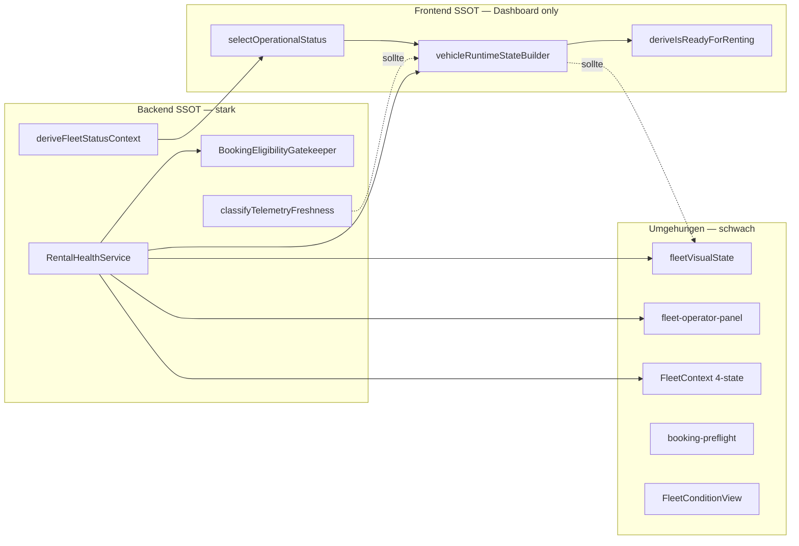

# Vehicle Warnings — Kanonisches Statusmodell (Prompt 3/26)

| Feld | Wert |
|------|------|
| **Audit-ID** | `vehicle-warnings-production-readiness-2026-07` |
| **Prompt** | **3 von 26** — Ist-/Soll-Statusmodell |
| **Erstellt (UTC)** | 2026-07-25 |
| **Basis-Commit** | `1d0f2caebe56aa1ecd23295aa33d20e953daa95d` |
| **Vorgänger** | [`00-audit-charter-2026-07.md`](./00-audit-charter-2026-07.md), [`01-repository-inventory.md`](./01-repository-inventory.md) |
| **Modus** | **Analyse only** — keine Codeänderungen |
| **Produktionsdaten verändert** | **Nein** |

---

## 1. Executive Summary

SynqDrive besitzt **kein einheitliches, durchgängiges 9-Dimensionen-Statusmodell**. Stattdessen existieren **mehrere parallele Typensysteme** (Rental Health V1, Dashboard Runtime, Fleet Visual State, FHS Severity Bands, Notification Engine, Prisma-Enums), die Begriffe wie „Warnung“, „Gut“, „Verfügbar“ und „Bereit“ **unterschiedlich semantisch** verwenden.

**Vorläufiges Urteil (§12):** Es existiert eine **teilweise SSOT** — stark im Backend für technische Mietblockade (`RentalHealthService` → `BookingEligibilityGatekeeper`), schwächer und fragmentiert in der Frontend-Darstellung und Zählung.

---

## 2. Methodik

| Quelle | Verwendung |
|--------|------------|
| `backend/src/modules/rental-health/rental-health.types.ts` | Rental Health V1 Typen |
| `frontend/.../dashboard/runtime/dashboardRuntimeTypes.ts` | Dashboard-Runtime-Dimensionen |
| `frontend/.../dashboard/runtime/rentalReadiness.ts` | Ready-to-Rent-Entscheidung |
| `frontend/.../dashboard/runtime/vehicleRuntimeStateBuilder.ts` | Runtime-Aggregation |
| `backend/.../vehicles/vehicle-state-interpreter.ts` | Backend-Telemetry |
| `frontend/.../lib/telemetryFreshness.ts` | Frontend-Telemetry |
| `frontend/.../lib/fleet-health-control-center.ts` | FHS Severity Bands |
| `frontend/.../lib/fleetVisualState.ts` | Fleet Map/Command Visual |
| `frontend/.../lib/vehicle-operational-state/*` | Commercial Status |
| `docs/architecture/fleet-health-service-domain-boundaries.md` | Ziel-Schichtenmodell |
| `docs/audits/vehicle-operational-state-v2-final-audit.md` | Operational State V2 |
| `architecture/FLEET_CONNECTIVITY_RUNTIME_DOMAIN_2026-07-19.md` | Connectivity Runtime |

Alle Feststellungen: **CODE_VERIFIED**, sofern nicht als **HYPOTHESIS** markiert.

---

## 3. Orthogonale Dimensionen — Soll-Modell (Audit-Zielbild)

Das Audit-Zielbild trennt **strikt** neun Dimensionen. Keine Dimension darf eine andere ersetzen oder still überschreiben.

| # | Dimension | Soll-Werte | Kanonischer Owner (Soll) |
|---|-----------|------------|--------------------------|
| D1 | **Commercial status** | `available`, `reserved`, `rented`, `maintenance`, `blocked`, `unknown` | Backend `deriveFleetStatusContext` → FE `selectOperationalStatus` |
| D2 | **Rental readiness** | `ready`, `ready_with_observation`, `not_ready`, `not_assessable` | FE `deriveIsReadyForRenting` + BE Gate für Buchung |
| D3 | **Technical state** | `clear`, `observe`, `check_required`, `critical`, `unknown` | BE `RentalHealthService` → `overall_state` + Band-Mapping |
| D4 | **Telemetry state** | `live`, `standby`, `soft_offline`, `offline`, `unknown` | BE `classifyTelemetryFreshness` (ein Adapter für FE) |
| D5 | **Finding severity** | `info`, `warning`, `critical` | Modul-Owner + `NotificationSeverity` |
| D6 | **Finding lifecycle** | `open`, `acknowledged`, `in_progress`, `resolved`, `dismissed`, `expired` | `Notification.status` / Alert-Tabellen |
| D7 | **Rental impact** | `none`, `observe`, `block_next_rental`, `block_immediately` | BE `rental_blocked` + Gatekeeper |
| D8 | **Customer impact (active rental)** | `none`, `contact_recommended`, `contact_required`, `stop_use` | **Nicht vollständig modelliert** (Soll: explizite Dimension) |
| D9 | **Data confidence** | `sufficient`, `limited`, `stale`, `unavailable` | BE `availability` + `data_stale` + FE `dataQualityState` |

---

## 4. Ist-Modell — tatsächliche Code-Werte pro Dimension

### 4.1 D1 — Commercial status

| System | Typ / Enum | Werte | Datei |
|--------|------------|-------|-------|
| **Prisma (persistiert)** | `VehicleStatus` | `AVAILABLE`, `RENTED`, `IN_SERVICE`, `OUT_OF_SERVICE`, `RESERVED` | `schema.prisma` |
| **Backend abgeleitet** | `FleetOperationalStatusToken` | `AVAILABLE`, `RESERVED`, `ACTIVE_RENTED`, `MAINTENANCE`, `UNKNOWN` | `fleet-operational-state.util.ts` |
| **Frontend kanonisch** | `VehicleOperationalStatus` | `AVAILABLE`, `RESERVED`, `ACTIVE_RENTED`, `MAINTENANCE`, `BLOCKED`, `UNKNOWN` | `vehicle-operational-state/types.ts` |
| **Dashboard Runtime** | `VehicleOperationalStatus` | `available`, `reserved`, `active_rented`, `maintenance`, `unavailable`, `unknown` | `dashboardRuntimeTypes.ts` |
| **Fleet Visual** | `FleetVisualStatus` | `ready`, `active`, `reserved`, `maintenance`, `blocked`, `offline`, `stale`, `attention`, `unknown`, `no_location` | `fleetVisualState.ts` |
| **Fleet Command Tabs** | `FleetCommandTab` | `All`, `Available`, `Reserved`, `Active`, `Maintenance`, `Unknown` | `fleet-command-filters.ts` |
| **UI DE** | Label | „Verfügbar“, „Reserviert“, „Aktiv vermietet“, „Wartung“, „Blockiert“, „Status nicht verfügbar“ | `vehicle-operational-state/display.ts` |

**Beobachtung:** `FleetVisualStatus.ready` ≠ `Commercial available` allein — es mischt Commercial, Health und Telemetry (siehe §6).

**Beobachtung:** `BLOCKED` existiert im FE-Operational-Enum, aber **nicht** im Backend `FleetOperationalStatusToken` — `BLOCKED` wird über `MAINTENANCE`-Tab oder separate Logik abgebildet.

### 4.2 D2 — Rental readiness

| System | Typ | Werte | Semantik |
|--------|-----|-------|----------|
| **Dashboard Runtime** | `RentalReadinessState` | `ready`, `not_ready`, `blocked` | Operative Übergabebereitschaft **jetzt** |
| **deriveIsReadyForRenting** | `boolean` | true/false | Kein `ready_with_observation` |
| **Rental Health availability** | `RentalHealthAvailabilityState` | `ready`, `partial`, `unavailable` | **Pipeline-Abdeckung**, nicht Mietbereitschaft |
| **Fleet Visual** | `FleetReadiness` | `ready`, `not_ready`, `blocked`, `offline`, `stale`, `unknown` | Misst Telemetry in Readiness |
| **FHS Badge DE** | Label | „Technisch unauffällig“, „Technisch prüfen“, „Technisch blockiert“, „Mietblockade“ | Health-Band, nicht D2 |
| **Booking Preflight** | `isSelectable` | boolean | Hard-block vs. caution getrennt |

**Kritischer Namenskonflikt:** `RentalHealthAvailabilityState.ready` bedeutet „alle Module evaluierbar“, **nicht** „fahrzeugbereit zur Ausgabe“.

### 4.3 D3 — Technical state

| System | Typ | Werte | Mapping zu Soll |
|--------|-----|-------|-----------------|
| **Rental Health V1** | `HealthState` | `good`, `warning`, `critical`, `unknown`, `n_a` | `good`→clear; `warning`→observe; `critical`→critical; `unknown`→unknown; `n_a`→excluded |
| **FHS Band** | `HealthSeverityBand` | `blocked`, `critical`, `review`, `good`, `limited`, `unevaluable` | Zusätzliche Ops-Bänder |
| **Dashboard Runtime** | `HealthSeverity` | `ok`, `warning`, `critical`, `unknown` | Abgeleitet aus Reasons + overall_state |
| **FleetContext** | `EffectiveHealthStatus` | `Critical`, `Warning`, `Good Health`, `Unknown` | 4-State-Vereinfachung |
| **Deprecated** | `HealthStatus` (Prisma) | `GOOD`, `WARNING`, `CRITICAL` | Legacy auf `Vehicle` |
| **UI DE (FHS)** | Badge | „Technisch unauffällig“ = `good`; „Technisch prüfen“ = `review`; „Technisch blockiert“ = `action`/`blocked` | |

**Beobachtung:** „Gut“ / „Technisch unauffällig“ = **nur** technische Health-Severity (`overall_state === good`), **nicht** Gesamtzustand inkl. Bereitschaft oder Verfügbarkeit.

**Beobachtung:** `review` (FHS) = `overall_state === warning` — entspricht Soll `observe` oder `check_required` je nach Modulgrund.

### 4.4 D4 — Telemetry state

| System | Typ | Werte | Schwellen |
|--------|-----|-------|-----------|
| **Backend** | `TelemetryFreshness` | `live`, `standby`, `signal_delayed`, `offline`, `no_signal` | 15min / 24h / 48h |
| **Backend compat** | `OnlineStatus` | `ONLINE`, `STANDBY`, `OFFLINE` | Kollabiert `signal_delayed`+`offline`→`OFFLINE` |
| **Frontend shared** | `TelemetryFreshness` | `live`, `standby`, `signal_delayed`, `offline`, `no_signal` | `telemetryFreshness.ts` |
| **Dashboard Runtime** | `TelemetryConnectionState` | `live`, `standby`, `soft_offline`, `offline`, `unknown` | `deriveTelemetryState` — **eigene Schwellen-Parameter** |
| **Fleet Visual** | Flags | `isOffline`, `isStale` | `stale` = signal_delayed; mischt in `visualStatus` |

**Namens-Divergenz:** `signal_delayed` (BE/FE shared) = `soft_offline` (Runtime) = UI „Soft Offline“ / „Signal verzögert“.

**Namens-Divergenz:** `no_signal` (BE) = `unknown` (Runtime) teilweise.

### 4.5 D5 — Finding severity

| System | Werte | Anmerkung |
|--------|-------|-----------|
| `HealthState` (Rental Health) | `good`, `warning`, `critical` | **Zustand**, nicht nur Finding |
| `OperationalIssueSeverity` | `info`, `attention`, `warning`, `critical` | Extra `attention` |
| `RuntimeReasonSeverity` | `info`, `warning`, `critical` | Dashboard Reasons |
| `NotificationSeverity` | `CRITICAL`, `WARNING`, `INFO`, `SUCCESS` | Transport |
| `InsightSeverity` | `CRITICAL`, `WARNING`, `OPPORTUNITY`, `INFO` | Legacy Insights |
| `DtcSeverity` | `INFO`, `WARNING`, `CRITICAL` | DTC-Modul |
| UI DE | „Warnung“ | Mehrdeutig — Notification, Health, Insight |

**Beobachtung:** „Warnung“ im UI kann **technisch** (Health `warning`), **operativ** (Dashboard Insight), oder **Benachrichtigung** (Notification) meinen.

### 4.6 D6 — Finding lifecycle

| System | Werte |
|--------|-------|
| `NotificationStatus` | `OPEN`, `ACKNOWLEDGED`, `SNOOZED`, `RESOLVED`, `ARCHIVED` |
| `TireHealthAlertStatus` / `BrakeHealthAlertStatus` | `OPEN`, `RESOLVED` |
| `ComplaintLifecycleStatus` | `ACTIVE`, `RESOLVED`, `OPEN`, `IN_REVIEW`, `CONFIRMED`, `DISMISSED` |
| `DashboardInsight` | `isActive` boolean (kein feiner Lifecycle) |
| `VehicleDtcEvent` | `isActive` + `clearedAt` |

**Lücke:** Kein einheitlicher Lifecycle über alle Finding-Typen. `in_progress` existiert nur implizit über Tasks/Service Cases.

### 4.7 D7 — Rental impact

| Mechanismus | Werte / Verhalten |
|-------------|-------------------|
| `VehicleHealth.rental_blocked` | `true` / `false` / `null` (null bei partial/unavailable pipeline) |
| `blocking_reasons[]` | Freitext-Codes — Gatekeeper-Input |
| `DamageRentalImpact` | `NONE`, `WATCH`, `BLOCK_RENTAL`, `SAFETY_CRITICAL` |
| `OrgTask.blocksVehicleAvailability` | boolean — **paralleler Block** |
| `ServiceCase.blocksRental` | boolean — **nicht in overall_state** (Domain Boundaries) |
| `VehicleComplaint.blocksRental` | boolean |
| `BookingEligibilityDecision` | `blockingReasons` JSON vs. `warnings` JSON |
| Runtime `blockLevel` | `none`, `soft_blocked`, `hard_blocked` |
| Runtime `reason.blocking` | Per-Reason-Flag |

**Beobachtung:** Soll `block_next_rental` vs. `block_immediately` ist im Code **nicht explizit** als Enum — nur über `soft_blocked`/`hard_blocked` und Gate-Stages angedeutet.

### 4.8 D8 — Customer impact (active rental)

| Vorhanden | Quelle |
|-----------|--------|
| **Teilweise** | `return_overdue` Booking-Runtime → Reason severity critical |
| **Teilweise** | `DrivingAssessmentQualityStatus`: `NORMAL`, `DEGRADED`, `RECOVERING` |
| **Teilweise** | Misuse Cases — operatorisch, nicht als eigene Dimension |
| **Fehlend** | Explizites `contact_recommended` / `stop_use` Modell pro aktivem Rental |

**Schlussfolgerung:** D8 ist **nicht als erste Klasse** implementiert — **HYPOTHESIS** für Folge-Prompts: Verhalten emergiert aus Insights/Notifications.

### 4.9 D9 — Data confidence

| System | Werte | Bedeutung |
|--------|-------|-----------|
| `RentalHealthAvailabilityState` | `ready`, `partial`, `unavailable` | Pipeline-Modul-Abdeckung |
| `ModuleHealth.data_stale` | boolean | >48h seit `last_updated_at` |
| `ModuleHealth.pipeline_available` | boolean | Evaluator-Erfolg |
| `VehicleDataQualityState` | `RELIABLE`, `DEGRADED`, `UNAVAILABLE` | Operational payload |
| `DataQualityState` (Runtime) | `fresh`, `limited`, `outdated`, `missing`, `unknown` | Telemetry + Backend DQ kombiniert |
| `isRentalBlockedUnverified` | boolean | `rental_blocked === null` bei partial |

---

## 5. Mapping-Tabelle Ist → Soll

### 5.1 Commercial status (D1)

| Ist-Wert | Quelle | Soll-Wert | Anmerkung |
|----------|--------|-----------|-----------|
| `AVAILABLE` / `available` / `ready` (visual) | BE/FE/Visual | `available` | Visual `ready` nur wenn Commercial=available **und** keine Override-Flags |
| `RESERVED` / `reserved` | BE/FE | `reserved` | |
| `ACTIVE_RENTED` / `active_rented` / `active` | BE/FE/Visual | `rented` | Naming-Inkonsistenz `rented` vs `active_rented` |
| `MAINTENANCE` / `maintenance` | BE/FE | `maintenance` | |
| `BLOCKED` / `blocked` | FE/Visual | `blocked` | BE-Token fehlt — mapped zu MAINTENANCE tab |
| `IN_SERVICE`, `OUT_OF_SERVICE` | Prisma raw | `maintenance` oder `blocked` | Legacy DB — nicht kanonisch für UI |
| `UNKNOWN` / `unknown` | BE/FE | `unknown` | Fail-closed |
| `unavailable` | Runtime only | `unknown` oder `blocked` | **Mehrdeutig** |
| `offline`, `stale`, `attention` | FleetVisual | **kein Commercial-Wert** | D4/D3 — dürfen D1 nicht überschreiben |

### 5.2 Rental readiness (D2)

| Ist-Wert | Quelle | Soll-Wert |
|----------|--------|-----------|
| `isReadyToRent === true` | Runtime | `ready` |
| `isReadyToRent === false` + warning reasons, nicht blockiert | Runtime | `ready_with_observation` (**fehlt im Ist**) |
| `rentalReadiness === not_ready` | Runtime | `not_ready` |
| `rentalReadiness === blocked` / `blockLevel !== none` | Runtime | `not_ready` (mit `rental_impact`) |
| `availability === partial/unavailable` | Rental Health | `not_assessable` |
| `operationalStatus !== available` | deriveIsReadyForRenting | `not_ready` (commercial block) |
| `telemetryState === offline` | deriveIsReadyForRenting | `not_ready` |
| `FleetReadiness.offline/stale` | fleetVisualState | **Telemetry**, nicht D2 |

### 5.3 Technical state (D3)

| Ist `HealthState` / Band | Soll |
|------------------------|------|
| `good` / `healthy` | `clear` |
| `warning` / `review` | `observe` oder `check_required` (modulabhängig) |
| `critical` / `action` | `critical` |
| `unknown` / `limited` / `unevaluable` | `unknown` |
| `rental_blocked === true` | **D7**, nicht D3 — aber FHS Band `blocked` vermischt |

### 5.4 Telemetry state (D4)

| Ist | Soll |
|-----|------|
| `live` | `live` |
| `standby` | `standby` |
| `signal_delayed` / `soft_offline` | `soft_offline` |
| `offline` | `offline` |
| `no_signal` / `unknown` | `unknown` |

### 5.5 Finding severity (D5)

| Ist | Soll |
|-----|------|
| `info`, `INFO`, `OPPORTUNITY` | `info` |
| `attention`, `warning`, `WARNING` | `warning` |
| `critical`, `CRITICAL` | `critical` |
| `SUCCESS` (Notification) | `info` (nicht Gesundheit) |

### 5.6 Rental impact (D7)

| Ist | Soll |
|-----|------|
| `rental_blocked === true` + Gate | `block_immediately` |
| `blocksVehicleAvailability` Task | `block_immediately` oder `block_next_rental` |
| `DamageRentalImpact.WATCH` | `observe` |
| `DamageRentalImpact.BLOCK_RENTAL` | `block_immediately` |
| Module `warning` ohne `rental_blocked` | `observe` |
| `blockLevel soft_blocked` | `block_next_rental` (**HYPOTHESIS**) |
| `healthWarningOnly` (Preflight) | `observe` |

---

## 6. Vermischte Dimensionen (Ist-Probleme)

| ID | Vermischung | Beweis | Auswirkung (SYM) |
|----|-------------|--------|------------------|
| **MIX-01** | `FleetVisualStatus.ready` = Commercial + Health + Location | `fleetVisualState.ts` `deriveFleetVisualState` | „Verfügbar“ suggeriert Bereitschaft (SYM-02) |
| **MIX-02** | `FleetVisualStatus.offline/stale` überschreibt Commercial `available` | `fleetVisualState.ts` | Offline + Verfügbar (SYM-03) |
| **MIX-03** | `RentalHealthAvailabilityState.ready` vs. Rental Readiness „Bereit“ | `rental-health.types.ts` vs. Dashboard KPI | Operator-Verwirrung |
| **MIX-04** | FHS „Technisch unauffällig“ vs. Dashboard „Bereit“ | FHS KPI vs. `ready-to-rent` slice | Count-Drift (SYM-01, SYM-04) |
| **MIX-05** | `HealthState.warning` als Zustand **und** Severity | Rental Health modules | „Warnung“ technisch, nicht operativ |
| **MIX-06** | `isCritical` Runtime = critical reasons **oder** `hard_blocked` | `vehicleRuntimeStateBuilder.ts` | Critical-Zähler (SYM-05) |
| **MIX-07** | `FleetCommandRowSeverity` scannt Health-Module als Fallback | `fleet-operator-panel.ts` | Abweichende Schwere vs. Runtime |
| **MIX-08** | `overall_state` enthält Service-Compliance `warning`, aber Service-Blockade explizit ausgeschlossen | Runtime `addHealthReasons` | Inkonsistente Block-Semantik |
| **MIX-09** | `Vehicle.healthStatus` (deprecated) noch in `fleetVisualState` | `isHealthCritical` fallback | Legacy-Second-Truth |
| **MIX-10** | Deutsch „Gut“ (`dashboard.good`) vs. „Technisch unauffällig“ | `de.ts`, FHS labels | Gleiche Intention, verschiedene Counts |

---

## 7. Erlaubte Kombinationen (Soll)

Orthogonale Dimensionen **dürfen** gleichzeitig wahr sein:

| Commercial | Rental readiness | Technical | Telemetry | Erlaubt? | UI-Regel |
|------------|------------------|-----------|-----------|----------|----------|
| `available` | `not_ready` | `critical` | `live` | **Ja** | Commercial-Badge ≠ Readiness-Badge |
| `available` | `not_ready` | `clear` | `offline` | **Ja** | Offline-Badge zusätzlich, nicht „Verfügbar“ allein |
| `available` | `ready` | `observe` | `standby` | **Ja** | `ready_with_observation` — Hinweis-Chip |
| `reserved` | `not_ready` | `clear` | `live` | **Ja** | Reservierung erklärt not_ready |
| `rented` | `not_assessable` | `unknown` | `live` | **Ja** | Readiness für Ausgabe irrelevant |
| `maintenance` | `not_ready` | `critical` | `offline` | **Ja** | Maintenance erklärt Commercial |

---

## 8. Verbotene Kombinationen (Soll — UI darf nicht anzeigen)

| Verbotene Darstellung | Warum | Ist-Verstoß? |
|----------------------|-------|--------------|
| Ein Badge „Verfügbar“ **ohne** Hinweis bei `rental_readiness=not_ready` + `technical=critical` | Suggeriert Ausgabefähigkeit | **Ja** — Fleet Visual `ready` (MIX-01) |
| „Bereit“ (Dashboard KPI) + „Technisch blockiert“ (FHS) ohne Erklärung | Widersprüchliche Ops-Entscheidung | **Ja** — parallele Aggregatoren (SYM-01) |
| „Technisch unauffällig“ bei `availability=partial` | Falsche Sicherheit | **Teilweise** — FHS `unevaluable` sollte greifen |
| „Gut“ / grüner Health-Chip bei `rental_blocked=true` | Block versteckt | **Nein** — FHS `blocked` Band separat (**CODE_VERIFIED**) |
| Critical-Count = 0 bei sichtbaren Critical-Health-Modulen | Zähler-Lüge | **Ja** — unterschiedliche `isCritical`-Definitionen (SYM-05) |
| Offline-Fahrzeug nur als „Verfügbar“ | Telemetry ignoriert | **Ja** (SYM-03) |
| `rental_blocked=false` in UI bei Gatekeeper `BLOCKED` | Buchungsrisiko | **HYPOTHESIS** — Gate vs. UI zu verifizieren |

---

## 9. UI-Anzeigeregeln (Soll)

| Regel | Beschreibung |
|-------|--------------|
| **UI-01** | Jedes Fahrzeug zeigt **max. einen Primary Commercial Badge** (`Verfügbar`, `Reserviert`, …) — aus `selectOperationalStatus` |
| **UI-02** | **Rental Readiness** („Bereit“ / „Nicht bereit“) nur auf Dashboard-Bereitschaft, Handover, Picker-Preflight — **nie** als Ersatz für Commercial |
| **UI-03** | **Technical state** nur in Zustand & Service, Health-Box, Modul-Chips — Labels: „Technisch unauffällig“, „Technisch prüfen“, „Technisch blockiert“ |
| **UI-04** | **Telemetry** als eigener Chip (Offline, Signal verzögert, Standby) — nie in Commercial-Badge mischen |
| **UI-05** | „Verfügbar“ **darf nicht** als Synonym für „mietbereit“ verwendet werden — Tooltip/Hilfe: „Kalenderverfügbar, nicht gleich übergabebereit“ |
| **UI-06** | „Gut“ im Dashboard-Kontext nur für **nicht-health** KPIs; Health immer „technisch …“ |
| **UI-07** | Bei `not_assessable` (`availability !== ready`): neutraler Chip „Nicht bewertbar“ — **kein** grünes „unauffällig“ |
| **UI-08** | Critical-Zähler = einheitliche Quelle (`VehicleRuntimeState.isCritical` **oder** FHS `critical` — nicht beide) |
| **UI-09** | Warnungen im Notification-Panel ≠ Health-Warnung — Domain-Label Pflicht |

---

## 10. API-Vertragsregeln (Soll)

| Regel | Backend-Vertrag |
|-------|-----------------|
| **API-01** | `GET rental-health/:vehicleId` liefert `overall_state`, `rental_blocked`, `availability`, `modules` — **keine** Commercial Status |
| **API-02** | `GET fleet-map`, `GET vehicles/:id` liefern `operationalState` + `bookingContext` — **keine** Health-Aggregation |
| **API-03** | `rental_blocked: null` bedeutet **unverified** — Consumer müssen fail-closed sein |
| **API-04** | `availability: partial` — `rental_blocked` muss `null` sein (**CODE_VERIFIED** `resolveRentalBlockedState`) |
| **API-05** | Booking Gatekeeper ist **einzige** Schreib-Entscheidung für Buchungseligibility |
| **API-06** | Notifications V2: `severity` + `status` + `domain` — kein implizites `rental_blocked` |
| **API-07** | Telemetry-Freshness: Backend `telemetryFreshness` Feld auf Vehicle DTO — Frontend rechnet nicht neu (Ziel) |

---

## 11. Entscheidungstabelle Ready / Not Ready

Quelle: `deriveIsReadyForRenting` + `vehicleRuntimeStateBuilder` — **CODE_VERIFIED**

| # | Bedingung | Ergebnis | Dimension |
|---|-----------|----------|-----------|
| R1 | `operationalStatus !== available` | **not_ready** | D1 |
| R2 | `canonicalStatus !== AVAILABLE` | **not_ready** | D1 |
| R3 | `!isBackendOperationalDataQualityReliable` | **not_ready** | D9 |
| R4 | `cleaningStatus !== 'Clean'` | **not_ready** | Ops |
| R5 | `blockLevel !== 'none'` | **not_ready** (blocked) | D7 |
| R6 | `telemetryState === 'offline'` | **not_ready** | D4 |
| R7 | Reason mit `preventsReady` oder `blocking` oder critical+compliance/damage/rental | **not_ready** | D5/D7 |
| R8 | Alle R1–R7 false | **ready** | D2 |
| R9 | `telemetryState === soft_offline` | **ready** (mit Warning-Reason) | D4 — **nicht** blockiert |
| R10 | `telemetryState === standby` | **ready** (kein Warning) | D4 |
| R11 | Health module `warning` ohne `rental_blocked` | **ready** (im Runtime-Builder: `preventsReady: false`) | D3/D5 |
| R12 | `rental_blocked === true` | **not_ready** + `blocked` via blockLevel | D7 |
| R13 | `nextBooking` vorhanden | **kein** Block (info only) | D2 |
| R14 | `availability !== ready` (Health) | Preflight: `rentalUnverified` — **nicht** in deriveIsReadyForRenting direkt | D9 |

**Lücke:** `ready_with_observation` existiert im Ist **nicht** — Fahrzeuge mit Health-`warning` können `ready` sein (R11), während FHS sie als `review` zählt → **SYM-01/04**.

---

## 12. Offline — wann verhindert es Bewertung?

| Kontext | Offline-Schwelle | Verhalten | Quelle |
|---------|------------------|-----------|--------|
| **Ready-to-Rent** | `telemetryState === offline` (48h+ im Runtime) | **Blockiert Bereitschaft** (R6) | `rentalReadiness.ts` |
| **Soft offline** | 24–48h (`soft_offline` / `signal_delayed`) | **Nicht** blockiert; Warning-Reason | `addTelemetryReason` |
| **Standby** | 15min–24h | **Nicht** blockiert; kein Warning | `telemetryFreshness.ts` |
| **Health-Bewertung** | Modul `data_stale` (>48h) | Modul-Stale-Flag, **nicht** automatisch `unknown` | `RENTAL_HEALTH_STALE_MS` |
| **Rental blocked** | Offline allein | **Blockiert nicht** `rental_blocked` im Backend | **CODE_VERIFIED** — nur FE Readiness |
| **Booking Picker** | `isVehicleOffline(vehicle)` | **Hard block** `isSelectable=false` | `booking-vehicle-preflight.ts` |
| **Fleet Visual** | `isOffline` | Überschreibt Visual Status → `offline` | `fleetVisualState.ts` |
| **FHS KPI** | Keine Telemetry-Eingabe | Health-Bewertung **ohne** Offline-Gate | `fleet-health-control-center.ts` |

**Definition (Soll):** Offline verhindert **operative Ausgabeentscheidung** (D2) und **Picker-Auswahl**, aber **nicht** zwingend technische Health-Aggregation (D3) — sofern Moduldaten lokal/HM vorliegen.

**Ist-Abweichung:** Picker blockiert früher/strenger als Dashboard Readiness bei gleicher Telemetry (**HYPOTHESIS** — Schwellen in `isVehicleOffline` vs. `deriveTelemetryState` zu vergleichen).

---

## 13. Warnung — blockierend oder nicht?

| Quelle | Blockierend? | Bedingung |
|--------|--------------|-----------|
| `rental_blocked === true` + `blocking_reasons` | **Ja** (D7) | Gatekeeper + Runtime `blocking: true` (außer category `service`) |
| Health module `critical` | **Nein** im Runtime-Builder | `blocking: false`, `preventsReady: false` — **nur Anzeige** |
| Health module `warning` | **Nein** | `preventsReady: false` |
| Dashboard Insight CRITICAL/WARNING | **Nein** | Explizit `blocking: false` in `addInsightReasons` |
| Telemetry `offline` | **Ja** für Readiness | `preventsReady: true`; `blocking` wenn `telemetryOfflineBlockLevel` |
| Telemetry `soft_offline` | **Nein** | Warning only |
| `OrgTask.blocksVehicleAvailability` | **Ja** (Gate) | Parallel zu Rental Health |
| `ServiceCase.blocksRental` | **Ja** (Gate) | Nicht in `overall_state` |
| `VehicleComplaint` SAFETY | **Ja** | `blocksRental` |
| Battery `evaluateBatteryReadiness` | **Ja** wenn policy | Über `rental_blocked` |
| DTC CRITICAL | **Über Modul** | `error_codes` module state → ggf. `rental_blocked` |

**Regel (Soll):** Nur `rental_impact >= block_next_rental` darf Buchung/Ausgabe blockieren. Health-`warning` allein = **observe** nur.

**Ist-Regel:** Runtime trennt bereits — aber **FHS** und **Fleet Command** zählen Health-`critical`/`warning` in Severity-Badges unabhängig von `rental_blocked` → visuelle Inkonsistenz.

---

## 14. Begriffsklärung UI-Deutsch

| Begriff | Gemeint als (Ist) | Soll-Semantik | Risiko |
|---------|-------------------|---------------|--------|
| **Verfügbar** | Commercial `AVAILABLE` | D1 only | Als mietbereit missverstanden |
| **Bereit** | Dashboard `ready-to-rent` slice | D2 | vs. FHS „unauffällig“ |
| **Gut** | `dashboard.good` / AI „Gut“ | Unklar — oft D3 | Nicht Gesamtzustand |
| **Technisch unauffällig** | FHS `good` band | D3 `clear` | ≠ Bereit |
| **Technisch prüfen** | FHS `review` / `warning` | D3 `observe`/`check_required` | ≠ Notification „Warnung“ |
| **Technisch blockiert** | FHS `action`/`blocked` | D7 | ≠ Commercial „Blockiert“ |
| **Warnung** | Notification / Health / Insight | Immer Domain nennen | MIX-05 |
| **Nicht bereit** | `rentalReadiness not_ready` | D2 | Kann bei `available` commercial |
| **Offline** | Telemetry 48h+ | D4 | ≠ `unavailable` commercial |

---

## 15. Eigene Ableitungen — vollständige Liste (Ist)

Komponenten mit **eigener Statusberechnung** (`derives_status=yes` aus Inventur), gruppiert nach Risiko:

### 15.1 Backend — kanonische Owner

| Komponente | Dimensionen | SSOT-Rolle |
|------------|-------------|------------|
| `deriveFleetStatusContext` / `buildFleetOperationalStateDto` | D1 | **Owner Commercial** |
| `RentalHealthService` + `rental-health.types.ts` | D3, D7, D9 | **Owner Technical + rental_blocked** |
| `classifyTelemetryFreshness` | D4 | **Owner Telemetry (BE)** |
| `VehicleConnectivityRuntimeStateBuilder` | D4 (+ Episoden) | Connectivity Runtime |
| `BookingEligibilityGatekeeperService` | D7 (Buchung) | **Owner Booking Gate** |
| Module Policies (Battery/Tire/Brake/DTC/Service) | D3, D5 | Producer → Rental Health |

### 15.2 Backend — parallele Block-Produzenten (umgehen Rental Health overall_state)

| Komponente | Umgehung |
|------------|----------|
| `TechnicalObservationsService` (`blocksRental`) | Direkter Block |
| `TasksService` (`blocksVehicleAvailability`) | Gate-Parallel |
| `ServiceCasesService` (`blocksRental`) | Gate-Parallel, nicht in overall_state |
| `BusinessInsightsService` + Detectors | Parallele Findings (V1/V2) |
| `ConnectivityAlertService` | Notifications ohne Rental Health |

### 15.3 Frontend — kanonische Consumer (wenn korrekt verdrahtet)

| Komponente | Dimensionen |
|------------|-------------|
| `selectOperationalStatus` | D1 Consumer |
| `deriveIsReadyForRenting` | D2 Owner (FE) |
| `buildVehicleRuntimeStates` | D2, D4, D5 Aggregator |
| `normalizeOperationalIssues` | D5 Normalizer |
| `healthSeverityBand` | D3 für FHS |

### 15.4 Frontend — Second-Truth-Risiko (eigene Ableitung)

| Komponente | Dimensionen | Risiko |
|------------|-------------|--------|
| `deriveFleetVisualState` | D1+D3+D4 vermischt | **Hoch** (MIX-01/02) |
| `resolveFleetCommandRowSeverity` | D5 Fallback Health-Scan | **Hoch** (SYM-05) |
| `statusFromRentalHealth` | D3 4-State | Mittel |
| `deriveTelemetryState` (Runtime) | D4 parallel zu `resolveTelemetryFreshness` | Mittel |
| `resolveBookingVehiclePreflight` | D2+D4+D7 | Mittel |
| `FleetConditionView` KPIs | D3 parallel FHS | Mittel |
| `buildFleetHealthServiceViewModel` | D3 Aggregator | Niedrig wenn healthMap SSOT |
| `deriveOperationalInsights` | D5 legacy | Mittel |
| `FleetContext` health simplification | D3 | Mittel |
| `vehicle.healthStatus` fallback in `fleetVisualState` | D3 legacy | **Hoch** |

---

## 16. Vorläufiges Urteil — Single Source of Truth

### 16.1 Existiert bereits eine echte SSOT?

**Teilweise — CONDITIONAL.**

| Dimension | SSOT vorhanden? | Owner | Lücken |
|-----------|-----------------|-------|--------|
| D1 Commercial | **Ja (BE)** | `deriveFleetStatusContext` → `operationalState` | FE `fleetVisualState` umgeht |
| D2 Rental readiness | **Ja (FE only)** | `deriveIsReadyForRenting` | Kein Backend-Spiegel; Picker eigene Logik |
| D3 Technical state | **Ja (BE)** | `RentalHealthService` | FHS/Runtime/FleetVisual eigene Bänder |
| D4 Telemetry | **Teilweise** | BE `classifyTelemetryFreshness` + FE `resolveTelemetryFreshness` + Runtime `deriveTelemetryState` | **3 Pfade** |
| D5 Finding severity | **Nein** | Modul-spezifisch | 6+ Severity-Enums |
| D6 Lifecycle | **Nein** | Notification/Alert je Typ | Kein Unified Model |
| D7 Rental impact | **Teilweise** | `rental_blocked` + Gatekeeper | Parallele `blocks*` Flags |
| D8 Customer impact | **Nein** | — | Nicht modelliert |
| D9 Data confidence | **Teilweise** | `availability` + `data_stale` | Runtime `dataQualityState` eigen |

### 16.2 Wo beginnt und endet die SSOT?

**SSOT beginnt:**
- Backend: `RentalHealthService.getVehicleHealth()` für D3/D7/D9
- Backend: `vehicles.service` `deriveFleetStatusContext` für D1
- Backend: `BookingEligibilityGatekeeper` für Buchungs-Block
- Frontend: `buildVehicleRuntimeStates` → `deriveIsReadyForRenting` für Dashboard D2

**SSOT endet / bricht:**
- Fleet Map / Fleet Command Visual (`fleetVisualState`) — eigene Hierarchie
- FHS KPI-Strip (`healthSeverityBand`) — andere Zähler-Definition als Dashboard Slices
- Fleet Command Alert Severity Fallback (`fleet-operator-panel`)
- Booking Picker (`resolveBookingVehiclePreflight`)
- Legacy `Vehicle.healthStatus`, `DashboardInsight` V1

### 16.3 Komponenten, die die SSOT umgehen (Priorität)

| Prio | Komponente | Umgehung |
|------|------------|----------|
| P0 | `fleetVisualState.ts` | Commercial+Health+Telemetry in einem `visualStatus` |
| P0 | Parallele `blocksRental` / `blocksVehicleAvailability` | Gate ohne Rental Health overall_state |
| P1 | `fleet-operator-panel.ts` | Health-Modul-Scan für Command Severity |
| P1 | `deriveTelemetryState` vs. `resolveTelemetryFreshness` | Zwei Telemetry-Pfade |
| P1 | FHS KPI vs. Dashboard `ready-to-rent` / `critical-alerts` | Unterschiedliche Zähler |
| P1 | `FleetContext.statusFromRentalHealth` | 4-State vs. 6-Band |
| P2 | `FleetConditionView` | Parallele Health-Liste |
| P2 | `DashboardInsight` V1 | Parallele Findings |

---

## 17. Nächste Schritte (Prompt 4+)

1. **Callsite-Matrix** — jeder Consumer: welche Dimension, welcher Owner, Abweichung
2. **Schwellen-Vergleich** — `isVehicleOffline` vs. `deriveTelemetryState` vs. `classifyTelemetryFreshness`
3. **Cross-Surface-Stichprobe** — gleiche Fahrzeuge: D1–D7 pro Oberfläche dokumentieren
4. **Mapping-Tests** — automatisierte Consistency-Specs für erlaubte/verbotene Kombinationen

---

## 18. Bestätigung Prompt 3

| Prüfpunkt | Status |
|-----------|--------|
| Code geändert | **Nein** |
| Produktionsdaten verändert | **Nein** |
| Remediation | **Nein** |

---

*Ende Kanonisches Statusmodell — Prompt 3 von 26*
