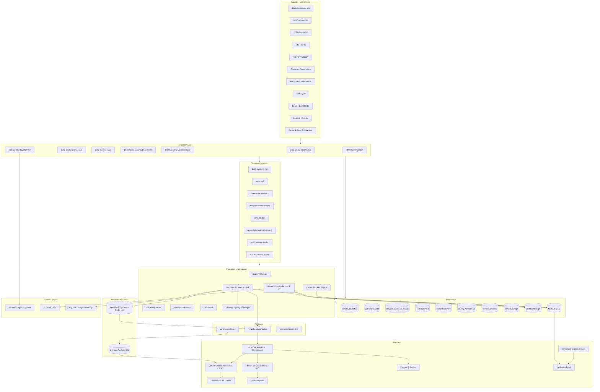
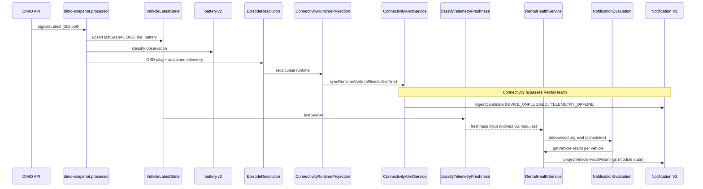
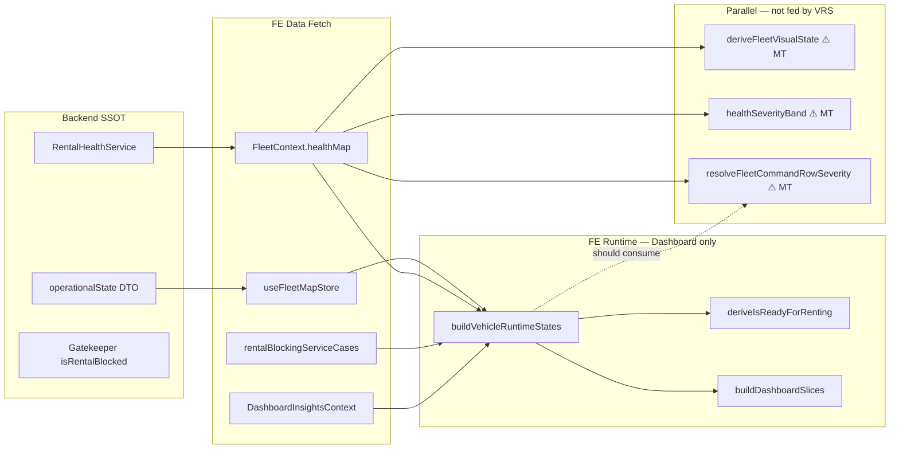
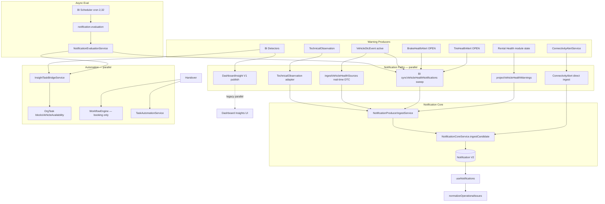
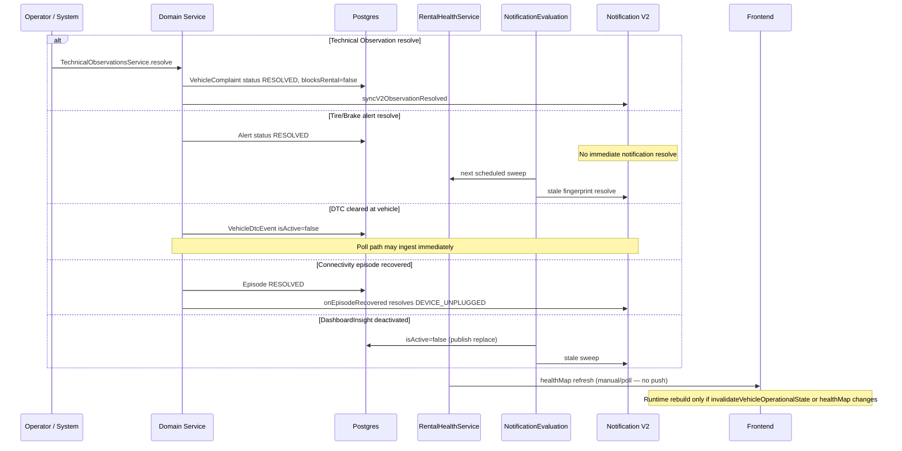
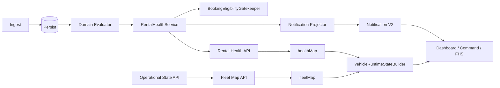

# Vehicle Warnings — End-to-End Data Lineage (Prompt 4/26)

| Feld | Wert |
|------|------|
| **Audit-ID** | `vehicle-warnings-production-readiness-2026-07` |
| **Prompt** | **4 von 26** — Warning Data Lineage |
| **Erstellt (UTC)** | 2026-07-25 |
| **Basis-Commit** | `1d0f2caebe56aa1ecd23295aa33d20e953daa95d` |
| **Vorgänger** | [`00-audit-charter`](./00-audit-charter-2026-07.md), [`01-repository-inventory`](./01-repository-inventory.md), [`02-canonical-status-model`](./02-canonical-status-model.md) |
| **Modus** | **Analyse only** |
| **Produktionsdaten verändert** | **Nein** |

---

## 1. Executive Summary

SynqDrive hat **keine einzelne Warning-Pipeline**. Fahrzeugwarnungen entstehen über **mindestens fünf parallele Pfade**:

1. **Domain Health** (Battery/Tire/Brake/DTC/Service/Complaints/HM) → `RentalHealthService` → Notifications V2
2. **Connectivity** (DIMO Webhooks + Episodes) → `ConnectivityAlertService` → Notifications V2 (direkt, ohne Rental Health)
3. **Business Insights** (Detektoren) → `DashboardInsight` V1 + Notification-Sweep
4. **Technical Observations** → `VehicleComplaint` → Rental Health + Notification Adapter
5. **Frontend Runtime** → `vehicleRuntimeStateBuilder` → Dashboard/Fleet Command (client-seitige Aggregation)

**Kernbefund:** Ingestion → Persistenz ist weitgehend tenant-scoped; **Projektion → UI** hat mehrere Read Models, Cache-Fenster (45s Rental-Health-Fleet, 30s Fleet-Map, debounced Notification-Eval ~120s) und **keine durchgängige Invalidierungskette** von Domain-Recalc bis Dashboard-Runtime.

Pfade mit **Multi-Truth-Risiko** sind im Dokument mit `⚠️ MT` markiert.

---

## 2. Lineage-Schritte (Referenzschema)

Jede Quelle wird über **16 Schritte** verfolgt:

| # | Schritt |
|---|---------|
| 1 | Provider-/User-Ereignis |
| 2 | Controller / Ingestion Handler |
| 3 | Validierung |
| 4 | Mandantenauflösung (`organizationId`) |
| 5 | Zeitstempelbehandlung |
| 6 | Persistenz |
| 7 | Queue / Job |
| 8 | Auswertungsservice |
| 9 | Finding-/Warning-Erzeugung |
| 10 | Projektion / Aggregation |
| 11 | API |
| 12 | Frontend Hook / Store |
| 13 | UI-Komponente |
| 14 | Notification |
| 15 | Workflow Automation |
| 16 | AI Context |

---

## 3. Gesamtarchitektur



**Legende:** `⚠️ MT` = Pfad kann zweite Wahrheit erzeugen (siehe §10).

---

## 4. Telemetrie → Finding



### 4.1 DIMO Snapshots

| # | Schritt | Implementierung |
|---|---------|-----------------|
| 1 | Provider | DIMO GraphQL `signalsLatest(tokenId)` |
| 2 | Handler | `DimoSnapshotScheduler` → `dimo-snapshot.processor.ts` |
| 3 | Validierung | Fehler wenn kein `signalsLatest`; stale metric >5min |
| 4 | orgId | `Vehicle.organizationId` am Job-Start; **VLS ohne orgId-Spalte** |
| 5 | Zeit | `sourceTimestamp` = provider `lastSeenAt`; `providerFetchedAt` = worker now |
| 6 | Persistenz | `VehicleLatestState`, `DimoPollLog`, optional ClickHouse |
| 7 | Queue | `dimo.snapshot.poll`, `jobId=snapshot-{vehicleId}` |
| 8 | Auswertung | Battery V2 classify; Trip-Start-Eval; Episode-Resolution aus OBD |
| 9 | Warning | Indirekt über Module + Connectivity-Runtime-Alerts |
| 10 | Aggregation | `RentalHealthService`; `VehicleConnectivityRuntimeProjectionService` |
| 11 | API | Vehicle detail, fleet-connectivity, rental-health reads |
| 12 | FE | `telemetryFreshness.ts`, `useVehicleHealth` |
| 13 | UI | Fleet Map, Vehicle Detail Header, Connectivity Tab |
| 14 | Notification | `TELEMETRY_OFFLINE`, `TELEMETRY_SOFT_OFFLINE` via ConnectivityAlert |
| 15 | Workflow | **Nicht verdrahtet** (`vehicle.health.*` triggers existieren, kein Emitter) |
| 16 | AI | `ai-get-vehicle-telemetry-status.tool.ts` |

**Risiken:** ⚠️ MT — VLS ohne `organizationId`; Cache-Freshness vs. `sourceTimestamp`; stuck `jobId` blockiert Re-Enqueue.

### 4.2 DIMO Live-Daten

Kein separater High-Frequency-Poll. **30s Snapshots = Live-Spine.** Resume-Gap-Backfill via `TripReconciliationService` wenn Scheduler-Tick >3min.

### 4.3 DIMO Segments

| # | Schritt | Implementierung |
|---|---------|-----------------|
| 1 | Provider | DIMO GraphQL Trip/Energy Segments |
| 2 | Handler | `TripDetectionOrchestrationService` (via Snapshot-Trigger) |
| 3 | Validierung | Trip FSM, CUSUM End-Detection |
| 4 | orgId | `VehicleTrip.organizationId` |
| 5 | Zeit | Segment start/end |
| 6 | Persistenz | `VehicleTrip`, `DrivingEvent`, enrichment JSON |
| 7 | Queue | `TRIP_TRACKING`, `TRIP_BEHAVIOR_ENRICHMENT` |
| 8 | Auswertung | `DrivingAssessmentDeviceQualityService` |
| 9 | Warning | `DRIVING_ASSESSMENT_DEVICE_QUALITY` Insight + Technical Observation |
| 10 | Aggregation | BI Detector → `DashboardInsight` |
| 11–13 | API/FE/UI | Trip Views, Device Quality Card |
| 14 | Notification | BI sweep + device-quality adapter |
| 15 | Workflow | Nicht verdrahtet |
| 16 | AI | Trip analytics tools |

**Hinweis:** Segments definieren **kanonische Trip-Grenzen** — erzeugen keine direkten Health-Warnings, nur indirekt über Device Quality.

### 4.4 DIMO Webhooks

| Event | Handler | Warning-Pfad |
|-------|---------|--------------|
| `obdDTCList` | `dimo-webhook.controller` → `DtcService.upsertDtc` | **Lücke:** kein clear, kein `ingestVehicleHealthSources` |
| `obdIsPluggedIn` | → `DeviceConnectionWebhookInbox` → Episode | `ConnectivityAlertService` |
| RPM/Speed/Ignition | Debug/ignored | — |

**⚠️ MT — DTC Webhook vs. Poll:** Poll macht Full-Diff + `emitDtcHealthNotifications`; Webhook nur Upsert → Warnings können bis nächste Eval/Poll verzögert sein; Codes am Fahrzeug gelöscht bleiben in DB.

### 4.5 DTC-Daten

| # | Schritt | Implementierung |
|---|---------|-----------------|
| 1 | Provider | DIMO Poll (3h) + Webhook `obdDTCList` |
| 2 | Handler | `dimo-dtc.processor` / `dimo-webhook.controller` |
| 3 | Validierung | Poll: `DTC_PATTERN`; Webhook: comma-split only |
| 4 | orgId | Poll: `vehicle.organizationId`; **VehicleDtcEvent ohne orgId** |
| 5 | Zeit | Poll: signal timestamp; Webhook: `new Date()` |
| 6 | Persistenz | `VehicleDtcEvent`, `VehicleLatestState.obdDtcList` |
| 7 | Queue | `dimo.dtc.poll` → fan-out per vehicle |
| 8 | Auswertung | `DtcService.getSummary` (6h stale threshold) |
| 9 | Warning | `ACTIVE_DTC` notifications; `error_codes` Rental Health module |
| 10 | Aggregation | `RentalHealthService.evaluateErrorCodes` |
| 11 | API | `GET vehicles/:id/dtc/summary` |
| 12 | FE | `HealthErrorsView`, rental-health DTC tones |
| 13 | UI | Error Codes Tab, Health Module Chips |
| 14 | Notification | Poll: real-time `ingestVehicleHealthSources`; Sweep: projector |
| 15 | Workflow | Nicht verdrahtet |
| 16 | AI | `DtcKnowledgeService`, health summary tool |

**Side path:** `BrakeDtcEvidenceProducer` → Brake evidence → optional `BRAKE_CRITICAL`.

### 4.6 Connectivity Events

| # | Schritt | Implementierung |
|---|---------|-----------------|
| 1 | Provider | Webhook unplug/plug; Snapshot OBD; sustained telemetry recovery |
| 2 | Handler | `device-connection-webhook-processing.service.ts` |
| 3 | Validierung | Inbox dedup `providerEventId`; 30s dedup bucket; impulse suppression |
| 4 | orgId | `findVehicleByTokenId`; Inbox kann temporär `organizationId=null` |
| 5 | Zeit | `observedAt` webhook; `receivedAt` intake |
| 6 | Persistenz | `DimoDeviceConnectionEvent` → `DeviceConnectionEpisode` |
| 7 | Queue | `connectivity.webhook.process` |
| 8 | Auswertung | `DeviceConnectionEpisodeResolutionService` |
| 9 | Warning | `DEVICE_UNPLUGGED`, `DEVICE_RECONNECTED`, `TELEMETRY_*`, `AUTHORIZATION_REQUIRED` |
| 10 | Aggregation | `VehicleConnectivityRuntimeStateBuilder` |
| 11 | API | `GET .../fleet-connectivity` |
| 12 | FE | `useFleetConnectivityList`, OBD plug index |
| 13 | UI | `FleetConnectivityTab`, trip chips |
| 14 | Notification | **Direkt** `NotificationCoreService.ingestCandidate` — **ohne** Rental Health |
| 15 | Workflow | Nicht verdrahtet |
| 16 | AI | Connectivity slice in health summary tool |

**⚠️ MT:** Physisches Unplug (Episode) und Telemetry-Offline (Runtime) sind **unabhängige Alert-Familien**.

---

## 5. Health-Module → Finding

### 5.1 Batterieauswertung

| # | Schritt | Pfad |
|---|---------|------|
| 1 | DIMO Snapshot battery signals | |
| 2–4 | `BatteryV2SnapshotObservationProducer` | orgId via vehicle |
| 5 | Provider/snapshot timestamps | |
| 6 | Assessments, evidence, publication (`BatteryAssessment`, `BatteryPublication`) | |
| 7 | `battery.v2` queue | |
| 8 | `BatteryV2Processor` → handlers (classify, assessment, publication) | |
| 9 | `evaluateBatteryReadiness` → `blocksRental` candidate | |
| 10 | `CanonicalBatteryHealthService` → `RentalHealthService.evaluateBattery` | |
| 11 | `GET rental-health` (detail live; fleet cached) | |
| 12 | `useVehicleHealth`, `FleetContext.healthMap` | |
| 13 | `VehicleHealthBox`, Battery tab, FHS module chips | |
| 14 | `BATTERY_CRITICAL` via projector + `BatteryCriticalDetector` | |
| 15 | `BatteryTaskService` (task materialization) | |
| 16 | `AiHealthCareAggregationService`, AI health summary tool | |

**Cache-Lücke:** Battery recalc **invalidiert nicht** `rental-health-summary` Redis (nur Bookings/Handover/Review-Overrides).

### 5.2 Reifenbewertung

| # | Schritt | Pfad |
|---|---------|------|
| 1 | DIMO snapshot tire pressures + HM `TIRE_PRESSURE` | |
| 6 | Tire setup, measurements, `TireHealthSnapshot` | |
| 7 | `dimo.tire.recalculation` (hourly) + direkte `recalculate()` aus Lifecycle | |
| 8 | `TireHealthService.recalculate()` | |
| 9 | `TireHealthAlertService.syncAlerts()` → `TireHealthAlert` OPEN/RESOLVED | |
| 10 | `buildTireModuleHealth()` in Rental Health | |
| 14 | Per-alert notification sources in BI sync + `TIRE_CRITICAL` | |

**⚠️ MT:** DIMO + HM als **duale Druckquellen** in einen Evaluator — kein doppeltes Alert, aber Datenherkunft gemischt.

### 5.3 Bremsbewertung

| # | Schritt | Pfad |
|---|---------|------|
| 1 | DIMO braking events, DTC, trips, service events | |
| 7 | `dimo.brake.recalculation`, `trip.driving-impact.compute` | |
| 8 | `BrakeRecalculationOrchestrator` → `BrakeHealthService` | |
| 9 | `BrakeHealthAlertService.syncAlerts()` | |
| 10 | `buildBrakeModuleHealth()` | |
| 14 | Per-alert + `BRAKE_CRITICAL` + DTC brake evidence path | |

### 5.4 High Mobility Health

| # | Schritt | Pfad |
|---|---------|------|
| 1 | HM MQTT push / REST poll (skips MQTT-connected vehicles) | |
| 6 | `hm_latest_health_state`, `hm_signal_group_states` | |
| 7 | **Kein Calculation-Queue** — store-and-stage | |
| 10 | `HmSignalUsageService` → Rental Health `vehicle_alerts`, tire pressure input | |
| 16 | `AiHealthCareAggregationService` — **unabhängig** von `rental_blocked` |

---

## 6. Finding → Runtime State



| Schritt | Was passiert | Risiko |
|---------|--------------|--------|
| Rental Health API → `healthMap` | `useFleetHealthMap` — fleet route **cached 45s** | Stale fleet badges |
| Vehicle detail API | `useVehicleHealth` — **live** | Detail vs. Fleet inkonsistent |
| `buildVehicleRuntimeStates` | Kombiniert fleet + health + insights + service cases | Nur bei Dashboard-VM-Rebuild |
| `addHealthReasons` | Module warning/critical → Reasons **non-blocking** unless `rental_blocked` | ⚠️ MT vs. FHS „Technisch prüfen“ |
| `deriveIsReadyForRenting` | Strict: available + clean + no block + not offline | Strenger als Backend-Gate allein |
| `deriveFleetVisualState` | **Eigene** Hierarchie: blocked > offline > attention > ready | ⚠️ MT — umgeht Runtime |

**Invalidierung Frontend:**

| Trigger | `invalidateVehicleOperationalState` | `rentalHealthSummaryCache` (BE) |
|---------|-------------------------------------|--------------------------------|
| Handover pickup/return | ✅ | ✅ |
| Booking mutate | ✅ | ✅ (vehicleIds) |
| Vehicle status PATCH | ✅ | — |
| Technical observation CRUD | ❌ (nur `reloadHealth`) | ❌ |
| Damage CRUD | ❌ | ❌ |
| Tire/brake/battery recalc | ❌ | ❌ |
| DTC poll | ❌ | ❌ |

---

## 7. Runtime State → UI

```mermaid
flowchart TB
  subgraph inputs [Runtime Inputs]
    VRS[VehicleRuntimeState[]]
    HC[healthMap]
    FMS[fleetVehicles]
  end

  subgraph dashboard [Dashboard]
    SLICES[dashboardRuntime.slices]
    KPI[ControlKpiStrip]
    DRAWER[DashboardDrilldownDrawer]
    CRIT[critical-alerts slice]
  end

  subgraph fleet_cmd [Fleet Command]
    TABS[canonicalTabCounts / resolveFleetTabCountsFromRuntime]
    ROW[FleetOperatorRow severity]
    FVS2[deriveFleetVisualState fallback ⚠️ MT]
  end

  subgraph fhs [Zustand & Service]
    VM[buildFleetHealthServiceViewModel]
    KPI_FHS[FleetHealthServiceKpiStrip]
    LIST[PrioritizedList]
  end

  subgraph picker [Booking]
    PREF[resolveBookingVehiclePreflight]
  end

  VRS --> SLICES
  SLICES --> KPI
  SLICES --> DRAWER
  SLICES --> CRIT
  VRS --> TABS
  VRS --> ROW
  FMS --> FVS2
  HC --> VM
  VM --> KPI_FHS
  VM --> LIST
  HC --> PREF
  FMS --> PREF
```

| UI-Oberfläche | Primäre Datenquelle | Sekundär / Fallback | ⚠️ MT |
|---------------|--------------------|-----------------------|-------|
| Dashboard KPI „Bereit“ | `ready-to-rent` slice aus VRS | — | |
| Dashboard „Critical“ | `critical-alerts` slice | `isCritical` flag | Ja — vs. FHS critical count |
| Fleet Command Tabs | `resolveFleetTabCountsFromRuntime` | `computeCommandTabCounts` (operational only) | Ja wenn Runtime fehlt |
| Fleet Command Severity | `canonicalCriticalVehicleIds` | `hasCriticalHealthModule` scan | **Ja** |
| Fleet Map Marker | `deriveFleetVisualState` | `vehicle.healthStatus` legacy | **Ja** |
| FHS KPI Strip | `healthSeverityBand(healthMap)` | — | Ja — andere Zählerlogik |
| Booking Picker | `resolveBookingVehiclePreflight` | `isVehicleOffline` separat | Ja — offline-Schwelle |
| Notification Panel | `useNotifications` V2 + merge bridge | Legacy insights fallback | Ja |

---

## 8. Finding → Notification / Automation



### Notification-Pfade im Detail

| Pfad | Latenz | Stale-Resolve |
|------|--------|---------------|
| Connectivity direct ingest | Near-real-time | Episode resolve → `onEpisodeRecovered` |
| DTC poll → `ingestVehicleHealthSources` | Nach Poll (~3h max) | Nächster Sweep |
| DTC webhook | **Verzögert** bis Eval/Poll | Gleich |
| Rental Health projector (scheduled) | Debounced org eval (~120s default) + cron 30min | `syncVehicleHealthWarnings` fingerprint stale resolve |
| Tire/Brake per-alert | BI sweep only | Alert RESOLVED → nächster Sweep |
| DashboardInsight V1 | BI publish | Deactivate on next run |
| Technical Observation V2 | Canonical CRUD sync | Resolve on dismiss — **nicht** handover path |

**⚠️ MT:** Bis zu **4 parallele Notification-Quellen** für dasselbe Fahrzeug (V1 Insight, V2 Health, V2 Connectivity, per-alert Tire/Brake).

### Workflow Automation

| Trigger (definiert) | Produktiv verdrahtet |
|---------------------|---------------------|
| `vehicle.health.warning/critical` | **Nein** |
| `booking.returned/completed` | **Ja** (Handover) |
| InsightTaskBridge | BI eval → Tasks (nicht Workflow) |
| TaskAutomationService | Booking lifecycle, handover, cleaning |

---

## 9. Resolve Flow



### Resolve-Gaps (prüfpflichtig)

| Szenario | Erwartung | Ist | Risiko |
|----------|-----------|-----|--------|
| Finding geschlossen, Notification aktiv | Notification RESOLVED | Batch sweep lag bis 30min | **P1** |
| Alert RESOLVED, Rental Health sofort aktualisiert | Live on next `getVehicleHealth` | Detail live; fleet cache 45s | **P2** |
| Observation dismissed, Dashboard ready sofort | Runtime not_ready weg | Nur wenn `healthMap` reload | **P1** |
| Handover observation created | V2 notification ACTIVE | **Kein** V2 sync im Handover-tx | **P1** |
| Gatekeeper BLOCKED, UI zeigt ready | Fail-closed | Runtime kann ready zeigen wenn nur Task blockt | **P0** |

---

## 10. Multi-Truth-Pfade (⚠️ MT Register)

| ID | Pfad A | Pfad B | Symptom |
|----|--------|--------|---------|
| **MT-01** | `vehicleRuntimeStateBuilder.isCritical` | FHS `healthSeverityBand critical` | Critical-Zähler (SYM-05) |
| **MT-02** | `deriveFleetVisualState.ready` | `deriveIsReadyForRenting` | Verfügbar vs. Nicht bereit (SYM-02) |
| **MT-03** | `RentalHealthService.rental_blocked` | `OrgTask.blocksVehicleAvailability` | Gate vs. UI readiness |
| **MT-04** | `Notification` V2 | `DashboardInsight` V1 | Doppelte Warnungen |
| **MT-05** | DTC Poll notifications | DTC Webhook upsert only | Verzögerte/fehlende Warnings |
| **MT-06** | `ConnectivityAlertService` | `RentalHealth` telemetry module | Offline-Darstellung (SYM-03) |
| **MT-07** | Fleet health cache (45s) | Detail rental-health live | Count drift (SYM-01) |
| **MT-08** | `resolveTelemetryFreshness` | `deriveTelemetryState` (Runtime) | `signal_delayed` vs `soft_offline` naming |
| **MT-09** | `fleet-operator-panel` health scan | Runtime canonical IDs | Fleet Command severity |
| **MT-10** | `VehicleDamage.rentalImpact` | `rental_blocked` | Schaden blockiert UI, nicht Gate |
| **MT-11** | HM tire pressure + DIMO snapshot | Single tire evaluator | Datenherkunft, eine Wahrheit |
| **MT-12** | `AiHealthCareAggregation` | `rental_blocked` | AI sagt „kritisch“, Fahrzeug buchbar |

---

## 11. Quellen-Übersicht (16-Schritt-Kompakt)

### 11.1 Operator App / manuelle Notizen

| 1–16 Kurz | `TechnicalObservationsController` → `assertVehicleInOrg` → `VehicleComplaint` → `syncV2Observation*` → `evaluateComplaints` → `rental_blocked` → `useVehicleHealth` → `TechnicalObservationsHealthModule` → V2 adapter → InsightTaskBridge **nicht** direkt → AI summary |

**Bypass:** Legacy `vehicles.service.createComplaint`; Handover-tx `vehicleComplaint.create` ohne Service.

### 11.2 Pickup / Return Inspection

| 1–16 Kurz | `BookingsHandoverService.createHandover` → Pickup Gate (`BookingEligibilityRecheck`) → Protocol + Status → Damages link + Observations in tx → `fleetMapCache`/`rentalHealthSummaryCache` invalidate → `invalidateVehicleOperationalState` → Workflow events → **kein** V2 obs sync |

### 11.3 Schäden

| 1–16 Kurz | `DamagesService` → `VehicleDamage.rentalImpact` → Repair Tasks → **nicht** in `collectBlockingReasons` → `getStats` FE → Damage UI → **kein** Notification ingest |

**⚠️ MT-10:** `BLOCK_RENTAL` damage ≠ `rental_blocked`.

### 11.4 Service-/Prüftermine

| 1–16 Kurz | `ServiceComplianceService` → BI Detectors (`SERVICE_OVERDUE`, TÜV, BOKraft) → `DashboardInsight` → `service_compliance` module → TÜV/BOKraft in `blocking_reasons` → InsightTaskBridge → `ServiceOverdueTaskService` → FHS + Dashboard insights |

### 11.5 Booking- und Rental-Lifecycle

| 1–16 Kurz | `BookingsService` mutations → `operationalState` on fleet-map → `BookingEligibilityGatekeeper` → `BookingEligibilityRecheck` (rule publish, mutation, pickup precheck, scheduler) → `BookingEligibilityDecision` → `invalidateVehicleOperationalAfterBookingChange` → `deriveBookingState` in Runtime → Booking Picker |

### 11.6 Rules Engine

| 1–16 Kurz | `RentalRulesService` publish → `BookingEligibilityRecheck.processRulePublishRechecks` → `RentalEffectiveRulesService` → Gate slices → BI Detectors (tenant policy) → InsightTaskBridge (full gated set, not published subset) → Decision with `RULE_PUBLISH_RECHECK` |

### 11.7 Background Jobs

| Job | Queue | Rolle |
|-----|-------|-------|
| Notification evaluation | `notification.evaluation` | Org-debounced BI + health notification sweep |
| BI scheduler | Cron `2,32 * * * *` | Triggers eval per org |
| Tire recalc | `dimo.tire.recalculation` | Hourly |
| Brake recalc | `dimo.brake.recalculation` | Hourly + trip impact |
| Battery V2 | `battery.v2` | Snapshot-triggered |
| DTC poll | `dimo.dtc.poll` | 3h |
| Snapshot | `dimo.snapshot.poll` | 30s |
| Eligibility recheck | Scheduler 30s | Due rechecks |
| Task automation outbox | `task.automation` | Failed automation replay |

### 11.8 Workflow Automation

| 1–16 Kurz | `WorkflowEngineService` — nur `booking.returned/completed` produktiv; `vehicle.health.*` **ohne Producer**; `notification.prepare` action separat von V2 lifecycle |

---

## 12. Spezialprüfungen (Charter Prompt 4)

| Prüfpunkt | Befund | Evidenz | Priorität |
|-----------|--------|---------|-----------|
| **Verlorene organizationId** | `VehicleDtcEvent`, `VehicleLatestState` ohne orgId-Spalte; Damage `findByVehicle` vehicle-scoped; DC Inbox temporär null | Schema + Services | **P1** |
| **Doppelte Verarbeitung** | DC webhook 30s dedup; DTC upsert idempotent; Snapshot `jobId` dedup; **DTC webhook+poll divergent** | dimo modules | **P1** |
| **Eventual-Consistency-Fenster** | 45s rental-health fleet cache; 30s fleet-map; ~120s notification debounce; 30min BI cron | Cache TTLs | **P1** |
| **Cache-Staleness** | Tire/brake/battery/DTC/HM recalc **invalidiert nicht** fleet health cache | grep `rentalHealthSummaryCache.invalidate` | **P1** |
| **Getrennte Read Models** | Rental Health, Runtime, FleetVisual, FHS Band, Notifications, Insights | §7, §10 | **P0** |
| **Direkte DB-Abfragen umgehen Services** | Handover tx: complaints, damages; Workflow `execVehicleStatusUpdate` | `bookings-handover.service.ts` | **P0** |
| **UI-Ableitung aus Rohdaten** | `fleetVisualState` nutzt `vehicle.healthStatus` legacy; Command severity health-scan fallback | `fleetVisualState.ts`, `fleet-operator-panel.ts` | **P1** |
| **Unterschiedliche Zeitquellen** | `sourceTimestamp` vs `providerFetchedAt` vs `receivedAt` vs worker `now` | Snapshot, webhook, DTC | **P1** |
| **Race Conditions** | Episode open P2002; concurrent resolution webhook vs snapshot; optimistic episode `updateMany` | connectivity modules | **P2** |
| **Warning erzeugt, Readiness nicht rebuilt** | Domain recalc → kein FE push; Runtime nur bei Dashboard-VM-Inputs | §6 | **P1** |
| **Readiness rebuilt, Cache nicht invalidiert** | Handover invalidiert; tire/brake/battery nicht | §6 Tabelle | **P1** |
| **Finding closed, Notification aktiv** | Batch sweep lag; handover obs kein resolve sync | §9 | **P1** |
| **Warning doppelt Snapshot+Webhook** | DTC: divergente Semantik; DC: dedup ok; Tire: DIMO+HM eine Evaluierung | §4.4, §5.2 | **P1** |

---

## 13. Kanonische Lineage-Kette (Soll)



**Ist-Abweichungen vom Soll:**
- Connectivity und Insights **umgehen** Rental Health für Notifications
- `fleetVisualState` und FHS **umgehen** Runtime für Zählung/Darstellung
- Tasks/ServiceCases/Damages **umgehen** `overall_state` für Blocking
- Kein einheitlicher **Resolve-Bus** (Notification vs. Insight vs. Alert row)

---

## 14. Queue-Referenz

| Queue | Scheduler | Warning-Relevanz |
|-------|-----------|------------------|
| `dimo.snapshot.poll` | 30s interval | Telemetry freshness, battery ingest, episode resolution |
| `dimo.dtc.poll` | 3h | DTC warnings |
| `connectivity.webhook.process` | — | Unplug/plug episodes |
| `battery.v2` | reconciliation cron | Battery readiness |
| `dimo.tire.recalculation` | hourly | Tire alerts |
| `dimo.brake.recalculation` | hourly | Brake alerts |
| `notification.evaluation` | BI cron + debounced events | Health notification sweep |
| `task.automation` | outbox | Task materialization |
| `trip.driving-impact.compute` | trip finalize | Brake recalc trigger |

Quelle: `backend/src/workers/queues/queue-names.ts`

---

## 15. Nächste Schritte (Prompt 5+)

1. **Callsite-Matrix** — jeder Consumer aus §7 mit Dimension + Owner (Prompt 3 Modell)
2. **Schwellen-Vergleich** — `isVehicleOffline` vs `deriveTelemetryState` vs `classifyTelemetryFreshness`
3. **Cross-Surface-Stichprobe** — gleiche `vehicleId` durch alle Read Models dokumentieren
4. **Invalidierungs-Gap-Remediation-Plan** — welche Domain-Events müssen `rentalHealthSummaryCache` + `invalidateVehicleOperationalState` triggern

---

## 16. Bestätigung Prompt 4

| Prüfpunkt | Status |
|-----------|--------|
| Code geändert | **Nein** |
| Produktionsdaten verändert | **Nein** |
| Remediation | **Nein** |

---

*Ende Warning Data Lineage — Prompt 4 von 26*
