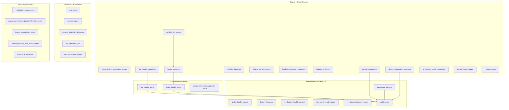

# Vehicle Warnings — Persistence Audit (Prompt 5/26)

| Feld | Wert |
|------|------|
| **Audit-ID** | `vehicle-warnings-production-readiness-2026-07` |
| **Prompt** | **5 von 26** — Persistentes Datenmodell |
| **Erstellt (UTC)** | 2026-07-25 |
| **Basis-Commit** | `1d0f2caebe56aa1ecd23295aa33d20e953daa95d` |
| **Vorgänger** | [`00-audit-charter`](./00-audit-charter-2026-07.md) … [`03-warning-data-lineage`](./03-warning-data-lineage.md) |
| **Modus** | **Analyse only** — keine Migrationen, keine Datenänderungen |
| **Produktionsdaten verändert** | **Nein** |

---

## 1. Executive Summary

SynqDrive speichert Vehicle-Warnungen **nicht in einer einheitlichen Finding-Tabelle**, sondern als **verteiltes Polyglot-Modell** über mindestens **18 relevante Tabellen** (Alerts, Observations, DTC, Connectivity-Episoden, Insights, Notifications, Tasks, Schäden, Projektionen, Evidence, Audit-Outboxen).

**Kernbefunde:**

| Thema | Urteil |
|-------|--------|
| Mandantensicherheit | **Teilweise** — viele Finding-Tabellen haben `organization_id`, aber Telemetry-/Evidence-/DTC-Tabellen oft nur `vehicle_id`; **keine DB-Composite-FKs** `child.organization_id = vehicle.organization_id` |
| Dedup | **Stark** bei Tire/Brake Alerts + Notifications; **schwach** bei DTC, DashboardInsight, VehicleComplaint |
| Zeitsemantik | **Inkonsistent** — `observedAt` / `receivedAt` / `firstSeenAt` / `detectedAt` / `evaluatedAt` / `resolvedAt` je nach Domäne unterschiedlich benannt und nicht überall vorhanden |
| Read vs Source | **Teilweise getrennt** — `*Current`, `VehicleLatestState`, `DashboardInsight`, `Notification` sind Projektionen; keine Runtime-/Readiness-Tabelle |
| Lifecycle-Audit | **Lückenhaft** — Notifications haben Occurrences; Tire/Brake Alerts nur Status-Spalten; Complaints ohne Event-Log |
| Hard Deletes | **Hohes Risiko** — `ON DELETE CASCADE` von `vehicles` löscht nahezu alle Warnungsnachweise |
| DB-Constraints | **Wenig** für Warning-Lifecycle — keine CHECKs für `resolved_at`/`status`-Kohärenz außerhalb Billing/Legal |

Read-only Reproduktionsqueries: [`queries/`](./queries/) (`01`–`08`).

---

## 2. Methodik

| Quelle | Verwendung |
|--------|------------|
| `backend/prisma/schema.prisma` | Primäres Schema (~13.8k Zeilen) |
| `backend/prisma/migrations/**/*.sql` | 267 Migrationen; Partial Indexes, Trigger, SQL-Funktionen |
| Application dedupe builders | `tire-health-alert.registry.ts`, `brake-health-alert.registry.ts`, `notification-fingerprint.factory.ts` |
| Vorgänger-Audits | Lineage MT-01–MT-12, Canonical Model D1–D9 |

**Nicht im Scope dieser Datei:** Redis-Cache (`RentalHealthSummaryCacheService`, 45s TTL) — kein persistiertes DB-Modell, aber relevante **Projektions-Staleness** (siehe §8).

---

## 3. Schema-Landschaft — Warnungs-relevante Tabellen

### 3.1 Klassifikation

### 3.2 Inventar nach Audit-Kategorie

| Kategorie | Prisma-Model | DB-Tabelle | `organizationId` | Rolle |
|-----------|--------------|------------|-------------------|-------|
| **Warnings / Alerts** | `TireHealthAlert` | `tire_health_alerts` | **NOT NULL** | Domain Finding (Reifen) |
| | `BrakeHealthAlert` | `brake_health_alerts` | **NOT NULL** | Domain Finding (Bremsen) |
| | `DeviceConnectionEpisode` | `device_connection_episodes` | **NOT NULL** | Connectivity Finding |
| **Findings (ohne Alert-Prefix)** | `VehicleComplaint` | `vehicle_complaints` | **NOT NULL** | Technical Observations |
| | `VehicleDtcEvent` | `vehicle_dtc_events` | **fehlt** | DTC Finding |
| | `MisuseCase` | `misuse_cases` | **NOT NULL** | Driving abuse Finding |
| | `VehicleDamage` | `vehicle_damages` | **nullable** | Schaden / Rental Impact |
| **Insights / Notifications** | `DashboardInsight` | `dashboard_insights` | **NOT NULL** | BI-Projektion V1 |
| | `Notification` | `notifications` | **NOT NULL** | Notification V2 Lifecycle |
| | `NotificationOccurrence` | `notification_occurrences` | **NOT NULL** | Append-only Occurrence Log |
| **Vehicle health read models** | `BrakeHealthCurrent` | `brake_health_current` | **nullable** | Bremsen-Projektion |
| | `BatteryFeatures` | `battery_features` | **fehlt** | LV-Batterie-Projektion |
| | `HvBatteryHealthCurrent` | `hv_battery_health_current` | **fehlt** | HV-Batterie-Projektion |
| | `HmLatestHealthState` | `hm_latest_health_states` | **fehlt** (VIN-keyed) | HM Health Latest |
| | `HmLatestTelemetryState` | `hm_latest_telemetry_states` | **fehlt** (VIN-keyed) | HM Telemetry Latest |
| **Telemetry snapshots** | `VehicleLatestState` | `vehicle_latest_states` | **fehlt** | DIMO/HM Latest 1:1 |
| | `HvBatteryHealthSnapshot` | `hv_battery_health_snapshots` | **fehlt** | HV Snapshot History |
| | `BatteryHealthSnapshot` | `battery_health_snapshots` | **fehlt** | LV Snapshot History |
| | `DimoPollLog` | `dimo_poll_logs` | **fehlt** | Poll Audit (vehicle optional) |
| **DTC** | `VehicleDtcEvent` | `vehicle_dtc_events` | **fehlt** | Active/cleared DTC rows |
| | `DtcKnowledge` | `dtc_knowledge` | **fehlt** (global KB) | Enriched code knowledge |
| **Observations** | `VehicleComplaint` | `vehicle_complaints` | **NOT NULL** | Manual/operator/system |
| | `DeviceConnectionTelemetryRecoveryObservation` | `device_connection_telemetry_recovery_observations` | **NOT NULL** | Recovery evidence |
| **Runtime / Readiness** | — | — | — | **Keine persistierte Tabelle** — computed (`RentalHealthService`, FE `vehicleRuntimeStateBuilder`) |
| **Tasks** | `OrgTask` | `org_tasks` | **NOT NULL** | `blocks_vehicle_availability`, `dedup_key` |
| | `ServiceCase` | `service_cases` | **NOT NULL** | `blocks_rental` |
| **Inspections** | `BookingHandoverProtocol` | `booking_handover_protocols` | **NOT NULL** | Pickup/Return; `warning_lights_on` |
| **Services** | `VehicleServiceEvent` | `vehicle_service_events` | **nullable** | Service compliance input |
| **Automation** | `OrgWorkflowRun` | `org_workflow_runs` | **NOT NULL** | Workflow execution |
| | `TaskAutomationOutbox` | `task_automation_outbox` | **NOT NULL** | Task automation queue |
| | `BookingEligibilityDecision` | `booking_eligibility_decisions` | **NOT NULL** | Rules engine snapshot |

**Legacy / deprecated:** `Vehicle.healthStatus` (`health_status` enum) — markiert deprecated in Schema; darf nicht als SSOT gelesen werden.

---

## 4. SQL-Infrastruktur (Migrationen)

### 4.1 Materialized Views / Views

**Keine** materialized views oder SQL views für Vehicle-Warnings gefunden (Repo-weite Suche in `backend/prisma/migrations`).

Warnungs-Read-Models sind **application-maintained tables** (`*_current`, `vehicle_latest_states`, `hm_latest_*`).

### 4.2 SQL-Funktionen (warning-relevant)

| Funktion | Migration | Warning-Bezug |
|----------|-----------|-------------|
| `rental_rules_revision_hash()` | `20260723130000_rental_rule_revisions` | Rules-Engine-Versionierung / Hash |
| `rental_rules_revision_rules_json()` | idem | Normalisierte Rules JSON |
| `tire_trip_usage_ledger_scope_guard()` | `20260716210000` | Tire-Trip-Ledger Tenant-Guard (indirekt Wear/Warnings) |

Billing-/Legal-Trigger (`billing_deny_row_mutation`, `billing_guard_*`) betreffen **nicht** Warning-Tabellen.

### 4.3 Trigger (warning-relevant)

| Trigger | Tabelle | Zweck |
|---------|---------|-------|
| `tire_trip_usage_ledger_scope_guard_trg` | `tire_trip_usage_ledger` | org/vehicle/trip/setup Konsistenz |

**Keine** DB-Trigger auf `tire_health_alerts`, `brake_health_alerts`, `notifications`, `vehicle_dtc_events`, `vehicle_complaints`.

### 4.4 Partial Unique Indexes (Dedup / Lifecycle)

| Index | Tabelle | Definition | Bewertung |
|-------|---------|------------|-----------|
| `notifications_active_fingerprint_generation_key` | `notifications` | UNIQUE `(organization_id, fingerprint, lifecycle_generation)` WHERE `status IN ('OPEN','ACKNOWLEDGED','SNOOZED')` | ✅ Stark — org-scoped active notification |
| `tire_health_alerts_open_dedupe_key_uidx` | `tire_health_alerts` | UNIQUE `(dedupe_key)` WHERE `status = 'OPEN'` | ⚠️ Dedupe-Key enthält `organizationId` in App-Code, DB-Index nicht org-prefix |
| `brake_health_alerts_dedupe_open_uniq` | `brake_health_alerts` | UNIQUE `(dedupe_key)` WHERE `status = 'OPEN'` | ⚠️ wie Tire |
| `brake_evidence_org_vehicle_dedupe_uniq` | `brake_evidence` | UNIQUE `(organization_id, vehicle_id, dedupe_key)` WHERE `dedupe_key IS NOT NULL` | ✅ org-scoped |
| `battery_evidence_dedup_key` | `battery_evidence` | UNIQUE `(vehicle_id, scope, value_type, source_type, observed_at)` | ⚠️ kein org in key |
| `org_tasks_org_dedup_key` | `org_tasks` | UNIQUE `(organization_id, dedup_key)` | ✅ (nullable `dedup_key` erlaubt Duplikate) |

---

## 5. Bewertung der 16 Prüffragen

| # | Frage | Urteil | Evidenz / Risiko-ID |
|---|-------|--------|---------------------|
| 1 | Ist `organizationId` überall zwingend? | **Nein** | `vehicle_dtc_events`, `vehicle_latest_states`, `battery_evidence`, `battery_features`, `hm_latest_*`, `vehicle_damages.organization_id` nullable → **PA-01** |
| 2 | Sind Beziehungen mandantensicher? | **Teilweise** | FK zu `vehicles`/`organizations` existiert, aber **kein** enforced `child.org = vehicle.org` → **PA-02** |
| 3 | Können zwei Organisationen dasselbe Finding referenzieren? | **Theoretisch ja** bei org-losen Child-Rows + falscher `vehicle_id`-Injection; praktisch durch App-Guards begrenzt → **PA-02** |
| 4 | Offene Duplikate für denselben Fahrzeugzustand? | **Ja, möglich** | DTC ohne DB-Unique; `dashboard_insights` ohne active-dedup unique; parallele Pfade Tire Alert + Notification + Insight → **PA-03** |
| 5 | Stabile `deduplicationKey`-Logik? | **Domänenabhängig** | Tire/Brake/Notification/OrgTask/MisuseCase: stabil; DTC/Complaint/Insight: app-level oder schwach → **PA-04** |
| 6 | `sourceObservedAt`, `detectedAt`, `receivedAt`, `evaluatedAt`, `resolvedAt` unterschieden? | **Teilweise** | Connectivity + Notifications gut; DTC nur `firstSeenAt`/`lastSeenAt`; Complaints nur `createdAt`/`resolvedAt`; keine globale Namenskonvention → **PA-05** |
| 7 | Rule-Versionierung vorhanden? | **Ja** | `rental_rule_revisions` (version, rules_hash, effective_from/to); `booking_eligibility_decisions` speichert `rule_revision_ids`, `rules_hash`, `engine_version` |
| 8 | Evidence nachvollziehbar gespeichert? | **Teilweise** | `battery_evidence`, `brake_evidence`, `tire_health_snapshots`, `misuse_case_evidence`, Episode-Audits; aber **überschreibbare** Latest-States → **PA-06** |
| 9 | Können Warnungen still überschrieben werden? | **Ja** | `vehicle_latest_states`, `brake_health_current`, `battery_features`, `dashboard_insights.is_active` batch updates → **PA-07** |
| 10 | Unveränderbarer Lifecycle-/Audit-Verlauf? | **Teilweise** | `notification_occurrences`, connectivity lifecycle audits, `booking_eligibility_decisions` append-only; Alerts/Complaints/DTC: **mutable rows** → **PA-08** |
| 11 | Hard Deletes können Beweise entfernen? | **Ja** | `vehicles` CASCADE → nahezu alle Warning-Tabellen; `notifications` CASCADE bei org delete → **PA-09** |
| 12 | Unbeschränkte JSON mit PII? | **Ja** | `raw_payload_json`, `template_params`, `customer_signature_data_url`, `meta_json`, handover notes → **PA-10** |
| 13 | Cascades / OnDelete stimmen? | **Teilweise** | Vehicle CASCADE löscht Evidence; `SetNull` auf Episode-Events; keine Soft-Delete-Strategie für Findings → **PA-09** |
| 14 | Indexe für aktive Findings sinnvoll? | **Größtenteils ja** | `(organization_id, status)`, `(vehicle_id, is_active)`; Lücken: `vehicle_complaints` ohne partial open index; `dashboard_insights` ohne `(org, dedupe_key, is_active)` unique → **PA-11** |
| 15 | Constraints gegen unmögliche Zustände? | **Schwach** | Keine CHECK `resolved_at IS NOT NULL WHEN status = RESOLVED` auf Alerts; DTC `is_active` + `cleared_at` nicht DB-enforced → **PA-12** |
| 16 | Read Models vs Source Records getrennt? | **Teilweise** | `*Current`/Latest vs Evidence/Snapshots/Alerts; aber `DashboardInsight` und `Notification` parallel; Runtime **nur** in-memory/Redis → **PA-13** |

---

## 6. Detailanalyse nach Domäne

### 6.1 Notifications V2 (`notifications`)

**Stärken:**
- `organization_id` NOT NULL + FK CASCADE
- Partial unique für aktive Lifecycle-Generation
- `notification_occurrences` mit `occurred_at` vs `detected_at`
- `fingerprint` enthält `organizationId` (6-Segment-Format in `notification-fingerprint.factory.ts`)
- `version` Optimistic-Concurrency auf Notification-Row

**Schwächen:**
- `legacy_insight_id` ohne FK — Bridge zu DashboardInsight, Divergenz möglich (MT-03)
- Status-Übergänge nicht DB-enforced
- `template_params` JSON unbounded — PII möglich
- Resolved Notification + offenes Domain-Alert: keine FK-Kopplung

**Relevante Indexe:** `(organization_id, status, last_seen_at)`, `(organization_id, domain, status)`, partial active unique.

### 6.2 Dashboard Insights V1 (`dashboard_insights`)

**Stärken:** `organization_id`, `dedupe_key`, `is_active`, `calculation_meta`, `run_id` Provenance.

**Schwächen:**
- **Kein** UNIQUE auf `(organization_id, dedupe_key)` für `is_active = true`
- Batch-Publish kann mehrere aktive Rows pro dedupeKey erzeugen (bis App deduped)
- Kein separates Occurrence-Log — nur `updated_at`

### 6.3 Tire / Brake Health Alerts

**Stärken:**
- `dedupe_key` builder inkl. `organizationId|vehicleId|...`
- Partial UNIQUE open dedupe
- `evidence_fingerprint`, `resolution_reason`, `opened_at`/`last_seen_at`/`resolved_at`
- `model_snapshot_id` (Brake) → Snapshot-Provenance

**Schwächen:**
- Kein append-only State-Transition-Log (nur mutable row)
- `severity` als freier `String` (kein Enum in DB für Tire)
- Brake migration: initial **kein** `organization_id` FK in SQL (nur NOT NULL column) — Prisma schema hat FK

### 6.4 DTC (`vehicle_dtc_events`)

**Schwächen (PA-03, PA-04, PA-12):**
- **Kein** `organization_id`
- **Kein** DB-Unique auf `(vehicle_id, dtc_code)` WHERE `is_active`
- Upsert nur in `DtcService.upsertDtc` via `findFirst` — Race → Duplikate möglich
- `clearedAt` + `isActive` nicht CHECK-constrained
- Historische cleared Rows bleiben; mehrere inactive rows pro code möglich

**Indexe:** `(vehicle_id, is_active)`, `(vehicle_id, last_seen_at)` — ausreichend für Hot Queries.

### 6.5 Technical Observations (`vehicle_complaints`)

**Stärken:** `organization_id` NOT NULL, `blocks_rental`, `impact`, category/affected_area enums, status lifecycle.

**Schwächen:**
- Kein `dedupe_key` — Duplikate bei wiederholten Imports möglich
- Kein Observation-Event-Log (nur `updated_at`)
- Kein `source_observed_at` — nur `created_at`
- Keine FK zu `booking_id`/`handover_protocol_id` in Schema (nur indexed columns)

### 6.6 Connectivity (`device_connection_*`)

**Stärken:**
- Rich timestamp model: `observed_at`, `received_at`, `processed_at`
- Dedup via `dedup_bucket` UNIQUE auf Events
- Episode lifecycle + resolution audit tables (append-only)
- Webhook inbox mit processing status

**Schwächen:**
- `device_connection_webhook_inbox.organization_id` **nullable** bis Mapping
- Episode status transitions nicht CHECK-enforced

### 6.7 Telemetry projections

| Tabelle | Überschreibbar | Zeitfelder | orgId |
|---------|------------------|------------|-------|
| `vehicle_latest_states` | Ja (1 row/vehicle) | `last_seen_at`, `source_timestamp`, `provider_fetched_at` | Nein |
| `hm_latest_health_states` | Ja (1 row/vin+app) | `last_received_at` | Nein |
| `hm_latest_telemetry_states` | Ja | `last_received_at` | Nein |
| `analytics_cache` | Ja | `expires_at` | Nein |

**PA-07:** Latest-State-Überschreibung verliert Historie — Snapshots (`hv_battery_health_snapshots`, `dimo_poll_logs`) kompensieren teilweise.

### 6.8 Battery / Brake evidence & current

| Tabelle | Typ | Dedup | orgId |
|---------|-----|-------|-------|
| `battery_evidence` | Source | `(vehicle_id, scope, value_type, source_type, observed_at)` | Nein |
| `brake_evidence` | Source | `(organization_id, vehicle_id, dedupe_key)` partial | Nullable |
| `brake_health_current` | Projection | — | Nullable |
| `battery_features` | Projection | — | Nein |

### 6.9 Tasks, Service, Damages, Booking

- **`org_tasks`:** `dedup_key` org-scoped unique; `blocks_vehicle_availability`; `alert_id` → DashboardInsight (lose coupling)
- **`service_cases`:** `blocks_rental`; org-scoped
- **`vehicle_damages`:** `rental_impact` enum; **`organization_id` nullable** (PA-01)
- **`booking_eligibility_decisions`:** append-only evaluation mit `evaluated_at`, `warnings` JSON, rule hashes — **starkes Audit-Modell**
- **`booking_handover_protocols`:** `warning_lights_on`, `warning_lights_notes`; unique `(booking_id, kind)`

### 6.10 Automation

- **`org_workflow_runs`:** `idempotency_key` unique per org; `workflow_version` gespeichert
- **`task_automation_outbox`:** idempotency + `rule_version`
- **`org_task_automation_rule_overrides`:** version + revision table

### 6.11 Misuse cases (Driving warnings)

- `fingerprint` **global UNIQUE** (enthält org+vehicle in App)
- `first_detected_at` / `last_detected_at`
- `misuse_case_evidence` append rows
- `informational_only` default true — Rental-Impact begrenzt

---

## 7. Zeitstempel-Matrix (Finding-relevant)

| Domäne | Source observed | Received / Ingested | Detected / Evaluated | First / Last seen | Resolved |
|--------|-----------------|---------------------|----------------------|---------------------|----------|
| DIMO snapshot → VLS | `source_timestamp` | `provider_fetched_at` | — | `last_seen_at` | — |
| DTC poll | — | `created_at` | — | `first_seen_at` / `last_seen_at` | `cleared_at` |
| Connectivity event | `observed_at` | `received_at` | `processed_at` | — | Episode `resolved_at` |
| Tire/Brake alert | `pressure_timestamp` (tire) | `opened_at` | — | `last_seen_at` | `resolved_at` |
| Notification | `occurred_at` (occurrence) | `created_at` | `detected_at` (occurrence) | `first_seen_at` / `last_seen_at` | `resolved_at` |
| Booking eligibility | — | `created_at` | `evaluated_at` | — | — |
| Vehicle complaint | — | `created_at` | — | — | `resolved_at` / `dismissed_at` |
| Misuse case | — | `created_at` | `first_detected_at` | `last_detected_at` | `resolved_at` |

**PA-05:** Kein durchgängiges `sourceObservedAt` auf Finding-Ebene; Rental Health recomputes zur Laufzeit.

---

## 8. Read Models vs Source Records

| Layer | Persistiert? | Beispiele | Invalidierung |
|-------|--------------|-----------|---------------|
| **Source events** | Ja | `dimo_device_connection_events`, `battery_evidence`, `brake_evidence` | Append + dedup |
| **Domain findings** | Ja | `tire_health_alerts`, `brake_health_alerts`, `vehicle_dtc_events`, `vehicle_complaints` | Upsert / status update |
| **Projections (DB)** | Ja | `brake_health_current`, `vehicle_latest_states`, `dashboard_insights`, `notifications` | Upsert / batch |
| **Projections (Redis)** | Nein (Cache) | Rental health fleet summary 45s | Teilweise — Domain-Recalc invalidiert nicht immer (MT-04) |
| **Runtime / Readiness** | **Nein** | `RentalHealthService.getVehicleHealth`, FE `vehicleRuntimeStateBuilder` | On-demand + FE cache |

**PA-13:** Drei Ebenen (Finding, DB-Projection, Compute/Redis) ohne durchgängige DB-seitige Konsistenzgarantie.

---

## 9. Soft Deletes & Audit Tables

**Soft delete:** Nur in Legal-Document-Modellen (`deleted_at`); **keine** Soft Deletes für Warning/Alert-Tabellen.

**Audit / Event tables (warning-relevant):**

| Tabelle | Append-only? | orgId |
|---------|--------------|-------|
| `notification_occurrences` | Ja | NOT NULL |
| `device_connection_episode_lifecycle_audits` | Ja | NOT NULL |
| `device_connection_episode_resolution_audits` | Ja | NOT NULL |
| `brake_recalculation_audit` | Ja | Nullable |
| `booking_eligibility_decisions` | Ja | NOT NULL |
| `booking_pickup_gate_audit_events` | Ja | NOT NULL |
| `task_events` | Ja | **fehlt** |
| `dashboard_insight_runs` | Ja | NOT NULL |
| `business_audit_outbox` | Outbox pattern | NOT NULL |

---

## 10. PII in JSON-Feldern (PA-10)

| Tabelle | Spalte | Risiko |
|---------|--------|--------|
| `vehicle_latest_states` | `raw_payload_json` | Telemetrie-Rohdaten |
| `dimo_device_connection_events` | `raw_payload_json` | Provider payload |
| `device_connection_webhook_inbox` | `raw_payload_json` | Webhook payload |
| `notifications` | `template_params` | Namen, Kennzeichen, Freitext |
| `tire_health_alerts` / `brake_health_alerts` | `template_params_json` | Lokalisierte Params |
| `booking_handover_protocols` | `customer_signature_data_url`, `staff_signature_data_url` | Signatur-Bilder |
| `vehicle_dtc_events` | `raw_payload` | OBD payload |
| `misuse_case_evidence` | `snapshot_json` | Trip context |
| `activity_logs` | `meta_json` | IP, user agent |

Keine DB-Längenlimits oder PII-Scrubbing-Constraints auf JSONB.

---

## 11. Risiko-Register (Persistence)

| ID | Severity | Befund |
|----|----------|--------|
| **PA-01** | P1 | `organization_id` fehlt oder ist nullable auf zentralen Warning-/Telemetry-Tabellen |
| **PA-02** | P1 | Keine DB-enforced Tenant-Join-Integrität (`child.org_id = vehicles.organization_id`) |
| **PA-03** | P1 | Offene DTC-/Insight-Duplikate möglich (kein partial unique) |
| **PA-04** | P2 | Uneinheitliche Dedup-Strategien über Domänen |
| **PA-05** | P2 | Zeitstempel-Semantik nicht normalisiert |
| **PA-06** | P2 | Evidence in Snapshots, aber Latest-States überschreibbar |
| **PA-07** | P1 | Stille Überschreibung von Projektionen ohne History |
| **PA-08** | P2 | Kein immutable Audit für Alert/Complaint Status-Wechsel |
| **PA-09** | P0 | Vehicle/org CASCADE hard-deletes entfernen Warning-Beweise |
| **PA-10** | P2 | Unbounded JSONB mit PII |
| **PA-11** | P2 | Fehlende partial unique / open-finding Indexe (Complaints, Insights) |
| **PA-12** | P2 | Fehlende CHECK constraints für Lifecycle-Invarianten |
| **PA-13** | P0 | Read Models (Insight, Notification, Current, Redis) ohne DB-Kohärenz |

---

## 12. Verknüpfung zu Lineage Multi-Truth (MT)

| MT-ID | Persistence-Bezug |
|-------|-------------------|
| MT-03 | `dashboard_insights` + `notifications` parallele Projektionen |
| MT-04 | Kein DB-Modell für Rental-Health-Cache — Redis TTL |
| MT-05 | Handover schreibt Complaints/Damages direkt — DB erzwingt keine Observation-Service-Pipeline |
| MT-06 | `vehicle_damages.rental_impact` persistiert, aber nicht in DB mit Rental-Health gekoppelt |

---

## 13. Read-only SQL Queries

| Datei | Zweck |
|-------|-------|
| [`01-warning-schema-inventory.sql`](./queries/01-warning-schema-inventory.sql) | Tabellen/Spalten/Index-Inventar aus `information_schema` |
| [`02-open-finding-duplicates.sql`](./queries/02-open-finding-duplicates.sql) | Duplikat-offene Alerts/DTC/Insights pro Fahrzeug |
| [`03-cross-tenant-integrity.sql`](./queries/03-cross-tenant-integrity.sql) | `organization_id`-Mismatch Child vs `vehicles` |
| [`04-orphaned-warning-records.sql`](./queries/04-orphaned-warning-records.sql) | Alerts/Notifications ohne gültiges Fahrzeug |
| [`05-invalid-lifecycle-timestamps.sql`](./queries/05-invalid-lifecycle-timestamps.sql) | Status/Timestamp-Inkonsistenzen |
| [`06-stale-active-findings.sql`](./queries/06-stale-active-findings.sql) | Aktive Findings mit altem `last_seen_at` |
| [`07-projection-divergence.sql`](./queries/07-projection-divergence.sql) | Zähler-Divergenz Finding vs Notification vs Insight |
| [`08-warning-index-analysis.sql`](./queries/08-warning-index-analysis.sql) | Index-Metadaten + `EXPLAIN` für Hot Queries |

**Ausführung:** Nur in kontrolliertem Audit-Kontext; Ergebnisse anonymisiert nach `evidence/`.

---

## 14. Empfehlungen (Dokumentation only — keine Umsetzung in diesem Prompt)

1. **Tenant-Spalten backfill + NOT NULL** auf `vehicle_dtc_events`, `vehicle_latest_states`, Evidence-Tabellen (PA-01).
2. **Partial UNIQUE** `(vehicle_id, dtc_code) WHERE is_active` (PA-03).
3. **Partial UNIQUE** `(organization_id, dedupe_key) WHERE is_active` auf `dashboard_insights` (PA-03).
4. **CHECK constraints** für `resolved_at`/`status` auf Alert-Tabellen (PA-12).
5. **Finding lifecycle audit** Tabelle oder Trigger für Complaints/Alerts (PA-08).
6. **Soft-delete / legal hold** für Vehicle-Warning-Evidence vor Vehicle CASCADE (PA-09).
7. **Normalized timestamp columns** auf Finding-Ebene dokumentieren und enforced (PA-05).

---

## 15. Nächste Audit-Schritte (Prompt 6+)

- Callsite-Matrix: welche API liest welche Tabelle vs Compute
- Cross-tenant Integrity Queries auf Staging/Prod-Sample ausführen
- Index `EXPLAIN` unter realistischer Cardinality
- Vergleich Prisma-Schema vs tatsächliche Prod-Migration-Drift

---

*Dokumentstatus: Prompt 5/26 abgeschlossen. Keine Code- oder Schema-Änderungen.*
