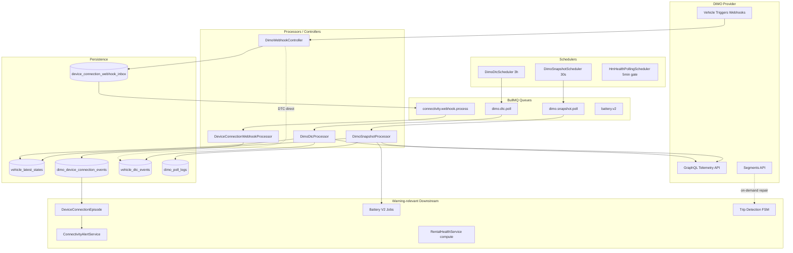

# Vehicle Warnings — Telemetry Ingestion Audit (Prompt 6/26)

| Feld | Wert |
|------|------|
| **Audit-ID** | `vehicle-warnings-production-readiness-2026-07` |
| **Prompt** | **6 von 26** — Telemetrie-Ingestion als Warnungsgrundlage |
| **Erstellt (UTC)** | 2026-07-25 |
| **Basis-Commit** | `1d0f2caebe56aa1ecd23295aa33d20e953daa95d` |
| **Vorgänger** | [`04-persistence-audit.md`](./04-persistence-audit.md) |
| **Modus** | **Analyse only** — keine Codeänderungen |
| **Produktionsdaten verändert** | **Nein** (VPS-Kadenz-Verifikation → späterer Prompt) |

---

## 1. Executive Summary

Telemetrie-Ingestion ist die **unterste Schicht** für DIMO-basierte Fahrzeugwarnungen: `VehicleLatestState`, DTC-Polls, Connectivity-Episoden, Trip/Segment-Rekonstruktion und nachgelagerte Health-Jobs (Battery V2, Tire/Brake Recalc) hängen alle an derselben Provider-Pipeline.

**Kernbefund:** Ingestion ist **funktional breit**, aber **zeitlich und semantisch fragmentiert**. Es gibt keine einheitliche Monotonic-Garantie auf `VehicleLatestState`, Webhook- und Poll-Pfade divergieren bei DTC, und Freshness wird überwiegend korrekt aus **Provider-`lastSeen`** abgeleitet — mit Ausnahmen bei Poll-Fehlern und Cache-Schichten.

| Bereich | Urteil |
|---------|--------|
| Snapshot Polling (30s) | Implementiert, resilient gegen stuck jobs; **kein Monotonic-Guard** auf VLS |
| Live Polling | **On-demand** (`getLiveGps`), kein Worker-Scheduler trotz `WORKER_LIVEMAP_*` env |
| Segments | **On-demand** (Trip Repair/Reconciliation), nicht kontinuierlich |
| Webhooks | Inbox + Queue + Dedup (30s Bucket); Dead Letter nach 5 Versuchen |
| DTC | Poll 3h + Webhook-Pfad **ohne Clear/Notification-Parität** (MT-02) |
| Timestamp-Semantik | Teilweise dokumentiert; **kein globales Feldschema** |
| Monitoring | Prometheus (`TripMetricsService`), Poll Logs, Connectivity Observability |

---

## 2. Ingestion-Architektur (Überblick)

---

## 3. DIMO-Kadenz — Soll vs Implementierung vs Konfiguration

| Pfad | Gewünschte / dokumentierte Kadenz | Implementiert (Code) | Runtime-Konfiguration | Prod-Kadenz (VPS) |
|------|-----------------------------------|----------------------|------------------------|-------------------|
| **Snapshot Poll** | ~30s Fleet-Telemetrie | `@Interval(30000)` in `dimo-snapshot.scheduler.ts` | `WORKER_SNAPSHOT_INTERVAL_MS=30000` in `worker.config.ts` — **Scheduler liest Config nicht** (hardcoded 30s) | **Offen** — VPS-Audit Prompt später |
| **Snapshot Worker** | Parallel, nicht blockierend | `concurrency: 5`, `lockDuration: 60s` | `WORKER_SNAPSHOT_CONCURRENCY=5` (env) — Processor hardcoded `concurrency: 5` | Offen |
| **DTC Poll** | 3h | `upsertJobScheduler` every `3 * 60 * 60 * 1000` ms | Kein dediziertes env (hardcoded) | Offen |
| **Live Map / GPS** | UI „few seconds“ (Fleet Map) | **Kein Scheduler** — `VehiclesService.getLiveGps()` on-demand | `WORKER_LIVEMAP_INTERVAL_MS=5000` in `.env.example` — **kein Consumer gefunden** | N/A (pull) |
| **Fleet Map API** | UI poll ~few sec | Redis cache TTL **5s** (`FLEET_MAP_CACHE_TTL_SECONDS`) | Kein env | Offen |
| **Trip Tracking** | 30s ACTIVE_TICK | `WORKER_TRIP_TRACKING_INTERVAL_MS` (default 30s) | `worker.config.ts` | Offen |
| **Segments** | Canonical trip boundaries (repair) | On-demand via `TripReconciliationService`, `DimoSegmentsService` | `useDimoSegmentFallback` on resume backfill | N/A |
| **HM Health REST** | Service 3×/day; Tire/AI 4h | `@Interval(5min)` gate in `hm-health-polling.scheduler.ts` | Per-group min intervals internal | Offen |
| **Connectivity Webhook** | Event-driven | Inbox → `connectivity.webhook.process` | `CONNECTIVITY_WEBHOOK_MAX_ATTEMPTS`, `BACKOFF_MS`, `POLL_BATCH` | Offen |

**TI-01 (P2):** `WORKER_SNAPSHOT_INTERVAL_MS` und `WORKER_LIVEMAP_INTERVAL_MS` sind **Dokumentations-/Config-Drift** — Scheduler nutzen hardcoded `@Interval` bzw. existieren nicht.

---

## 4. Pfade im Detail

### 4.1 Snapshot Polling

| Aspekt | Implementierung |
|--------|-----------------|
| **Scheduler** | `DimoSnapshotScheduler` — alle 30s, Fahrzeuge: `dimoVehicleId` not null, status AVAILABLE/RENTED, DIMO `CONNECTED`, `tokenId` present |
| **Job ID** | `snapshot-<vehicleId>` — dedup per vehicle |
| **Retry** | BullMQ default attempts on re-add; failed terminal jobs removed before re-enqueue; hourly `clean(failed, 10min)` |
| **Resume backfill** | Gap >3min → `TripReconciliationService` with `useDimoSegmentFallback: true`, max 24h window |
| **orgId** | Processor throws if `vehicle.organizationId` missing |
| **Mapping** | `vehicleId` + `dimoTokenId` in job payload; JWT via `DimoAuthService.getVehicleJwt` |
| **Timestamps** | `providerFetchedAt` = ingest time; `sourceTimestamp` = `signals.lastSeen` (provider); `lastSeenAt` in normalized fields |
| **Stale detection** | Metric if `lastSeenAt` >5min old — **does not reject write** |
| **Side effects** | VLS upsert, episode resolution (plug/telemetry), battery V2 enqueue, trip start eval, ClickHouse mirror (optional), `dimo_poll_logs` |

**Monotonicität:** `vehicleLatestState.upsert` **überschreibt immer** — kein Vergleich `sourceTimestamp` vs existing (siehe §7 Q1).

### 4.2 Live Polling

| Aspekt | Implementierung |
|--------|-----------------|
| **Trigger** | API `getLiveGps(vehicleId, organizationId)` — Fleet Map / authorized queries |
| **Auth** | `ensureDimoTelemetryAuthorization` + `assertDataAuthorization` purpose `LIVE_MAP` |
| **Cache fallback** | On DIMO failure → `vehicle_latest_states` lat/lng |
| **Timestamps** | `lastSeenAt` from `signals.lastSeen` or location timestamp |
| **Warning impact** | Indirect — freshness on fleet surfaces uses VLS/`lastSeenAt`, not live pull |

**Kein kontinuierlicher Live-Poll-Worker** — `WORKER_LIVEMAP_*` env ist aktuell **orphaned config**.

### 4.3 Segments

| Aspekt | Implementierung |
|--------|-----------------|
| **Role** | Canonical trip boundaries for **repair/backfill**, not live warning ingestion |
| **API** | `DimoSegmentsService` → `segments(mechanism: changePointDetection, …)` |
| **30s interval** | Used in **fuel summary** `signals(interval: "30s")` query — historical series, not snapshot cadence |
| **Driving events** | Paginated 6h windows, app-level dedupe via `providerEventId` SHA256 |
| **Warning link** | Trips → driving analysis → misuse cases (informational); not primary warning path |

### 4.4 Webhooks (DIMO Vehicle Triggers)

| Signal / Type | Handler | Queue | Dedup |
|---------------|---------|-------|-------|
| OBD plug/unplug | `DeviceConnectionWebhookInboxService` → `connectivity.webhook.process` | Yes | `providerEventId` = provider+token+type+**30s bucket**; DB unique on inbox; domain event unique on `(provider, vehicleId, eventType, dedupBucket)` |
| `obdDTCList` | **Synchronous** in `DimoWebhookController` — bypasses inbox | No | **None** — upsert only |
| RPM threshold | `RpmWebhookCandidateService` | No | 2s dedup bucket |
| speed / ignition | Log/ack only | — | — |

**Webhook auth:** `DIMO_WEBHOOK_VERIFICATION_TOKEN` (registration); optional `DIMO_WEBHOOK_SECRET` HMAC.

**orgId resolution:** Inbox row created **without** org; `DeviceConnectionWebhookProcessingService` resolves `vehicle` by `tokenId` → sets `organizationId`.

### 4.5 DTC (Poll vs Webhook)

| | Poll (`DimoDtcProcessor`) | Webhook (`DimoWebhookController`) |
|--|---------------------------|-----------------------------------|
| Cadence | 3h fan-out per vehicle | Event-driven |
| Clear inactive codes | **Yes** (`clearDtc`) | **No** |
| Update VLS | `obdDtcList`, `lastDtcPollAt`, `lastDtcSuccessfulCheckAt` | `obdDtcList`, `lastDtcPollAt` only |
| Notifications | `emitDtcHealthNotifications` via ingest | **None** |
| `sourceTimestamp` | From `obdDTCList.timestamp` | `new Date()` (ingest wall clock) — **TI-02** |
| Failure handling | `dtcPollStatus: failure`, no DTC mutation | N/A |

### 4.6 High Mobility (parallel telemetry)

| Pfad | Mechanism | orgId |
|------|-----------|-------|
| MQTT → `hm_latest_health_states` / `hm_latest_telemetry_states` | VIN-keyed, no org column | Resolved at read via vehicle VIN |
| REST poll scheduler | Skips MQTT-connected vehicles | Via `vehicleDataSourceLink` |

HM warnings (dashboard lights, tire pressure JSON) feed health UIs — separate from DIMO snapshot path.

---

## 5. Zeitstempel-Semantik

### 5.1 Begriffs-Matrix

| Begriff | Bedeutung im Projekt | Typische Speicherung | Verwendung |
|---------|----------------------|----------------------|------------|
| **providerObservedAt** | Provider-reported event/signal time | `observed_at` (connectivity), per-signal `timestamp` in battery mapper | Episode ordering (**authoritative** for connectivity — `device-connection-event-order.ts`) |
| **providerCreatedAt** | Cloud-event creation time | **Nicht konsistent modelliert**; webhook `payload.timestamp` teils als observed verwendet | — |
| **receivedAt** | SynqDrive ingest at API/inbox | `received_at`, `fetchedAt` in snapshot processor | Dedup diagnostics, lag metrics |
| **queuedAt** | BullMQ enqueue time | Job `timestamp` (implicit) | Queue lag via `observeQueueLag` |
| **processedAt** | Worker finished domain handling | `processed_at` on events/inbox | Lifecycle |
| **persistedAt** | DB row write | `created_at`, `updated_at` | Audit |
| **evaluatedAt** | Downstream rule evaluation | `BookingEligibilityDecision.evaluated_at`, Rental Health at **read time** (not stored per vehicle) | Gates, not ingestion |

### 5.2 UTC-Normalisierung

- Prisma `DateTime` → PostgreSQL `TIMESTAMP(3)` — stored as UTC in practice via `new Date()` / ISO strings.
- GraphQL queries use `toISOString()` for window bounds.
- **Kein expliziter TZ-Offset-Layer** — assumes provider timestamps are UTC or epoch-ms (DIMO).

### 5.3 Out-of-order & delayed provider data

| Mechanism | Verhalten |
|-----------|-----------|
| Connectivity unplug after recovery | `evaluateLateUnplugAgainstRecovery` — may **ignore** stale unplug if `receivedAt` late |
| Plug before unplug | `evaluatePlugCloseEligibility` — reject/ignore |
| Historical snapshot backfill | `evaluateHistoricalSnapshotBackfill` — `maxBackfillLagMs` default 24h |
| VLS snapshot | **No reject** — stale `lastSeen` still written |
| DTC webhook timestamp | Falls back to `new Date()` if invalid |

---

## 6. Retry, Fehler, Dead Letter, Monitoring

### 6.1 Queue Jobs (warning-relevant)

| Queue | Retry | Dead letter | Notes |
|-------|-------|-------------|-------|
| `dimo.snapshot.poll` | BullMQ default + scheduler terminal job recovery | `removeOnFail: { count: 50, age: 3600 }` | Failure → `dimo_poll_logs` FAILURE; **VLS unchanged** |
| `dimo.dtc.poll` | Per-vehicle jobs; fan-out bucket `3h` | `removeOnFail` 7d retention | Failure → metadata only on VLS |
| `connectivity.webhook.process` | Exponential backoff, max **5** attempts (`CONNECTIVITY_WEBHOOK_MAX_ATTEMPTS`) | `DEAD_LETTER` inbox status | Episode may never open/close |
| `battery.v2` | BullMQ retries | `BatteryV2JobDeadLetter` table + reconciliation scheduler | Battery warnings may lag |
| `notification.evaluation` | Separate sweep | — | Finding/notification decoupled from telemetry |

### 6.2 Rate limits

- `DimoTelemetryService`: `DIMO_REQUEST_TIMEOUT_MS` (default 10s); GraphQL errors surfaced (not silent).
- Recharge segments client: retry on HTTP **429**.
- Snapshot scheduler: `concurrency: 5` limits parallel DIMO load.
- **No global DIMO rate-limit coordinator** across snapshot + DTC + live + segments.

### 6.3 Monitoring

| Signal | Location |
|--------|----------|
| `dimo_snapshot_poll_total{result}` | `TripMetricsService` / Prometheus |
| `stale_snapshots`, `empty_snapshots` | Prometheus counters |
| Queue lag | `observeQueueLag` |
| `dimo_poll_logs` | Per-vehicle SUCCESS/FAILURE audit |
| Connectivity | `ConnectivityObservabilityService` |
| Fleet map | `VehicleDetailObservabilityService` live_gps outcomes |

**Gap:** Kein einheitliches Dashboard „telemetry ingestion SLO per org/vehicle“ für Warning-Audit.

---

## 7. Pflichtfragen (1–7)

### Q1: Kann ein älteres Event einen neueren Zustand überschreiben?

**Ja — für `vehicle_latest_states` ohne Einschränkung.**

`DimoSnapshotProcessor` führt unconditional `upsert` mit `sourceTimestamp: normalized.lastSeenAt` aus. Liefern Provider oder Netzwerk einen Snapshot mit älterem `lastSeen`, wird der DB-Zustand trotzdem überschrieben. Stale Snapshots (>5min) erhöhen nur eine Metrik.

**Teilweise geschützt:**
- Connectivity-Episoden: `providerObservedAt` ordering + ignore stale unplug rules
- DTC: upsert by active code, not timestamp-monotonic on list
- Inbox/domain events: dedup buckets

**Risiko-ID:** **TI-03 (P1)** — Monotonic guard fehlt auf VLS.

### Q2: Werden Snapshots nach einem Unplugged-Event wieder als Connectivity-Signal berücksichtigt?

**Ja — das ist explizite Architektur (`UNPLUG_WEBHOOK_PLUG_SNAPSHOT`).**

Nach Unplug-Webhook öffnet `DeviceConnectionEpisode` einen Episode-State. Snapshot-Processor ruft auf:

1. `tryResolveOpenEpisodeFromSnapshot` — OBD plug signal aus Snapshot (`SNAPSHOT_PLUG_SIGNAL`)
2. `tryResolveOpenEpisodeFromSustainedTelemetry` — `TELEMETRY_RESUMED` unter konservativer Policy (min 2 Snapshots, 60s span, operational signals, max gap 10min, optional CONNECTION_STATUS)

Policy konfigurierbar via `DEVICE_CONNECTION_TELEMETRY_RECOVERY_*` env.

**Einschränkung:** Fleet-Connectivity-Audit (2026-07) dokumentierte **Prod-Lücken** — Episoden blieben offen trotz live Telemetry (`FC-P0-01`). Code-Path existiert; **operative Wirksamkeit** hängt von Signalverfügbarkeit (`obdIsPluggedIn`) und Policy-Schwellen ab.

**Risiko-ID:** **TI-04 (P0)** — Recovery-Path implementiert, Prod-Verhalten verifizierungsbedürftig.

### Q3: Kann ein fehlgeschlagener Job Warnungen dauerhaft auslassen?

**Ja — pfadabhängig.**

| Failure | Warning impact |
|---------|----------------|
| Snapshot job dauerhaft failing | VLS stale → telemetry freshness degrades; domain recalcs may use old data; **kein auto-alert „poll failed“** |
| DTC poll failing | Active DTCs **frozen** (no clear on failure — good); no new codes; notifications not emitted |
| Connectivity webhook dead letter | Episode/alert **never updated** |
| Battery V2 dead letter | Battery health warnings **stale** |
| Notification eval job lag | Findings exist but notifications delayed (separate layer) |

Snapshot scheduler **mitigiert** stuck failed jobs (remove + re-enqueue); hourly failed sweep. **Garantie fehlt** für alle Pfade.

**Risiko-ID:** **TI-05 (P1)**.

### Q4: Können Retry und Webhook dieselbe Warnung doppelt erzeugen?

**Ja — für DTC und teilweise Notifications.**

| Pfad | Dedup |
|------|-------|
| Connectivity webhook | 30s bucket + inbox unique + domain event unique |
| DTC webhook + poll | **Kein gemeinsamer Idempotency-Key**; webhook upserts without clear; poll clears + notification ingest → **MT-02** |
| Snapshot + webhook | Snapshot löst keine DTC-Notification direkt aus; connectivity separate |
| Tire/brake alerts | Domain dedupe keys (separate from telemetry) |

Webhook-Retry auf inbox: terminal status prevents reprocessing; transient retry **safe** for connectivity.

**Risiko-ID:** **TI-06 (P1)** — DTC dual-path.

### Q5: Wird Telemetrie-Freshness anhand des richtigen Zeitstempels berechnet?

**Überwiegend ja — `lastSeenAt` / `sourceTimestamp` (Provider), nicht `providerFetchedAt`.**

| Consumer | Timestamp basis |
|----------|-----------------|
| `classifyTelemetryFreshness` | `raw.lastSeenAt` (15m / 24h / 48h thresholds) |
| `interpretVehicleState` | `lastSeenAt` from VLS |
| FE `telemetryFreshness.ts` | Mirrors BE thresholds (age from `lastSignal`) |
| `isVehicleOffline` | Freshness ≥48h or no signal |
| Fleet data coverage | `telemetryFreshness` from interpreter |
| Data-analyse (debug) | Compares `sourceTimestamp` vs `providerFetchedAt` lag |

**Ausnahmen / Drift:**
- `providerFetchedAt` sometimes exposed as `backendTs` in analytics — risk of misread if consumer picks wrong field (**TI-07 P2**)
- Fleet map Redis 5s cache can show **slightly stale** interpreted state vs latest snapshot

### Q6: Können Providerfehler als Fahrzeugfehler erscheinen?

**Ja — indirekt.**

| Scenario | Appearance |
|----------|--------------|
| DIMO outage / snapshot failures | `lastSeenAt` ages → `signal_delayed` / `offline` → UI „Fahrzeug offline“ |
| `dtcPollStatus: failure` | Operator may see stale DTC list without knowing poll failed |
| Connectivity episode open | `DEVICE_UNPLUGGED` alert even if telemetry still live (incident class) |
| HM MQTT gap | Health signals stale → health warnings with low confidence |

**Nicht:** DTC poll failure erzeugt **keine** neuen DTC-Codes. Snapshot failure erzeugt **keinen** direkten „provider error“ warning type.

**Risiko-ID:** **TI-08 (P2)** — Provider vs vehicle fault nicht überall in UI/API getrennt.

### Q7: Werden Nullwerte, fehlende Signale und echte Messwerte sauber unterschieden?

**Teilweise — domain-specific, kein globales Modell.**

| Domain | Pattern |
|--------|---------|
| Battery mapper | `DimoBatterySignalStatus`: `valid`, `missing`, `invalid_value`, `unsupported_unit`; per-signal `observedAt` |
| Tire pressure | `normalizeDimoSnapshotTirePressures` + `toSynqDriveTirePressureMeta`; TPMS warning `signalPresent` flag |
| Ignition (EV) | Explicit `null` vs `false` in trip detection comments |
| OBD plug in snapshot | `obdIsPluggedIn == null` → skip episode resolution |
| VLS floats | `null` in DB = no value; **no** separate `MISSING` vs `NOT_APPLICABLE` column |
| HM JSON blobs | Raw signals in `raw_signals_json` — interpretation in services |

**Risiko-ID:** **TI-09 (P2)** — Roh-VLS vermischt „nicht geliefert“ und „nicht anwendbar“.

---

## 8. Fahrzeugzuordnung & Mandant

| Step | Mechanism | Risk |
|------|-----------|------|
| DIMO `tokenId` → Vehicle | `vehicle.findFirst({ dimoVehicle: { tokenId } })` | Multiple vehicles per token **not prevented** at DB |
| Snapshot job | `vehicleId` in payload (scheduler iterates vehicles) | Safe if scheduler query correct |
| Webhook inbox | Async mapping after intake | `organization_id` null until processed |
| orgId enforcement | Snapshot processor **throws** if missing | DTC/VLS tables lack org column (PA-01) |
| VIN mapping (HM) | `hm_latest_*` keyed by VIN | Cross-tenant only via vehicle lookup at read |

---

## 9. Risiko-Register (Telemetry Ingestion)

| ID | Sev | Befund |
|----|-----|--------|
| **TI-01** | P2 | Env cadence vars not wired (`WORKER_SNAPSHOT_INTERVAL_MS`, `WORKER_LIVEMAP_*`) |
| **TI-02** | P2 | DTC webhook uses ingest time as `sourceTimestamp`, not provider timestamp |
| **TI-03** | P1 | VLS upsert without monotonic `sourceTimestamp` guard |
| **TI-04** | P0 | Snapshot recovery after unplug — code exists, prod effectiveness unverified (FC-P0-01) |
| **TI-05** | P1 | Failed jobs / dead letters can leave warnings stale or episodes open |
| **TI-06** | P1 | DTC webhook + poll duplicate / divergent clear semantics (MT-02) |
| **TI-07** | P2 | `providerFetchedAt` vs `sourceTimestamp` confusion in some consumers |
| **TI-08** | P2 | Provider/telemetry outage masquerades as vehicle offline |
| **TI-09** | P2 | Null vs missing vs N/A not uniformly modeled in VLS |
| **TI-10** | P2 | No global DIMO rate-limit budget across ingestion paths |
| **TI-11** | P3 | `WORKER_LIVEMAP_INTERVAL_MS` documents non-existent worker |

---

## 10. Verknüpfung zu Persistence & Lineage

| Upstream audit | Link |
|--------------|------|
| PA-01 | `vehicle_latest_states` without `organization_id` |
| PA-07 | VLS overwrite without history |
| MT-02 | DTC webhook ≠ poll |
| MT-04 | Rental health cache not invalidated on telemetry recalc |
| FC-P0-01 | Episode not closed by snapshot telemetry |

---

## 11. VPS-Audit Platzhalter (Prompt später)

Folgende Metriken **nicht in diesem Prompt** gemessen — reserviert für Production/VPS-Audit:

- Empirische Snapshot-Interarrival-Zeit pro Fahrzeug (p50/p95)
- DTC poll success rate vs 3h schedule
- Webhook inbox lag (`receivedAt` → `processedAt`)
- Dead letter counts (`device_connection_webhook_inbox`, `battery_v2_job_dead_letters`)
- DIMO trigger registration status (plug vs unplug enabled)
- Vergleich `source_timestamp` vs `provider_fetched_at` Lag in Prod

---

## 12. Nächste Audit-Schritte

1. VPS-Queries für Kadenz und Lag (Prompt 7+ / runtime/)
2. Cross-surface freshness matrix (gleiches Fahrzeug: VLS, Fleet Map, Rental Health, Connectivity Runtime)
3. DTC webhook parity spec (clear + notification + timestamp)
4. VLS monotonic merge policy design
5. Einheitliches ingestion timestamp envelope für alle Provider-Events

---

*Dokumentstatus: Prompt 6/26 abgeschlossen. Keine Code- oder Schema-Änderungen.*
