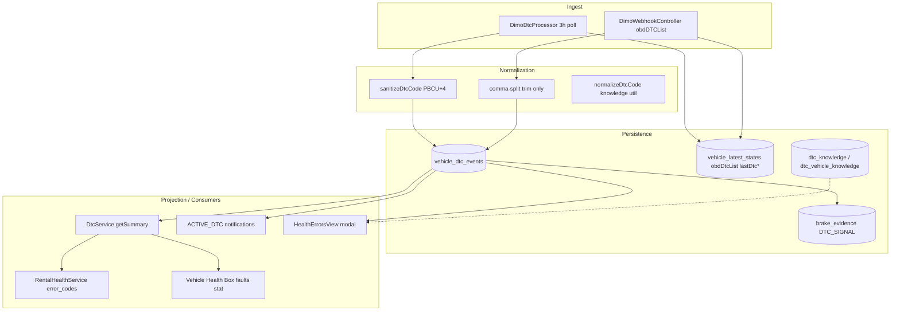

# Vehicle Warnings — DTC & Technical Warning Signals Audit (Prompt 7/26)

| Feld | Wert |
|------|------|
| **Audit-ID** | `vehicle-warnings-production-readiness-2026-07` |
| **Prompt** | **7 von 26** — DTCs und technische Warnsignale |
| **Erstellt (UTC)** | 2026-07-25 |
| **Basis-Commit** | `1d0f2caebe56aa1ecd23295aa33d20e953daa95d` |
| **Vorgänger** | [`05-telemetry-ingestion-audit.md`](./05-telemetry-ingestion-audit.md) |
| **Modus** | **Analyse only** — keine Codeänderungen, keine Remediation |
| **Produktionsdaten verändert** | **Nein** |

---

## 1. Executive Summary

SynqDrive verarbeitet OBD-DTCs primär über **DIMO `obdDTCList`** (Poll alle 3 h + optionaler Webhook) in die Tabelle `vehicle_dtc_events`. „Aktiv“ ist technisch **`is_active = true`** — es gibt **keine** OBD-Semantik für Pending/Stored/Permanent/Historic. Severity wird beim Ingest **fast immer auf `WARNING`** gesetzt; nur nachgelagerte Domänen (Bremsen-Klassifikation, manuelle KB-Anreicherung) differenzieren stärker.

**Kernbefunde:**

| Thema | Urteil |
|-------|--------|
| Definition „aktiv“ | **Technisch klar** (`is_active`), **fachlich vereinfacht** (kein OBD-Statusmodell) |
| Historische DTCs als aktiv | **Nein** in Summary/Detail bei Freshness-Gate; **Ja** in `findActive` / `dtc/active` ohne Stale-Filter |
| Auto-Close | **Ja** — beim erfolgreichen Poll-Diff, **sofort** wenn Code fehlt; **nicht** zyklusbasiert |
| Telemetrieausfall | **Kein künstliches Schließen** bei Poll-Failure; nach 6 h **Stale-Maskierung** in Summary |
| Deduplizierung | **Poll-Pfad stark**; **Webhook-Pfad schwach** (keine Normalisierung) |
| Severity | **Pauschal WARNING** auf Ingest; Rental-Block nur bei Band `critical` |
| Finding-Gruppen | **Nein** — ein DTC = ein Event + eine Notification pro Code |
| Originalevidence | **`raw_payload` auf DTC-Events ungenutzt**; VLS `obdDtcList` + Brake-Evidence-Notes |
| Übersetzung vs. Technik | **Getrennt** (`DtcKnowledge` AI-Felder vs. Event-`description`) |
| Mietbereitschaft | **Nachvollziehbar** über `RentalHealthService.evaluateErrorCodes`, aber Count/State divergieren je Surface |
| UI vs. API Count | **Ja, möglich** — stale-aware Summary vs. raw `dtc/active` |

Parallele technische Warnsignale (nicht DTC): **HM Dashboard Warning Lights** (`vehicle_alerts`), **Brake-DTC-Evidence**, **Battery-Safety-DTC-Heuristik**, **Vehicle Complaints**, **Connectivity** (indirekt über Stale).

---

## 2. Scope & Methodik

### 2.1 Im Scope

- DTC-Abfrage, Normalisierung, Lifecycle, Severity, Rental Health, Notifications
- UI/API-Darstellung (Dashboard Health Box, Health Tab, Fleet Condition, Insights)
- Verwandte technische Signale: HM Telltales, Brake-DTC-Evidence, Battery-DTC-Readiness

### 2.2 Nicht im Scope

- Remediation / Fix-Vorschläge
- Produktions-SQL-Ausführung (Queries aus Prompt 5 referenzierbar)
- Vollständige DIMO-OEM-Code-Liste

### 2.3 Primärquellen (CODE_VERIFIED)

| Bereich | Pfad |
|---------|------|
| DTC Service | `backend/src/modules/vehicle-intelligence/dtc/dtc.service.ts` |
| Severity Utils | `backend/src/modules/vehicle-intelligence/dtc/dtc-severity.util.ts` |
| DIMO Poll | `backend/src/workers/processors/dimo-dtc.processor.ts` |
| DIMO Webhook | `backend/src/modules/dimo/dimo-webhook.controller.ts` |
| DTC Knowledge | `backend/src/modules/vehicle-intelligence/dtc-knowledge/*` |
| Brake DTC | `backend/src/modules/vehicle-intelligence/brakes/brake-dtc-*.ts` |
| Rental Health | `backend/src/modules/rental-health/rental-health.service.ts` |
| Notifications | `backend/src/modules/notifications/adapters/rental-health-notification.projector.ts` |
| Dashboard Lights | `backend/src/modules/vehicle-intelligence/dashboard-warning-lights/*` |
| API | `backend/src/modules/vehicle-intelligence/vehicle-intelligence.controller.ts` |
| FE Health Box | `frontend/src/rental/components/vehicle-detail/*` |
| FE Health Tab | `frontend/src/rental/components/HealthErrorsView.tsx` |
| Schema | `backend/prisma/schema.prisma` (`VehicleDtcEvent`, `DtcKnowledge`) |

---

## 3. DTC-Pipeline (Architektur)



**Signal-Quelle:** `obdDTCList` (DIMO GraphQL `signalsLatest`). Kein separater HM-DTC-Ingest — HM liefert OEM-Warnleuchten über anderen Pfad (`vehicle_alerts`).

---

## 4. DTC-Verarbeitung im Detail

### 4.1 DTC-Abfrage

| Pfad | Intervall / Trigger | API / Signal | Erfolgs-Metadaten |
|------|---------------------|--------------|-------------------|
| **Poll** | Scheduler 3 h → Fan-out `dtc-poll-vehicle` | `signalsLatest { obdDTCList { timestamp value } }` | `lastDtcPollAt`, `lastDtcSuccessfulCheckAt`, `dtcPollStatus=success`, `obdDtcList` |
| **Webhook** | DIMO Vehicle Trigger `obdDTCList` | Raw `value` string/array | Nur `lastDtcPollAt`, `obdDtcList` — **kein** `lastDtcSuccessfulCheckAt` |
| **Read APIs** | On-demand | `GET …/dtc`, `/dtc/active`, `/dtc/summary`, `/dtc/detail`, `/dtc/stats` | Freshness aus VLS |

Poll-Failure (`catch` in `pollVehicleDtc`): setzt `dtcPollStatus=failure`, `dtcPollError`, `lastDtcPollAt` — **berührt weder DTC-Events noch `lastDtcSuccessfulCheckAt`**.

### 4.2 Normalisierung

| Stufe | Regel | Ungültige Codes |
|-------|-------|-----------------|
| **Poll** (`sanitizeDtcCode`) | Strip `"'[]\s`, uppercase, Pattern `^[PBCU][0-9A-Z]{4}$` | Verworfen (nicht in Liste) |
| **Poll** (`normalizeDtcCodes`) | JSON-Array-String, comma-split, Dedup via `Set` | — |
| **Webhook** | `split(',')` + `trim()` only | **Können persistiert werden** |
| **Knowledge** (`normalizeDtcCode`) | trim, uppercase, whitespace entfernen, gleiches Pattern | `null` → keine AI-Anreicherung |

**OEM-spezifisch:** `getDtcStandardType()` klassifiziert Position 2 (`0` = GENERIC, `1` = MANUFACTURER_SPECIFIC). Keine Hersteller-Decode-Tabelle im Ingest — nur Knowledge-Worker + Brake-Registry.

### 4.3 Active / Pending / Historic / Stored

| OBD-Konzept | SynqDrive-Äquivalent |
|-------------|----------------------|
| Active (confirmed) | `vehicle_dtc_events.is_active = true` |
| Pending | **Nicht modelliert** |
| Stored / Permanent | **Nicht modelliert** |
| Historic / Cleared | `is_active = false`, `cleared_at` gesetzt |
| Wiederauftreten | Neuer aktiver Row **oder** `occurrence_count++` bei gleichem Code |

**Fachliche Definition „aktiv“:** Code war im **letzten erfolgreichen Poll** in `obdDTCList` **oder** per Webhook upserted und noch nicht per Poll-Clear entfernt. Es gibt **keine** Unterscheidung „historisch gespeichert aber nicht aktiv“ auf OBD-Ebene.

### 4.4 Codebeschreibung

| Quelle | Feld | Wann gesetzt |
|--------|------|--------------|
| Ingest (Poll/Webhook) | `vehicle_dtc_events.description` | Optional bei `upsertDtc`; **Ingest setzt es nicht** |
| API Label | `description ?? 'DTC {code}'` | Response-DTO |
| Knowledge Base | `dtc_knowledge.title`, `short_description` | AI-Worker, async |
| Notifications | `reason` aus Event-`description` oder KB-Enricher | `enrichActiveDtcTemplateParams` |

### 4.5 Severity Mapping

**Prisma-Enum:** `DtcSeverity`: `INFO | WARNING | CRITICAL` (Default `WARNING`).

**Ingest:** Poll und Webhook rufen `upsertDtc` **ohne** `severity` → immer **`WARNING`**.

**Band-Normalisierung** (`normalizeDtcSeverityBand`):

| Band | Auslöser (Beispiele) | Rental `dtcBandToHealthState` | Safety-Critical Block |
|------|----------------------|-------------------------------|------------------------|
| `critical` | `critical`, `high`, `severe`, `safety_critical`, … | `critical` | **Ja** (`isSafetyCriticalDtcBand`) |
| `warning` | `warning`, `medium`, `moderate`, … | `warning` | Nein |
| `info` | `low`, `info`, `minor`, … | `warning` | Nein |
| `unknown` | leer / unbekannt | `warning` | Nein |

**UI Display** (`getSeverityDisplay`): `critical→high`, `warning→medium`, `info/unknown→low`.

**Brake-spezifisch** (`classifyBrakeDtc`): Curated Registry (exact + prefix + system family) kann `CRITICAL`/`WARNING`/`INFO` setzen — wirkt auf `brake_evidence`, **nicht** auf `vehicle_dtc_events.severity` beim Standard-Ingest.

### 4.6 Wiederauftreten

- Gleicher normalisierter Code, bereits aktiv: `last_seen_at` Update, `occurrence_count++`
- Code war cleared, erscheint wieder: **neuer** `vehicle_dtc_events` Row (`create`, nicht Reaktivierung des alten Rows)
- Brake Evidence: `reactivated` Flag in `notes` JSON wenn `dtcActive` war false

### 4.7 Automatisches Schließen

| Bedingung | Verhalten |
|-----------|-----------|
| Erfolgreicher Poll, Code nicht in neuer Liste | `clearDtc()` → `is_active=false`, `cleared_at=now` |
| Webhook | **Kein Clear** — nur Upserts |
| Poll-Failure | **Kein Clear** |
| Stale (>6 h seit `lastDtcSuccessfulCheckAt`) | DB bleibt aktiv; **Summary/Detail maskieren** aktive Faults |
| Messzyklen | **Nicht relevant** — **1 erfolgreicher Poll ohne Code = sofort cleared** |

### 4.8 Fehlende / unbekannte Codes

| Situation | Verhalten |
|-----------|-------------|
| Ungültiges Pattern (Poll) | Code verworfen, nicht gespeichert |
| Ungültiges Pattern (Webhook) | Kann als Rohstring in DB landen |
| Gültiger Code, keine KB | Knowledge-DTO `status: MISSING`, AI-Queue für aktive Faults |
| KB FAILED | `FAILED` DTO, DTC-Anzeige bleibt |
| Severity unbekannt | Band `unknown` → Rental-Modul `warning`, kein Hard-Block |

---

## 5. Weitere technische Warnsignale (nicht-DTC)

### 5.1 HM Dashboard Warning Lights → `vehicle_alerts`

| Signal | Rental-Modul | Technischer State |
|--------|--------------|-------------------|
| Limp Mode aktiv | `vehicle_alerts` → `critical` | Unabhängig von DTC |
| Motoröl LOW/MINIMUM | `critical` | |
| Motoröl HIGH/MAXIMUM | `warning` | |
| Reifendruck, CEL, Bremsbelag, Batterie-Warnleuchte | Über `DashboardWarningLightsService` | Eigene Freshness; nicht in `error_codes` |

**Kein DTC-Count** — separates Modul `vehicle_alerts` in Rental Health V1.

### 5.2 Brake DTC Evidence

Aktive DTCs mit Bremsen-Relevanz erzeugen `brake_evidence` (`source=DTC_SIGNAL`). Klassifikation über `brake-dtc-classification.ts` (exact/prefix/heuristic). Kann **zusätzliche** `BRAKE_CRITICAL` Notifications und Rental-Entscheidungen (`SAFETY_DTC_CRITICAL`, `SAFETY_DTC_REVIEW`) auslösen — parallel zu `error_codes`.

### 5.3 Battery Safety DTC

`hasActiveBatterySafetyDtc()` prüft **nur** `activeFaultPreview` (max. 3 Codes aus Summary) auf Battery-Pattern + `critical` Band. Beeinflusst **Battery-Modul** und Readiness, nicht `error_codes` direkt.

### 5.4 Vehicle Complaints

Separates Modul `complaints` — technische Beobachtungen mit eigenem Lifecycle; nicht DTC-gekoppelt.

---

## 6. Mapping-Tabellen

Legende: **Technical State** = Rental-Health-Modul `error_codes.state` (bzw. angegebenes Modul). **Rental Impact** = Hard-Block nur wenn `rental_blocked` / Gatekeeper — für DTC primär über `critical` Band.

### 6.1 Ingest → Persistence

| Source code (Roh) | Normalized code | Severity (DB) | Technical state | Rental impact | UI label |
|-------------------|-----------------|---------------|-----------------|---------------|----------|
| `p 0675` (Poll) | `P0675` | `WARNING` (default) | abhängig von Freshness | `warning` wenn aktiv+fresh; Block nur bei manuell/künftig `CRITICAL` | „1 active fault code“ / Code-Pill `P0675` |
| `P0675` (Webhook, raw) | `P0675` (wenn exakt) | `WARNING` | wie oben | wie oben | wie oben |
| `["P0675"]` (Webhook) | **Roh: `["P0675"]`** möglich | `WARNING` | `warning` wenn aktiv | `warning` | Ungültiges Label / Parser-Artefakt |
| `C0265` (Poll, Brake-relevant) | `C0265` | `WARNING` (Event) | `warning` (error_codes) | Brake-Pfad: `SAFETY_DTC_CRITICAL` möglich | Bremsen + Fehlercodes |
| Leere `obdDTCList` nach vorherigem Fault | — (cleared) | — | `good` nach erfolgreichem Poll | `none` | „No active fault codes“ / `0` |
| Poll-Failure, alte Active Rows | unverändert | unverändert | nach 6h: `unknown` (stale) | **Kein Block** durch Stale allein | `—` „Datenstand verzögert“ |
| Nie gepollt | — | — | `unknown` (unavailable) | `none` | „No DTC data“ |

### 6.2 Severity Band → Rental / UI

| Normalized severity (Prisma/Band) | Technical state (`error_codes`) | Rental impact (DTC allein) | UI label (Modul) |
|-----------------------------------|---------------------------------|------------------------------|------------------|
| `CRITICAL` / band `critical` | `critical` | **Hard-Block** (`collectBlockingReasons`) | „N aktive Fehlercodes — sicherheitsrelevant“ |
| `WARNING` / band `warning` | `warning` | Beobachten, kein DTC-Hard-Block | „N aktive Fehlercodes“ |
| `INFO` / band `info` | `warning` | Kein Hard-Block | Gleich (Band mappt zu warning state) |
| `unknown` / leer | `warning` | Kein Hard-Block | Amber Warning-Card |
| Stale / unavailable | `unknown` | Kein Block | `—` / „DTC-Status veraltet“ |

### 6.3 Brake-DTC-Klassifikation (paralleler Pfad)

| Source code | Normalized | Severity (Brake evidence) | Technical state | Rental impact | UI label |
|-------------|------------|---------------------------|-----------------|---------------|----------|
| `C0265` | `C0265` | `CRITICAL` (registry) | `brakes` modulabhängig | `SAFETY_DTC_CRITICAL` / HARD_BLOCK | Brake alert + DTC |
| `C0035` | `C0035` | `WARNING` (ABS) | brakes warning | REVIEW möglich | ABS DTC |
| `P0675` | `P0675` | `INFO` (NOT_BRAKE_RELATED) | error_codes only | Kein Brake-Block | Glow plug / Nebensystem |
| `U0121` | `U0121` | `WARNING` (COMM) | brakes + error_codes | REVIEW | Kommunikation ABS |

### 6.4 HM Telltales (Modul `vehicle_alerts`)

| Source signal | Normalized | Severity | Technical state | Rental impact | UI label |
|---------------|------------|----------|-----------------|---------------|----------|
| `engine.get.limp_mode = true` | `engine_limp_mode` | critical | `vehicle_alerts: critical` | Kann overall_state beeinflussen | „Motorwarnung / Notlauf“ |
| `engine_oil_level.status = LOW` | `engine_oil_level` | critical | `critical` | Block über Gesamt-Health | „Motorölstand“ |
| HM nicht verbunden | — | — | `n_a` | none | „Keine OEM-Warnleuchten-Quelle“ |

### 6.5 Notification Mapping

| Source | Normalized fingerprint | Severity (Notification) | Technical state | Rental impact | UI label |
|--------|------------------------|-------------------------|-----------------|---------------|----------|
| Active DTC `P0675` | `active_dtc:P0675` | `WARNING` (wenn Band ≠ critical) | error_codes | Indirekt | Notification: Code + KB-reason |
| Cleared DTC (Poll) | gleicher fingerprint | `SUCCESS` (resolved) | — | — | Resolved notification |
| Brake DTC critical | `BRAKE_CRITICAL` + code | `critical` | brakes | HARD_BLOCK | Separater Kanal |

---

## 7. Oberflächen-Integration

### 7.1 Dashboard — Vehicle Health Box

| Aspekt | Implementierung |
|--------|-----------------|
| Count | `dtcActive` → `rows.length` (`useVehicleHealthBoxData`) |
| Anzeige | `mapFaultsStat()` — **respektiert** `rentalHealth.modules.error_codes.data_stale` |
| Eskalation | Modul-State aus Rental Health, nicht lokale DTC-Severity |
| „1 aktiver Fehlercode“ | Count `1` + Faults-Tile; Gesamtbadge aus `overall_state` |

**Divergenz-Risiko:** Bei Stale zeigt Tile `—`, aber `dtcActive` könnte intern >0 geladen haben (wird nicht als Zahl gezeigt).

### 7.2 Fleet

| Surface | DTC-Bezug |
|---------|-----------|
| `FleetConditionView` | Rental-Health-Gruppierung; Modul-Filter `error_codes` |
| `FleetConditionDetailView` / `AlertsDetail` | **Legacy:** `dtcActive.length >= 3` → `critical` (eigene Heuristik, nicht Rental Health) |
| Fleet Status Chip | `useEffectiveHealth` → `error_codes.state` |

### 7.3 Vehicle Detail / Health Tab

| Surface | Endpoints | Count-Quelle |
|---------|-----------|--------------|
| `HealthErrorsView` Quick-Card | `dtcSummary` + `dtcActive` | `activeFaultCount` aus Summary, Fallback `activeDtcCount` |
| Error Codes Modal | `dtcDetail` | `currentFaults.activeFaults` (leer wenn stale) |
| `HealthVehicleDetailPanel` (tab dtc) | `dtcActive` | Raw active list |
| Insights Card | `dtcActive` + `errorCodesState` | `dtcCount`; Text „N active fault code(s)“ |

### 7.4 Notifications

| Producer | Clear-Verhalten |
|----------|-----------------|
| `DimoDtcProcessor.emitDtcHealthNotifications` | Per-Code ingest + explicit `cleared: true` |
| `BusinessInsightsService` sweep | `projectVehicleHealthWarnings` + `findActive` (**ohne** Stale-Gate) |
| Webhook | **Keine** Notifications |

---

## 8. Technical State & Readiness

### 8.1 `error_codes` Modul (kanonisch für DTC)

```
unavailable → unknown (kein Poll)
stale       → unknown (data_stale=true, keine aktiven Faults in Summary)
clean       → good
active_faults → warning ODER critical (worstSeverityBand)
```

`overall_state` aggregiert über alle Module (`computeOverallState`). Ein einzelner `WARNING`-DTC zieht mindestens `warning` auf Modul-Ebene; Hard-Block nur bei `critical` Band + `collectBlockingReasons`.

### 8.2 Readiness-Ableitung (Frontend)

`vehicle-insights-logic.ts`:

- `errorCodesState === 'critical'` → readiness `critical`
- `errorCodesState === 'warning'` → readiness `warning`
- `dtcCount > 0` + `state unknown` → Fallback `warning`

**Nachvollziehbar**, aber **zweite Wahrheit** möglich wenn `dtcCount` von `dtcActive` und State von Rental Health kommen und Stale divergiert.

### 8.3 Booking Gate

DTC-Hard-Block in `collectBlockingReasons` nur wenn `modules.error_codes.state === 'critical'` **und** `isSafetyCriticalDtcBand(worstSeverityBand)`. Da Ingest fast nie `CRITICAL` setzt, ist **operativer Hard-Block selten** ohne manuelle Severity-Änderung oder Brake-Pfad.

---

## 9. Persistenz & Evidence (Querverweis PA-03, MT-02)

| Thema | Befund |
|-------|--------|
| Dedup DB | Kein Unique auf `(vehicle_id, dtc_code) WHERE is_active` — App-Level `findFirst` |
| `raw_payload` auf `vehicle_dtc_events` | Schema vorhanden, **Ingest schreibt nie** |
| VLS `obdDtcList` | Letzte rohe Liste (Poll/Webhook) |
| History | Alle Rows in `vehicle_dtc_events`; Detail capped 500 |
| Originalevidence Brake | `brake_evidence.notes` JSON mit `mappingSource`, `occurrenceCount` |

---

## 10. Pflichtfragen (12/12)

### 1. Ist „aktiv“ fachlich und technisch korrekt definiert?

**Technisch ja:** `is_active=true` + Freshness-Gate in Summary/Detail. **Fachlich nur teilweise:** SynqDrive „aktiv“ = „in letzter erfolgreicher `obdDTCList`-Momentaufnahme enthalten (Poll) oder per Webhook gemeldet“, nicht OBD „confirmed/pending“. Pending/Stored werden nicht unterschieden.

### 2. Werden historische DTCs fälschlich als aktiv dargestellt?

**In Summary/Detail/Rental Health: Nein** bei Stale (aktive Liste leer). **In `GET /dtc/active`, Notification-Sweep, Fleet AlertsDetail: Ja möglich** — dort kein Freshness-Filter; DB-`is_active` bleibt true bis erfolgreicher Poll-Clear.

### 3. Wird ein nicht mehr gemeldeter DTC automatisch geschlossen?

**Ja**, beim **nächsten erfolgreichen Poll** wenn der Code in `obdDTCList` fehlt. Webhook-only-Fahrzeuge ohne erfolgreichen Poll: **verzögert oder nie**.

### 4. Nach wie vielen erfolgreichen Messzyklen?

**Null Messzyklen-Konzept.** Es gilt **ein Poll-Snapshot-Diff** — fehlt der Code einmal in der erfolgreichen Antwort, wird sofort `clearDtc` aufgerufen. Kein „3 consecutive OK cycles“.

### 5. Wird ein DTC während Telemetrieausfall künstlich geschlossen?

**Nein.** Poll-Failure ändert Events nicht. Nach 6 h ohne erfolgreichen Check: **Maskierung** (keine aktiven Faults in Summary), DB bleibt unverändert — **kein** `cleared_at`.

### 6. Werden DTCs mit unterschiedlichen Schreibweisen dedupliziert?

**Poll: Ja** (sanitize + Set). **Webhook: Nein** (kein uppercase/pattern). **DB-Upsert: Exakter String-Match** auf `dtcCode` — theoretisch Duplikate `P0675` vs `p0675` möglich.

### 7. Gibt es eine regelbasierte Severity oder pauschal Warning?

**Ingest: pauschal `WARNING`.** Regelbasiert nur in **Brake-Klassifikation** (separate Evidence) und **Band-Mapper** für bereits gesetzte Severity. Knowledge-AI kann `technicalUrgency`/`rentalRecommendation` liefern — **ohne** Rückschreibung in `vehicle_dtc_events.severity`.

### 8. Können mehrere DTCs zu einer einzigen Finding-Gruppe gehören?

**Nein.** Ein Code = ein `vehicle_dtc_events` Row (aktiv), eine `ACTIVE_DTC` Notification (`conditionCode: active_dtc:{code}`). Aggregierte Texte („3 aktive Fehlercodes“) nur auf Modul-Ebene.

### 9. Wird die Originalevidence erhalten?

**Teilweise.** VLS speichert Code-Liste; Brake-Evidence speichert Metadaten. **`vehicle_dtc_events.raw_payload` ungenutzt.** Webhook-Rohpayload nicht an Event gebunden. Poll-Signal-Timestamp nur indirekt über VLS.

### 10. Sind Übersetzung und technische Erklärung getrennt?

**Ja.** Event-`description` (provider/manuell) vs. `DtcKnowledge` / `DtcVehicleKnowledge` (`title`, `shortDescription`, `possibleCauses`, `recommendedAction`, …). API attachiert `knowledge` nur in `/dtc/detail` für aktive Faults.

### 11. Wird die Mietbereitschaft nachvollziehbar abgeleitet?

**Ja über Rental Health V1** (`evaluateErrorCodes` + `collectBlockingReasons`). **Einschränkung:** Hard-Block selten wegen Default-WARNING; Insights-Card mischt `dtcCount` und `errorCodesState`; Fleet `AlertsDetail` nutzt eigene 3-Code-Heuristik.

### 12. Können UI und API unterschiedliche DTC-Counts berechnen?

**Ja.**

| API / Surface | Zähllogik |
|-------------|-----------|
| `dtc/summary` `activeFaultCount` | 0 wenn stale/unavailable |
| `dtc/active`, `dtc/stats` | Alle `is_active=true` |
| Health Box (nach `mapFaultsStat`) | `dtcActive.length` aber Anzeige gated |
| Health Tab Quick-Card | Summary bevorzugt, Fallback `dtcActive` |
| Business Insights Notifications | `findActive` ohne Stale |

---

## 11. Risiko-Register (DTC-01–DTC-15)

| ID | Risiko | Schwere | Evidenz |
|----|--------|---------|---------|
| DTC-01 | Webhook ohne Clear/Notification-Parität | Hoch | MT-02, `handleDtcEvent` |
| DTC-02 | Webhook ohne Code-Normalisierung | Hoch | `dimo-webhook.controller.ts` vs Poll |
| DTC-03 | `dtc/active` ignoriert Stale-Gate | Mittel | `findActive` vs `getSummary` |
| DTC-04 | Default severity WARNING → seltener Hard-Block | Mittel | `upsertDtc`, `evaluateErrorCodes` |
| DTC-05 | Kein OBD Pending/Stored-Modell | Mittel | Schema |
| DTC-06 | `raw_payload` nie befüllt | Niedrig | `upsertDtc` |
| DTC-07 | Duplikat-Rows möglich (kein DB-Unique) | Mittel | PA-03 |
| DTC-08 | Notification-Sweep zählt stale-active | Mittel | `business-insights.service.ts` |
| DTC-09 | Fleet AlertsDetail 3-Code-Heuristik | Niedrig | `FleetConditionDetailView.tsx` |
| DTC-10 | Brake-DTC doppelte Notifications (ACTIVE_DTC + BRAKE_CRITICAL) | Niedrig | Producer-Pfade |
| DTC-11 | Battery-Safety nur auf Preview (max 3 Codes) | Niedrig | `getSummary` take 3 |
| DTC-12 | Webhook setzt kein `lastDtcSuccessfulCheckAt` | Mittel | Stale-Eskalation |
| DTC-13 | Ungültige Webhook-Codes persistierbar | Mittel | Kein Pattern-Check |
| DTC-14 | Insights `dtcCount` vs stale Summary | Niedrig | `VehicleInsightsCard` |
| DTC-15 | HM Telltales vs DTC getrennt — Doppelwarnung möglich | Info | `vehicle_alerts` + `error_codes` |

---

## 12. Zusammenfassung Mapping-Flow (Referenz)

```
DIMO obdDTCList
  → normalize (poll: PBCU+4 | webhook: raw)
  → vehicle_dtc_events { dtc_code, severity=WARNING, is_active }
  → dtcBandToHealthState → rental_health.modules.error_codes
  → UI: rental state label + optional dtcActive count + dtc/summary message
  → notification: ACTIVE_DTC per code (poll only for clear)
```

Parallele Pfade:

```
DTC → classifyBrakeDtc → brake_evidence → brakes module / BRAKE_CRITICAL
DTC preview → hasActiveBatterySafetyDtc → battery module
HM signals → vehicle_alerts (OEM lights, not DTC)
```

---

## 13. Änderungshistorie

| Version | Datum | Autor | Änderung |
|---------|-------|-------|----------|
| 1.0 | 2026-07-25 | Vehicle Warnings Audit (Prompt 7) | Erstversion |

---

**Changes / Architektur (SynqDrive Code UI):** Nicht aktualisiert — audit-only, keine Implementierung.
