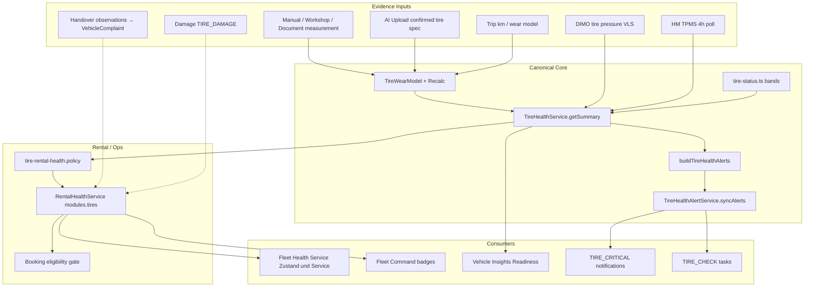

# Vehicle Warnings — Tire Warning & Status Audit (Prompt 8/26)

| Feld | Wert |
|------|------|
| **Audit-ID** | `vehicle-warnings-production-readiness-2026-07` |
| **Prompt** | **8 von 26** — Reifenwarnungen und Statusableitungen |
| **Erstellt (UTC)** | 2026-07-25 |
| **Basis-Commit** | `1d0f2caebe56aa1ecd23295aa33d20e953daa95d` |
| **Vorgänger** | [`06-dtc-warning-audit.md`](./06-dtc-warning-audit.md) |
| **Modus** | **Analyse only** — keine Codeänderungen, keine Remediation |
| **Produktionsdaten verändert** | **Nein** |

**Referenz-Audits (gelesen):**

- [`docs/audits/tire-health-production-readiness-2026-07.md`](../tire-health-production-readiness-2026-07.md) — Urteil `NOT_READY` (Juli 2026, 6-Fahrzeug-Flotte)
- [`docs/audits/tire-health-post-remediation-readiness-2026-07.md`](../tire-health-post-remediation-readiness-2026-07.md) — Urteil `CONDITIONALLY_READY` (Plattform) / `NOT_ENOUGH_DATA` (Modellvalidität)
- [`docs/implementation/tire-health-production-readiness-remediation-2026-07.md`](../implementation/tire-health-production-readiness-remediation-2026-07.md) — 24 Remediation-Prompts, Evidence-Gates, HM-Druckkontext

---

## 1. Executive Summary

Reifenwarnungen in SynqDrive laufen über eine **mehrschichtige, aber zentral geregelte Pipeline**: Wear-Modell und Regeln in `tire-status.ts` / `tire-health.config.ts` → Read Model `TireHealthService.getSummary()` → strukturierte Alerts (`TireHealthAlert`) → Rental-Policy `tire-rental-health.policy.ts` → Rental Health V1 → UI/Insights/Notifications/Tasks.

**Kernbefunde:**

| Thema | Urteil |
|-------|--------|
| „Reifen beobachten“ | **Automatisch** — `TireStatus.WATCH` → Rental-`primaryReason` / Insight-Titel / Fleet-Badge |
| „Technisch prüfen“ (FHS) | **Fleet-Health-Service-Band** `review` aus `overall_state=warning`, nicht identisch mit `reviewRequirement` |
| Hard-Block nächste Vermietung | **Nur** gemessene Profiltiefe ≤ 1,6 mm oder **frische** kritische TPMS/Druck-Evidenz |
| Reine Beobachtung → „Nicht bereit“ | **Nein** für `rental_blocked`; **Ja** für `overall_state=warning` und Insights `Monitor` |
| Aktive Vermietung | **Gleiche** Rental-Health-Evaluation; Insights ggf. booking-gated |
| Rückgabe → Auto-Prüfung | **Nein** — Handover löst kein `TIRE_CHECK` aus |
| Dedup | **Stark** bei `TireHealthAlert`; **schwach** zwischen parallelen Surfaces (Insights + Alerts + Module) |
| Fehlende Daten als „gut“ | **Explizit verhindert** in Rental-Policy; Default-8-mm → `MEASUREMENT_REQUIRED` |
| Cross-Surface-Konsistenz | **Teilweise** — Rental Health SSOT für Modul-State; Insights/Fleet-Alerts/Condition-Detail divergieren |

---

## 2. Scope & Methodik

### 2.1 Im Scope

- Telemetrie (DIMO Druck, HM TPMS), manuelle Profiltiefe, Temperatur (Wear-Faktor), Achs-/Radzuordnung
- Operator Notes, Pickup/Return, Damages, Watchpoints-Äquivalente (Alerts/ActionState)
- Rule Engine, Lifecycle, Dedup, Tasks, Notifications, UI-Badges
- Fleet Command, Readiness (Insights), Zustand & Service (Fleet Health Service)

### 2.2 Nicht im Scope

- Remediation / erneute VPS-Validierung
- Vollständige Wear-Modell-Backtest-Reproduktion (siehe Tire-Health-Audit)

### 2.3 Primärquellen (CODE_VERIFIED)

| Bereich | Pfad |
|---------|------|
| Status-Regeln (SSOT) | `backend/.../tires/tire-status.ts`, `tire-health.config.ts` |
| Read Model | `backend/.../tires/tire-health.service.ts` |
| UI-Präsentation | `backend/.../tires/tire-health-presentation.ts` |
| Alert Rule Engine | `backend/.../tires/tire-health-alert.builder.ts`, `tire-health-alert.service.ts` |
| Druck/TPMS | `backend/.../tires/tire-pressure-context.builder.ts`, `hm-health-polling.scheduler.ts` |
| Rental Policy | `backend/.../rental-health/tire-rental-health.policy.ts` |
| Review Override | `backend/.../rental-health/tire-rental-health-review.service.ts` |
| Rental Orchestration | `backend/.../rental-health/rental-health.service.ts` |
| Insights | `backend/.../business-insights/detectors/tire-critical.detector.ts` |
| Tasks | `backend/.../tasks/automation/task-automation-rule.catalog.ts` (`TIRE_CRITICAL_HEALTH`) |
| Handover | `backend/.../bookings/handover.types.ts`, `bookings-handover.service.ts` |
| FE Taxonomie | `frontend/.../operational-issues/operationalIssueTireTaxonomy.ts` |
| FE Surfaces | `fleet-health-control-center.ts`, `fleetVehicleDisplay.ts`, `vehicle-insights-logic.ts`, `tire-health-detail-ui.ts` |

---

## 3. Architektur (Signalfluss)

---

## 4. Status-Schichten (kein einzelnes „Reifen-Enum“)

| Schicht | Typ / Werte | Owner | Operator-Label (DE, typisch) |
|---------|-------------|-------|------------------------------|
| **TireStatus** | `GOOD`, `WATCH`, `WARNING`, `CRITICAL`, `UNKNOWN` | `tire-status.ts` | — (intern) |
| **TireActionState** | `OBSERVE`, `CHECK_SOON`, `PLAN_SERVICE`, `REPLACE` | `tire-health.service.ts` | „Check soon“, Plan Service |
| **TireUiStatus** | `GOOD`, `WARNING`, `CRITICAL`, `MEASUREMENT_REQUIRED`, `REVIEW_REQUIRED`, `LIMITED_DATA`, `UNKNOWN` | `tire-health-presentation.ts` | „Beobachten“, „Messung erforderlich“, „Prüfung erforderlich“ |
| **TireRentalReviewRequirement** | `NONE`, `MEASUREMENT_REQUIRED`, `REVIEW_REQUIRED` | `tire-rental-health.policy.ts` | Messung / Prüfung vor Vermietung |
| **HealthState (Rental)** | `good`, `warning`, `critical`, `unknown`, `n_a` | `modules.tires.state` | Modul-Ampel |
| **FHS Band** | `blocked`, `critical`, `review`, `good`, `limited`, `unevaluable` | `healthSeverityBand()` | „Technisch blockiert“, „Technisch prüfen“ |
| **Insights Readiness** | `Ready`, `Monitor`, `Limited`, `Action Needed` | `vehicle-insights-logic.ts` | Readiness-Verdict |

**Wichtig:** „Reifen beobachten“ ist **kein eigenes Backend-Enum**, sondern ein **UI/Copy-Mapping** auf `WATCH` bzw. `modules.tires.state=warning`.

---

## 5. Evidence → Status (Rule Engine)

### 5.1 Profiltiefe (manuell / geschätzt)

**SSOT:** `classifyTreadStatus(lowestTreadMm, season)` — `tire-health.config.ts`:

| Band | Sommer/All-Season | Winter | Status |
|------|-------------------|--------|--------|
| Gut | > 4,0 mm | > 5,0 mm | `GOOD` |
| Beobachten | > 3,0 … ≤ 4,0 mm | > 4,0 … ≤ 5,0 mm | **`WATCH`** |
| Warnung | > 1,6 … ≤ watch-Kante | analog | `WARNING` |
| Kritisch | ≤ 1,6 mm (legal min) | ≤ 1,6 mm | `CRITICAL` |

**Display Mode:** `MEASURED` vs `ESTIMATED` vs `UNKNOWN` — schreibt Rental-Policy und Insights; **geschätztes CRITICAL blockiert nicht** (Post-Remediation-Design).

**Default-Annahme:** 8 mm ohne Messung → `isDefaultAssumption` → `MEASUREMENT_REQUIRED`, **nicht** „gut“.

### 5.2 Restkilometer, ungleichmäßiger Verschleiß, Saison, Alter

| Signal | Schwelle (Auszug) | Status-Beitrag |
|--------|-------------------|----------------|
| Rest-km niedrig | ≤ 3000 km | `WARNING` |
| Rest-km kritisch | ≤ 1000 km | `CRITICAL` |
| Seiten-Δ | ≥ 0,6 mm → `WATCH`; ≥ 1,0 mm → `WARNING` | `classifyUnevenWear` |
| Achsen-Δ | ≥ 1,2 mm | `WATCH` (Rotation) |
| Reifenalter | ≥ 6 J → `WATCH`; ≥ 10 J → `WARNING` | `classifyTireAgeYears` |
| Saison-Mismatch | Kalender + optional Ambient | `WATCH`/`WARNING` |

Alerts materialisieren in `buildTireHealthAlerts()` → `TireHealthAlert` rows (`CRITICAL_TREAD`, `LOW_TREAD`, `UNEVEN_WEAR_*`, `SEASON_MISMATCH`, …).

### 5.3 Reifendruck / TPMS / Telemetrie

| Quelle | Pfad | Radzuordnung |
|--------|------|--------------|
| **HM** | `hm-health-polling.scheduler.ts` (Gruppe `TIRE_PRESSURE`, ~4 h) | `frontLeft`, `frontRight`, `rearLeft`, `rearRight` |
| **DIMO** | `vehicle_latest_state` + `dimo-tire-pressure.normalizer` (kPa→bar) | gleiche 4-Rad-Struktur |
| **TPMS-Warnleuchte** | `tpmsWarning` + `overallStatus` in `TirePressureContext` | Fahrzeugebene + per-wheel `statusIssue` |

**Temperatur:** nicht als eigener Warn-Status, sondern als **Wear-Faktor** (Heat Stress) im Modell — kein separates „Reifen heiß“-Badge in Rental Health.

**Coverage (Baseline-Audit):** TPMS/Druck nur bei **1/6** Fahrzeugen mit 4-Rad-Druck; Post-Remediation kPa-Fix, aber Fleet-Coverage weiter begrenzt.

### 5.4 Operator Notes, Handover, Damages

| Kanal | Persistenz | Tire-Health-Math | Rental Impact |
|-------|------------|------------------|---------------|
| **Handover `notes`** | Protokoll | **Nicht** angebunden | — |
| **`tiresSeasonOk`** | Pickup/Return-Protokoll (boolean, default `true`) | **Nicht** angebunden | — |
| **Technical observations** | `VehicleComplaint` (Handover draft) | Separates Modul `complaints` | Nur bei `blocksRental=true` |
| **Damage `TIRE_DAMAGE`** | `vehicle_damages` | Parallel-Workflow | `damage-rental-impact` (eigene Logik) |

Handover erzeugt bei Return **kein** automatisches `TIRE_CHECK` — nur `BOOKING_RETURN`-Task-Auflösung.

### 5.5 Action State (`resolveActionState`)

Priorität: `REPLACE` > `PLAN_SERVICE` > **`CHECK_SOON`** > `OBSERVE`.

`CHECK_SOON` u. a. bei Alerts: `ROTATION_RECOMMENDED`, `LOW_CONFIDENCE`, `USED_TIRE_NO_MEASUREMENT`, `UNEVEN_WEAR_ATTENTION`, `SEASON_MISMATCH`, oder `confidenceScore < 55`.

---

## 6. Mapping-Tabellen

### 6.1 Evidence → Normalized Status → Rental → UI

| Evidence (Beispiel) | Normalized (`TireStatus` / Action) | Severity (Alert) | Technical state (`modules.tires`) | Rental impact | UI label (DE) |
|---------------------|-----------------------------------|----------------|-----------------------------------|---------------|-----------------|
| Profil 3,5 mm Sommer, gemessen | `WATCH` / `OBSERVE` | ggf. `LOW_TREAD` warning | `warning` | **Kein** `rental_blocked` | **„Reifen beobachten“** (Fleet), „Beobachten“ (Detail) |
| Profil 2,8 mm geschätzt, high conf. | `WARNING` / `PLAN_SERVICE` | `TREAD_LOW_ESTIMATED` | `warning` | Review, kein Hard-Block | „Beobachten“ / Insights **Limited** |
| Profil 1,5 mm **gemessen** | `CRITICAL` / `REPLACE` | `TREAD_CRITICAL_MEASURED` critical | `critical` | **`HARD_BLOCK`** | „Kritisch“, FHS **Technisch blockiert** |
| Profil 1,4 mm **geschätzt** | `CRITICAL` | `TREAD_CRITICAL_ESTIMATED` | `warning` + `REVIEW_REQUIRED` | **Kein** Hard-Block | „Prüfung erforderlich“ |
| 8 mm Default-Annahme | `UNKNOWN`/bandabhängig | `USED_TIRE_NO_MEASUREMENT` | `unknown` | `MEASUREMENT_REQUIRED` | „Messung erforderlich“ |
| Messung > 365 d alt | — | `MEASUREMENT_OVERDUE` | `unknown` | `REVIEW_REQUIRED` | „Daten verzögert“ / Prüfung |
| TPMS aktiv + frisch + ISSUE | Druck `critical` | `TPMS_WARNING_ACTIVE` | `critical` | **`HARD_BLOCK`** | Druck/TPMS-Warnung |
| TPMS stale | — | — | `unknown` + Review | **Kein** Block | FHS **Technisch prüfen** (wenn overall warning) |
| Kein Setup / keine Daten | `UNKNOWN` | — | `unknown` | Kein bestätigtes `false` | „Nicht bewertbar“ / Limited data |
| Override aktiv | wie oben, Block aufgehoben | — | ggf. `warning` | Override bis `expiresAt` | Audit: `ADMIN_OVERRIDE` |

### 6.2 Label-Matrix „Reifen beobachten“ vs „Technisch prüfen“

| Surface | Trigger | Label | Datenquelle |
|---------|---------|-------|-------------|
| Rental Health `primaryReason` | `overallStatus === 'WATCH'` | „Reifen beobachten“ | `tire-rental-health.policy.ts` |
| Tire Insight (INFO) | `overallStatus === 'WATCH'` | „Reifen beobachten“ | `tire-critical.detector.ts` |
| Fleet Command reason chip | `modules.tires.state === 'warning'` | „Reifen beobachten“ | `fleetVehicleDisplay.ts` |
| UI `TireUiStatus.WARNING` | `WATCH`/`WARNING` canonical | „Beobachten“ | `tire-health-presentation.ts` |
| FHS KPI / Overview | `healthSeverityBand === 'review'` | **„Technisch prüfen“** | `fleet-health-control-center.ts` + i18n |
| FHS Badge | `overall_state=warning` (nicht blocked) | „Technisch prüfen“ | `FHS_HEALTH_BADGE_DE.review` |
| `reviewRequirement` | `REVIEW_REQUIRED` | „Prüfung erforderlich“ | `tire-rental-health-ui.ts` |

**„Technisch prüfen“** ist eine **Fleet-Health-Service-Fahrzeug-Band** (warning ohne confirmed block), **nicht** 1:1 `TireActionState.CHECK_SOON`.

### 6.3 Notifications & Tasks

| Trigger | Event | Dedup | Task |
|---------|-------|-------|------|
| Open `TireHealthAlert` (critical severity) | `TIRE_CRITICAL` notification | `buildTireAlertNotificationCode(reasonCode, dedupeKey)` | — |
| Insight `TIRE_CRITICAL` materialized | `TIRE_CRITICAL_HEALTH` rule | `tire_critical:{vehicleId}` | `TIRE_CHECK` (HIGH) |
| Health Tab manual | — | `buildHealthSourceFindingId` | Prefill `TIRE_CHECK` |

Alert-Dedup-Key: `orgId|vehicleId|tireSetupId|alertType|wheelPosition|evidenceFingerprint` (`TireHealthAlertService`).

---

## 7. Oberflächen-Integration

### 7.1 Dashboard / Vehicle Health Box

- Modulzeile: `rentalHealth.modules.tires.state` (SSOT für Ampel)
- Detailtext: `tire-health-detail-ui` (`tireUiStatus`, `actionState`, Rest-km)
- Lokaler Fallback nur wenn Rental Health fehlt

### 7.2 Fleet Command

- Health-Badge/Reason aus **`rentalHealth.modules.tires`**
- `resolveFleetCommandRowSeverity()` — Critical Alerts Slice kann Zeile eskalieren
- **Kommerzieller Tab** (Available/Active/…) orthogonal zu Tire-Warning

### 7.3 Readiness (Vehicle Insights Card)

- `tireEscalationLevel()` aus `uiStatus` + `actionState` (nicht direkt Rental-Modul)
- `WATCH` / `CHECK_SOON` → Readiness **`Monitor`** (nicht „Limited“/„Action Needed“)
- `REVIEW_REQUIRED` / `MEASUREMENT_REQUIRED` / `PLAN_SERVICE` → **`warning`** → Readiness **Limited**
- `REPLACE` / UI `CRITICAL` → **Action Needed**

### 7.4 Zustand & Service (Fleet Health Service)

- KPI „Technisch prüfen“ = `needsReview` aus `healthSeverityBand(review)`
- Modul-Chips: `modules.tires.reason` + `evidence_type` + `tire_read_model` (wenn vorhanden)
- Filter `fhsVf=review` — gleiche Rental-Health-Map wie Fleet Command

### 7.5 Fleet Condition / AlertsDetail (Legacy-Risiko)

- `FleetConditionDetailView` / `AlertsDetail`: eigene Heuristik `dtcActive.length >= 3` — **für DTC**, nicht Tire
- Tire-Alerts dort aus `tireHealthSummary` alerts — kann von Rental-Modul abweichen wenn nur Summary geladen

---

## 8. Lifecycle & Dedup

| Objekt | Open | Resolve | Dedup |
|--------|------|---------|-------|
| `TireHealthAlert` | `syncAlerts` on recalc | Status `RESOLVED`, Setup-Wechsel | DB unique + fingerprint |
| Rental override | `tire_rental_health_review_override` | `revokedAt` / `expiresAt` | Ein aktiver Override pro Fzg. |
| Insight | Dashboard insight row | Stale/supersede | `dedupeKey` / `groupKey` |
| Notification V2 | ingest | Cleared when alert resolved | Fingerprint per alert code |
| Measurement row | `recordMeasurement` | Superseded by newer measurement | Setup-scoped history |

**Mehrfachsichtbarkeit:** Dieselbe Auffälligkeit kann gleichzeitig als (1) Rental-Modul `warning`, (2) Insight INFO „Reifen beobachten“, (3) offener `TireHealthAlert`, (4) Notification erscheinen — unterschiedliche Dedup-Räume.

---

## 9. Bezug Tire-Health-Audits (Post-Remediation)

| Audit-Finding | Status in Code (Baseline-Commit) | Relevanz Warnings |
|---------------|----------------------------------|-------------------|
| P0 Prediction-as-GT | **Behoben** — estimated ≠ measured block | Verhindert falsches „Kritisch“ |
| P0 Rental ohne HM-Druck | **Behoben** — `pressureContext` in Policy | TPMS-Block mit Freshness |
| kPa/bar DIMO | **Behoben** — normalizer | Druck-Issue-Klassifikation |
| Wear-Data-Points / Anker | Teilweise ops-abhängig | Mehr `UNKNOWN`/`LIMITED_DATA` |
| Backtest NOT_ENOUGH_DATA | Unverändert fachlich | Confidence/Watch-Bänder nicht empirisch validiert |

---

## 10. Pflichtfragen (12/12)

### 1. Welche konkrete Evidence erzeugt „Reifen beobachten“?

**Primär:** `TireStatus.WATCH` aus `classifyTreadStatus` (Sommer: Profil **> 3,0 und ≤ 4,0 mm**; Winter: **> 4,0 und ≤ 5,0 mm**), ferner ungleichmäßiger Verschleiß (Seiten-Δ ≥ 0,6 mm), Achsen-Δ ≥ 1,2 mm, Reifenalter ≥ 6 Jahre, saisonaler Mismatch (WATCH-Stufe). **Copy:** Rental-Policy setzt `primaryReason = 'Reifen beobachten'`; Insight-Titel identisch bei `overallStatus === 'WATCH'`.

### 2. Ist der Status manuell oder automatisch?

**Automatisch** aus Messungen, Wear-Modell, Druck/TPMS und Regeln. **Manuell:** Profiltiefenmessung (`recordMeasurement`), AI-Upload-Bestätigung, dokumentierte Werkstattwerte, **Review-Override** (hebt Hard-Block zeitlich auf), Handover-Observations (separates Complaints-Modul).

### 3. Wird die Quelle in allen Ansichten erhalten?

**Teilweise.** API `TireHealthSummary` enthält `displayMode`, `confidence`, `pressureContext`, `evidencePresentation.treadLines[]` mit `provenance` und `sourceLabelDe`. Rental-Modul trägt `evidence_type` (`measured`/`estimated`/`provider`). **Nicht überall sichtbar:** Fleet Command zeigt verkürzte Reason-Chips; FHS KPIs aggregieren ohne Provenance-Zeile; Handover-`tiresSeasonOk` fließt nicht in Tire Summary.

### 4. Wann wird daraus „Technisch prüfen“?

**Fleet Health Service:** Fahrzeug-Band `review` wenn `overall_state === 'warning'` und **nicht** `rental_blocked` (`healthSeverityBand`). Das umfasst WATCH/WARNING-Reifen, geschätzte Kritikalität mit Review, Druck-Warnung ohne Hard-Block, veraltete Messung. **Nicht identisch** mit `TireActionState.CHECK_SOON` oder UI „Prüfung erforderlich“ (`REVIEW_REQUIRED`).

### 5. Wann wird die nächste Vermietung blockiert?

**Nur `rentalBlockingEvidence.action === 'HARD_BLOCK'`:**

1. **Gemessene** Profiltiefe ≤ **1,6 mm** (`TREAD_MEASURED_BELOW_LEGAL_MIN`)
2. **Frische** kritische TPMS-Warnung (`PRESSURE_TPMS_CRITICAL`)
3. **Frische** per-wheel Druck-`statusIssue` vom Provider (`PRESSURE_PROVIDER_CRITICAL`)

Geschätzte Kritikalität, WATCH, CHECK_SOON, stale Druck → **kein** Hard-Block (höchstens Review/Messung). Booking-Gate: `rental_blocked` + `collectBlockingReasons`.

### 6. Darf eine reine Beobachtung ein Fahrzeug als „Nicht bereit“ einordnen?

**`rental_blocked`:** **Nein** — WATCH allein löst keinen Hard-Block. **`overall_state`:** **Ja, warning** — zählt in Fleet-Aggregation. **Insights Readiness:** **Nein** für „Action Needed“/„Limited“ bei reinem `watch`/`CHECK_SOON` → höchstens **„Monitor“**. FHS zählt warning-Fahrzeuge unter **„Technisch prüfen“**, nicht unter „blockiert“.

### 7. Wie wird eine Beobachtung während aktiver Vermietung behandelt?

**Gleiche** `getVehicleHealth()`-Evaluation — kein Rental-Status-Switch. `TireCriticalDetector` inkludiert `RENTED`. Insights können durch `gateHealthInsightsForBusinessContext` nur mit **upcoming booking** als Ausfallrisiko eskaliert werden. **Kein** automatischer Mietstopp bei aktivem Vertrag.

### 8. Wird nach Rückgabe automatisch eine Prüfung erzeugt?

**Nein.** Return-Handover resolved `BOOKING_RETURN`-Tasks; **keine** Regel `TIRE_CHECK` on return. `RETURN_NEEDS_INSPECTION`-Insight ist stress/km-basiert, nicht reifen-spezifisch.

### 9. Kann dieselbe Reifenauffälligkeit mehrfach erscheinen?

**Ja.** Parallel möglich: Rental-Modul-Reason + Insight + `TireHealthAlert` + `TIRE_CRITICAL` Notification + Action-Queue operational issue (`tires_monitor` / `tire_critical`). Innerhalb **einer** Schicht Dedup (Alert fingerprint, Notification code, Task `tire_critical:{vehicleId}`).

### 10. Wird eine manuelle Bestätigung revisionssicher gespeichert?

**Ja, selektiv:**

- Messungen: `tire_measurements` mit Timestamp, Source, User-Kontext (Lifecycle)
- Review-Override: `tire_rental_health_review_override` + **`AuditService`** (`ADMIN_OVERRIDE` / `REVOKE`)
- Handover-Observations: `vehicle_complaints` mit Protokoll-Link
- AI Tire Spec: `userConfirmedSpec` auf Setup

**Nicht revisionssicher:** bloßes `tiresSeasonOk=true` ohne Tiefe zu Tire-Modell.

### 11. Werden fehlende Daten als gut bewertet?

**Nein** — explizite Guards in `buildTireRentalHealthReadModel`:

- `good` wird zu `unknown` bei `no_data`/`stale` Messung, Default-Annahme, `displayMode UNKNOWN`
- Druck `n_a` + Wear `good` → kann `good` bleiben; Druck `unknown` + Wear `good` → **`unknown`**
- `rental_blocked: null` bei pipeline `partial`/`unavailable` — nie bestätigtes „frei“

### 12. Sind Reifenwarnungen in Fleet Command, Bereitschaft und Zustand & Service identisch?

**Nein, nicht vollständig.**

| Surface | SSOT | Abweichung |
|---------|------|------------|
| Fleet Command | `rentalHealth.modules.tires` | Reason-Chips gekürzt |
| Zustand & Service | Dieselbe Rental-Health-Map | Band „Technisch prüfen“ = gesamtes `warning`, nicht nur Reifen |
| Vehicle Insights Readiness | `tireEscalationLevel` + eigene Schwellen | WATCH → Monitor, Rental → warning; kann **weicher** wirken |
| Operational Issues | Regex/Taxonomie auf Reasons | Kann Titel matchen ohne `actionState` |

**Empfohlene SSOT für operative Blockade:** `rental_blocked` + `tire_read_model.rentalBlockingEvidence`. **Empfohlene SSOT für Modul-Ampel:** `modules.tires.state` + `reason`.

---

## 11. Risiko-Register (TIRE-W01–TIRE-W15)

| ID | Risiko | Schwere | Evidenz |
|----|--------|---------|---------|
| TIRE-W01 | Cross-Surface: Insights Monitor vs Rental warning | Mittel | `vehicle-insights-logic.ts` |
| TIRE-W02 | FHS „Technisch prüfen“ ≠ CHECK_SOON / REVIEW_REQUIRED | Mittel | FHS vs presentation |
| TIRE-W03 | Handover `tiresSeasonOk` nicht in Tire-Modell | Mittel | `handover.types.ts` |
| TIRE-W04 | TPMS Fleet-Coverage gering (Audit 1/6) | Hoch | Tire-Health-Audit |
| TIRE-W05 | Parallele Insight + Alert + Notification | Niedrig | Dedup-Räume |
| TIRE-W06 | Active rental: keine Sonderbehandlung | Info | Policy |
| TIRE-W07 | Kein Auto-TIRE_CHECK nach Return | Mittel | Handover flow |
| TIRE-W08 | Damage TIRE_DAMAGE parallel zu Health | Niedrig | Separater Pfad |
| TIRE-W09 | FleetCondition AlertsDetail Summary-only | Niedrig | Legacy view |
| TIRE-W10 | Override hebt Block — Audit ja, Operator-Risiko | Mittel | Review service |
| TIRE-W11 | Estimated CRITICAL → operatorisch „kritisch“ wirkend | Mittel | UI labels |
| TIRE-W12 | Complaints mit `blocksRental` unabhängig von Tire-Modul | Mittel | `evaluateComplaints` |
| TIRE-W13 | Stale Druck → Review, nicht Block — ggf. missverständlich | Niedrig | `hasDirectPressureCritical` |
| TIRE-W14 | Modellvalidität NOT_ENOUGH_DATA (Watch-Bänder) | Mittel | Post-remediation audit |
| TIRE-W15 | Temperature nur Wear-Faktor, kein Operator-Warning | Info | Architektur |

---

## 12. Zusammenfassung

Reifenwarnungen sind **regelbasiert und zentral** (`tire-status.ts`), mit **starker Trennung** zwischen Beobachtung (`WATCH` → „Reifen beobachten“), Prüfbedarf (`review`/`REVIEW_REQUIRED` → „Technisch prüfen“ / „Prüfung erforderlich“) und **harter Mietblockade** (nur gemessene Legalität + frische Druck/TPMS). Die **größte SSOT-Lücke** für das Vehicle-Warnings-Audit ist nicht die Berechnung, sondern die **mehrfachen Projektionen** (Rental Health vs Insights Readiness vs FHS-Bänder vs Insights/Notifications) mit unterschiedlichen Labels und Eskalationsstufen.

---

## 13. Änderungshistorie

| Version | Datum | Autor | Änderung |
|---------|-------|-------|----------|
| 1.0 | 2026-07-25 | Vehicle Warnings Audit (Prompt 8) | Erstversion |

---

**Changes / Architektur (SynqDrive Code UI):** Nicht aktualisiert — audit-only, keine Implementierung.
