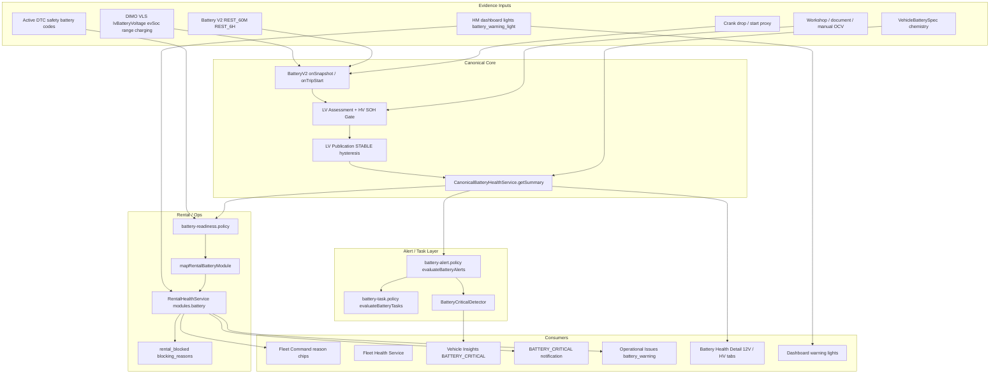

# Vehicle Warnings — Battery Warning & Status Audit (Prompt 9/26)

| Feld | Wert |
|------|------|
| **Audit-ID** | `vehicle-warnings-production-readiness-2026-07` |
| **Prompt** | **9 von 26** — Batteriewarnungen und Statusableitungen (ICE / Hybrid / EV) |
| **Erstellt (UTC)** | 2026-07-25 |
| **Basis-Commit** | `1d0f2caebe56aa1ecd23295aa33d20e953daa95d` |
| **Vorgänger** | [`07-tire-warning-audit.md`](./07-tire-warning-audit.md) |
| **Modus** | **Analyse only** — keine Codeänderungen, keine Remediation |
| **Produktionsdaten verändert** | **Nein** |

**Referenz-Audits und Domain-Entscheidungen (gelesen):**

- [`docs/audits/battery-measurement-domain-decision.md`](../battery-measurement-domain-decision.md) — verbindliches 8-Schichten-Modell (Live → Measurement → Evidence → Assessment → Publication → Rental Readiness → Alert)
- [`docs/audits/battery-rest-window-reality.md`](../battery-rest-window-reality.md) — Ruhefenster-Capture, Golf `veh-c43c3b45`, **31 %** Kontamination
- [`docs/audits/battery-production-evidence-summary.md`](../battery-production-evidence-summary.md) — Gesamturteil **NOT READY** (Juli 2026)
- [`docs/audits/battery-health-v2-final-audit.md`](../battery-health-v2-final-audit.md) — V2-Pipeline, Publication, Readiness
- [`docs/audits/hv-battery-runtime-reality.md`](../hv-battery-runtime-reality.md) — HV-SOH, Charging, Provider-Duplikate
- [`docs/architecture/battery-readiness-policy.md`](../../architecture/battery-readiness-policy.md) — `BATTERY_V2_READINESS_ENABLED`, Blocking-Matrix

---

## 1. Executive Summary

Batteriewarnungen in SynqDrive laufen über eine **mehrschichtige, fachlich getrennte Architektur** für **12-V-Hilfsbatterie (LV)** und **Traktionsbatterie (HV)**. Die zentrale Wahrheit für Modul-State und Rental-Blocking ist `CanonicalBatteryHealthService.getSummary()` → `battery-readiness.policy` → `canonical-battery-read.adapter` → `RentalHealthService`. Alerts, Insights, Tasks und Notifications hängen an **dedizierten Policies** mit expliziten Evidence-Gates — Live-Spannung, Shadow-Signale und Legacy-Publikationen dürfen **nicht** allein blockieren oder alerten.

**Kernbefunde:**

| Thema | Urteil |
|-------|--------|
| Kraftstoff vs. 12-V-Batterie (ICE) | **Getrennt** im Fleet-Energy-Display; **kein** direktes Mapping Fuel-% → Battery-Health |
| Golf „31 %“ | **Nicht** Tank-/SOC-Anzeige — Audit-Metrik = **31 % der Ruhe-Snapshots > 13,2 V** (Kontamination) |
| „Batterie prüfen“ | **Mehrere Surfaces** — Rental `modules.battery` warning/critical, Fleet-Chip, Operational Issues, Tasks |
| Ruhespannung vs. Live | **Architektonisch getrennt** (`measurementContext`, Publication-Gates); **Produktion:** ~31 % REST-Kontamination |
| Temperatur / Messphase | **Messphase** in V2-Domain; **Außentemperatur** im LV-Poll-Pfad praktisch **nicht verfügbar** |
| Alte Messung als aktuelle Warnung | **Teilweise abgefangen** (48 h Modul-Stale, Publication-Freshness); **letzte Publication** kann bei Offline sichtbar bleiben |
| Offline-Telemetrie | Poll ≠ neue Observation; HM-Telltales bei stale Envelope **unterdrückt**; Battery-Modul kann `unknown`/letzten Stand zeigen |
| 6 Tage offline + „technisch bewertbar“ | **Möglich** — letzte STABLE-Publikation / HM-Warnleuchte ohne frische LV-Validierung |
| Schließen nach einem Normalwert | **Nein** für Publication/Alerts (Hysterese + Maturity); **Ja** für HM-Warnleuchte/DTC bei Clear |
| Hysterese / Mindest-Messungen | **Ja** — 2 pp, ≥2 VALID Evidence, 3/6 Zyklen, 14 Tage für STABLE |
| ICE / Hybrid / EV getrennt | **Ja** im Code (`DriveProfile`, `isEv`); **PHEV/HEV** nur spezifikativ (0 in Prod-Flotte) |
| Batterieart im UI | **Teilweise** — 12V vs. HV getrennt; EV-Warnleuchte-Copy differenziert |
| Rental Impact | **Nachvollziehbar** über `evaluateBatteryReadiness` → `blocking_reasons` |
| Notifications / Tasks idempotent | **Stark** pro Regel/Intent; **schwach** zwischen Rental-Modul + Insight + Notification |

---

## 2. Scope & Methodik

### 2.1 Im Scope

Unterscheidung und Prüfung aller Warnpfade für:

| Dimension | ICE | HEV/PHEV (Spec) | BEV |
|-----------|-----|-----------------|-----|
| 12-V-Batterie (LV) | Ja | Ja (wenn Signal) | Nur wenn Signal (Prod: **kein** LV bei KS FH 660E) |
| Traktionsbatterie (HV) | Nein | Ja (wenn SOC/SOH) | Ja |
| Ladezustand (SoC) | Fuel-% (Fleet Energy, **nicht** Battery-Health) | HV SoC + ggf. Fuel | `evSoc` |
| Ruhespannung | REST_60M / REST_6H | wie ICE | N/A ohne LV |
| Live-Spannung | `lvBatteryVoltage` | wie ICE | N/A |
| Cranking / Start-Proxy | Crank-Drop, START_DIP_PROXY | PHEV: ICE-Start-Regeln | N/A |
| Ladezustand während Fahrt | Ladespannung > 13,2 V → Kontamination | HV Charging-Kontext | `tractionBatteryIsCharging` |
| Ladekabel / Charging-State | HM/DIMO EV-Signale | Spec | Ja |
| Reichweite | — | Spec | `rangeKm` (Display, nicht Health-Block) |
| Datenalter | `battery-freshness.policy` | wie LV/HV | wie HV |
| Außentemperatur | Schwach / sporadisch | Spec | Trip-Start only |
| Startschwierigkeiten | Start-Proxy ≤ 9 V, Crank-Drop | Spec | DC-DC-Hinweis |
| Watchpoint | Summary `watchpoints[]` | Spec | LV + HV Watchpoints |
| „Batterie prüfen“ | Rental/Fleet/Ops | Spec | + HV-Diagnose |
| „Nachladen/Prüfen empfohlen“ | Rental-Reason bei LV WARNING + Ruhe | Spec | HV-SOH-Watchpoints |

### 2.2 Nicht im Scope

- Remediation / erneute VPS-Validierung
- Vollständige Reproduktion aller Battery-V2-Shadow-Reports
- Änderung von `BATTERY_V2_READINESS_ENABLED` (Feature-Flag bleibt dokumentiert)

### 2.3 Primärquellen (CODE_VERIFIED)

| Bereich | Pfad |
|---------|------|
| LV/HV Schwellen (SSOT) | `backend/.../battery-health/battery-status.ts` |
| Read Model | `backend/.../battery-health/canonical-battery-health.service.ts` |
| Rental Mapping | `backend/.../battery-health/canonical-battery/canonical-battery-read.adapter.ts` |
| Readiness / Blocking | `backend/.../battery-health/battery-readiness.policy.ts` |
| Alerts | `backend/.../battery-health/battery-alert.policy.ts` |
| Tasks | `backend/.../battery-health/battery-task.policy.ts` |
| Freshness | `backend/.../battery-health/battery-freshness.policy.ts` |
| Publication / Hysterese | `backend/.../battery-health/lv-assessment/lv-publication.policy.ts`, `lv-publication-thresholds.ts` |
| Kontamination / Legacy-Safety | `backend/.../battery-health/battery-legacy-publication-safety.ts` |
| Rental Orchestration | `backend/.../rental-health/rental-health.service.ts` |
| Insights | `backend/.../business-insights/detectors/battery-critical.detector.ts` |
| Notifications | `backend/.../notifications/adapters/rental-health-notification.projector.ts` |
| HM Telltales | `frontend/.../dashboard-warning-lights-display.ts` |
| Fleet / Ops Labels | `frontend/.../fleetVehicleDisplay.ts`, `operationalIssueLabels.ts`, `health-task-bridge.utils.ts` |
| Detail-UI | `frontend/.../battery-health-detail-ui.ts`, `battery-lv-view-model.ts`, `battery-hv-view-model.ts` |

---

## 3. Architektur (Signalfluss)

**Verbindliche Ebenen-Trennung** (aus Domain-Entscheidung): Live State darf Assessment/Publication **nicht** aktualisieren; `CONTAMINATED_*` darf nicht als valide REST-Evidence zählen; Alerts dürfen nicht allein aus Roh-Snapshot ohne Publication-Pipeline kommen.

---

## 4. Status- und Label-Mapping

### 4.1 LV (12-V) — Estimated Health + Ruhespannung

| Signal | Klassifikation | Rental `modules.battery` | Alert-fähig? | UI-Label |
|--------|----------------|--------------------------|--------------|----------|
| Estimated Health ≥ 80 | GOOD | `good` | Nein | „Geschätzter 12V-Batteriezustand“ (3 Balken) |
| Estimated Health 60–79 | WATCH | **`good`** (absichtlich) | Nein | Unauffällig / Watchpoint optional |
| Estimated Health 40–59 | WARNING | `warning` | Nur STABLE+VALID Publication | „Nachladen/Prüfen empfohlen“ (wenn Ruhe concern) |
| Estimated Health < 40 | CRITICAL | `critical` | STABLE+VALID / Workshop | „Batterie kritisch“ |
| Ruhespannung GOOD (spec-aware) | GOOD | `good` | Nein | „12V-Ruhespannung“ |
| Ruhespannung WARNING/CRITICAL | WARNING/CRITICAL | `warning`/`critical` | STABLE+VALID | Ruhespannung in Reason-Text |
| Live only (`LIVE_TELEMETRY`) | UNKNOWN / Hint | `unknown` oder Hint | **Nein** | Live-Wert mit Kontext-Hinweis |
| Legacy publication unsafe | UNKNOWN (downgrade) | `unknown` | **Nein** | Diagnose-Label in Watchpoints |
| Start-Proxy ≤ 9 V (VALID_PROXY) | DIAGNOSTIC | ggf. `warning` (diagnostic) | Nein | Diagnose, kein Hard-Block |

**Aggregation:** `aggregateLvStatus` — schlechtester verwertbarer Status gewinnt; UNKNOWN/UNSUPPORTED werden ignoriert.

### 4.2 HV (Traktion) — SOH / SoC / Charging

| Signal | Klassifikation | Rental Block? | Alert? | UI |
|--------|----------------|---------------|--------|-----|
| Provider SOH ≥ 80 % | GOOD | Nein | Nein | HV-Tab SOH |
| Provider SOH 70–79 % | WATCH | Nein | Nein | Watchpoint möglich |
| Provider SOH 60–69 % | WARNING | Nein (allein) | Nein (Publication-Gate) | „Diagnose empfohlen“ |
| Provider SOH < 60 % | CRITICAL | Nein (allein) | Shadow-only blockiert | Watchpoint |
| Provider SOH < 70 % fresh + medium/high confidence | — | **Ja** (`NOT_READY`) | Nein | Readiness-Reason |
| `evSoc` / `rangeKm` | Live State | Nein | Nein | Fleet Energy / Detail |
| Charging / Kabel | Live State | Nein | Nein | HV-Live-Kontext |
| Fehlende Referenzkapazität | Gate | Nein | Task only | „Referenzkapazität bestätigen“ |

**ICE:** `hvHealthStatus` = `UNKNOWN`; HV-Watchpoints werden nicht erzeugt.

### 4.3 Parallele Warnquellen (nicht LV-Score)

| Quelle | Severity | Rental | Label / Copy |
|--------|----------|--------|--------------|
| HM `battery_warning_light` | min. `warning` | **blocks** (`NOT_READY`) | EV: „12V/DC-DC“; ICE: „Ladesystem/Lichtmaschine“ |
| Safety-relevanter Battery-DTC | critical path | **blocks** | „Sicherheitsrelevanter Fehlercode“ |
| Workshop-Override CRITICAL | hard block | **HARD_BLOCK** | Werkstattbefund |
| `BATTERY_CRITICAL` Insight | pro Alert-Regel | Spiegelt Rental | Detector-Titel |

---

## 5. Antriebsprofile (ICE / Hybrid / EV)

| Profil | Code-Pfad | LV REST/Crank | HV SOH | Prod-Empirie (Juli 2026) |
|--------|-----------|---------------|--------|--------------------------|
| **ICE** | `BatteryDriveProfile.ICE`, `isEv=false` | Vollständiger V2-Pfad | deaktiviert | 5 Fahrzeuge inkl. Golf `veh-c43c3b45` |
| **HEV** | Spec in `battery-policy-profile` | LV wenn Signal | HV wenn SOC | **0** Fahrzeuge |
| **PHEV** | `PHEV_AUX` | LV + HV; ICE-Start für Crank | HV Gate | **0** Fahrzeuge |
| **BEV** | `isEv=true`, `UNSUPPORTED_PROFILE` ohne LV | **Kein** REST/Crank ohne LV-Signal | HV + SoC/Charging | KS FH 660E: **0** LV-Captures |
| **UNKNOWN** | `UNKNOWN_PROFILE` | Nur Live, keine REST-Assessments | Nur Live | Fallback |

**Fazit Frage 11:** Regeln sind **im Code getrennt**; Hybrid/PHEV sind **nicht produktiv validiert**.

---

## 6. Produktionsbefunde Ruhespannung (Kontext Golf)

Aus [`battery-rest-window-reality.md`](../battery-rest-window-reality.md):

| Metrik | Wert | Bedeutung für Warnungen |
|--------|------|-------------------------|
| ICE 60m-Capture-Rate | **12,8 %** | Die meisten Ruhefenster erzeugen **keine** REST-Evidence |
| Gespeicherte REST > 13,2 V | **31 %** (27/87) | **Kontamination** — kein SOC, kein Tankstand |
| Golf `veh-c43c3b45` | 10 REST-Snapshots / 10 `restObservationCount` | Fahrzeug-spezifisch erfasst, nicht „31 % Anzeige“ |
| BEV KS FH 660E | 51 Ruhefenster, **0** LV | Keine 12-V-Warnungen aus REST |

**Kontaminations-Schwelle im Code:** `LV_REST_CONTAMINATION_THRESHOLD_V = 13.2` → `REST_LIKELY_CONTAMINATED` → `legacyPublicationSafety.decisionCapable = false`.

---

## 7. Pflichtfragen (14/14)

### 1. Wird bei Verbrennern Kraftstoffstand mit Batterie verwechselt?

**Nein — im Backend und Health-Modul nicht.** Fleet Command trennt explizit:

- `canonicalEnergyPercent`: ICE → `fuelPercent`; EV → `evSoc` (`fleetVehicleDisplay.ts`)
- Battery Health liest `CanonicalBatteryHealthService` (LV/HV), **nicht** Fuel-Level

**Restrisiko (UI-only):** Operatoren könnten visuell „%“ am Fahrzeug (Tank) mit „Geschätzter 12V-Batteriezustand“ (Balken/Score) verwechseln — unterschiedliche Surfaces, aber gleiche Prozent-Notation bei Estimated Health.

### 2. Wird beim Golf „31 %“ fachlich korrekt dargestellt?

**Die Audit-Zahl „31 %“ ist keine Golf-Fahrzeuganzeige.** Sie bezeichnet den Anteil **aller** gespeicherten Ruhespannungs-Snapshots mit **> 13,2 V** (Alternator/Wake-Kontamination), nicht:

- Tankfüllstand
- 12-V-Ladezustand in %
- `publishedSohPct` / Estimated Health Score

Für Golf `veh-c43c3b45` existieren 10 REST-Snapshots in der Produktionsstichprobe. Ein Estimated-Health-Score von **31 %** würde nach `classifyLvEstimatedHealth` die Band **CRITICAL** (0–39) ergeben — das ist ein **anderes** Metrik-Konstrukt als die 31 %-Kontaminationsrate.

**Urteil:** Die Kontaminations-Metrik ist fachlich korrekt dokumentiert; eine UI „31 %“ am Golf ohne Kontext wäre **irreführend** — im geprüften Code wird Fuel und Battery getrennt.

### 3. Welche Evidence erzeugt „Batterie prüfen“?

| Auslöser | Pfad | Bedingung |
|----------|------|-----------|
| Rental Health Modul | `modules.battery.state` ∈ {`warning`, `critical`} | `mapRentalBatteryModule` nach LV-Aggregat + Readiness |
| Fleet Command Chip | `moduleReasonText('battery')` | `fleetVehicleDisplay.ts` — pauschal „Batterie prüfen“ bei warning/critical |
| Operational Issues | `battery_warning` / `battery_critical` | `normalizeOperationalIssues.ts` aus Rental-Reasons |
| Health Task Bridge | Task-Titel | `health-task-bridge.utils.ts`: warning → „Batterie prüfen“, critical → „Batterie kritisch — prüfen“ |
| Service Task Semantics | `BATTERY_CHECK` | `service-task-semantics.ts` |

**Nicht identisch mit Alert-Titeln:** Insights/Alerts nutzen spezifischere Texte („Qualifizierte Ruhespannung …“, „Warnleuchte aktiv“).

**STABLE-Publication-Alerts** erfordern zusätzlich: `truthSource === V2_PUBLICATION_STABLE`, `maturity === STABLE`, `restingMeasurementQuality === VALID`, `decisionCapable`, Score ≤ 35 oder REST WARNING/CRITICAL.

### 4. Wird Live-Spannung fälschlich als Ruhespannung interpretiert?

**Architektonisch: weitgehend verhindert.**

- `classifyRestingVoltage` verlangt explizit Ruhe/Open-Circuit-Kontext (Kommentar in `battery-status.ts`)
- Rental-Adapter prüft `measurementContext === 'RESTING'` für „Ruhespannung“ in Reasons
- Publication nutzt `assessmentEvidenceObservedAt`, **nicht** `liveVoltageObservedAt` (`lv-publication.policy.ts`)
- `buildBatteryReadinessInputFromSummary` setzt `liveTelemetryOnly` wenn nur Live ohne REST

**Produktionsrealität:** REST-Captures können **fälschlich als Ruhe klassifiziert** werden (Wake, Ladespannung bei `speed=0`, opportunistischer Capture-Zeitpunkt) — **31 % > 13,2 V**. Legacy-Safety markiert `REST_LIKELY_CONTAMINATED` und setzt `decisionCapable=false`.

**Urteil:** Bewusste Live→REST-Vermischung in der UI-Pipeline **nein**; fehlerhafte REST-Klassifikation in der Messkette **ja (empirisch)**.

### 5. Werden Temperatur und Messphase berücksichtigt?

| Aspekt | Status |
|--------|--------|
| **Messphase** (RESTING / CHARGING / CRANK / LIVE) | **Ja** — `BatteryMeasurementType`, `measurementContext`, Kontaminations-Qualities (`CONTAMINATED_BY_CHARGING`, `BY_WAKE`, …) |
| **Trip-Detection RESTING** | Gate für `BatteryV2.onSnapshot` |
| **Außentemperatur** | **Praktisch nein** im LV-Poll-Pfad (Audit: `exteriorAirTemperature` nicht verfügbar; sporadisch Trip-Start) |
| **Chemie (AGM vs. Lead)** | **Ja** — `VehicleBatterySpec` → unterschiedliche Ruhebänder |
| **Lithium 12 V** | `UNSUPPORTED` für Ruhebänder — keine falsche Lead-Acid-Alert |

### 6. Wird eine alte Messung als aktuelle Warnung angezeigt?

**Teilweise abgefangen:**

| Mechanismus | Schwelle | Wirkung |
|-------------|----------|---------|
| `mapRentalBatteryModule` `data_stale` | 48 h seit `observedAt` | Modul markiert stale |
| `BATTERY_FRESHNESS_THRESHOLDS_MS` | 48 h LV, 30 d Assessment, 45 d Publication | Entscheidungsfrische |
| Alert `freshness.decisionFresh` | 14 d für Alert-Metadaten | Confidence 0.95 vs. 0.75 |
| Publication `STALE` maturity | 45 d | User-facing Publication veraltet |
| HM Telltales | Envelope `stale`/`no_data` | **Keine** aktive Anzeige |

**Lücke:** Letzte **STABLE** Publication oder HM-Warnleuchte kann Warnung/Block **ohne frische LV-Messung** tragen, solange Freshness-Gates nicht überschritten sind (bis 14–45 Tage je nach Pfad).

### 7. Wie wird eine Warnung bei Offline-Telemetrie behandelt?

- **Poll-Erfolg ≠ neue Observation** (`battery-measurement-domain-decision.md`)
- Offline > 5 min: `onSnapshot` verwirft Sample (`BATTERY_MAX_SAMPLE_AGE_MS`)
- Battery-Modul ohne Summary: `state: unknown`, `data_stale: true`
- HM Dashboard Lights: bei stale/error/no_data Envelope werden Telltales **nicht** als aktiv gezählt (`isTelltaleCurrentlyActive`)
- Connectivity-Attention (`telemetry_offline`) ist **separates** Operational Issue — nicht automatisch Battery-Clear

**Urteil:** Offline unterdrückt **neue** LV-Evidence und **frische** Telltales; **gespeicherte** Health-State-Warnungen können bestehen bleiben.

### 8. Darf ein sechs Tage offline befindliches Fahrzeug gleichzeitig als technisch bewertbar gelten?

**Ja — unter definierten Bedingungen.**

- 6 Tage < 48 h REST-Observation-Schwelle für Modul-Stale? **Nein** — 6 Tage = 144 h → `data_stale: true` am Rental-Modul
- Aber: HM-Warnleuchte (wenn HM noch „connected“ und frisch) kann weiter blockieren
- Publication/Assessment kann innerhalb 30–45 Tage noch „entscheidungsfähig“ sein
- `evaluateBatteryReadiness` bei fehlendem Summary → `UNKNOWN`, **kein** Block

**Widerspruch möglich:** Modul `unknown`/stale **und** alter `blocking_reason` aus letzter Evaluation im Cache/Fleet-Aggregat — Consumer-abhängig.

### 9. Wird die Warnung nach einem einzelnen Normalwert geschlossen?

| Pfad | Verhalten |
|------|-----------|
| LV Publication | **Nein** — Hysterese 2 pp, EWMA, STABLE braucht ≥6 Zyklen / 14 Tage |
| `shouldAutoResolveBatteryAlert` | Re-Evaluation: Regel nicht mehr aktiv → Resolve |
| HM Warnleuchte | Clear → Alert-Regel `WARNING_LIGHT` fällt weg → Auto-Resolve |
| Safety DTC | Clear → Resolve |
| Rental Modul | Folgt aktuellem Summary; WATCH → `good` (kein Warning-State) |

**Einzelner guter REST-Wert** ohne Publication-Reife **schließt** keine STABLE-kritische Warnung.

### 10. Gibt es Hysterese und Mindestanzahl bestätigender Messungen?

**Ja — zentral in `lv-publication-thresholds.ts`:**

| Parameter | Wert |
|-----------|------|
| `LV_PUBLICATION_HYSTERESIS_MIN_DELTA_PP` | 2 Prozentpunkte |
| `LV_PUBLICATION_MIN_VALID_EVIDENCE_COUNT` | 2 |
| `LV_PUBLICATION_MIN_COMPATIBLE_CYCLES_PROVISIONAL` | 3 |
| `LV_PUBLICATION_MIN_COMPATIBLE_CYCLES_STABLE` | 6 |
| `LV_PUBLICATION_MIN_DAYS_FOR_STABLE` | 14 |
| Kontaminations-Dominanz-Block | > 50 % rejected |

Alerts auf LV_PUBLICATION_STABLE erfordern zusätzlich `maturity === STABLE` und `VALID` REST.

### 11. Sind ICE-, Hybrid- und EV-Regeln getrennt?

**Ja im Code** (`BatteryPolicyProfile`, `BatteryDriveProfile`, `isEv`-Verzweigungen in `canonical-battery-health.service.ts`). **Hybrid/PHEV:** spezifikativ, **0** Prod-Fahrzeuge — Warnlogik nicht empirisch verifiziert.

### 12. Wird die richtige Batterieart im UI benannt?

**Teilweise korrekt:**

- LV: durchgängig „12V-Batterie“, „Geschätzter 12V-Batteriezustand“ (kein falscher Werkstatt-SOH-Label für LV)
- HV: eigener Tab/View-Model, SOH semantisch getrennt
- HM Warnleuchte: EV vs. ICE unterschiedliche Beschreibung (DC-DC vs. Lichtmaschine)
- Rental Reason „Nachladen/Prüfen empfohlen“ bezieht sich auf **12-V-Kontext** bei REST concern — bei reinem Estimated-Health-WARNING ohne REST: „Geschätzte Batteriegesundheit niedrig“

**Lücken:** Aggregat-Label „Batterie prüfen“ in Fleet ohne 12V/HV-Unterscheidung; englische Watchpoints in Summary (`No recent LV sample`).

### 13. Ist Rental Impact nachvollziehbar?

**Ja.** Kette:

1. `buildBatteryReadinessInputFromSummary`
2. `evaluateBatteryReadiness` → `effect`, `blocksRental`, `reason`
3. `mapRentalBatteryModule` merged Readiness (HINT/DIAGNOSTIC/UNKNOWN/HARD_BLOCK)
4. `RentalHealthService.collectBlockingReasons` → `blocking_reasons`
5. Frontend: `hasHardRentalBlockingReasons`, `formatUserFacingReasonLabel`

**Feature-Flag:** `BATTERY_V2_READINESS_ENABLED` (default `false`) — wenn aus, keine Readiness-Blocks aus LV-Publication.

### 14. Sind Notifications und Aufgaben idempotent?

| Schicht | Dedup-Key | Idempotenz |
|---------|-----------|------------|
| Battery Alerts | `battery_alert:{vehicleId}:{ruleId}` | **Stark** pro Regel |
| Battery Tasks | `battery_task:{vehicleId}:{intent}` | **Stark** pro Intent |
| Insights | `alert.dedupeKey` | **Stark** |
| Rental Health Notification | `BATTERY_CRITICAL` + `vehicleHealthSourceFingerprint` | **Ein** Event pro Fahrzeug/Typ |
| Task Automation | `BATTERY_CRITICAL_HEALTH` | Katalog-Regel mit Insight-Link |
| Parallelität | Rental Modul + Insight + Notification + Ops Issue | **Schwach** — gleiche Auffälligkeit, mehrere Surfaces |

**Manual-Measurement-Alerts** erzeugen **keinen** Task (`shouldMaterializeTaskFromAlert`).

---

## 8. Cross-Surface-Konsistenz

| Surface | SSOT | Typische Abweichung |
|---------|------|---------------------|
| Rental Health `modules.battery` | `mapRentalBatteryModule` + Readiness | WATCH → `good` |
| Fleet Command Chip | `modules.battery.state` | Pauschal „Batterie prüfen“ |
| Fleet Health Service | `overall_state` | warning-Band „Watch“ für battery |
| Vehicle Insights | `BatteryCriticalDetector` / Alerts | Nur gated Evidence; kann fehlen wenn Rental warning aus HM |
| Operational Issues | Regex auf Reasons | Titel ohne Evidence-Tier |
| Battery Detail UI | Canonical DTO | Reichere Kontexte (REST vs. Live) |
| Dashboard Telltales | HM separat | Unabhängig von LV-Score |
| AI Health Care Summary | `mapHealthSummaryBatteryNarrative` | Watchpoints aus Aggregate |

**Empfohlene SSOT für Blockade:** `rental_blocked` + `evaluateBatteryReadiness`. **Empfohlene SSOT für Modul-Ampel:** `modules.battery` + `reason` + `data_stale`.

---

## 9. Bezug Battery-Production-Audits

| Audit-Finding | Status Code (Baseline) | Relevanz Warnings |
|---------------|------------------------|-------------------|
| REST opportunistisch, 12,8 % Capture | Unverändert empirisch | Wenige alert-fähige REST-Evidence |
| 31 % REST > 13,2 V | `REST_LIKELY_CONTAMINATED` Gate | Verhindert decision-capable Publication |
| BEV ohne LV | `UNSUPPORTED_PROFILE` | Keine 12-V-Warnungen aus Telemetrie |
| HV 93,7 % TS-Duplikate | Retention/Gates | SOH-Alerts stark eingeschränkt |
| Fire-and-forget Battery Hooks | Architektur-Risiko | Stille Evidenz-Lücken möglich |
| UI kein Auto-Refresh | Unverändert | Warnungen wirken „hängend“ bis Reload |
| `BATTERY_V2_READINESS_ENABLED` default false | Flag | LV-STABLE-Block nur wenn aktiv |

---

## 10. Risiko-Register (BAT-W01–BAT-W15)

| ID | Risiko | Schwere | Evidenz |
|----|--------|---------|---------|
| BAT-W01 | REST-Kontamination (31 %) trotz Gates in Legacy-Daten | Hoch | `battery-rest-window-reality.md`, `battery-legacy-publication-safety.ts` |
| BAT-W02 | Fleet „Batterie prüfen“ ohne 12V/HV-Differenzierung | Mittel | `fleetVehicleDisplay.ts` |
| BAT-W03 | WATCH im LV-Aggregat → Rental `good` vs. FHS „Watch“ | Mittel | `canonical-battery-read.adapter.ts`, FHS |
| BAT-W04 | Offline: stale Modul vs. alte Block-Reason | Mittel | Freshness + Rental Cache |
| BAT-W05 | `BATTERY_V2_READINESS_ENABLED=false` — Blocks inaktiv | Hoch | `battery-readiness-policy.md` |
| BAT-W06 | PHEV/HEV-Regeln unvalidiert | Mittel | 0 Prod-Fahrzeuge |
| BAT-W07 | Parallele Rental + Insight + Notification | Niedrig | Dedup-Räume |
| BAT-W08 | Prozent-Verwechslung Fuel vs. Estimated Health (UI) | Mittel | `canonicalEnergyPercent` vs. Health |
| BAT-W09 | HM Telltale stale maskiert, Rental HM-Block evtl. nicht | Mittel | `dashboard-warning-lights-display.ts` vs. `rental-health` |
| BAT-W10 | Publication bis 45 d „frisch“ bei Offline | Mittel | `LV_PUBLICATION_OBSERVATION_STALE_MS` |
| BAT-W11 | Start-Proxy nur DIAGNOSTIC — Ops erwartet Block | Niedrig | `battery-readiness.policy.ts` |
| BAT-W12 | HV Provider SOH Block < 70 % ohne UI-Kontext | Mittel | Readiness + wenig HV-SOH in Prod |
| BAT-W13 | Englische Watchpoint-Strings im DE-Produkt | Niedrig | `canonical-battery-health.service.ts` |
| BAT-W14 | Fire-and-forget Battery Hooks — stille Fehler | Hoch | `battery-production-evidence-summary.md` |
| BAT-W15 | Insights ohne HM-only Rental warning | Mittel | `BatteryCriticalDetector` Evidence-Gates |

---

## 11. Zusammenfassung Urteil (Warnings Production Readiness)

| Kriterium | Urteil |
|-----------|--------|
| Fachliche Trennung LV / HV / Fuel / Live / REST | **Architektur: gut** — **Produktionsdaten: eingeschränkt** |
| Falsche Warnungen durch Live-as-REST (UI-Pipeline) | **Weitgehend verhindert** |
| Falsche REST-Evidence in Messkette | **Empirisch belegt** (Kontamination) |
| Rental Blocking nachvollziehbar | **Ja** (wenn Readiness-Flag aktiv) |
| Alert/Task/Notification Idempotenz | **Ja** pro Policy-Key |
| Cross-Surface-Konsistenz | **Teilweise** |
| ICE/EV/Hybrid-Trennung | **Code ja**, Hybrid **unbewiesen** |

**Gesamt für Batterie-Warnungen (Prompt 9):** Die **Policy- und Schichtenarchitektur** ist für Production-Warnings **konzeptionell reif**; die **empirische Signalqualität** (REST-Capture, HV-SOH, Offline) begrenzt die **Verlässlichkeit** operativer Warnungen. Status quo entspricht den Battery-Audits Juli 2026: **diagnostischer Betrieb mit Gates**, nicht **belastbare autonome Blockade** auf rein telemetrischem LV-SOH ohne HM/DTC/Workshop.

---

## 12. Änderungshistorie

| Version | Datum | Änderung |
|---------|-------|----------|
| 1.0 | 2026-07-25 | Erstaudit Prompt 9/26 |

**Changes / Architektur (SynqDrive Code):** nicht aktualisiert (audit-only).
