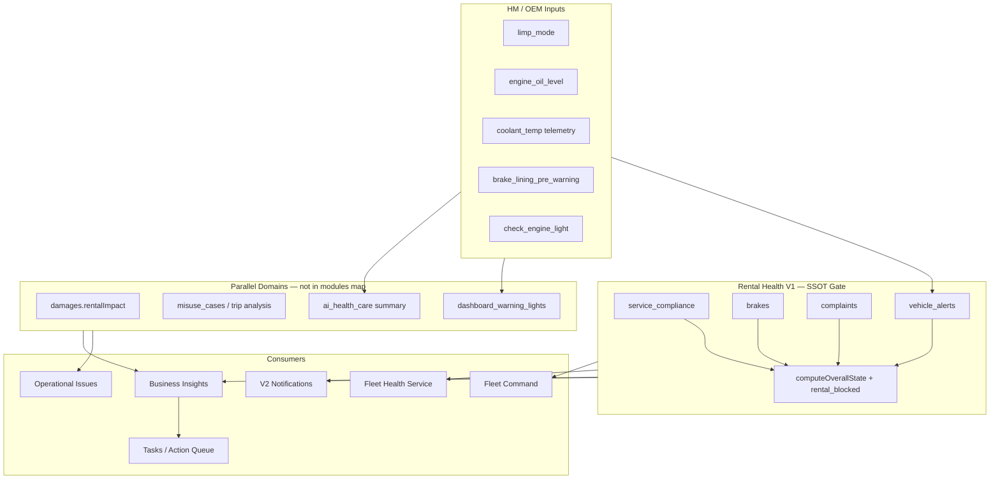

# Vehicle Warnings — Other Health Modules Audit (Prompt 10/26)

| Feld | Wert |
|------|------|
| **Audit-ID** | `vehicle-warnings-production-readiness-2026-07` |
| **Prompt** | **10 von 26** — Warnmeldungen aus übrigen Fahrzeugzustandsmodulen |
| **Erstellt (UTC)** | 2026-07-25 |
| **Basis-Commit** | `1d0f2caebe56aa1ecd23295aa33d20e953daa95d` |
| **Vorgänger** | [`08-battery-warning-audit.md`](./08-battery-warning-audit.md) |
| **Modus** | **Analyse only** — keine Codeänderungen, keine Remediation |
| **Produktionsdaten verändert** | **Nein** |

**Bereits auditiert (nicht wiederholt):** Battery (Prompt 9), Tires (Prompt 8), DTC / Error Codes (Prompt 7).

**Referenz-Architektur:**

- Rental Health V1 — 7 Modul-Keys in `rental-health.types.ts`
- Parallele Domänen: Damages, Misuse, Handover/Inspections, Dashboard Warning Lights, AI Health Care

---

## 1. Executive Summary

Neben Battery, Tires und DTC laufen Fahrzeugwarnungen über **drei Schichten**:

1. **Rental Health V1** (`RentalHealthService`) — kanonische Modul-Ampeln + `rental_blocked`
2. **Parallele Domänen** — Damages, Misuse, Return-Inspection-Insights (nicht in `modules.*`)
3. **Display-/AI-Schicht** — Dashboard Warning Lights, AI Health Care (summary-only, nicht authoritative)

**Kernbefunde:**

| Thema | Urteil |
|-------|--------|
| Fehlende Daten → „Gut“ | **Global verhindert** in `computeOverallState` (`unknown` schlägt `good`); **modulspezifisch** teils `good` bei explizit leerem Zustand (keine Complaints, DTC clean) |
| Alte Daten → aktuelle Warnung | **Teilweise** — `data_stale` (48 h) + HM-Service-Stale (7 d); Compliance-Daten (TÜV/BOKraft) ohne Stale-Gate auf Datumsfeldern |
| Doppelte Gründe | **Ja** — Limp/Oil in `vehicle_alerts` + `blocking_reasons`; Bremsen in Rental + HM pre-warning + AI Summary; Service critical in Modul ohne Block + Insight |
| Service vs. Compliance | **Getrennt** in einer Modul-Schlüssel `service_compliance`, aber **unterschiedliche Block-Logik**: TÜV/BOKraft blockieren; HM-Service-Overdue **nicht** |
| TÜV / BOKraft | **Korrekt getrennt** — eigene Datumsfelder, Reasons, Insights, Tasks |
| Damage/Inspection vs. Telemetrie | **Parallele Pfade** — Schaden `rentalImpact` nur Frontend; Handover → Complaints; kein zentraler Kollisionsresolver |
| Unbekannte Module / Limited Data | `unknown` zieht `overall_state` nach unten; FHS-Band „Limited data“ separat; `rental_blocked: null` bei partial pipeline |

---

## 2. Scope & Methodik

### 2.1 Modul-Landschaft

| Anforderung (Prompt) | Rental-Health-Modul | Primärpfad | In `rental_blocked`? |
|----------------------|---------------------|------------|----------------------|
| **brakes** | `modules.brakes` | `brake-rental-health.policy` | Nur `HARD_BLOCK` |
| **engine** | `vehicle_alerts` (Limp) + DTC + Dashboard MIL | HM / DTC / telltales | Limp → ja; MIL → nein (V1) |
| **coolant** | — | HM Telemetry `engineCoolantTemperatureC` | Nein |
| **oil** | `vehicle_alerts` | HM `oilLevel` | LOW/MINIMUM → ja |
| **charging** | — (EV: Battery HV-Live) | DIMO/HM EV-Signale | Nein |
| **drivetrain** | `vehicle_alerts` (Limp only) | HM limp mode | Limp → ja |
| **emissions** | — | `check_engine_light` (Dashboard) | Nein in V1 |
| **service** | `service_compliance` (HM next service) | `ServiceComplianceService` | **Nein** |
| **TÜV/HU** | `service_compliance` | Vehicle `nextTuvDate` | **Ja** wenn overdue |
| **BOKraft** | `service_compliance` | Vehicle `nextBokraftDate` | **Ja** wenn overdue |
| **damage** | — | `DamagesService` + FE `damage-rental-impact` | **Nein** (geplant) |
| **misuse** | — | `misuse-cases` + trip analysis | Nein |
| **inspections** | `complaints` (wenn blockierend) | Handover → `VehicleComplaint` | Nur `blocksRental` |
| **unknown modules** | `state: unknown` / `n_a` | Aggregat-Logik | `null` gate |
| **limited data** | `availability`, FHS `limited_data` | Pipeline partial/degraded | `rental_blocked: null` |

### 2.2 Primärquellen (CODE_VERIFIED)

| Bereich | Pfad |
|---------|------|
| Rental Orchestration | `backend/.../rental-health/rental-health.service.ts` |
| Aggregat / Stale | `backend/.../rental-health/rental-health.types.ts` |
| Brakes Policy | `backend/.../rental-health/brake-rental-health.policy.ts` |
| Service / TÜV / BOKraft | `backend/.../service-compliance/service-compliance.service.ts` |
| Compliance Insights/Tasks | `backend/.../service-compliance/service-compliance-operational.signals.ts` |
| HM Vehicle Alerts V1 | `rental-health.service.ts` → `evaluateVehicleAlerts()` |
| Dashboard Telltales | `backend/.../dashboard-warning-lights/dashboard-warning-lights.service.ts` |
| AI Health Care | `backend/.../health-summary/ai-health-care-aggregation.service.ts` |
| Complaints / Handover | `technical-observations.service.ts`, `bookings-handover.service.ts` |
| Damages | `backend/.../damages/damages.service.ts` |
| Misuse | `backend/.../misuse-cases/` |
| BI Detectors | `compliance-operational`, `brake-critical`, `return-needs-inspection` |
| Notifications | `rental-health-notification.projector.ts`, `technical-observation-notification.adapter.ts` |
| Tasks | `task-automation-rule.catalog.ts`, `insight-task-bridge.service.ts` |
| FE Fleet Health | `frontend/.../fleet-health-control-center.ts` |
| FE Damage Gate | `frontend/.../damage-rental-impact.ts` |
| FE Ops Issues | `frontend/.../operational-issues/normalizeOperationalIssues.ts` |

---

## 3. Architektur (Signalfluss)



---

## 4. Modul-Audit-Matrix (13 Dimensionen)

Legende: **RH** = Rental Health Modul · **BL** = `blocking_reasons` · **N** = Notification · **T** = Task · **UI** = Frontend-Surface · **AI** = AI Health Care · **Org** = Mandantentrennung

### 4.1 Brakes (`modules.brakes`)

| Dimension | Befund |
|-----------|--------|
| **Rohquelle** | `BrakeHealthService.getSummary()` — Wear-Modell, Messungen, Workshop, HM brake DTC, `BrakeHealthAlert` |
| **Datenalter** | `resolveBrakeMeasurementFreshness` (config `staleDays`); Modell `isStale` 48 h; `data_stale` auf Read Model |
| **Normalisierung** | `brake-status.ts` → `aggregateBrakeCondition`; Policy A–G in `brake-rental-health.policy.ts` |
| **Severity** | `GOOD/WATCH/WARNING/CRITICAL/UNKNOWN` → Rental `good/warning/critical/unknown` |
| **Lifecycle** | `BrakeHealthAlertService.syncAlerts`; Review-Override `BrakeRentalHealthReviewService` |
| **Dedup** | Alert fingerprints; Insight `brake_critical:{vehicleId}`; Notification `BRAKE_CRITICAL` per vehicle |
| **Rental Impact** | `rentalBlockingEvidence` auf Read Model |
| **Techn. Blockade** | Nur `HARD_BLOCK` (gemessen kritisch, ABS/DTC/fluid critical, immediate replacement) |
| **Aufgabe** | `BRAKE_CRITICAL_HEALTH` → `BRAKE_CHECK`; dedupe `brake_critical:{vehicleId}` |
| **Notification** | `projectVehicleHealthWarnings` → `BRAKE_CRITICAL` bei warning/critical |
| **UI** | Rental module reason; FHS „Watch“; Fleet „Bremsen prüfen“; Brake Detail |
| **AI-Kontext** | `computeAiStatus`: CRITICAL/WATCH aus `BrakeHealthService`; HM pre-warning → ATTENTION |
| **Mandantentrennung** | Vehicle `organizationId`; Override org-scoped |

**Besonderheiten:** Geschätzter CRITICAL-Wear → `MEASUREMENT_REQUIRED`, **kein** Hard-Block. `good` wird zu `unknown` bei Review-Pflicht / unbekannter Wear.

---

### 4.2 Engine (`vehicle_alerts` + DTC + Dashboard)

| Dimension | Befund |
|-----------|--------|
| **Rohquelle** | HM `limpModeActive`; DTC `error_codes`; Dashboard `engine_limp_mode`, `check_engine_light` |
| **Datenalter** | HM `lastUpdatedAt` + `isStale` 48 h auf `vehicle_alerts`; DTC poll freshness |
| **Normalisierung** | Rental V1: boolean Limp; DTC severity bands; Telltales: active/off/stale |
| **Severity** | Limp → `critical`; MIL aktiv → Dashboard `warning`/`critical`, Rental **nicht** gemappt (V1) |
| **Lifecycle** | DTC `is_active` lifecycle (siehe DTC-Audit); Telltales envelope freshness |
| **Dedup** | DTC per code; Limp ein Eintrag in `vehicle_alerts` + duplicate in `blocking_reasons` |
| **Rental Impact** | Limp blockiert; MIL **nicht** in `collectBlockingReasons` |
| **Techn. Blockade** | Limp → ja; Safety-DTC critical → ja (Modul `error_codes`) |
| **Aufgabe** | DTC-Tasks über Insight-Bridge; kein dedizierter „Engine“-Task |
| **Notification** | `ACTIVE_DTC` per code; **kein** Limp/Oil/MIL Event in `VEHICLE_HEALTH_NOTIFICATION_EVENT_TYPES` |
| **UI** | `vehicle_alerts` reason; Dashboard tile; AI `limpMode` indicator |
| **AI-Kontext** | Limp → `CRITICAL`; check engine nur via Dashboard in `dashboardWarningLights` |
| **Mandantentrennung** | Org-scoped vehicle + DTC queries |

**Gap:** Dashboard `check_engine_light` mit `rentalImpact: inspect_before_next_rental` ist **nicht** in Rental Health V1 integriert (TODO V2 Migration zu `DashboardWarningLightsService`).

---

### 4.3 Coolant

| Dimension | Befund |
|-----------|--------|
| **Rohquelle** | HM `diagnostics.get.engine_coolant_temperature` → `vehicle_latest_states.engineCoolantTemperatureC` |
| **Datenalter** | Telemetrie-Mirror; kein Health-Modul-Freshness-Vertrag |
| **Normalisierung** | Keine Warning-Policy |
| **Severity** | — |
| **Lifecycle** | — |
| **Dedup** | — |
| **Rental Impact** | Keiner |
| **Techn. Blockade** | Nein |
| **Aufgabe** | Nein |
| **Notification** | Nein |
| **UI** | Ggf. Live-Telemetrie / Data-Analyse; **kein** Rental-Modul |
| **AI-Kontext** | Nicht in `computeAiStatus` |
| **Mandantentrennung** | Vehicle-scoped telemetry |

**Urteil:** Coolant ist **Telemetrie-only**, keine produktive Warnpipeline.

---

### 4.4 Oil (`vehicle_alerts` + blocking)

| Dimension | Befund |
|-----------|--------|
| **Rohquelle** | HM `diagnostics.get.engine_oil_level` |
| **Datenalter** | `lastUpdatedAt` + 48 h stale auf Modul |
| **Normalisierung** | Status LOW/MINIMUM/HIGH/MAXIMUM/UNKNOWN |
| **Severity** | LOW/MINIMUM → `critical`; HIGH → `warning` |
| **Lifecycle** | HM poll; kein eigener Alert-Store |
| **Dedup** | Modul-Reason + separater `blocking_reasons` Eintrag „Motoröl Minimum“ (**Doppelung**) |
| **Rental Impact** | Block nur LOW/MINIMUM |
| **Techn. Blockade** | Ja bei Minimum |
| **Aufgabe** | Kein dedizierter Oil-Task-Katalog |
| **Notification** | **Nicht** in rental-health projector |
| **UI** | `vehicle_alerts`; AI `oilLevelDisplay`; Dashboard `engine_oil_level` |
| **AI-Kontext** | LOW → ATTENTION_NEEDED |
| **Mandantentrennung** | Per vehicle/org |

**Missing data:** Limp unknown + Oil unknown → `unknown`, **nicht** `good`. Explizite Ruhe-Signale → `good`.

---

### 4.5 Charging (EV)

| Dimension | Befund |
|-----------|--------|
| **Rohquelle** | DIMO `tractionBatteryIsCharging`, `evSoc`, Kabel-Status; HM EV dashboard lights (falls vorhanden) |
| **Datenalter** | Battery HV freshness (siehe Prompt 9); 7 d HV telemetry threshold |
| **Normalisierung** | Live State in Canonical Battery / `vehicle_latest_states` |
| **Severity** | Kein dediziertes „Charging Warning“-Modul |
| **Lifecycle** | — |
| **Dedup** | — |
| **Rental Impact** | Keiner (Ladezustand blockiert Vermietung nicht) |
| **Techn. Blockade** | Nein |
| **Aufgabe** | Nein |
| **Notification** | Nein |
| **UI** | Fleet Energy `evSoc`; Battery HV-Tab; ggf. Connectivity |
| **AI-Kontext** | Nicht separat eskaliert |
| **Mandantentrennung** | Vehicle/org |

**Urteil:** Charging ist **Betriebs-/Energieanzeige**, keine Health-Warnung im Rental-Gate.

---

### 4.6 Drivetrain

| Dimension | Befund |
|-----------|--------|
| **Rohquelle** | Primär HM **Limp Mode** (= drivetrain protection) |
| **Datenalter** | Wie Engine/Limp |
| **Normalisierung** | Boolean in `vehicle_alerts` |
| **Severity** | `critical` |
| **Lifecycle** | HM poll |
| **Dedup** | Gleich wie Limp (siehe Engine) |
| **Rental Impact** | Block |
| **Techn. Blockade** | Ja |
| **Aufgabe** | Nein |
| **Notification** | Nein (nicht im projector) |
| **UI** | „Limp Mode aktiv“ / „Notlauf“ |
| **AI-Kontext** | CRITICAL |
| **Mandantentrennung** | Org-scoped |

Kein separates Getriebe-/Antriebsstrang-Modul beyond Limp.

---

### 4.7 Emissions

| Dimension | Befund |
|-----------|--------|
| **Rohquelle** | Dashboard `check_engine_light` (MIL); ggf. DTC emissions-related codes → `error_codes` |
| **Datenalter** | Telltale envelope freshness; DTC poll |
| **Normalisierung** | Telltale state machine; DTC bands |
| **Severity** | MIL aktiv → Dashboard warning; DTC band-abhängig |
| **Lifecycle** | DTC active/clear; telltale off_confirmed |
| **Dedup** | DTC code + MIL parallel möglich |
| **Rental Impact** | DTC safety-critical → block; MIL alone → **no block** in V1 |
| **Techn. Blockade** | Nur über DTC safety band |
| **Aufgabe** | DTC-driven |
| **Notification** | `ACTIVE_DTC` only |
| **UI** | Dashboard „Motorkontrollleuchte“; DTC module |
| **AI-Kontext** | Indirekt über DTC/Brake/Tire — MIL nicht eigenständig in `aiStatus` |
| **Mandantentrennung** | Org-scoped |

---

### 4.8 Service (HM/OEM Next Service)

| Dimension | Befund |
|-----------|--------|
| **Rohquelle** | HM `getServiceInfoSignals` — **keine** Intervall-Mathematik in SynqDrive |
| **Datenalter** | HM fresh ≤ **7 Tage**; sonst `STALE` → Modul `unknown` |
| **Normalisierung** | `evaluateNextService` → severity CRITICAL/WARNING/INFO |
| **Severity** | Overdue → `critical` im Modul; due soon → `warning` |
| **Lifecycle** | HM poll |
| **Dedup** | Insight `service_overdue:{vehicleId}`; Task signals `service_overdue:{vehicleId}` |
| **Rental Impact** | **`blocksRental: false`** auf Next-Service DTO |
| **Techn. Blockade** | **Nein** — bewusst Compliance/Scheduling-Dimension |
| **Aufgabe** | `VEHICLE_SERVICE_OVERDUE` → `VEHICLE_SERVICE`; `blocksVehicleAvailability: false` |
| **Notification** | **Nicht** via rental-health projector |
| **UI** | `service_compliance` reason; Service-Info-Box; Insights „Service überfällig“ |
| **AI-Kontext** | Über `HealthSummaryService` watchpoints, nicht Limp-Level |
| **Mandantentrennung** | `organizationId` in BI detector |

**Wichtig:** Service-Overdue erzeugt **technisch wirkendes** `critical` im Modul, blockiert Vermietung aber **nicht** — getrennte Semantik von TÜV/BOKraft.

---

### 4.9 TÜV / HU

| Dimension | Befund |
|-----------|--------|
| **Rohquelle** | Vehicle `nextTuvDate`, `lastTuvDate` (manuell/AI-Upload/Dokument) |
| **Datenalter** | Datumsbasiert — **kein** 48 h stale auf Compliance-Datum selbst |
| **Normalisierung** | `evaluateTuvBokraft()` → `tuvRemainingDays`, `tuvOverdue` |
| **Severity** | Overdue → `critical`; ≤30 d → `warning` |
| **Lifecycle** | Manuell gepflegt + Service-Events History |
| **Dedup** | `tuv_overdue:{vehicleId}` Insight/Task; Blocking-Reason separat |
| **Rental Impact** | **Ja** — `collectBlockingReasons` Priority 1 |
| **Techn. Blockade** | **Ja** (Compliance-Block, nicht mechanisch) |
| **Aufgabe** | `VEHICLE_INSPECTION_TUV_DUE` → `VEHICLE_INSPECTION`; `blocksRental: true` bei CRITICAL |
| **Notification** | Compliance-Insights, nicht rental-health sweep |
| **UI** | Modul reason; Compliance-Badges; Ops `service_overdue` Taxonomie |
| **AI-Kontext** | Health Summary future outlook / compliance narrative |
| **Mandantentrennung** | Vehicle belongs to org |

---

### 4.10 BOKraft

| Dimension | Befund |
|-----------|--------|
| **Rohquelle** | Vehicle `nextBokraftDate`, `lastBokraftDate` — **eigene Felder** |
| **Datenalter** | Wie TÜV — datumsbasiert |
| **Normalisierung** | Separater Ast in `evaluateTuvBokraft` / `toRentalModuleHealth` |
| **Severity** | Eigenständige overdue/warning Bänder (30 d) |
| **Lifecycle** | Wie TÜV |
| **Dedup** | `bokraft_overdue:{vehicleId}` — **eigener** dedupeBase |
| **Rental Impact** | **Ja**, separater Blocking-Reason |
| **Techn. Blockade** | **Ja** (Compliance) |
| **Aufgabe** | `VEHICLE_INSPECTION_BOKRAFT_DUE` |
| **Notification** | Wie TÜV |
| **UI** | Eigene Reason-Strings („BOKraft abgelaufen…“) |
| **AI-Kontext** | Wie TÜV |
| **Mandantentrennung** | Org-scoped |

**Urteil Frage TÜV/BOKraft:** **Korrekt getrennt** in Datenmodell, Evaluation, Reasons, Insights und Tasks.

---

### 4.11 Damage

| Dimension | Befund |
|-----------|--------|
| **Rohquelle** | `VehicleDamage` records, Handover-Fotos, AI Upload |
| **Datenalter** | `updatedAt` auf Schaden; kein Rental-Health stale |
| **Normalisierung** | `rentalImpact`: NONE / WATCH / BLOCK_RENTAL / SAFETY_CRITICAL |
| **Severity** | Frontend `deriveDamageRentalImpact()` |
| **Lifecycle** | Status open/repaired; Repair tasks |
| **Dedup** | `damageRepairDedupKey`; Repair task per damage |
| **Rental Impact** | FE `isDamageRentalBlocked()` — **nicht** in `RentalHealthService` |
| **Techn. Blockade** | FE-only; Kommentar: Backend-Hook geplant |
| **Aufgabe** | `REPAIR_REQUIRED` / `createRepairTask()` |
| **Notification** | Nicht über rental-health projector |
| **UI** | Damage-Tab, Overview readiness attention |
| **AI-Kontext** | Damage in Health Summary narratives (separater Pfad) |
| **Mandantentrennung** | `organizationId` auf `DamagesService` |

---

### 4.12 Misuse / Abuse

| Dimension | Befund |
|-----------|--------|
| **Rohquelle** | Trip HF analysis, DIMO safety events, `rentalDrivingAnalysis` |
| **Datenalter** | Post-trip aggregation; recovery scheduler |
| **Normalisierung** | `misuse-case-rules`, aggregator |
| **Severity** | Case-level; nicht Rental-Modul |
| **Lifecycle** | Case open/closed |
| **Dedup** | `trip:{tripId}:misuse:{type}` / `misuse:{issueType}:{id}` |
| **Rental Impact** | **Keiner** |
| **Techn. Blockade** | Nein |
| **Aufgabe** | Optional über Ops / manuell |
| **Notification** | Operational domain, nicht vehicle_health sweep |
| **UI** | Operational Issues — **excluded from vehicle health by default** |
| **AI-Kontext** | Return inspection detector nutzt `abuseDetectionCount` |
| **Mandantentrennung** | `MisuseCasesService` org-scoped |

---

### 4.13 Inspections (Return / Handover)

| Dimension | Befund |
|-----------|--------|
| **Rohquelle** | `ReturnNeedsInspectionDetector`; Handover observations |
| **Datenalter** | Booking window 24 h ahead; Complaint `updatedAt` |
| **Normalisierung** | Stress score, km exceeded, rental days |
| **Severity** | INFO/WARNING Insight |
| **Lifecycle** | Insight dedupe `return_inspection:{bookingId}` |
| **Dedup** | Pro Booking |
| **Rental Impact** | Nein |
| **Techn. Blockade** | Nein |
| **Aufgabe** | Über Insight-Bridge wenn konfiguriert |
| **Notification** | Return-inspection Insight path |
| **UI** | Insights „Return Needs Attention“ |
| **AI-Kontext** | Nicht authoritative |
| **Mandantentrennung** | `organizationId` on booking/analysis |

**Handover → Complaints:** `blocksRental` explizit → `modules.complaints` critical + Blocking-Reason.

---

### 4.14 Complaints / Technical Observations (`modules.complaints`)

| Dimension | Befund |
|-----------|--------|
| **Rohquelle** | `vehicle_complaints` — Handover, Operator, Import |
| **Datenalter** | `updatedAt`; `data_stale: false` bei aktiven Rows |
| **Normalisierung** | Open statuses; urgency CRITICAL |
| **Severity** | `critical` nur bei `blocksRental` oder urgency CRITICAL; sonst `warning` |
| **Lifecycle** | Status transitions; `TechnicalObservationsService` |
| **Dedup** | Notification fingerprint `obs:{id}` |
| **Rental Impact** | Nur `blocksRental === true` |
| **Techn. Blockade** | Explizites Flag — Severity allein **nicht** |
| **Aufgabe** | Task conversion in technical-observations |
| **Notification** | `TECHNICAL_OBSERVATION_ACTIVE` |
| **UI** | Complaints list; Rental module |
| **AI-Kontext** | Health Summary watchpoints |
| **Mandantentrennung** | Strict `organizationId` |

---

### 4.15 Unknown Modules & Limited Data

| Dimension | Befund |
|-----------|--------|
| **Rohquelle** | Pipeline load failures; `n_a` (HM nicht verbunden); evaluator `unknown` |
| **Datenalter** | `RENTAL_HEALTH_STALE_MS` = 48 h |
| **Normalisierung** | `computeOverallState`: any `unknown` → aggregate `unknown` |
| **Severity** | `unknown` rank 1 — unter warning/critical, über good |
| **Lifecycle** | `buildDegradedVehicleHealth()` bei Fleet-Fan-out-Failure |
| **Dedup** | — |
| **Rental Impact** | `rental_blocked: null` wenn `availability !== ready` |
| **Techn. Blockade** | Gate **unsicher** — manual review via `isRentalBlocked()` |
| **Aufgabe** | Nein |
| **Notification** | Degraded health may suppress false positives |
| **UI** | FHS band `limited_data` / `unevaluable`; label „Limited data“ |
| **AI-Kontext** | `NO_RECENT_DATA` when no module signals |
| **Mandantentrennung** | Cache key per org+vehicle |

**`n_a` modules:** excluded from aggregate — verfälschen Gesamtbewertung **nicht** nach oben.

---

## 5. Explizite Prüffragen (Prompt 10)

### 5.1 Melden Module bei fehlenden Daten „Gut“?

| Modul | Fehlende Daten → `good`? | Anmerkung |
|-------|--------------------------|-----------|
| Brakes | **Nein** | Unknown/review → `unknown` oder warning |
| Service | **Nein** wenn weder Termine noch HM | `unknown` + `data_stale` |
| Service | **Ja** wenn Termine gültig + HM tracked OK | Explizit compliant |
| Complaints | **Ja** wenn keine offenen | Korrekt „keine Beobachtung“ |
| Vehicle alerts | **Nein** bei unknown signals | Nur explicit quiet → `good` |
| DTC | **Ja** bei `clean` | Nach erfolgreicher Prüfung |
| TÜV/BOKraft | **Ja** wenn Daten vorhanden und nicht fällig | |
| Damage | **Ja** (RENTABLE) ohne aktive Schäden | Separate Domäne |
| Aggregat | **Nein** bei any `unknown` | `computeOverallState` |

### 5.2 Erzeugen alte Daten aktuelle Warnungen?

| Pfad | Risiko |
|------|--------|
| TÜV/BOKraft overdue | **Ja, korrekt** — Datum in Vergangenheit bleibt blockierend |
| HM Oil/Limp stale | Modul `data_stale: true`, State bleibt bis HM refresh |
| HM Service >7 d | Downgrade zu `unknown`, **kein** critical aus Stale |
| Brake measurement stale | `REVIEW_REQUIRED`, nicht Hard-Block |
| Compliance module `data_stale` | Gesetzt bei NO_TRACKING/STALE — begrenzt false „good“ |

### 5.3 Doppelte Meldung desselben Grundes?

| Kollision | Surfaces |
|-----------|----------|
| Limp Mode | `vehicle_alerts` + `blocking_reasons` + AI CRITICAL |
| Oil Minimum | `vehicle_alerts` + `blocking_reasons` + AI ATTENTION |
| Brake critical | Rental module + `BRAKE_CRITICAL` notification + Insight + HM pre-warning + AI |
| TÜV overdue | `service_compliance` + `blocking_reasons` + Insight + Task |
| DTC + MIL | `error_codes` + Dashboard light + ggf. ACTIVE_DTC notification |
| Tire pressure | Tire module + HM in AI (nicht rental vehicle_alerts) |

**Dedup innerhalb Schicht** stark; **cross-surface** schwach.

### 5.4 Servicefälligkeit: technische Warnung oder Compliance?

**Beides in einem Modul-Schlüssel, unterschiedliche Wirkung:**

| Signal | Modul-State | `rental_blocked` | Dimension |
|--------|-------------|------------------|-----------|
| HM Service overdue | `critical` möglich | **false** | Wartung / Scheduling |
| TÜV/BOKraft overdue | `critical` | **true** | Regulatorische Compliance |
| TÜV due in 30 d | `warning` | false | Compliance-Vorlauf |

Fleet UI mappt `service_compliance` warning zu „Service fällig“ — **nicht** als technische Sicherheitswarnung klassifiziert, obwohl Modul-State `critical` sein kann.

### 5.5 TÜV / BOKraft korrekt getrennt?

**Ja.**

- Separate DB-Felder und History-Event-Typen
- `evaluateTuvBokraft()` liefert getrennte DTO-Teile
- `toRentalModuleHealth()` prüft TÜV vor BOKraft (Priorität im Reason)
- Eigene Insight-Typen `TUV_OVERDUE` / `BOKRAFT_OVERDUE`
- Eigene Task-Katalog-Regeln und `dedupeBase`

### 5.6 Kollision Damage/Inspection mit Telemetrie?

| Szenario | Verhalten |
|----------|-----------|
| Handover-Schaden + gleichzeitiger DTC | Parallele Module — **kein** Merge |
| Handover-Observation `blocksRental` + Limp | **Beide** in `blocking_reasons` |
| Return inspection (stress) + Misuse case | Separate Insights/Ops — kein Rental-Modul |
| Damage BLOCK_RENTAL + Rental Health good | **Widerspruch möglich** — FE blockiert, Backend-Gate nicht |

**Kein zentraler Conflict-Resolver** zwischen Damage und Telemetrie-Findings.

### 5.7 Verfälschen unbekannte Module die Gesamtbewertung?

| Mechanismus | Wirkung |
|-------------|---------|
| `unknown` in einem Modul | `overall_state = unknown` — **nie** good |
| `n_a` (z. B. kein HM) | Aus Aggregat **ausgeschlossen** |
| `partial` availability | `rental_blocked: null` — nicht „frei“ |
| FHS `limited_data` band | Zählt unknown/stale/n_a Module separat von „Technisch prüfen“ |
| Degraded fleet response | Alle Module unknown — kein false good |

**Urteil:** Unbekannte Daten **ziehen** die Gesamtbewertung nach unten oder machen Gate unentscheidbar — Verfälschung nach **oben** ist architektonisch verhindert.

---

## 6. Notifications & Tasks (Querschnitt)

### 6.1 Rental-Health Notification Projector

```17:20:backend/src/modules/notifications/adapters/rental-health-notification.projector.ts
const MODULE_EVENT_MAP = {
  battery: 'BATTERY_CRITICAL',
  brakes: 'BRAKE_CRITICAL',
} as const;
```

**Nicht projiziert:** `service_compliance`, `complaints`, `vehicle_alerts`, `error_codes` (DTC separat per row).

### 6.2 Task-Automation (Auswahl)

| Regel | Insight | Task | Blockiert Vermietung? |
|-------|---------|------|------------------------|
| `VEHICLE_SERVICE_OVERDUE` | SERVICE_OVERDUE | VEHICLE_SERVICE | Nein |
| `VEHICLE_INSPECTION_TUV_DUE` | TUV_OVERDUE | VEHICLE_INSPECTION | Ja (CRITICAL) |
| `VEHICLE_INSPECTION_BOKRAFT_DUE` | BOKRAFT_OVERDUE | VEHICLE_INSPECTION | Ja (CRITICAL) |
| `BRAKE_CRITICAL_HEALTH` | BRAKE_CRITICAL | BRAKE_CHECK | Nein (außer Hard-Block parallel) |
| Repair (Damage) | — | REPAIR | Impact-abhängig |

### 6.3 AI Health Care — Rolle

- **Summary-only** — schreibt **keine** authoritative Module
- Eskaliert: Limp, Brake CRITICAL/WATCH, HM tire/brake pre-warnings, Oil LOW
- **Nicht:** Coolant, Charging, Emissions MIL allein, Service compliance, Damage, Misuse
- Bei fehlenden Daten: `NO_RECENT_DATA`

---

## 7. Cross-Surface-Konsistenz

| Surface | SSOT | Typische Abweichung |
|---------|------|---------------------|
| Rental Health API | `RentalHealthService.getVehicleHealth()` | — |
| Fleet Command | `modules.*` + `blocking_reasons` | Gekürzte Chips |
| Fleet Health Service | `overall_state` + bands | „Technisch prüfen“ = gesamtes warning |
| Vehicle Insights | BI detectors | Service/Return ohne Rental-Gate |
| Operational Issues | Taxonomie/Regex | Misuse excluded from health |
| Damage Overview | `deriveDamageRentalImpact` | Blockiert ohne Rental-API |
| Dashboard Telltales | Eigener Read Model | rentalImpact nicht in V1 gate |
| AI Health Care | Display aggregate | Weicher als Hard-Block |

---

## 8. Risiko-Register (OTH-W01–OTH-W15)

| ID | Risiko | Schwere | Evidenz |
|----|--------|---------|---------|
| OTH-W01 | Service `critical` im Modul ohne `rental_blocked` — Missverständnis | Hoch | `service-compliance.service.ts` |
| OTH-W02 | Damage BLOCK_RENTAL nur Frontend | Hoch | `damage-rental-impact.ts` |
| OTH-W03 | MIL/check engine nicht in Rental V1 | Mittel | `evaluateVehicleAlerts` TODO V2 |
| OTH-W04 | Limp/Oil doppelt in Modul + blocking_reasons | Niedrig | `collectBlockingReasons` |
| OTH-W05 | Coolant/Charging ohne Warnpipeline | Mittel | Telemetry-only |
| OTH-W06 | HM vehicle_alerts vs Dashboard Lights Divergenz | Mittel | Zwei HM-Pfade |
| OTH-W07 | Brake WATCH → Insight INFO + Rental warning | Niedrig | `BrakeCriticalDetector` |
| OTH-W08 | Complaints CRITICAL ohne blocksRental — kein Block | Info | By design |
| OTH-W09 | TÜV/BOKraft ohne Zeit-Stale auf Datumsfeldern | Niedrig | Datums-SSOT |
| OTH-W10 | Cross-surface Brake: Rental + Notification + AI | Mittel | Mehrfach-Surfaces |
| OTH-W11 | Return inspection englische Titel | Niedrig | `return-needs-inspection.detector.ts` |
| OTH-W12 | Misuse nicht in Rental Health | Info | Separate domain |
| OTH-W13 | `partial` pipeline → `rental_blocked: null` Ops-Unsicherheit | Mittel | `resolveRentalBlockedState` |
| OTH-W14 | AI Health Care kann CRITICAL ohne Backend-Block | Mittel | Summary-only |
| OTH-W15 | Kein Conflict-Resolver Damage vs Telemetrie | Hoch | Architektur-Gap |

---

## 9. Zusammenfassung Urteil

| Kriterium | Urteil |
|-----------|--------|
| Modul-Abdeckung Rental Health V1 | **7 Keys** — nicht alle Prompt-Dimensionen haben eigenes Modul |
| Missing → good | **Global gehemmt**; lokal nur bei explizit leerem Zustand |
| Stale / alte Daten | **Uneinheitlich** — HM 7 d / Rental 48 h / Compliance datumsbasiert |
| Service vs Compliance | **Fachlich getrennt** in Blocking; **visuell** ein Modul |
| TÜV / BOKraft | **Korrekt getrennt** |
| Damage / Misuse / Inspection | **Parallel** — Rental-Gate-Lücken |
| Mandantentrennung | **Konsequent** org-scoped |
| Dedup / Idempotenz | **Stark** pro Schicht; **schwach** cross-surface |

**Gesamt für übrige Health-Warnungen (Prompt 10):** Die **Rental-Health-Pipeline** ist für Bremsen, Service-Compliance, Complaints und HM-Kernsignale (Limp/Oil) **strukturiert und tenant-sicher**, mit klaren **Evidence-Gates** bei Bremsen und expliziter **Compliance-Blockade** für TÜV/BOKraft. **Lücken** bestehen bei Damage-Backend-Integration, Emissions/MIL-V1, Coolant/Charging als reiner Telemetrie, und **Doppel- Surfaces** zwischen Rental, Insights, Notifications und AI Summary.

---

## 10. Änderungshistorie

| Version | Datum | Änderung |
|---------|-------|----------|
| 1.0 | 2026-07-25 | Erstaudit Prompt 10/26 |

**Changes / Architektur (SynqDrive Code):** nicht aktualisiert (audit-only).
