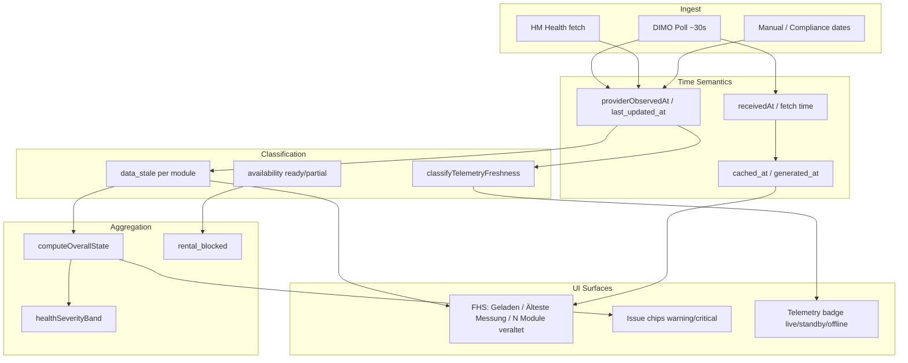

# Vehicle Warnings — Freshness, Confidence & Non-Assessability Audit (Prompt 11/26)

| Feld | Wert |
|------|------|
| **Audit-ID** | `vehicle-warnings-production-readiness-2026-07` |
| **Prompt** | **11 von 26** — Datenaktualität, Verlässlichkeit, Nicht-Bewertbarkeit |
| **Erstellt (UTC)** | 2026-07-25 |
| **Basis-Commit** | `1d0f2caebe56aa1ecd23295aa33d20e953daa95d` |
| **Vorgänger** | [`09-other-health-warning-audit.md`](./09-other-health-warning-audit.md) |
| **Modus** | **Analyse only** — keine Codeänderungen, keine Remediation |
| **Produktionsdaten verändert** | **Nein** |

**Referenz-Dokumente (gelesen):**

- [`02-canonical-status-model.md`](./02-canonical-status-model.md) — Dimensionen D4 Telemetry, D9 Data Confidence, Offline-Regeln
- [`03-warning-data-lineage.md`](./03-warning-data-lineage.md) — Timestamp-Priorität, MT-08 Naming-Divergenz
- [`05-telemetry-ingestion-audit.md`](./05-telemetry-ingestion-audit.md) — Poll vs. Observation, Cache-TTLs
- [`08-battery-warning-audit.md`](./08-battery-warning-audit.md) — `battery-freshness.policy`, Publication-Maturity
- [`09-other-health-warning-audit.md`](./09-other-health-warning-audit.md) — Modul-`data_stale`, HM 7 d

---

## 1. Executive Summary

SynqDrive trennt **bewusst** mehrere Zeitachsen, die in der UI nebeneinander erscheinen:

| Zeitachse | Bedeutung | Typische UI-Quelle |
|-----------|-----------|-------------------|
| **Fetch-Zeit** | Wann die Oberfläche Daten **geladen** hat | `healthFetchedAt`, `generated_at`, Redis `cached_at` |
| **Provider-Observation** | Wann der **Messwert** zuletzt gültig war | `providerObservedAt`, `last_updated_at`, HM `lastUpdatedAt` |
| **Modul-Stale-Flag** | Modul-`last_updated_at` älter als Schwellwert | `data_stale` (48 h Rental Health) |
| **Telemetry-Freshness** | Konnektivitätszustand (live/standby/…) | `classifyTelemetryFreshness`, `deriveTelemetryState` |

**Symptom (bekannt):** „Geladen vor 10 Min. · Älteste Messung vor 112 T. · 19 Module veraltet“ **und gleichzeitig** konkrete technische Gesamtzustände — ist **architektonisch erklärbar**, aber **operatorisch missverständlich**:

- **Geladen vor 10 Min.** = API-Fetch der Health-Map ist frisch (`fleet-health-service-freshness.ts`).
- **Älteste Messung vor 112 T.** = Minimum der Modul-`last_updated_at` über die Flotte (kann Compliance-Datum oder alte HM-Messung sein) — **nicht** das Fetch-Alter.
- **19 Module veraltet** = Summe aller `data_stale: true` über Fahrzeuge — **orthogonal** zu `overall_state` warning/critical.
- **Technische Zustände** (`overall_state`, Issue-Chips) folgen Modul-**Severity**, nicht dem Fleet-Freshness-Banner.

**Kernbefunde:**

| Thema | Urteil |
|-------|--------|
| Zentrale Schwellen | **Teilweise** — Telemetry BE+FE aligned; Runtime `deriveTelemetryState` **eigene** Timestamp-Logik |
| `last received` vs. `last observed` | BE-Resolver: **observed first**; FE Runtime: **max(timestamp fields)** ohne Backfill-Guard |
| 112-Tage-Werte in Bewertung | **Nicht global ausgeschlossen** — `data_stale` ja, Severity oft **nein** (TÜV, Complaints, Publication) |
| „Nicht bewertbar“ | `availability !== ready`, `overall_state === unknown`, FHS `unevaluable` |
| Offline + Finding | Compliance/Complaints/Publication können **bestehen bleiben** |
| Auto-Close bei Offline | **Nein** für reife Alerts/Publication; **Ja** für HM/DTC bei Clear |
| Offline + Confidence | **Ja gleichzeitig möglich** — Telemetry-Warnung + Health-Severity + Data-Quality-Hinweis |
| Standby vs. Offline | **Korrekt getrennt** in Kanon (15 min / 24 h / 48 h) |
| UI-Zeitangaben | **Gerundet** ab 48 h auf Tage; mischt Fetch- und Mess-Zeit in einer Zeile |
| VPS-Serverzeit | Code nutzt ISO/`Date.now()` — Agent-Workspace UTC; **Prod-VPS nicht in diesem Prompt verifiziert** |

---

## 2. Scope & Methodik

### 2.1 Im Scope

- `deriveTelemetryState` (FE Runtime + BE Connectivity)
- `classifyTelemetryFreshness` / `resolveTelemetryFreshness`
- Rental-Health-Modul-`data_stale`, `availability`, `computeOverallState`
- Modul-spezifische Freshness (Battery, Tire, Brake, DTC, HM Service, Dashboard Telltales)
- Fleet Health Service Freshness-Banner
- Confidence / Limited Data / `unevaluable`
- Cache-Alter (Rental Health Summary Redis, Fleet Map)
- UI-Zeitformatierung (`formatRelativeTimeAt`, `formatAge`)

### 2.2 Primärquellen (CODE_VERIFIED)

| Bereich | Pfad |
|---------|------|
| BE Telemetry SSOT | `backend/.../vehicle-state-interpreter.ts` |
| BE Timestamp Resolver | `backend/.../telemetry-freshness.resolver.ts` |
| BE Connectivity Runtime | `backend/.../connectivity/domain/vehicle-connectivity-runtime-state.builder.ts` |
| FE Telemetry SSOT | `frontend/.../telemetryFreshness.ts` |
| FE Runtime Telemetry | `frontend/.../runtime/vehicleRuntimeStateBuilder.ts` → `deriveTelemetryState` |
| Rental Health Stale | `backend/.../rental-health/rental-health.types.ts` (`RENTAL_HEALTH_STALE_MS`) |
| Rental Health Cache | `backend/.../rental-health-summary-cache.service.ts` (TTL 45 s) |
| FHS Freshness UI | `frontend/.../fleet-health-service/fleet-health-service-freshness.ts` |
| FHS Severity Bands | `frontend/.../fleet-health-control-center.ts` → `healthSeverityBand` |
| Battery Freshness | `backend/.../battery-health/battery-freshness.policy.ts` |
| HM Service Fresh | `backend/.../service-compliance/service-compliance.config.ts` (7 d) |
| Dashboard Telltales | `frontend/.../dashboard-warning-lights-display.ts` (envelope stale) |
| Data Trust Layer | `frontend/.../dashboard/dataTrustBuilder.ts` |

---

## 3. Architektur — Zeitachsen & Aggregation



**Leitprinzip (mehrfach im Code dokumentiert):** **Health Severity ≠ Data Freshness** (`telemetryFreshness.ts`, `fleet-health-control-center.ts`).

---

## 4. Telemetry-Zustände (`deriveTelemetryState` & Kanon)

### 4.1 Kanonische 5-State-Klassifikation (BE + shared FE)

| Zustand | Altersschwelle | Warnung? | Blockiert Readiness? |
|---------|----------------|----------|----------------------|
| `live` | < **15 min** | Nein | Nein |
| `standby` | 15 min – **24 h** | **Nein** (normal geparkt) | Nein |
| `signal_delayed` / `soft_offline` | 24 h – **48 h** | Soft (Attention) | **Nein** (Backend Gate) |
| `offline` | > **48 h** | Ja | FE Readiness/Picker **Ja**; BE `rental_blocked` **Nein** allein |
| `no_signal` | Kein Timestamp | Ja | Wie offline |

**Zentrale Definition:** `vehicle-state-interpreter.ts` exportiert `TELEMETRY_*_THRESHOLD_MS`; FE `telemetryFreshness.ts` spiegelt identische Werte.

### 4.2 `deriveTelemetryState` — zwei Implementierungen

| Aspekt | BE (`vehicle-connectivity-runtime-state.builder.ts`) | FE Runtime (`vehicleRuntimeStateBuilder.ts`) |
|--------|------------------------------------------------------|-----------------------------------------------|
| Input | `telemetry.lastTelemetryAt` → `classifyTelemetryFreshness` | `max(lastSignal, lastSeen, lastSeenAt, …)` |
| Naming | `signal_delayed` | `soft_offline` |
| Backfill-Guard | Über `resolveTelemetryFreshness` wenn vollständige Evidence | **Nein** — `latestTelemetryTimestampMs` = max |
| Live-Hint | Nein | `hasFreshLiveHint` kann `live` erzwingen |
| Parameter | Feste MS-Schwellen | `softOfflineHours=24`, `hardOfflineHours=48` (defaults) |

**Risiko:** Gleiches Fahrzeug kann im Dashboard-Runtime **`soft_offline`** und im Fleet-API-Resolver **`standby`** zeigen, wenn Timestamp-Prioritäten divergieren.

### 4.3 Timestamp-Priorität (BE `resolveCanonicalTelemetryObservedAtMs`)

1. `providerObservedAt` (sourceTimestamp)
2. `lastValidTelemetryAt`
3. `receivedAt` — **nur** wenn nicht Backfill (Lag > 15 min vs. älteres Signal)
4. `lastSignal`
5. `latestStateUpdatedAt`

**Antwort Q4:** Kanonisch **`last observed`** (Provider-Observation); `receivedAt`/`poll` darf Observation **nicht verjüngen**.

`interpretVehicleState` (Fleet-Interpreter) nutzt dagegen nur `lastSeenAt` — vereinfachter Pfad.

---

## 5. Matrix: Signal/Modul × Freshness × Allowed Use × Confidence × UI

| Signal / Modul | Freshness-Schwelle(n) | Zentral definiert? | Erlaubte Nutzung bei Stale | Confidence / Gate | UI-Behandlung |
|----------------|----------------------|--------------------|----------------------------|-------------------|---------------|
| **Telemetry (DIMO)** | 15 min / 24 h / 48 h | Ja — `vehicle-state-interpreter.ts` + `telemetryFreshness.ts` | Standby: volle Anzeige; Offline: keine Live-Entscheidung | `no_signal` → nicht live-entscheidungsfähig | Badge Live/Standby/Verzögert/Offline; Ops `telemetry_*` |
| **Runtime `deriveTelemetryState`** | 15 min live; 24/48 h param | Teilweise — FE eigene Timestamp-Auswahl | Readiness-Reason, nicht Rental-SSOT | Parallel zu Kanon | Dashboard Runtime Board |
| **Rental Health Modul (generisch)** | `last_updated_at` > **48 h** → `data_stale` | Ja — `RENTAL_HEALTH_STALE_MS` | Severity **bleibt**; Stale = Datenqualität | `unknown` wenn Pipeline fail | FHS: „Delayed data“; zählt in `staleModuleCount` |
| **Battery LV live** | 48 h observation; 15 min UI refetch | Ja — `battery-freshness.policy.ts` | Live ohne REST: Hint only, kein Block | `decisionCapable` + STABLE für Alerts | „Live-Spannung veraltet“ wenn >15 min |
| **Battery LV REST/Publication** | REST 48 h; Assessment 30 d; Publication 45 d | Ja — `battery-freshness.policy.ts` | STALE maturity → keine neue Alert-Eskalation | STABLE + VALID + 2+ Evidence | Detail: Ruhespannung + Data Quality |
| **Battery HV / SoC** | HV telemetry 7 d; Provider SOH 45 d | Ja | Shadow → READY, kein Block | Provider confidence medium+ | HV-Tab freshness label |
| **Tires — tread** | Measurement buckets + 48 h rental stale | Teilweise — `tire-rental-health.policy` | Stale → `REVIEW_REQUIRED`, kein Hard-Block | `LIMITED_DATA` / `UNKNOWN` | „veraltet“ in Detail-UI |
| **Tires — pressure (HM)** | fresh/aging/stale buckets | `tire-pressure-context.builder.ts` | Stale pressure → kein TPMS-Block | Freshness in pressure context | Pressure lines + provenance |
| **Brakes — measurement** | `staleDays: **540**` (config); rental 48 h | `brake-health.config.ts` + rental | Estimated critical → measurement required | `dataQualityCondition` UNKNOWN → downgrade | FHS „Bremsen prüfen“ unabhängig von stale count |
| **DTC** | Poll summary `stale` status | `rental-health.service` evaluateErrorCodes | `stale` → module `unknown`, **keine** aktiven Faults | Provider poll | „DTC-Status veraltet“ |
| **HM Service next** | **7 Tage** | `HM_OEM_SERVICE_FRESHNESS_MS` | >7 d → `STALE` → module `unknown` | `blocksRental: false` immer | „HM/OEM veraltet“ |
| **TÜV / BOKraft** | Datumsfelder; **kein** 48 h stale auf Datum | `evaluateTuvBokraft` | Overdue **bleibt** critical | Manual/document | Compliance-Badge; blockiert Rental |
| **HM Oil / Limp (`vehicle_alerts`)** | 48 h `isStale(lastUpdated)` | Rental Health | Stale flag, State kann bleiben | Provider | OEM-Alerts Modul |
| **Dashboard Telltales** | Envelope `stale`/`no_data` | `dashboard-warning-lights` | Active unterdrückt wenn envelope stale | Per-light `rentalImpact` | „Veraltet“ — nicht als aktiv gezählt |
| **Complaints** | Kein Auto-Stale | — | `data_stale: false` solange offen | `blocksRental` explizit | Modul critical/warning |
| **AI Health Care** | HM freshness + module summaries | `ai-health-care-aggregation.service.ts` | `NO_RECENT_DATA` wenn keine Signale | Summary-only, nicht authoritative | Gesamtstatus-Satz |
| **Rental Health API Cache** | **45 s** Redis TTL | `RENTAL_HEALTH_SUMMARY_CACHE_TTL_SECONDS` | Kann `generated_at` bis 45 s hinter Live-Eval | `cached_at` in projection | Indirekt über Fetch-Zeit |
| **Fleet Map Cache** | **5 s** | `vehicles.service.ts` | Kartenposition kann 5 s alt sein | — | Map „live“ Indikator |

---

## 6. Symptom-Analyse: FHS-Kompaktzeile

Quelle: `formatFleetHealthServiceCompactLabel` in `fleet-health-service-freshness.ts`.

| Segment | Berechnung | Kann gleichzeitig mit warning/critical? |
|---------|------------|----------------------------------------|
| **„Geladen vor X Min.“** | `min(healthFetchedAt, tasksFetchedAt, …)` | **Ja** — Fetch-Frische ≠ Mess-Frische |
| **„Älteste Messung vor Y T.“** | Minimum aller Modul-`last_updated_at` (trackable modules) über Flotte | **Ja** — ein altes Compliance-Datum zieht Minimum |
| **„N Fahrz. eingeschränkt“** | `availability === partial` oder `unavailable` | **Ja** |
| **„M Module veraltet“** | `count(mod.data_stale)` summiert über alle Fahrzeuge/Module | **Ja** — `data_stale` ist **kein** Severity-Override |

**Issue-Chips** (`buildFleetHealthDisplay`) zeigen nur `state === warning/critical` — **ignorieren** `data_stale` für Chip-Sichtbarkeit.

**Band-Logik** (`healthSeverityBand`): `overall_state` good/warning/critical **unabhängig** vom Fleet-Freshness-Banner; nur `unevaluable` bei Pipeline degraded / `rental_blocked: null`.

---

## 7. Health-Aggregation & Limited Data

### 7.1 `computeOverallState` (Rental Health)

```
critical > warning > unknown > good
```

- Jedes `unknown` Modul → Aggregat **mindestens** `unknown` (nie „good“ durch fehlende Daten).
- `n_a` Module **ausgeschlossen**.

### 7.2 `availability` vs. `rental_blocked`

| `availability` | `rental_blocked` | Bedeutung |
|----------------|------------------|-----------|
| `ready` | `true`/`false` | Entscheidungsfähiges Gate |
| `partial` | **`null`** | Nicht bestätigt frei/blockiert |
| `unavailable` | **`null`** | Pipeline degraded |

### 7.3 FHS-Bänder

| Band | Bedingung |
|------|-----------|
| `blocked` | `rental_blocked === true` |
| `critical` | `overall_state === critical` |
| `review` | `overall_state === warning` |
| `good` | `overall_state === good` |
| `limited` | `overall_state === unknown` |
| `unevaluable` | Pipeline degraded oder `rental_blocked === null` |

**Limited Data** ist **kein** eigener Backend-State — reine **UI-Projektion** auf `unknown` + Data-Quality-Zähler.

### 7.4 Confidence-Konzepte (verteilt)

| Domäne | Confidence-Mechanismus |
|--------|------------------------|
| Battery Publication | Maturity STABLE, Evidence count, 2 pp hysteresis |
| Brake | `confidenceLevel`, `dataQualityCondition` |
| Tire | `confidence`, `displayMode`, `LIMITED_DATA` |
| Rental Health | `evidence_type`, `pipeline_available` |
| AI Health Care | `dataConfidence` aus HealthSummary |
| Tab Summary | `dataQuality.level` high/medium/low (wenn Endpoint aktiv) |

**Kein einheitliches fleet-weites Confidence-Modell** — Domänen-Gates statt globaler Score.

---

## 8. Fallbacks & „zuletzt gut“

| Pfad | Fallback bei fehlenden Daten | „Zuletzt gut“-Verhalten |
|------|------------------------------|-------------------------|
| Telemetry | `no_signal` | Kein good-Inferenz |
| `vehicle_alerts` | `unknown` wenn Limp+Oil unknown | Nur explicit quiet → `good` |
| Battery | `UNKNOWN` / Hint | Letzte STABLE Publication kann Wochen alt bleiben |
| DTC | `unknown` wenn stale/unavailable | `clean` nur nach erfolgreicher Prüfung |
| Service HM | `NO_TRACKING` / `STALE` → `unknown` | Compliance-Daten können `good` halten |
| TÜV overdue | **critical** bis Datum aktualisiert | Kein Auto-Decay |
| Redis Health Cache | Liefert letzte Evaluation (45 s) | Nicht „last good“, sondern Snapshot |

---

## 9. Pflichtfragen (12/12)

### 1. Welche Schwellenwerte existieren?

Siehe **Matrix §5**. Wichtigste:

- Telemetry: **15 min / 24 h / 48 h**
- Rental Health Modul-Stale: **48 h**
- HM OEM Service: **7 Tage**
- Battery: **15 min** fetch, **48 h–365 d** je Signaltyp
- Brake measurement config: **540 Tage** (sehr lang) vs. Rental **48 h**
- Rental Health Redis Cache: **45 s**
- Fleet Map Cache: **5 s**
- Backfill-Guard: **15 min** Lag

### 2. Sind sie zentral definiert?

**Telemetry:** Ja (BE `vehicle-state-interpreter.ts`, FE `telemetryFreshness.ts`).  
**Rental Health Modul-Stale:** Ja (`RENTAL_HEALTH_STALE_MS`).  
**Battery:** Ja (`battery-freshness.policy.ts`).  
**Modul-spezifisch:** Brake/Tire/Battery/DTC/HM **eigene** Config-Dateien.  
**Runtime `deriveTelemetryState`:** **Nicht** vollständig zentral — eigene Timestamp-Auswahl.

### 3. Sind sie nach Signaltyp unterschiedlich?

**Ja.** Beispiele: Telemetry 48 h vs. HM Service 7 d vs. Brake measurement 540 d vs. Battery Publication 45 d vs. Compliance-Daten (datumsbasiert, kein Stale).

### 4. Wird „last received“ oder „last observed“ verwendet?

**Beabsichtigt: observed.** BE `telemetry-freshness.resolver.ts` priorisiert Provider-Observation; verbietet Backfill-Rejuvenation.  
**Ausnahmen:** `interpretVehicleState` (nur `lastSeenAt`); FE `deriveTelemetryState` (max mehrerer Felder); Modul-`last_updated_at` mischt Quellen (HM poll time, compliance date, measurement time).

### 5. Werden 112 Tage alte Werte aus der aktuellen Bewertung ausgeschlossen?

**Nicht vollständig.**

- Setzt `data_stale: true` wenn `last_updated_at` > 48 h (Rental Health).
- **Hebt** `warning`/`critical` **nicht automatisch** auf.
- TÜV/BOKraft/Complaints können **unabhängig** vom 48-h-Stale kritisch bleiben.
- FHS „Älteste Messung 112 T.“ ist **Transparenz**, kein Suppressions-Gate.
- Battery Publication/Alerts haben **eigene** Freshness-Gates (bis 45 d).

### 6. Wann wird ein Fahrzeug „nicht bewertbar“?

| Signal | Bedingung |
|--------|-----------|
| Rental Health | `availability === partial/unavailable` → `rental_blocked: null` |
| Aggregat | `overall_state === unknown` |
| FHS | Band `unevaluable` oder `limited` |
| Pipeline | `buildDegradedVehicleHealth()` — alle Module `unknown` |
| AI Health Care | `NO_RECENT_DATA` |
| Tire UI | `LIMITED_DATA` / `UNKNOWN` |

**Wichtig:** `warning`/`critical` mit teilweise stale Modulen ist **bewertbar** — nur Datenqualität eingeschränkt.

### 7. Wann bleibt ein Finding trotz Offline bestehen?

| Finding-Typ | Persistenz bei Offline |
|-------------|------------------------|
| TÜV/BOKraft overdue | Ja — datumsbasiert |
| Offene Complaints | Ja |
| Letzte Battery Publication (innerhalb 45 d) | Ja |
| HM Telltales | Nein als **aktiv** wenn envelope stale |
| DTC active faults | Bis DTC clear/stale summary |
| Service HM critical im Modul | Downgrade zu `unknown` wenn HM >7 d stale |
| Insights/Notifications | Bis Sweep/Auto-Resolve |

### 8. Wann darf ein Finding nicht automatisch geschlossen werden?

| Pfad | Regel |
|------|-------|
| Battery LV Publication | Hysterese, STABLE maturity, multi-evidence — **nicht** ein Normalwert |
| Battery Alerts | `shouldAutoResolveBatteryAlert` nur wenn Regel nicht mehr aktiv |
| TÜV overdue | Bis Datum gepflegt |
| Complaints | Bis resolved / `blocksRental` false |
| Brake/Tire Hard-Block | Bis Evidence weg oder Review-Override |
| Dashboard telltale | Envelope stale maskiert aktiv, löscht aber nicht Historie |

### 9. Kann „offline“ als Warnung und zugleich als Confidence-Problem erscheinen?

**Ja — by design.**

- Telemetry: Ops Issue `telemetry_offline` (critical) oder `telemetry_soft_offline` (attention)
- Health: Module können parallel `warning`/`critical` zeigen (z. B. Bremsen, Service)
- FHS: `staleModuleCount` + `overall_state` warning gleichzeitig
- Data Trust: Domain `telemetry` stale + Health domain fresh/partial

**Kein mutual-exclusion-Guard** zwischen Konnektivitäts- und Health-Severity.

### 10. Werden Standby und Offline korrekt unterschieden?

**Ja im Kanon:**

- **Standby** (15 min–24 h): normal, **kein** `shouldWarnUser`
- **Signal delayed / soft offline** (24–48 h): Attention, kein Hard-Block (BE)
- **Offline** (>48 h): `shouldWarnUser`, Picker-Block

**Naming:** `standby` vs. `soft_offline` (FE Runtime) vs. `signal_delayed` (BE/FE shared) — semantisch aligned, Labels unterschiedlich.

### 11. Sind Frontend-Zeitangaben abgeschnitten oder missverständlich?

**Ja, mehrere Effekte:**

| Effekt | Quelle |
|--------|--------|
| Abrundung auf Tage ab 48 h | `formatRelativeTimeAt`, `formatAge` — „vor 112 T.“ |
| „Geladen“ vs. „Älteste Messung“ in **einer** Zeile | `formatFleetHealthServiceCompactLabel` — verschiedene Zeitachsen |
| `freshnessLabel` zeigt „Live“ wenn Update <30 min | `health-detail-utils.ts` — auch bei `data_stale` |
| „Updated Xm ago“ basiert auf `last_updated_at` | Nicht auf Fetch-Zeit |
| DE/EN Mischung in FHS Detail-Rows | Teilweise englische Keys |

**Nicht abgeschnitten:** ISO in API/API-Responses; Relative Labels sind **bewusst** kurz.

### 12. Stimmt die Serverzeit der VPS?

| Prüfung | Ergebnis |
|---------|----------|
| Agent-Workspace (Audit-Lauf) | `2026-07-25T17:20:23Z` UTC |
| Code | Durchgängig `Date.now()` / `new Date()` / ISO-8601 — **timezone-agnostisch** wenn Server UTC |
| Prod-VPS (`srv1374778`) | In Battery-Audits als UTC betrieben dokumentiert; **kein Live-NTP-Check in diesem Prompt** |

**Risiko:** Client-Server-Skew zeigt sich in relativen Labels; kein expliziter Clock-Sync-Vertrag in UI.

---

## 10. Cross-Surface-Inkonsistenzen (Freshness)

| ID | Thema | Schwere |
|----|-------|---------|
| FR-01 | FHS Freshness-Zeile vs. Issue-Chips — verschiedene Zeitachsen | Hoch (UX) |
| FR-02 | `deriveTelemetryState` vs. `resolveTelemetryFreshness` Timestamp | Mittel |
| FR-03 | `data_stale` zählt in Banner, nicht in Severity | Mittel (by design) |
| FR-04 | `freshnessLabel` „Live“ bei `data_stale` Modul | Mittel |
| FR-05 | Brake measurement stale 540 d vs. rental 48 h | Mittel |
| FR-06 | 112-Tage-Minimum ≠ schlechtestes Modul pro Fahrzeug | Niedrig |
| FR-07 | Redis Cache 45 s — „geladen“ kann älterer Snapshot sein | Niedrig |
| FR-08 | `signal_delayed` vs. `soft_offline` Naming | Niedrig |

---

## 11. Risiko-Register (FRESH-W01–FRESH-W15)

| ID | Risiko | Schwere | Evidenz |
|----|--------|---------|---------|
| FRESH-W01 | Konkrete Health-Zustände trotz hohem `staleModuleCount` | Hoch | `fleet-health-service-freshness.ts`, `buildFleetHealthDisplay` |
| FRESH-W02 | Runtime Telemetry ≠ Kanonischer Resolver | Mittel | `vehicleRuntimeStateBuilder.ts` vs. `telemetry-freshness.resolver.ts` |
| FRESH-W03 | 112-Tage-`last_updated_at` senkt Severity nicht | Hoch | Rental Health `data_stale` orthogonal zu `state` |
| FRESH-W04 | „Älteste Messung“ mischt Compliance + Telemetrie | Mittel | `oldestMeasurementForVehicle` |
| FRESH-W05 | Offline Telemetry + Health-Warning ohne Mutual Exclusion | Mittel | Ops + Rental parallel |
| FRESH-W06 | `freshnessLabel` „Live“ bei stale module | Mittel | `health-detail-utils.ts` |
| FRESH-W07 | Kein globales Confidence-Modell | Mittel | Verteilte Gates |
| FRESH-W08 | Brake 540 d measurement stale vs. 48 h rental | Mittel | `brake-health.config.ts` |
| FRESH-W09 | Publication/Compliance überlebt Offline | Mittel | By design, undeclared in UI |
| FRESH-W10 | Fleet Map 5 s vs. Health 45 s Cache | Niedrig | Verschiedene TTLs |
| FRESH-W11 | `interpretVehicleState` vereinfachte Timestamp | Mittel | Nur `lastSeenAt` |
| FRESH-W12 | Telltales stale maskiert, Rental HM-Modul evtl. nicht | Mittel | Zwei HM-Pfade |
| FRESH-W13 | Relative Zeit ab 48 h nur in Tagen | Niedrig | `formatRelativeTimeAt` |
| FRESH-W14 | `partial` availability — Operator sieht Severity + „eingeschränkt“ | Mittel | `rental_blocked: null` |
| FRESH-W15 | Backfill-Rejuvenation nur im BE-Resolver abgesichert | Hoch | FE Runtime ohne Guard |

---

## 12. Zusammenfassung Urteil

| Kriterium | Urteil |
|-----------|--------|
| Schwellen dokumentiert & meist zentral | **Ja** für Telemetry + Rental Stale; **nein** für Runtime-Derivation |
| Observed vs. Received | **BE korrekt**; FE Runtime/Interpreter **vereinfacht** |
| Alte Werte aus Bewertung ausgeschlossen | **Teilweise** — Stale-Flags ja, Severity oft **nein** |
| Nicht bewertbar klar definiert | **Ja** über `availability` + `unknown` + FHS `unevaluable` |
| Symptom „10 min / 112 T / 19 stale + Zustände“ | **Erklärbar**, **nicht** zwingend Bug — **UX-Widerspruch** |
| Standby vs. Offline | **Korrekt** in Kanon |
| UI-Zeitangaben | **Missverständlich** bei kombinierter Kompaktzeile |

**Gesamt Freshness/Confidence (Prompt 11):** Die **technischen Schichten** sind für Telemetry und Rental Health **weitgehend regelbasiert und tenant-sicher**, aber **nicht monolithisch**. Das bekannte UI-Symptom entsteht durch **bewusst parallele Dimensionen** (Fetch-Frische, älteste Modul-Quelle, Stale-Zähler, Severity-Aggregat) **ohne** gemeinsame „Assessability“-Kennzeichnung in der Kopfzeile.

---

## 13. Änderungshistorie

| Version | Datum | Änderung |
|---------|-------|----------|
| 1.0 | 2026-07-25 | Erstaudit Prompt 11/26 |

**Changes / Architektur (SynqDrive Code):** nicht aktualisiert (audit-only).
