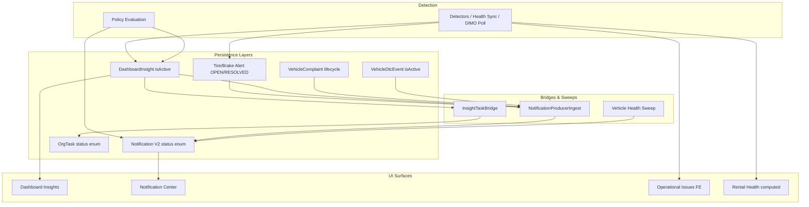
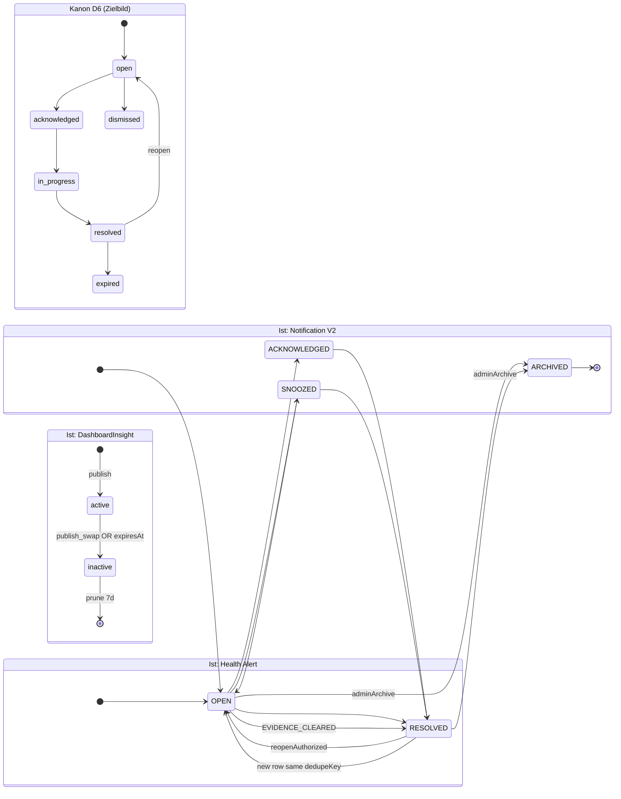
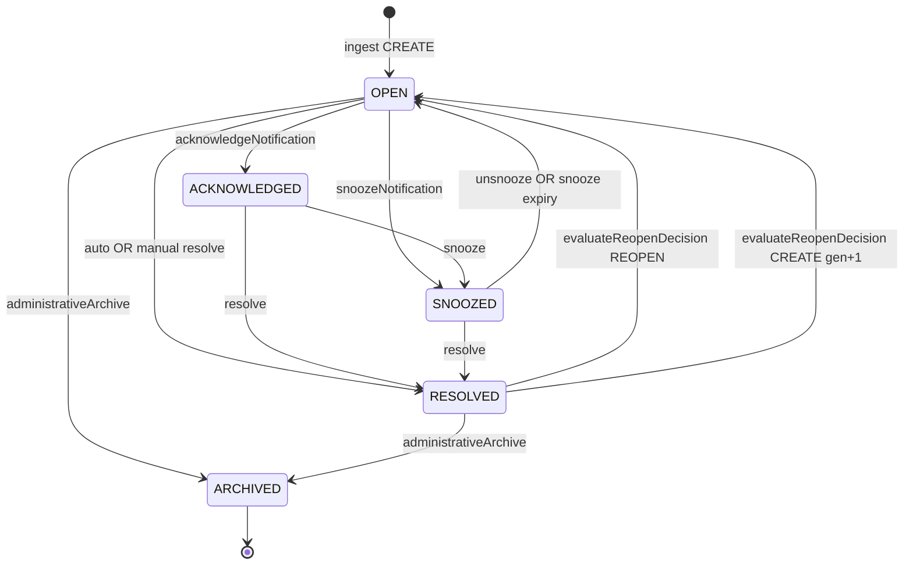
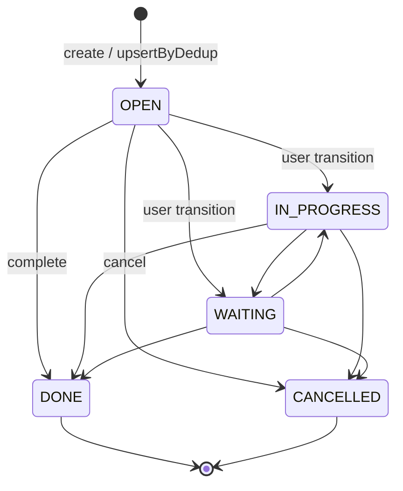
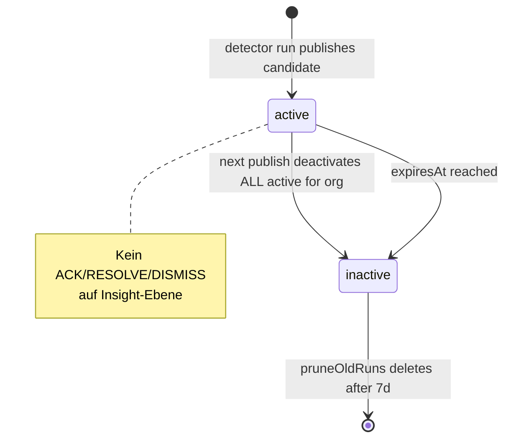
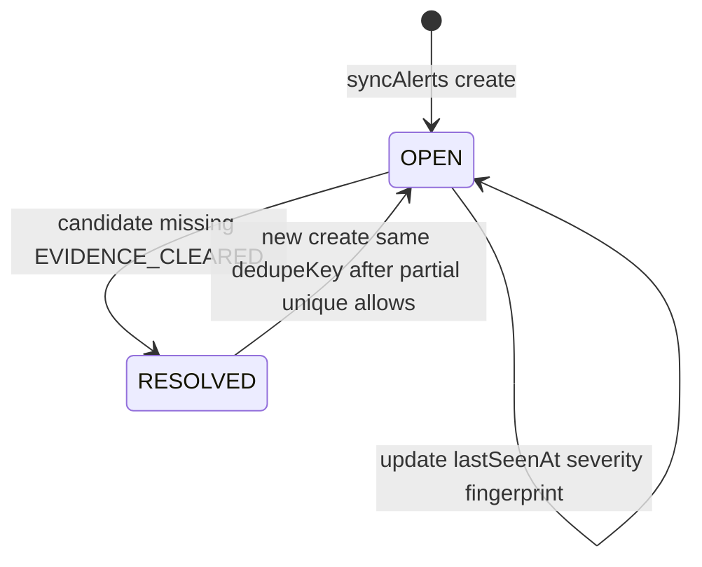
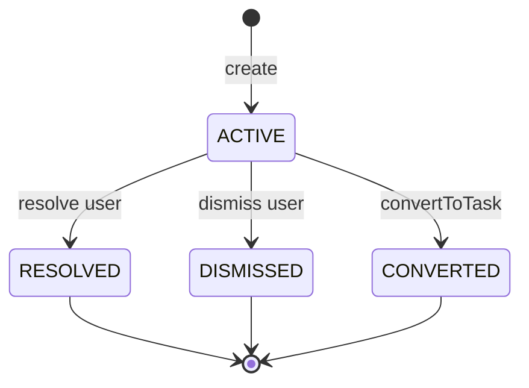
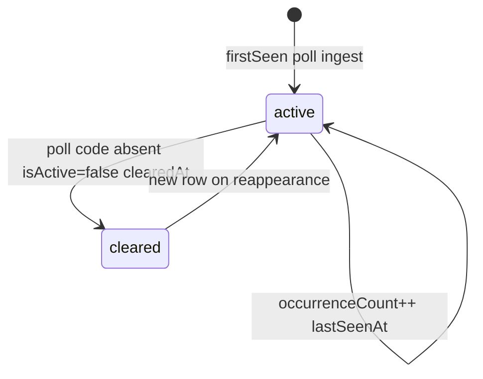
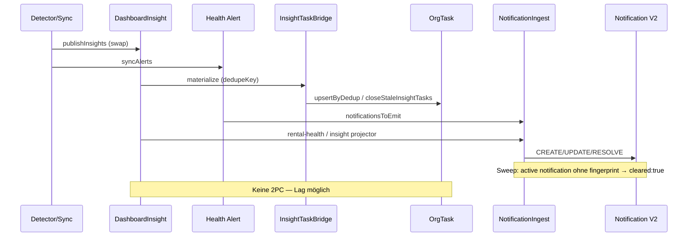

# Vehicle Warnings — Finding Lifecycle Audit (Prompt 12/26)

| Feld | Wert |
|------|------|
| **Audit-ID** | `vehicle-warnings-production-readiness-2026-07` |
| **Prompt** | **12 von 26** — Finding-Lifecycle (Detection → Resolution) |
| **Erstellt (UTC)** | 2026-07-25 |
| **Basis-Commit** | `1d0f2caebe56aa1ecd23295aa33d20e953daa95d` |
| **Vorgänger** | [`10-freshness-confidence-audit.md`](./10-freshness-confidence-audit.md) |
| **Modus** | **Analyse only** — keine Codeänderungen, keine Remediation |
| **Produktionsdaten verändert** | **Nein** |

**Referenz-Dokumente (gelesen):**

- [`02-canonical-status-model.md`](./02-canonical-status-model.md) — D6 Finding lifecycle, Lücke Unified Model
- [`04-persistence-audit.md`](./04-persistence-audit.md) — Persistenzschichten, Dedupe-Keys
- [`09-other-health-warning-audit.md`](./09-other-health-warning-audit.md) — Complaints, Compliance, Module-Lifecycle
- [`10-freshness-confidence-audit.md`](./10-freshness-confidence-audit.md) — Auto-Close bei Offline, Evidence-Clear

---

## 1. Executive Summary

SynqDrive hat **keinen einheitlichen Finding-Lifecycle**. Stattdessen existieren **mindestens sieben parallele Lebenszyklus-Modelle**, die über Bridges und Sweeps lose gekoppelt sind:

| Schicht | Persistenz | Lifecycle-Modell | Primärer Treiber |
|---------|------------|------------------|------------------|
| **DashboardInsight** | `dashboard_insights` | `isActive` boolean + Publish-Swap | Detector-Run (cron/trigger) |
| **Tire/Brake Health Alert** | `tire_health_alerts`, `brake_health_alerts` | `OPEN` → `RESOLVED` | Health-Sync |
| **Battery Alert (Policy)** | Insight + Notification + Task | Regel-Evaluierung + Auto-Resolve | Canonical Battery Summary |
| **Notification V2** | `notifications` | `OPEN` → `ACK`/`SNOOZE` → `RESOLVED` → `ARCHIVED` | Adapter-Ingest + Sweep |
| **OrgTask** | `org_tasks` | `OPEN` → `IN_PROGRESS`/`WAITING` → `DONE`/`CANCELLED` | User + Automation |
| **Technical Observation** | `vehicle_complaints` | `ACTIVE` → `RESOLVED`/`DISMISSED`/`CONVERTED` | User |
| **DTC Event** | `vehicle_dtc_events` | `isActive` + `clearedAt` | DIMO Poll |
| **Operational Issues (FE)** | **nicht persistiert** | abgeleitet pro Render | `normalizeOperationalIssues` |

**Kernbefunde:**

| Thema | Urteil |
|-------|--------|
| Expliziter Lifecycle | **Teilweise** — Notifications/Tasks/Alerts ja; Insights **Publish-Swap-Overwrite** |
| Validierte Übergänge | **Ja** für Notifications + Tasks; **Nein** für Insights; **Schwach** für Complaints |
| Actor-Modell | System vs. User je Schicht; Notification-Manual-Resolve **rollen- und policy-gated** |
| Audit manueller Aktionen | **Notifications ja** (`AuditService`); **Complaints/Insights/Alerts nein** |
| Schließen ohne Ursachenbehebung | **Ja** — Dismiss/Resolve/Manual-Resolve möglich |
| Telemetrieausfall schließt Warnung | **Ja** — STATE-Sweep + `EVIDENCE_CLEARED` + Insight-Publish-Swap |
| Messungen für Resolution | **Regelabhängig** — oft 1 fehlender Sync-Zyklus; Battery braucht Policy-Re-Eval |
| Wiederkehrendes Problem | **Reopen** (Notifications) oder **neue Zeile** (Alerts, DTC) |
| Historische Nachvollziehbarkeit | **DB-Rows bleiben** (inactive/resolved); Insights **nach 7 d gelöscht**; Ops Issues **ephemeral** |
| Notification ↔ Task ↔ Finding Sync | **Eventual consistency** — keine Transaktion über alle Schichten |
| Gelöstes Finding → Readiness | **Ja möglich** — Rental Health recompute unabhängig von Notification-Status |
| Offenes Finding aus Count verschwinden | **Ja** — Publish-Swap, Sweep-Lag, ephemerale Ops Issues |
| SLA / Owner / Fälligkeit | **Tasks** (`dueDate`, `assignedUserId`); **kein SLA** auf Health-Alerts |
| Dismissal-Begründung | **Optional** (`notes`); **kein Pflichtfeld**; Notifications auditieren Aktion, nicht Begründung |

---

## 2. Scope & Methodik

### 2.1 Im Scope

Lifecycle-Phasen über alle vehicle-warning-relevanten Pfade:

`detection` → `creation` → `deduplication` → `update` → `escalation` → `de-escalation` → `acknowledgement` → `assignment` → `in progress` → `resolution` → `dismissal` → `expiry` → `reopening` → `notification` → `task completion`

### 2.2 Primärquellen (CODE_VERIFIED)

| Bereich | Pfad |
|---------|------|
| Insight Publish-Swap | `backend/.../dashboard-insights.repository.ts` |
| Insight → Task Bridge | `backend/.../insight-task-bridge.service.ts` |
| Tire Alert Sync | `backend/.../tires/tire-health-alert.service.ts` |
| Brake Alert Sync | `backend/.../brakes/brake-health-alert.service.ts` |
| Battery Alert Policy | `backend/.../battery-health/battery-alert.policy.ts` |
| Battery Tasks | `backend/.../battery-health/battery-task.service.ts` |
| Notification Transitions | `backend/.../notifications/notification-status.transitions.ts` |
| Notification Core | `backend/.../notifications/notification-core.service.ts` |
| Notification Reopen | `backend/.../notifications/notification-reopen.policy.ts` |
| Manual Resolve Policy | `backend/.../notifications/api/notification-manual-resolution.policy.ts` |
| Notification API + Audit | `backend/.../notifications/api/notification-api.service.ts` |
| Health Sweep | `backend/.../notifications/adapters/notification-producer.ingest.service.ts` |
| Task Transitions | `backend/.../tasks/task-transition.policy.ts` |
| Stale Insight Tasks | `backend/.../tasks/tasks.service.ts` → `closeStaleInsightTasks` |
| Technical Observations | `backend/.../technical-observations/technical-observations.service.ts` |
| DTC Lifecycle | `backend/.../vehicle-intelligence/dtc/dtc.service.ts` |
| Operational Issues (FE) | `frontend/.../operational-issues/normalizeOperationalIssues.ts` |
| Schema | `backend/prisma/schema.prisma` |

### 2.3 Begriffsabgrenzung

| Begriff in diesem Audit | Bedeutung |
|-------------------------|-----------|
| **Finding** | Jede operatorisch sichtbare Warnung/Warnhinweis — unabhängig von Persistenzschicht |
| **Lifecycle** | Explizite Statusmaschine oder dokumentierter Zustandsübergang |
| **Overwrite** | Kein Status-Update, sondern Deaktivierung + Neuanlage oder Boolean-Flip |
| **Escalation** | Severity-/Priority-Erhöhung oder härterer Rental-Impact (kein dediziertes Escalation-Subsystem) |

---

## 3. Architektur — Multi-Layer Lifecycle

**Beobachtung:** Es gibt **keine zentrale Finding-ID** über alle Schichten. Verknüpfungen erfolgen über `dedupeKey`, `fingerprint`, `alertId` (DashboardInsight.id), `legacyInsightId` und lose `primarySourceRef`.

---

## 4. State-Machine-Diagramme

### 4.1 Übersicht — Kanon vs. Ist (D6)

### 4.2 Notification V2 (vollständig validiert)

Quelle: `notification-status.transitions.ts`, `notification-core.service.ts`, `notification-reopen.policy.ts`.

### 4.3 OrgTask (operatives „in progress“)

Quelle: `task-transition.policy.ts`. Automation kann `DONE` via `autoResolveTask` / `closeStaleInsightTasks` setzen.

### 4.4 DashboardInsight (Publish-Swap, kein Status-Enum)

Quelle: `dashboard-insights.repository.ts` → `publishInsights`, `expireStaleInsights`, `pruneOldRuns`.

### 4.5 Tire / Brake Health Alert

Quelle: `tire-health-alert.service.ts`, analog `brake-health-alert.service.ts`.

### 4.6 Technical Observation (VehicleComplaint)

**Hinweis:** Schema kennt zusätzlich `OPEN`, `IN_REVIEW`, `CONFIRMED` — API-Pfad nutzt primär `ACTIVE` → Terminal. Keine zentrale Transition-Matrix im Service.

### 4.7 VehicleDtcEvent

Quelle: `dtc.service.ts`.

---

## 5. Transition-Tabellen

### 5.1 Notification V2 — `notification-status.transitions.ts`

| Von | Nach | Bedingung / Actor | Validiert |
|-----|------|-------------------|-----------|
| `OPEN` | `ACKNOWLEDGED` | `acknowledgeNotification` — System/Org | Ja |
| `OPEN` | `SNOOZED` | `snoozeNotification` — User | Ja |
| `OPEN` | `RESOLVED` | Auto (STATE clear) oder Manual (policy erlaubt) | Ja |
| `OPEN` | `ARCHIVED` | `administrativeArchive: true` | Ja |
| `ACKNOWLEDGED` | `SNOOZED` | User | Ja |
| `ACKNOWLEDGED` | `RESOLVED` | Auto/Manual | Ja |
| `SNOOZED` | `OPEN` | `unsnooze` oder Ablauf | Ja |
| `SNOOZED` | `RESOLVED` | Auto/Manual | Ja |
| `RESOLVED` | `OPEN` | `reopenAuthorized` + `evaluateReopenDecision` | Ja |
| `RESOLVED` | `ARCHIVED` | `administrativeArchive` | Ja |
| `ARCHIVED` | * | — | Terminal |

**Manual Resolve Gate** (`notification-manual-resolution.policy.ts`):

| Event-Kind / Typ | Manual Resolve |
|------------------|----------------|
| `EVENT` | Erlaubt |
| `TECHNICAL_OBSERVATION_ACTIVE` | Erlaubt |
| `*_CREATED`, `*_RETURNED` | Erlaubt |
| `STATE` + `autoResolveWhenConditionClears` | **Verboten** |

### 5.2 OrgTask — `task-transition.policy.ts`

| Von | Nach | Actor | Validiert |
|-----|------|-------|-----------|
| `OPEN` | `IN_PROGRESS` | User (role-gated via TasksService) | Ja |
| `OPEN` | `WAITING` | User | Ja |
| `OPEN` | `DONE` | User oder `autoResolveTask` | Ja |
| `OPEN` | `CANCELLED` | User | Ja |
| `IN_PROGRESS` | `WAITING` / `DONE` / `CANCELLED` | User/Automation | Ja |
| `WAITING` | `IN_PROGRESS` / `DONE` / `CANCELLED` | User/Automation | Ja |
| `DONE` / `CANCELLED` | * | — | Terminal |

**Automation-spezifisch:**

| Trigger | Transition | Code |
|---------|------------|------|
| Insight nicht mehr aktiv | → `DONE` | `closeStaleInsightTasks` (`INSIGHT_CLEARED`) |
| Task dedup superseded | → `CANCELLED` | `supersedeTask` (Booking-Lifecycle) |

### 5.3 Tire / Brake Health Alert

| Von | Nach | Trigger | `resolutionReason` |
|-----|------|---------|-------------------|
| — | `OPEN` | Candidate in sync | — |
| `OPEN` | `OPEN` | Candidate persists — update metadata | — |
| `OPEN` | `RESOLVED` | Candidate **nicht** in sync set | `EVIDENCE_CLEARED` |
| `RESOLVED` | `OPEN` | Neuer `create` nach P2002-Dedupe-Fenster | — |

### 5.4 DashboardInsight

| Von | Nach | Trigger | Validiert |
|-----|------|---------|-----------|
| — | `isActive: true` | `publishInsights` create | Nein (Publish ersetzt Batch) |
| `isActive: true` | `isActive: false` | Nächster Publish **deaktiviert alle** | Nein |
| `isActive: true` | `isActive: false` | `expiresAt <= now` | Nein |
| `isActive: false` | gelöscht | `pruneOldRuns` (>7 Tage) | Nein |

**Keine** User-Übergänge auf Insight-Ebene.

### 5.5 Technical Observation

| Von | Nach | Actor | Validiert |
|-----|------|-------|-----------|
| — | `ACTIVE` | User/System create | Partial |
| `ACTIVE` | `RESOLVED` | `resolve()` — setzt `blocksRental: false` | Nein (direktes Update) |
| `ACTIVE` | `DISMISSED` | `dismiss()` — setzt `blocksRental: false` | Nein |
| `ACTIVE` | `CONVERTED` | `convertToTask()` | Nein |
| `*` | `*` | `update()` mit `body.status` | Partial (parse only) |

Side-effect: `syncV2ObservationResolved` löst Notification-Resolve asynchron aus.

### 5.6 VehicleDtcEvent

| Von | Nach | Trigger |
|-----|------|---------|
| — | `isActive: true` | Code erscheint im Poll |
| `isActive: true` | `isActive: true` | Code weiterhin aktiv — `lastSeenAt` |
| `isActive: true` | `isActive: false` | Code fehlt im Poll — `clearedAt` |
| `isActive: false` | `isActive: true` | **Neue Zeile** bei Wiederauftreten |

### 5.7 Battery Alert (Policy, kein eigener Alert-Table-Status)

| Phase | Mechanismus |
|-------|-------------|
| Detection | `evaluateBatteryAlerts()` / `resolveBatteryAlertCandidate()` |
| Dedupe | `battery_alert:{vehicleId}:{ruleId}` |
| Creation | DashboardInsight-Publish + Notification-Ingest + `BatteryTaskService` |
| Update | Nächster Detector-Run — Severity/Priority aus Policy |
| Resolution | `shouldAutoResolveBatteryAlert()` — Regel feuert nicht mehr |
| Reopen | Neuer Insight-Run + ggf. Notification `CREATE`/`REOPEN` |

---

## 6. Lifecycle-Phasen-Mapping (End-to-End)

| Phase | DashboardInsight | Health Alert | Notification V2 | OrgTask | Complaint | DTC |
|-------|------------------|--------------|-----------------|---------|-----------|-----|
| **Detection** | Detector-Run | Tire/Brake sync | Adapter ingest | — | User/Import | DIMO poll |
| **Creation** | `publishInsights` create | `create` OPEN | `CREATE` | `upsertByDedup` | `create` ACTIVE | `create` active |
| **Deduplication** | `dedupeKey` pro Run | Partial unique OPEN + `dedupeKey` | `fingerprint` + `lifecycleGeneration` | `dedupKey` | `obs:{id}` fingerprint | `vehicleId+dtcCode` row |
| **Update** | Neuer Run ersetzt | `lastSeenAt`, severity | `UPDATE`, `occurrenceCount++` | Priority/title refresh | `update()` | `occurrenceCount++` |
| **Escalation** | Höhere `priority`/`severity` im neuen Publish | Severity-Update in OPEN row | Severity-Change via re-ingest | Priority bump (manual) | `urgency` / `blocksRental` | Severity field |
| **De-escalation** | Run ohne Candidate → inactive | Severity down in OPEN | Re-ingest lower severity | Manual priority | — | — |
| **Acknowledgement** | **Nicht vorhanden** | **Nicht vorhanden** | `ACKNOWLEDGED` (+ personal receipt) | — | — | — |
| **Assignment** | — | — | — | `assignedUserId` | Task on convert | — |
| **In progress** | — | — | — | `IN_PROGRESS` | Implizit via Task | — |
| **Resolution** | Publish-Swap inactive | `RESOLVED` | `RESOLVED` | `DONE` | `RESOLVED` | `isActive: false` |
| **Dismissal** | — (nur inactive) | — | Manual resolve (wenn erlaubt) | `CANCELLED` | `DISMISSED` | — |
| **Expiry** | `expiresAt` → inactive | — | `expiresAt` (optional) | — | — | — |
| **Reopening** | Neuer active Row | Neuer OPEN Row | `REOPEN` oder `CREATE` gen+1 | Neuer Task via dedup | Neues ACTIVE (manual) | Neuer active Row |
| **Notification** | Indirekt via Ingest | `notificationsToEmit` | Primär | — | `TECHNICAL_OBSERVATION_ACTIVE` | `ACTIVE_DTC` |
| **Task completion** | `closeStaleInsightTasks` | Battery/Insight bridge | — | `DONE` / auto | Linked task | — |

**Escalation-Hinweis:** Es gibt **kein** dediziertes Escalation-Subsystem für Vehicle Health. „Escalation“ ist **implizit** über Severity/Priority-Erhöhung, Rental-Blocking-Flags oder wiederholtes Reopen (`reopenCount`, `generation`).

---

## 7. Synchronisation Notification ↔ Task ↔ Finding

| Sync-Pfad | Mechanismus | Strengheit |
|-----------|-------------|------------|
| Insight → Task | `InsightTaskBridgeService.materialize` + `closeStaleInsightTasks` | **Eventually** — Outbox bei Fehler |
| Alert → Notification | Adapter ingest nach sync | **Per-vehicle** — Fehler geloggt, nicht retried atomisch |
| Complaint → Notification | Create + `syncV2ObservationResolved` on resolve/dismiss | **Async void** |
| Health Sweep → Notification | `sweepVehicleHealthNotificationsForOrganization` | **Batch** — fehlende Fingerprints → resolve |
| Notification → Insight | `legacyInsightId` optional — **kein FK** | **Schwach** |
| Task → Finding | `alertId` → DashboardInsight.id | **One-way** |

---

## 8. Pflichtfragen (14/14)

### 8.1 Existiert ein expliziter Lifecycle oder werden Datensätze überschrieben?

| Schicht | Antwort |
|---------|---------|
| Notification V2 | **Expliziter Lifecycle** — Status-Enum + Transition-Matrix |
| OrgTask | **Expliziter Lifecycle** — `TASK_STATUS_TRANSITIONS` |
| Tire/Brake Alert | **Explizit** — `OPEN`/`RESOLVED` |
| Technical Observation | **Teilweise explizit** — DB-Enum, aber Service ohne Transition-Guard |
| DashboardInsight | **Overwrite-Muster** — Publish deaktiviert alle aktiven Rows, erstellt neue |
| DTC | **Boolean-Flip** — kein Status-Enum |
| Operational Issues | **Ephemeral** — keine Persistenz |

**Urteil:** **Beides** — je nach Schicht. Kein Unified Finding Model (vgl. D6 in `02-canonical-status-model.md`).

### 8.2 Sind Statusübergänge validiert?

| Schicht | Validiert |
|---------|-----------|
| Notification | **Ja** — `assertNotificationStatusTransition` |
| Task | **Ja** — `assertTaskTransition` |
| Health Alert | **Implizit** — nur OPEN→RESOLVED im Code-Pfad |
| Complaint | **Nein** — direktes `update` mit `parseStatus` |
| Insight | **N/A** — nur `isActive` boolean |
| DTC | **Nein** — direktes `update` |

### 8.3 Wer darf welche Übergänge auslösen?

| Übergang | Actor | Gate |
|----------|-------|------|
| Notification ACK/Snooze/Resolve/Archive | Authentifizierter User | `withNotificationAction` + `availableActions` + Roles |
| Notification Auto-Resolve | System (Ingest/Sweep) | `shouldAutoResolveState` |
| Task Status | User mit Task-Berechtigung | TasksService + Org-Scope |
| Task Auto-Close | System (`closeStaleInsightTasks`) | Insight-Run |
| Complaint Resolve/Dismiss | User (vehicle-scoped) | Org + Vehicle scope |
| Insight inactive | System (Publish/Expire) | Kein User-Pfad |
| Alert RESOLVED | System (Sync) | `EVIDENCE_CLEARED` |
| DTC cleared | System (Poll) | DIMO ingest |

### 8.4 Wird jede manuelle Aktion auditiert?

| Aktion | Audit |
|--------|-------|
| Notification acknowledge/snooze/resolve/archive | **Ja** — `AuditService.record` in `notification-api.service.ts` |
| Notification read/unread | **Nein** — nur Receipt |
| Task status change | **Teilweise** — Activity Log je nach Pfad (nicht in diesem Prompt vollständig verifiziert) |
| Complaint resolve/dismiss | **Nein** — kein `AuditService` im Service |
| Insight | **Kein User-Aktion** | — |
| Health Alert | **Kein User-Aktion** | — |

### 8.5 Kann eine UI eine Warnung schließen, ohne Ursache zu beseitigen?

**Ja**, über mehrere Pfade:

| Pfad | Mechanismus |
|------|-------------|
| Technical Observation | `dismiss()` / `resolve()` — setzt `blocksRental: false` ohne Root-Cause-Check |
| Notification | Manual `resolve()` wenn `isManualResolutionAllowed` |
| Task | User setzt `DONE` / `CANCELLED` ohne Health-Gate |
| Insight | **Kein** User-Close — aber Publish-Swap kann Finding aus aktiver UI entfernen obwohl Bedingung evtl. nur Detector-missed |

### 8.6 Kann ein Telemetrieausfall eine Warnung schließen?

**Ja**, unter mehreren Mechanismen:

| Mechanismus | Verhalten |
|-------------|-----------|
| Health Notification Sweep | Aktive VEHICLE_HEALTH Notifications ohne Fingerprint im aktuellen Run → `cleared: true` ingest |
| Tire/Brake Alert Sync | Candidate fehlt → `EVIDENCE_CLEARED` |
| Battery Auto-Resolve | `shouldAutoResolveBatteryAlert` wenn Summary null / weak evidence excluded |
| DashboardInsight Publish | Candidate nicht mehr publiziert → `isActive: false` |
| DTC | Code nicht im Poll → `isActive: false` (kann Ausfall vs. echter Clear nicht unterscheiden) |

**Risiko:** Telemetrieausfall kann wie „Problem behoben“ erscheinen (vgl. FRESH-W05, LIFE-W04).

### 8.7 Wie viele normale Messungen sind für Resolution nötig?

| Pfad | Anzahl / Bedingung |
|------|-------------------|
| Tire/Brake Alert | **1 Sync-Zyklus** ohne Candidate |
| DTC clear | **1 Poll** ohne Code |
| Notification STATE | **1 Sweep/ingest** mit `conditionActive: false` |
| Battery LV Publication | Policy: `publicationMaturity === 'STABLE'` für **Alert-Eröffnung**; Resolution wenn `evaluateBatteryAlerts` Regel nicht mehr liefert (Re-Eval, nicht Zähler) |
| DashboardInsight | **1 Detector-Run** ohne Candidate |
| Complaint/Notification manual | **0 Messungen** — User-Aktion |

**Kein globaler „N consecutive good readings“-Zähler** über alle Finding-Typen.

### 8.8 Wird ein wiederkehrendes Problem wiedereröffnet oder neu angelegt?

| Schicht | Verhalten |
|---------|-----------|
| Notification STATE | `evaluateReopenDecision` → `REOPEN` (gleiche Row) oder `CREATE` (neue `lifecycleGeneration`) mit Cooldown 15 min |
| Notification EVENT | `CREATE` mit `generation + 1` |
| Tire/Brake Alert | **Neue OPEN Row** nach RESOLVED (partial unique erlaubt) |
| DTC | **Neue active Row** |
| DashboardInsight | **Neue active Row** mit gleichem `dedupeKey` im nächsten Publish |
| Complaint | **Manuell** neues ACTIVE — kein Auto-Reopen |

### 8.9 Bleiben historische Ereignisse nachvollziehbar?

| Schicht | Historie |
|---------|----------|
| Notification | Rows bleiben (`RESOLVED`, `ARCHIVED`); `NotificationOccurrence` Tabelle |
| Health Alert | RESOLVED Rows in DB |
| DTC | Cleared Rows mit `clearedAt` |
| Complaint | Terminal statuses in DB mit Timestamps/User-IDs |
| DashboardInsight | Inactive Rows **7 Tage**, dann `pruneOldRuns` **löscht** |
| OrgTask | Terminal tasks bleiben |
| Operational Issues | **Nicht persistiert** — keine Historie |
| Insight Runs | `dashboard_insight_runs` mit `candidateCount`/`publishedCount` |

### 8.10 Werden Notification, Task und Finding synchron gehalten?

**Nein — eventual consistency.**

| Szenario | Divergenz |
|----------|-----------|
| Insight inactive, Notification noch OPEN | Sweep-Lag bis nächster Health-Run |
| Notification resolved, Task noch OPEN | Kein automatischer Task-Close bei Notification-Resolve (außer Insight-bridge) |
| Task DONE, Complaint ACTIVE | Möglich wenn Task manuell geschlossen |
| Alert RESOLVED, Notification OPEN | Bis Sweep/ingest |

Bridges sind **nicht transaktional** über Schichten (`insight-task-bridge` + Outbox bei Fehler).

### 8.11 Kann ein gelöstes Finding weiterhin die Readiness beeinflussen?

**Ja.**

| Pfad | Grund |
|------|-------|
| Rental Health | **On-demand compute** aus Modulen — unabhängig von Notification `RESOLVED` |
| Compliance (TÜV/BOKraft) | Datums-basiert — kein Finding-Lifecycle |
| DTC cleared in DB | Rental Health kann aus **aktuellem** Poll re-evaluieren — aber Cache (45 s) kann laggen |
| Complaint dismissed | `blocksRental: false` — **entfernt** Block explizit |
| Resolved Notification | **Blockiert Readiness nicht** allein — Rental Health nutzt eigene Module |

### 8.12 Kann ein offenes Finding aus einem Count verschwinden?

**Ja.**

| Count-Oberfläche | Mechanismus |
|------------------|-------------|
| Dashboard `activeInsightCount` | Publish-Swap — vorheriger Run deaktiviert alle |
| Notification Badge | Resolve/Sweep/Archive |
| Operational Issues Chips | Ephemeral — Input-Set ändert sich (Cache, fehlende Insights) |
| Rental Health module issues | Recompute — nicht an Notification gebunden |
| FHS Severity Bands | Aggregat aus anderen Quellen |

### 8.13 Werden SLA, Owner und Fälligkeit unterstützt?

| Feature | Unterstützung |
|---------|---------------|
| **Owner** | `OrgTask.assignedUserId`; Notifications **kein** Owner-Feld |
| **Fälligkeit** | `OrgTask.dueDate`; Insight `timeContext.dueDate` → Task-Materialization |
| **SLA** | **Nicht** auf Health Alerts / Notifications |
| **Snooze** | Notification personal snooze (`snoozedUntil`) — kein SLA-Tracking |
| **Escalation on breach** | **Nicht vorhanden** für Vehicle Health |

### 8.14 Werden manuelle Dismissals begründet und protokolliert?

| Pfad | Begründung | Protokoll |
|------|------------|-----------|
| Complaint dismiss | `notes` optional — **kein Pflichtfeld** `dismissReason` | `dismissedByUserId`, `dismissedAt` |
| Complaint resolve | Kein Pflicht-`resolutionNote` | `resolvedByUserId`, `resolvedAt` |
| Notification manual resolve | Kein Reason-Feld in API | `AuditService` mit `notificationId` |
| Task cancel/done | `resolutionNote` optional | Task-Metadaten |

**Urteil:** Protokollierung **teilweise** (Wer/Wann), Begründung **nicht durchgängig Pflicht**.

---

## 9. Cross-Surface-Lifecycle-Inkonsistenzen

| ID | Thema | Schwere |
|----|-------|---------|
| LC-01 | Kein Unified Finding ID über Insight/Alert/Notification/Task | Hoch |
| LC-02 | Insight Publish-Swap vs. Notification Sweep — unterschiedliche Close-Semantik | Hoch |
| LC-03 | `in_progress` nur auf Task-Ebene, nicht auf Finding | Mittel |
| LC-04 | Manual dismiss ohne Root-Cause-Validierung | Hoch |
| LC-05 | Telemetrieausfall → `EVIDENCE_CLEARED` / Sweep resolve | Hoch |
| LC-06 | Operational Issues ohne Historie | Mittel |
| LC-07 | Insight-Prune 7 d vs. Notification dauerhaft | Mittel |
| LC-08 | Complaint ohne Audit vs. Notification mit Audit | Mittel |
| LC-09 | DTC clear = 1 Poll — kein Hysterese | Mittel |
| LC-10 | Resolved Notification, Rental Health weiterhin warning | Mittel |

---

## 10. Risiko-Register (LIFE-W01–LIFE-W18)

| ID | Risiko | Schwere | Evidenz |
|----|--------|---------|---------|
| LIFE-W01 | Kein einheitlicher Finding-Lifecycle (D6-Lücke) | Hoch | `02-canonical-status-model.md`, multiple schemas |
| LIFE-W02 | Publish-Swap kann Finding aus Count entfernen ohne Resolution-Audit | Hoch | `dashboard-insights.repository.ts` |
| LIFE-W03 | Telemetrieausfall schließt STATE Notifications via Sweep | Hoch | `notification-producer.ingest.service.ts` |
| LIFE-W04 | `EVIDENCE_CLEARED` bei fehlendem Candidate — 1 Zyklus | Hoch | `tire-health-alert.service.ts` |
| LIFE-W05 | Manual dismiss/resolve ohne Ursachennachweis | Hoch | `technical-observations.service.ts` |
| LIFE-W06 | Notification/Task/Finding nicht atomisch synchron | Hoch | Bridge + async ingest |
| LIFE-W07 | Gelöstes Notification, Readiness weiterhin betroffen | Mittel | Rental Health compute |
| LIFE-W08 | Insight-Historie nach 7 d gelöscht | Mittel | `pruneOldRuns` |
| LIFE-W09 | Operational Issues ephemeral — keine Lifecycle-Historie | Mittel | `normalizeOperationalIssues.ts` |
| LIFE-W10 | Complaint-Transitions nicht validiert | Mittel | Direct `update` |
| LIFE-W11 | Kein SLA/Escalation für Health Findings | Mittel | Schema/API gap |
| LIFE-W12 | Dismiss ohne Pflicht-Begründung | Mittel | `notes` optional |
| LIFE-W13 | DTC clear bei einem Poll — Reopen als neue Row | Mittel | `dtc.service.ts` |
| LIFE-W14 | STATE notifications manual resolve blockiert — EVENT nicht | Niedrig | `notification-manual-resolution.policy.ts` |
| LIFE-W15 | Task auto-close bei Insight-Clear unabhängig von Notification | Mittel | `closeStaleInsightTasks` |
| LIFE-W16 | Battery auto-resolve bei weak/missing evidence | Mittel | `shouldAutoResolveBatteryAlert` |
| LIFE-W17 | Reopen-Cooldown 15 min kann Flutter unterdrücken | Niedrig | `notification-reopen.policy.ts` |
| LIFE-W18 | `legacyInsightId` ohne FK — schwache Querverknüpfung | Niedrig | `schema.prisma` Notification |

---

## 11. Zusammenfassung Urteil

| Kriterium | Urteil |
|-----------|--------|
| Vollständiger Lifecycle dokumentiert | **Ja** — aber **fragmentiert** über 7+ Modelle |
| Validierte Übergänge | **Nur** Notifications + Tasks |
| Actor-Modell klar | **Teilweise** — System vs. User je Schicht |
| Audit manueller Aktionen | **Lückenhaft** — Notifications ja, Complaints/Alerts nein |
| Schließen ohne Fix | **Möglich** |
| Telemetrieausfall → Close | **Möglich** — mehrere Pfade |
| Messungen für Resolution | **Nicht einheitlich** — meist 1 Zyklus, Battery policy-driven |
| Reopen vs. Neu | **Schichtabhängig** |
| Historische Nachvollziehbarkeit | **Teilweise** — Insights kurz, Ops Issues fehlen |
| Sync Notification/Task/Finding | **Eventual** — bekannte Lag-Szenarien |
| Readiness nach Resolve | **Kann divergieren** |
| Count-Drops | **Möglich** |
| SLA/Owner/Due | **Nur Tasks** |
| Dismissal-Begründung | **Nicht durchgängig** |

**Gesamt Lifecycle (Prompt 12):** SynqDrive implementiert **reife Teil-Lifecycles** (Notifications V2, Tasks) und **einfache Auto-Sync-Lifecycles** (Health Alerts, DTC), aber **kein durchgängiges Finding-Modell**. Die größten operatorischen Risiken entstehen durch **Publish-Swap-Insights**, **Evidence-Cleared ohne Hysterese**, **Sweep-basiertes Auto-Close bei fehlender Telemetrie** und **fehlende transaktionale Sync** zwischen Notification, Task und zugrunde liegendem Health-Signal.

---

## 12. Änderungshistorie

| Version | Datum | Änderung |
|---------|-------|----------|
| 1.0 | 2026-07-25 | Erstaudit Prompt 12/26 |

**Changes / Architektur (SynqDrive Code):** nicht aktualisiert (audit-only).
