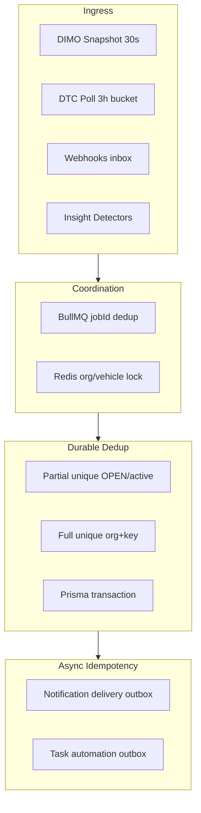

# Vehicle Warnings — Deduplication & Idempotency Audit (Prompt 13/26)

| Feld | Wert |
|------|------|
| **Audit-ID** | `vehicle-warnings-production-readiness-2026-07` |
| **Prompt** | **13 von 26** — Deduplizierung, Idempotenz, Mehrfacherzeugung |
| **Erstellt (UTC)** | 2026-07-25 |
| **Basis-Commit** | `1d0f2caebe56aa1ecd23295aa33d20e953daa95d` |
| **Vorgänger** | [`11-finding-lifecycle-audit.md`](./11-finding-lifecycle-audit.md) |
| **Modus** | **Analyse only** — keine Codeänderungen, keine Remediation |
| **Produktionsdaten verändert** | **Nein** |

**Referenz-Dokumente (gelesen):**

- [`04-persistence-audit.md`](./04-persistence-audit.md) — Dedup-Stärke je Tabelle, Polyglot-Modell
- [`11-finding-lifecycle-audit.md`](./11-finding-lifecycle-audit.md) — Publish-Swap, Sweep, Eventual Consistency
- [`10-freshness-confidence-audit.md`](./10-freshness-confidence-audit.md) — Cache-TTLs, Polling-Cadence

---

## 1. Executive Summary

SynqDrive schützt gegen Mehrfacherzeugung über **gestaffelte Mechanismen**:

| Schicht | Mechanismus | Stärke |
|---------|-------------|--------|
| **Business-Key** | `dedupeKey`, `fingerprint`, `evidenceFingerprint` | Hoch bei stabiler Semantik |
| **DB Partial Unique** | OPEN-Alerts, aktive Notifications | Hoch für konkurrierende Creates |
| **DB Full Unique** | `(organizationId, dedupKey)` Tasks, Webhook-Inbox | Hoch |
| **BullMQ jobId** | Pro Fahrzeug / Org / Zeit-Bucket | Mittel — deduped enqueue |
| **Redis Lock** | Org-Eval, Battery-V2, Brake-Recalc | Mittel — Single-Flight |
| **Transaktion + Outbox** | Notification + Delivery, Task-Automation | Hoch für Side-Effects |
| **Application Retry** | `withUniqueConflictRetry`, P2002 swallow | Mittel — Race-Mitigation |

**Kernlücken (Priorität Hoch):**

1. **VehicleDtcEvent** — kein DB-Unique auf `(vehicleId, dtcCode)` bei `isActive=true` → parallele Polls können Duplikate erzeugen.
2. **DashboardInsight** — kein Partial-Unique auf `(organizationId, dedupeKey)` bei `isActive=true` → historische Duplikate, Publish-Swap ersetzt Batch aber nicht atomar mit Notifications.
3. **OrgTask `upsertByDedup`** — `findFirst` → `create` ohne P2002-Handler → Race unter Concurrent Bridge-Runs.
4. **VehicleComplaint** — kein Dedup-Constraint → manuelle Doppelbeobachtungen möglich.
5. **Cross-Source** (Snapshot + Webhook) — Battery/Webhook-Pfade teilen Measurement-Keys, aber Downstream-Aggregate (`BATTERY_CRITICAL` vs. per-rule Tasks) haben unterschiedliche Granularität.

---

## 2. Scope & Methodik

### 2.1 Im Scope

Auditierte Mechanismen:

- deduplication keys / fingerprints
- unique constraints (full + partial)
- BullMQ `jobId`
- webhook `providerEventId` / dedup buckets
- scheduler jobs & polling overlap
- retries & `P2002`-Handling
- distributed locks (Redis)
- database transactions & upserts
- cache invalidation & projection rebuilds
- notification dispatch (delivery outbox)
- task automation / outbox execution

### 2.2 Primärquellen (CODE_VERIFIED)

| Bereich | Pfad |
|---------|------|
| Insight publish + grouping | `backend/.../dashboard-insights.repository.ts`, `insight-grouping.service.ts` |
| Notification fingerprint | `backend/.../notification-fingerprint.factory.ts` |
| Notification materialize | `backend/.../notification-core.service.ts`, `notification-prisma.util.ts` |
| Notification eval queue | `backend/.../runtime/notification-evaluation-queue.util.ts`, `notification-evaluation.service.ts` |
| Health sweep | `backend/.../adapters/notification-producer.ingest.service.ts` |
| Delivery outbox | `backend/.../delivery/notification-delivery-outbox.repository.ts`, `notification-delivery-idempotency.util.ts` |
| Tire/Brake alerts | `tire-health-alert.service.ts`, `brake-health-alert.service.ts`, `*-alert.registry.ts` |
| Battery idempotency | `battery-v2-idempotent-execution.service.ts`, `battery-alert.policy.ts` |
| DTC | `dtc.service.ts`, `dimo-dtc.processor.ts` |
| DIMO snapshot | `dimo-snapshot.scheduler.ts`, `dimo-snapshot.processor.ts` |
| Webhooks | `device-connection-webhook-inbox` schema, `rpm_webhook_candidates` |
| Tasks | `tasks.service.ts` (`upsertByDedup`), `task-automation-outbox.repository.ts` |
| Redis lock | `backend/.../shared/redis/redis-distributed-lock.service.ts` |
| Schema | `backend/prisma/schema.prisma`, Migrations `20260711120000`, `20260716280000`, `20260717260000` |

---

## 3. Architektur — Dedup-Schichten

**Prinzip:** Producer erzeugen Kandidaten mit **natürlichem Business-Key**; Persistenz erzwingt **technische Eindeutigkeit** wo vorhanden; Queues verhindern **parallele Doppelarbeit**; Outboxen verhindern **doppelte Side-Effects** nach Commit.

---

## 4. Producer-Matrix (Pflichtfelder)

Legende **Priorität Lücke:** `Kritisch` | `Hoch` | `Mittel` | `Niedrig`

### 4.1 DashboardInsight (Business Insights)

| Feld | Wert |
|------|------|
| **Natürliche Idempotenz-ID** | `dedupeKey` — z. B. `battery_critical:{vehicleId}`, `tuv_overdue:{vehicleId}`, `driving_assessment_device_quality:{vehicleId}` |
| **Technische Idempotenz-ID** | Row `id` (UUID); logische Identität `(organizationId, dedupeKey)` — **nicht DB-enforced für active** |
| **DB-Schutz** | `@@index([dedupeKey])` only; **kein** `UNIQUE (organization_id, dedupe_key) WHERE is_active` |
| **Queue-Schutz** | Notification-Eval: `jobId = notification-evaluation:{orgId}:{triggerClass}`; Redis-Org-Lock bei Eval-Run |
| **Erwartetes Retry-Verhalten** | Publish = TX: deactivate all active → create batch; Detector-Retry erzeugt neuen Run, nicht duplicate active rows im selben Run |
| **In-Run-Dedup** | `InsightGroupingService.dedupeAndGroup` — höchste Priority pro `dedupeKey` |
| **Erkannte Lücke** | Mehrere inactive Rows pro Key; kein DB-Schutz gegen concurrent publish; UI muss `dedupeKey` nicht `id` nutzen |
| **Priorität** | **Hoch** |

### 4.2 TireHealthAlert

| Feld | Wert |
|------|------|
| **Natürliche Idempotenz-ID** | `dedupeKey` = `{orgId}\|{vehicleId}\|{tireSetupId}\|{alertType}\|{wheelPos}\|{evidenceFingerprint}` |
| **Technische Idempotenz-ID** | Row `id`; Notification-Variante `buildTireAlertNotificationCode(reasonCode, dedupeKey)` |
| **DB-Schutz** | Partial unique: `tire_health_alerts_open_dedupe_key_uidx` ON `dedupe_key WHERE status = 'OPEN'` |
| **Queue-Schutz** | `jobId = tire-recalc:{vehicleId}:{hourBucket}`; skip bei identischem `inputFingerprint` |
| **Erwartetes Retry-Verhalten** | `syncAlerts`: update open → create; **P2002 → continue** (Race-safe) |
| **Erkannte Lücke** | Nach RESOLVED kann gleicher Key neu OPEN (by design); `evidenceFingerprint`-Änderung = neuer Alert |
| **Priorität** | **Niedrig** (gut abgesichert) |

### 4.3 BrakeHealthAlert

| Feld | Wert |
|------|------|
| **Natürliche Idempotenz-ID** | `dedupeKey` = `{orgId}\|{vehicleId}\|{componentId\|_vehicle}\|{alertType}\|{evidenceFp}\|{modelSnapshotId\|_live}` |
| **Technische Idempotenz-ID** | Row `id`; `lastNotifiedFingerprint` gate für Re-Notification |
| **DB-Schutz** | Partial unique: `brake_health_alerts_dedupe_open_uniq` ON `dedupe_key WHERE status = 'OPEN'` |
| **Queue-Schutz** | `buildBrakeRecalculationJobId(vehicleId, hourBucket)` + Redis per-vehicle lock (TTL 120s) |
| **Erwartetes Retry-Verhalten** | Analog Tire; **P2002 → continue** |
| **Erkannte Lücke** | Separate Brake-Evidence-Tabelle mit eigenem partial unique — zwei Dedup-Ebenen |
| **Priorität** | **Niedrig** |

### 4.4 Battery Alert (Policy — keine Alert-Tabelle)

| Feld | Wert |
|------|------|
| **Natürliche Idempotenz-ID** | `battery_alert:{vehicleId}:{ruleId}` (`BATTERY_ALERT_RULE_IDS.*`) |
| **Technische Idempotenz-ID** | Measurement/Observation `idempotencyKey`; Session-Keys in `battery-v2-job-idempotency.policy.ts` |
| **DB-Schutz** | `battery_measurements` unique auf `(organizationId, idempotencyKey)` + `(vehicleId, type, observedAt)`; HV-Capacity dedup keys |
| **Queue-Schutz** | `BatteryV2IdempotentExecutionService` + per-vehicle Redis lock; `sanitizeBullMqJobId` |
| **Erwartetes Retry-Verhalten** | `isJobAlreadyCompleted` → skip; `createOrFindByUnique` on P2002 |
| **Erkannte Lücke** | Keine persisted Alert-Row — Dashboard/Notification/Task können bei unterschiedlicher Ingest-Reihenfolge divergieren; LV vs. HV viele Tabellen |
| **Priorität** | **Mittel** |

### 4.5 Notification V2

| Feld | Wert |
|------|------|
| **Natürliche Idempotenz-ID** | Canonical `fingerprint` = `orgId\|eventType\|entityType\|entityId\|conditionCode\|v{N}` |
| **Technische Idempotenz-ID** | `(organizationId, fingerprint, lifecycleGeneration)` |
| **DB-Schutz** | Partial unique `notifications_active_fingerprint_generation_key` WHERE status IN (`OPEN`,`ACKNOWLEDGED`,`SNOOZED`); delivery outbox `idempotencyKey @unique`; receipts `(notificationId, userId)` unique |
| **Queue-Schutz** | Eval `jobId` per org+trigger; Redis org lock + heartbeat; Redis `pendingEvents` coalesce |
| **Erwartetes Retry-Verhalten** | `withUniqueConflictRetry` bis 4× bei P2002; delivery `createEntryIdempotent` schluckt P2002 |
| **Erkannte Lücke** | Vehicle-health sweep capped `limit: 500` active rows/org; Reopen-Flutter nur policy, nicht DB |
| **Priorität** | **Mittel** (stark, Sweep-Cap) |

### 4.6 OrgTask (Insight-Bridge & Automation)

| Feld | Wert |
|------|------|
| **Natürliche Idempotenz-ID** | Insight `dedupeKey` (1:1 bei Bridge); Automation: `task-auto:{org}:{rule}:{entityType}:{entityId}` |
| **Technische Idempotenz-ID** | Task `id`; closed tasks: `dedupKey` → `{key}:closed:{taskId}` |
| **DB-Schutz** | `@@unique([organizationId, dedupKey], name: "org_tasks_org_dedup_key")` |
| **Queue-Schutz** | Outbox: `jobId = task-automation:{outboxId}`; outbox `idempotencyKey @unique` |
| **Erwartetes Retry-Verhalten** | `upsertByDedup`: find active → update OR park closed → create; outbox `enqueueOrRefresh` merged PENDING/DEAD_LETTER |
| **Erkannte Lücke** | **Race:** concurrent `create` ohne P2002 catch → unique violation; Bridge-Fehler → Outbox, aber nicht alle Pfade |
| **Priorität** | **Hoch** |

### 4.7 VehicleDtcEvent

| Feld | Wert |
|------|------|
| **Natürliche Idempotenz-ID** | `(vehicleId, dtcCode)` solange `isActive=true` |
| **Technische Idempotenz-ID** | Row `id`; Notification `ACTIVE_DTC` + `conditionCode:{code}` |
| **DB-Schutz** | **Kein unique** — nur `@@index([vehicleId, isActive])` |
| **Queue-Schutz** | `jobId = dtc-poll:{vehicleId}:{pollBucket}` (3h bucket) |
| **Erwartetes Retry-Verhalten** | `upsertDtc`: findFirst active → update OR create; Poll-Fehler mutiert Events **nicht** |
| **Erkannte Lücke** | **Parallele Polls** können zwei active Rows für gleichen Code erzeugen |
| **Priorität** | **Kritisch** |

### 4.8 Technical Observation (VehicleComplaint)

| Feld | Wert |
|------|------|
| **Natürliche Idempotenz-ID** | Pro Observation: `observationId` → Notification `technical_observation_active:{id}` |
| **Technische Idempotenz-ID** | Row `id`; fingerprint enthält `organizationId` + complaint-scoped `conditionCode` |
| **DB-Schutz** | **Kein dedupe unique** auf Complaints |
| **Queue-Schutz** | Notification eval debounce (gleicher Org-Eval-Pfad) |
| **Erwartetes Retry-Verhalten** | `syncTechnicalObservationActive/Resolved` idempotent auf Notification-Layer |
| **Erkannte Lücke** | Duplicate manuelle Observations; V2-Adapter `shadowModeOnly` |
| **Priorität** | **Mittel** |

### 4.9 DIMO Snapshot Polling

| Feld | Wert |
|------|------|
| **Natürliche Idempotenz-ID** | Pro Fahrzeug pro erfolgreichem Snapshot-Tick |
| **Technische Idempotenz-ID** | `jobId = snapshot-{vehicleId}`; `VehicleLatestState` upsert per vehicle |
| **DB-Schutz** | VLS upsert; Battery-Observations über Measurement-Idempotency-Keys |
| **Queue-Schutz** | Active job → duplicate enqueue skipped; terminal jobs removed before re-add |
| **Erwartetes Retry-Verhalten** | BullMQ retry; `lockDuration` 60s > 30s poll interval; GraphQL timeout 15s |
| **Erkannte Lücke** | Langer Snapshot blockiert Re-Enqueue (by design); Resume-Gap-Backfill separat |
| **Priorität** | **Niedrig** |

### 4.10 DIMO DTC Polling

| Feld | Wert |
|------|------|
| **Natürliche Idempotenz-ID** | Per vehicle per poll cycle — active code set |
| **Technische Idempotenz-ID** | Fan-out `dtc-poll` → per-vehicle `dtc-poll-vehicle` mit bucket jobId |
| **DB-Schutz** | Siehe §4.7 — **schwach** |
| **Queue-Schutz** | 3h `pollBucket` dedupes fan-out jobs per vehicle |
| **Erwartetes Retry-Verhalten** | Per-vehicle concurrency + retry; notification ingest optional |
| **Erkannte Lücke** | DB-Dedup fehlt trotz Queue-Dedup |
| **Priorität** | **Kritisch** (DB) |

### 4.11 Device Connection Webhooks

| Feld | Wert |
|------|------|
| **Natürliche Idempotenz-ID** | Provider plug/unplug semantic event |
| **Technische Idempotenz-ID** | `providerEventId = {provider}:token:{tokenId}:type:{eventType}:bucket:{dedupBucket}` |
| **DB-Schutz** | Inbox `@@unique([provider, providerEventId])`; domain events `@@unique([provider, vehicleId, eventType, dedupBucket])` |
| **Queue-Schutz** | `connectivity-webhook:{inboxId}` |
| **Erwartetes Retry-Verhalten** | Inbox scheduler + processing attempts + dead letter |
| **Erkannte Lücke** | Plug recovery absichtlich snapshot-basiert; unplug webhook-only — Cross-Path nicht unified |
| **Priorität** | **Mittel** |

### 4.12 RPM Webhook Candidates

| Feld | Wert |
|------|------|
| **Natürliche Idempotenz-ID** | RPM trigger in 10s bucket |
| **Technische Idempotenz-ID** | `dedupBucket = floor(observedAt_ms / 10_000)` |
| **DB-Schutz** | `@@unique([provider, vehicleId, triggerType, dedupBucket])` |
| **Queue-Schutz** | Processing via candidate service upsert |
| **Erwartetes Retry-Verhalten** | Upsert on unique key |
| **Erkannte Lücke** | 10s bucket kann legitime rapid events mergen |
| **Priorität** | **Niedrig** |

### 4.13 Rental Health → Notification Projector

| Feld | Wert |
|------|------|
| **Natürliche Idempotenz-ID** | `vehicleHealthSourceFingerprint(orgId, source)` — mirrors registry `conditionCode` |
| **Technische Idempotenz-ID** | Notification fingerprint (§4.5) |
| **DB-Schutz** | Delegiert an Notification partial unique |
| **Queue-Schutz** | Läuft innerhalb Notification-Eval-Org-Lock |
| **Erwartetes Retry-Verhalten** | Ingest per source; sweep resolves missing fingerprints |
| **Erkannte Lücke** | Sweep 500-cap; Insight dedupeKey bridge `fingerprintPartsFromInsightDedupeKey` kann Semantik vereinfachen |
| **Priorität** | **Mittel** |

### 4.14 Insight → Task Bridge

| Feld | Wert |
|------|------|
| **Natürliche Idempotenz-ID** | Insight `dedupeKey` → Task `dedupKey` (1:1) |
| **Technische Idempotenz-ID** | `alertId` = active `DashboardInsight.id`; Automation idempotency key |
| **DB-Schutz** | Task unique (§4.6); Insight ohne active-unique |
| **Queue-Schutz** | Outbox on `upsertByDedup` failure |
| **Erwartetes Retry-Verhalten** | `closeStaleInsightTasks` nach materialize; outbox replay `rematerializeFromOutbox` |
| **Erkannte Lücke** | Insight inactive ≠ Task closed sofort; concurrent upsert race |
| **Priorität** | **Hoch** |

### 4.15 Notification Delivery Outbox

| Feld | Wert |
|------|------|
| **Natürliche Idempotenz-ID** | Eine Zustellung pro `(notification, generation, transition, channel, recipient)` |
| **Technische Idempotenz-ID** | `idempotencyKey` = `{notificationId}:{lifecycleGeneration}:{transition}:{channel}:{recipientId}` |
| **DB-Schutz** | `idempotencyKey @unique` auf `notification_delivery_outbox` |
| **Queue-Schutz** | Outbox processor `claimForProcessing` (optimistic) |
| **Erwartetes Retry-Verhalten** | `createEntryIdempotent` P2002 → null; FAILED → retry batch |
| **Erkannte Lücke** | Externer Provider kann trotzdem doppelt senden wenn claim+send nicht exakt-once |
| **Priorität** | **Niedrig** (DB-seitig gut) |

### 4.16 Notification Evaluation Scheduler

| Feld | Wert |
|------|------|
| **Natürliche Idempotenz-ID** | Ein Eval-Run pro Org pro Trigger-Klasse (coalesced) |
| **Technische Idempotenz-ID** | `runId` UUID; BullMQ `jobId` stabil pro org+class |
| **DB-Schutz** | `DashboardInsightRun` audit row (kein Dedup) |
| **Queue-Schutz** | Redis lock; lock contended → `markFollowUp` + skip |
| **Erwartetes Retry-Verhalten** | BullMQ exponential backoff; heartbeat extends lock |
| **Erkannte Lücke** | Redis unavailable → skip run (no eval) |
| **Priorität** | **Mittel** |

### 4.17 Task Automation Outbox

| Feld | Wert |
|------|------|
| **Natürliche Idempotenz-ID** | `buildTaskAutomationIdempotencyKey` |
| **Technische Idempotenz-ID** | Outbox row `id`; BullMQ `task-automation:{outboxId}` |
| **DB-Schutz** | `idempotencyKey @unique`; `claimForProcessing` updateMany |
| **Queue-Schutz** | One job per outbox row |
| **Erwartetes Retry-Verhalten** | PROCESSING stale → reset PENDING; DEAD_LETTER refresh on enqueue |
| **Erkannte Lücke** | `fromOutbox` context verhindert Re-Enqueue-Loop — Bridge-Fehler separat |
| **Priorität** | **Niedrig** |

### 4.18 Operational Issues (Frontend)

| Feld | Wert |
|------|------|
| **Natürliche Idempotenz-ID** | Semantic merge keys in `normalizeOperationalIssues` (entity + taxonomy) |
| **Technische Idempotenz-ID** | Keine — derived per render |
| **DB-Schutz** | **Keine** |
| **Queue-Schutz** | **Keine** |
| **Erwartetes Retry-Verhalten** | Re-render dedupes drafts in memory |
| **Erkannte Lücke** | Gleiche Ursache kann als mehrere Chips erscheinen wenn Sources nicht merged |
| **Priorität** | **Mittel** (UX, nicht persistiert) |

---

## 5. Querschnitt — Mechanismen

### 5.1 Unique Constraints (Übersicht)

| Tabelle / Index | Constraint | WHERE |
|-----------------|------------|-------|
| `tire_health_alerts` | `dedupe_key` UNIQUE | `status = 'OPEN'` |
| `brake_health_alerts` | `dedupe_key` UNIQUE | `status = 'OPEN'` |
| `notifications` | `(organization_id, fingerprint, lifecycle_generation)` UNIQUE | active statuses |
| `notification_delivery_outbox` | `idempotency_key` UNIQUE | — |
| `org_tasks` | `(organization_id, dedup_key)` UNIQUE | — |
| `device_connection_webhook_inbox` | `(provider, provider_event_id)` UNIQUE | — |
| `rpm_webhook_candidates` | `(provider, vehicle_id, trigger_type, dedup_bucket)` UNIQUE | — |
| `vehicle_dtc_events` | — | **fehlt** |
| `dashboard_insights` | — | **fehlt** (active) |
| `vehicle_complaints` | — | **fehlt** |

### 5.2 BullMQ jobId-Katalog (Vehicle-Warnings-relevant)

| Queue / Scheduler | jobId-Muster | Dedup-Verhalten |
|-------------------|--------------|-----------------|
| DIMO Snapshot | `snapshot-{vehicleId}` | Skip if active; remove terminal |
| DTC Poll | `dtc-poll:{vehicleId}:{3hBucket}` | Bucket pro Fan-out |
| Tire Recalc | `tire-recalc:{vehicleId}:{hourBucket}` | Stündlich |
| Brake Recalc | `brake-recalc:{vehicleId}:{hourBucket}` | + Redis lock |
| Notification Eval | `notification-evaluation:{orgId}:{triggerClass}` | Org-weit |
| Task Automation | `task-automation:{outboxId}` | Pro Outbox-Row |
| Connectivity Webhook | `connectivity-webhook:{inboxId}` | Pro Inbox-Row |

### 5.3 Distributed Locks

| Lock | Scope | TTL / Heartbeat | Zweck |
|------|-------|-----------------|-------|
| Redis org lock | `organizationId` | Config `lockTtlMs` + heartbeat | Notification eval single-flight |
| Battery V2 vehicle lock | `vehicleId` + scope | Per job type | Measurement/session writes |
| Brake recalc lock | `vehicleId` | 120s | Recalc orchestration |
| pg_advisory_xact_lock | `bookingId` hash | Transaction | Driving analysis recompute |

### 5.4 Transaktionen & Upserts

| Pfad | Pattern |
|------|---------|
| Insight publish | `$transaction`: deactivate all → create batch |
| Notification materialize | `runTransaction` + `enqueueInTransaction` (delivery outbox same TX) |
| Notification P2002 | `withUniqueConflictRetry` max 4 attempts |
| Tire/Brake alert create | Try create; P2002 → observability + continue |
| Task upsert | findFirst → update OR park → create (**no P2002 handler**) |
| DTC upsert | findFirst → update OR create (**race window**) |
| Delivery outbox | `createEntryIdempotent` swallows P2002 |

### 5.5 Cache Invalidation & Projection Rebuilds

| Surface | Invalidation | Dedup-Relevanz |
|---------|--------------|----------------|
| Rental Health Summary | Redis `invalidate(orgId, vehicleId)` on tire/brake review | Stale projection kann alte Counts zeigen (45s TTL) |
| Dashboard Insights read | Kein Compute-Cache — DB `isActive=true` | Publish-Swap ist Invalidation |
| Vehicle Health → N2 | Full org sweep each eval | Fingerprint-Set diff |
| Tire trip usage ledger | Rebuild from non-`invalidatedAt` rows | Advisory lock per `(tripId, tireSetupId)` |

---

## 6. Szenario-Analyse (10/10)

### 6.1 Snapshot und Webhook melden dieselbe Ursache

| Aspekt | Befund |
|--------|--------|
| Battery measurements | Shared `idempotencyKey` + DB unique auf Measurements — **weitgehend idempotent** |
| Device unplug | Webhook inbox `providerEventId` unique; Plug recovery **snapshot path** (policy split) |
| Connectivity state | Webhook bucket + domain event unique |
| Downstream | `BATTERY_CRITICAL` Notification = 1/vehicle; Battery **Tasks** = per-rule keys — **Granularitäts-Divergenz** |
| **Urteil** | **Teilweise geschützt** — Rohdaten ja, aggregierte Surfaces können doppelt erscheinen |

### 6.2 Zwei Worker verarbeiten dasselbe Fahrzeug

| Pfad | Schutz |
|------|--------|
| Snapshot | `jobId` per vehicle — zweiter Worker skippt duplicate |
| Battery V2 | Redis vehicle lock |
| Brake recalc | Redis lock 120s |
| Notification eval | Org lock (nicht vehicle) |
| Tire/Brake alert | Partial unique + P2002 |
| DTC | **Kein DB unique** — **Duplikat möglich** |
| **Urteil** | **Meist geschützt**, DTC-Lücke kritisch |

### 6.3 Job läuft länger als Polling-Intervall

| Pfad | Verhalten |
|------|-----------|
| Snapshot 30s | Active job bleibt; enqueue → `skipped_inflight` (healthy) |
| Snapshot lock | `lockDuration` 60s > poll interval |
| Tire recalc 1h | `hourBucket` jobId — gleiche Stunde deduped |
| Notification eval | Org lock verhindert parallel eval; follow-up scheduled |
| **Urteil** | **By design handled** für Snapshot; kein Pile-up |

### 6.4 Worker stirbt nach DB-Commit, vor Ack

| Pfad | Verhalten |
|------|-----------|
| Health alerts | Partial unique + P2002 swallow → Retry safe |
| Notifications | TX committed → materialized; BullMQ retries job; delivery outbox in same TX |
| Battery V2 | `createOrFindByUnique` / skip if completed |
| OrgTask create | **Retry kann P2002 werfen** wenn erster Commit succeeded |
| DTC create | **Retry kann Duplikat erzeugen** wenn erster Commit succeeded |
| Delivery outbox | Claim pattern — stale PROCESSING recovery |
| **Urteil** | **Meist safe** außer Task race + DTC |

### 6.5 Provider liefert Event erneut

| Pfad | Schutz |
|------|--------|
| Device webhooks | `@@unique([provider, providerEventId])` |
| RPM candidates | 10s dedup bucket unique |
| Braking ledger | `@@unique([organizationId, sourceFingerprint])` |
| DIMO snapshot | Idempotent upsert VLS/measurements |
| DTC poll | Upsert by active row — redelivery **updates** `lastSeenAt` |
| **Urteil** | **Webhook-Pfade stark**; Polling-Pfade update-in-place |

### 6.6 Finding wird während Rebuild geschlossen

| Pfad | Verhalten |
|------|-----------|
| Tire/Brake sync | Candidate missing → RESOLVED in same sync pass |
| Notification sweep | Active fingerprint not in set → `cleared: true` ingest |
| Dashboard insight | Publish TX deactivates all — transient wenn Candidate weg |
| Rental health cache | Invalidation async — **kurzes stale window** |
| Task | `closeStaleInsightTasks` nach Bridge — nicht mid-sync transactional mit alert |
| **Urteil** | **Eventually consistent** — Race zwischen close und rebuild möglich |

### 6.7 Notification gesendet, bevor Transaktion scheitert

| Pfad | Schutz |
|------|--------|
| Notification V2 | Delivery outbox row in **same TX** as notification row (`enqueueInTransaction`) |
| External send | Erst nach outbox `claimForProcessing` — nicht vor DB commit |
| **Urteil** | **Mitigated** — Rollback rollt Outbox mit zurück |

### 6.8 Task wird doppelt angelegt

| Pfad | Schutz |
|------|--------|
| `upsertByDedup` | Unique `(org, dedupKey)` — zweiter Create **scheitert** |
| Concurrent upsert | Zwei parallel findFirst=null → **beide create** → einer P2002 **uncaught** |
| Automation outbox | `idempotencyKey` unique + enqueueOrRefresh |
| **Urteil** | **Meist geschützt**, concurrent race **Hoch** |

### 6.9 Mehrere Organisationen mit ähnlichen Fahrzeugidentifikatoren

| Pfad | Schutz |
|------|--------|
| Vehicle | `@@unique([vin, organizationId])` — VIN scoped per org |
| Primary keys | `vehicleId` UUID global unique |
| Fingerprints | `organizationId` first segment |
| Tire/Brake dedupeKey | Includes `organizationId` |
| Battery alert key | `vehicleId` only — UUID global, org implicit via vehicle FK |
| **Urteil** | **Tenant-safe** — ähnliche VINs in verschiedenen Orgs kollidieren nicht |

### 6.10 Alte Events treffen nach neuen Events ein

| Pfad | Verhalten |
|------|-----------|
| DTC | `lastSeenAt` = poll time, **nicht** provider event timestamp |
| Notifications STATE | Reopen cooldown 15 min — altes resolved + neues occurrence |
| Dashboard insight | Latest publish wins — deactivate all then create |
| Snapshot ordering | Upsert overwrites VLS — **last write wins** |
| RPM webhook | 10s bucket — out-of-order im Bucket merged |
| **Urteil** | **Mixed** — kein monotonic version vector auf DTC; Reopen-Policy schützt Notifications teilweise |

---

## 7. Zusammenfassung — Producer-Prioritäten

| Producer | DB | Queue | Gesamt | Top-Lücke |
|----------|-----|-------|--------|-----------|
| TireHealthAlert | ●●● | ●● | **Niedrig** | — |
| BrakeHealthAlert | ●●● | ●●● | **Niedrig** | — |
| Notification V2 | ●●● | ●●● | **Mittel** | Sweep 500 cap |
| Delivery Outbox | ●●● | ●● | **Niedrig** | Provider at-least-once |
| DIMO Snapshot | ●● | ●●● | **Niedrig** | In-flight blocking |
| Webhooks | ●●● | ●● | **Niedrig** | Plug/snapshot split |
| Battery Policy | ●●● | ●●● | **Mittel** | No alert table |
| OrgTask | ●●● | ●● | **Hoch** | create race |
| DashboardInsight | ● | ●● | **Hoch** | No active unique |
| VehicleDtcEvent | ● | ●● | **Kritisch** | No active unique |
| VehicleComplaint | ● | ● | **Mittel** | No dedup |
| Operational Issues FE | — | — | **Mittel** | Ephemeral merge |

---

## 8. Risiko-Register (DEDUP-W01–DEDUP-W20)

| ID | Risiko | Schwere | Evidenz |
|----|--------|---------|---------|
| DEDUP-W01 | DTC duplicate active rows under parallel poll | **Kritisch** | `dtc.service.ts` — no unique |
| DEDUP-W02 | OrgTask concurrent `upsertByDedup` P2002 uncaught | **Hoch** | `tasks.service.ts` L1927–2009 |
| DEDUP-W03 | DashboardInsight no partial unique on active dedupeKey | **Hoch** | `schema.prisma`, publish-swap |
| DEDUP-W04 | Vehicle-health notification sweep limit 500/org | **Hoch** | `notification-producer.ingest.service.ts` |
| DEDUP-W05 | Snapshot + webhook same cause — downstream granularity split | **Mittel** | Battery vs BATTERY_CRITICAL |
| DEDUP-W06 | Insight inactive before Task/Notification closed — lag | **Mittel** | Bridge + sweep timing |
| DEDUP-W07 | Duplicate manual complaints — no DB dedup | **Mittel** | `vehicle_complaints` |
| DEDUP-W08 | Battery alert paths without persisted alert row | **Mittel** | Policy-only |
| DEDUP-W09 | Operational Issues in-memory dedup only | **Mittel** | `normalizeOperationalIssues.ts` |
| DEDUP-W10 | DTC ordering by poll time not provider timestamp | **Mittel** | `upsertDtc` |
| DEDUP-W11 | Redis eval lock unavailable → skipped run | **Mittel** | `notification-evaluation.service.ts` |
| DEDUP-W12 | Rental health cache 45s stale after invalidation | **Niedrig** | Redis TTL |
| DEDUP-W13 | RPM 10s bucket merges rapid events | **Niedrig** | `rpm_webhook_candidates` |
| DEDUP-W14 | Insight historical inactive rows multiply per dedupeKey | **Niedrig** | prune 7d |
| DEDUP-W15 | Reopen cooldown may ignore legitimate rapid recurrence | **Niedrig** | `notification-reopen.policy.ts` |
| DEDUP-W16 | External email/push at-least-once despite outbox dedup | **Niedrig** | Provider semantics |
| DEDUP-W17 | Brake evidence + alert dual dedup layers — operator confusion | **Niedrig** | Two tables |
| DEDUP-W18 | `legacyInsightId` no FK — weak cross-layer idempotency | **Niedrig** | Notification schema |
| DEDUP-W19 | Fan-out DTC bucket 3h — stale jobId within bucket | **Niedrig** | `dimo-dtc.processor.ts` |
| DEDUP-W20 | Publish-Swap + Notification ingest not single TX | **Mittel** | Separate try/catch in eval run |

---

## 9. Gesamturteil (Prompt 13)

| Kriterium | Urteil |
|-----------|--------|
| Dedup-Keys dokumentiert & konsistent | **Teilweise** — stark bei Tire/Brake/Notification; schwach bei DTC/Insight/Complaint |
| DB-Schutz gegen Concurrent Create | **Stark** für Alerts/Notifications/Tasks; **fehlend** für DTC |
| Queue jobId Dedup | **Gut** für Snapshot, Eval, Recalc, DTC fan-out |
| Distributed Locks | **Vorhanden** für Eval, Battery, Brake — nicht für DTC upsert |
| Transaktionale Side-Effects | **Gut** für Notification delivery outbox |
| Retry-Safety | **Gut** mit `withUniqueConflictRetry`; Lücken bei Task/DTC |
| Cross-Source Idempotency | **Teilweise** — Webhooks stark, Snapshot+Webhook downstream split |
| 10/10 Szenarien analysiert | **Ja** |

**Gesamt Deduplication/Idempotency (Prompt 13):** Die Architektur ist **bewusst mehrschichtig** und für die **reifen Pfade** (Notifications V2, Tire/Brake Alerts, Webhook-Inbox, Task-Unique) **produktionsreif**. Die **kritischsten Lücken** sind **DTC ohne active-unique**, **OrgTask create race** und **DashboardInsight ohne active-dedupe-constraint** — alle drei können unter Last oder Retry zu **sichtbaren Duplikaten oder 500-Fehlern** führen, ohne dass die UI-Schicht das zuverlässig erkennt.

---

## 10. Änderungshistorie

| Version | Datum | Änderung |
|---------|-------|----------|
| 1.0 | 2026-07-25 | Erstaudit Prompt 13/26 |

**Changes / Architektur (SynqDrive Code):** nicht aktualisiert (audit-only).
