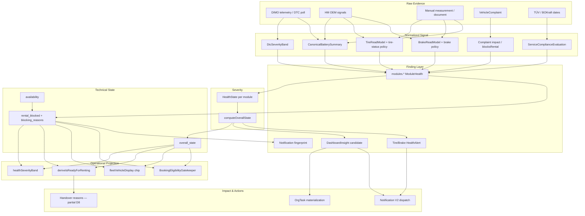

# Vehicle Warnings — Severity, Readiness & Policy Audit (Prompt 14/26)

| Feld | Wert |
|------|------|
| **Audit-ID** | `vehicle-warnings-production-readiness-2026-07` |
| **Prompt** | **14 von 26** — Entscheidungsregeln Evidence → operative Auswirkung |
| **Erstellt (UTC)** | 2026-07-25 |
| **Basis-Commit** | `1d0f2caebe56aa1ecd23295aa33d20e953daa95d` |
| **Vorgänger** | [`12-deduplication-idempotency-audit.md`](./12-deduplication-idempotency-audit.md) |
| **Modus** | **Analyse only** — keine Codeänderungen, keine Remediation |
| **Produktionsdaten verändert** | **Nein** |

**Referenz-Dokumente (gelesen):**

- [`02-canonical-status-model.md`](./02-canonical-status-model.md) — 9 Dimensionen D1–D9, Mapping Ist→Soll
- [`03-warning-data-lineage.md`](./03-warning-data-lineage.md) — Lineage, MT-* Divergenzen
- [`07-tire-warning-audit.md`](./07-tire-warning-audit.md) — FHS „Technisch prüfen“ vs. Tire-Review
- [`09-other-health-warning-audit.md`](./09-other-health-warning-audit.md) — Modul-Matrix, `collectBlockingReasons`
- [`11-finding-lifecycle-audit.md`](./11-finding-lifecycle-audit.md) — Finding-Schichten
- [`12-deduplication-idempotency-audit.md`](./12-deduplication-idempotency-audit.md) — KPI-Zählung pro Fahrzeug

---

## 1. Executive Summary

SynqDrive trennt **bewusst** technische Schwere (`overall_state`), operative Mietblockade (`rental_blocked`), Übergabebereitschaft (`isReadyToRent`) und kommerziellen Status (`operationalStatus`). Diese Dimensionen werden **nicht** in einem einzigen Rule Engine Modul vereint, sondern über **gestaffelte Policy-Schichten**:

| Schicht | Owner | Output |
|---------|-------|--------|
| Domain-Policy | Tire/Brake/Battery/DTC/Service/Complaint Module | Modul-`state`, Evidence |
| Rental Health V1 | `RentalHealthService` | `overall_state`, `rental_blocked`, `blocking_reasons` |
| Booking Gate | `BookingEligibilityGatekeeper` v1.0.0 | Hard-block bei Buchung |
| Fleet Health Service | `healthSeverityBand`, `computeFleetHealthKpis` | Bänder, KPI-Zähler (**pro Fahrzeug**) |
| Dashboard Runtime | `vehicleRuntimeStateBuilder`, `deriveIsReadyForRenting` | Reasons, `Nicht bereit` |
| Fleet Display | `fleetVehicleDisplay`, `deriveFleetVisualState` | Chip **Warnung** / **Verfügbar** |
| Operational Issues | `normalizeOperationalIssues` | Ephemerale Issue-Liste |
| Insights / Notifications / Tasks | Detectors, Projector, Bridge | CRITICAL/WARNING, Tasks |

**Kernbefunde:**

| Thema | Urteil |
|-------|--------|
| Zentrale Severity-Berechnung | **Backend** `computeOverallState` — SSOT für technische Ampel |
| Zentrale Blockade | **Backend** `collectBlockingReasons` + `resolveRentalBlockedState` |
| „Technisch prüfen“ | FHS-Band `review` = `overall_state === 'warning'` ohne confirmed block |
| „Technisch blockiert“ | KPI = `rental_blocked === true`; Badge teils `overall_state === 'critical'` |
| „Nicht bereit“ | Runtime D2 — `available` aber nicht `deriveIsReadyForRenting` |
| Bereit trotz Warning | **Ja** — Modul-warning Reasons sind `blocking: false` |
| Commercial Available trotz Warning | **Ja** — Health mappt auf Chip **Warnung**, nicht `maintenance` |
| Fleet Command „4 Critical“ | **4 Fahrzeuge** im `critical-alerts` Slice (deduped reasons) |
| Doppelzählung Findings | KPIs **nein**; `blocking_reasons` / Chips **teilweise ja** |
| Unevaluable unauffällig | **Risiko** auf Legacy-Surfaces; FHS/Gatekeeper fail-closed |
| Versionierte Regeln | Gatekeeper 1.0.0, Battery-Task v1; Rental Health **ohne** API-Version |

---

## 2. Scope & Methodik

### 2.1 Im Scope

Vollständige Entscheidungskette:

`raw evidence` → `normalized signal` → `finding` → `severity` → `technical state` → `rental readiness` → `commercial availability` → `customer impact` → `task/notification`

Regelquellen:

- Hart codierte Regeln (Policy-TS, Threshold-Konstanten)
- Konfigurationsregeln (Rental Rules DB, Tenant-Policy)
- Rule Engine (Booking Gatekeeper, Task Automation Catalog)
- Datenbankregeln (Enums, Constraints — keine Severity-CHECKs)
- Frontend-Mappings (FHS, Runtime, Fleet Display)
- Übersetzungsdateien (`de.ts`, `fleet-health-service-labels.ts`)
- Fallbacks & Prioritätsaggregation

### 2.2 Primärquellen (CODE_VERIFIED)

| Bereich | Pfad |
|---------|------|
| Rental Health aggregate | `backend/.../rental-health/rental-health.types.ts`, `rental-health.service.ts` |
| Tire block policy | `backend/.../rental-health/tire-rental-health.policy.ts` |
| Brake block policy | `backend/.../rental-health/brake-rental-health.policy.ts` |
| Battery readiness | `backend/.../battery-health/battery-readiness.policy.ts` |
| DTC severity | `backend/.../dtc/dtc-severity.util.ts` |
| Booking gate | `backend/.../booking-eligibility-gatekeeper/*` |
| FHS bands & KPIs | `frontend/.../fleet-health-control-center.ts` |
| FHS labels DE | `frontend/.../fleet-health-service/fleet-health-service-labels.ts`, `i18n/translations/de.ts` |
| Runtime readiness | `frontend/.../dashboard/runtime/rentalReadiness.ts`, `vehicleRuntimeStateBuilder.ts` |
| Dashboard slices | `frontend/.../dashboard/runtime/dashboardSliceBuilder.ts` |
| Fleet display | `frontend/.../lib/fleetVehicleDisplay.ts`, `fleetVisualState.ts` |
| Fleet Command counts | `frontend/.../lib/fleet-operator-panel.ts` |
| Operational issues | `frontend/.../operational-issues/normalizeOperationalIssues.ts`, `operationalIssueTaxonomy.ts` |
| Notification projector | `backend/.../notifications/adapters/rental-health-notification.projector.ts` |
| Task bridge | `backend/.../business-insights/insight-task-bridge.service.ts` |

---

## 3. Tatsächliche Entscheidungskette



### 3.1 Stufen-Definitionen (Ist)

| Stufe | Persistiert? | Kanonischer Owner | Beispiel |
|-------|--------------|-------------------|----------|
| Raw evidence | Ja (DB, ClickHouse, HM) | Ingest | DTC row, tire measurement, HM limp flag |
| Normalized signal | Teilweise (read models) | Domain services | `TireReadModel`, `worstSeverityBand` |
| Finding | Ja (Alerts, Insights, Notifications) | Detectors / Sync | `TireHealthAlert OPEN`, `BATTERY_CRITICAL` insight |
| Severity | Berechnet | `HealthState` + InsightSeverity | `warning`, `CRITICAL` |
| Technical state | API payload | `overall_state`, FHS band | `review`, `critical` |
| Rental readiness | Runtime (FE) | `deriveIsReadyForRenting` | `ready` / `not_ready` |
| Commercial availability | BE + FE | `operationalState.status` | `available`, `active_rented` |
| Customer impact | Teilweise | Handover runtime reasons | Return overdue (visibility) |
| Task/notification | Ja | Bridge, Projector | `OrgTask`, Notification |

---

## 4. Regelquellen-Matrix

| Regeltyp | Beispiele | Versioniert? | Scope |
|----------|-----------|--------------|-------|
| **Hart codiert (TS Policy)** | `computeOverallState`, `isTireRentalHardBlocked`, `evaluateBatteryReadiness`, `collectBlockingReasons`, `healthSeverityBand`, `deriveIsReadyForRenting` | Konstanten (`RENTAL_HEALTH_STALE_MS`); Policies meist **ohne** SemVer | Global im Code |
| **Konfiguration (DB)** | Rental Rules (Mindestalter, Kaution), `tenantInsightPolicy.refreshIntervalMin` | Rental Rules: published revisions + `expectedVersion` | Pro Org / Vehicle |
| **Rule Engine** | `BookingEligibilityGatekeeper` evaluators | **`BOOKING_ELIGIBILITY_GATE_ENGINE_VERSION = '1.0.0'`** | Buchung |
| **Task Automation Catalog** | `task-automation-rule.util.ts` | Per-rule `version` in catalog | Pro Org (resolver) |
| **DB-Regeln** | Prisma Enums (`HealthState`-äquivalent in App, nicht CHECK); `blocksRental` boolean | Schema-Migrationen | Persistenz |
| **Frontend-Mapping** | `fleetVehicleDisplay.resolveOperationalStatus`, `operatorGroupForVehicle`, `ISSUE_TYPE_SEVERITY` | Kein Version-Feld | UI-Projektion |
| **i18n** | `de.ts` `fleetHealthService.kpi.*`, `FHS_HEALTH_BADGE_DE` | Locale files | Anzeige |
| **Fallbacks** | `buildDegradedVehicleHealth`, `healthRisk` soft hint, `isServiceOnlyOverdueCritical` | — | Degraded paths |
| **Prioritätsaggregation** | `computeOverallState`, `HEALTH_SEVERITY` rank, `ISSUE_MODULE_WEIGHT`, `dedupeAndGroup` | — | Aggregate |

**Kein zentrales „Vehicle Warning Rule Engine“-Modul** — Regeln sind **verteilt** über Domain-Policies mit Rental Health als Aggregator.

---

## 5. Severity-Logik — Info / Warning / Critical

### 5.1 Rental Health `HealthState` (Backend SSOT)

```147:156:backend/src/modules/rental-health/rental-health.types.ts
export function computeOverallState(
  modules: Array<Pick<ModuleHealth, 'state'>>,
): HealthState {
  const applicable = modules.filter((m) => m.state !== 'n_a');
  if (applicable.length === 0) return 'unknown';
  if (applicable.some((m) => m.state === 'critical')) return 'critical';
  if (applicable.some((m) => m.state === 'warning')) return 'warning';
  if (applicable.some((m) => m.state === 'unknown')) return 'unknown';
  return 'good';
}
```

| Modul-State | Aggregate-Beitrag |
|-------------|-------------------|
| `critical` | Zieht `overall_state` mindestens auf `critical` |
| `warning` | Zieht mindestens auf `warning` (wenn kein critical) |
| `unknown` | Verhindert `good` — **nie** still zu good |
| `good` | Nur wenn alle applicable `good` |
| `n_a` | Ausgeschlossen |

**Es gibt kein `info` in Rental Health** — `info` existiert in Runtime Reasons, Operational Issues, Dashboard Insights (`INFO`/`OPPORTUNITY`).

### 5.2 Andere Severity-Systeme

| System | Info | Warning | Critical |
|--------|------|---------|----------|
| Dashboard Insight | `INFO`, `OPPORTUNITY` | `WARNING` | `CRITICAL` |
| Notification V2 | — (implizit low) | `WARNING` | `CRITICAL` |
| Runtime Reason | `info` | `warning` | `critical` |
| Operational Issue | `info`, `attention` | `warning` | `critical` |
| DTC Band | `info`/`low` | `warning`/`medium`/`watch` | `critical`/`high`/`safety_critical` |

### 5.3 `rental_blocked` vs. `overall_state`

**Orthogonal:** Modul `warning` blockiert **nicht** automatisch. Blockade nur über `collectBlockingReasons`:

| Block-Trigger (V1) | Quelle |
|--------------------|--------|
| TÜV/BOKraft overdue | `complianceEval` |
| `blocksRental === true` Complaint | Open complaints |
| Limp Mode | HM `limpModeActive` |
| Brake hard block | `isBrakeBlockWorthy` + evidence |
| Tire hard block | `isTireRentalHardBlocked` |
| Battery block-worthy | `evaluateBatteryReadiness` |
| Safety-critical DTC | `error_codes.state === 'critical'` + band |
| Oil MINIMUM/LOW | HM oil level |

```238:244:backend/src/modules/rental-health/rental-health.types.ts
export function resolveRentalBlockedState(
  availability: RentalHealthAvailabilityState,
  blockingReasons: string[],
): boolean | null {
  if (availability !== 'ready') return null;
  return blockingReasons.length > 0;
}
```

---

## 6. Label-Logik — „Technisch prüfen“, „Technisch blockiert“, „Nicht bereit“

### 6.1 „Technisch prüfen“

| Kontext | Bedingung | Quelle |
|---------|-----------|--------|
| **FHS KPI** | `healthKpis.needsReview` — Fahrzeuge mit Band `review` | `computeFleetHealthKpis` |
| **FHS Band `review`** | `overall_state === 'warning'` UND NICHT `rental_blocked` confirmed UND Pipeline nicht degraded | `healthSeverityBand()` |
| **i18n** | `fleetHealthService.kpi.review` → „Technisch prüfen“ | `de.ts` L232 |
| **Badge** | `FHS_HEALTH_BADGE_DE.review` → „Technisch prüfen“ | `fleet-health-service-labels.ts` |

**Nicht identisch mit:** Tire `CHECK_SOON`, `REVIEW_REQUIRED`, Modul-Detail „Prüfung erforderlich“.

### 6.2 „Technisch blockiert“

| Kontext | Bedingung | Semantik |
|---------|-----------|----------|
| **FHS KPI „Technisch blockiert“** | `rental_blocked === true` (confirmed) | **Mietblockade aktiv** |
| **FHS Badge `action`** | `operatorGroupForVehicle === 'action_required'` | `rental_blocked` **ODER** `overall_state === 'critical'` |
| **FHS Badge `blocked`** | Explizit `rental_blocked` | Label **„Mietblockade“** |
| **Fleet chip „Blockiert“** | `hasHardRentalBlockingReasons` oder `visual.isBlocked` | Display-Layer |

**Wichtig:** KPI „Technisch blockiert“ ≠ Badge „Technisch blockiert“ — KPI zählt nur confirmed `rental_blocked`; Badge `action` umfasst auch critical ohne Block.

### 6.3 „Nicht bereit“

| Kontext | Bedingung |
|---------|-----------|
| **Runtime `rentalReadiness`** | `operationalStatus === 'available'` aber `deriveIsReadyForRenting === false` |
| **Dashboard Slice** | Gruppe `available-but-not-ready`, Label „Nicht bereit“ |
| **Fleet rental display** | `FleetRentalAvailability.not_ready` |

**Auslöser** (`deriveIsReadyForRenting`):

- Nicht `operationalStatus === 'available'`
- Cleaning ≠ `Clean`
- `blockLevel !== 'none'`
- Telemetry `offline`
- Unreliable operational data quality
- Reason mit `blocking`, `preventsReady`, oder `critical` in Kategorien compliance/damage/rental

**Modul-health warning alone → NOT „Nicht bereit“** (Reasons mit `blocking: false`).

### 6.4 Weitere FHS-Labels

| Band | Label DE | Bedingung |
|------|----------|-----------|
| `good` | Technisch unauffällig | `overall_state === 'good'` |
| `limited` | Nicht bewertbar (KPI) / Limited | `overall_state === 'unknown'` oder degraded pipeline |
| `unevaluable` | Nicht bewertbar | Kein Health / `rental_blocked: null` / pipeline degraded |
| `blocked` | Mietblockade | `rental_blocked === true` |
| `critical` | (intern, nicht KPI-Label) | `overall_state === 'critical'` ohne block |

---

## 7. Commercial Availability & Active Rental

### 7.1 Commercial Status bleibt Available

Health-Warnungen **überschreiben nicht** `operationalState.status`. Mapping in `fleetVehicleDisplay.resolveOperationalStatus`:

- `overall_state === 'warning'` → Chip **`warning`** („Warnung“), nicht `maintenance`
- `isServiceOnlyOverdueCritical` → Service-only critical wird als **Warnung** gezeigt, nicht Kritisch
- Commercial `AVAILABLE` bleibt erhalten; Map nutzt `attention` (amber), nicht `blocked`

### 7.2 Active Rental (`ACTIVE_RENTED`)

| Dimension | Verhalten |
|-----------|-----------|
| Commercial | `active_rented` — Runtime `operationalStatus !== 'available'` |
| Rental readiness | **Immer nicht bereit** für Ausgabe (`deriveIsReadyForRenting` requires `available`) |
| Health / FHS | Health wird weiter evaluiert — keine Ausnahme |
| Handover reasons | Return overdue → `critical`/`warning` visibility, **non-blocking** für readiness |
| Customer impact (D8) | **Nicht vollständig modelliert** — emergiert aus Handover/Insights |

### 7.3 Booking Gatekeeper

Bei Buchung: `VEHICLE_RENTAL_BLOCKED` wenn `isRentalBlocked(health)`; `VEHICLE_READINESS_UNAVAILABLE` wenn Pipeline nicht ready (`rental_blocked: null`). Engine version **1.0.0**.

---

## 8. Zähl-Logik — Fleet Command & FHS KPIs

### 8.1 Fleet Command „4 Critical“

```57:66:frontend/src/rental/lib/fleet-operator-panel.ts
export function resolveCanonicalFleetAlertCounts(
  runtime: DashboardRuntimeModel,
): { critical: number; warning: number } {
  const criticalSlice = runtime.slices['critical-alerts'];
  const critical = criticalSlice.count ?? criticalSlice.rows.length;
  const warning = runtime.vehicleStates.filter(
    (state) => state.isWarning && !state.isCritical && !state.isBlocked,
  ).length;
  return { critical, warning };
}
```

| Zähler | Einheit | Dedup |
|--------|---------|-------|
| `critical` | **Fahrzeuge** (rows im `critical-alerts` Slice) | Pro Fahrzeug, Reasons via `canonicalCriticalReasonKey` |
| `warning` | **Fahrzeuge** mit `isWarning && !isCritical && !isBlocked` | Pro Fahrzeug |

**Nicht:** Anzahl Findings, Notifications oder DTC-Events.

### 8.2 FHS `computeFleetHealthKpis`

| KPI-Feld | Zählt | Einheit |
|----------|-------|---------|
| `blocked` | `rental_blocked === true` | Fahrzeuge |
| `critical` | `overall_state === 'critical'` (excl. unevaluable) | Fahrzeuge |
| `warning` | `overall_state === 'warning'` | Fahrzeuge |
| `needsReview` | Band `review` | Fahrzeuge |
| `actionRequired` | Band `blocked` OR `critical` | Fahrzeuge |
| `healthy` | Band `good` | Fahrzeuge |
| `unevaluable` / `limited` | Pipeline degraded / unknown | Fahrzeuge |

**Ein Fahrzeug = max. ein KPI-Bucket** pro Band-Typ.

### 8.3 Doppelzählung

| Kontext | Doppelzählung? |
|---------|----------------|
| FHS KPIs | **Nein** — ein Fahrzeug, ein Band |
| Fleet Command critical slice | **Nein** — ein Row pro Fahrzeug (merged reasons) |
| Module chips in FHS row | **Ja by design** — mehrere Module sichtbar, KPI trotzdem 1 |
| `blocking_reasons[]` | **Möglich** — Limp in `vehicle_alerts` + `blocking_reasons` (OTH-W01) |
| Insights + Runtime critical | **Deduped** in `buildCriticalAlertsSlice` via `insightDuplicatesRuntimeCritical` |
| Notifications | Pro fingerprint/code — unabhängig von KPI |

---

## 9. Zentrale vs. verteilte Berechnung

| Surface | Zentral? | SSOT |
|---------|----------|------|
| `overall_state` | **Ja (BE)** | `RentalHealthService` |
| `rental_blocked` | **Ja (BE)** | `collectBlockingReasons` |
| `healthSeverityBand` | **Ja (FE, eine Funktion)** | `fleet-health-control-center.ts` |
| `deriveIsReadyForRenting` | **Ja (FE)** | `rentalReadiness.ts` |
| `resolveOperationalStatus` | **Nein** — eigene Projektion | `fleetVehicleDisplay.ts` |
| `deriveFleetVisualState` | **Nein** — Map-Layer | `fleetVisualState.ts` |
| `isCritical` / Runtime severity | **Nein** — Reasons-basiert | `vehicleRuntimeStateBuilder.ts` |
| Operational Issues | **Nein** — ephemerale Merge | `normalizeOperationalIssues.ts` |

**Höchste Severity pro Fahrzeug:** Backend `computeOverallState` ist kanonisch für API; Frontend hat **3+ Projektionen** die divergieren können (MT-01, MT-02 in Lineage-Audit).

---

## 10. Pflichtfragen (14/14)

### 10.1 Wann ist etwas Info, Warning oder Critical?

Siehe §5. **Rental Health:** nur `good|warning|critical|unknown|n_a`. **Info** existiert in Insights (`INFO`), Runtime (`info`), Operational Issues — **nicht** in `overall_state`. **Critical** auf Modul-Ebene wenn Domain-Policy es so setzt (gemessene Tire-Legalität, safety DTC, TÜV overdue module, etc.).

### 10.2 Wann wird „Technisch prüfen“ verwendet?

Wenn `healthSeverityBand(health) === 'review'` → `overall_state === 'warning'` ohne confirmed `rental_blocked` und ohne pipeline degraded. KPI-Zähler: `needsReview`. Label aus i18n / `FHS_HEALTH_BADGE_DE`.

### 10.3 Wann wird „Technisch blockiert“ verwendet?

- **KPI:** Nur bei `rental_blocked === true` (Label „Technisch blockiert“, Hint „Vermietung gesperrt“).
- **Badge `action`:** Auch bei `overall_state === 'critical'` (Label „Technisch blockiert“).
- **Fleet chip „Blockiert“:** Hard blocking reasons oder visual block.

### 10.4 Wann wird „Nicht bereit“ verwendet?

Runtime: commercial `available`, aber `deriveIsReadyForRenting === false` (cleaning, blockLevel, offline telemetry, blocking reasons). **Nicht** bei `active_rented`/`reserved` — dort ist readiness ohnehin false aus anderem Grund.

### 10.5 Wann bleibt ein Fahrzeug trotz Warning bereit?

Wenn `operationalStatus === 'available'`, clean, `blockLevel === 'none'`, telemetry nicht offline, keine readiness-blockierenden Reasons — **auch bei** `overall_state === 'warning'`. Modul-Reasons explizit `blocking: false, preventsReady: false`.

### 10.6 Wann darf Commercial Status weiterhin Available sein?

Immer wenn `operationalState.status === 'available'` (booking-derived). Health warning → Chip **Warnung**, nicht Status-Änderung. Service-only overdue critical → absichtlich **Warnung** statt Kritisch.

### 10.7 Wie wird eine aktive Vermietung behandelt?

`active_rented` — nicht ready for handout; health weiter sichtbar; Handover-Reasons für Return/Pickup; keine dedizierte D8 Customer-Impact-Engine.

### 10.8 Was bedeutet der Fleet-Command-Count „4 Critical“?

**4 Fahrzeuge** im Dashboard-Runtime-Slice `critical-alerts` — Fahrzeuge mit mindestens einem deduped critical reason (Runtime + non-duplicate CRITICAL insights).

### 10.9 Zählt er Findings, Fahrzeuge oder Ereignisse?

**Fahrzeuge** (distinct `vehicleId`). Reasons innerhalb eines Fahrzeugs werden gemerged/deduped, nicht als 4 separate Counts.

### 10.10 Warum erscheinen sichtbare Fahrzeuge nur als „Warnung“?

`resolveOperationalStatus` mappt `overall_state === 'warning'` → `warning` → Label **„Warnung“**. Map-Layer: `attention` (nicht critical). **Service-only critical** wird zu warning downgraded (`isServiceOnlyOverdueCritical`). Hard block → **„Blockiert“** / **„Kritisch“**, nicht Warnung.

### 10.11 Wird höchste Severity pro Fahrzeug zentral berechnet?

**Backend ja** (`computeOverallState`). **Frontend teilweise** — FHS zentral (`healthSeverityBand`), aber Fleet Display und Runtime rechnen eigene Severity aus Reasons/Heuristics.

### 10.12 Werden mehrere Findings doppelt gezählt?

**KPIs/Counts: nein** (pro Fahrzeug). **UI-Chips/Reason-Listen: teilweise ja** (mehrere Module, mögliche `blocking_reasons`-Duplikate). **Notifications: pro Event-Type**.

### 10.13 Kann ein nicht bewertbares Fahrzeug als unauffällig erscheinen?

**FHS/Gatekeeper: nein** — `unevaluable`/`limited`, `rental_blocked: null` fail-closed bei Buchung. **Risiko:** Legacy-Surface ohne Rental Health Map, nur `healthStatus` — kann neutral wirken (SYM-02). `availability: partial` → kein confirmed „frei“.

### 10.14 Welche Regeln sind dokumentiert und versioniert?

| Domain | Dokumentation | Version |
|--------|---------------|---------|
| Vehicle Warnings Audit Pack | `docs/audits/vehicle-warnings/*` | Audit charter 2026-07 |
| Canonical 9-Dimension Model | `02-canonical-status-model.md` | — |
| Operational Issues | `docs/operational-issue-normalization.md` | Contract in code |
| FHS Contract | `FLEET_HEALTH_SERVICE_CONTRACT.md` | — |
| Booking Gatekeeper | Constants file | **1.0.0** |
| Battery Alert Policy | `BATTERY_ALERT_POLICY_VERSION = '1.0.0'` | Ja |
| Battery Task Rules | `BATTERY_TASK_RULE_VERSION = 1` | Ja |
| Notification Registry | Per-event `fingerprintVersion` | Mostly `1` |
| Rental Health V1 API | Inline comments | **Kein** URL/API SemVer |
| Rental Rules | DB revisions | Optimistic concurrency only |
| Tire/Brake status | `tire-status.ts`, configs | Threshold constants in code |

---

## 11. Verbindliche Decision Table (Sollvorschlag)

> **Hinweis:** Diese Tabelle ist ein **normatives Zielbild** für zukünftige Vereinheitlichung. **Ist-Code unverändert.** Jede Zeile sollte später von genau einem Owner enforced werden.

| # | Evidence (Beispiel) | Normalized Signal | Finding | Module Severity | `overall_state` min | `rental_blocked` | Rental Readiness (available vehicle) | Commercial Chip | FHS Band | Task/Notification |
|---|---------------------|-------------------|---------|-----------------|---------------------|------------------|--------------------------------------|-----------------|----------|-------------------|
| R-01 | Tire tread measured ≤ legal | `REPLACE` + hard evidence | Tire alert OPEN | `critical` | `critical` | **true** | `not_ready` | Blockiert | `blocked` | Task + NTF |
| R-02 | Tire WATCH / estimated low | `WATCH` | Tire alert OPEN | `warning` | `warning` | **false** | **ready** (if clean) | Warnung | `review` | Monitor insight optional |
| R-03 | TPMS stale, no hard block | `REVIEW_REQUIRED` | — | `unknown`/`warning` | `warning` | **false** | ready* | Warnung | `review` or `limited` | — |
| R-04 | Brake hard block evidence | `HARD_BLOCK` | Brake alert | `critical` | `critical` | **true** | `not_ready` | Blockiert/Kritisch | `blocked` | Task + NTF |
| R-05 | Brake WATCH only | `WATCH` | Brake alert | `warning` | `warning` | **false** | **ready** | Warnung | `review` | — |
| R-06 | Safety-critical DTC active | `safety_critical` band | DTC event + NTF | `critical` | `critical` | **true** | `not_ready` | Kritisch | `action_required` | NTF per code |
| R-07 | Non-safety DTC warning | `warning` band | DTC event | `warning` | `warning` | **false** | **ready** | Warnung | `review` | NTF optional |
| R-08 | TÜV overdue | compliance eval | Insight + module | `critical` | `critical` | **true** | `not_ready` | Kritisch/Blockiert | `blocked` | Compliance task |
| R-09 | Service overdue only (no other critical) | service eval | Insight | `critical`* | `critical` | **false**† | **ready**‡ | **Warnung** (Ist) | `critical` (band) | Task suggestion |
| R-10 | Battery block-worthy | readiness eval | Insight/NTF | `critical` | `critical` | **true** | `not_ready` | Blockiert | `blocked` | Battery task |
| R-11 | Battery warning light only | HM flag | — | `warning` | `warning` | policy-dependent | ready/block per policy | Warnung | `review` | NTF |
| R-12 | Limp mode active | HM flag | vehicle_alerts | `critical` | `critical` | **true** | `not_ready` | Blockiert | `blocked` | NTF |
| R-13 | Oil minimum | HM oil status | vehicle_alerts | `warning`/`critical` | ≥`warning` | **true** | `not_ready` | Blockiert | `blocked` | NTF |
| R-14 | Complaint `blocksRental` | complaint | Observation | `critical` | `critical` | **true** | `not_ready` | Blockiert | `blocked` | Task |
| R-15 | Complaint urgency only | complaint | Observation | `warning` | `warning` | **false** | **ready** | Warnung | `review` | NTF |
| R-16 | Pipeline partial/unavailable | load failure | — | `unknown` stubs | `unknown` | **null** | `not_ready` (unreliable) | Limited | `unevaluable` | — |
| R-17 | Telemetry offline ≥48h | freshness | Runtime reason | — | — | **false** | `not_ready` | Warnung | — | Telemetry NTF |
| R-18 | Vehicle not clean | ops state | — | — | — | **false** | `not_ready` | Verfügbar + „Nicht bereit“ | — | — |
| R-19 | Active rental + health warning | — | — | `warning` | `warning` | per health | **not_ready** (not available) | Aktiv/Warnung | `review` | Handover visibility |
| R-20 | Insight CRITICAL duplicate of runtime | insight | DashboardInsight | — | — | per health | per readiness | per display | per band | Deduped in slice |

\* Service module may be `critical` without entering `blocking_reasons` for non-compliance paths.  
† Unless TÜV/BOKraft in blocking list.  
‡ Ist deliberately shows **Warnung** via `isServiceOnlyOverdueCritical`.  
\* R-03: readiness `ready` only if no other blockers (telemetry, cleaning).

### 11.1 Soll-Invarianten (normativ)

1. **`rental_blocked: true` ⇒ `not_ready`** für `operationalStatus === 'available'`.
2. **`rental_blocked: null` ⇒ never „technisch unauffällig“** — immer `unevaluable`/`limited`.
3. **Modul `warning` alone ⇒ never `rental_blocked`** (unless explicit blocking reason added).
4. **KPI counts are per-vehicle, never per-finding.**
5. **Commercial status is never downgraded by health** — only chips/bands change.
6. **Single backend payload (`VehicleHealth`) feeds all health projections** — FE re-aggregation only for non-health dimensions (cleaning, telemetry, bookings).

---

## 12. Cross-Surface-Inkonsistenzen

| ID | Thema | Schwere |
|----|-------|---------|
| SR-01 | „Technisch blockiert“ KPI ≠ Badge `action` Semantik | Hoch |
| SR-02 | `overall_state critical` ohne `rental_blocked` (service-only) → Chip Warnung, FHS critical | Hoch |
| SR-03 | Modul-warning ≠ „Nicht bereit“ aber = „Technisch prüfen“ | Mittel (by design, UX risk) |
| SR-04 | `RentalHealthAvailability.ready` ≠ rental readiness `ready` | Hoch (Naming) |
| SR-05 | 3+ FE severity projections vs. one BE aggregate | Hoch |
| SR-06 | Limp/oil doppelt in module + blocking_reasons | Mittel |
| SR-07 | Fleet Command critical ≠ FHS critical KPI | Mittel (different slices) |
| SR-08 | D8 customer impact nicht explizit | Mittel |
| SR-09 | INFO insights vs. no Rental Health info level | Niedrig |
| SR-10 | Legacy `healthStatus` ohne Rental Health map | Mittel |

---

## 13. Risiko-Register (SEV-W01–SEV-W18)

| ID | Risiko | Schwere | Evidenz |
|----|--------|---------|---------|
| SEV-W01 | „Technisch blockiert“ KPI vs. Badge unterschiedliche Semantik | Hoch | `FleetHealthServiceKpiStrip`, `operatorGroupForVehicle` |
| SEV-W02 | Service-only critical → Chip Warnung, Modul critical | Hoch | `isServiceOnlyOverdueCritical` |
| SEV-W03 | Operator denkt Warning = nicht vermietbar | Hoch | `addHealthReasons` non-blocking |
| SEV-W04 | `availability.ready` vs. D2 `ready` Namenskollision | Hoch | `rental-health.types.ts`, `rentalReadiness.ts` |
| SEV-W05 | FE Runtime severity ≠ `overall_state` | Hoch | `vehicleRuntimeStateBuilder` |
| SEV-W06 | Fleet Command critical count ≠ FHS critical KPI | Mittel | `fleet-operator-panel` vs `computeFleetHealthKpis` |
| SEV-W07 | `blocking_reasons` Duplikate (Limp) | Mittel | `collectBlockingReasons` |
| SEV-W08 | Unevaluable auf Legacy-Surface neutral | Mittel | SYM-02 lineage |
| SEV-W09 | Kein Rental Health API version | Mittel | Contract drift risk |
| SEV-W10 | D8 customer impact fehlt | Mittel | Canonical model D8 |
| SEV-W11 | Tire CHECK_SOON ≠ FHS review | Mittel | Tire audit TIRE-W02 |
| SEV-W12 | Insight INFO/WARNING misaligned mit HealthState | Niedrig | Separate enums |
| SEV-W13 | Operational Issues severity ≠ Rental Health | Mittel | `operationalIssueTaxonomy` |
| SEV-W14 | `actionRequired` mixes blocked + critical bands | Mittel | KPI semantics |
| SEV-W15 | Oil minimum blocks rental but module may be warning | Mittel | HM path |
| SEV-W16 | Gatekeeper fail-closed vs. UI optimistic display | Mittel | Booking vs. Fleet chip |
| SEV-W17 | Notification severity ≠ module severity timing | Mittel | Sweep lag |
| SEV-W18 | Decision table R-09 Ist/Soll divergence undocumented in UI | Mittel | Service-only path |

---

## 14. Gesamturteil (Prompt 14)

| Kriterium | Urteil |
|-----------|--------|
| Evidence→Impact-Kette dokumentiert | **Ja** — 8 Stufen, mehrere Owner |
| Regeln zentral auffindbar | **Teilweise** — BE Rental Health SSOT; FE fragmentiert |
| Info/Warning/Critical klar definiert | **Pro Schicht** — nicht global einheitlich |
| Technisch prüfen / blockiert / Nicht bereit | **Ja** — unterschiedliche Dimensionen, teils gleiche Wörter |
| Ready trotz Warning | **Ja, by design** |
| Commercial Available trotz Warning | **Ja, by design** |
| Fleet Command Critical count | **Fahrzeuge**, deduped |
| Doppelzählung | KPIs nein, UI-Listen teilweise |
| Versionierte Regeln | Gatekeeper + Battery ja; Rental Health nein |
| Decision Table (Soll) | **Erstellt** — §11, keine Code-Änderung |

**Gesamt Severity/Readiness Policy (Prompt 14):** Die **operative Wahrheit für Mietblockade** sitzt korrekt im Backend (`collectBlockingReasons` + Gatekeeper). Die **größte operatorische Verwirrung** entsteht durch **überlappende deutsche Labels** („Technisch blockiert“, „Warnung“, „Kritisch“, „Nicht bereit“) auf **verschiedenen Dimensionen** und **drei Frontend-Projektionen**, die nicht immer dieselbe Severity zeigen.

---

## 15. Änderungshistorie

| Version | Datum | Änderung |
|---------|-------|----------|
| 1.0 | 2026-07-25 | Erstaudit Prompt 14/26 inkl. Soll-Decision-Table |

**Changes / Architektur (SynqDrive Code):** nicht aktualisiert (audit-only).
