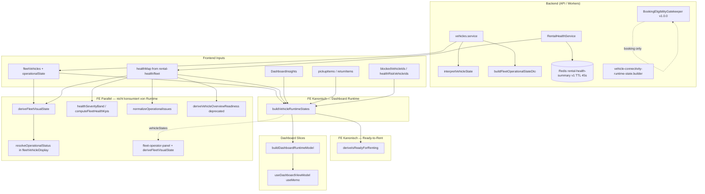

# Vehicle Warnings — Runtime & Readiness Builder Audit (Prompt 15/26)

| Feld | Wert |
|------|------|
| **Audit-ID** | `vehicle-warnings-production-readiness-2026-07` |
| **Prompt** | **15 von 26** — Vehicle Runtime State Builder, Ready-to-Rent Builder, parallele Ableitungen |
| **Erstellt (UTC)** | 2026-07-25 |
| **Basis-Commit** | `1d0f2caebe56aa1ecd23295aa33d20e953daa95d` |
| **Vorgänger** | [`13-severity-readiness-policy-audit.md`](./13-severity-readiness-policy-audit.md) |
| **Modus** | **Analyse only** — keine Codeänderungen, keine Remediation |
| **Produktionsdaten verändert** | **Nein** |

**Referenz-Dokumente (gelesen):**

- [`02-canonical-status-model.md`](./02-canonical-status-model.md) — Dimensionen D1–D9, Owner-Matrix
- [`03-warning-data-lineage.md`](./03-warning-data-lineage.md) — MT-* Divergenzen, Critical-Zähler
- [`10-freshness-confidence-audit.md`](./10-freshness-confidence-audit.md) — Telemetry-Freshness vs. Health
- [`13-severity-readiness-policy-audit.md`](./13-severity-readiness-policy-audit.md) — Severity/Readiness-Policy, agreed rules

---

## 1. Executive Summary

SynqDrive besitzt **keinen globalen, versionierten Runtime-State-Builder**, sondern eine **gestaffelte Architektur** mit klar getrennten Verantwortlichkeiten:

| Schicht | Kanonischer Owner | Persistiert? | Scope |
|---------|-------------------|--------------|-------|
| **Commercial Operational State (D1)** | Backend `buildFleetOperationalStateDto` + `vehicles.service` | API-Payload (pro Request) | Fleet Map, Vehicle Detail |
| **Rental Health (D3/D4)** | Backend `RentalHealthService` | Redis-Cache 45s (`v1`) | FHS, Runtime-Input |
| **Connectivity Runtime** | Backend `vehicle-connectivity-runtime-state.builder` | Evidence-basiert, versioniert | Connectivity-Surfaces |
| **Dashboard Runtime (D2)** | FE `buildVehicleRuntimeStates` + `deriveIsReadyForRenting` | **Nein** — live `useMemo` | Dashboard, Fleet Command Slices |
| **Fleet Visual / Row Chips** | FE `deriveFleetVisualState`, `resolveOperationalStatus` | **Nein** | Fleet Map, Fleet Rows |
| **Booking Gate** | BE `BookingEligibilityGatekeeper` v1.0.0 | Pro Buchungsanfrage | Wizard, Enforcement |

**Kernbefunde:**

| Thema | Urteil |
|-------|--------|
| Ein kanonischer Builder global | **Nein** — FE-Dashboard hat SSOT für Runtime-Slices; Backend hat eigene SSOTs für Health/Operational/Connectivity |
| Warning/Critical auto-blockierend | **Nein** — seit V4.9.x nur explizite `blocking: true` / `rental_blocked` |
| Offline blockiert Readiness | **Ja** — `telemetryState === 'offline'` → `preventsReady: true` |
| Unknown Telemetry | **Ja** — kein Offline-Block; Data-Quality-Gate kann Readiness verhindern |
| Aktive Vermietung | **Ja** — `operationalStatus !== 'available'` → nicht ready |
| Nächste Buchung | **Info only** — blockiert Readiness **nicht** |
| Deterministisch | **Ja** — reine Funktionen mit explizitem `now` |
| Tenant-safe | **Ja** — org-gescopte Inputs, keine hardcodierten IDs im Builder |
| Tests | **69 Unit-Tests** im Runtime-Ordner; kein dediziertes Golden/Contract für Runtime-Builder |
| Builder-Version in Production | **Keine** explizite Runtime-Builder-Version; Connectivity `CONNECTIVITY_RUNTIME_STATE_VERSION`; Rental-Health-Cache `v1`; Gatekeeper `1.0.0` |

**Haupt-Risiko:** Mindestens **12 parallele Ableitungspfade** produzieren ähnliche, aber nicht identische Zustandsbilder — insbesondere Telemetry-Schwellen (FE 15m/24h/48h vs. BE `interpretVehicleState`), Fleet-Chips vs. Runtime-Slices, FHS-KPIs vs. Dashboard-Critical-Count.

---

## 2. Scope & Methodik

### 2.1 Im Scope

- Zentraler Vehicle Runtime State Builder (`vehicleRuntimeStateBuilder.ts`)
- Ready-to-Rent Builder (`rentalReadiness.ts`)
- Dashboard Slice Builder (`dashboardSliceBuilder.ts`)
- Alle parallelen Ableitungen (Fleet Visual, Fleet Display, FHS, Operational Issues, Vehicle Overview, Backend Interpreter/Connectivity)
- Cache- und Invalidierungsketten
- Testabdeckung (Contract, Unit, Golden)

### 2.2 Suchbegriffe (Repository-Scan)

`runtime state builder`, `vehicle runtime`, `readiness`, `ready to rent`, `deriveTelemetryState`, `blockers`, `availability`, `operational state`, `dashboard slices`, `fleet summary`, `status projection`

### 2.3 Primärquellen (CODE_VERIFIED)

| Bereich | Pfad |
|---------|------|
| Runtime Builder | `frontend/src/rental/components/dashboard/runtime/vehicleRuntimeStateBuilder.ts` |
| Ready-to-Rent | `frontend/src/rental/components/dashboard/runtime/rentalReadiness.ts` |
| Dashboard Slices | `frontend/src/rental/components/dashboard/runtime/dashboardSliceBuilder.ts` |
| Dashboard VM | `frontend/src/rental/components/dashboard/useDashboardViewModel.ts` |
| Runtime Types | `frontend/src/rental/components/dashboard/runtime/dashboardRuntimeTypes.ts` |
| Fleet Visual | `frontend/src/rental/lib/fleetVisualState.ts` |
| Fleet Row Display | `frontend/src/rental/lib/fleetVehicleDisplay.ts` |
| Fleet Command | `frontend/src/rental/lib/fleet-operator-panel.ts` |
| Operational Issues | `frontend/src/rental/lib/operational-issues/normalizeOperationalIssues.ts` |
| FHS Bands/KPIs | `frontend/src/rental/lib/fleet-health-control-center.ts` |
| Vehicle Overview Readiness | `frontend/src/rental/lib/vehicle-overview-readiness.utils.ts` |
| Operational Read Model | `frontend/src/rental/lib/vehicle-operational-state.ts` |
| Query Invalidation | `frontend/src/rental/lib/vehicle-operational-query/invalidate.ts` |
| BE Operational State | `backend/src/modules/vehicles/operational/fleet-operational-state.util.ts` |
| BE State Interpreter | `backend/src/modules/vehicles/vehicle-state-interpreter.ts` |
| BE Connectivity Builder | `backend/src/modules/vehicles/connectivity/domain/vehicle-connectivity-runtime-state.builder.ts` |
| BE Rental Health | `backend/src/modules/rental-health/rental-health.service.ts` |
| BE Rental Health Cache | `backend/src/modules/rental-health/rental-health-summary-cache.service.ts` |
| BE Booking Gate | `backend/src/modules/bookings/booking-eligibility-gatekeeper/` |
| FHS Contract | `frontend/src/rental/components/fleet-health-service/FLEET_HEALTH_SERVICE_CONTRACT.md` |

---

## 3. Architektur — Kanonisch vs. Parallel



**Leitprinzip (mehrfach im Code):**

- **Health Severity ≠ Telemetry Freshness ≠ Commercial Availability ≠ Rental Readiness**
- Runtime Builder **konsumiert** Backend-`operationalState` und Rental-Health — er **ersetzt** sie nicht
- Blocking kommt nur aus **expliziten** Quellen: `rental_blocked`/`blocking_reasons`, `operationalStatus`, Offline-Policy, Cleaning, Data-Quality

---

## 4. Kanonischer Frontend Runtime Builder

### 4.1 Entry Points

| Funktion | Datei | Rolle |
|----------|-------|-------|
| `buildVehicleRuntimeStates()` | `vehicleRuntimeStateBuilder.ts` | Pro-Fahrzeug `VehicleRuntimeState[]` |
| `resolveVehicleRuntimeOperationalBlock()` | `vehicleRuntimeStateBuilder.ts` | Liest BE `operationalState` + `bookingContext` |
| `deriveTelemetryState()` | `vehicleRuntimeStateBuilder.ts` | FE-Telemetry (15m live, 24h standby, 48h offline) |
| `deriveIsReadyForRenting()` | `rentalReadiness.ts` | Ready-to-Rent Entscheid |
| `buildDashboardRuntimeModel()` | `dashboardSliceBuilder.ts` | Slices + Aggregation |
| `useDashboardViewModel()` | `useDashboardViewModel.ts` | Live-Rebuild via `useMemo` |

### 4.2 Inputs (verwendet)

| Input | Quelle | Verwendung |
|-------|--------|------------|
| `fleetVehicles` | Fleet Map / FleetContext | Basis pro Fahrzeug |
| `vehicle.operationalState` | Backend DTO | Commercial Status, Data Quality |
| `vehicle.bookingContext` | Backend | Active/Reserved/Next Booking |
| `healthMap` | `GET …/rental-health/fleet` | `rental_blocked`, `blocking_reasons`, Modul-States |
| `insights` | DashboardInsightsContext | Nicht-blockierende Reasons |
| `pickupItems` / `returnItems` | Today-Bookings API | Handover-Slices, `deriveBookingState` |
| `blockedVehicleIds` | Dashboard-Heuristik | Zusätzliche Block-Markierung |
| `healthRiskVehicleIds` | Dashboard-Heuristik | Fallback-Reason „Health prüfen“ |
| `rentalBlockingServiceCases` | Service-Cases Map | Service-Overdue-Critical (Dedup) |
| `now` | VM (`dashboardNow`) | Determinismus für Telemetry/Booking |
| `telemetrySoftOfflineHours` / `telemetryHardOfflineHours` | VM (24/48) | Offline-Schwellen |
| `locale` | i18n | Reason-Texte |
| `cleaningStatus` | VehicleData | Readiness-Gate |
| `vehicle.lastSeenAt` / Live-Hints | VehicleData | `deriveTelemetryState` |

### 4.3 Inputs (ignoriert oder redundant)

| Input | Status |
|-------|--------|
| `availableVehicles` | Im `BuildVehicleRuntimeStatesInput` vorhanden, **nicht konsumiert** — Status kommt aus `operationalState` pro Fahrzeug |
| `reservedVehicles` | **Nicht konsumiert** (gleicher Grund) |
| `activeRentedVehicles` | **Nicht konsumiert** (gleicher Grund) |
| Backend `interpretVehicleState` | Runtime nutzt **eigene** `deriveTelemetryState`, nicht BE-Interpreter |
| FHS `healthSeverityBand` | Nicht direkt — Runtime leitet `healthSeverity` aus Reasons + `overall_state` ab |
| Tasks / Damages / Documents | Nicht im Runtime Builder (nur in deprecated Vehicle Overview) |
| Connectivity Runtime Builder | Separater BE-Pfad, nicht in Dashboard-Runtime eingebunden |

### 4.4 Output-Felder (`VehicleRuntimeState`)

Wesentliche Felder: `operationalStatus`, `rentalReadiness`, `blockLevel`, `isReadyToRent`, `telemetryState`, `dataQualityState`, `bookingState`, `readyReasons`, `notReadyReasons`, `blockReasons`, `warningReasons`, `criticalReasons`, `isAvailable`, `isBlocked`, `isMaintenance`, `isCritical`, `isWarning`.

### 4.5 Ready-to-Rent Regeln (`deriveIsReadyForRenting`)

Alle Bedingungen müssen erfüllt sein:

1. `operationalStatus === 'available'`
2. `canonicalStatus === AVAILABLE` (Backend)
3. `isBackendOperationalDataQualityReliable()` — `RELIABLE` oder Legacy-`isReliable`
4. `cleaningStatus === 'Clean'`
5. `blockLevel === 'none'`
6. `telemetryState !== 'offline'`
7. Keine Reasons mit `reasonBlocksReadyForRenting()` — d.h. `preventsReady`, `blocking`, oder `critical` in Kategorien `compliance`/`damage`/`rental`

`nextBooking` allein blockiert **nie** (nur Info-Reason via `buildNextBookingInfoReason`).

---

## 5. Pflichtfragen (16/16)

### 5.1 Gibt es genau einen kanonischen Builder?

**Nein — kontextabhängig ja, global nein.**

| Kontext | Kanonischer Owner |
|---------|-------------------|
| Dashboard Runtime + Slices + Fleet Command Runtime-Input | `buildVehicleRuntimeStates` (FE) |
| Ready-to-Rent (Dashboard) | `deriveIsReadyForRenting` (FE) |
| Rental Health / Blockade | `RentalHealthService` (BE) |
| Commercial Operational Status | `buildFleetOperationalStateDto` (BE) |
| Connectivity Attention | `vehicle-connectivity-runtime-state.builder` (BE) |
| Fleet Map Row Chips | `deriveFleetVisualState` + `resolveOperationalStatus` (FE, **parallel**) |
| FHS KPI-Bänder | `healthSeverityBand` (FE, **parallel**) |
| Buchungsfähigkeit | `BookingEligibilityGatekeeper` v1.0.0 (BE, **parallel**) |

Für **Dashboard/Fleet-Command-Runtime** ist `buildVehicleRuntimeStates` der einzige Builder — aber nicht für die gesamte Plattform.

### 5.2 Welche Inputs verwendet er?

Siehe Abschnitt 4.2. Kurz: Fleet-Vehicles mit Backend-Operational-State, Rental-Health-Map, Insights, Today-Bookings, Block/Risk-Sets, Service-Cases, Zeit/Locale/Telemetry-Schwellen.

### 5.3 Welche Inputs ignoriert er?

Siehe Abschnitt 4.3. Wesentlich: vorgefilterte Status-Arrays (`availableVehicles` etc.), Backend-Telemetry-Interpreter, Connectivity-Builder, Tasks/Damages/Documents, FHS-Bänder direkt.

### 5.4 Welche Services umgehen ihn?

| Service / Surface | Umgehung | Risiko |
|-------------------|----------|--------|
| Fleet Map Row (`fleetVehicleDisplay`) | `deriveFleetVisualState` + `resolveOperationalStatus` | Chip „Kritisch/Warnung“ ≠ Runtime `isCritical` |
| FHS KPI Strip | `computeFleetHealthKpis` | Andere Zählerlogik als Dashboard-Slices |
| Fleet Command Alerts | `resolveCanonicalFleetAlertCounts` + teils `deriveFleetVisualState` | Critical-Count kann von FHS abweichen (SEV-W06) |
| Operational Issues | `normalizeOperationalIssues` | Ephemerale Issue-Liste aus Health + Heuristics |
| Vehicle Overview | `deriveVehicleOverviewReadiness` (deprecated) | Eigene Attention/Block-Logik |
| Booking Wizard | `BookingEligibilityGatekeeper` | Hard-Gate unabhängig von FE-Runtime |
| AI Tool | `get-vehicle-health-summary` | `blocking_reasons` only, kein Runtime |
| Backend Fleet API | `interpretVehicleState` + `buildFleetOperationalStateDto` | Andere Telemetry-Klassifikation |
| Connectivity Surfaces | `vehicle-connectivity-runtime-state.builder` | Versionierter BE-Builder, nicht in FE-Runtime |

### 5.5 Wird sein Ergebnis persistiert oder live berechnet?

**Live berechnet — nicht persistiert.**

- `useDashboardViewModel` → `useMemo(() => buildDashboardRuntimeModel(...))` bei Dependency-Änderung
- Keine DB-Tabelle, kein Redis-Key für `VehicleRuntimeState`
- Upstream **Rental Health** ist gecacht (Redis 45s), nicht der Runtime-Output selbst

### 5.6 Wie wird Cache invalidiert?

| Schicht | Mechanismus |
|---------|-------------|
| **Runtime (FE)** | React `useMemo`-Deps: `fleetVehicles`, `healthMap`, `insights`, `pickupItems`, `returnItems`, `blockedVehicleIds`, `healthRiskVehicleIds`, `rentalBlockingServiceCases`, `dashboardNow` |
| **Query Keys** | `vehicleOperationalQueryKeys.dashboardRuntime(orgId)` invalidiert bei Booking-Handover, Status-Patch, Maintenance-Patch (`invalidateVehicleOperationalState`) |
| **Rental Health (BE)** | Redis `rental-health-summary:{orgId}:{vehicleId}:v1`, TTL 45s; explizite `invalidate()` bei Booking-Mutation, Handover, Tire/Brake-Review |
| **Fleet Map (BE)** | `FLEET_MAP_CACHE_TTL_SECONDS = 5` in `vehicles.service` |

**Lücke:** Insight-Änderung ohne Query-Invalidation aktualisiert Runtime erst bei nächstem Insight-Fetch/Poll. Health-Änderung kann bis 45s stale sein (Redis), Runtime rebuildet aber sofort wenn `healthMap` im Client aktualisiert wird.

### 5.7 Welche Version des Builders ist in Production aktiv?

| Komponente | Version |
|------------|---------|
| `buildVehicleRuntimeStates` | **Keine** `VERSION`-Konstante im Runtime-Modul |
| Rental Health Summary Cache | `RENTAL_HEALTH_SUMMARY_CACHE_KEY_VERSION = 'v1'` |
| Booking Eligibility Gate | `BOOKING_ELIGIBILITY_GATE_ENGINE_VERSION = '1.0.0'` |
| Connectivity Runtime Builder | `CONNECTIVITY_RUNTIME_STATE_VERSION` (BE domain types) |
| FHS Contract Doc | Referenziert **V4.9.185** UI-Stand |
| Production Codebase | Commit `1d0f2caebe56aa1ecd23295aa33d20e953daa95d` (Audit-Basis) |

**Fazit:** Es gibt **keine** explizite Runtime-Builder-Version — Änderungen sind nur über Git-History und Tests nachvollziehbar.

### 5.8 Kann ein Finding geändert werden, ohne Rebuild auszulösen?

**Teilweise ja — stale windows möglich.**

| Szenario | Rebuild? |
|----------|----------|
| Modul-Finding ändert sich serverseitig | Runtime rebuildet erst wenn `healthMap` im Client refresht (max. ~45s Cache + Fetch-Cadence) |
| Insight publish/swap | Rebuild wenn `insights` in VM-Deps aktualisiert |
| Tire/Brake Review bestätigt | BE invalidiert Rental-Health-Cache → nächster Fetch → Rebuild |
| Operational Status Patch | `invalidateVehicleOperationalState('vehicle-status-patch')` → `dashboardRuntime` Key |
| Nur `dashboardNow` tick | Rebuild bei Zeit-Übergängen (Telemetry-Buckets, Due-Soon) — **ohne** neues Finding |

Ein Finding kann **kurzzeitig** im UI veraltet erscheinen, bis Upstream-Cache invalidiert und Client-State refetched wird. Es gibt **keinen** separaten „Runtime-Rebuild-Job“ — nur React-Recompute.

### 5.9 Können verschiedene Endpunkte verschiedene Builder verwenden?

**Ja — systematisch.**

| Endpoint / Surface | Builder |
|--------------------|---------|
| `GET …/vehicles` (Fleet Map) | `vehicles.service` → `interpretVehicleState`, `buildFleetOperationalStateDto` |
| `GET …/rental-health/fleet` | `RentalHealthService` |
| `GET …/rental-health/:id` | `RentalHealthService` (cached) |
| Dashboard (Client) | `buildVehicleRuntimeStates` |
| Fleet Row UI (Client) | `deriveFleetVisualState` |
| Booking Create/Update | `BookingEligibilityGatekeeper` |
| Connectivity API | `vehicle-connectivity-runtime-state.builder` |

### 5.10 Werden Warning/Critical automatisch blockierend behandelt?

**Nein — seit V4.9.x Refactor explizit getrennt.**

| Quelle | Warning | Critical | Blocking |
|--------|---------|----------|----------|
| Modul `state: warning/critical` | Reason mit `blocking: false`, `preventsReady: false` | Gleich | **Nur** wenn in `blocking_reasons` |
| `rental_blocked` + `blocking_reasons` | — | Severity `critical` | `blocking: true` (außer `service`-Kategorie) |
| Insights CRITICAL/WARNING | `blocking: false` | `blocking: false` | Nie |
| Telemetry `soft_offline` | Warning | — | `blocking: false` |
| Telemetry `offline` | — | Critical | `blocking: true` (default `hard_blocked`) |
| `reasonBlocksReadyForRenting` | — | Nur wenn Kategorie `compliance`/`damage`/`rental` | `blocking` oder `preventsReady` |

Entspricht den vereinbarten Regeln aus Prompt 14 (`13-severity-readiness-policy-audit.md`).

### 5.11 Entspricht dies den vereinbarten Regeln?

**Weitgehend ja für Dashboard-Runtime; Divergenzen auf parallelen Surfaces.**

| Regel (Prompt 14) | Runtime Builder | Abweichung |
|-------------------|-----------------|------------|
| Health warning ≠ rental block | ✅ Modul-Reasons non-blocking | Fleet Display: `healthWarning` → Chip „Warnung“ |
| `rental_blocked` = Hard Gate | ✅ via `blocking_reasons` | — |
| Service overdue ≠ rental block | ✅ `category === 'service'` → `blocking: false` | — |
| Offline blockiert Readiness | ✅ | FHS ignoriert Telemetry (by design) |
| Next booking info-only | ✅ | — |
| Insights never block | ✅ | Operational Issues können stärker wirken |

### 5.12 Werden Offline und Unknown korrekt behandelt?

| Zustand | `deriveTelemetryState` | Readiness | Block |
|---------|------------------------|-----------|-------|
| **unknown** (kein Timestamp) | `'unknown'` | Nicht durch Telemetry geblockt | Nein |
| **live** (<15m oder Live-Hint) | `'live'` | OK | Nein |
| **standby** (15m–24h) | `'standby'` | OK | Nein |
| **soft_offline** (24h–48h) | `'soft_offline'` | OK (Warning-Reason) | Nein |
| **offline** (≥48h) | `'offline'` | **Nicht ready** | `blocking: true`, `preventsReady: true` |

**Unknown Operational Status:** `operationalStatus === 'unknown'` → nicht available → nicht ready. Backend `dataQualityState !== RELIABLE` → `isBackendOperationalDataQualityReliable()` false → nicht ready.

**Divergenz:** `deriveFleetVisualState` nutzt `resolveTelemetryFreshness` (eigene Schwellen/Logik), nicht `deriveTelemetryState`.

### 5.13 Werden aktive Vermietungen und nächste Buchung berücksichtigt?

| Signal | Berücksichtigung |
|--------|------------------|
| **Active Rented** | `operationalStatus === 'active_rented'` → `deriveIsReadyForRenting` false; Slice `active-rented-now` |
| **Reserved** | `operationalStatus === 'reserved'` → nicht ready; Slice `reserved-pickup-today` |
| **Return Overdue / Due Soon** | `deriveBookingState` → Handover-Reasons, Slices |
| **Pickup Due Soon** | `deriveBookingState` → Slices |
| **Next Booking** | `buildNextBookingInfoReason` — **info only**, `RENTAL_READINESS_NEXT_BOOKING_INFO_SOURCE` |
| **Booking Context Conflict** | `hasConflictingBookingSignals` → Diagnostic Reasons |

### 5.14 Ist der Builder deterministisch?

**Ja**, unter festen Inputs:

- Reine Funktionen ohne I/O
- Expliziter `now`-Parameter (VM setzt `dashboardNow`)
- `dedupeRuntimeReasons` mit stabilen Keys
- Sortierung in Slices über definierte Gruppen-IDs

Nicht-deterministisch nur wenn `now` fehlt (`new Date()` Default) oder Client-Clock driftet — im VM wird `dashboardNow` explizit übergeben.

### 5.15 Ist er tenant-safe?

**Ja.**

- Inputs kommen org-gescopte APIs (`fleetVehicles`, `healthMap` via `useFleetHealthMap`)
- Keine hardcodierten `orgId`/`vehicleId` im Builder
- `vehicleOperationalQueryKeys` prefixen mit `orgId`
- Backend Rental-Health-Cache key: `rental-health-summary:{organizationId}:{vehicleId}:v1`

### 5.16 Gibt es Contract-, Unit- und Golden-Tests?

| Typ | Vorhanden | Details |
|-----|-----------|---------|
| **Unit** | ✅ **69 Tests** | `vehicleRuntimeStateBuilder.test.ts` (11), `rentalReadiness.test.ts` (7), `dashboardRuntime.test.ts` (27), `runtimeSliceConsistency.test.ts` (8), `todaysOperationalSlice.test.ts` (8), `businessPulseSliceBuilder.test.ts` (8) — alle grün |
| **Cross-Surface Regression** | ✅ Teilweise | `vehicle-operational-state-v2-surfaces.test.ts`, `connectivity-cross-surface-regression.test.ts`, `fleet-operator-panel.test.ts` |
| **Contract Doc** | ✅ FHS | `FLEET_HEALTH_SERVICE_CONTRACT.md` — Health vs. Service, **nicht** Runtime-Builder |
| **Golden Tests Runtime** | ❌ | Kein dediziertes Golden-File für `VehicleRuntimeState` Snapshots |
| **Backend Golden** | ❌ Runtime | AI-Chat-Golden existiert; nicht für Operational/Runtime Builder |
| **Integration** | ✅ Teilweise | `fleet-health-service.domain.integration.test.ts`, `booking-eligibility-*-spec.ts` |

---

## 6. Konsolidierungs-Backlog — Parallele Ableitungen

Alle Pfade, die später **entfernt** oder auf den kanonischen Builder **umgestellt** werden müssen.

| ID | Ableitung | Pfad | Konsumiert von | Abweichung vs. Runtime | Aktion | Priorität |
|----|-----------|------|----------------|------------------------|--------|-----------|
| **P-01** | `deriveFleetVisualState` | `frontend/src/rental/lib/fleetVisualState.ts` | Fleet Map, Fleet Rows, Fleet Command | Eigene Telemetry via `resolveTelemetryFreshness`; eigene `isBlocked` | Auf `deriveTelemetryState` + Runtime-Reasons umstellen oder Runtime als Input | **P0** |
| **P-02** | `resolveOperationalStatus` | `frontend/src/rental/lib/fleetVehicleDisplay.ts` | Fleet Row Primary Chip | `healthCritical`/`healthWarning` mappen auf Chip, nicht `isReadyToRent` | Runtime `VehicleRuntimeState` als SSOT für Chip-Semantik | **P0** |
| **P-03** | `healthSeverityBand` | `frontend/src/rental/lib/fleet-health-control-center.ts` | FHS KPI, Overview | Band `review` ≠ Runtime `isWarning` | Dokumentierte Trennung beibehalten; KPI-Labels mit Runtime-Countern abgleichen | **P1** |
| **P-04** | `computeFleetHealthKpis` | `frontend/src/rental/lib/fleet-health-control-center.ts` | FHS KPI Strip | Zählt `overall_state`, nicht Runtime-Slices | Cross-Surface-Test gegen Dashboard-Slices | **P1** |
| **P-05** | `normalizeOperationalIssues` | `frontend/src/rental/lib/operational-issues/normalizeOperationalIssues.ts` | Notifications Merge, Issues Panel | Baut Issues aus Health-Heuristics ohne Runtime | Runtime-Reasons als Input | **P1** |
| **P-06** | `resolveCanonicalFleetAlertCounts` | `frontend/src/rental/lib/fleet-operator-panel.ts` | Fleet Command Critical Badge | Deduped Reasons ≠ FHS critical KPI | Einheitliche Critical-Definition | **P1** |
| **P-07** | `deriveFleetVisualState` in Fleet Command | `fleet-operator-panel.ts` | Operator Panel Vehicle Cards | Parallel zu Runtime trotz `vehicleStates`-Input | Nur Runtime-Visual ableiten | **P1** |
| **P-08** | `deriveVehicleOverviewReadiness` | `frontend/src/rental/lib/vehicle-overview-readiness.utils.ts` | Deprecated Overview Strip | Eigene Attention-Reasons | Entfernen oder auf Rental-Health + Runtime mappen | **P2** |
| **P-09** | `interpretVehicleState` | `backend/src/modules/vehicles/vehicle-state-interpreter.ts` | `vehicles.service` Fleet API | BE Telemetry-Klassifikation ≠ FE `deriveTelemetryState` | Schwellen harmonisieren oder FE BE-Wert konsumieren | **P0** |
| **P-10** | `buildFleetOperationalStateDto` | `backend/.../fleet-operational-state.util.ts` | Fleet Map API | Kein `BLOCKED`-Token; nur 5 Status | Runtime liest korrekt, aber kein explizites BLOCKED auf BE-DTO | Policy-Review D1 | **P2** |
| **P-11** | `vehicle-connectivity-runtime-state.builder` | `backend/.../connectivity/domain/` | Connectivity Surfaces | Versionierter BE-Builder, nicht in FE-Runtime | Klare Boundary dokumentieren; ggf. Telemetry-Input vereinheitlichen | **P2** |
| **P-12** | `BookingEligibilityGatekeeper` | `backend/.../booking-eligibility-gatekeeper/` | Booking Wizard | Hard-Gate bei Buchung, unabhängig von FE-Ready | Bewusst parallel; Contract-Test FE-Ready ⊆ Gate-Block | **P1** |
| **P-13** | `RentalHealthService` | `backend/.../rental-health/rental-health.service.ts` | Alle Health-Surfaces | Upstream für Runtime, nicht Ersatz | Runtime muss weiter konsumieren, nicht duplizieren | **—** (SSOT) |
| **P-14** | `resolveOperationalStatusBadge` | `frontend/src/rental/lib/vehicle-operational-booking-display.ts` | Booking-Badges | Eigene Badge-Logik | Runtime/Operational Read Model | **P2** |
| **P-15** | `resolveOperationalStatusDiagnostics` | `frontend/src/rental/lib/vehicle-operational-unknown-display.ts` | Unknown-Diagnostics UI | Diagnostik parallel zu Runtime Diagnostics | Runtime `addOperationalDiagnosticReasons` als SSOT | **P2** |
| **P-16** | AI `get-vehicle-health-summary` | `backend/.../ai/tools/get-vehicle-health-summary/` | Voice/AI | `blocking_reasons` only | Runtime-äquivalentes Summary für AI | **P2** |
| **P-17** | Ignorierte Input-Arrays | `buildVehicleRuntimeStates` | Dashboard VM | `availableVehicles` etc. tot | Parameter entfernen oder dokumentieren | **P3** |
| **P-18** | `merge-v2-with-vehicle-health` | `frontend/src/rental/lib/notifications/merge-v2-with-vehicle-health.ts` | Notification Center | Ruft `normalizeOperationalIssues` direkt | P-05 Kette | **P2** |

**Legende Priorität:** P0 = Telemetry/Chip-Divergenz (sichtbar falsch); P1 = KPI/Count-Divergenz; P2 = Cleanup/Deprecated; P3 = API-Hygiene.

---

## 7. Test-Inventar (Runtime-Modul)

```
frontend/src/rental/components/dashboard/runtime/
├── vehicleRuntimeStateBuilder.test.ts    (11)
├── rentalReadiness.test.ts               (7)
├── dashboardRuntime.test.ts              (27)
├── runtimeSliceConsistency.test.ts       (8)
├── todaysOperationalSlice.test.ts        (8)
└── businessPulseSliceBuilder.test.ts     (8)
Total: 69 tests — PASS (vitest run 2026-07-25)
```

**Empfohlene Lücken (Audit only, keine Umsetzung):**

- Golden-File `VehicleRuntimeState` pro Fixture-Fahrzeug
- Contract-Test: `deriveIsReadyForRenting` ⊆ `BookingEligibilityGatekeeper` Hard-Blocks
- Cross-Surface: `resolveOperationalStatus` Chip vs. `VehicleRuntimeState.isReadyToRent`
- Telemetry: `deriveTelemetryState` vs. `interpretVehicleState` gleiche Inputs

---

## 8. Risiko-Register

| ID | Risiko | Schwere | Quelle |
|----|--------|---------|--------|
| **RUNTIME-W01** | Fleet Row zeigt „Kritisch“, Dashboard zeigt „Verfügbar aber nicht bereit“ | Hoch | P-01, P-02 |
| **RUNTIME-W02** | Telemetry Offline in Runtime (48h) vs. Fleet Visual (`resolveTelemetryFreshness`) | Hoch | P-01, P-09 |
| **RUNTIME-W03** | FHS „Technisch blockiert“ KPI ≠ Dashboard `blocked-by-health` Slice | Mittel | P-03, P-04 |
| **RUNTIME-W04** | Rental Health 45s Cache → Runtime stale nach Finding-Fix | Mittel | §5.6, §5.8 |
| **RUNTIME-W05** | `availableVehicles`-Arrays suggerieren alternative Status-Quelle | Niedrig | P-17 |
| **RUNTIME-W06** | Fleet Command Critical Count ≠ FHS Critical KPI | Mittel | P-06 (siehe SEV-W06) |
| **RUNTIME-W07** | Booking Gate blockiert, FE zeigt „Ready“ (wenn Health stale) | Mittel | P-12, Cache |
| **RUNTIME-W08** | Keine Runtime-Builder-Version → Regression schwer zu attributieren | Mittel | §5.7 |
| **RUNTIME-W09** | Operational Issues erzeugen Issues ohne Runtime-Rebuild | Niedrig | P-05 |
| **RUNTIME-W10** | `unknown` Telemetry ≠ `unknown` Operational — unterschiedliche UX-Pfade | Niedrig | §5.12 |

---

## 9. Querbezüge

| Audit | Bezug |
|-------|-------|
| Prompt 14 (`13-severity-readiness-policy-audit.md`) | Severity/Blocking-Policy — Runtime implementiert `blocking: false` für Modul-Warnings |
| Prompt 13 (`12-deduplication-idempotency-audit.md`) | Slice-Dedup, Service-Overdue-Reason-Dedup in Runtime |
| Prompt 11 (`11-finding-lifecycle-audit.md`) | Finding-Änderung → Health-Cache → Runtime-Rebuild-Kette |
| Prompt 10 (`10-freshness-confidence-audit.md`) | Telemetry vs. Health Trennung |
| Prompt 02 (`02-canonical-status-model.md`) | D1–D9 Owner-Matrix |
| Prompt 03 (`03-warning-data-lineage.md`) | MT-01 Critical-Zähler-Divergenz |

---

## 10. Fazit

Der **Dashboard Runtime Builder** (`buildVehicleRuntimeStates` + `deriveIsReadyForRenting`) ist der **kanonische FE-SSOT** für operative Dashboard-Slices und Fleet-Command-Runtime — **deterministisch, tenant-safe, live berechnet**, mit solider Unit-Test-Abdeckung (69 Tests).

Er ist **nicht** der globale Plattform-SSOT: Backend Rental Health, Operational State, Connectivity und parallele FE-Ableitungen (Fleet Visual, FHS, Operational Issues) erzeugen **bewusst oder historisch** abweichende Projektionen. Die vereinbarte Policy „Warning ≠ Block“ ist im Runtime Builder korrekt umgesetzt; die Hauptrisiken liegen in **Telemetry-Schwellen-Divergenz** (P-01/P-09) und **Fleet-Chip-Semantik** (P-02).

**Changes / Architektur:** nicht aktualisiert (Audit-only).
