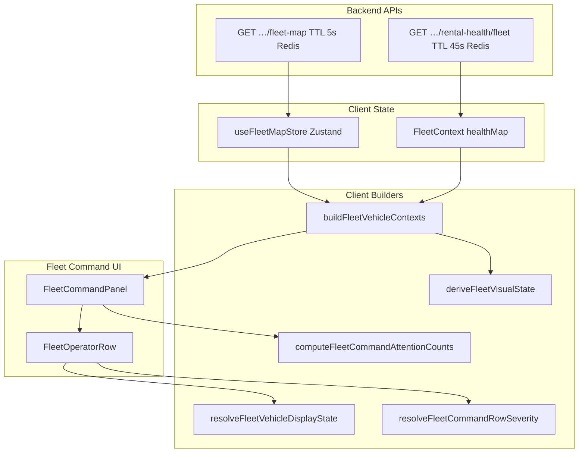

# Vehicle Warnings — Fleet Command UI Audit (Prompt 17/26)

| Feld | Wert |
|------|------|
| **Audit-ID** | `vehicle-warnings-production-readiness-2026-07` |
| **Prompt** | **17 von 26** — Fleet Command Ansicht, Vehicle-Warnmeldungen |
| **Erstellt (UTC)** | 2026-07-25 |
| **Basis-Commit** | `1d0f2caebe56aa1ecd23295aa33d20e953daa95d` |
| **Vorgänger** | [`15-api-contract-consistency.md`](./15-api-contract-consistency.md) |
| **Modus** | **Analyse only** — keine Codeänderungen, keine Remediation |
| **Produktionsdaten verändert** | **Nein** |

**Referenz-Dokumente:**

- [`14-runtime-readiness-builder-audit.md`](./14-runtime-readiness-builder-audit.md) — Runtime Builder, parallele Ableitungen
- [`15-api-contract-consistency.md`](./15-api-contract-consistency.md) — API-Contracts, Count-Semantik
- [`13-severity-readiness-policy-audit.md`](./13-severity-readiness-policy-audit.md) — Warning ≠ Block Policy

**Bekannte Symptome (User-Report):**

- Header: „4 Critical“, „1 Warning“
- Karten zeigen überwiegend Chip „Warnung“
- Tab „Avail.“ enthält Offline- und Prüffahrzeuge
- Counts vermischen möglicherweise Fahrzeuge, Findings und Ereignisse

---

## 1. Executive Summary

Die **Fleet Command**-Ansicht ist die rechte Fahrzeugliste auf der **Fleet Page** (`FleetView.tsx`), gerendert durch `FleetCommandPanel` + `FleetOperatorRow`. Sie hat **keinen eigenen Backend-Endpoint** — alle Daten kommen aus Client-Komposition von Fleet Map + Rental Health.

| Thema | Urteil |
|-------|--------|
| Aktiver Renderpfad | `FleetView` → `FleetCommandPanel` (ohne `dashboardRuntime`) |
| `FleetCommandView` | Existiert, wird **nirgends importiert** (Dashboard-Integration entfernt) |
| Query Hook | **Kein** TanStack React Query — Zustand `useFleetMapStore` + `FleetContext` |
| „Critical“ im Header | **Pro Fahrzeug** (`resolveFleetCommandRowSeverity === 'critical'`) auf Fleet Page |
| Header vs. Karten | **Bewusst unterschiedlich** — Header = Row-Severity; Karten = getrennte Health- + Status-Chips |
| „Avail.“-Tab | **Kommerziell verfügbar** (`operationalStatus === AVAILABLE`), **nicht** mietbereit |
| Offline in Available | **Ja, by design** — Tab folgt Commercial Status, nicht Telemetry/Readiness |
| Stationfilter | Client-seitig auf `fleet-map`; Rental Health org-weit in `healthMap` |
| i18n Fleet Command Shell | **Englisch hardcoded** (Tabs, Header-Chips); Row-Labels über `useLanguage` |
| React-Query-Stale | **N/A** — aber Zustand-Poll 30s + Health-Cache 45s möglich |

**Kernursache der Symptome:** Fleet Command mischt **drei unabhängige Semantikebenen** in einer UI:

1. **Header-Chips** — Fahrzeug-Zähler nach `resolveFleetCommandRowSeverity` (inkl. Offline = critical)
2. **Health-Chip** (Herz) — `resolveHealthDisplay` → „Warnung“ bei `overall_state === 'warning'` oder Modul-Warning
3. **Status-Chip** — `resolveOperationalStatusBadge` → „Verfügbar“ bei Commercial Available

Ein Fahrzeug kann Header-**Critical** (Offline ≥48h), Health-**Warnung** (Modul) und Status-**Verfügbar** gleichzeitig zeigen.

---

## 2. Architektur & Datenfluss



### 2.1 Komponenten-Hierarchie

| Komponente | Datei | Rolle |
|----------|-------|-------|
| `FleetView` | `components/FleetView.tsx` | Fleet Page — Map + Command Panel |
| `FleetCommandPanel` | `fleet-operator/FleetCommandPanel.tsx` | Tabs, Suche, Header-Chips, Liste |
| `FleetOperatorRow` | `fleet-operator/FleetOperatorRow.tsx` | Einzelkarte |
| `FleetCommandView` | `fleet-operator/FleetCommandView.tsx` | Wrapper mit `dashboardRuntime` — **unbenutzt** |
| Builder | `lib/fleet-operator-panel.ts` | Contexts, Severity, Counts, Sort |
| Filter | `lib/fleet-command-filters.ts` | Tab-Buckets |
| Display | `lib/fleetVehicleDisplay.ts` | Chips, Telemetry, Reason Badge |
| Visual | `lib/fleetVisualState.ts` | `deriveFleetVisualState` |

---

## 3. Datenquelle

| Input | Quelle | Refresh |
|-------|--------|---------|
| `VehicleData[]` | `useFleetMapStore` ← `GET …/fleet-map` | Auto 30s (`FLEET_MAP_REFRESH_MS`), manuell Refresh |
| `VehicleHealthResponse` | `FleetContext.healthMap` ← `GET …/rental-health/fleet` (paginiert) | `reloadHealth()` bei Invalidation |
| `operationalState` / `bookingContext` | Embedded in fleet-map payload | Mit fleet-map |
| Runtime (optional) | `dashboardRuntime` via `FleetCommandView` | **Nicht aktiv** auf Fleet Page |

**Kein dedizierter Fleet-Command-API-Call.**

---

## 4. Query Hook & Cache

### 4.1 Kein React Query

Fleet Command nutzt **keinen** `useQuery`. Stattdessen:

| Mechanismus | Details |
|-------------|---------|
| **Zustand Store** | `useFleetMapStore.fetchFleetMap(orgId)` |
| **FleetContext** | `useFleetHealthMap(orgId)` — `useState` + `useEffect` Pagination |
| **Invalidation Registry** | `vehicleOperationalQueryKeys.fleetMap` / `fleetHealth` — Handler in `FleetContext` registriert |
| **Optimistic UI** | `useFleetMapStore.applyOptimisticOperationalPatches` bei Handover/Booking via `invalidateVehicleOperationalState` |

### 4.2 Cache Keys (Invalidation only)

| Key | Handler | Invalidiert bei |
|-----|---------|-----------------|
| `['vehicle-operational', orgId, 'fleet-map']` | `fetchFleetMap` | Booking, Handover, Status-Patch |
| `['vehicle-operational', orgId, 'fleet-health']` | `reloadHealth` | Tire/Brake Review, Booking |
| `dashboardRuntime` | Clock bump in Dashboard VM | **Nur Dashboard** — Fleet Page nicht |

### 4.3 Server vs. Client Cache

| Schicht | TTL | Fleet Command Impact |
|---------|-----|---------------------|
| Backend fleet-map Redis | ~5s | Stale operational/booking bis 5s |
| Backend rental-health Redis | 45s | Stale health badges/counts bis 45s |
| Client fleet-map poll | 30s | Max 30s ohne Refetch bei inaktivem Tab |
| Client `useMemo` contexts | 0 | Rebuild bei `vehicles`/`healthMap` Änderung |

---

## 5. Filter & Stationfilter

### 5.1 Filter-Pipeline (FleetView)

```
vehicles (Zustand)
  → filterFleetByStation(stationId)     // Client
  → buildFleetVehicleContexts           // + healthMap lookup
  → filterFleetBySearch(query)          // Client
  → FleetCommandPanel.contexts
      → Header counts: ALLE contexts (nur Search-Filter)
      → Tab counts: ALLE contexts
      → Visible rows: applyFleetCommandFilters(tab, futureBooking)
```

### 5.2 Stationfilter

| Aspekt | Verhalten |
|--------|-----------|
| **Wo** | `FleetView` — Dropdown aus `buildStationFilterOptions` |
| **Filterung** | `filterFleetByStation` auf fleet-map Fahrzeuge (**client-seitig**) |
| **Rental Health** | Org-weit geladen; Lookup per `vehicleId` — **kein** Server-`stationId` auf fleet-map |
| **Station-Option Counts** | `ready` / `attention` aus `deriveFleetVisualState.isReady` / `isFleetAttentionVehicle` — **eigene Semantik** |
| **Konsistenz** | Stationfilter schränkt Liste ein; Header-Counts beziehen sich auf **gefilterte** Fahrzeugmenge (nach Station + Search) |

### 5.3 Availability Tabs

| Tab | Key | Zuordnung (`resolveFleetCommandTabForVehicle`) |
|-----|-----|------------------------------------------------|
| All | `All` | Alle |
| **Avail.** | `Available` | `selectIsCurrentlyAvailable` / `AVAILABLE` |
| Res. | `Reserved` | `RESERVED` |
| Active | `Active` | `ACTIVE_RENTED` |
| Maint. | `Maintenance` | `MAINTENANCE` oder `BLOCKED` |
| Unk. | `Unknown` | `UNKNOWN` |

**Wichtig:** Offline-, Health-Warning- und Not-Ready-Fahrzeuge bleiben im **Available**-Tab, solange Commercial Status `AVAILABLE` ist (Test: `fleet-operator-panel.test.ts` „offline available vehicles stay in Available tab“).

### 5.4 Zusatzfilter

- **Search:** Plate, Make, Model (nicht Kunde, nicht Station)
- **„With future booking“:** Overlay — schränkt Tab-Counts und sichtbare Liste ein

---

## 6. Count-Berechnung

### 6.1 Header-Chips („X Critical“, „Y Warning“)

**Aktiver Pfad (Fleet Page — ohne `dashboardRuntime`):**

```typescript
computeFleetCommandAttentionCounts(contexts, severityOptions)
```

| Chip | Semantik | Einheit |
|------|----------|---------|
| **Critical** | Fahrzeuge mit `resolveFleetCommandRowSeverity(ctx) === 'critical'` | **Pro Fahrzeug** |
| **Warning** | Fahrzeuge mit `severity === 'warning'` | **Pro Fahrzeug** |

**`resolveFleetCommandRowSeverity` — Critical wenn (Auszug):**

- `rental_blocked === true`
- `overall_state === 'critical'`
- `visual.attentionLevel === 'critical'`
- `visual.isBlocked` / hard blocking reasons
- `healthStatus === 'Critical'`
- `activeIsOverdue`
- Modul `critical` (inkl. `error_codes`)
- **`visual.isOffline` (≥48h)**

**Warning wenn (Auszug):**

- `overall_state === 'warning'`
- `healthStatus === 'Warning'`
- Modul `warning`
- **`visual.isStale` (soft-offline 24–48h)**
- `maintenanceUrgency` planned/urgent
- **Kein GPS** (`!visual.hasLocation`)

**Alternativer Pfad (`FleetCommandView` + `dashboardRuntime` — derzeit unbenutzt):**

| Chip | Quelle |
|------|--------|
| Critical | `runtime.slices['critical-alerts'].count` (deduped rows, **≠** identisch zu Row-Severity) |
| Warning | `vehicleStates.filter(s => s.isWarning && !s.isCritical && !s.isBlocked).length` |

### 6.2 Tab-Badge-Counts

**Fleet Page:** `computeCommandTabCounts(contexts)` — Fahrzeuge pro Commercial-Tab.

**Mit `canonicalTabCounts`:** `resolveFleetTabCountsFromRuntime` — aus `dashboardRuntime.operationalStatus` (nur wenn `FleetCommandView` genutzt).

### 6.3 Vermischungs-Risiko

| Zähler | Zählt | Findings? | Ereignisse? |
|--------|-------|-----------|-------------|
| Header Critical/Warning | **Fahrzeuge** | Nein (aber 1 Fahrzeug kann mehrere Gründe haben) | Nein |
| Tab Badges | **Fahrzeuge** | Nein | Nein |
| `reasonBadge` auf Karte | **1** Reason (höchste Priorität) | Ja (1 Modul-Reason) | Nein |
| Health-Chip | **1** Aggregat-Label | Modul-aggregiert | Nein |

**Symptom „4 Critical“ bei vielen „Warnung“-Chips:** Header zählt **Row-Severity** (Offline = Critical); Health-Chip zeigt **Warnung** wenn `overall_state === 'warning'` ohne dass Row-Severity warning ist — oder umgekehrt Row critical bei Health warning only (Offline).

---

## 7. Kartenstatus, Badges, Farben

### 7.1 Drei visuelle Ebenen pro Karte

| Ebene | Quelle | Beispiel |
|-------|--------|----------|
| **Row-Hintergrund** | `fleetCommandRowSurfaceClass(commandSeverity)` | Critical = roter Gradient, Warning = gelb |
| **Health-Chip** (Herz) | `resolveHealthDisplay` | „Warnung“, „Kritisch“, „Gut“ |
| **Status-Chip** | `resolveOperationalStatusBadge` | „Verfügbar“, „Reserviert“, „Aktiv“ |

`commandSeverity` kommt von `resolveFleetCommandRowSeverity` — **nicht** identisch mit Health-Chip-Text.

### 7.2 Badge Mapping (Health)

| Bedingung | Label DE | Tone |
|-----------|----------|------|
| `isHealthCritical` oder Service critical | Kritisch | `critical` |
| `isHealthWarning` oder Service warning | **Warnung** | `warning` |
| Daten vorhanden | Gut | `success` |
| Keine Daten | Unbekannt | `neutral` |

`isHealthWarning`: `overall_state === 'warning'` **oder** legacy `healthStatus === 'Warning'`.

### 7.3 Badge Mapping (Commercial Status)

Unabhängig von Health — `formatVehicleOperationalStatusLabel`:

| Operational Status | Label DE |
|--------------------|----------|
| AVAILABLE | **Verfügbar** |
| RESERVED | Reserviert |
| ACTIVE_RENTED | Aktiv |
| MAINTENANCE | Wartung |
| UNKNOWN | Unbekannt |

**Design-Intent** (`fleetVehicleDisplay.ts`): Health Warning blockiert **nicht** das „Verfügbar“-Label.

### 7.4 Reason Chip (Line 4)

`buildReasonBadge` — **max. 1** Chip, Priorität:

1. `blocking_reasons[0]`
2. Modul-Reason (critical vor warning)
3. Overdue pickup/return
4. `visual.reason` (nicht Telemetry)
5. Fallback „Health prüfen“

**Offline-Dauer** erscheint in **`telemetryLabel`** (Line 3), nicht zwingend im Reason-Chip.

### 7.5 Farben

| Element | CSS |
|---------|-----|
| Critical chip/row | `var(--status-critical)` |
| Warning/watch | `var(--status-watch)` |
| Tab badge success | `sq-tone-success` (Avail.) |
| Selected row | Brand ring |

---

## 8. Übersetzungen

| UI-Teil | i18n |
|---------|------|
| `FleetCommandPanel` Tabs | **Hardcoded EN** („Available“, „Maint./Blocked“, „With future booking“) |
| Header Chips | **Hardcoded EN** („4 Critical“, „1 Warning“, „No attention“) |
| `FleetOperatorRow` Display | **`useLanguage`** → DE/EN für Chips, Telemetry, Reasons |
| Search Placeholder | EN („Plate, make, model…“) |
| Empty States | EN (`fleetCommandTabEmptyMessage`) |

**Fleet Page Locale:** `FleetOperatorRow` nutzt `useLanguage()`; Panel-Chrome bleibt Englisch.

---

## 9. Mobile & Truncation

| Element | Mobile-Verhalten | Risiko |
|---------|------------------|--------|
| Tabs | `shortLabel` („Avail.“) + horizontal scroll | OK |
| Header chips | `flex-wrap` | Kann umbrechen |
| Plate + Model | `truncate` auf Model | OK |
| Location | `truncate` + `title` tooltip | Adresse gekürzt |
| Telemetry | `truncate` + `title` | **Offline-Dauer kann abgeschnitten werden** |
| Reason chip | `max-w-full truncate` + `title` | **Nur 1 Reason sichtbar**; Rest nur Tooltip |
| Health + Status chips | `text-[9.5px]` | Lesbar, aber klein |

**Sicherheitsrelevante Info:** Blocking-Reason primär in Reason-Chip oder Tooltip — bei Truncation **nicht vollständig sichtbar** ohne Hover/Long-press.

---

## 10. Navigation, Refresh, Fehler

### 10.1 Navigation

| Aktion | Ziel |
|--------|------|
| Row click | `onVehicleSelect` → Vehicle Detail (`FleetView`) |
| Open button | Gleich |
| Map ↔ List sync | `focusFleetVehicle`, Tab-Wechsel zu `resolveOperatorTabForVehicle` |
| Hidden selection | Banner „hidden by filter“ + Show/Clear |

### 10.2 Refresh

| Trigger | Effekt |
|---------|--------|
| Map HUD Refresh | `fetchFleetMap` + implizit Fleet Context |
| 30s Interval | `fetchFleetMap` wenn Tab visible |
| Invalidation | `invalidateVehicleOperationalState` → fleet-map + health reload |
| Optimistic | Operational status patches bis Commit/Rollback |

`FleetCommandPanel` empfängt `onRefresh`/`refreshing` — **rendert sie nicht** (Props mit `_` prefix ignoriert).

### 10.3 Fehlerzustände

| Fehler | UI |
|--------|-----|
| fleet-map fetch fail | Banner oben in `FleetView`: „Fleet data could not be loaded“ |
| health fetch fail | `healthError` in Context — **nicht** in Fleet Command angezeigt; `health: null` → „Unbekannt“ |
| Leere Liste | Tab-spezifische Empty Message |
| Loading | `SkeletonCard` × 3 |

---

## 11. Server- vs. Client-Ableitung

| Feld | Server (API) | Client-Neuberechnung |
|------|--------------|----------------------|
| Commercial Status | `operationalState.status` in fleet-map | Tab-Zuordnung via `selectOperationalStatus` |
| Health overall | `rental-health` `overall_state` | `resolveHealthDisplay`, Row Severity |
| Rental blocked | `rental_blocked` | Row Severity critical |
| Telemetry freshness | `lastSeenAt`, `telemetryFreshness` | **`resolveTelemetryFreshness`** (eigene Labels/Schwellen) |
| Visual blocked/ready | — | **`deriveFleetVisualState`** |
| Header Critical count | — | **`computeFleetCommandAttentionCounts`** |
| Ready to rent | — | **Nicht** in Fleet Command Tabs |

**Fleet Command ist überwiegend client-abgeleitet** aus zwei API-Wahrheiten (fleet-map + rental-health).

---

## 12. Pflichtfragen (10/10)

### 12.1 Was zählt „Critical“ genau?

**Auf der Fleet Page (aktiver Pfad):** Anzahl **Fahrzeuge** in der aktuellen Context-Liste (Station + Search gefiltert), für die `resolveFleetCommandRowSeverity` den Wert `'critical'` liefert.

Das umfasst u.a. `rental_blocked`, `overall_state === 'critical'`, hard blockers, aktive Modul-Critical-States, **Offline ≥48h**, Return overdue — **nicht** die Anzahl einzelner Findings oder Notifications.

**Wenn `dashboardRuntime` angebunden wäre:** Critical = `critical-alerts` Slice `count` (= deduped Fahrzeug-Zeilen mit kritischen Runtime-Reasons) — **abweichende Definition**.

### 12.2 Warum stimmen Header und Karten nicht überein?

**Drei getrennte Systeme:**

| Header | Karten |
|--------|--------|
| Row-Severity (`commandSeverity`) | Health-Chip (`resolveHealthDisplay`) |
| Zählt Fahrzeuge | Zeigt pro Fahrzeug 2 Chips + optional 1 Reason |
| Offline → Critical | Health kann trotzdem „Warnung“ zeigen |
| — | Status-Chip „Verfügbar“ unabhängig von Health |

Beispiel: Fahrzeug commercial **Available**, `overall_state: warning`, offline ≥48h:

- Header: **Critical** (offline)
- Health-Chip: **Warnung**
- Status-Chip: **Verfügbar**
- Row-Tint: Critical-Hintergrund

### 12.3 Werden unsichtbare Fahrzeuge mitgezählt?

| Zähler | Tab-gefiltert? | Search-gefiltert? | Station-gefiltert? |
|--------|----------------|-------------------|-------------------|
| Header Critical/Warning | **Nein** | **Ja** | **Ja** |
| Tab Badge Counts | Nein (alle Tabs gleichzeitig) | Ja | Ja |
| Sichtbare Karten | **Ja** | Ja | Ja |

Fahrzeuge in anderen Tabs **werden in Header-Counts mitgezählt**. Nur Tab-Filter selbst schließt sie von der Liste aus, nicht von den Attention-Chips.

### 12.4 Sind Stationfilter konsistent?

**Teilweise.**

- Fleet-Liste und Counts: konsistent station-gefiltert (client)
- `healthMap`: org-weit — korrektes Lookup, aber Stationfilter auf Health-API nicht gespiegelt
- Station-Dropdown `attention`/`ready` Counts: eigene Logik (`isFleetAttentionVehicle` / `visual.isReady`) — **kann von Fleet-Command-Chips abweichen**

### 12.5 Zählt der „Avail.“-Tab kommerziell verfügbar oder mietbereit?

**Kommerziell verfügbar** (`VEHICLE_OPERATIONAL_STATUS.AVAILABLE` / `selectIsCurrentlyAvailable`).

**Nicht** `isReadyToRent` / Runtime „ready-now“. Offline-, Health-Warning- und Not-Ready-Fahrzeuge erscheinen bewusst in Available (Tests bestätigt).

### 12.6 Wird „Verfügbar“ zu prominent dargestellt, wenn Not Ready vorliegt?

**Ja, potenziell irreführend.**

- Status-Chip zeigt **„Verfügbar“** solange Commercial Available
- „Nicht bereit“ erscheint **nicht** als Status-Chip in Fleet Command
- Hinweise: Telemetry-Zeile (Offline · Xh), Reason-Chip, Health „Warnung“, Row-Tint
- `resolveRentalDisplay` kennt `not_ready`, wird aber **nicht** als zweiter Chip gerendert — nur indirekt über Telemetry/Reason

### 12.7 Werden Offline-Dauer und Warnursache vollständig angezeigt?

| Info | Wo | Vollständig? |
|------|-----|--------------|
| Offline-Dauer | `telemetryLabel` („Offline · 2d“) | **Ja**, mit `title` Tooltip — aber **truncate** auf Mobile |
| Modul-Warnung | Health-Chip + ggf. Reason-Chip | **Ein** Modul-Reason (höchste Priorität) |
| Blocking reasons | Reason-Chip | Erster blocking reason only |
| Mehrere Findings | — | **Nein** — kein Count, kein „+N“ |

`buildReasonBadge` filtert Telemetry-Reasons aus dem Chip (`isTelemetryReason`) — Offline nur in Telemetry-Zeile.

### 12.8 Werden Statuswerte im Frontend neu berechnet?

**Ja, umfangreich:**

- `deriveFleetVisualState`
- `resolveFleetCommandRowSeverity`
- `resolveFleetVehicleDisplayState`
- `resolveTelemetryFreshness`
- `computeFleetCommandAttentionCounts`

Backend liefert Rohdaten; Fleet Command **projiziert** Severity, Chips und Counts client-seitig.

### 12.9 Können veraltete React-Query-Daten erscheinen?

**React Query wird nicht verwendet.**

Stattdessen:

- fleet-map: bis **30s** Client-Poll + **5s** Server-Redis
- rental-health: bis **45s** Server-Redis, kein Auto-Poll auf Fleet Page
- Nach Mutation: optimistic patches möglich bis Refetch

**Stale Health bei frischem Fleet-Map ist möglich** (unterschiedliche TTLs).

### 12.10 Gibt es mobile Layoutfehler oder abgeschnittene Sicherheitsinformationen?

| Issue | Schwere |
|-------|---------|
| Telemetry/Reason `truncate` | Mittel — Dauer/Ursache nur via Tooltip |
| Nur 1 Reason-Chip | Mittel — multiple Findings unsichtbar |
| EN Panel + DE Row Mix | Niedrig — UX-Inkonsistenz |
| Kleine Chips 9.5px | Niedrig |
| Kein expliziter Health-Error State | Mittel — silent degrade zu „Unbekannt“ |

Kein dedizierter „Layout-Bug“ im Code — Truncation ist **absichtlich** (`truncate`, `max-w-full`).

---

## 13. Symptom-Mapping (User-Report)

| Symptom | Erklärung im Code |
|---------|-------------------|
| „4 Critical“ | 4 Fahrzeuge mit `resolveFleetCommandRowSeverity === 'critical'` (oft Offline + blocked + health critical) |
| „1 Warning“ | 1 Fahrzeug mit severity `warning` (z.B. `overall_state warning`, stale signal, no GPS) |
| Karten „Warnung“ | Health-Chip `resolveHealthDisplay` — **unabhängig** von Header-Critical |
| Avail. mit Offline/Prüf | Tab = Commercial Available; Tests explizit für Offline-in-Available |
| Counts vermischen | Header = Fahrzeuge; Reason = 1 Finding; keine Event-Counts — aber **mehrere Severity-Systeme** erzeugen scheinbare Inkonsistenz |

---

## 14. Test-Abdeckung

| Datei | Relevanz |
|-------|----------|
| `fleet-operator-panel.test.ts` | Tab-Buckets, Offline-in-Available, Severity, Sort, Attention |
| `fleet-command-filters.test.ts` | Tab-Filter, future booking |
| `FleetCommandPanel.test.tsx` | Tab-Rendering |
| `fleetVehicleDisplay.test.ts` | Chip-Labels |
| `runtimeSliceConsistency.test.ts` | `resolveFleetTabCountsFromRuntime` |
| `resolveCanonicalFleetAlertCounts` test | Critical = critical-alerts slice (nur mit Runtime) |

**Lücke:** Kein Integrationstest Header-Chips vs. Health-Chip-Text auf derselben Karte.

---

## 15. Risiko-Register

| ID | Risiko | Schwere |
|----|--------|---------|
| **FCMD-W01** | Header Critical (Offline) vs. Health-Chip „Warnung“ | Hoch |
| **FCMD-W02** | `FleetCommandView`/Runtime-Pfad unbenutzt — Fleet Page ohne canonical alignment | Hoch |
| **FCMD-W03** | Available-Tab ≠ Ready — Offline/Warning sichtbar unter „Avail.“ | Hoch |
| **FCMD-W04** | Health stale 45s vs. fleet-map 30s | Mittel |
| **FCMD-W05** | Header zählt alle Tabs — nicht nur sichtbare | Mittel (by design) |
| **FCMD-W06** | Nur 1 Reason-Chip — multiple Findings hidden | Mittel |
| **FCMD-W07** | Panel EN / Row DE | Niedrig |
| **FCMD-W08** | healthError silent — „Unbekannt“ ohne Erklärung | Mittel |
| **FCMD-W09** | Station dropdown counts ≠ Fleet Command chips | Niedrig |
| **FCMD-W10** | Mobile truncate auf Safety copy | Mittel |

---

## 16. Querbezüge

| Audit | Bezug |
|-------|-------|
| Prompt 16 (`15-api-contract-consistency.md`) | fleet-map + rental-health APIs |
| Prompt 15 (`14-runtime-readiness-builder-audit.md`) | Runtime vs. Fleet Visual Divergenz |
| Prompt 14 (`13-severity-readiness-policy-audit.md`) | Warning ≠ Block, Available ≠ Ready |

---

## 17. Fazit

Fleet Command ist eine **client-seitige Projektion** ohne eigenen API-Contract. Die bekannten Symptome (**4 Critical / 1 Warning** vs. überwiegend **Warnung**-Chips, **Avail.** mit Offline/Prüffällen) sind **architektonisch erklärbar** durch:

1. **Getrennte Zähler** (Row-Severity) vs. **getrennte Chips** (Health vs. Commercial)
2. **Available-Tab = Commercial**, nicht Rental-Ready
3. **Offline = Header-Critical**, aber Health kann „Warnung“ bleiben
4. **Fleet Page ohne `dashboardRuntime`** — alternativer Canonical-Pfad existiert (`FleetCommandView`), wird aber nicht gerendert

**Changes / Architektur:** nicht aktualisiert (Audit-only).
