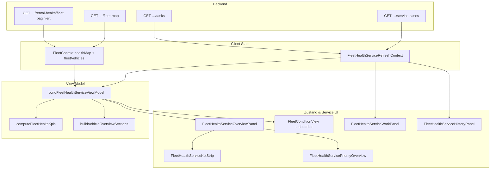

# Vehicle Warnings — Zustand & Service UI Audit (Prompt 18/26)

| Feld | Wert |
|------|------|
| **Audit-ID** | `vehicle-warnings-production-readiness-2026-07` |
| **Prompt** | **18 von 26** — Fleet → Zustand & Service als Warnungs- und Arbeitszentrale |
| **Erstellt (UTC)** | 2026-07-25 |
| **Basis-Commit** | `1d0f2caebe56aa1ecd23295aa33d20e953daa95d` |
| **Vorgänger** | [`16-fleet-command-ui-audit.md`](./16-fleet-command-ui-audit.md) |
| **Modus** | **Analyse only** — keine Codeänderungen, keine Remediation |
| **Produktionsdaten verändert** | **Nein** |

**Referenz-Dokumente:**

- [`14-runtime-readiness-builder-audit.md`](./14-runtime-readiness-builder-audit.md) — parallele Runtime-Ableitungen
- [`15-api-contract-consistency.md`](./15-api-contract-consistency.md) — API-Contracts, Count-Semantik
- [`16-fleet-command-ui-audit.md`](./16-fleet-command-ui-audit.md) — Fleet Command (Nachbar-Surface)
- [`frontend/src/rental/components/fleet-health-service/FLEET_HEALTH_SERVICE_CONTRACT.md`](../../../frontend/src/rental/components/fleet-health-service/FLEET_HEALTH_SERVICE_CONTRACT.md) — fachlicher Contract

**Bekannte Symptome (User-Report):**

- KPI „Technisch unauffällig“ zeigt **1**
- Priorisierte Übersicht zeigt „Technisch unauffällig **2**“ (Zeilen-Badges oder Gruppenzähler)
- KPI „Technisch prüfen“ zeigt **4**
- Datenaktualität enthält sehr alte Module
- Kennzahlen können nicht denselben Filter verwenden

---

## 1. Executive Summary

**Fleet → Zustand & Service** (`FleetHealthServiceView`) ist die operative Warnungs- und Arbeitszentrale. Sie kombiniert Rental Health V1 (`healthMap`) mit Tasks, Servicefällen und Vendors — ohne eine einzige gemeinsame UI-Projektion.

| Thema | Urteil |
|-------|--------|
| Architektur | Vier Primärbereiche (Übersicht, Fahrzeuge, Arbeiten, Historie) über einen View-Model-Builder |
| Health-Wahrheit | `FleetContext.healthMap` ← `GET …/rental-health/fleet` (paginiert, org-scoped, Redis ~45s) |
| Service-Wahrheit | `FleetHealthServiceRefreshContext` → Tasks, Vendors, Service Cases |
| KPI-Strip | `computeFleetHealthKpis` — **Fahrzeug-Bänder**, disjunkt über `healthSeverityBand` |
| Priorisierte Übersicht | `buildVehicleOverviewSections` — **Fahrzeugzeilen** mit Health + Arbeit, andere Sektionslogik |
| Fahrzeuge-Tab | `FleetConditionView` — Gruppierung via `operatorGroupForVehicle`, eigene Filter |
| Count-Konsistenz | **Nicht garantiert** zwischen KPI, Prioritätssektionen und Fahrzeuge-Gruppen |
| Filter-Konsistenz | KPI/Übersicht = volle `fleetVehicles`; Fahrzeuge-Tab zusätzlich `stationId`, `blockingVehicleIds`, Statusfilter |
| Freshness | `healthFetchedAt` (Fetch) ≠ `oldestRelevantHealthSourceAt` (Messung) — alte Module sichtbar |
| Findings vs. Fahrzeuge | KPI zählt Fahrzeuge; Zeilen zeigen Finding-Anzahl als Meta, nicht als KPI |
| Aktive Vermietungen | **Nicht** in KPI/Priorisierung einbezogen |
| i18n | KPI-Strip-Builder hardcoded DE; Overview nutzt `useLanguage` |
| Mobile / Overflow | Touch-Targets ≥44px; `truncate`/`line-clamp-2` an mehreren Stellen |

**Kernursache der Symptome:** Die Oberfläche mischt **drei Ableitungsebenen** mit unterschiedlicher Inclusion-Logik:

1. **KPI-Bänder** — disjunkte `healthSeverityBand`-Zählung über alle Flottenfahrzeuge
2. **Prioritätssektionen** — nur Fahrzeuge mit Health-Signal **oder** offener Arbeit; Sektion ≠ KPI-Band
3. **Fahrzeuge-Gruppen** — `operatorGroupForVehicle` + optionale Nav-Filter (`fhsSt`, `fhsVf`, …)

Ein gesundes Fahrzeug mit überfälliger Aufgabe erscheint in der Prioritätsliste mit Badge „Technisch unauffällig“ (Band `good`), zählt im KPI „Technisch unauffällig“, landet aber in Sektion **„Heute erledigen“** — nicht in einem „unauffällig“-Bucket.

---

## 2. Architektur & Datenfluss



### 2.1 Komponenten-Hierarchie

| Komponente | Datei | Rolle |
|------------|-------|-------|
| `FleetHubView` | `FleetHubView.tsx` | Top-Tab **Zustand & Service** |
| `FleetHealthServiceView` | `FleetHealthServiceView.tsx` | Tab-Router (Übersicht / Fahrzeuge / Arbeiten / Historie) |
| `useFleetHealthServiceViewModel` | `useFleetHealthServiceViewModel.ts` | Read-Model-Hook |
| `buildFleetHealthServiceViewModel` | `fleet-health-service.view-model.ts` | Zentrale Aggregation |
| `FleetHealthServiceOverviewPanel` | `FleetHealthServiceOverviewPanel.tsx` | KPI + Prioritätsliste + Freshness |
| `FleetHealthServiceKpiStrip` | `FleetHealthServiceKpiStrip.tsx` | 2×4 KPI-Karten (Health + Execution) |
| `FleetHealthServicePriorityOverview` | `FleetHealthServicePriorityOverview.tsx` | Fünf kollabierbare Prioritätssektionen |
| `FleetConditionView` | `FleetConditionView.tsx` | Fahrzeuge-Tab (`hideKpiStrip`, `uiLocale=de`) |
| `fleet-health-control-center.ts` | `lib/fleet-health-control-center.ts` | Bänder, KPIs, Filter, Display |

---

## 3. KPI-Queries & Count-Aggregation

### 3.1 Health-KPIs (`computeFleetHealthKpis`)

Quelle: `fleet-health-control-center.ts` — Input: `vehicleIds` aus `fleetVehicles`, Lookup in `healthMap`.

| KPI-Label (DE) | Feld | Semantik |
|----------------|------|----------|
| Technisch blockiert | `blocked` | `rental_blocked` bestätigt |
| Technisch prüfen | `needsReview` | Band `review` (`overall_state === 'warning'`, nicht blockiert, nicht pipeline-degraded) |
| Nicht bewertbar | `limited` | Band `limited` **oder** `unevaluable` (inkl. fehlendem Health-Eintrag) |
| Technisch unauffällig | `healthy` | Band `good` (`overall_state === 'good'`, evaluierbar) |

Zusätzliche interne Felder: `actionRequired` (blocked + critical), `warning` (raw `overall_state`), `unevaluable`, `naModuleVehicles`.

**Disjunkte Bänder:** `healthSeverityBand` liefert genau ein Band pro Fahrzeug. `healthy` schließt `unevaluable` explizit aus (Tests in `fleet-health-control-center.test.ts`).

### 3.2 Execution-KPIs

Quelle: `buildExecutionGroups` in `fleet-health-service.view-model.ts` — zählt **Tasks** (nicht Fahrzeuge):

| KPI | Quelle |
|-----|--------|
| Überfällig | `overdueServiceTasks.length` |
| Heute fällig | `dueTodayServiceTasks` (Schedule-Bucket `today`, nicht overdue) |
| In Bearbeitung | `status === 'IN_PROGRESS'` |
| Wartet Partner | `WAITING` + `vendorId` |

### 3.3 Null-Darstellung („—“)

`FleetHealthServiceKpiStrip.tsx`:

- `healthValue()` → `null` bei `healthError` **oder** `healthLoading`
- `executionValue()` → `null` bei `serviceError` **oder** `serviceLoading`

UI rendert `null` als **„—“** (`formatKpiValue`). Bewusst kein `0` bei Fehler (Tests: `fleet-health-service.kpi.test.ts`).

### 3.4 KPI-Navigation

Klick auf Health-KPI → `tab: 'vehicles'`, `vehicleStatusFilter` gesetzt (`blocked` / `review` / `limited` / `good`).

Klick auf Execution-KPI → `tab: 'work'`, `taskFilter` + `workSection`.

**KPI selbst wird dabei nicht gefiltert** — bleibt Flotten-Gesamtzahl.

---

## 4. Priorisierte Übersicht

### 4.1 Sektionen (`buildVehicleOverviewSections`)

| Sektion (DE) | Key | Eintrittslogik (vereinfacht) |
|--------------|-----|------------------------------|
| Technisch blockiert | `technically_blocked` | `rental_blocked` / Band `blocked` |
| Heute erledigen | `handle_today` | Überfällig / IN_PROGRESS / Vendor-WAITING / fällig heute / `action_required` |
| Technisch prüfen | `technical_review` | `needs_review` / Band `review` |
| Daten unvollständig | `incomplete_data` | `limited_data` / Band `limited` |
| Bald fällig | `due_soon` | `isDueSoonTask` |

**Exclusion:** `classifyVehicleSection` gibt `null` zurück, wenn weder Health-Signal noch offene Arbeit — **rein unauffällige Fahrzeuge erscheinen nicht**.

Health-Signal-Definition:

```typescript
const hasHealthSignal =
  display.band !== 'good' || display.rentalBlocked || listFleetHealthIssueChips(health).length > 0;
```

→ Fahrzeug mit `overall_state: good` aber operativem Modul-Chip (critical/warning) erscheint trotzdem.

### 4.2 Zeilen-Badge vs. KPI

`primaryStatusFromDisplay` mappt Band → Label:

| Band | Badge |
|------|-------|
| `good` | **Technisch unauffällig** |
| `review` | Technisch prüfen |
| `blocked` / `critical` | Technisch blockiert / Handlungsbedarf |
| `limited` / `unevaluable` | Nicht bewertbar |

**Wichtig:** Badge beschreibt den **Health-Band**, nicht die Sektion. Ein Fahrzeug in „Heute erledigen“ kann Badge „Technisch unauffällig“ tragen (execution-only, Test: `keeps execution-only overdue work visible on healthy vehicles`).

### 4.3 Sortierung

Pro Sektion: `sortRank` aufsteigend, dann `plate.localeCompare('de')`.

`vehicleSortRank` berücksichtigt Blockade, Band, überfällige Tasks, IN_PROGRESS, due-soon — **deterministisch** bei stabilen Inputs.

Zusätzliche Passes: Tasks/Cases für Fahrzeuge außerhalb initialer `uiItems`-Iteration (Zeilen 354–374 in `fleet-health-service-vehicle-overview.ts`).

---

## 5. Fahrzeuge-Tab (`FleetConditionView`)

### 5.1 Gruppen

`groupFleetConditionVehicles` → `operatorGroupForVehicle`:

| Gruppe (DE) | Key | Logik |
|-------------|-----|-------|
| Handlungsbedarf | `action_required` | Blockiert oder `critical` |
| Technisch prüfen | `needs_review` | `overall_state === 'warning'` |
| Nicht bewertbar | `limited_data` | Kein Health / pipeline degraded / `unknown` |
| Technisch unauffällig | `good` | Alles andere evaluierbare `good` |

**Abweichung zu KPI:** `operatorGroupForVehicle` prüft `isHealthPipelineDegraded` **vor** `warning` → degraded Warning landet in `limited_data`, KPI `needsReview` zählt es als `unevaluable`/`limited`, **nicht** als review.

### 5.2 Filter-Pipeline

`filterAndSortFleetConditionVehicles` (`fleet-condition-pipeline.ts`):

- `statusFilter` → `matchesStatusFilter` (Band-basiert, analog KPI-Klick)
- `moduleFilter`, `dataQualityFilter`, `searchQuery`, `sortMode`
- **`stationId`** (Nav `fhsSt`) — zusätzlicher Scope
- **`blockingVehicleIds`** — nur offene rental-blocking Service Cases
- **`initialVehicleId`** — Deep-Link Einzelfahrzeug

KPI-Strip ist im eingebetteten Modus **ausgeblendet** (`hideKpiStrip`); Übersicht-KPIs gelten weiter für die ganze Flotte.

### 5.3 Pagination / Virtualisierung

- Keine serverseitige Pagination in der Fahrzeugliste — client-seitig auf `fleetVehicles`
- Virtualisierung ab 50 Zeilen pro Gruppe (`FLEET_CONDITION_VIRTUALIZE_THRESHOLD`)

---

## 6. Arbeiten & Historie

### 6.1 Arbeiten (`FleetHealthServiceWorkPanel`)

| Sektion | Panel | Daten |
|---------|-------|-------|
| Aufgaben | `FleetHealthServiceTasksPanel` | `vm.allTasks`, Filter aus Nav |
| Servicefälle | `FleetHealthServiceCasesPanel` | `vm.serviceCases` |
| Fälligkeiten | `FleetHealthServiceSchedulePanel` | aktive Tasks, Schedule-Buckets |
| Partner | `FleetHealthServiceVendorsPanel` | Vendors |

Task-Filter aus KPI-Navigation (`overdue`, `due-today`, `in-progress`, `waiting-vendor`) werden via `fleetHealthServiceNavToTaskAdvancedFilters` gemappt.

### 6.2 Historie

`FleetHealthServiceHistoryPanel` → `ServiceHistoryPanel` mit DONE/CANCELLED Tasks. Kein Health-Bezug in der Aggregation.

### 6.3 Task-Zuordnung / Finding-Lifecycle

- Health → Task: `health-task-bridge.utils.ts` (`buildHealthSourceFindingId`, `findDuplicateHealthTask`)
- Prioritätszeile: Findings mit `linkedTaskId` wenn Duplikat erkannt
- `deriveRecommendedAction`: `create_task` | `open_task` | `review_vehicle` | `no_action`
- Service Cases: `blocksRental` → `getBlockingServiceCaseVehicleIds` für Fahrzeuge-Filter `fhsCase=blocking`

**Kein Backend-Finding-Lifecycle in der UI** — Darstellung basiert auf Rental Health Modul-States + offenen Tasks/Cases.

---

## 7. Datenaktualität (Module Freshness)

`buildFleetHealthServiceFreshness` (`fleet-health-service-freshness.ts`):

| Feld | Bedeutung |
|------|-----------|
| `healthFetchedAt` | Zeitpunkt des letzten Client-Fetches |
| `oldestRelevantHealthSourceAt` | **Minimum** von `modules.*.last_updated_at` über alle Flottenfahrzeuge (trackable modules) |
| `staleModuleCount` | Anzahl Module mit `data_stale: true` |
| `partialHealthVehicleCount` / `unavailableHealthVehicleCount` | `availability`-Flags |

**Symptom „sehr alte Module“:** `oldestRelevantHealthSourceAt` zeigt bewusst die älteste Messung der Flotte — kann Jahre alt sein, während „Health geladen vor X Min.“ frisch ist. Das ist **kein Bug**, aber **schlecht interpretierbar** ohne Kontext.

`FleetHealthServiceFreshnessIndicator` zeigt kompakte und Detail-Zeilen (`buildFleetHealthServiceFreshnessDetailRows`).

---

## 8. Stationfilter & Scope

| Surface | `fleetVehicles` (Fleet-Map-Store) | `healthMap` | Zusatzfilter |
|---------|-----------------------------------|-------------|--------------|
| Übersicht KPI | Ja (ggf. Dashboard-Station auf Map) | Org-weit, alle Seiten via `fetchAllFleetRentalHealth` | Keiner |
| Priorisierte Liste | Ja | Lookup pro Fahrzeug | Keiner |
| Fahrzeuge-Tab | Ja | Lookup | `nav.stationId`, `blockingVehicleIds`, Status/Modul/DQ |
| Arbeiten | Tasks org-weit | — | Task-Filter aus Nav |

**Inkonsistenz:** KPI und Prioritätsliste ignorieren `fhsSt`, während der Fahrzeuge-Tab ihn anwendet → Gruppenzähler können von KPI abweichen.

---

## 9. Übersetzungen

| Bereich | Status |
|---------|--------|
| Tab-Bar, Overview-Sektionen, KPI (via OverviewPanel) | `de.ts` / `useLanguage` |
| `buildFleetHealthServiceKpiGroups` Rohlabels | **Hardcoded Deutsch** im Builder; Overview überschreibt via `KPI_LABEL_KEYS` |
| `FleetConditionView` embedded | `uiLocale="de"` — Gruppen `GROUP_CONFIG_DE` |
| `FHS_HEALTH_BADGE_DE` | Kanonische Status-Badges (P57) |
| FleetCondition nicht embedded | Default `uiLocale='en'` (nicht aktiv in Zustand & Service) |

---

## 10. Mobile, Overflow, Accessibility

| Aspekt | Befund |
|--------|--------|
| Touch targets | `fhs.touchTarget`, `min-h-11` auf Buttons |
| KPI-Grid | `grid-cols-2 lg:grid-cols-4` |
| Text clipping | `truncate` auf KPI-Titel/Hint; `line-clamp-2` auf `primaryBlockage` |
| Horizontal overflow | `flex-wrap` auf Badge-Zeilen; Finding-Chips `max-w-full truncate` |
| A11y | `aria-label` auf KPI-Buttons, Collapsible `aria-expanded`, `sr-only` Status-Region, Escape auf Expand |
| Tests | `fleet-health-service.a11y.ui.test.tsx`, E2E `fleet-health-service-flow.spec.ts` |

**Risiko:** Lange `blocking_reasons` / Modul-Reasons in `line-clamp-2` — Volltext nur über Expand/Tooltip (`title` auf FindingChip).

---

## 11. Pflichtfragen (10/10)

### 11.1 Warum ist „Technisch unauffällig“ 1 und 2?

**Kurzantwort:** KPI und Prioritätsliste messen **verschiedene Dinge**; ein direkter Zählervergleich ist nicht vorgesehen.

| Quelle | Was „1“ bzw. „2“ bedeutet |
|--------|---------------------------|
| KPI „Technisch unauffällig“ | Anzahl Fahrzeuge mit `healthSeverityBand === 'good'` in der **gesamten** `fleetVehicles`-Liste |
| Prioritätsliste | **Kein** KPI für „unauffällig“ — nur Zeilen-Badges auf Fahrzeugen **mit** Health-Signal oder offener Arbeit |
| Fahrzeuge-Tab Gruppe | Anzahl in Gruppe `good` nach `operatorGroupForVehicle` + **aktive Filter** (`fhsSt`, `fhsVf`, …) |

**Wahrscheinlichste Erklärung für 1 vs. 2:**

1. **Vergleich KPI (Übersicht) mit Fahrzeuge-Gruppenzähler (Tab Fahrzeuge)** bei gesetztem `stationId` oder Statusfilter — KPI bleibt ungefiltert, Gruppe nicht.
2. **Zählung von Zeilen-Badges** „Technisch unauffällig“ in der Prioritätsliste (z. B. 2 execution-only healthy Fahrzeuge in „Heute erledigen“) vs. KPI-Gesamtzahl aller good-Bänder (1) — mathematisch sollte Badge-Anzahl ≤ KPI sein; wenn Badge-Anzahl **größer**, liegt ein Scope- oder Render-Timing-Problem vor (zu prüfen: parallele `fleetVehicles`-Station vs. Health-Map-Vollständigkeit).
3. **Verwechslung** mit Sektions-Eintragszähler („2 Einträge“) statt Label „Technisch unauffällig“.

Rein unauffällige Fahrzeuge (good, keine Tasks) erscheinen **nur** im KPI, **nicht** in der Prioritätsliste.

### 11.2 Werden nicht bewertbare Fahrzeuge irgendwo als unauffällig gezählt?

**Nein** — nicht in der kanonischen Band-Logik.

| Zustand | Band | KPI „unauffällig“ | Badge |
|---------|------|-------------------|-------|
| Fehlender `healthMap`-Eintrag | `unevaluable` | Nein → `limited` | Nicht bewertbar |
| Pipeline degraded | `unevaluable` | Nein | Nicht bewertbar |
| `overall_state: unknown` | `limited` | Nein | Nicht bewertbar |
| `overall_state: good` + stale Module | `good` | **Ja** | Technisch unauffällig |

Stale/unknown Module erhöhen `dataQualityCount`, **nicht** das Healthy-Band — by design („Health severity ≠ data freshness“).

**Ausnahme (UX, nicht KPI):** `rentalGateLabel` kann bei `overall_state: good` „Can rent“ zeigen; deutsche FleetCondition mappt das auf „Technisch unauffällig“ — weiterhin Band `good`, nicht unevaluable.

### 11.3 Verwenden KPI und Liste denselben Snapshot/evaluatedAt?

**Teilweise.**

- **Gleicher Health-Snapshot pro Render:** `buildFleetHealthServiceViewModel` nutzt dieselbe `healthMap`-Referenz für KPI und `prioritizedOverviewSections` in einem `useMemo`-Durchlauf.
- **Kein gemeinsames `evaluatedAt`:** Pro Fahrzeug existiert `generated_at` und Modul-`last_updated_at`; UI zeigt aggregiert `healthFetchedAt` (Client) und `oldestRelevantHealthSourceAt` (Messung).
- **Tasks separat:** `tasksFetchedAt`, `serviceCasesFetchedAt` — Execution-KPIs können zu Health-KPIs zeitlich divergieren.
- **Kein React Query** — manuelles Reload über `reloadAll` / `reloadHealth`.

### 11.4 Werden Fahrzeuge oder Findings gezählt?

| UI-Element | Einheit |
|------------|---------|
| Health-KPIs | **Fahrzeuge** (distinct, ein Band pro Fahrzeug) |
| Execution-KPIs | **Tasks** |
| Prioritätssektion „X Einträge“ | **Fahrzeugzeilen** (eine pro Fahrzeug) |
| Zeilen-Meta „N Findings“ | **Findings** (Modul-Chips), nicht KPI |
| `overviewCounts.healthTriageVehicles` | Fahrzeuge mit `recommendedAction !== 'no_action'` |

Findings werden **nie** in Health-KPIs summiert.

### 11.5 Ist „Technisch prüfen“ gleich Warning?

**Fast — auf Fahrzeugebene, nicht auf Finding-Ebene.**

| Definition | Entspricht |
|------------|------------|
| KPI „Technisch prüfen“ | `needsReview` = Band `review` = `overall_state === 'warning'` (ohne block, ohne pipeline degraded) |
| Backend `warning` | Ja, auf Aggregat-Ebene |
| Einzelnes Modul `warning` bei `overall_state: good` | **Nein** — KPI zählt nicht; Modul erscheint als Finding-Chip, Fahrzeug kann Badge „Technisch unauffällig“ behalten |
| Prioritätssektion „Technisch prüfen“ | Subset: nur Fahrzeuge ohne höherpriorige Sektion (z. B. überfällige Tasks → „Heute erledigen“ zuerst) |

→ KPI „Technisch prüfen: 4“ kann **größer** sein als Einträge in Sektion `technical_review`.

### 11.6 Sind Aufgabenkennzahlen korrekt oder zeigen „—“ trotz Daten?

**„—“ ist oft beabsichtigt**, nicht fehlende Daten:

- `serviceLoading === true` während Refresh → alle Execution-KPIs `null` → „—“
- `serviceError` gesetzt → „—“ + Gruppe `unavailable`
- Analog für Health bei `healthLoading` / `healthError`

Wenn Tasks sichtbar sind (Arbeiten-Tab) aber KPI „—“ zeigt: **Loading-Flag noch aktiv** oder `serviceError` parallel — architektonisch möglich, weil KPI-Strip und Work-Panel dieselbe Quelle, aber unterschiedliche Loading-Gates nutzen (`vm.serviceLoading` vs. Panel-intern).

`serviceLoaded`-Heuristik in `useFleetHealthServiceViewModel` (summary/tasks status `ready`|`stale`) steuert nicht direkt KPI-Null — **nur** `serviceLoading`/`serviceError`.

### 11.7 Werden alte Module transparent behandelt?

**Teilweise transparent, nicht prominent:**

| Mechanismus | Sichtbarkeit |
|-------------|--------------|
| `oldestRelevantHealthSourceAt` | Freshness-Zeile (kann sehr alt wirken) |
| `staleModuleCount` | Freshness kompakt + Detail |
| `data_stale` pro Modul | Expand in Prioritätszeile / FleetCondition Modul-Chips |
| KPI | **Kein** Hinweis auf Modul-Alter |

Sehr alte `last_updated_at` einzelner Module **senkt nicht** automatisch das Healthy-Band — nur `dataQualityNote` / Chips.

### 11.8 Ist die priorisierte Sortierung deterministisch?

**Ja**, bei stabilen Inputs:

1. Feste Sektionsreihenfolge (`FLEET_HEALTH_SERVICE_PRIORITY_SECTION_ORDER`)
2. Innerhalb: `sortRank` numerisch, dann `plate.localeCompare('de')`
3. `seenVehicleIds` verhindert Duplikate über die drei Iterations-Passes

Nicht deterministisch bei gleichzeitig wechselndem `healthMap`/Task-Liste mid-render (normale React-Async-Effekte).

### 11.9 Werden aktive Vermietungen berücksichtigt?

**Nein** in Zustand & Service KPI/Priorisierung.

- `classifyVehicleSection`, `computeFleetHealthKpis`, `operatorGroupForVehicle` kennen kein `bookingContext` / `ACTIVE_RENTED`
- `fleetVehicles` enthält vermietete Fahrzeuge; Health-Bewertung gilt unabhängig vom Mietstatus
- Service Cases mit `source: BOOKING` können Work zeigen — keine Miet-Priorisierung in Sortierung

Aktive Vermietung beeinflusst höchstens indirekt über Fleet-Map-Statusfilter (nicht Standard in dieser View).

### 11.10 Ist jede Anzeige aus derselben Projektion ableitbar?

**Nein.** Es gibt **keine** Single-Projection:

| Anzeige | Ableitung |
|---------|-----------|
| KPI-Strip | `computeFleetHealthKpis` |
| Prioritätssektionen | `buildVehicleOverviewSections` (Health + Tasks + Cases) |
| Fahrzeuge-Gruppen | `operatorGroupForVehicle` + Filter-Pipeline |
| `overviewCounts` | `recommendedAction`-basiert |
| Execution-KPIs | Task-Listen-Filter |

Alle lesen `healthMap`, wenden aber **unterschiedliche Regeln** an. Konsistenz nur für **reine Band-Filter** (`matchesStatusFilter`) zwischen KPI-Klick und Fahrzeuge-Tab — nicht für Prioritätssektionen.

---

## 12. Risikoregister

| ID | Risiko | Schwere | Hinweis |
|----|--------|---------|---------|
| FHS-W01 | KPI vs. Prioritätssektion unterschiedliche Inclusion | **Hoch** | User erwartet gleiche Zähler |
| FHS-W02 | `stationId`-Filter nur Fahrzeuge-Tab | **Mittel** | KPI/Liste vs. gefilterte Gruppe |
| FHS-W03 | Warning-Fahrzeuge mit Tasks in anderer Sektion als KPI review | **Mittel** | KPI 4, Sektion „Technisch prüfen“ weniger |
| FHS-W04 | `operatorGroupForVehicle` vs. `healthSeverityBand` bei degraded pipeline | **Mittel** | Gruppe `limited_data` vs. KPI `limited` |
| FHS-W05 | Freshness „älteste Messung“ wirkt wie Datenfehler | **Mittel** | UX/Vertrauen |
| FHS-W06 | Execution-KPI „—“ während Loading trotz sichtbarer Tasks | **Niedrig** | Erwartungsmanagement |
| FHS-W07 | Good + Modul-Warnings: Badge „unauffällig“ bei Findings | **Mittel** | Semantische Spannung |
| FHS-W08 | Keine Mietkontext-Priorisierung | **Niedrig** | Ops-Anforderung offen |
| FHS-W09 | `truncate`/`line-clamp` auf Blockade-Text | **Niedrig** | Mobile Safety-Info |
| FHS-W10 | Hardcoded DE im KPI-Builder | **Niedrig** | Nur wenn OverviewPanel umgangen wird |

---

## 13. Querverweise & Tests

| Artefakt | Pfad |
|----------|------|
| KPI-Bänder | `frontend/src/rental/lib/fleet-health-control-center.test.ts` |
| KPI-Strip | `frontend/src/rental/components/fleet-health-service/fleet-health-service.kpi.test.ts` |
| View-Model | `fleet-health-service.view-model.test.ts` |
| Vehicle Overview | `fleet-health-service-vehicle-overview.test.ts` |
| Freshness | `fleet-health-service-freshness.test.ts` |
| A11y UI | `fleet-health-service.a11y.ui.test.tsx` |
| E2E | `frontend/e2e/fleet-health-service-flow.spec.ts` |
| Domain Integration | `fleet-health-service.domain.integration.test.ts` |

---

## 14. Fazit

Fleet → **Zustand & Service** ist architektonisch sauber in Health vs. Service getrennt (`FLEET_HEALTH_SERVICE_CONTRACT.md`), aber die **UI aggregiert mehrere Client-Projektionen** ohne gemeinsamen Count-Contract. Die gemeldeten Symptome (1 vs. 2 unauffällig, Technisch prüfen 4, alte Module, Filter-Divergenz) sind **mit dem Ist-Code konsistent erklärbar** — nicht zwingend Datenfehler, sondern **unterschiedliche Semantik und Scope** zwischen KPI-Strip, Prioritätssektionen und Fahrzeuge-Tab.

**Empfohlene Nacharbeit (außerhalb dieses Audits):** Einheitlicher Count-Contract-Dokumentationsblock in der UI; optional gemeinsame gefilterte Scope-Prop für KPI + Liste; Sektions-KPI oder Tooltip „X von Y Fahrzeugen mit Warnband“.

---

**Changes / Architektur:** Nicht aktualisiert (audit-only, keine Implementierung).
