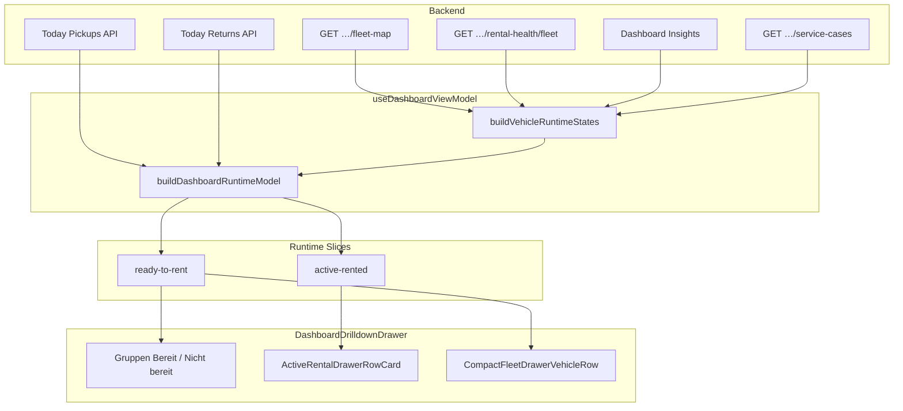

# Vehicle Warnings — Bereitschaft & Aktive Vermietungen Audit (Prompt 19/26)

| Feld | Wert |
|------|------|
| **Audit-ID** | `vehicle-warnings-production-readiness-2026-07` |
| **Prompt** | **19 von 26** — Drawer „Bereit zur Vermietung“ & „Aktive Vermietungen“ |
| **Erstellt (UTC)** | 2026-07-25 |
| **Basis-Commit** | `1d0f2caebe56aa1ecd23295aa33d20e953daa95d` |
| **Vorgänger** | [`17-condition-service-ui-audit.md`](./17-condition-service-ui-audit.md) |
| **Modus** | **Analyse only** — keine Codeänderungen, keine Remediation |
| **Produktionsdaten verändert** | **Nein** |

**Referenz-Dokumente:**

- [`13-severity-readiness-policy-audit.md`](./13-severity-readiness-policy-audit.md) — Warning ≠ Block, D2 Readiness
- [`14-runtime-readiness-builder-audit.md`](./14-runtime-readiness-builder-audit.md) — `buildVehicleRuntimeStates`, `deriveIsReadyForRenting`
- [`16-fleet-command-ui-audit.md`](./16-fleet-command-ui-audit.md) — Commercial Available vs. Readiness
- [`17-condition-service-ui-audit.md`](./17-condition-service-ui-audit.md) — Zustand & Service (Health-Bänder)

**Bekannte Beispiele (User-Report):**

| Drawer | Beobachtung |
|--------|-------------|
| Bereitschaft | 2 bereit · 2 nicht bereit |
| Bereitschaft | Fahrzeuge unter „Nicht bereit“ zeigen Chip **Verfügbar** |
| Bereitschaft | Tesla: Reifen beobachten |
| Bereitschaft | Golf: Batterie prüfen + offline |
| Aktive Vermietungen | Mercedes: Warnung + Reifenbeobachtung |
| Aktive Vermietungen | Tiguan: technisch gut, Rückgabe überfällig |

---

## 1. Executive Summary

Die Drawer **„Bereit zur Vermietung“** und **„Aktive Vermietungen“** sind Teil des **Dashboard Runtime**-Pfads (`DashboardDrilldownDrawer` ← `buildDashboardRuntimeModel`). Sie nutzen **keine eigenen Backend-Endpoints**, sondern eine Client-Projektion über Fleet Map, Rental Health, Today-Bookings, Insights und Service Cases.

| Thema | Urteil |
|-------|--------|
| Datenquelle | `useDashboardViewModel` → `buildDashboardRuntimeModel` → Slices `ready-to-rent` / `active-rented` |
| Ready-Regel | `deriveIsReadyForRenting` — strikter als Health-Warning allein |
| „Verfügbar“-Chip | **Kommerziell** (`operationalStatus === AVAILABLE`), nicht technische Bereitschaft |
| „Nicht bereit“ sichtbar | Fahrzeug bleibt commercial available → erscheint in Drawer-Gruppe + Status-Chip |
| Modul-Warning (Reifen) | Blockiert **nicht** Ready (Tests + `preventsReady: false`) |
| Offline (≥48h) | Blockiert Ready (`telemetryState === 'offline'`) |
| Aktive Vermietung + Warning | Anzeige (Health-Chip), **keine** Auto-Eskalation |
| Rückgabe überfällig | Booking-/Handover-Dimension, getrennt von Health-Band |
| Count-Konsistenz | KPI ↔ Drawer über `runtimeSliceConsistency` abgesichert (gleicher Runtime-Build) |
| Stale Mix | Fleet Map ~30s, Health ~45s, Service Cases separat — möglich |
| Kundendaten | Name + BNR im Drawer; kein E-Mail/Telefon |

**Kernursache der Symptome:** Die Drawer zeigen **bewusst getrennte Dimensionen** nebeneinander — kommerzieller Status (**Verfügbar**), Mietbereitschaft (**Bereit** / **Nicht bereit**), Health (**Warnung** / **Gut**) und Telemetrie (**Offline**). Das wirkt widersprüchlich, ist aber architektonisch dokumentiert (Policy-Audit Prompt 14).

---

## 2. Architektur & Datenfluss



### 2.1 Komponenten

| Komponente | Datei | Rolle |
|------------|-------|-------|
| Dashboard KPI-Klick | `useDashboardViewModel.ts` | Öffnet Drawer mit `activeTargetId` |
| Drawer Shell | `DashboardDrilldownDrawer.tsx` | Rendering, Suche, Gruppen |
| Runtime Builder | `vehicleRuntimeStateBuilder.ts` | Reasons, `isReadyToRent` |
| Slice Builder | `dashboardSliceBuilder.ts` | `buildReadyToRentSlice`, `buildActiveRentedSlice` |
| Ready-Drawer-Gruppen | `dashboardDrilldownRowDisplay.ts` | `buildReadyToRentDrawerGroups` |
| Aktive Vermietung Zeile | `ActiveRentalDrawerRowCard.tsx` | Km-Balken, Kunde, Health |
| Bereitschaft Zeile | `CompactFleetDrawerVehicleRow.tsx` | Status + Health + Reason Chips |
| Display Layer | `fleetVehicleDisplay.ts` | **Verfügbar** vs. **Warnung** Chips |
| Readiness Policy | `rentalReadiness.ts` | `deriveIsReadyForRenting` |

---

## 3. Datenquellen

| Input | Quelle | Refresh / Scope |
|-------|--------|-----------------|
| `fleetVehicles` | `useFleetMapStore` ← fleet-map | Auto ~30s; station-gefiltert |
| `healthMap` | `FleetContext` ← rental-health/fleet | Paginiert org-weit; Redis ~45s |
| `pickupItems` / `returnItems` | Dashboard Today APIs | Org-TZ auf API; Client `dashboardNow` |
| `insights` | Dashboard Insights Provider | CRITICAL/WARNING Feed |
| `serviceCases` | `api.serviceCases.list` in ViewModel | Einmal pro Org-Load |
| `blockedVehicleIds` | `healthMap.rental_blocked` | Client-Ableitung |
| `healthRiskVehicleIds` | `useVehicleHealthAlerts` | Fallback-Reason nur ohne konkrete Health |
| `rentalBlockingServiceCases` | Offene Cases mit `blocksRental` | Hard-Block in Runtime |

**Ein Runtime-Build:** `dashboardRuntime` ist ein `useMemo` über alle Inputs — KPI-Zähler und Drawer lesen **dieselbe** `dashboardRuntime`-Instanz pro Render.

---

## 4. Drawer „Bereit zur Vermietung“ (`ready-to-rent`)

### 4.1 Slice-Logik (`buildReadyToRentSlice`)

```typescript
const available = states.filter((state) => state.operationalStatus === 'available');
const ready = available.filter((state) => state.isReadyToRent);
const notReady = available.filter((state) => !state.isReadyToRent);
```

| Feld | Semantik |
|------|----------|
| `slice.count` | Anzahl **bereit** (`ready.length`) — KPI-Zahl auf der Karte |
| `slice.rows` | Nur bereite Fahrzeuge |
| `slice.secondaryRows` | Spiegel von `notReady` (programmatisch, nicht separat im UI) |
| `groups['ready-now']` | Bereit |
| `groups['available-but-not-ready']` | Nicht bereit |
| `groups['blocked-excluded']` | Blockiert, aber nicht `available` — **nicht** im Drawer sichtbar |

Drawer-Header-Hint (`readyToRentDrawerHint`): `{readyCount} bereit · {notReadyCount} nicht bereit`.

### 4.2 Ready-Regel (`deriveIsReadyForRenting`)

Alle Bedingungen müssen erfüllt sein:

| # | Bedingung | Beispiel „Golf offline“ |
|---|-----------|-------------------------|
| 1 | `operationalStatus === 'available'` | Ja (commercial available) |
| 2 | `canonicalStatus === AVAILABLE` | Ja |
| 3 | Backend-Datenqualität reliable | Ja (typisch) |
| 4 | `cleaningStatus === 'Clean'` | Annahme Ja |
| 5 | `blockLevel === 'none'` | Ja (ohne Hard-Block) |
| 6 | `telemetryState !== 'offline'` | **Nein** → nicht bereit |
| 7 | Kein `reasonBlocksReadyForRenting` | Offline-Reason blockiert |

`reasonBlocksReadyForRenting` greift bei: `preventsReady === true`, `blocking === true`, oder critical in Kategorien `compliance` / `damage` / `rental`.

**Modul-Warnings** (`addHealthReasons`): `blocking: false`, `preventsReady: false` — **blockieren Ready nicht** (Tests: Reifen, DTC, Service-Window).

**Offline:** `preventsReady: true` + optional `blocking` je nach `telemetryOfflineBlockLevel` (Default hard).

### 4.3 UI-Zeile (`CompactFleetDrawerVehicleRow`)

Pro Fahrzeug werden **parallel** gerendert:

| Element | Quelle | Beispiel Tesla (Reifen watch) |
|---------|--------|-------------------------------|
| Status-Chip | `resolveOperationalStatusBadge` | **Verfügbar** (commercial) |
| Health-Chip | `resolveHealthDisplay` | **Warnung** |
| Reason-Chip | `resolveDrawerVehicleReasonBadge` | „Reifen beobachten“ |
| Energie/Odometer | `FleetEnergyIndicator` | Sofern Telemetrie |
| Telemetry-Zeile | `telemetryLabel` | Live / Offline · … |

**Symptom erklärt:** „Nicht bereit“ + **Verfügbar** — Gruppe folgt `isReadyToRent`, Chip folgt `operationalStatus`. Ein available-but-not-ready Fahrzeug ist **kommerziell verfügbar**, aber operativ nicht übergabebereit (Offline, Reinigung, Datenqualität, …).

### 4.4 Beispiel-Mapping

| Fahrzeug | Gruppe | Status-Chip | Health | Primary Reason |
|----------|--------|-------------|--------|----------------|
| Tesla, tires warning, online, clean | **Bereit** | Verfügbar | Warnung | Reifen beobachten |
| Golf, battery warning, offline | **Nicht bereit** | Verfügbar | Warnung/Kritisch | Offline (+ Batterie) |
| Fahrzeug, rental_blocked | Nicht in Drawer (blocked-excluded) | — | — | — |

Hinweis: `overall_state: critical` ohne `rental_blocked` kann laut Tests **trotzdem bereit** sein (Battery-open-Policy) — erscheint in **Bereit** + Critical-Alerts-Slice.

### 4.5 Filter & Sortierung

- **Station:** `filteredFleetVehicles` im ViewModel — KPI und Drawer station-konsistent
- **Suche:** `filterDashboardDrawerGroups` im Drawer (Kennzeichen, Modell, Station)
- **Sortierung Ready-Gruppen:** `sortReadyToRentDrawerGroupsByLastSignal` — frisches Signal zuerst
- **Pagination:** Keine — alle Zeilen der Gruppe client-seitig

---

## 5. Drawer „Aktive Vermietungen“ (`active-rented`)

### 5.1 Öffnen & Fokus

KPI „Aktive Vermietungen“ setzt `focusedGroupId: 'active-rentals'`. Drawer filtert auf Gruppe `active-rented-now` (`TODAYS_OPERATIONAL_GROUP_IDS.ACTIVE_RENTED_NOW`).

Klassifikation (`classifyTodaysOperational`):

```typescript
activeRentedNow = vehicleStates.filter(
  (state) => state.operationalStatus === 'active_rented',
);
```

**Nicht** nur `activeBookingId` — kanonischer `operationalStatus` aus Fleet Map V2.

### 5.2 Mehrfachzugehörigkeit

Ein Fahrzeug kann gleichzeitig in:

- `active-rented-now` (aktive Vermietung)
- `returns-today` oder `overdue-returns` (Rückgabe heute / überfällig)

erscheinen — **erlaubt** (`todaysOperationalSlice.ts` Kommentar). Dedupe nur **innerhalb** einer Gruppe.

**Tiguan-Beispiel:** Technisch gut (`healthSeverity: ok`) + `return_overdue` → in Aktive Vermietungen mit Health-Chip **Gut**, Rental-Chip **Aktiv**; Timing „Rückgabe überfällig“ über Booking-Runtime-Reason (nicht als Health-Finding).

### 5.3 Zeile (`ActiveRentalDrawerRowCard`)

| Element | Quelle |
|---------|--------|
| Kennzeichen / Modell | `vehicle` + `row` |
| Kunde + BNR | `activeCustomerName`, `bookingRef` via `DrawerCustomerBnrRow` |
| Freikm + Balken | `activeKmDriven` / `activeKmIncluded` (`activeRentalDrawer.utils`) |
| „Bis:“ Rückgabezeit | `activeReturnAt` → `formatFleetDateTime` |
| Health-Chip | `resolveFleetVehicleDisplayState` → `healthDisplay` |
| Rental-Chip | `rentalDisplay` → **Aktiv** |
| Reason-Chip | `resolveHandoverVehicleReasonBadge` — **ohne** Timing-Reasons |
| CTAs | „Zur Buchung“, „Zum Fahrzeug“ |

**Mercedes-Beispiel:** `overall_state: warning`, Modul tires → Health **Warnung**, Reason-Chip „Reifen beobachten“, Rental **Aktiv** — keine Ready-Blockade (Fahrzeug ist vermietet).

### 5.4 Kilometer / Reichweite

| Anzeige | Logik |
|---------|-------|
| `Frei: X km` | `included - driven` (negativ → `+X km` über Limit) |
| Balken-Füllung | `kmRemainingPercent` — verbleibendes Kontingent |
| Balken-Ton | `>85%` verbraucht → watch; `>100%` → critical |
| Energie (Bereitschafts-Drawer) | `FleetEnergyIndicator` auf `CompactFleetDrawerVehicleRow` |

Km-Daten kommen aus Fleet-Map-Feldern (`activeKmDriven`, `activeKmIncluded`) — keine Live-Neuberechnung im Drawer.

### 5.5 Eskalation bei Warnung während Vermietung

| Mechanismus | Vorhanden? |
|-------------|------------|
| Auto-Task bei Warning | **Nein** im Drawer-Pfad |
| Auto-Inspection bei Rückgabe | **Nein** — keine Kopplung Drawer → Inspection |
| Critical-Alerts-Slice | Ja — parallele Sicht für kritische Reasons |
| Notification / Action Queue | Separater Pfad (`operationsBuilder`, Notifications) |
| CTA im Drawer | Nur Navigation Fahrzeug / Buchung |

Warnungen während aktiver Vermietung sind **informativ** (Chips + optional Critical-Alerts), nicht workflow-automatisiert.

---

## 6. Statusgruppen & Counts

### 6.1 Ready-Counts

| Anzeige | Ableitung |
|---------|-----------|
| KPI-Karten-Zahl | `runtime.slices['ready-to-rent'].count` (= ready rows) |
| Drawer „X bereit · Y nicht bereit“ | `slice.count` + `readyToRentNotReadyRows(slice).length` |
| Gruppen-Header | `group.rows.length` nach Sort |

Konsistenz-Tests: `runtimeSliceConsistency.test.ts`, `verifyReadyToRentKpiDrawerConsistency`.

### 6.2 Aktive-Vermietungen-Counts

| Anzeige | Ableitung |
|---------|-----------|
| KPI | `resolveTodaysOperationsKpiCounts().activeRentalsCount` |
| Drawer fokussiert | `groupCount(active-rented-now)` |

Voller `active-rented`-Slice enthält auch Pickups/Returns — nur bei Fokus `active-rentals` gefiltert.

---

## 7. Zeitvergleich & Zeitzone

| Aspekt | Verhalten |
|--------|-----------|
| Runtime-`now` | `dashboardNow` im ViewModel (Client) |
| „Heute“ Pickups/Returns | `isScheduledToday` — Kalendertag von `now` im Client; API liefert org-TZ-vorfilterte Items |
| Rückgabe überfällig | `deriveBookingState` → `return_overdue` aus Return-Tiles + Fleet-Felder |
| Drawer-Datum Header | `formatOperationsDrawerDate` — Locale `de-DE` / `en-US` |
| Rückgabezeit „Bis:“ | `formatFleetDateTime` — org-/locale-abhängig |

**Risiko:** Client-`now` vs. Server-Buchungs-TZ kann an Tagesgrenzen divergieren; API-Kommentar verweist auf org-TZ-Filterung der Today-Listen.

---

## 8. Navigation

| Aktion | Ziel |
|--------|------|
| KPI Klick Bereitschaft | Drawer `ready-to-rent` |
| KPI Klick Aktive Vermietungen | Drawer `active-rented`, `focusedGroupId: active-rentals` |
| „Öffnen“ / „Zum Fahrzeug“ | `onOpenVehicleById` → Vehicle Detail |
| „Zur Buchung“ | `onOpenBookingById` |
| Drawer schließen | `onClose` — kein State-Persist der Suche über Session (URL nicht für Drawer) |

Kein Deep-Link in Fleet Health Service aus diesen Drawern — parallele Surfaces.

---

## 9. Mobile, Overflow, Accessibility

| Aspekt | Befund |
|--------|--------|
| Layout | Drawer `DetailDrawer` — Vollbild-typisch auf Mobile |
| Zeilen | `truncate`, `whitespace-nowrap` auf Kennzeichen/Kunde |
| Touch | `DrawerRowActionButton`, `min-h-11` auf CTAs (FHS-Pattern konsistent) |
| Km-Balken | Schmale Zeile (`h-1.5`), `max-w-[42%]` auf „Bis:“-Text |
| Chips | `max-w-full truncate` auf Reason-Chips |
| Farb-Tint | Warning/Critical-Hintergrund auf Zeile bei Severity |

Lange Modul-Reasons können abgeschnitten werden — Volltext teils nur über Health-Detail/Fahrzeug.

---

## 10. Pflichtfragen (10/10)

### 10.1 Bedeutet „Verfügbar“ kommerziell oder technisch bereit?

**Kommerziell** — mit Einschränkung.

| Chip-Quelle | Semantik |
|-------------|----------|
| `statusBadge` / `resolveOperationalStatusBadge` | Kanonischer **Operational Status** `AVAILABLE` → Label „Verfügbar“ |
| Gruppe „Bereit“ | `isReadyToRent === true` (technische Übergabebereitschaft) |
| `rentalDisplay` (sekundär) | „Bereit“ / „Nicht bereit“ nur für available-Fahrzeuge in Fleet Display |

**Verfügbar ≠ bereit zur Vermietung.** Policy-Audit D1 vs. D2.

### 10.2 Warum bleibt es bei „Nicht bereit“ sichtbar?

Weil der Drawer alle Fahrzeuge mit `operationalStatus === 'available'` umfasst und in **Bereit** vs. **Nicht bereit** splittet.

Commercial **Available** ist Voraussetzung für den Drawer — „Nicht bereit“ bedeutet: *verfügbar im Bestand, aber nicht übergabefertig* (Offline, Reinigung, blockierender Reason, unreliable DQ, …).

Der Status-Chip zeigt weiter **Verfügbar**, weil der operative Status sich nicht ändert — nur die Readiness-Dimension.

### 10.3 Welche Warnungen blockieren die nächste Vermietung?

**Nicht automatisch alle Modul-Warnings.**

| Blockiert Ready (`preventsReady` / `deriveIsReadyForRenting`) | Blockiert nicht Ready |
|--------------------------------------------------------------|----------------------|
| Offline (≥48h) | Reifen watch, DTC warning, Service-Window insight |
| Reinigung ≠ Clean | Soft offline, Standby |
| `rental_blocked` / Hard compliance | `overall_state: warning` allein |
| Critical compliance/damage/rental Reasons | Modul-critical ohne `rental_blocked` (offene Policy) |
| Service Case `blocksRental` | Dashboard-health-risk Fallback (soft) |
| Unreliable / degraded DQ | Health insight WARNING |

**Nächste Vermietung (Buchung):** Backend `BookingEligibilityGatekeeper` kann **strenger** sein als Dashboard-Ready — nicht im Drawer geprüft.

### 10.4 Wie werden aktive Vermietungen mit kritischen Warnungen eskaliert?

**Keine automatische Eskalation im Drawer.**

- Anzeige: Health-Chip (Warnung/Kritisch), Reason-Chip, ggf. Eintrag in `critical-alerts`-Slice parallel
- Kein Auto-Task, kein Push aus `ActiveRentalDrawerRowCard`
- Operative Eskalation über **Notifications / Action Queue / manuelle CTAs** (Fahrzeug/Buchung öffnen)

`isCritical` auf Runtime-State erhöht Severity-Tint, ändert aber nicht den Rental-Status **Aktiv**.

### 10.5 Wird „Rückgabe überfällig“ korrekt getrennt von Fahrzeuggesundheit?

**Ja** — eigene Dimension.

| Aspekt | Health | Rückgabe überfällig |
|--------|--------|---------------------|
| Quelle | `healthMap` / Rental Health V1 | Booking-Runtime / Return-Tiles / `activeReturnAt` |
| Reason-Kategorie | `battery`, `tires`, … | `handover` |
| `resolveHandoverVehicleReasonBadge` | Zeigt Modul-Reasons | **Filtert** Timing-Reasons („Rückgabe überfällig“) aus Reason-Chip |
| Primary Status | Health-Chip unabhängig | `selectFleetActiveIsOverdue` → Primary **Überfällig** möglich |

Tiguan: Health **Gut** + overdue Return — konsistent möglich; Überfälligkeit über Booking/Status, nicht über `overall_state`.

### 10.6 Gibt es eine Handlungsempfehlung bei Warnung während aktiver Vermietung?

**Nur implizit über Navigation — keine strukturierte Empfehlung im Drawer.**

- CTAs: „Zur Buchung“, „Zum Fahrzeug“
- Kein `recommendedAction` wie in Fleet Health Service
- Kein „Task erstellen“ / „Inspektion“ Button in `ActiveRentalDrawerRowCard`

Handlungsempfehlungen existieren in **Zustand & Service** (`deriveRecommendedAction`), nicht in diesen Dashboard-Drawern.

### 10.7 Wird die Warnung bei Rückgabe automatisch in Inspection/Task übernommen?

**Nein** — im untersuchten Pfad keine automatische Übernahme.

- Drawer löst keinen Handover-/Inspection-Workflow aus
- `handover:completed` Event im ViewModel invalidiert Fleet-Daten, erstellt aber keine Tasks
- Health→Task-Brücke existiert in **Fleet Health Service** (`health-task-bridge.utils`), nicht im Dashboard-Drawer

Rückgabe-Prozesse (Inspection, Protokoll) sind separate Flows.

### 10.8 Verwenden die Counts dieselbe Projektionsversion?

**Ja** — pro Render-Zyklus.

`dashboardRuntime` wird einmal in `useMemo` gebaut; KPI-Karte und `DashboardDrilldownDrawer` lesen dieselbe Instanz:

- `resolveReadyForRentingKpiCounts(slice)`
- `buildReadyToRentDrawerGroups(slice)`
- `verifyReadyToRentKpiDrawerConsistency` (Tests)

**Einschränkung:** Nach async Refetch (Fleet vs. Health) kann **nächster** Render andere Counts zeigen — innerhalb eines Frames konsistent.

### 10.9 Kann die UI einen alten Booking- oder Finding-Stand mischen?

**Ja, temporal möglich.**

| Quelle | Staleness |
|--------|-----------|
| fleet-map | Poll 30s + Server Redis 5s |
| healthMap | Bis 45s Redis, kein Auto-Poll auf Dashboard |
| Today Pickups/Returns | Eigener API-Fetch |
| serviceCases | Einmal-Load, nicht an Fleet-Poll gekoppelt |
| Optimistic patches | `applyFleetOperationalOptimisticPatch` nach Handover |

Symptom: Fahrzeug offline in Fleet, Health noch „gut“ — oder umgekehrt. Drawer kombiniert **aktuell verfügbare** Maps ohne `evaluatedAt`-Gate.

### 10.10 Werden Kundeninformationen datensparsam angezeigt?

**Weitgehend ja.**

`DrawerCustomerBnrRow` zeigt:

- `Kunde: {Name}` aus `activeCustomerName` oder Subtitle-Parse
- `BNR: {bookingRef}` — gekürzte Buchungsreferenz

**Nicht** im Drawer: E-Mail, Telefon, Adresse, Zahlungsdaten, vollständige Buchungs-ID (nur Ref für Navigation).

---

## 11. Risikoregister

| ID | Risiko | Schwere | Hinweis |
|----|--------|---------|---------|
| RAR-W01 | Verfügbar + Nicht bereit wirkt widersprüchlich | **Hoch** | UX — Dimensionen nicht erklärt |
| RAR-W02 | Modul-Warning erlaubt Ready (Tesla-Reifen) | **Mittel** | Policy-konform, operatorisch irritierend |
| RAR-W03 | Critical Health ohne rental_blocked noch „Bereit“ | **Mittel** | Battery-open-Test |
| RAR-W04 | Keine Eskalation bei Warning in aktiver Miete | **Mittel** | Ops müssen manuell reagieren |
| RAR-W05 | Stale Health + frische Fleet Map | **Mittel** | TTL-Mismatch |
| RAR-W06 | Return overdue vs. Health visuell getrennt, aber leicht überlesen | **Niedrig** | Timing nicht im Reason-Chip |
| RAR-W07 | TZ-Grenze Today-Listen | **Niedrig** | Org-TZ vs. Client-`now` |
| RAR-W08 | `blocked-excluded` unsichtbar im Drawer | **Niedrig** | Blockierte nicht in Bereitschafts-Drawer |
| RAR-W09 | Truncate auf Safety-Reasons Mobile | **Niedrig** | Tooltip begrenzt |
| RAR-W10 | Gatekeeper strenger als Ready — nicht sichtbar | **Mittel** | Buchung könnte scheitern trotz „Bereit“ |

---

## 12. Querverweise & Tests

| Artefakt | Pfad |
|----------|------|
| Ready-Policy | `rentalReadiness.test.ts` |
| Runtime Builder | `vehicleRuntimeStateBuilder.test.ts` |
| Slice Counts | `dashboardRuntime.test.ts`, `runtimeSliceConsistency.test.ts` |
| Fleet Display | `fleetVehicleDisplay.test.ts` |
| Active Rental Km | `activeRentalDrawer.utils.test.ts` |
| E2E | `fleet-operational-flow.spec.ts`, `fleet-operational-responsive.spec.ts` |
| Surfaces Integration | `vehicle-operational-state-v2-surfaces.test.ts` |

---

## 14. Fazit

Die Drawer **Bereit zur Vermietung** und **Aktive Vermietungen** sind konsistente Ausschnitte des **Dashboard Runtime Models** — Counts stimmen innerhalb eines Builds überein. Die gemeldeten Beispiele (2/2, Verfügbar unter Nicht bereit, Reifen-Warning, Offline+Batterie, aktive Miete mit Warning, gute Health + überfällige Rückgabe) sind **mit der dokumentierten Mehr-Dimensionen-Architektur erklärbar**.

Operative Lücke: **keine** integrierte Handlungsempfehlung oder Auto-Workflow bei Warnungen während aktiver Vermietung; Rückgabe überfällig und Health bleiben bewusst getrennt, aber visuell nah beieinander.

---

**Changes / Architektur:** Nicht aktualisiert (audit-only, keine Implementierung).
