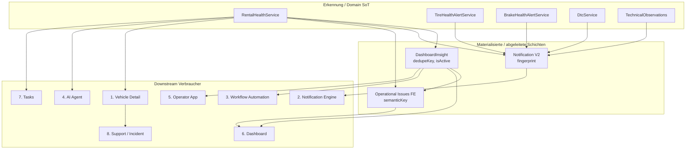
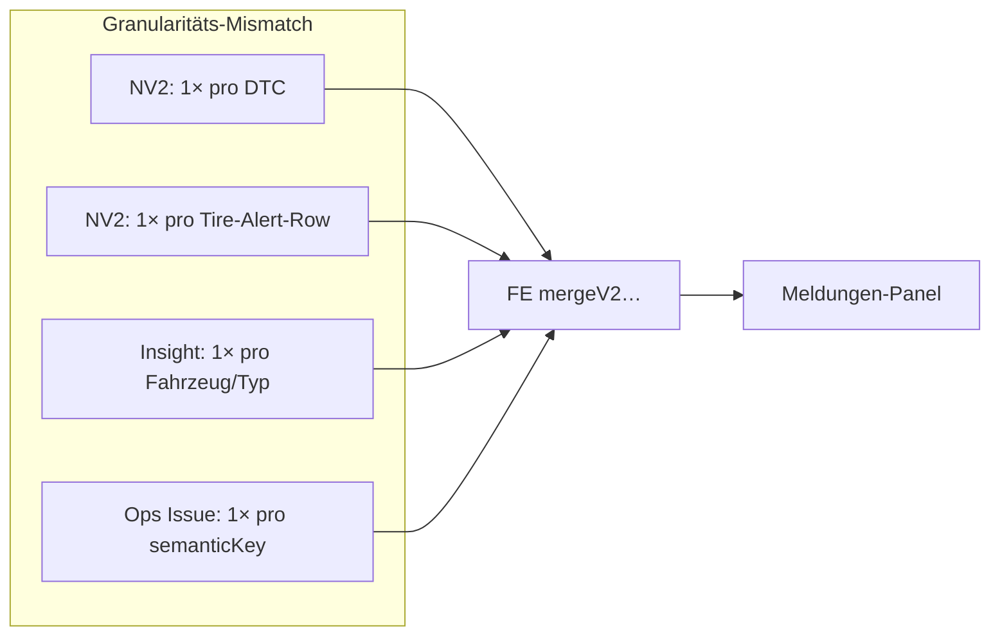

# Vehicle Warnings — Downstream Consumers Audit (Prompt 20/26)

| Feld | Wert |
|------|------|
| **Audit-ID** | `vehicle-warnings-production-readiness-2026-07` |
| **Prompt** | **20 von 26** — Nachgelagerte Verbraucher von Vehicle-Warnmeldungen |
| **Erstellt (UTC)** | 2026-07-25 |
| **Basis-Commit** | `1d0f2caebe56aa1ecd23295aa33d20e953daa95d` |
| **Vorgänger** | [`18-readiness-active-rentals-audit.md`](./18-readiness-active-rentals-audit.md) |
| **Modus** | **Analyse only** — keine Codeänderungen, keine Remediation |
| **Produktionsdaten verändert** | **Nein** |

**Referenz-Dokumente:**

- [`11-finding-lifecycle-audit.md`](./11-finding-lifecycle-audit.md) — parallele Lifecycle-Modelle, Eventual Consistency
- [`12-deduplication-idempotency-audit.md`](./12-deduplication-idempotency-audit.md) — Fingerprints, Dedupe-Keys, Race-Lücken
- [`15-api-contract-consistency.md`](./15-api-contract-consistency.md) — API-Shape je Schicht
- [`17-condition-service-ui-audit.md`](./17-condition-service-ui-audit.md) — Fleet Zustand & Service
- [`18-readiness-active-rentals-audit.md`](./18-readiness-active-rentals-audit.md) — Dashboard Runtime vs. Health

---

## 1. Executive Summary

Vehicle-Warnungen werden in SynqDrive **nicht als einheitliches Finding-Objekt** an nachgelagerte Verbraucher verteilt. Stattdessen existieren **mehrere parallele Projektionen** mit eigenen IDs, Severity-Mappings, Lifecycle-Semantiken und Dedupe-Regeln. Die Verbraucher lesen unterschiedliche Schichten — teils kanonisch (Domain-Services), teils abgeleitet (Insights, Operational Issues), teils materialisiert (Notification V2, OrgTask).

| Verbraucher | Primäre Datenquelle | Kanonische Finding-ID | Org-Scope |
|-------------|---------------------|----------------------|-----------|
| **Vehicle Detail** | `RentalHealthService` + Modul-APIs | Keine globale `findingId`; UI-Keys lokal | Ja (`vehicleId` → Org) |
| **Notification Engine (V2)** | Adapter-Ingest + Sweep | `fingerprint` (`org\|event\|entity\|condition\|vN`) | Ja |
| **Workflow Automation / Tasks** | `DashboardInsight` + Automation-Outbox | `dedupeKey` (Insight) / Task `dedupKey` | Ja |
| **AI Agent** | Domain-Tools (`get_vehicle_health_summary`) | Tool-Evidence-Slices, nicht Notification-Row | Ja |
| **Operator App** | `GET dashboard-insights` (gefiltert) | `insight.id` | Ja |
| **Dashboard** | Runtime-Builder + Insights + Health-Map + V2-Merge | `semanticKey` (FE) / `insight.dedupeKey` | Ja |
| **Tasks (manuell)** | Health-Task-Bridge (FE) | `health:{vehicleId}:{module}:{identity}` | Ja |
| **Support / Incident** | Kontext-Preset (`vehicle-health`) | `relatedEntityId` = `vehicleId` nur | Ja |

**Kernbefunde (Priorität):**

| # | Thema | Urteil |
|---|-------|--------|
| 1 | Eine logische Notification pro Empfänger/Kanal | **Ja pro Fingerprint+Generation+Kanal** — Delivery-Idempotenz-Key verhindert Doppel-Dispatch; Wiederöffnung erzeugt neue `lifecycleGeneration` |
| 2 | Wiederholungen als Duplikate sichtbar | **Ja möglich** — unterschiedliche Granularität (Insight pro Fahrzeug vs. Notification pro DTC/Reifen-Alert), FE-Merge nur grob pro `vehicleId` |
| 3 | Geschlossene Findings in Notifications | **Historisiert** (`RESOLVED`/`ARCHIVED`), nicht gelöscht; UI filtert aktiv |
| 4 | Automation mehrfach auslösbar | **Teilweise geschützt** — Outbox-Idempotenz + `dedupKey`; Race bei `upsertByDedup` (Audit 12) |
| 5 | AI strukturierte kanonische Daten | **Ja** — Domain-Services, nicht Notification-Prompt |
| 6 | AI erklärt What/When/Source/Freshness/Impact/Action | **Teilweise** — Tool-Contract liefert Slices; freie LLM-Antwort kann Lücken füllen |
| 7 | AI sensible Aktionen nur über Tools | **Ja** — Domain-Registry nur Read-Tools; kein Health-Write-Tool |
| 8 | Operator-Beobachtungen mehrfach | **Ja möglich** — `VehicleComplaint` ohne Dedup-Constraint |
| 9 | Deep Links stabil | **Teilweise** — `vehicleId`/`bookingId` stabil; `OPEN_VEHICLE_MODULE` ignoriert `module` in Navigation |
| 10 | `organizationId` erhalten | **Ja in Backend-Pfaden**; FE leitet aus Session/Context ab |

---

## 2. Scope & Methodik

### 2.1 Im Scope

Auditierte Verbraucher und Querschnittsthemen:

- gemeinsame IDs, Severity, Texte, Lifecycle
- Deep Links, Deduplizierung, Berechtigungen
- Acknowledgement, Resolution, Automationsauslösung
- AI-Zugriff auf Evidence, Halluzinationsrisiko
- getrennte Warnlogik in Prompt oder Frontend

### 2.2 Primärquellen (CODE_VERIFIED)

| Bereich | Pfad |
|---------|------|
| Notification Core + Fingerprint | `backend/.../notification-core.service.ts`, `rental-health-notification.projector.ts` |
| Notification Ingest + Sweep | `backend/.../notification-producer.ingest.service.ts` |
| Delivery Idempotenz | `backend/.../notification-delivery-idempotency.util.ts`, `notification-delivery-enqueue.service.ts` |
| Business Insights + Health Sync | `backend/.../business-insights.service.ts` |
| Insight Health Gate | `backend/.../insight-health-gate.ts` |
| Insight → Task Bridge | `backend/.../insight-task-bridge.service.ts` |
| Task Automation Catalog | `backend/.../task-automation-rule.catalog.ts` |
| Stale Task Close | `backend/.../tasks.service.ts` → `closeStaleInsightTasks` |
| AI Health Summary Tool | `backend/.../ai-get-vehicle-health-summary.tool.ts`, `ai-domain-tool-registry.definitions.ts` |
| Operator Alerts | `frontend/.../useOperatorOperationalAlerts.ts` |
| Dashboard Merge | `frontend/.../merge-v2-with-vehicle-health.ts`, `useDashboardViewModel.ts` |
| Operational Issues | `frontend/.../operational-issues/normalizeOperationalIssues.ts`, `operationalIssueKeys.ts` |
| Health Task Bridge (FE) | `frontend/.../health-task-bridge.utils.ts` |
| Notification V2 Navigation | `frontend/.../notification-v2-action-router.ts` |
| Support Context | `frontend/.../support-context.ts` |
| Technical Observations | `backend/.../technical-observations/technical-observations.service.ts` |

### 2.3 Begriffsabgrenzung

| Begriff | Bedeutung in diesem Audit |
|---------|---------------------------|
| **Finding** | Operatorisch sichtbare Warnung — unabhängig von Persistenzschicht |
| **Downstream Consumer** | UI, Notification, Task, AI, Operator, Support — alles nach der Erkennung |
| **Kanonische Quelle** | Domain-Service (Rental Health, Tire/Brake Alerts, DTC) — nicht abgeleitete UI-Projektion |
| **Supplemental Bridge** | FE-Logik, die V1-Health-Signale in V2-Meldungen-Panel einblendet |

---

## 3. Architektur — Consumer Map

**Signalfluss-Kern:** Es gibt **keinen zentralen Finding-Bus**. Jeder Verbraucher konsumiert eine andere Projektion. Konsistenz entsteht nur indirekt über gemeinsame Domain-Services und periodische Sync-Jobs (Insights-Eval, `syncVehicleHealthNotifications`).

---

## 4. Identitäts- und Semantik-Matrix

| Schicht | ID-Format | Beispiel | Granularität |
|---------|-----------|----------|--------------|
| Notification `fingerprint` | `{orgId}\|{eventType}\|{entityType}\|{entityId}\|{conditionCode}\|v{N}` | `…\|ACTIVE_DTC\|VEHICLE\|veh-1\|dtc:P0420\|v1` | Pro DTC-Code; Battery/Brake pro Fahrzeug; Tire pro Alert-Row |
| Insight `dedupeKey` | `{type}:{vehicleId}` o.ä. | `tire_critical:veh-1` | Meist **pro Fahrzeug** pro Insight-Typ |
| Task `dedupKey` | aus Insight / Automation | `tire_critical:veh-1` | Pro Automation-Rule-Scope |
| Operational `semanticKey` | `vehicle:{id}:{domain}:{issueType}` | `vehicle:veh-1:health:tire_critical` | FE-normalisiert |
| Health-Task `sourceFindingId` | `health:{vehicleId}:{module}:{identity}` | `health:veh-1:tires:reifen profil niedrig` | Nur manueller FE-Task-Bridge |
| Insight Row `id` | UUID | `cuid-…` | DB-Primärschlüssel, nicht cross-layer |

**Konsequenz:** Es existiert **keine globale `findingId`**, die alle Verbraucher teilen. Cross-Layer-Korrelation erfolgt über `vehicleId` + lose Typ-Zuordnung.

### 4.1 Severity-Mapping

| Quelle | Werte | Downstream |
|--------|-------|------------|
| Rental Health `HealthState` | `ok` / `warning` / `critical` | Vehicle Detail, NV2-Projektor, Ops Issues |
| Insight `severity` | `CRITICAL` / `WARNING` / `INFO` | Operator, Dashboard Insights, Task-Priority |
| Notification `severity` | `critical` / `warning` / `success` (resolve) | Meldungen-Panel, Delivery-Priorität |
| Task `priority` | `CRITICAL` / `HIGH` / `NORMAL` | Task-Listen, Automation |

Mappings sind **deterministisch pro Schicht**, aber nicht 1:1 (z. B. Insight `WARNING` → Notification `warning` → Task `HIGH`).

### 4.2 Lifecycle-Werte

| Schicht | Aktiv | Geschlossen | UI-Verhalten |
|---------|-------|-------------|--------------|
| DashboardInsight | `isActive=true` | `isActive=false` (Publish-Swap) | Verschwindet aus API-Liste; Row bleibt in DB |
| Notification V2 | `OPEN`, `ACK`, `SNOOZE` | `RESOLVED`, `ARCHIVED` | Aktive gefiltert; Historie optional |
| OrgTask | `OPEN`, `IN_PROGRESS`, `WAITING` | `DONE`, `CANCELLED` | Eigene Statusmaschine |
| Tire/Brake Alert | `OPEN` | `RESOLVED` | Backend-SoT für NV2-Sync |
| Operational Issues | — | — | **Ephemeral** — pro Render neu |
| Technical Observation | `ACTIVE` | `RESOLVED`/`DISMISSED`/`CONVERTED` | Eigener Pfad |

---

## 5. Verbraucher im Detail

### 5.1 Vehicle Detail

**Pfad:** `VehicleDetailHeader`, `VehicleHealthBoxWired`, `HealthVehicleDetailPanel`, Modul-Popups (Tires, Brakes, Battery, DTC, Service).

| Aspekt | Befund |
|--------|--------|
| Datenquelle | `useEffectiveHealth` → `GET /rental-health/vehicles/:id` + Modul-spezifische APIs |
| IDs | Keine Notification-/Insight-ID in Health-UI; Modul-Zustand aus `VehicleHealth.modules` |
| Severity | Direkt aus `HealthState` (`warning`/`critical`) |
| Texte | `mod.reason` aus Rental Health; Modul-Detail aus Domain-Endpoints |
| Lifecycle | Kein Ack/Resolve auf Finding-Ebene in Health-Panel; Tasks/Observations separat |
| Deep Links | Interne Tabs (`selectedTab`); Support-Preset `vehicle-health` mit `vehicleId` |
| Dedup | Keine — ein Fahrzeug, eine Modul-Aggregation |
| Berechtigungen | Fleet/Rental-Org-Scope über API |
| Getrennte Warnlogik | **Nein im Prompt** — reine Domain-Daten; keine Notification-Row-Injektion |

**Abweichung zu Meldungen:** Vehicle Detail zeigt **alle** Module-Warnungen fleet-weit; Dashboard-Insights für Raw Health (`BATTERY_CRITICAL`, `TIRE_CRITICAL`, `BRAKE_CRITICAL`) sind durch `gateHealthInsightsForBusinessContext` **nur bei anstehender Buchung** sichtbar (Operator/Meldungen können divergieren).

### 5.2 Notification Engine

**Pfad:** `BusinessInsightsService.syncVehicleHealthNotifications` → `NotificationProducerIngestService.syncVehicleHealthWarnings` → `VehicleHealthNotificationAdapter` → `NotificationCoreService.ingestCandidate`.

| Aspekt | Befund |
|--------|--------|
| Erzeugung | Nach jedem Insights-Eval-Lauf; Batch über alle Fahrzeuge der Org |
| Event-Typen | `ACTIVE_DTC`, `BATTERY_CRITICAL`, `TIRE_CRITICAL`, `BRAKE_CRITICAL` |
| Fingerprint | `vehicleHealthSourceFingerprint()` — spiegelt Registry `conditionCode` + optional DTC-Code |
| Dedup | Gleicher Fingerprint → Occurrence-Append oder Reopen-Policy; kein zweites OPEN |
| Sweep | Aktive NV2-Rows ohne passenden Fingerprint → `cleared: true` Ingest → `RESOLVED` |
| Delivery | `buildDeliveryIdempotencyKey(notificationId, generation, transition, channel, recipientId)` |
| Geschlossene Findings | **Nicht gelöscht** — Status `RESOLVED`; neue Generation bei Reopen |
| Acknowledgement | `ACK`/`SNOOZE` auf Notification-Ebene; löst Domain-Finding **nicht** auf |
| Manual Resolve | Policy-gated pro `eventType`; auditierbar |
| FE-Anzeige | `NotificationPanel` + `mergeV2NotificationsWithVehicleHealth` (Supplemental-Bridge) |

**Supplemental-Merge (FE):** Wenn **irgendeine** V2-Health-Notification für ein `vehicleId` existiert, werden **alle** supplemental Health-Queue-Items dieses Fahrzeugs unterdrückt (`shouldSkipSupplementalHealthItem` — vehicle-level, nicht semantic-key-genau für den zweiten Fall). Das kann korrekte Mehrfach-Warnungen (z. B. DTC + Reifen) **verstecken**, wenn nur eine V2-Zeile materialisiert ist.

### 5.3 Workflow Automation

**Pfad:** `InsightTaskBridgeService.materialize` → `TaskAutomationOutboxEnqueueService` → Regeln aus `TASK_AUTOMATION_RULE_CATALOG`.

| Health-Regel | Insight-Typ | Task-Typ | Auto-Resolve |
|--------------|-------------|----------|--------------|
| `TIRE_CRITICAL_HEALTH` | `TIRE_CRITICAL` | `TIRE_CHECK` | `TIRE_MEASURED_OK \| …` |
| `BRAKE_CRITICAL_HEALTH` | `BRAKE_CRITICAL` | `BRAKE_CHECK` | `BRAKE_MEASURED_OK \| …` |
| `BATTERY_CRITICAL_HEALTH` | `BATTERY_CRITICAL` | `BATTERY_CHECK` | `BATTERY_MEASURED_OK \| …` |

| Aspekt | Befund |
|--------|--------|
| Trigger | `ON_INSIGHT_MATERIALIZE` — nur wenn Insight **aktiv** und Gate passiert |
| Dedup | Insight `dedupeKey` → Task `dedupKey`; höchste Priority gewinnt bei Kollision |
| Mehrfachauslösung | Outbox-Identität pro Rule; erneutes Materialize bei gleichem Key → Upsert |
| Clear | `closeStaleInsightTasks` mit `INSIGHT_CLEARED` wenn Dedup-Key nicht mehr in `seenKeys` |
| Granularität | Insight oft **1× pro Fahrzeug**; NV2 Reifen **pro Alert-Row** → Task/Notification können auseinanderlaufen |
| Berechtigungen | Org-Policy + Rule-Resolver (`TaskAutomationRuleResolverService`) |

**Battery-Sonderpfad:** Zusätzlich `BatteryTaskService.syncReferenceCapacityTasksForOrganization` — parallele Task-Quelle neben Insight-Bridge.

### 5.4 AI Agent

**Pfad:** `AiGetVehicleHealthSummaryTool` via `AI_DOMAIN_TOOL_DEFINITIONS` — **read-only**.

| Aspekt | Befund |
|--------|--------|
| Datenquelle | `RentalHealthService`, `DamagesService`, `ServiceComplianceService`, `TasksService`, Connectivity-Bundle — **nicht** Notification-Rows |
| Struktur | `AiGetVehicleHealthSummaryDomains` — pro Domain `status`, `observedAt`, `source`, `freshness`, `confidence`, `recommendedAction` |
| Rollen | `MASTER_ADMIN`, `ORG_ADMIN`, `SUB_ADMIN`, `WORKER` — **nicht** `DRIVER` |
| Permissions | `ai-assistant:read`, `fleet-condition:read`, `fleet:read` |
| Write-Tools | **Keine** Health-Write-Tools in Domain-Registry |
| Halluzination | Tool liefert `buildMissingDataSlice` / `buildEndpointErrorSlice` bei Lücken; LLM kann dennoch über Tool-Output hinaus spekulieren |
| Getrennte Prompt-Logik | System-Prompt sollte Tools nutzen; **keine** eingebettete Warnliste im Frontend für AI |

**Erklärbarkeit (6 Dimensionen):**

| Dimension | Tool-Unterstützung |
|-----------|-------------------|
| Was erkannt | Domain-Slice `status` + `summary`/`details` |
| Wann | `observedAt` pro Slice |
| Quelle | `source` (z. B. telemetry, document, manual) |
| Aktualität | `freshness` Bucket |
| Auswirkung | `overallStatus`, offene Tasks, Compliance-Flags |
| Empfohlene Aktion | `recommendedAction` wo Domain mapper liefert |

Lücken: Nicht jede Domain füllt alle Felder; freie Chat-Antwort ohne Tool-Call ist nicht grounded.

### 5.5 Operator App

**Pfad:** `useOperatorOperationalAlerts` → `api.dashboardInsights.get(orgId)`.

| Aspekt | Befund |
|--------|--------|
| Filter | Feste `OPERATOR_INSIGHT_TYPES` (u. a. `BATTERY_CRITICAL`, `TIRE_CRITICAL`, `BRAKE_CRITICAL`) |
| Severity | Nur `CRITICAL` und `WARNING` |
| IDs | `insight.id` (UUID) |
| Booking-Link | `metrics.bookingId` oder `entityIds[0]` |
| NV2 / Rental-Health direkt | **Nein** — nur Insights-API |
| Health Gate | Raw Health-Insights fehlen ohne anstehende Buchung → Operator sieht **weniger** als Fleet-Health oder Meldungen |
| Dedup | Insight-`dedupeKey` backend-seitig; keine NV2-Fingerprint-Korrelation |

### 5.6 Dashboard

**Pfad:** `useDashboardViewModel` → `buildVehicleRuntimeStates` / `buildDashboardRuntimeModel` + `useVehicleHealthAlerts` + Notification-V2-API + Merge-Utilities.

| Aspekt | Befund |
|--------|--------|
| Attention Queue | Operational Issues aus `normalizeOperationalIssues` (Health-Alerts, Insights, Runtime) |
| Meldungen-Panel | Notification V2 API + `mergeV2NotificationsWithVehicleHealth` + `supplementalQueueItems` |
| IDs | `semanticKey`, `item.id` (queue), Notification-`id` |
| Severity | Gemischt — `item.severity`, `queue.severity`, Insight-Severity |
| Lifecycle | Kein einheitliches Ack über Ops Issues; NV2 eigene Ack-API |
| Ready/Active Drawer | Siehe Audit 18 — Health-Warning blockiert Ready **nicht** |
| Dedup | `semanticKey`-Match + grobe `vehicleId`-Unterdrückung im Health-Merge |

**Stale-Mix:** Fleet Map ~30s, Health ~45s, Insights cron — zeitliche Inkonsistenz zwischen Counts und Detail möglich.

### 5.7 Tasks

**Zwei Pfade:**

1. **Automatisch:** Insight → Task Bridge (Backend) — siehe §5.3
2. **Manuell:** `health-task-bridge.utils.ts` — `buildHealthSourceFindingId`, `sourceType: 'HEALTH'`

| Aspekt | Befund |
|--------|--------|
| Manuelle Dedup | `sourceFindingId` nur in Task-Metadata; **kein** DB-Unique auf `health:…` Keys |
| Offene Tasks | `findOpenHealthTaskForFinding` prüft Metadata — UI-seitig |
| NV2 / Insight Link | Tasks tragen `alertId` / `insightDedupKey` bei Automation; manuelle Tasks optional `sourceKey` |
| Resolution | User schließt Task; löst Domain-Warning **nicht** automatisch auf (außer Auto-Resolve-Regeln) |

### 5.8 Support / Incident-Kontext

**Pfad:** `buildSupportContextPreset('vehicle-health', data)`.

| Aspekt | Befund |
|--------|--------|
| `relatedEntityType` | `VEHICLE` |
| `relatedEntityId` | `vehicleId` |
| Metadata | `licensePlate`, `overallState`, `healthStatusSummary`, `selectedTab`, `lastTelemetryAt` |
| Finding-ID | **Nicht** enthalten — kein Fingerprint, kein Insight-ID, kein DTC-Code |
| Notification-Link | **Keiner** |
| Org | Implizit über Ticket-Erstellung mit Org-Kontext |

Support-Tickets können Fahrzeug-Kontext, aber **kein spezifisches Finding** zuverlässig referenzieren.

---

## 6. Querschnittsthemen

### 6.1 Deep Links

| Aktion | Ziel | Stabilität |
|--------|------|------------|
| `OPEN_VEHICLE` | `vehicleId` → Vehicle Detail | Stabil (UUID) |
| `OPEN_VEHICLE_MODULE` | `vehicleId` + `module` in Target | **Modul wird in `navigateNotificationV2Action` ignoriert** — öffnet nur Fahrzeug |
| `OPEN_BOOKING` | `bookingId` | Stabil |
| Insight `actionType: navigate_booking` | Booking aus `timeContext.bookingId` | Stabil wenn Gate angewendet |
| Operator Alert | `bookingId` aus metrics | Stabil |
| Support | `vehicleId` only | Kein Finding-Deep-Link |

### 6.2 Deduplizierung (Cross-Consumer)

- **Backend NV2:** Fingerprint-Dedup stark
- **Insight-Tasks:** `dedupeKey`-Dedup mittel (Race-Lücke)
- **FE Merge:** Grob pro `vehicleId` — kann Under/Over-Dedup erzeugen
- **Complaints:** Kein Create-Dedup — mehrfache Operator-Beobachtungen möglich

### 6.3 Berechtigungen

| Verbraucher | Enforcement |
|-------------|-------------|
| APIs | Org-scoped Prisma/`organizationId` in Queries |
| Notifications | Org + User-Membership für Delivery |
| AI Tools | `assertAiHealthAccess`, Rollen, Module-Permissions |
| Operator | Org aus `useRentalOrg` |
| Manual Notification Resolve | `notification-manual-resolution.policy` |

Kein Verbraucher mit hardcoded fremder `organizationId` gefunden.

### 6.4 Acknowledgement vs. Resolution

| Aktion | Wirkung auf Domain-Finding |
|--------|---------------------------|
| Notification ACK/SNOOZE | Nur Notification-Status |
| Notification Manual RESOLVE | Notification geschlossen; Domain ggf. weiter offen |
| Task DONE | Task geschlossen; Insight kann weiter aktiv sein |
| Insight Publish-Swap inactive | Insight weg; NV2 per Sweep später resolved |
| Technical Observation RESOLVED | Eigener Lifecycle; NV2-Sync via Adapter |

**Kein durchgängiger „Acknowledge Finding“-Begriff** — nur schichtspezifische Semantik.

---

## 7. Pflichtfragen (10/10)

### F1 — Erzeugt ein Finding genau eine logische Notification pro Empfänger-/Kanalregel?

**Antwort: Ja, unter stabilem Fingerprint und fester `lifecycleGeneration`.**

- Eine aktive Notification pro `fingerprint` (org-weit)
- Delivery: ein Outbox-Eintrag pro `(notificationId, generation, transition, channel, recipientId)` via `buildDeliveryIdempotencyKey`
- Wiederholte Ingests desselben Zustands → `appendOccurrence` oder No-Op, kein zweites OPEN
- **Einschränkung:** Unterschiedliche Event-Typen (DTC + Tire) = **mehrere** logische Notifications pro Fahrzeug — korrekt by design

### F2 — Können Wiederholungen als Duplikate erscheinen?

**Antwort: Ja.**

| Mechanismus | Duplikat-Risiko |
|-------------|-----------------|
| Insight + NV2 + Supplemental Health | Gleiches Fahrzeug in Meldungen-Panel und Attention Queue mit unterschiedlichen Texten/IDs |
| Insight Gate vs. NV2 Sync | NV2 fleet-wide; Insight gated → Operator vs. Meldungen unterschiedlich |
| Mehrere DTCs | Korrekte Mehrfachzeilen — operatorisch ggf. als „Duplikat-Gefühl“ |
| FE Merge zu grob | Eine V2-Zeile unterdrückt alle supplemental Health für Fahrzeug — oder umgekehrt Lücken |
| DashboardInsight historische Duplikate | Audit 12 — kein Partial-Unique auf active dedupeKey |
| VehicleComplaint | Mehrfach-Create ohne Constraint |

### F3 — Werden geschlossene Findings aus Notifications entfernt oder korrekt historisiert?

**Antwort: Korrekt historisiert.**

- Sweep setzt `cleared: true` → Ingest mit Success-Severity → `RESOLVED`
- Rows bleiben in DB (`lifecycleGeneration`, Occurrence-Historie)
- UI listet typischerweise nur `ACTIVE_NOTIFICATION_STATUSES`
- **Nicht** hard-delete bei Clear

### F4 — Kann Automation mehrfach ausgelöst werden?

**Antwort: Unter normalen Bedingungen nein; unter Race ja.**

- `InsightTaskBridge` dedupliziert Kandidaten per `dedupeKey` vor Materialize
- Outbox-Identität pro Automation-Rule
- `upsertByDedup` ohne P2002-Handler → parallele Runs können doppelte Tasks erzeugen (Audit 12)
- Re-Materialize nach Insight-Reaktivierung → gewolltes Upsert, kein Duplikat wenn Dedup-Key gleich
- Battery Reference-Capacity-Tasks: zusätzlicher Sync-Pfad

### F5 — Erhält der AI Agent strukturierte kanonische Fahrzeugdaten?

**Antwort: Ja.**

- `get_vehicle_health_summary` aggregiert aus Domain-Services
- Output-Schema mit `domains`, `overallStatus`, Evidence-Feldern
- Kein Lesen aus `DashboardInsight` oder Notification-Template-Params

### F6 — Kann die KI erklären: was, wann, Quelle, Aktualität, Auswirkung, empfohlene Aktion?

**Antwort: Teilweise — wenn Tool aufgerufen wird und Domain-Slice vollständig.**

| Dimension | Verfügbarkeit |
|-----------|---------------|
| Was | Hoch — `status`, Domain-Details |
| Wann | Mittel — `observedAt` wo gesetzt |
| Quelle | Mittel — `source` pro Slice |
| Aktualität | Hoch — `freshness` |
| Auswirkung | Mittel — `overallStatus`, Tasks, Compliance |
| Aktion | Niedrig-Mittel — `recommendedAction` nicht überall befüllt |

Risiko: Antwort ohne Tool-Call oder mit partiellen Slices → Halluzination möglich (kein strukturierter „unknown“-Zwangsblock im Chat-Layer geprüft).

### F7 — Darf die KI sensible Aktionen nur über freigegebene Tools ausführen?

**Antwort: Ja für Fleet-Domain-Registry.**

- Alle `AI_DOMAIN_TOOL_DEFINITIONS` für Health sind Read-Only
- Kein `create_task`, `resolve_notification`, `dismiss_finding` in Registry
- Voice/MCP Write-Pfad separat (`VoiceMcpWriteToolsService`) — nicht Teil des Standard Health-Summary-Flows
- Tool-Ausführung via `assertAiToolExecutionAllowed`

### F8 — Können Operator-Beobachtungen dieselbe Warnung mehrfach erzeugen?

**Antwort: Ja.**

- `VehicleComplaint` / Technical Observation ohne Unique auf (vehicle, category, text, time)
- NV2-Adapter für Observations nutzt `observationId` im Fingerprint — **neue Observation = neue Notification**
- Task-Convert mit `technicalObservationDedupKey(existing.id)` — nur nach Convert, nicht bei Create
- Manuelle Health-Tasks: `buildHealthSourceFindingId` — keine serverseitige Dedup-Pflicht

### F9 — Sind Links zum richtigen Fahrzeug, Booking und Finding stabil?

**Antwort: Teilweise.**

| Link-Typ | Stabil |
|----------|--------|
| Fahrzeug (`vehicleId`) | Ja |
| Buchung (`bookingId`) | Ja, wenn in Insight/Notification gesetzt |
| Finding (Fingerprint / Insight-ID) | **Nein** in Support; NV2-`id` nur in Meldungen-API |
| Modul-Deep-Link | **Nein** — `OPEN_VEHICLE_MODULE` öffnet Fahrzeug ohne Tab |

### F10 — Bleibt `organizationId` über alle Verbraucher erhalten?

**Antwort: Ja in Backend-Pfaden.**

- Notification, Insight, Task, Health-Services: explizites `organizationId`
- AI: `assertAiHealthAccess` + Prisma-Scope
- Frontend: `useRentalOrg().orgId` für API-Calls
- Support-Preset trägt kein explizites `organizationId` in Metadata — Ticket-Erstellung über authentifizierten Org-Kontext

---

## 8. Consumer-Vergleichsmatrix

| Kriterium | Vehicle Detail | Notifications V2 | Automation/Tasks | AI Agent | Operator | Dashboard | Tasks (manuell) | Support |
|-----------|----------------|------------------|------------------|----------|----------|-----------|-----------------|---------|
| **Kanonische Quelle** | Rental Health | Adapter-Projektion | DashboardInsight | Domain Tools | DashboardInsight | Mix | Rental Health UI | User-Kontext |
| **Finding-ID** | — | fingerprint | dedupeKey | evidence slice | insight.id | semanticKey | sourceFindingId | — |
| **Severity** | HealthState | NV2 enum | Task priority | overallStatus | Insight enum | Mixed | HealthState | — |
| **Lifecycle** | Domain | OPEN→RESOLVED | Task states | — | isActive | Ephemeral/Ops | Task states | Ticket |
| **Dedup** | N/A | Fingerprint | dedupeKey | N/A | Insight dedupe | FE merge | Schwach | N/A |
| **Ack** | — | Ja | — | — | — | NV2 only | — | — |
| **Resolve-Sync** | Domain-driven | Sweep | INSIGHT_CLEARED | — | Publish-Swap | — | Manual | — |
| **Deep Link Finding** | Tab | NV2 action | Task | — | Booking | Queue action | — | Vehicle only |
| **Org-Scope** | Ja | Ja | Ja | Ja | Ja | Ja | Ja | Ja (implizit) |
| **Health Gate** | Nein | Nein (fleet-wide) | Ja (Insight) | Nein | Ja | Teilweise | Nein | — |

---

## 9. Risiko-Register

| ID | Risiko | Schwere | Verbraucher | Hinweis |
|----|--------|---------|-------------|---------|
| DC-R1 | Keine globale `findingId` — Cross-Layer-Korrelation nur über `vehicleId` | Hoch | Alle | Support kann Finding nicht referenzieren |
| DC-R2 | Insight Health Gate vs. NV2 fleet-wide Sync | Hoch | Operator, Dashboard, Meldungen | Sichtbarkeits-Divergenz |
| DC-R3 | FE `mergeV2…` unterdrückt supplemental Health pro `vehicleId` | Mittel | Dashboard Meldungen | Mehrfach-Warnungen eines Fahrzeugs versteckt |
| DC-R4 | `OPEN_VEHICLE_MODULE` ignoriert Modul-Parameter | Mittel | Notifications | Deep Link bricht Erwartung |
| DC-R5 | Operational Issues ephemeral | Mittel | Dashboard | Kein Ack/History auf Ops-Ebene |
| DC-R6 | Insight vs. NV2 Granularität (Tire pro Alert vs. Insight pro Vehicle) | Mittel | Tasks, Meldungen | Auto-Task schließt nicht alle NV2-Rows |
| DC-R7 | `upsertByDedup` Race | Mittel | Automation | Siehe Audit 12 |
| DC-R8 | VehicleComplaint ohne Create-Dedup | Mittel | NV2, Tasks | Mehrfach-Beobachtungen |
| DC-R9 | AI antwortet ohne vollständigen Tool-Evidence | Mittel | AI Agent | Halluzinationsrisiko bei Lücken |
| DC-R10 | Notification ACK löst Domain nicht auf | Niedrig | Notifications | Operator denkt „erledigt“ |
| DC-R11 | Stale-Mix Refresh-Cadence | Niedrig | Dashboard | Zeitliche Inkonsistenz |
| DC-R12 | Manuelle Health-Tasks ohne server Dedup | Niedrig | Tasks | Doppelte manuelle Tasks |

---

## 10. Getrennte Warnlogik in Prompt / Frontend

| Prüfpunkt | Ergebnis |
|-----------|----------|
| Hardcodierte Warnlisten im AI-System-Prompt | Nicht im Health-Summary-Tool-Pfad — Tools sind SoT |
| Frontend eigene Schwellen parallel zu Backend | Operational-Issue-Taxonomie mappt Backend-States; `shouldShowInDashboardAttention` filtert clientseitig |
| Duplicate Business Rules in Operator-Filter | `OPERATOR_INSIGHT_TYPES` — feste Liste, muss manuell mit Detektoren synchron bleiben |
| Rental Health vs. Insight Detector | Zwei Pfade für ähnliche Signale (Battery/Tire/Brake) — **bewusst parallel**, nicht identisch |

---

## 11. Zusammenfassung

Nachgelagerte Verbraucher von Vehicle-Warnungen sind **funktional angebunden**, aber **nicht über ein einheitliches Finding-Modell konsolidiert**. Notification V2 bietet die stärkste materialisierte Identität (`fingerprint`) und Delivery-Idempotenz; Dashboard und Operator konsumieren überwiegend Insights mit Business-Gate; Vehicle Detail und AI lesen kanonische Domain-Services; Tasks und Automation hängen an Insight-`dedupeKey` mit schwächerer Granularität als NV2 bei Reifen/DTC.

Die kritischsten Produktionsrisiken für Cross-Consumer-Konsistenz sind:

1. **Sichtbarkeits-Split** (Insight Gate ≠ NV2 Sync ≠ Rental Health UI)
2. **Identitäts-Fragmentierung** (kein Support-/Finding-Link)
3. **Frontend-Dedup zu grob** im V2/Health-Merge
4. **Modul-Deep-Link** nicht implementiert

---

## 12. Audit-Metadaten

| Feld | Wert |
|------|------|
| **Geänderte Dateien** | `docs/audits/vehicle-warnings/19-downstream-consumers-audit.md` (neu) |
| **Remediation** | Keine |
| **SynqDrive Code → Changes** | Nicht aktualisiert (audit-only) |
| **SynqDrive Code → Architektur** | Nicht aktualisiert (audit-only) |
