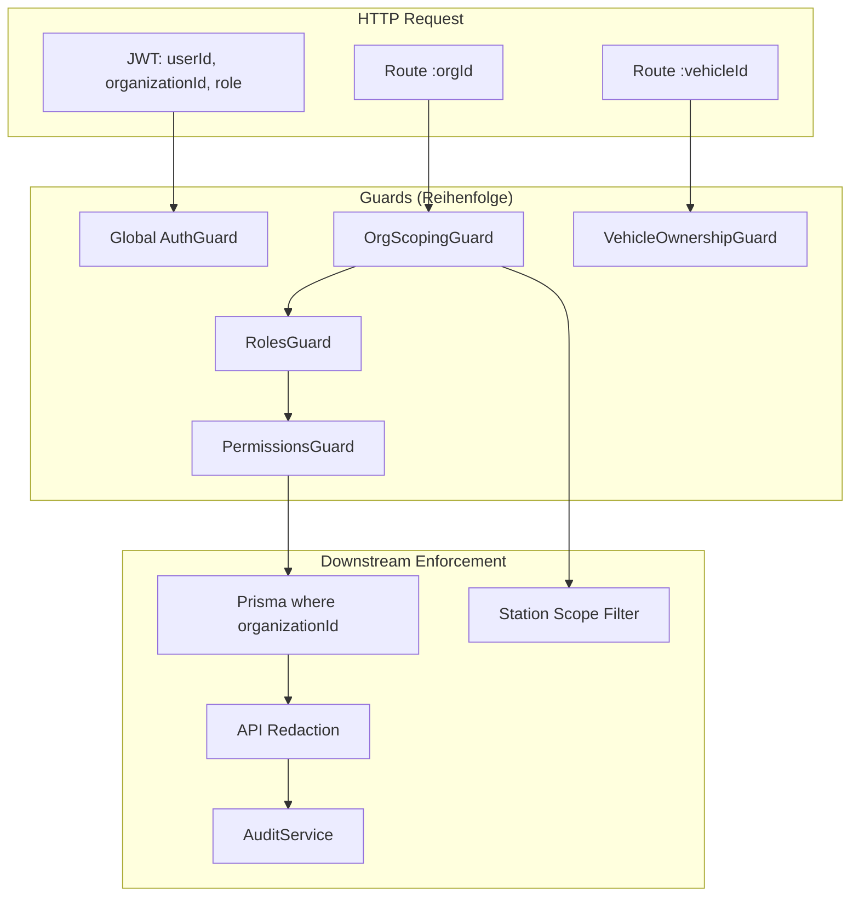

# Vehicle Warnings — Security, RBAC & Tenant Isolation Audit (Prompt 21/26)

| Feld | Wert |
|------|------|
| **Audit-ID** | `vehicle-warnings-production-readiness-2026-07` |
| **Prompt** | **21 von 26** — Security, RBAC, Tenant Isolation |
| **Erstellt (UTC)** | 2026-07-25 |
| **Basis-Commit** | `1d0f2caebe56aa1ecd23295aa33d20e953daa95d` |
| **Vorgänger** | [`19-downstream-consumers-audit.md`](./19-downstream-consumers-audit.md) |
| **Modus** | **Analyse only** — keine Codeänderungen, keine Remediation |
| **Produktionsdaten verändert** | **Nein** |
| **Penetrationstests** | **Nur read-only / negative Specs** — kein hohes Requestvolumen |

**Referenz-Dokumente:**

- [`11-finding-lifecycle-audit.md`](./11-finding-lifecycle-audit.md) — Lifecycle, manuelle Resolution
- [`12-deduplication-idempotency-audit.md`](./12-deduplication-idempotency-audit.md) — Queue-Idempotenz
- [`15-api-contract-consistency.md`](./15-api-contract-consistency.md) — API-Verträge
- [`19-downstream-consumers-audit.md`](./19-downstream-consumers-audit.md) — Verbraucher-Matrix

---

## 1. Executive Summary

Die Vehicle-Warnings-Pfade nutzen **mehrere parallele Sicherheitsschichten**: `OrgScopingGuard` (Multi-Tenant), `RolesGuard`, `PermissionsGuard` (modulbasiert), `VehicleOwnershipGuard` (vehicleId-Pfade), Stations-Scope (Notifications, Rental-Health-Fleet, AI), sowie API-seitige Redaction (`notification-privacy.policy.ts`).

| Thema | Urteil |
|-------|--------|
| Cross-Tenant-Zugriff (fremde Org) | **Blockiert** auf org-scoped Routes via JWT-Mismatch + Membership-Check |
| IDOR (erratenes UUID) | **Meist blockiert** — `findById(id, orgId)`; Lücken **innerhalb** einer Org |
| Cache-Keys mandantenspezifisch | **Ja** für Rental-Health-Summary und Fleet-Map |
| Queue-Jobs mit `organizationId` | **Ja** für Notification-Eval und Battery-V2; **teilweise** bei Tire/Brake-Recalc |
| Worker Re-Verify | **Uneinheitlich** — DIMO/Battery ja; Tire/Brake-Recalc nur `vehicleId` |
| Station-Scope | **Ja** für Notifications + Rental-Health-Fleet; **nein** für Dashboard-Insights und Tasks-Liste |
| DRIVER + Health-Warnings | **Kein NV2-Zugriff** auf `VEHICLE_HEALTH`-Events (`OPS_ROLES` only) |
| CUSTOMER | **Kein** Org-Membership-API-Zugriff auf Health/Notifications |
| Manuelle Statusänderungen | **Autorisiert** nach Rolle + Event-Policy; Health STATE-Warnings **nicht** manuell resolvbar |
| Audit-Logging | **Notifications** ja; **Technical Observations** nein |
| AI Tenant-Bypass | **Nein** — `resolveAiVehicleAccess` vertraut Tool-`organizationId` nicht |
| Rate Limits | **AI-Agent** org/user/IP; Health-APIs **keine** dedizierten Limits |
| WebSocket/SSE | **Nicht vorhanden** für Health/Notifications |

**Kritischste Lücken (Priorität):**

| ID | Lücke | Schwere |
|----|-------|---------|
| SEC-R1 | `VehicleIntelligenceController` ohne `PermissionsGuard` — jeder Org-Member (inkl. DRIVER) kann Health-Module lesen/mutieren | Hoch |
| SEC-R2 | Brake/Battery-Spec `PATCH /:id` ohne Bindung an URL-`vehicleId` (Within-Tenant-IDOR) | Mittel |
| SEC-R3 | `dashboard-insights` ohne Rollen-/Modul-Gate — jeder Org-Member sieht alle Insights | Mittel |
| SEC-R4 | Tasks ohne automatischen Station-Scope für SUB_ADMIN/WORKER | Mittel |
| SEC-R5 | Zwei parallele Station-Scope-Modelle (Stations V2 vs. `membership.stationScope`) | Niedrig |

---

## 2. Scope & Methodik

### 2.1 Im Scope

Security-Relevante Pfade für Vehicle-Warnungen und deren Verbraucher:

- Rental Health (`/organizations/:orgId/.../rental-health`)
- Notification V2 (`/organizations/:orgId/notifications`)
- Dashboard Insights (`/organizations/:orgId/dashboard-insights`)
- Vehicle Intelligence (`/vehicles/:vehicleId/...` — Tires, Brakes, Battery, DTC)
- Technical Observations
- Tasks (Insight-/Health-Automation)
- AI Tools (`get_vehicle_health_summary`)
- Background Jobs (Health-Sync, Notification-Eval, Recalc)
- Cache, Queue-Payloads, Audit-Logs, Exports

### 2.2 Rollenmodell (Schema vs. Matrix)

| Rolle | Prisma `MembershipRole` | Health/Warning-Zugriff |
|-------|-------------------------|------------------------|
| **Master Admin** | `platformRole: MASTER_ADMIN` | Plattformweit; Org-Route mit Bypass |
| **Org Admin** | `ORG_ADMIN` | Volle Org; `fleet.*` implizit |
| **Sub Admin** | `SUB_ADMIN` | Org + Stations-Scope (wenn gesetzt) |
| **Worker** | `WORKER` | Org + Stations-Scope; eingeschränkte Redaction |
| **Driver** | `DRIVER` | Kein NV2 Health; Vehicle-Intelligence ohne Permission-Gate |
| **Customer** | **Nicht in Schema** | Kein Org-Notification-API; externes Portal getrennt |
| **System/Service** | Worker-Prozesse, Cron, BullMQ | Vertrauen auf Job-Enqueue; teils Re-Verify |

### 2.3 Primärquellen (CODE_VERIFIED)

| Bereich | Pfad |
|---------|------|
| Org Scoping | `backend/src/shared/auth/org-scoping.guard.ts` |
| Vehicle Ownership | `backend/src/shared/auth/vehicle-ownership.guard.ts` |
| Permissions | `backend/src/shared/auth/permissions.guard.ts` |
| Station Access V2 | `backend/src/shared/stations/station-access.service.ts` |
| Notification Access | `backend/src/modules/notifications/access/notification-access.matrix.ts` |
| Notification Station Scope | `backend/src/modules/notifications/access/notification-station-scope.service.ts` |
| Notification Privacy | `backend/src/modules/notifications/access/notification-privacy.policy.ts` |
| Notification API | `backend/src/modules/notifications/api/notification-api.service.ts` |
| Manual Resolve Policy | `backend/src/modules/notifications/api/notification-manual-resolution.policy.ts` |
| Available Actions | `backend/src/modules/notifications/api/notification-available-actions.ts` |
| Event Registry | `backend/src/modules/notifications/registry/notification-event-registry.definitions.ts` |
| Rental Health | `backend/src/modules/rental-health/rental-health.controller.ts` |
| Rental Health Cache | `backend/src/modules/rental-health/rental-health-summary-cache.service.ts` |
| Dashboard Insights | `backend/src/modules/business-insights/dashboard-insights.controller.ts` |
| Vehicle Intelligence | `backend/src/modules/vehicle-intelligence/vehicle-intelligence.controller.ts` |
| AI Access | `backend/src/modules/ai/execution/ai-execution-context.access.ts` |
| AI Rate Limit | `backend/src/modules/ai/limits/ai-agent-rate-limit.service.ts` |
| Delivery Idempotency | `backend/src/modules/notifications/delivery/notification-delivery-idempotency.util.ts` |
| Notification Eval Jobs | `backend/src/modules/notifications/runtime/notification-evaluation.types.ts` |
| Technical Observations | `backend/src/modules/technical-observations/technical-observations.controller.ts` |
| Tasks | `backend/src/modules/tasks/tasks.controller.ts` |
| Audit | `backend/src/modules/activity-log/audit.service.ts` |

---

## 3. Architektur — Security Layers



**Zwei Routing-Muster:**

| Muster | Beispiel | Tenant-Grenze |
|--------|----------|---------------|
| **Org-scoped** | `/organizations/:orgId/notifications` | `OrgScopingGuard` + DB `organizationId` |
| **Vehicle-scoped** | `/vehicles/:vehicleId/tires` | `VehicleOwnershipGuard` (vehicle ∈ JWT-Org) |

---

## 4. API-Schutz je Surface

### 4.1 Rental Health

```43:58:backend/src/modules/rental-health/rental-health.controller.ts
@Controller('organizations/:orgId')
@UseGuards(OrgScopingGuard, RolesGuard, PermissionsGuard)
export class RentalHealthController {
  @Get('vehicles/:vehicleId/rental-health')
  @RequirePermission('fleet', 'read')
```

| Prüfpunkt | Ergebnis |
|-----------|----------|
| Org-Scope | `getVehicleHealth` — `where: { id: vehicleId, organizationId: orgId }` |
| Fleet-Liste | `StationAccessService.resolve()` filtert Fahrzeuge |
| Write (Review-Override) | `fleet.write` + explizite Org-Assertion |
| Cache | `rental-health-summary:{orgId}:{vehicleId}:v{N}` |

### 4.2 Notification V2

```31:46:backend/src/modules/notifications/api/notifications.controller.ts
@Controller('organizations/:orgId/notifications')
@UseGuards(OrgScopingGuard, RolesGuard)
@Roles(...NOTIFICATION_READ_ROLES)
```

| Prüfpunkt | Ergebnis |
|-----------|----------|
| Org-Scope | `repository.findById(id, orgId)` |
| Row Access | `assertRowAccessible` — Event `supportedRoles`, Station-Scope, User-Preferences |
| Health Events | `ACTIVE_DTC`, `BATTERY_CRITICAL`, `TIRE_CRITICAL`, `BRAKE_CRITICAL` → `supportedRoles: OPS_ROLES` (**nicht DRIVER**) |
| DRIVER | Nur `BOOKINGS`, `HANDOVERS`, `DRIVING_ANALYSIS` Domains sichtbar |
| Redaction | `redactTemplateParamsForRole` — Billing/Internal Keys |
| Manual Resolve | `MANUAL_RESOLVE_ROLES`: ORG_ADMIN, SUB_ADMIN, WORKER; DRIVER ausgeschlossen |
| Health STATE resolve | `isManualResolutionAllowed` → **false** für `STATE_RESOLUTION` (auto-clear only) |

### 4.3 Dashboard Insights

```7:18:backend/src/modules/business-insights/dashboard-insights.controller.ts
@Controller('organizations/:orgId/dashboard-insights')
@UseGuards(OrgScopingGuard, RolesGuard)
export class DashboardInsightsController {
  @Get()
  async getInsights(@Param('orgId') orgId: string) {
```

| Prüfpunkt | Ergebnis |
|-----------|----------|
| Org-Scope | `getActiveInsights(organizationId)` |
| Rollen | **Kein** `@Roles`, **kein** `@RequirePermission` |
| Station-Scope | **Keiner** — org-weite Insights inkl. Health (`BATTERY_CRITICAL`, …) |
| Inhalt | Kann `bookingId`, `customerId`, Umsatzrisiko in `metrics` enthalten |

### 4.4 Vehicle Intelligence

```122:124:backend/src/modules/vehicle-intelligence/vehicle-intelligence.controller.ts
@Controller('vehicles/:vehicleId')
@UseGuards(RolesGuard, VehicleOwnershipGuard)
export class VehicleIntelligenceController {
```

| Prüfpunkt | Ergebnis |
|-----------|----------|
| Tenant | `VehicleOwnershipGuard` — vehicle.organizationId === JWT org |
| MASTER_ADMIN | Globaler Bypass |
| Permissions | **Kein** `PermissionsGuard` — kein `fleet.read`/`fleet.write` |
| Rollen | **Kein** `@Roles` — DRIVER kann alle Endpoints erreichen |
| Station | **Kein** Station-Filter |

**Within-Tenant-IDOR (SEC-R2):** `BrakesService.update(id)` und `BatteryService.update(id)` patchen per Primärschlüssel ohne Prüfung, dass `spec.vehicleId === route.vehicleId`.

### 4.5 Technical Observations

```26:33:backend/src/modules/technical-observations/technical-observations.controller.ts
@Controller('organizations/:orgId/vehicles/:vehicleId/technical-observations')
@UseGuards(OrgScopingGuard, RolesGuard, PermissionsGuard)
@RequirePermission('fleet', 'read')  // GET
@RequirePermission('fleet', 'write') // POST/PATCH/resolve
```

| Prüfpunkt | Ergebnis |
|-----------|----------|
| Notes | `notes` Feld — nur für `fleet.read`/`fleet.write` Nutzer |
| Customer | Kein API-Zugang |
| Audit | Resolve/Dismiss — **kein** `AuditService.record` gefunden |

### 4.6 Tasks

```46:54:backend/src/modules/tasks/tasks.controller.ts
@UseGuards(OrgScopingGuard, RolesGuard, PermissionsGuard)
@RequireTaskPermission('tasks.read')
```

| Prüfpunkt | Ergebnis |
|-----------|----------|
| Org-Scope | `getTaskById(id, orgId)` |
| Links | `assertLinksBelongToOrg` |
| Station | Optionaler `stationId`-Query-Filter — **kein** Auto-Scope für scoped User |
| Health-Automation | Materialisierung nur serverseitig via Insight-Bridge |

### 4.7 AI Tools

| Prüfpunkt | Ergebnis |
|-----------|----------|
| `get_vehicle_health_summary` | `assertAiToolExecutionAllowed` + `assertAiHealthAccess` |
| Vehicle Resolution | `resolveAiVehicleAccess` — ignoriert Tool-Arg `organizationId` |
| Station Scope | `assertVehicleInAllowedScope` — allow-list oder Station-Match |
| Rollen | MASTER_ADMIN, ORG_ADMIN, SUB_ADMIN, WORKER — **nicht DRIVER** |
| Write | Keine Health-Write-Tools in Domain-Registry |
| Location | Lat/Lon intern für Connectivity; nicht im öffentlichen Output-Schema |

---

## 5. Rollen-Matrix (Vehicle-Warnings-relevant)

| Capability | Master Admin | Org Admin | Sub Admin | Worker | Driver | Customer |
|------------|:------------:|:---------:|:---------:|:------:|:------:|:--------:|
| Rental Health lesen | Ja | Ja¹ | Ja¹ | Ja¹ | Ja¹ | Nein |
| Rental Health Fleet (station-filtered) | Ja | Ja (alle) | Ja (scope) | Ja (scope) | Ja¹ | Nein |
| NV2 Health Notifications | Ja | Ja | Ja² | Ja² | **Nein** | Nein |
| NV2 Booking/Handover | Ja | Ja | Ja² | Ja² | Ja³ | Nein |
| Dashboard Insights (Health) | Ja | Ja | Ja | Ja | Ja | Nein |
| Vehicle Intelligence (DTC/Tires/…) | Ja | Ja | Ja | Ja | **Ja⁴** | Nein |
| Technical Observations + Notes | Ja | Ja¹ | Ja¹ | Ja¹ | Ja¹ | Nein |
| Task lesen (Health) | Ja | Ja⁵ | Ja⁵ | Ja⁵ | Ja⁵ | Nein |
| Notification manuell resolven (Health) | — | — | — | — | — | —⁶ |
| Notification resolve (EVENT-Typen) | Ja | Ja | Ja | Ja | Nein | Nein |
| AI Health Summary | Ja | Ja⁷ | Ja⁷ | Ja⁷ | Nein | Nein |

¹ `fleet.read`/`fleet.write` erforderlich (ORG_ADMIN bypass)  
² Station-Scope wenn `membership.stationScope` gesetzt  
³ Redacted Template Params  
⁴ **Kein Permission-Gate** — SEC-R1  
⁵ `tasks.read` erforderlich  
⁶ Health STATE-Warnings: `autoResolveWhenConditionClears` — manuelles Resolve für alle Rollen **gesperrt**  
⁷ `fleet-condition:read` + `ai-assistant:read`

---

## 6. Querschnittsthemen

### 6.1 `organizationId`-Durchsetzung

| Schicht | Mechanismus |
|---------|-------------|
| HTTP | `OrgScopingGuard` — JWT `organizationId` muss `:orgId` entsprechen |
| DB Reads | Compound `where: { id, organizationId }` |
| Notifications | `findById(id, orgId)` — 404 bei Cross-Tenant |
| MASTER_ADMIN | Bypass mit explizitem `:orgId` in Route |
| Workers | Job `organizationId` oder Vehicle-Lookup → `organizationId` |
| AI | `assertOrganizationMatches` — Tool-Args nicht vertrauenswürdig |

`OrgScopingGuard` protokolliert Cross-Tenant-Versuche via `IamMetricsService.recordCrossTenantDenial('org_scoping')`.

### 6.2 Station Scope

**Notifications** (`NotificationStationScopeService`):

- Gilt für `SUB_ADMIN` und `WORKER` wenn `membership.stationScope` gesetzt
- Lädt `scopedVehicleIds` / `scopedBookingIds` für Station
- Org-weite Events (`isOrgWideNotification`) bypassen Scope

**Rental Health Fleet** (`StationAccessService` — Stations V2):

- `buildVehicleSelectionWhere(orgId, access, filters)` — effektive Station-IDs aus Access-Engine

**Divergenz (SEC-R5):** Notifications nutzen `membership.stationScope` String; Rental Health nutzt `StationAccessService` — können unterschiedliche Fahrzeugmengen liefern.

### 6.3 Cache Keys

| Cache | Key-Format | Org-scoped |
|-------|------------|------------|
| Rental Health Summary | `rental-health-summary:{orgId}:{vehicleId}:v{N}` | **Ja** |
| Fleet Map | `fleet-map:{orgId}:v1` | **Ja** |
| AI Rate Limit | `synqdrive:ai-chat:rate:{scope}:{keyId}:{bucket}` | **Ja** (org scope) |

Spec: `rental-health-summary-cache.service.spec.ts` — unterschiedliche Orgs, gleiches `vehicleId` → unterschiedliche Keys.

### 6.4 Queue Payloads & Background Jobs

| Queue / Job | Payload | `organizationId` | Re-Verify |
|-------------|---------|------------------|-----------|
| `notification-evaluation` | `NotificationEvaluationJobData` | **Required** | Gesamter Run org-scoped |
| `notification.delivery` | `{ outboxId }` | Auf Outbox-Row | Email: `findFirst({ id, organizationId })` |
| `battery-v2` | `BatteryV2JobPayload` | **Required** | Validiert |
| `tire-recalculation` | `{ vehicleId }` | **Nein** | Nur `vehicleId` |
| `brake-recalculation` | `{ vehicleId, organizationId? }` | Optional | Nur `vehicleId` in Processor |
| `dtc-poll-vehicle` | `{ vehicleId, tokenId }` | **Nein** | Lädt `vehicle.organizationId` vor Ingest |
| `dimo-snapshot` | vehicle-basiert | Aus Vehicle-Row | Ja |

**Risiko:** Vehicle-only Jobs vertrauen auf korrektes Enqueue. Fehlerhafte `vehicleId` → Verarbeitung im Kontext des Fahrzeug-Owners (kein Cross-Tenant, aber mögliche falsche Side-Effects innerhalb der Org).

### 6.5 WebSocket / SSE

**Nicht implementiert** für Health-Warnings oder Notifications. Kein Push-Kanal mit separatem Auth-Modell. Clients pollen REST-Endpoints.

### 6.6 Notification Recipients

Flow `notification-delivery-enqueue.service.ts`:

1. `listEligibleMemberships(organizationId, supportedRoles)`
2. Station-Scope pro Membership
3. `isNotificationInScope(row, ctx)`
4. User-Preferences + Quiet Hours
5. Outbox mit `buildDeliveryIdempotencyKey(notificationId, generation, transition, channel, recipientId)`

Health-Warnings (`OPS_ROLES`) gehen **nicht** an DRIVER-Memberships.

### 6.7 Audit Logs

| Aktion | Protokolliert | Mechanismus |
|--------|---------------|-------------|
| Notification acknowledge | Ja | `AuditService.record` — `metaJson.notificationId` |
| Notification snooze | Ja | Ja |
| Notification manual resolve | Ja | Ja — `action: 'resolve'` |
| Notification archive | Ja | Ja |
| Task status change | Ja | `TaskEvent` Tabelle |
| Technical observation resolve | **Nein** | — |
| Tire/Brake rental review override | Ja | `AuditService` in Review-Services |

Audit-Entity für Notifications: `ActivityEntity.ORGANIZATION` (nicht dediziertes Notification-Entity) — forensisch nutzbar, aber schwerer filterbar.

### 6.8 Exports

**Keine dedizierten Export-Endpoints** für Health-Warnings, Notifications oder Insights (kein CSV/Excel).

Verwandt:

- IAM DSAR User Export — nicht Fleet-Health
- Internal `admin/business-insights` — MASTER_ADMIN only

### 6.9 Logging & PII

| Bereich | Befund |
|---------|--------|
| Notification API | Template Params redacted vor Response |
| Insights API | Kann `customerId`, `bookingId`, Umsatz in `metrics` — **keine Redaction** |
| AI Tool Output | Strukturiert; kein explizites Lat/Lon im Schema |
| Server Logs | Health-Sync warnet mit `vehicle.id` — kein systematisches PII-Logging in Rental-Health gefunden |
| Insight Health Gate | Reichert Messages mit Buchungskontext an (Umsatzrisiko) |

### 6.10 Rate Limits & Abuse Controls

| Surface | Rate Limit |
|---------|------------|
| AI Agent Chat | `AiAgentRateLimitService` — pro Org, User, IP (Redis, konfigurierbar) |
| AI Tool Invocations | `maxInvocationsPerRequest` pro Tool (z. B. Health Summary: 2) |
| Notification API | **Kein** dediziertes Rate Limit |
| Rental Health API | **Kein** dediziertes Rate Limit |
| Dashboard Insights | **Kein** dediziertes Rate Limit |
| Org Invite | `InviteRateLimitService` (nicht Health-relevant) |

AI Rate Limit: fail-open bei Redis-Ausfall (logged warning).

---

## 7. Pflichtfragen (13/13)

### F1 — Kann ein Nutzer Findings einer anderen Organisation abrufen?

**Antwort: Nein** (unter normalem JWT-Flow).

- `OrgScopingGuard` blockiert JWT-Org ≠ Route-`:orgId` → `403 Forbidden`
- DB-Queries binden `organizationId`
- Notification `getById` — `findById(id, orgId)` → Cross-Tenant-ID erscheint als 404
- **Ausnahme:** `MASTER_ADMIN` darf jede Org per explizitem `:orgId` (by design)

### F2 — Können IDs erraten und direkt geöffnet werden?

**Antwort: Cross-Tenant nein; Within-Tenant teilweise.**

| Ressource | Schutz |
|-----------|--------|
| Notification UUID | `orgId` in Query — fremde Org → 404 |
| Vehicle (org-route) | Compound lookup |
| Vehicle (VI-route) | `VehicleOwnershipGuard` |
| Brake/Battery Spec UUID | **Schwach** — PATCH ohne vehicle-binding (SEC-R2) |
| Insight UUID | Org-scoped list/get |
| Task UUID | `getTaskById(id, orgId)` |

UUID-Enumeration ist praktisch nicht durchführbar; **Knowledge einer fremden UUID innerhalb derselben Org** kann bei Child-Resources (Spec-ID) ausreichen.

### F3 — Sind Cache Keys mandantenspezifisch?

**Antwort: Ja** für identifizierte Health-relevante Caches.

- `rental-health-summary:{orgId}:{vehicleId}:…`
- `fleet-map:{orgId}:v1`
- AI Rate: `synqdrive:ai-chat:rate:organization:{orgId}:…`

### F4 — Enthalten Queue Jobs `organizationId`?

**Antwort: Teilweise.**

- **Ja:** `notification-evaluation`, `battery-v2`
- **Optional:** `brake-recalculation`
- **Nein:** `tire-recalculation`, `dtc-poll-vehicle` (org aus Vehicle-Row zur Laufzeit)

### F5 — Verifizieren Worker Fahrzeug und Organisation erneut?

**Antwort: Uneinheitlich.**

- **Ja:** DIMO Snapshot, DTC Processor (lädt `vehicle.organizationId`), Battery-V2 (Payload-Validation), Notification-Eval (org-scoped Run)
- **Nein / minimal:** Tire/Brake Recalc Processor — `recalculate(vehicleId)` ohne Org-Check

### F6 — Können Stationsnutzer fremde Stationen sehen?

**Antwort: Abhängig von Surface.**

| Surface | Station-Filter |
|---------|----------------|
| Notifications (SUB_ADMIN/WORKER scoped) | **Ja** — `isNotificationInScope` |
| Rental Health Fleet | **Ja** — `StationAccessService` |
| Dashboard Insights | **Nein** — org-weit |
| Tasks | **Nein** (auto) — nur optionaler Query-Filter |
| Vehicle Intelligence | **Nein** |
| AI Tools | **Ja** — `assertVehicleInAllowedScope` |

SUB_ADMIN/WORKER mit Scope **können** fremde Stationen über Insights und ungefilterte Tasks sehen.

### F7 — Darf ein Driver alle technischen Details sehen?

**Antwort: Teilweise — mit signifikanter Lücke.**

- **NV2 Health-Warnings:** **Nein** — `OPS_ROLES` only, `assertRowAccessible` → 404
- **Rental Health:** **Ja** mit `fleet.read` (Permission, nicht Rollen-Gate)
- **Vehicle Intelligence:** **Ja** — kein `PermissionsGuard` (SEC-R1) — DTC-Codes, Tire/Brake-Daten, Battery-Evidence
- **Dashboard Insights:** **Ja** — org-weite Health-Insights wenn Gate passiert
- **AI Health Summary:** **Nein** — DRIVER nicht in `allowedRoles`

### F8 — Darf ein Customer interne Notes sehen?

**Antwort: Nein** über Org-APIs.

- `MembershipRole` enthält kein `CUSTOMER`
- Technical Observations erfordern `fleet.read`
- Notifications API schließt CUSTOMER aus (`NOTIFICATION_ACCESS_MATRIX`)
- Externes Kundenportal (falls vorhanden) nutzt separate Routen — nicht in diesem Audit-Pfad verifiziert

### F9 — Sind manuelle Statusänderungen autorisiert?

**Antwort: Ja, rollen- und policy-gated.**

| Aktion | Wer | Einschränkung |
|--------|-----|---------------|
| Notification ACK/Snooze | Staff laut `supportedRoles` | Per-User Receipt |
| Notification manual resolve | ORG_ADMIN, SUB_ADMIN, WORKER | `isManualResolutionAllowed` |
| Health STATE resolve | **Niemand** | `autoResolveWhenConditionClears` |
| Technical observation resolve | `fleet.write` | Kein Audit |
| Task complete/cancel | `tasks.complete` / `tasks.cancel` | Org-scoped |
| Tire/Brake review override | `fleet.write` + Audit | Org-scoped |

DRIVER: kann weder resolven noch archivieren.

### F10 — Werden sensible Aktionen protokolliert?

**Antwort: Teilweise.**

- **Ja:** Notification lifecycle actions (ack, snooze, resolve, archive), Tire/Brake review overrides, Task `TaskEvent`
- **Nein:** Technical observation resolve/dismiss/create
- **Lücke:** Audit nutzt `ActivityEntity.ORGANIZATION` statt notification-spezifischer Entity

### F11 — Können AI Tools Tenant-Grenzen umgehen?

**Antwort: Nein** (bei korrektem Tool-Pfad).

- `resolveAiVehicleAccess` lädt Vehicle nur in `ctx.organizationId`
- `organizationId` aus Tool-Args wird explizit nicht vertraut
- Station-Allow-List für scoped User
- Kein Cross-Org Vehicle Lookup ohne MASTER_ADMIN-Kontext

### F12 — Enthalten Logs unnötige Personen-, Standort- oder Bookingdaten?

**Antwort: Teilweise in API-Responses; Server-Logs begrenzt.**

- Insights können `customerId`, `bookingId`, Umsatz enthalten — für berechtigte Org-Member, aber ohne Redaction
- Notification API redacted für DRIVER/WORKER
- AI Health Tool: kein Lat/Lon im Output-Schema
- Server warn-logs in Health-Sync: primär `vehicle.id`, nicht Kundendaten

### F13 — Sind Rate Limits und Abuse Controls vorhanden?

**Antwort: Für AI ja; für Health/Notification REST nein.**

- AI: Org/User/IP Sliding Window (Redis)
- AI Tools: `maxInvocationsPerRequest`
- Health/Notification/Insights APIs: keine dedizierten Throttles
- BullMQ: Job-Idempotenz als Missbrauchsschutz für Side-Effects, nicht für API-Abuse

---

## 8. Read-Only Security Testfälle

> **Hinweis:** Ausschließlich bestehende Specs und dokumentierte negative Pfade. Kein produktives Last- oder Fuzz-Testing.

### 8.1 Cross-Tenant Isolation

| ID | Test | Erwartung | Quelle / Methode |
|----|------|-----------|------------------|
| T-CT-01 | User JWT Org A ruft `GET /organizations/{orgB}/dashboard-insights` auf | `403 Forbidden` | `OrgScopingGuard` — Pattern aus `service-cases.permissions.characterization.spec.ts` |
| T-CT-02 | User Org A ruft `GET /organizations/{orgA}/notifications/{idFromOrgB}` auf | `404 Not Found` | `findById(id, orgId)` |
| T-CT-03 | User Org A ruft `GET /organizations/{orgA}/vehicles/{vehicleFromOrgB}/rental-health` auf | `404 Not Found` | Compound vehicle lookup |
| T-CT-04 | Fleet-map cache key Org A vs Org B | Unterschiedliche Redis-Keys, kein Cross-Hit | `vehicles-security-negative.spec.ts` |
| T-CT-05 | Rental-health cache key Org A vs Org B, gleiches vehicleId | Unterschiedliche Keys | `rental-health-summary-cache.service.spec.ts` |

### 8.2 Role & Permission Enforcement

| ID | Test | Erwartung | Quelle |
|----|------|-----------|--------|
| T-RB-01 | DRIVER listet Notifications mit `ACTIVE_DTC` | Nicht in Liste / 404 bei getById | `supportedRoles: OPS_ROLES`, `assertRowAccessible` |
| T-RB-02 | DRIVER `POST …/notifications/{id}/resolve` | `400` — resolve nicht in availableActions | `MANUAL_RESOLVE_ROLES` excludes DRIVER |
| T-RB-03 | DRIVER Notification BOOKINGS domain | `customerName` redacted | `notification-access.policies.spec.ts` |
| T-RB-04 | User ohne `fleet.read` → Rental Health | `403` | `PermissionsGuard` |
| T-RB-05 | CUSTOMER in access matrix | `apiAccess: false` | `notification-access.policies.spec.ts` |
| T-RB-06 | WORKER scoped station — Notification fremdes Fahrzeug | `404 Not Found` | `NotificationStationScopeService` specs |

### 8.3 Manual Resolution Policy

| ID | Test | Erwartung | Quelle |
|----|------|-----------|--------|
| T-MR-01 | ORG_ADMIN resolve `BATTERY_CRITICAL` (STATE) | `400` — manual resolve not allowed | `isManualResolutionAllowed` + `STATE_RESOLUTION` |
| T-MR-02 | ORG_ADMIN resolve `TECHNICAL_OBSERVATION_ACTIVE` | Erlaubt wenn in availableActions | `notification-manual-resolution.policy.ts` |
| T-MR-03 | Resolve erzeugt Audit-Eintrag | `AuditService.record` mit `notificationId` | `notification-api.service.ts` |

### 8.4 AI Tenant & Limits

| ID | Test | Erwartung | Quelle |
|----|------|-----------|--------|
| T-AI-01 | Tool-Arg `organizationId` ≠ Context | Ignoriert; Vehicle nur in Context-Org | `ai-execution-context.access.ts` |
| T-AI-02 | Scoped User, Vehicle fremde Station | `vehicle_not_found` / deny | `assertVehicleInAllowedScope` |
| T-AI-03 | AI Rate Limit exhausted | `rate_limit` violation | `ai-agent-rate-limit.service.spec.ts` |
| T-AI-04 | Health tool max invocations exceeded | Tool registry deny | `ai-domain-tool-registry.spec.ts` |

### 8.5 Within-Tenant IDOR (bekannte Lücken)

| ID | Test | Erwartung (aktuell) | Risiko |
|----|------|---------------------|--------|
| T-IDOR-01 | User mit Zugriff auf Vehicle A patcht Brake-Spec-ID von Vehicle B (gleiche Org) | **Erfolg möglich** | SEC-R2 |
| T-IDOR-02 | DRIVER GET `/vehicles/{id}/dtc` für Org-Fahrzeug | **200** ohne fleet.read | SEC-R1 |

### 8.6 Delivery & Queue

| ID | Test | Erwartung | Quelle |
|----|------|-----------|--------|
| T-Q-01 | Notification eval job payload | `organizationId` required | `notification-evaluation.types.ts` |
| T-Q-02 | Duplicate delivery enqueue | Idempotency key prevents duplicate outbox row | `notification-delivery-idempotency.util.ts` |
| T-Q-03 | Email delivery liest Notification | `where: { id, organizationId }` | `notification-delivery-channels.service.ts` |

---

## 9. Risiko-Register

| ID | Risiko | Schwere | Betroffene Rollen / Pfade |
|----|--------|---------|---------------------------|
| SEC-R1 | Vehicle Intelligence ohne Permission-Gate | **Hoch** | DRIVER, alle Org-Member |
| SEC-R2 | Child-Resource PATCH ohne vehicle-binding | **Mittel** | Org-Member mit Spec-UUID |
| SEC-R3 | Dashboard Insights ohne Rollenfilter | **Mittel** | Alle Org-Member |
| SEC-R4 | Tasks ohne Auto-Station-Scope | **Mittel** | SUB_ADMIN, WORKER (scoped) |
| SEC-R5 | Zwei Station-Scope-Implementierungen | **Niedrig** | SUB_ADMIN, WORKER |
| SEC-R6 | Tire/Brake Jobs ohne orgId im Payload | **Niedrig** | System |
| SEC-R7 | Technical Observations ohne Audit | **Niedrig** | fleet.write User |
| SEC-R8 | Health/Notification APIs ohne Rate Limit | **Niedrig** | Alle authentifizierten |
| SEC-R9 | Insights enthalten Booking/Customer-Metriken unredacted | **Niedrig** | Alle Org-Member mit Insights-Zugriff |
| SEC-R10 | Audit Entity ORGANIZATION statt NOTIFICATION | **Info** | Forensik |

---

## 10. System / Service Accounts

| Akteur | Zugriffsmodell |
|--------|----------------|
| BullMQ Workers | Kein JWT — vertrauen Job-Payload / DB-Lookup |
| Cron (Insights Eval) | Iteriert Orgs aus DB; `organizationId` pro Run |
| Notification Ingest | `syncVehicleHealthWarnings(organizationId, …)` — org-parametrisiert |
| MASTER_ADMIN API | Expliziter `:orgId`; kein Membership-Zwang |
| Internal Admin (`internal-business-insights`) | `@Roles('MASTER_ADMIN')` |

Worker sind **keine** End-User-Rollen; Isolation hängt von korrektem Enqueue und Vehicle→Org-Auflösung ab.

---

## 11. Zusammenfassung

Die **Multi-Tenant-Grundlage ist solide** für org-scoped REST-Pfade: `OrgScopingGuard`, JWT-Mismatch-Schutz, und compound DB-Queries verhindern Cross-Org-Zugriff auf Vehicle-Warnings in den primären APIs (Rental Health, Notifications, Technical Observations, Tasks).

**Schwächen konzentrieren sich auf Within-Tenant-Autorisierung und Konsistenz:**

1. **Vehicle Intelligence** ist deutlich schwächer abgesichert als Rental Health (kein `PermissionsGuard`, kein Station-Scope).
2. **Dashboard Insights** exponiert Health-Signale org-weit ohne Rollen- oder Stations-Filter.
3. **DRIVER** ist von NV2 Health ausgeschlossen, kann aber über Vehicle Intelligence technische Details sehen.
4. **Health STATE-Notifications** können nicht manuell resolved werden — korrekt für Policy, aber Ack-only für Staff.
5. **Audit-Lücken** bei Technical Observations und generische Audit-Entity für Notifications.

---

## 12. Audit-Metadaten

| Feld | Wert |
|------|------|
| **Geänderte Dateien** | `docs/audits/vehicle-warnings/20-security-tenant-audit.md` (neu) |
| **Remediation** | Keine |
| **Penetrationstests** | Keine — nur Referenz auf bestehende negative/unit specs |
| **SynqDrive Code → Changes** | Nicht aktualisiert (audit-only) |
| **SynqDrive Code → Architektur** | Nicht aktualisiert (audit-only) |
