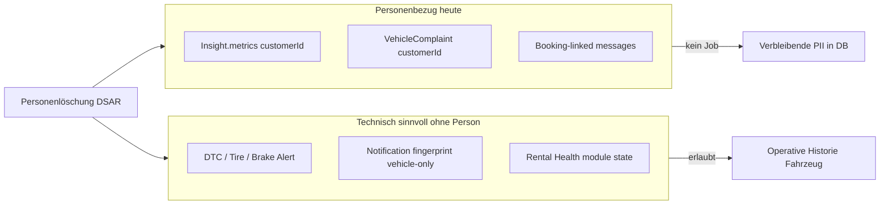

# Vehicle Warnings — DSGVO & ISO-orientierte Production Readiness (Prompt 22/26)

| Feld | Wert |
|------|------|
| **Audit-ID** | `vehicle-warnings-production-readiness-2026-07` |
| **Prompt** | **22 von 26** — DSGVO & ISO-orientierte Bewertung |
| **Erstellt (UTC)** | 2026-07-25 |
| **Basis-Commit** | `1d0f2caebe56aa1ecd23295aa33d20e953daa95d` |
| **Vorgänger** | [`20-security-tenant-audit.md`](./20-security-tenant-audit.md) |
| **Modus** | **Analyse only** — keine Codeänderungen, keine Remediation |
| **Produktionsdaten verändert** | **Nein** |

**Referenz-Dokumente:**

- [`05-telemetry-ingestion-audit.md`](./05-telemetry-ingestion-audit.md) — Telemetrie, Consent-Pfade
- [`11-finding-lifecycle-audit.md`](./11-finding-lifecycle-audit.md) — Retention, Historie
- [`13-severity-readiness-policy-audit.md`](./13-severity-readiness-policy-audit.md) — automatisierte Regeln
- [`19-downstream-consumers-audit.md`](./19-downstream-consumers-audit.md) — PII in Verbrauchern
- [`20-security-tenant-audit.md`](./20-security-tenant-audit.md) — RBAC, Logs, Insights-PII

---

## 1. Haftungsausschluss und Bewertungsrahmen

Dieser Bericht ist eine **technische und organisatorische Gap-Analyse**. Er stellt **keine Rechtsberatung** dar und bestätigt **keine DSGVO-Konformität** oder **ISO-Zertifizierung**.

| Bewertungsebene | Bedeutung |
|-----------------|-----------|
| **Technische Kontrolle** | Im Code, Schema, Scheduler, API, Tests oder Runbooks nachweisbar |
| **Organisatorischer Nachweis** | Vertrag, ROPA, DPIA, Policy, Schulung, Betroffenenprozess — im Repo nicht belegt |
| **Erfüllt** | Kontrolle vorhanden und für Vehicle-Warnings-Pfad relevant |
| **Teilweise erfüllt** | Kontrolle existiert, aber lückenhaft, nicht verdrahtet oder nur für Teilmengen |
| **Nicht erfüllt** | Keine belastbare Kontrolle im geprüften Scope |
| **Organisatorischer Nachweis erforderlich** | Technik allein reicht nicht; rechtliche/organisatorische Entscheidung fehlt |

**Verantwortlicher Rollentyp** (keine Personennennung): typische Owner-Rollen für Nachweise.

**Verifikationsnachweis**: konkrete Artefakte zur Prüfung — Code, Spec, Runbook, ENV, organisatorisches Dokument.

---

## 2. Executive Summary

| Domäne | Gesamturteil | Kurzfassung |
|--------|--------------|-------------|
| **DSGVO — technisch** | **Teilweise** | Mandantentrennung und Health-Notification-Minimierung gut; Retention/Erasure/Insights-PII schwach |
| **DSGVO — organisatorisch** | **Nachweis erforderlich** | Rechtsgrundlagen-Mapping, AV-Verträge, Betroffenenprozesse für Fleet-Warnings nicht im Repo |
| **ISO-orientiert — technisch** | **Teilweise** | Logging, Monitoring, Rule-Versioning, Deploy-Backup stark; Incident/SoD/Approval-Lücken |
| **ISO-orientiert — organisatorisch** | **Nachweis erforderlich** | BCM, Supplier-Audit, formelles Change/VM-Programm nicht warnings-spezifisch belegt |

**Top-Risiken (Vehicle-Warnings-spezifisch):**

| ID | Risiko | Domäne |
|----|--------|--------|
| GDPR-W1 | Insights/Complaints enthalten `customerId`/`bookingId` ohne Redaction und ohne DSAR-Löschpfad | DSGVO Art. 5, 15, 17 |
| GDPR-W2 | Health-Warning-Notifications und Occurrences ohne Retention-Job | Speicherbegrenzung |
| GDPR-W3 | Activity-Logs (`AuditService`) default unbegrenzt (`RETENTION_ACTIVITY_LOGS_DAYS=0`) | Speicherbegrenzung, Minimierung |
| GDPR-W4 | Kein domain-spezifischer Erasure-Orchestrator für Findings nach Personenlöschung | Art. 17, Finding-Historie |
| ISO-W1 | Kein dediziertes Incident-Runbook für Warning/Notification-Pipeline | Incident Management |
| ISO-W2 | Data-Authorization-Enforcement für Alerts-Pipeline explizit TODO | Access Control / Purpose Limitation |

---

## 3. Scope

### 3.1 Im Scope

Vehicle-Warnings-Datenflüsse und deren personenbezogene / sicherheitsrelevante Nebenwirkungen:

- Rental Health, DTC, Tire/Brake/Battery Alerts
- Notification V2 (Health-Events)
- Dashboard Insights (Health-Detektoren)
- Technical Observations / Complaints
- Task-Automation aus Health-Insights
- AI `get_vehicle_health_summary`
- Telemetrie-/Evidence-Tabellen als Warning-Quelle
- Audit-/Activity-Logs für manuelle Warning-Aktionen

### 3.2 Aus Scope (nur Querverweis)

- Vollständiges IAM-DSGVO-Programm (`docs/audits/iam-data-retention-2026-07.md`)
- Buchungsvertrags-Privacy (`architecture/LEGAL_DOCUMENT_PRIVACY_POINTERS_2026-07-22.md`)
- Voice-AI-Retention (`voice-retention`)

---

## 4. DSGVO-Prüfmatrix

Legende **Status**: `✓` erfüllt · `◐` teilweise · `✗` nicht · `ORG` organisatorischer Nachweis erforderlich

| # | Prüfpunkt | Status | Risiko | Technische Befunde | Maßnahme (Empfehlung) | Verantwortlicher Rollentyp | Verifikationsnachweis |
|---|-----------|--------|--------|-------------------|----------------------|---------------------------|----------------------|
| D1 | **Zweckbindung** | ◐ | Mittel | `data-authorization.constants.ts` definiert Zwecke `VEHICLE_HEALTH`, `ALERTS`; Health-Warnings aus Telemetrie/DIMO. Notification-Registry trennt Domains (`VEHICLE_HEALTH`). **Lücke:** `DataAuthorizationEnforcementService` — Alerts-Pipeline TODO, nicht überall enforced | Zweck-Enforcement in Warning-Ingest-Pfad vervollständigen; ROPA-Zweck je Event-Typ | Product + Engineering + Legal/DPO | Code: `data-authorization.constants.ts`; ORG: ROPA-Eintrag pro Warning-Quelle |
| D2 | **Datenminimierung** | ◐ | Mittel | Health-NV2-Events: `templateParams` nur `label` (+ `code` DTC) — **kein** `customerName`. Insights Health-Gate reichert mit `bookingId`, `customerId`, Umsatz an. Complaints: `bookingId`, `customerId`, `locationContext` optional | PII in Insights metrics reduzieren; Complaint-Felder auf operatives Minimum | Product + Engineering | Code: `rental-health-notification.projector.ts`, `insight-health-gate.ts`; API-Review Insights-Response |
| D3 | **Rechtsgrundlagen-Mapping** | ORG | Hoch | Technisch: Data-Authorization-Modell mit `CUSTOMER_CONSENT`, `DIMO`, `SYNQDRIVE_SYSTEM`. **Kein** Repo-Mapping Art. 6 lit. a–f je Warning-Typ | Rechtsgrundlagen-Matrix (Fleet/Telematik/Warnungen) erstellen und an Zwecke koppeln | Legal/DPO + Product | ORG: Verarbeitungsverzeichnis; Tech: `data-authorization.constants.ts` |
| D4 | **Transparenz** | ORG | Mittel | i18n-Hinweise AI/Telematie; Data-Authorization-UI für Mandanten. **Kein** dedizierter Endnutzer-Text zu automatischen Fahrzeugwarnungen | Informationspflichten in Fleet-/Mieter-Kommunikation klären (organisatorisch) | Legal/DPO + Product | ORG: Privacy Notice / Mietvertrag; Tech: `DataAuthorizationDetailDrawer.tsx` |
| D5 | **Rollen und Empfänger** | ◐ | Mittel | Notification-Delivery: `listEligibleMemberships` + Station-Scope; Health-Events `OPS_ROLES` only (nicht DRIVER). Insights: alle Org-Member. Email via Resend Outbox | Insights RBAC; Empfänger-Dokumentation pro Kanal | Engineering + Product | Code: `notification-access.matrix.ts`, Audit 20; ORG: Empfängerliste Resend |
| D6 | **Speicherbegrenzung** | ◐ | Hoch | Insights: inactive delete nach **7 Tagen** (`pruneOldRuns`). Notifications/Complaints: **kein** Scheduler. Evidence-Tabellen: default `RETENTION_*_DAYS=0` (nie löschen). Battery-V2: opt-in Retention | Retention-Policies je Entity-Typ; `expireOrganizationNotifications` verdrahten | Engineering + DevOps + DPO | Code: `retention.config.ts`, `dashboard-insights.repository.ts`; ENV-Dokumentation |
| D7 | **Löschung** | ✗ | Hoch | IAM `IamUserDeletionService` — User/Membership, **nicht** Notifications/Insights/Complaints. `customer-retention.service.ts` — Customer-Modul only | Domain-Erasure-Orchestrator für Warning-Artefakte | Engineering + DPO | Code-Gap-Analyse; ORG: Löschkonzept Fleet |
| D8 | **Anonymisierung** | ◐ | Mittel | IAM IP-Pseudonymisierung (opt-in). Audit-Skripte nutzen Aliase (`VEHICLE_NNN`). **Keine** Anonymisierung von Complaint/Insight-PII | Pseudonymisierungsstrategie für historische Findings | Engineering + DPO | `iam-data-retention.policy.ts`; Audit-Skripte `scripts/audits/` |
| D9 | **Betroffenenrechte** | ◐ | Hoch | DSAR-Export: `GET .../iam/data-retention/dsar/export/:userId` — **IAM-only**. CSV `iam-dsgvo-technical-capability-2026-07.csv`: Fleet-Warnings **MISSING** | DSAR-Paket um Notifications, Insights, Complaints erweitern | Engineering + DPO | Runbook: `iam-data-retention-and-user-rights.md`; Gap-CSV |
| D10 | **Audit Logs** | ◐ | Mittel | Notification ack/resolve/archive → `AuditService`. Technical Observations: **kein** Audit. `metaJson` enthält `notificationId` | Observation-Mutations auditieren; Minimierungsstandard für `metaJson` | Engineering + Security | Code: `notification-api.service.ts`; Spec-Erweiterung |
| D11 | **Standortdaten** | ◐ | Mittel | Warning-APIs/DTOs: **kein** Lat/Lon in Rental Health / NV2 Health output. Telemetrie intern + ClickHouse Waypoints TTL 365d. Connectivity-Episodes nutzen Location intern | Consent-Gate für `GPS_LOCATION` vor operativer Kartenanzeige; Waypoint-TTL policy-align | Engineering + DPO | Audit 05, 20; `002_retention_ttl_and_storage_policy.sql` |
| D12 | **Fahrer-/Kundenzuordnung** | ◐ | Hoch | Health-NV2: Fahrzeugbezug only. Insights: `customerId` in metrics. Complaints: `customerId`, `bookingId`. Pickup-Overdue-Insight: `customerName` | Kundenzuordnung nur wo betrieblich nötig; Redaction in Insights | Product + Engineering | `pickup-overdue.detector.ts`, `insight-health-gate.ts` |
| D13 | **Automatisierte Entscheidungen** | ORG | Mittel | Regelbasierte Warnings, Task-Automation, `rental_blocked` — **kein** Art.-22-Framework, kein Widerspruchs-/Review-Endpunkt | Rechtliche Einordnung + ggf. Human-Review für blockierende Entscheidungen | Legal/DPO + Product | ORG: DPIA/Freigabe; Tech: `13-severity-readiness-policy-audit.md` |
| D14 | **AI-Verarbeitung** | ◐ | Mittel | `get_vehicle_health_summary`: tenant-scoped, strukturierte Slices, Rate-Limits, **kein** Write-Tool. **Kein** expliziter Data-Authorization-Check vor Health-Read. Chat-Logs-Retention warnings-spezifisch unklar | Authorization-Check; AI-Transparenz in UI; Retention für AI-Sessions | Engineering + DPO | `ai-get-vehicle-health-summary.tool.ts`, `ai-agent-rate-limit.service.ts` |
| D15 | **Auftragsverarbeiter** | ORG | Mittel | DIMO in Data-Authorization als Quelle; Resend für E-Mail-Delivery. **Kein** zentrales AV-Verzeichnis für Warning-Pipeline im Repo | AVV/DPA-Register (DIMO, Resend, Hosting, LLM-Provider) | Legal/DPO + Procurement | ORG: Verzeichnis AV; Tech: Delivery-Outbox → Resend |
| D16 | **Drittlandtransfer** | ORG | Mittel | LLM/Resend/DIMO je nach Vertrag/Region — **nicht** im Code als Transfer-Entscheidung dokumentiert | Transfer-Freigabe und TIA pro Subprocessor | Legal/DPO | ORG: AVV-Anhänge; Tech: Provider-Konfiguration |
| D17 | **Incident Handling** | ◐ | Mittel | Runbooks: IAM, Voice, Tire/Brake Rollout, Evaluations-Observability. **Kein** Warning-PII-Leak-/False-Positive-Runbook | Runbook für Notification/Insight-Incidents | Security + DevOps | `docs/operations/evaluations-observability-runbook.md`; Gap: dediziertes Warning-IR |
| D18 | **Privacy by Design** | ◐ | Mittel | NV2 Response-Redaction; Fingerprint-Dedup; Health-Gate reduziert Raw-Insights. Gegenentwurf: Insights unredacted, Complaint ohne Dedup | Redaction parity Insights↔Notifications; Dedup Complaints | Engineering + Product | `notification-privacy.policy.ts` vs Insights API |
| D19 | **Privacy by Default** | ◐ | Mittel | `UserNotificationPreference`: `email: true` default. Critical Health: `criticalOverridesPreferences` → In-App nicht abschaltbar. IAM-CSV: `privacy_by_default` = PARTIAL_WEAK | Default Email für Health opt-in prüfen; Dokumentation Pflichtmeldungen | Product + DPO | Schema `UserNotificationPreference`; `notification-mandatory.policy.ts` |

---

## 5. ISO-orientierte Prüfmatrix

> ISO 27001/27701 werden hier als **orientierende Kontrollfamilien** verwendet — **ohne** Konformitätsbehauptung.

| # | Prüfpunkt | Status | Risiko | Technische Befunde | Maßnahme (Empfehlung) | Verantwortlicher Rollentyp | Verifikationsnachweis |
|---|-----------|--------|--------|-------------------|----------------------|---------------------------|----------------------|
| I1 | **Asset Inventory** | ◐ | Mittel | Audit-Serie `01-repository-inventory.md`, `03-warning-data-lineage.md` — Code-Artefakte. **Kein** formales CMDB-Register | Asset-Liste Warning-Pipeline in ISMS pflegen | Security + Engineering | Audit-Docs; ORG: Asset-Register |
| I2 | **Access Control** | ◐ | Hoch | OrgScoping, RBAC, Notification-Matrix — Audit 20. Lücken: Vehicle Intelligence, Insights ohne Permission-Gate | SEC-R1/R3 schließen | Engineering + Security | `20-security-tenant-audit.md`, negative specs |
| I3 | **Change Management** | ORG | Mittel | Git/PR/Deploy-Skript `vps-deploy-release.sh`; **kein** warnings-spezifisches CAB-Protokoll | Change-Record für Registry/Policy-Änderungen | DevOps + Engineering | ORG: Change-Policy; Tech: Deploy-Skript |
| I4 | **Secure Development** | ◐ | Mittel | Security-negative specs (vehicles, IAM, notifications policies). Keine dedizierte SAST-Gate warnings-only | Security-Tests für Insights-PII, IDOR Specs erweitern | Engineering + Security | `*.security.spec.ts`, `notification-access.policies.spec.ts` |
| I5 | **Logging** | ◐ | Mittel | `AuditService`, `TaskEvent`, Prometheus ohne PII-Labels (`fleet-health-prometheus.metrics.ts`). Activity-Logs unbounded default | TTL + Scrub-Standard; Observation-Audit | Engineering + Security | `retention.config.ts`, `audit.service.ts` |
| I6 | **Monitoring** | ✓ | Niedrig | Fleet-Health-Observability, Evaluations-Observability, Notification-Eval-Metriken, Grafana Dashboard | Alert für Eval-Fehler/Warteschlangen-Lag aktiv halten | DevOps + SRE | `evaluations-observability-runbook.md`, `alerts.yml` |
| I7 | **Incident Management** | ◐ | Mittel | Adjacent Runbooks; Evaluations-Alerts. **Kein** Warning-spezifisches IR | Runbook + Playbook False-Positive-Mass-Notify | Security + Operations | Runbook-Gap; On-Call-Verknüpfung ORG |
| I8 | **Backup/Restore** | ✓ | Niedrig | VPS-Deploy: DB-Backup vor Migrate; Runbooks `vehicle-operational-status-repair.md`, Tire-Rollout | Restore-Test für Notification/Insight-Tabellen periodisch | DevOps | `vps-deploy-release.sh`, Runbooks |
| I9 | **Business Continuity** | ORG | Mittel | Multi-tenant SaaS; Redis/Postgres Abhängigkeiten. **Kein** warnings-spezifisches RTO/RPO | BCM-Szenario „Insights/Notifications ausgefallen“ | DevOps + Product | ORG: BCM-Dokument |
| I10 | **Supplier Management** | ORG | Mittel | DIMO/Resend technisch angebunden; kein Supplier-Assessment im Repo | Jährliches Vendor-Review Telemetrie/Email/AI | Legal + Procurement | ORG: Vendor-Register |
| I11 | **Vulnerability Management** | ORG | Mittel | Repo-Standard (deps, CI) — nicht warnings-spezifisch auditiert | VM-Prozess auf Nest/Prisma/Redis anwenden | Security + DevOps | ORG: VM-Programm; CI-Scan-Ergebnisse |
| I12 | **Configuration Management** | ◐ | Mittel | ENV: `NOTIFICATIONS_V2`, Retention-Flags, `IAM_DATA_RETENTION_*`. Feature-Flags dokumentiert in Runbooks | Config-Baseline pro Umgebung versionieren | DevOps | `backend/.env.example`, Runbooks |
| I13 | **Segregation of Duties** | ◐ | Mittel | Manual Resolve: WORKER+ (nicht DRIVER). Health STATE: nicht manuell resolvierbar. **Kein** Vier-Augen für Policy-Änderungen | Approval für Insight-Policy / Automation-Overrides | Product + Security | `notification-available-actions.ts`, `tenant-insight-policy.service.ts` |
| I14 | **Rule Versioning** | ✓ | Niedrig | `fingerprintVersion` pro Notification-Event; `ruleVersion` Task-Automation; Booking-Gatekeeper-Hash | Version-Bump-Prozess bei Registry-Änderungen dokumentieren | Engineering | `notification-event-registry.definitions.ts`, `task-automation-rule.catalog.ts` |
| I15 | **Approval sicherheitskritischer Regeln** | ◐ | Mittel | Tenant Insight Policy per API änderbar (`ORG_ADMIN`). Automation Org-Overrides — Audit-Felder vorhanden. **Kein** expliziter Approval-Workflow | Vier-Augen oder Audit-Pflicht für Health-Automation-Overrides | Product + Security | `task-automation-audit.util.ts` |
| I16 | **Testnachweise** | ◐ | Mittel | Unit/Integration: notification policies, retention specs, IAM security, fleet-health integration. **Keine** E2E DSAR-Warning-Tests | Read-only Security-Matrix aus Audit 20 automatisieren | Engineering + QA | `*.spec.ts` Inventar §8 Audit 20 |
| I17 | **Deployment/Rollback** | ✓ | Niedrig | `cloud-agent-deploy.sh` → `vps-deploy-release.sh`; Health-Check; DB-Backup | Rollback nach fehlerhaftem Notification-Registry-Deploy üben | DevOps | `AGENTS.md`, Deploy-Skript |
| I18 | **Auditierbarkeit** | ◐ | Mittel | Notification-Lifecycle auditierbar; System-generierte Warnings **ohne** per-Finding-Audit. Rule-Version in Metadata | Strukturiertes Audit-Event für Ingest/Sweep | Engineering + Security | `notification-api.service.ts`; Gap: auto-create |

---

## 6. Zusätzliche Prüfpunkte (explizit gefordert)

| Frage | Status | Risiko | Befund | Maßnahme | Verantwortlicher | Verifikationsnachweis |
|-------|--------|--------|--------|----------|------------------|----------------------|
| **Enthalten Warnmeldungen unnötig PII?** | ◐ | Mittel | NV2 Health: minimal (`label`, `code`). Insights/Complaints/Booking-Insights: **ja** (`customerId`, `customerName`, Umsatz) | Felder streichen oder redacten | Product + Engineering | API-Sample Insights vs NV2 DTO |
| **Ist Kundenname in jeder operativen Ansicht erforderlich?** | ✗ (fachlich) | Mittel | **Nein** für reine Fahrzeug-Health (NV2, Rental Health Modul). **Ja** in Pickup-Overdue, Health-Gate-Booking-Risk, aktive Mietungen-Drawer — betrieblich begründet, nicht überall nötig | UX-Review: Kundenname nur in booking-gekoppelten Views | Product | Audit 18, `pickup-overdue.detector.ts` |
| **Speichern Logs Kennzeichen, Standorte, Bookingdaten übermäßig?** | ◐ | Mittel | `label` oft Kennzeichen in Notifications. Audit `metaJson`: `notificationId` — ok. Activity-Logs: IP/UA. Server warn-logs: `vehicle.id`. Insights in DB mit Booking-Metriken | Log-Standard; Kennzeichen in Logs vermeiden wo möglich | Engineering + Security | Log-Sampling Review; `retention.config.ts` |
| **Ist AI-Kontext minimiert?** | ✓ | Niedrig | Health-Summary-Tool: Domain-Slices, kein Lat/Lon im Output-Schema; max 2 Invocations/Request | Beibehalten; Tool-Output-Review bei Erweiterungen | Engineering | `ai-domain-tool-registry.definitions.ts` |
| **Sind Aufbewahrungsfristen differenziert?** | ◐ | Hoch | Ja zwischen Domänen (Insights 7d inactive, Poll-Logs 30d, Battery opt-in), aber **nicht** für Notifications/Complaints/Health-Alerts konsistent | Retention-Matrix pro Tabelle freigeben | DPO + DevOps + Engineering | `retention.config.ts`, `dashboard-insights.repository.ts` |
| **Finding-Historie nach Personenlöschung ohne unnötigen Personenbezug?** | ✗ | Hoch | Historische Rows (Notification, Insight, Complaint, Task) können `customerId`/Namen behalten; **kein** Re-Link/Erase-Job. Fahrzeug-Finding ohne Person **bleibt** (z. B. DTC) — korrekt, wenn keine Personenfelder | Erasure-Job: Personenfelder nullen/anonymisieren, technische Finding-Historie erhalten | Engineering + DPO | Löschkonzept; Schema `VehicleComplaint`, `DashboardInsight.metrics` |

### 6.1 Finding-Historie nach Personenlöschung — Detail

**Technisch möglich heute:** Fahrzeugbezogene Warnings ohne Personenfelder überleben unabhängig. **Nicht umgesetzt:** gezieltes Entfernen von `customerId`/`customerName` aus abhängigen Findings bei Kundenlöschung.

---

## 7. Technische vs. organisatorische Gesamtbewertung

### 7.1 DSGVO — Kontrollübersicht

| Kategorie | Erfüllt | Teilweise | Nicht | ORG-Nachweis |
|-----------|---------|-----------|-------|--------------|
| Anzahl Prüfpunkte (D1–D19) | 0 | 14 | 1 | 4 |

**Stärken:** Mandantenisolation; Health-Notification-Param-Minimierung; AI-Tool-Minimierung; Data-Authorization-Modell (Zwecke/Kategorien); Insights-Kurzzeit-Prune.

**Schwächen:** Kein Fleet-Warning-Erasure; unbounded Notifications/Complaints; Insights-PII; IAM-DSAR nicht erweitert; Rechtsgrundlagen/AVV nur organisatorisch.

### 7.2 ISO-orientiert — Kontrollübersicht

| Kategorie | Erfüllt | Teilweise | Nicht | ORG-Nachweis |
|-----------|---------|-----------|-------|--------------|
| Anzahl Prüfpunkte (I1–I18) | 4 | 11 | 0 | 3 |

**Stärken:** Monitoring/Observability; Rule-Versioning; Deploy+Backup; Prometheus ohne PII-Labels.

**Schwächen:** Incident/BCM/Supplier formal; SoD/Approval; Access-Control-Lücken (Audit 20); Testlücken DSAR.

---

## 8. Production-Readiness-Urteil (DSGVO/ISO)

| Dimension | Urteil | Begründung |
|-----------|--------|------------|
| **Technische DSGVO-Readiness** | **Nicht production-ready** ohne Retention/Erasure/Insights-Redaction | Hochrisiko-Lücken GDPR-W1–W4 |
| **Organisatorische DSGVO-Readiness** | **Nachweis ausstehend** | ROPA, AVV, Betroffenenprozesse, Art.-22-Einordnung |
| **Technische ISO-Readiness (orientierend)** | **Teilweise production-ready** | Ops/Monitoring/Versioning gut; IR/SoD schwächer |
| **Organisatorische ISO-Readiness** | **Nachweis ausstehend** | BCM, VM, Supplier, Change formal |

**Kein Go-Live-Compliance-Versprechen** — empfohlene Freigabe nur nach Schließung der Hochrisiko-Punkte **und** organisatorischer Freigabe durch DPO/Legal.

---

## 9. Priorisierte Maßnahmen-Backlog (Audit-Empfehlungen, keine Umsetzung)

| Prio | ID | Maßnahme | Typ | Owner-Rolle |
|------|-----|----------|-----|-------------|
| P0 | GDPR-W1 | Insights-PII redacten oder RBAC einschränken | Technisch | Engineering |
| P0 | GDPR-W4 | Erasure-Orchestrator Personenfelder in Complaints/Insights/linked Tasks | Technisch | Engineering + DPO |
| P0 | D3 | ROPA/Rechtsgrundlagen-Matrix Fleet-Warnings | Organisatorisch | Legal/DPO |
| P1 | GDPR-W2 | Notification + Occurrence Retention-Scheduler | Technisch | Engineering + DevOps |
| P1 | GDPR-W3 | `RETENTION_ACTIVITY_LOGS_DAYS` policy-setzen + Legal Hold | Technisch + ORG | DevOps + DPO |
| P1 | D15 | AVV-Register DIMO/Resend/LLM | Organisatorisch | Legal |
| P1 | ISO-W1 | Runbook Vehicle-Warnings Incident | Technisch + ORG | Security + Ops |
| P2 | D13 | Art.-22-Einordnung automatisierter Readiness/Block-Regeln | Organisatorisch | Legal/DPO |
| P2 | ISO-W2 | Data-Authorization Enforcement Alerts-Pipeline | Technisch | Engineering |
| P2 | D19 | Privacy-by-Default Review Notification Email | Product + DPO | Product |

---

## 10. Verifikationsnachweise — Inventar (read-only)

| Artefakt | Pfad | Relevanz |
|----------|------|----------|
| Retention-Konfiguration | `backend/src/config/retention.config.ts` | Speicherbegrenzung |
| IAM Retention Runbook | `docs/runbooks/iam-data-retention-and-user-rights.md` | Betroffenenrechte |
| IAM DSGVO Capability CSV | `docs/audits/data/iam-dsgvo-technical-capability-2026-07.csv` | Gap-Register |
| Notification Privacy | `backend/src/modules/notifications/access/notification-privacy.policy.ts` | Minimierung API |
| Mandatory Notifications | `backend/src/modules/notifications/access/notification-mandatory.policy.ts` | Privacy by Default |
| Insights Prune | `backend/src/modules/business-insights/dashboard-insights.repository.ts` | 7-Tage-Löschung |
| Data Authorization | `backend/src/modules/data-authorizations/data-authorization.constants.ts` | Zweckbindung |
| Enforcement TODOs | `backend/src/modules/data-authorizations/data-authorization-enforcement.service.ts` | Lücken |
| AI Health Tool | `backend/src/modules/ai/tools/get-vehicle-health-summary/` | AI-Minimierung |
| Security Audit | `docs/audits/vehicle-warnings/20-security-tenant-audit.md` | Access, Logs |
| Evaluations Runbook | `docs/operations/evaluations-observability-runbook.md` | Monitoring |
| Battery Retention Arch | `docs/architecture/battery-v2-retention.md` | Differenzierte TTL |
| ClickHouse TTL | `backend/src/modules/clickhouse/migrations/002_retention_ttl_and_storage_policy.sql` | Standort/ Telemetrie |

---

## 11. Audit-Metadaten

| Feld | Wert |
|------|------|
| **Geänderte Dateien** | `docs/audits/vehicle-warnings/21-dsgvo-iso-readiness.md` (neu) |
| **Remediation** | Keine |
| **Rechtsberatung** | **Nicht enthalten** — Legal/DPO muss separat bewerten |
| **ISO-Konformität** | **Nicht bestätigt** — orientierende Kontrollprüfung only |
| **SynqDrive Code → Changes** | Nicht aktualisiert (audit-only) |
| **SynqDrive Code → Architektur** | Nicht aktualisiert (audit-only) |
