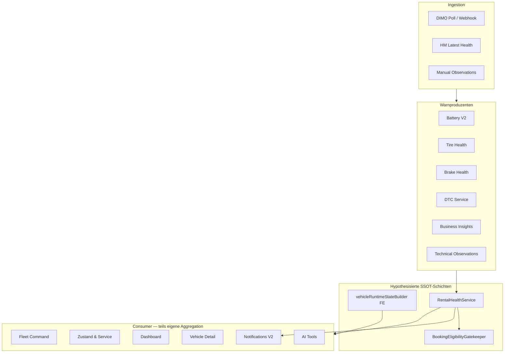

# Vehicle Warnings — Production Readiness Audit (Final Report)

| Feld | Wert |
|------|------|
| **Audit-ID** | `vehicle-warnings-production-readiness-2026-07` |
| **Prompt** | **26 von 26** — Abschlussbericht |
| **Erstellt (UTC)** | 2026-07-25 |
| **Repository-Basis-Commit** | `1d0f2caebe56aa1ecd23295aa33d20e953daa95d` |
| **Prod-Runtime-Snapshot** | `6080dbd2` (2026-07-25, Host anonymisiert `VPS-PROD-01`) |
| **Audit-Branch** | `cursor/vehicle-warnings-audit-charter-c960` |
| **Modus** | **Analyse only** — keine Produktionsdaten verändert |
| **Charter** | [`00-audit-charter-2026-07.md`](./00-audit-charter-2026-07.md) |
| **Findings-Register** | [`22-consolidated-findings.md`](./22-consolidated-findings.md) |
| **Remediation** | [`remediation/vehicle-warning-remediation-plan.md`](./remediation/vehicle-warning-remediation-plan.md) |
| **Post-Remediation Acceptance** | [`acceptance/post-remediation-acceptance-plan.md`](./acceptance/post-remediation-acceptance-plan.md) |

**Haftungsausschluss:** Dieser Bericht ist eine technische Production-Readiness-Bewertung. Er stellt keine Rechtsberatung, keine DSGVO-Konformitätsbescheinigung und keine ISO-Zertifizierung dar.

---

## 1. Executive Summary

SynqDrive wurde in einem **26-Prompt-Audit** (Juli 2026) auf Production Readiness der Fahrzeugwarnungen und aller damit verbundenen operativen Zustände geprüft. Der Audit umfasste vollständige Code-Inventur, Datenlinie, Lifecycle, Idempotenz, Severity-Policy, Runtime-Projektion, API- und UI-Konsistenz, Downstream-Consumer, Security/RBAC, DSGVO/ISO-orientierte Kontrollen sowie einen **read-only Produktionslauf** auf `VPS-PROD-01`.

### 1.1 Kernergebnis

| Metrik | Wert |
|--------|------|
| Inventarisierte Komponenten | 164 (`01-repository-inventory.md`) |
| Roh-Feststellungen (vor Dedup) | ~200 |
| **Kanonische Findings** | **42** (`VW-F-001` … `VW-F-042`) |
| **P0 (offen)** | **11** |
| **P1 (offen)** | **17** |
| **P2 (offen)** | **11** |
| **P3 (offen)** | **3** |
| **Production Ready (Audit-Urteil)** | **NEIN — NOT READY** |

### 1.2 Stärken (bewiesen)

- `RentalHealthService` und `BookingEligibilityGatekeeper` bilden einen soliden Backend-Kern für Modul-Health und Buchungsentscheidungen.
- Cross-Tenant-Isolation auf org-scoped REST-Pfaden (`OrgScopingGuard`, compound DB queries) — **kein Cross-Tenant-Leak reproduziert** (Audit 20).
- Tire/Brake-Alert-Dedup, Notification-Fingerprint und DIMO-Poll ~100 % SUCCESS/24h (Runtime).
- Health-API `/api/v1/health` stabil 200; keine unhandled exceptions in 24h error.log tail.

### 1.3 Kritische Lücken (bewiesen)

- **Keine globale `findingId`** — 7+ parallele Identitätsschichten (Notifications, Insights, Tasks, Operational Issues).
- **12+ parallele FE/BE-Projektionen** für Counts, Severity und Readiness → dokumentierte KPI-Drift (Symptome Charter §10).
- **P0 Security:** Vehicle Intelligence ohne `PermissionsGuard`; Insights mit PII ohne RBAC/DSAR.
- **P0 Datenintegrität:** DTC ohne DB-Dedup; CASCADE DELETE auf Evidence; parallele `blocksRental`-Pfade.
- **P1 Runtime:** Battery V2 — 26 failed Jobs, recurring `HANDLER_FAILED` alle ~5 min (Prod).

### 1.4 Verbindliches Urteil

**Go/No-Go: NO-GO** für „Single Source of Truth“ Production Readiness.

„Production Ready“ darf erst festgestellt werden, wenn:
1. alle **P0** geschlossen,
2. alle **P1** geschlossen oder **formal akzeptiert** (mit Risiko-Owner und Verfallsdatum),
3. sämtliche **Acceptance Gates** in [`acceptance/post-remediation-acceptance-plan.md`](./acceptance/post-remediation-acceptance-plan.md) mit **Beweisen** bestanden wurden.

**Empfohlene nächste Phase:** Implementierung **Phase 0 + 1** (Security Hotfix WP-B0 + Contracts WP-01) gemäß [`remediation/implementation-sequence.md`](./remediation/implementation-sequence.md).

---

## 2. Scope

### 2.1 Im Scope

| Domäne | Abgedeckt in |
|--------|--------------|
| Vehicle Warnings / Health Findings | Audits 06–09, 11, 12 |
| DTC, Battery, Tire, Brake | Audits 06–08 |
| Telemetry / Connectivity | Audits 05, 10, Runtime |
| Rental Health / Readiness / Blocking | Audits 13, 14, 18 |
| Fleet Command, FHS, Dashboard | Audits 16, 17, 18 |
| API Contracts | Audit 15 |
| Notifications, Insights, AI, Automation | Audits 19, 21 |
| Security / RBAC / Tenant | Audit 20 |
| DSGVO / ISO-orientiert | Audit 21 |
| Prod Runtime (read-only) | `runtime/*` |

### 2.2 Aus Scope

- Penetrationstests und aktive Exploitation
- Produktions-Remediation (kein Code geändert)
- ISO-Zertifizierung / Rechtsgutachten DSGVO
- Nicht-Fleet-Module ohne Warnungsbezug

---

## 3. Methodik

| Phase | Prompts | Methode |
|-------|---------|---------|
| Charter & Inventur | 1–2 | Statische Code-Analyse, CSV-Inventar |
| Datenmodell & Lineage | 3–4 | Prisma-Schema, FK, CASCADE |
| Ingestion & Domänen | 5–10 | Service-Trace, DIMO-Pfade |
| Lifecycle & Dedup | 11–12 | FSM-Mapping, Unique-Constraints |
| Policy & Runtime | 13–14 | Matrix R-01–R20, Builder-Trace |
| API & UI | 15–18 | Contract-Vergleich, Component-Trace |
| Consumer & Security | 19–20 | Consumer-Map, negative specs |
| DSGVO/ISO & Runtime | 21, 23 | Checklisten, VPS read-only |
| Konsolidierung & Plan | 24–25 | Dedup → 42 Findings, WP-Plan |
| Abschluss | 26 | Dieser Bericht + Acceptance |

**Epistemische Kennzeichnung:** CODE_VERIFIED, API_VERIFIED, PRODUCTION_DATA_VERIFIED, LOG_VERIFIED, HYPOTHESIS (Charter §4.2).

**PII:** Alle Evidence anonymisiert (`ORG_###`, `VEHICLE_###`); keine Secrets in Git.

---

## 4. Repository-Ausgangszustand

| Feld | Wert |
|------|------|
| **Commit** | `1d0f2caebe56aa1ecd23295aa33d20e953daa95d` |
| **Branch (Audit-Start)** | `main` |
| **Stack** | NestJS Backend, Vite/React Frontend, Prisma, BullMQ, Redis, PostgreSQL |

### 4.1 Architektur-Überblick (vereinfacht)



### 4.2 Inventur-Kennzahlen

| Kategorie | Anzahl |
|-----------|-------:|
| Warnproduzenten | 62 |
| Aggregatoren | 31 |
| APIs | 6 |
| UI-Konsumenten | 34 |
| Eigenständige Statusberechnungen (`derives_status`) | 47 |
| SSOT-Risiko medium/high | 84 |

Quelle: [`01-repository-inventory.md`](./01-repository-inventory.md), [`evidence/repository-warning-components.csv`](./evidence/repository-warning-components.csv).

---

## 5. Produktionsausgangszustand

**Snapshot-Zeit:** 2026-07-25T17:53Z UTC  
**Deploy-Commit (Prod):** `6080dbd2` (≠ Audit-Basis — dokumentierte Drift möglich)

| Signal | Beobachtung | Quelle |
|--------|-------------|--------|
| Health API | 200 OK | Runtime |
| DIMO Poll 24h | ~100 % SUCCESS | `runtime/ingestion-observations.md` |
| Battery V2 Queue | 26 failed jobs | `runtime/queue-observations.md` |
| Error log | ~917 health-keyword lines/24h; Battery V2 dominant | `runtime/application-log-observations.md` |
| PM2 Restarts (kumulativ) | 3161 (Instanz stabil ~9h post-deploy) | Runtime |
| Nginx 502 (Deploy-Fenster) | 12 | Runtime |
| Redis Health-Cache | 0 Keys (kalt) | `runtime/redis-observations.md` |
| Active DTC (Stichprobe) | 1 org-weit | Ingestion snapshot |
| NV2 Health aktiv | 1 Org, ~5 Fahrzeuge | Ingestion snapshot |

**Keine P0 Runtime-Incidents** im 24h-Fenster außer Battery-V2-Fehlerkette (P1, wiederkehrend).

---

## 6. Architektur und Datenfluss

### 6.1 Kanonische Owner-Matrix (bewertet)

| Dimension | Intended Owner | Ist-Zustand | Bewertung |
|-----------|----------------|-------------|-----------|
| Modul-Health | `RentalHealthService` | Funktional SSOT für Module | **Teilweise OK** |
| Buchungsblockade | `BookingEligibilityGatekeeper` | Gate OK; parallele Block-Flags außerhalb | **P0 Gap** |
| Runtime Readiness | `vehicleRuntimeStateBuilder` | Nur FE; API fehlt `rentalReadiness` | **P0/P1 Gap** |
| Finding Identity | *Nicht definiert* | 7+ parallele Keys | **P1 Gap** |
| Severity Counts | Runtime Projection (Ziel) | 12+ Aggregationen | **P0/P1 Gap** |
| Notifications | Notification V2 + fingerprint | Kein `findingId` | **P1 Gap** |

Quellen: [`02-canonical-status-model.md`](./02-canonical-status-model.md), [`03-warning-data-lineage.md`](./03-warning-data-lineage.md).

### 6.2 Datenfluss-Lücken

1. **Producer → Aggregator:** Health-Module schreiben Alerts; Rental Health liest und aggregiert — OK.
2. **Aggregator → UI:** UI re-aggregiert parallel (`fleetVisualState`, FHS KPIs) — **SSOT-Verletzung**.
3. **Block-Pfade:** Complaints, Tasks, ServiceCase, Damage FE — nicht vollständig in `collectBlockingReasons` — **P0**.
4. **Downstream:** Notifications/Insights/AI ohne gemeinsame `findingId` — Korrelation erschwert.

---

## 7. Single-Source-of-Truth-Bewertung

| Kriterium (Charter §3) | Erfüllt | Beweis |
|------------------------|---------|--------|
| Eine kanonische Backend-Wahrheit pro Dimension | **Nein** | 12+ parallele Projektionen |
| Consumer ohne Neuberechnung | **Nein** | FE Runtime Builder, FHS, Fleet Command |
| Keine stillen Fallbacks zu grün | **Teilweise** | Gatekeeper fail-closed; UI teils leer statt UNKNOWN |
| Zähler aus gleichem Modell | **Nein** | KPI 2 vs 4 dokumentiert (Audit 16–17) |
| Globale Finding-Identität | **Nein** | VW-F-001 |

**SSOT-Reifegrad: 35 %** (qualitativ) — Backend-Kern vorhanden, Consumer-Fragmentierung kritisch.

---

## 8. Wichtigste P0/P1-Findings

### 8.1 P0 (11 offen)

| ID | Titel | Komponente |
|----|-------|------------|
| VW-F-002 | Parallele `blocksRental`-Pfade | Gatekeeper, Complaints, Tasks, Damage FE |
| VW-F-003 | Connectivity/Telemetrie drei Schichten | Fleet-map, Connectivity API, Runtime |
| VW-F-004 | Legacy `healthStatus` / Fleet-Visual-State | Fleet-map, Fleet Command |
| VW-F-005 | FE/BE Telemetry-Klassifikation divergent | Runtime Builder vs BE |
| VW-F-006 | Fleet-Chip „Verfügbar“ ≠ Readiness | Dashboard, Fleet Command |
| VW-F-007 | DTC kein DB-Dedup + Dual-Path | DtcService, Webhook, Poll |
| VW-F-009 | CASCADE DELETE Evidence | Prisma FK |
| VW-F-010 | Vehicle Intelligence ohne Permission-Gate | VehicleIntelligenceController |
| VW-F-012 | Insights PII + kein DSAR | Dashboard Insights |
| VW-F-041 | Rechtsgrundlagen-Mapping (organisatorisch) | Legal/Compliance |
| VW-F-042 | Kein Erasure-Orchestrator | GDPR |

### 8.2 P1 (17 offen — Auswahl)

| ID | Titel |
|----|-------|
| VW-F-001 | Keine globale Finding-Identität / Lifecycle |
| VW-F-008 | VLS ohne monotonic timestamp guard |
| VW-F-011 | Within-Tenant IDOR Spec PATCH |
| VW-F-013 | Battery V2 Prod-Fehler |
| VW-F-016 | Severity/Count-Drift über Oberflächen |
| VW-F-017 | Health-Cache ohne Invalidierung |
| VW-F-018 | `rentalReadiness` nur Client |
| VW-F-019 | Keine Retention Notifications/Logs |
| VW-F-026 | Telemetrieausfall schließt Findings ohne Hysterese |
| VW-F-028 | Service critical ohne `rental_blocked` |

Vollständiges Register: [`22-consolidated-findings.md`](./22-consolidated-findings.md).

---

## 9. Datenbank- und Lifecycle-Bewertung

| Aspekt | Bewertung | Finding |
|--------|-----------|---------|
| Schema-Normalisierung | Mittel | Separate Alert/Insight/Notification-Tabellen |
| FK / CASCADE | **Kritisch** | VW-F-009 — Evidence bei Vehicle-Delete verloren |
| Partial Uniques (DTC, Insight) | **Fehlend** | VW-F-007, VW-F-021 |
| Finding Lifecycle FSM | **Nicht kanonisch** | VW-F-001, VW-F-026, VW-F-027 |
| Mandanten-Scoping DB | **Gut** | `organizationId` auf Kern-Tabellen |
| Retention / Erasure | **Unzureichend** | VW-F-019, VW-F-042 |

Quellen: [`04-persistence-audit.md`](./04-persistence-audit.md), [`11-finding-lifecycle-audit.md`](./11-finding-lifecycle-audit.md).

---

## 10. Telemetrie- und Queue-Bewertung

| Aspekt | Bewertung | Beweis |
|--------|-----------|--------|
| DIMO Ingestion | **Gut** | ~100 % SUCCESS/24h |
| Out-of-order / Stale | **Risiko** | VW-F-008, VW-F-026 |
| `dimo.trip-tracking` | **Gering** | 2 failed/24h (P2) |
| `battery.v2` | **Kritisch (P1)** | 26 failed; HANDLER_FAILED recurring |
| Notification eval | **OK** | 0 projection failures/24h |
| Queue orgId in Payload | **Teilweise** | SEC-R6 — Tire/Brake ohne orgId |

Quellen: [`05-telemetry-ingestion-audit.md`](./05-telemetry-ingestion-audit.md), `runtime/*`.

---

## 11. API-Konsistenz

**11 Vergleichsfelder** nirgends vollständig in einer Response (Audit 15).

| Feld | Problem | Finding |
|------|---------|---------|
| `rentalReadiness` | Nur Client berechnet | VW-F-018 |
| `telemetryState` | 3 Vokabulare | VW-F-005, API-C03 |
| `highestSeverity` | Inkonsistent Insights/Notifications/Health | VW-F-016 |
| `projectionVersion` | Fehlt | VW-F-033 |
| `healthStatus` (legacy) | Parallel zu rental-health | VW-F-004 |

Quelle: [`15-api-contract-consistency.md`](./15-api-contract-consistency.md).

---

## 12. UI-Konsistenz

| Surface | Hauptproblem | Finding |
|---------|--------------|---------|
| Fleet Command | Tab counts ≠ FHS; chip „Verfügbar“ + „Nicht bereit“ | VW-F-004, F-006, F-016 |
| Zustand & Service | KPI „Technisch prüfen“ vs Runtime review | VW-F-016 |
| Dashboard Bereitschaft | Ready slice vs Gatekeeper | VW-F-006 |
| Vehicle Detail | mergeV2 unterdrückt zweite Health pro vehicleId | VW-F-023 |
| Deep Links | `OPEN_VEHICLE_MODULE` ignoriert Modul | VW-F-024 |

Quellen: Audits 16–18, 19.

**By design (kein Bug):** Drawer zeigt orthogonale Dimensionen (commercial vs technical) nebeneinander — Audit 18.

---

## 13. Notification-/Automation-/AI-Bewertung

| Bereich | Bewertung | Finding |
|---------|-----------|---------|
| Notification Dedup (fingerprint) | Gut pro Kanal | — |
| Cross-Consumer Dedup | **Fragmentiert** | VW-F-001, F-027 |
| Sweep Limit 500/org | **Risiko** | VW-F-022 |
| Retention | **Fehlend** | VW-F-019 |
| Workflow `vehicle.health.*` | **Nicht verdrahtet** | VW-F-034 |
| AI Tools Tenant-Scope | **Gut** | `resolveAiVehicleAccess` |
| AI Finding-Struktur | **Unvollständig** | VW-F-040 |
| Automation Doppel-Trigger | **Risiko** ohne idempotente Keys | VW-F-027 |

Quelle: [`19-downstream-consumers-audit.md`](./19-downstream-consumers-audit.md).

---

## 14. Security und Tenant Isolation

| Aspekt | Bewertung |
|--------|-----------|
| Cross-Tenant Isolation | **Gut** — nicht reproduziert |
| Org-Scoping REST | **Gut** — Rental Health, Notifications, Tasks |
| Within-Tenant RBAC | **Lücken** — Vehicle Intelligence (P0), Insights (P0), Tasks Station-Scope (P1) |
| Within-Tenant IDOR | **Mittel** — Brake/Battery Spec PATCH (P1) |
| Cache Keys | **Gut** — mandantenspezifisch |
| Rate Limits | **Schwach** — Health/Notification ohne Limit (P3) |

Quelle: [`20-security-tenant-audit.md`](./20-security-tenant-audit.md).

---

## 15. DSGVO-Readiness

| Kontrolle | Status | Finding |
|-----------|--------|---------|
| Datenminimierung Insights | **Nicht erfüllt** | VW-F-012 |
| Retention Notifications | **Nicht erfüllt** | VW-F-019 |
| DSAR Export Warning-Artefakte | **Nicht erfüllt** | VW-F-042 |
| Erasure bei Personenlöschung | **Nicht erfüllt** | VW-F-042 |
| Rechtsgrundlagen dokumentiert | **Organisatorisch offen** | VW-F-041 |
| Activity Logs bounded | **Teilweise** | VW-F-019 |

**DSGVO Production Ready: NEIN** (technisch). Quelle: [`21-dsgvo-iso-readiness.md`](./21-dsgvo-iso-readiness.md).

---

## 16. ISO-orientierte Readiness

| Bereich | Status |
|---------|--------|
| Incident Response Runbook (Warnings) | **Fehlend** — VW-F-036 |
| Change Management | **Vorhanden** (Deploy-Skripte) |
| Access Control | **Teilweise** (SEC-Lücken) |
| Logging & Monitoring | **Teilweise** |
| Backup vor Deploy | **Vorhanden** (VPS script) |
| Data Authorization Pipeline | **TODO** — VW-F-035 |

**ISO-Zertifizierung:** Nicht Gegenstand dieses Audits. Orientierte Kontrollen teilweise erfüllt.

---

## 17. Observability

| Signal | Vorhanden | Lücke |
|--------|-----------|-------|
| PM2 / Process | Ja | Kumulativ 3161 Restarts — Trend beobachten |
| Error Logs | Ja | Kein dediziertes Warning-Pipeline-Dashboard |
| Queue Metrics | Teilweise | Battery failed nicht alertiert |
| Shadow Count Delta | **Geplant** (Remediation) | Nicht implementiert |
| `projectionVersion` | **Fehlt** | VW-F-033 |
| Prometheus/Grafana | Referenziert | Warning-spezifische Panels fehlen |

Quellen: `runtime/*`, VW-F-036, VW-F-037.

---

## 18. Testabdeckung

| Ebene | Ist-Zustand | Empfehlung |
|-------|-------------|------------|
| Unit (Policy, Dedup) | Teilweise | Matrix R-01–R20, FSM tests |
| Integration (API, DB) | Teilweise | `vehicles-security-negative.spec.ts` erweitern |
| E2E Cross-Surface | **Lücke** | Golden fleet count parity |
| Shadow Mode | **Nicht vorhanden** | Phase 6 Remediation |
| Prod Verification | **Geplant** | [`acceptance/production-verification-checklist.md`](./acceptance/production-verification-checklist.md) |

Quelle: [`remediation/test-strategy.md`](./remediation/test-strategy.md).

---

## 19. Remediation-Reihenfolge

**19 Implementierungsprompts** in 19 Phasen (+ Security Hotfix parallel):

1. Begriffe & Contracts → 2. Finding Lifecycle → 3. DB Integrität → 4. Idempotenz → 5. Blocking Policy → 6. Runtime SSOT (Shadow) → 7. API → 8. Cache → 9–12. UI Surfaces → 13. Notifications → 14. Automation → 15. AI → 16. GDPR/Backfill → 17. Observability → 18. Deploy → 19. Verify

Detail: [`remediation/implementation-sequence.md`](./remediation/implementation-sequence.md).

**Go-Gates:**
- G0: Security Hotfix (WP-B0)
- G1: DB + Idempotenz (Phase 3–4)
- G2: Shadow Δ=0 für 7d (Phase 6)
- G3: GDPR Legal Sign-off (Phase 16)
- G4: Battery queue clean 24h (Phase 17)

---

## 20. Restrisiken

| Risiko | Prio | Mitigation |
|--------|------|------------|
| Falsche Buchungsfreigabe trotz Blockade | P0 | WP-05 Blocking Policy + Gatekeeper tests |
| KPI-Drift erzeugt Operator-Misstrauen | P1 | Runtime SSOT + Shadow Mode |
| Battery-Warnings verzögert | P1 | WP-17 Hotfix |
| DSAR-Verstoß durch Insights-PII | P0 | WP-16 + Legal |
| Deploy 502-Fenster | P3 | Off-peak deploy; health gate |
| Unverified: FC episode recovery prod | Watch | Dedizierter Prod-Trace |
| Big-Bang-Migrationsrisiko | — | Expand-backfill-contract Pattern |

---

## 21. Go/No-Go

### 21.1 Audit-Abschluss (Ist-Zustand, ohne Remediation)

| Kriterium | Status |
|-----------|--------|
| Alle P0 geschlossen | **NEIN** (11 offen) |
| Alle P1 geschlossen/akzeptiert | **NEIN** (17 offen) |
| Acceptance Gates bestanden | **NEIN** (nicht anwendbar — pre-remediation) |
| Cross-Tenant sicher | **JA** (bewiesen) |
| DIMO Ingestion stabil | **JA** (24h) |
| Single Truth | **NEIN** |

### 21.2 Verbindliches Urteil

```
┌─────────────────────────────────────────────────────────┐
│  VEHICLE WARNINGS PRODUCTION READINESS:  NOT READY      │
│  Effective: 2026-07-25                                  │
│  Next gate: WP-B0 + Phase 1–4 → CONDITIONAL GO        │
└─────────────────────────────────────────────────────────┘
```

### 21.3 Bedingungen für „Production Ready“ (post-remediation)

Siehe [`acceptance/post-remediation-acceptance-plan.md`](./acceptance/post-remediation-acceptance-plan.md) — alle Gates G-01 … G-24 mit dokumentierten Beweisen.

---

## 22. Beweise und Anhänge

### 22.1 Audit-Artefakt-Index

| Pfad | Inhalt |
|------|--------|
| `00-audit-charter-2026-07.md` | Verbindliche Regeln |
| `01`–`21` | Themenspezifische Audits |
| `22-consolidated-findings.md` | 42 Findings |
| `remediation/*` | Work Packages, Tests, Deploy |
| `acceptance/*` | Post-Remediation Abnahme |
| `runtime/*` | Prod read-only Snapshot |
| `evidence/repository-warning-components.csv` | 164 Komponenten |
| `queries/README.md` | Read-only Query-Regeln |

### 22.2 Prompt-Register (26/26)

| # | Artefakt |
|---|----------|
| 1 | Charter |
| 2 | Repository Inventory |
| 3–4 | Lineage, Canonical Status |
| 5–10 | Ingestion, Persistence, Domains, Freshness |
| 11–12 | Lifecycle, Dedup |
| 13–14 | Severity Policy, Runtime Builder |
| 15 | API Contracts |
| 16–18 | Fleet Command, FHS, Readiness UI |
| 19–20 | Downstream, Security |
| 21 | DSGVO/ISO |
| 22–23 | Runtime VPS, Consolidation prep |
| 24–25 | Consolidated Findings, Remediation Plan |
| 26 | **Dieser Bericht** |

### 22.3 Produktionsdaten

**Bestätigung:** Im gesamten Audit (Prompts 1–26) wurden **keine produktiven Daten verändert** (kein INSERT/UPDATE/DELETE, kein Deploy, kein Queue-Purge, kein PM2-Restart) — Charter Ausschlüsse A1–A10 eingehalten.

---

## Dokumentenhistorie

| Version | Datum | Änderung |
|---------|-------|----------|
| 1.0 | 2026-07-25 | Final Report Prompt 26/26 |

**Changes / Architektur (SynqDrive Code):** Nicht aktualisiert — Audit-only.
