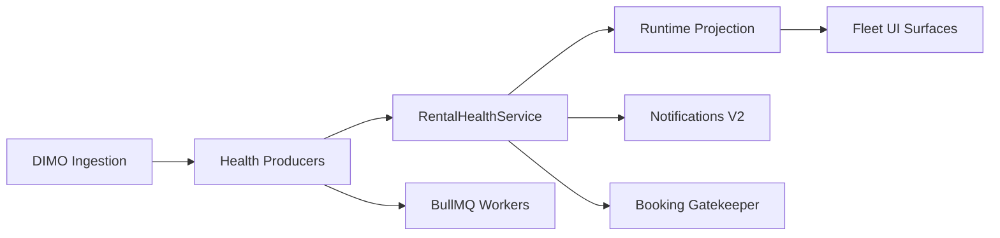

# Operational Runbook — Vehicle Warnings Pipeline

| Feld | Wert |
|------|------|
| **Audit-ID** | `vehicle-warnings-production-readiness-2026-07` |
| **Version** | 1.0 |
| **Erstellt (UTC)** | 2026-07-25 |
| **Status** | **Vorlage** — aktiv nach Remediation Phase 17 |
| **Parent** | [`post-remediation-acceptance-plan.md`](./post-remediation-acceptance-plan.md) |

**Zweck:** Incident Response, Monitoring, Rollback und Routine-Verifikation für die Vehicle-Warnings-Pipeline. Schließt Finding VW-F-036 (fehlendes Runbook zum Audit-Zeitpunkt).

---

## 1. Systemübersicht



| Komponente | Prozess/Queue | Kritikalität |
|------------|---------------|--------------|
| Rental Health API | `synqdrive` PM2 | **P0** |
| Battery V2 | `bull:battery.v2` | **P1** |
| DIMO Poll | `bull:dimo.*` | **P1** |
| Notification Eval | `bull:notification.*` | **P1** |
| Insight Eval | Cron + queue | **P2** |
| Redis Cache | `rental-health:*` | **P2** |

---

## 2. Monitoring & Alerting

### 2.1 Pflicht-Alerts (post-remediation)

| Alert ID | Bedingung | Severity | Aktion |
|----------|-----------|----------|--------|
| VW-ALT-01 | `bull:battery.v2` failed > 0 in 15min | **High** | §3.1 |
| VW-ALT-02 | Rental health pipeline `PIPELINE_UNAVAILABLE` | **Critical** | §3.2 |
| VW-ALT-03 | `vehicle_warnings_shadow_count_delta` ≠ 0 (if shadow on) | **Medium** | §3.3 |
| VW-ALT-04 | Queue stalled (no completed) > 15min | **Medium** | §3.4 |
| VW-ALT-05 | PM2 restart > 3 in 1h | **High** | §3.5 |
| VW-ALT-06 | API 5xx rate rental-health > 1% | **High** | §3.2 |

### 2.2 Dashboards

| Panel | Metrik | Baseline (Audit 2026-07-25) |
|-------|--------|------------------------------|
| Battery V2 | failed job count | 26 (pre-fix) → target 0 |
| DIMO Poll | success rate 24h | ~100% |
| Health errors | lines/24h health-keyword | ~917 (battery-dominated) |
| Cross-surface delta | shadow_count_delta | N/A pre-remediation |

### 2.3 Log-Quellen (anonymisiert)

| Log | Pfad (VPS) | Keywords |
|-----|------------|----------|
| Backend errors | PM2 `synqdrive-error.log` | `BatteryV2Processor`, `RentalHealth`, `HANDLER_FAILED` |
| Nginx access | `/var/log/nginx/access.log` | `502`, `/api/v1/rental-health` |
| Queue | Redis `bull:*` | `failed`, `stalled` |

**Regel:** Keine Secrets/PII in Tickets. UUIDs durch interne Refs ersetzen.

---

## 3. Incident Response

### 3.1 Battery V2 Handler Failures (VW-F-013)

**Symptome:** Recurring `battery.v2.processor.worker_failed`, `HANDLER_FAILED` oder `LOCK_CONTENTION`.

| Schritt | Aktion | Read-only? |
|---------|--------|------------|
| 1 | Confirm: `redis-cli LLEN bull:battery.v2:failed` or Bull inspect | ✅ |
| 2 | Correlate org/vehicle from log (redacted ticket) | ✅ |
| 3 | Check deploy commit vs known fix | ✅ |
| 4 | If sustained > 1h: disable job types via `BATTERY_V2_JOBS_ENABLED=false` | ⚠️ Config |
| 5 | Schedule WP-17 hotfix deploy | Deploy |
| 6 | Post-fix: idempotent re-eval replay | Job enqueue |

**Rollback:** `BATTERY_V2_JOBS_ENABLED=false` — battery warnings may lag; document operator comms.

**Escalation:** Engineering on-call → Fleet domain owner.

---

### 3.2 Rental Health Pipeline Unavailable

**Symptome:** API returns `degradation.PIPELINE_UNAVAILABLE`, `rental_blocked: null`.

| Schritt | Aktion |
|---------|--------|
| 1 | `GET /api/v1/health` — backend up? |
| 2 | DB connectivity — read-only `SELECT 1` |
| 3 | Redis connectivity |
| 4 | PM2 restart **nur** mit Ops-Freigabe und Incident-Ticket |
| 5 | Booking: Gatekeeper fail-closed — expect blocked starts |

**Operator impact:** Vehicles show „nicht bewertbar“ — not silently available.

---

### 3.3 Cross-Surface Count Mismatch

**Symptome:** Operator reports KPI 2 vs 4; Fleet Command ≠ FHS.

| Schritt | Aktion |
|---------|--------|
| 1 | Capture: org, filter, UTC timestamp, screenshots |
| 2 | Pull API: rental-health, fleet-map, runtime for same org |
| 3 | Compare `projectionVersion` — mismatch → cache staleness |
| 4 | If post-remediation: check `RUNTIME_PROJECTION_SHADOW_MODE` logs |
| 5 | If Δ>0 sustained 2h: **rollback UI flags** (§5) |

**Do not:** Manually „fix“ DB warning rows without engineering.

---

### 3.4 Queue Stalled

| Schritt | Aktion |
|---------|--------|
| 1 | Identify queue name from alert |
| 2 | Check worker PM2 process alive |
| 3 | Inspect stalled jobs (read-only) |
| 4 | **No** `FLUSHDB` / mass delete without incident commander |
| 5 | Replay from DLQ per engineering playbook |

---

### 3.5 PM2 Instability

**Baseline:** 3161 cumulative restarts observed 2026-07-25 (instance stable ~9h).

| Schritt | Aktion |
|---------|--------|
| 1 | `pm2 status` — restart count delta |
| 2 | Tail error.log for OOM / uncaught |
| 3 | Correlate with deploy window (502s) |
| 4 | Escalate if > 3 restarts/hour |

---

## 4. Routine Operations

### 4.1 Post-Deploy (every release touching warnings)

1. Execute [`production-verification-checklist.md`](./production-verification-checklist.md) Section B (T+0).
2. 30min error log watch — Battery V2, Rental Health.
3. Health endpoint smoke.

### 4.2 Daily (automated where possible)

| Check | Tool |
|-------|------|
| battery.v2 failed = 0 | Alert VW-ALT-01 |
| Duplicate active DTC = 0 | Scheduled read-only query |
| Orphan notifications = 0 | Scheduled query |

### 4.3 Weekly

| Check | Owner |
|-------|-------|
| Cross-surface sample (pilot org) | QA |
| Retention job success | Ops |
| P1 Formal Acceptance expiry review | Engineering Lead |

---

## 5. Rollback Procedures

### 5.1 Feature-Flag Rollback (preferred, < 5 min)

| Flag | Effect when OFF |
|------|-----------------|
| `VW_BLOCKING_POLICY_SSOT` | Legacy blocking paths |
| `VW_FLEET_CMD_RUNTIME_V1` | Legacy Fleet Command counts |
| `VW_FHS_RUNTIME_V1` | Legacy FHS KPIs |
| `VW_DASHBOARD_RUNTIME_V1` | Legacy dashboard slices |
| `RUNTIME_PROJECTION_SHADOW_MODE` | Shadow only; UI unchanged |
| `VW_SEC_INTELLIGENCE_GUARD` | **Avoid OFF in prod** — security regression |

**Steps:**
1. Set flag `false` in `backend.env` / `frontend.env`
2. `pm2 reload` or deploy script reload
3. Verify checklist Section B
4. Incident ticket + timeline

### 5.2 Full Release Rollback (< 30 min)

```bash
# Ops — requires authorization
CLOUD_AGENT_SKIP_GIT_PREFLIGHT=1 bash .cursor/scripts/cloud-agent-deploy.sh
# Pin previous SHA on VPS per deployment-rollback-plan.md
```

### 5.3 DB Migration Rollback

| Phase | Allowed |
|-------|---------|
| Pre-unique constraint | `prisma migrate resolve --rolled-back` |
| Post-backfill merge | **Forward fix only** — no automatic down |
| Post-contract drop | Restore from backup — **incident only** |

Detail: [`../remediation/deployment-rollback-plan.md`](../remediation/deployment-rollback-plan.md).

---

## 6. Security Incidents

| Scenario | Immediate action |
|----------|------------------|
| Suspected cross-tenant access | Preserve logs; disable affected endpoint via flag; escalate SECURITY |
| DRIVER mutating health data | Verify `VW_SEC_INTELLIGENCE_GUARD=true` |
| Insights PII exposure report | Restrict Insights controller; legal notification per policy |

Reference: [`../20-security-tenant-audit.md`](../20-security-tenant-audit.md).

---

## 7. GDPR Operations

| Request | Runbook step |
|---------|--------------|
| DSAR export | Execute `ops/dsar-export-warning-artifacts.ts` (post WP-16) |
| Person erasure | Erasure orchestrator job — verify completion query |
| Retention | Nightly job — monitor `gdpr_retention_last_success` |

---

## 8. Contacts & Escalation

| Level | Role | When |
|-------|------|------|
| L1 | On-call Ops | Alerts VW-ALT-* |
| L2 | Fleet Backend on-call | Pipeline degraded > 30min |
| L3 | Engineering Lead | Rollback decision |
| L4 | Product + Legal | GDPR incident; P0 booking safety |

*Konkrete Namen/Telefonnummern: internes Ops-Wiki (nicht in Git).*

---

## 9. Related Documents

| Document | Purpose |
|----------|---------|
| [`post-remediation-acceptance-plan.md`](./post-remediation-acceptance-plan.md) | Gates G-01..G-24 |
| [`production-verification-checklist.md`](./production-verification-checklist.md) | Executable checklist |
| [`../remediation/deployment-rollback-plan.md`](../remediation/deployment-rollback-plan.md) | Deploy sequence |
| [`../remediation/test-strategy.md`](../remediation/test-strategy.md) | Test IDs |
| [`../runtime/`](../runtime/) | Baseline metrics |

---

## 10. Revision History

| Version | Date | Change |
|---------|------|--------|
| 1.0 | 2026-07-25 | Initial template (Audit Prompt 26) |

**Changes / Architektur:** Nicht aktualisiert (Audit-only).
