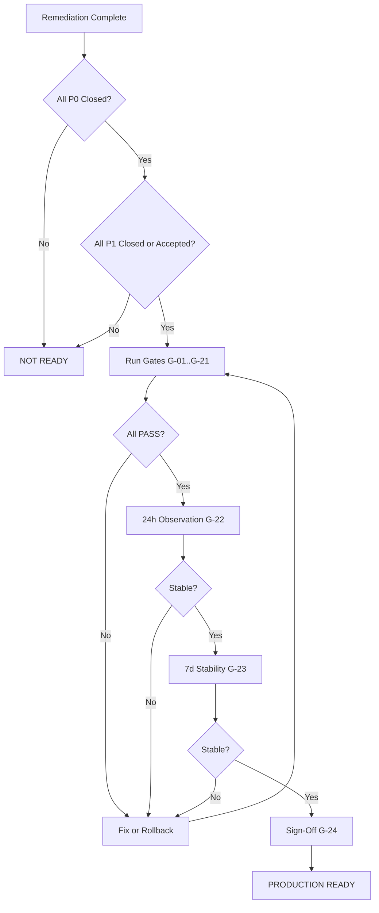

# Post-Remediation Acceptance Plan — Vehicle Warnings

| Feld | Wert |
|------|------|
| **Audit-ID** | `vehicle-warnings-production-readiness-2026-07` |
| **Version** | 1.0 |
| **Erstellt (UTC)** | 2026-07-25 |
| **Gültigkeit** | Verbindlich nach Abschluss der Remediation (WP-B0 … WP-19) |
| **Parent** | [`../VEHICLE_WARNINGS_PRODUCTION_READINESS_AUDIT_2026-07.md`](../VEHICLE_WARNINGS_PRODUCTION_READINESS_AUDIT_2026-07.md) |
| **Findings** | [`../22-consolidated-findings.md`](../22-consolidated-findings.md) |

---

## 1. Zweck

Dieses Dokument definiert die **verbindlichen Abnahmekriterien** für „Vehicle Warnings Production Ready“. Es gilt **ausschließlich nach** Umsetzung der Remediation gemäß [`../remediation/implementation-sequence.md`](../remediation/implementation-sequence.md).

**Kein automatisches Pass:** Jeder Gate erfordert dokumentierten Beweis (Test-Report, Query-Ergebnis, Screenshot, Metrik-Export).

---

## 2. Voraussetzungen für Abnahme-Start

| # | Voraussetzung | Nachweis |
|---|---------------|----------|
| PRE-01 | Alle Remediation-Phasen 0–17 deployed | Deploy-Log + Commit-SHAs |
| PRE-02 | Feature Flags gemäß Plan aktiviert (kein Shadow mehr) | Flag-Inventar Screenshot/Config |
| PRE-03 | Alle P0 Findings Status `Closed` | Finding-Register |
| PRE-04 | Alle P1 Findings `Closed` oder `Accepted` mit Risiko-Owner + Verfallsdatum | Formal Acceptance Record |
| PRE-05 | Staging: vollständige Test-Suite grün | CI Report |
| PRE-06 | Rollback-Dokument aktuell | [`../remediation/deployment-rollback-plan.md`](../remediation/deployment-rollback-plan.md) |

---

## 3. Verbindliches Production-Ready-Kriterium

```
Production Ready = (ALL P0 closed) AND (ALL P1 closed OR formally accepted) AND (ALL Gates G-01..G-24 PASS with evidence)
```

**Verboten:** „Production Ready“ bei offenen P0, bei P1 ohne Formal Acceptance, oder bei einem einzigen Gate FAIL ohne dokumentierte Ausnahme mit C-Level/Produkt-Freigabe.

---

## 4. Cross-Surface Consistency Gates (Pflicht)

Für jede **Stichproben-Organisation** (`ORG_PILOT`, `ORG_PROD_SAMPLE`) und jedes Fahrzeug in der Golden-Fleet-Fixture:

### G-01 — Identische Fahrzeuganzahl

| Prüfung | Surfaces | Toleranz |
|----------|----------|----------|
| Fahrzeuge in Scope (filtered fleet) | Fleet Command, FHS, Dashboard Runtime, Fleet Map | **Δ = 0** |
| Fahrzeuge pro Status-Tab | Fleet Command tabs vs `canonicalTabCounts` | **Δ = 0** |

**Beweis:** API-Responses + UI-Screenshot gleicher Filter; Query `queries/cross-surface-vehicle-count.sql`.

---

### G-02 — Identische höchste Severity

| Prüfung | Felder | Toleranz |
|----------|--------|----------|
| Per vehicle | `highestSeverity` auf Rental Health, Runtime, Fleet Map, Vehicle Detail | **Gleich** (canonical enum) |
| Per org KPI | Critical/Warning/Info counts | **Δ = 0** |

**Beweis:** Golden fixture snapshot; Test T-RT-01.

---

### G-03 — Identischer Technical State

| Prüfung | Dimensionen |
|----------|-------------|
| `overall_state` / Modul-States | Rental Health = Runtime module projection |
| `telemetryState` | Single vocabulary across APIs |
| `operationalState` | Fleet-map = Runtime input |

**Toleranz:** **Keine Abweichung** außer dokumentierte exclusions in Contracts.

**Beweis:** API contract test T-API-*; Audit 15 field matrix PASS.

---

### G-04 — Identische Readiness

| Prüfung | Surfaces |
|----------|----------|
| `rentalReadiness` (API field post-WP-07) | = Client `deriveIsReadyForRenting` |
| Ready-to-rent drawer count | = Runtime slice count |
| Booking preflight | = Gatekeeper `canStartRental` inverse of block |

**Toleranz:** **Δ = 0** für ready/not-ready classification per vehicle.

**Beweis:** T-UI-03; Gatekeeper E2E.

---

### G-05 — Identische Blocker

| Prüfung | Quellen |
|----------|---------|
| `blocking_reasons[]` | Rental Health = Gatekeeper reasons |
| `rental_blocked` | Confirmed block = any hard blocker in policy |
| Damage/Complaint/Task blocks | All in `collectBlockingReasons` |

**Toleranz:** **Set equality** (order-independent).

**Beweis:** T-BLK-* matrix; keine FE-only BLOCK_RENTAL.

---

### G-06 — Identische offene Finding-IDs

| Prüfung | Consumer |
|----------|----------|
| Active `findingId` set | Rental Health, Notifications, Vehicle Detail, AI tool payload |
| Resolved findings | Absent from active notification sweep |

**Toleranz:** **Set equality** for `status=active`.

**Beweis:** Query `queries/active-finding-ids-by-consumer.sql`.

---

### G-07 — Übereinstimmende evaluatedAt / projectionVersion

| Feld | Regel |
|------|-------|
| `evaluatedAt` | Same UTC second across surfaces reading same projection (±1s clock skew) |
| `projectionVersion` | Identical for same org+vehicle across Rental Health, Runtime API, Fleet Map health slice |

**Beweis:** API responses logged in `evidence/projection-version-parity_*.json`.

---

## 5. Datenintegrität Gates

### G-08 — Keine offenen Duplikate

| Domäne | Query |
|--------|-------|
| Active DTC | Max 1 row per `(vehicle_id, dtc_code) WHERE is_active` |
| Active Insights | Unique active `dedupeKey` per org |
| Notifications | Max 1 open per `(findingId, channelRule)` |
| OrgTasks | Max 1 open per `dedupeKey` |

**Beweis:** SQL reports in `queries/dedup-verification_*.sql`; **0 rows** duplicate.

---

### G-09 — Keine Cross-Tenant-Leaks

| Test | Erwartung |
|------|-----------|
| T-SEC-05 Cross-tenant vehicle ID | 404 |
| Cache key scan | No key without org prefix |
| Notification delivery | `organizationId` match |

**Beweis:** `vehicles-security-negative.spec.ts` CI green; Audit 20 regression suite.

---

### G-10 — Keine verwaisten Notifications

| Prüfung | Regel |
|----------|-------|
| Open notification without active finding | **0** (or documented grace period < 1h) |
| Finding resolved but notification still CRITICAL open | **0** after sweep cycle |

**Beweis:** Query `queries/orphan-notifications.sql`.

---

### G-11 — Keine doppelten Automation Runs

| Prüfung | Regel |
|----------|-------|
| Same `findingId` + workflow trigger | Max 1 execution per state transition |
| Replay of same event | Idempotent — no duplicate workflow run |

**Beweis:** Workflow execution log + T-IDEM integration tests.

---

## 6. Determinismus & Idempotenz Gates

### G-12 — Deterministische Rebuilds

| Prüfung | Methode |
|----------|---------|
| Rebuild Runtime projection from DB | Same input → same output hash |
| Re-run Rental Health for vehicle | Identical `overall_state`, `blocking_reasons` |

**Beweis:** Determinism test job output 3 consecutive runs — hash match.

---

### G-13 — Erfolgreiche Replay- und Idempotenztests

| Test-Suite | Status |
|------------|--------|
| T-IDEM-01..05 | **PASS** |
| DTC parallel webhook simulation | **PASS** |
| Notification sweep replay | **PASS** |
| Backfill script re-run | **PASS** (no new rows) |

**Beweis:** CI report + staging replay log.

---

### G-14 — Erfolgreiche Cache-Invalidierung

| Prüfung | SLA |
|----------|-----|
| Mutation → next read cache miss | < 5s p95 |
| Stale count after mutation | **0** in 24h prod sample |

**Beweis:** T-CACHE-01, T-CACHE-02; Redis key TTL metrics.

---

## 7. Operative Szenarien Gates

### G-15 — Korrekte Offline-/Stale-Behandlung

| Szenario | Erwartung |
|----------|-----------|
| Telemetry offline | `telemetryState=offline`; `rentalReadiness=false`; **nicht** silently `good` |
| Stale data beyond threshold | `dataQuality=unreliable`; fail-closed booking |
| Telemetry recovery | Hysteresis before auto-resolve findings (VW-F-026 fix) |

**Beweis:** T-RT-02, T-LC-05; fixture `fixture-tesla-offline`.

---

### G-16 — Korrekte Warnung während aktiver Vermietung

| Szenario | Erwartung |
|----------|-----------|
| New critical finding during ACTIVE rental | Visible in Active Rentals drawer + escalation badge |
| Notification to operator | Delivered per channel rules |
| Booking NOT auto-cancelled | Unless explicit policy (documented) |

**Beweis:** E2E scenario test; Audit 18 escalation paths verified.

---

### G-17 — Mobile Darstellung

| Prüfung | Regel |
|----------|-------|
| Critical/blocking warnings visible without horizontal scroll | PASS |
| Safety-relevant severity not hidden behind collapsed sections | PASS |
| Offline/block badges visible on fleet list | PASS |

**Beweis:** Mobile viewport screenshots (375px) in `evidence/mobile-warning-visibility_*.png`.

---

## 8. Security & Compliance Gates

### G-18 — RBAC Enforcement

| Rolle | Erwartung |
|-------|-----------|
| DRIVER | No fleet.write on Vehicle Intelligence; no mutate |
| WORKER (scoped) | Station-filtered tasks/notifications |
| Insights | No raw `customerId` without permission |

**Beweis:** T-SEC-01..04 CI green.

---

### G-19 — DSGVO Minimum

| Kontrolle | Status |
|-----------|--------|
| Retention job active | PASS |
| DSAR export includes warning artifacts | PASS |
| Erasure orchestrator tested on fixture person | PASS |
| Legal basis mapping documented | PASS (organizational sign-off) |

**Beweis:** T-GDPR-*; Legal acceptance record for VW-F-041.

---

## 9. Observability & Operations Gates

### G-20 — Monitoring und Alerting aktiv

| Alert | Threshold |
|-------|-----------|
| `battery.v2` failed jobs | = 0 / 24h |
| Shadow count delta (if still enabled) | = 0 |
| Rental health pipeline degraded | Page on-call |
| Queue stalled > 15min | Warning |

**Beweis:** Grafana/Prometheus screenshot; alert rule IDs documented in runbook.

---

### G-21 — Dokumentierter Rollback

| Artefakt | Aktuell |
|----------|---------|
| Feature flag rollback steps | YES |
| DB migration rollback (per phase) | YES |
| Previous release SHA pinned | YES |

**Beweis:** [`operational-runbook.md`](./operational-runbook.md) §Rollback.

---

## 10. Stabilitäts-Gates (zeitlich)

### G-22 — 24-Stunden-Produktionsbeobachtung

**Start:** T+0 nach finalem Flag-Umschalten (Shadow off).

| Metrik | Pass |
|--------|------|
| API error rate rental-health | ≤ baseline |
| `battery.v2` failed | 0 |
| Customer-reported warning mismatch | 0 |
| Support tickets warning-related | ≤ baseline |
| PM2 restarts | ≤ 1 |

**Beweis:** [`production-verification-checklist.md`](./production-verification-checklist.md) 24h section signed.

---

### G-23 — 7-Tage-Stabilitätsprüfung

| Metrik | Pass |
|--------|------|
| Cross-surface count delta | 0 (daily sample) |
| Duplicate findings created | 0 |
| Orphan notifications | 0 |
| Automation duplicate runs | 0 |
| GDPR retention job success | 100% |

**Beweis:** Daily stability log T+1..T+7 in `evidence/stability-week_*.md`.

---

### G-24 — Abschluss-Sign-Off

| Rolle | Unterschrift / Ticket |
|-------|----------------------|
| Engineering Lead | |
| QA | |
| Ops / SRE | |
| Product (Fleet) | |
| Legal (DSGRO gates only) | |

---

## 11. Finding-Closure-Matrix (Pflicht vor G-24)

| Prio | Anzahl Audit | Schließung erforderlich |
|------|--------------|-------------------------|
| P0 | 11 | **100 % Closed** — keine Ausnahme |
| P1 | 17 | **Closed** oder **Formal Acceptance** |
| P2 | 11 | Empfohlen Closed; darf mit Acceptance + Backlog |
| P3 | 3 | Backlog OK für Production Ready |

**Formal Acceptance Template:**

```markdown
## P1 Acceptance Record — VW-F-###
- Finding: [title]
- Accepted by: [role/name]
- Risk owner: [team]
- Compensating control: [description]
- Expiry date: YYYY-MM-DD (max 90 days)
- Re-review ticket: [link]
```

---

## 12. Abnahme-Workflow



---

## 13. Verweise

| Dokument | Rolle |
|----------|-------|
| [`production-verification-checklist.md`](./production-verification-checklist.md) | Operative Checkliste |
| [`operational-runbook.md`](./operational-runbook.md) | Incident & Rollback |
| [`../remediation/test-strategy.md`](../remediation/test-strategy.md) | Test-IDs |
| [`../remediation/deployment-rollback-plan.md`](../remediation/deployment-rollback-plan.md) | Deploy |

**Changes / Architektur:** Nicht aktualisiert (Audit-only).
