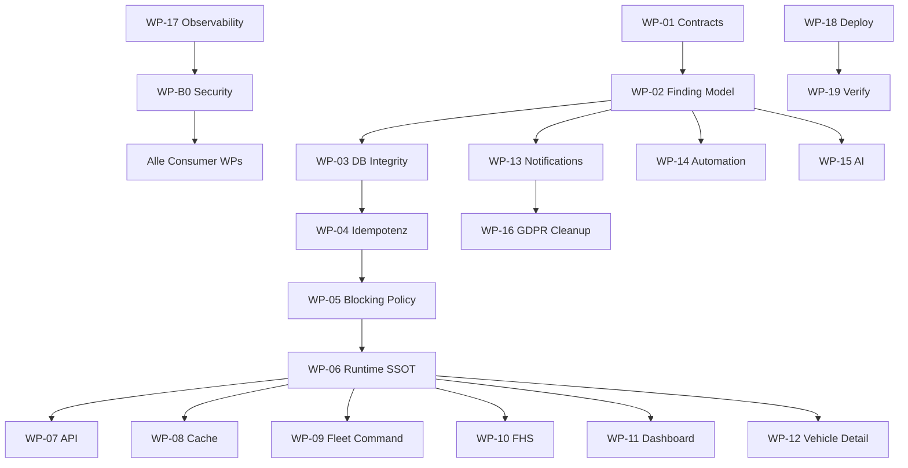

# Vehicle Warnings — Remediation Plan (Work Packages)

| Feld | Wert |
|------|------|
| **Audit-ID** | `vehicle-warnings-production-readiness-2026-07` |
| **Prompt** | **25 von 26** |
| **Erstellt (UTC)** | 2026-07-25 |
| **Modus** | **Planung only** — keine Umsetzung |
| **Findings-Register** | [`../22-consolidated-findings.md`](../22-consolidated-findings.md) |
| **Basis-Commit** | `1d0f2caebe56aa1ecd23295aa33d20e953daa95d` |

---

## 1. Leitprinzipien

| Prinzip | Umsetzung |
|---------|-----------|
| Kein Big-Bang | Schrittweise Phasen; jede Phase eigenständig deploybar |
| Feature Flags | Pro Work Package ein Flag; Default `off` in Prod bis Shadow-Parität |
| Dual-Read begrenzt | Max. 14 Tage Shadow Mode; Metriken `shadow_count_delta` |
| Keine dauerhafte zweite Wahrheit | Legacy-Pfade nur als read-only Bridge, dann deprecate |
| Idempotenter Backfill | Alle Backfills mit `ON CONFLICT` / dedupe key; replay-safe |
| Rollbackbare Migrationen | Expand → backfill → contract → optional contract (kein destructive drop in Phase 1) |
| Shadow Count Vergleich | Alte vs. neue Counts pro Org/Fahrzeug; Umschaltung nur bei Δ=0 (toleranz dokumentiert) |
| Security Hotfix vorbreit | WP-B0 (SEC) parallel zu Phase 1, nicht blockiert durch SSOT |

---

## 2. Work-Package-Übersicht

| WP | Titel | Phase | Findings | Priorität | Flags |
|----|-------|-------|----------|-----------|-------|
| **WP-B0** | Security Hotfix (Vehicle Intelligence + Spec PATCH) | 1 (parallel) | VW-F-010, VW-F-011 | P0/P1 | `VW_SEC_INTELLIGENCE_GUARD` |
| **WP-01** | Terminologie & OpenAPI Contracts | 1 | VW-F-001, VW-F-033, API-C* | P1/P2 | `VW_CONTRACTS_V1` |
| **WP-02** | Kanonisches Finding-Modell (Schema + FSM) | 2 | VW-F-001, VW-F-027 | P1 | `FINDING_CANONICAL_ENABLED` |
| **WP-03** | DB-Integrität (FK, CASCADE, Uniques) | 3 | VW-F-009, VW-F-007, VW-F-021 | P0/P1 | `VW_DB_INTEGRITY_V1` |
| **WP-04** | Idempotenz (DTC, Tasks, Complaints, Insights) | 4 | VW-F-007, VW-F-020, VW-F-025, VW-F-021 | P0/P1/P2 | `VW_IDEMPOTENCY_V1` |
| **WP-05** | Zentrale Severity & Blocking Policy | 5 | VW-F-002, VW-F-028, VW-F-029, VW-F-016 | P0/P1 | `VW_BLOCKING_POLICY_SSOT` |
| **WP-06** | Runtime/Readiness Projection SSOT | 6 | VW-F-003, VW-F-005, VW-F-006, VW-F-018 | P0/P1 | `RUNTIME_PROJECTION_SHADOW_MODE` |
| **WP-07** | API-Umstellung (rentalReadiness, projectionVersion) | 7 | VW-F-018, VW-F-033, VW-F-004 | P0/P1/P2 | `VW_API_V2_FIELDS` |
| **WP-08** | Cache Invalidierung & TTL-Policy | 8 | VW-F-017 | P1 | `VW_CACHE_INVALIDATION_V1` |
| **WP-09** | Fleet Command Consumer-Migration | 9 | VW-F-004, VW-F-016 | P0/P1 | `VW_FLEET_CMD_RUNTIME_V1` |
| **WP-10** | Zustand & Service (FHS) Consumer-Migration | 10 | VW-F-004, VW-F-016, VW-F-015 | P0/P1 | `VW_FHS_RUNTIME_V1` |
| **WP-11** | Dashboard Bereitschaft & Aktive Vermietungen | 11 | VW-F-006, VW-F-016 | P0/P1 | `VW_DASHBOARD_RUNTIME_V1` |
| **WP-12** | Vehicle Detail & Operational Issues | 12 | VW-F-023, VW-F-024 | P2 | `VW_VEHICLE_DETAIL_V1` |
| **WP-13** | Notifications (Dedup, Sweep, Retention) | 13 | VW-F-022, VW-F-019, VW-F-027 | P1 | `VW_NOTIFICATION_V2_SSOT` |
| **WP-14** | Workflow Automation Wiring | 14 | VW-F-034 | P2 | `VW_WORKFLOW_HEALTH_EVENTS` |
| **WP-15** | AI Context & Data Authorization | 15 | VW-F-040, VW-F-012 | P0/P2 | `VW_AI_FINDING_CONTEXT` |
| **WP-16** | Historische Datenbereinigung & DSAR | 16 | VW-F-012, VW-F-019, VW-F-042, VW-F-041 | P0 | `VW_GDPR_ERASURE_V1` |
| **WP-17** | Observability & Runtime Fixes | 17 | VW-F-013, VW-F-037, VW-F-038 | P1/P3 | `VW_OBSERVABILITY_V1` |
| **WP-18** | Deployment-Orchestrierung | 18 | alle | — | siehe deployment-rollback-plan |
| **WP-19** | Post-Deployment Verification | 19 | alle | — | Smoke-Matrix |

**Empfohlene Implementierungsprompts:** **19** (1 Prompt pro Phase/WP-Kern, WP-B0 in Prompt 1 eingebettet).

---

## 3. Work-Package-Details

### WP-B0 — Security Hotfix

| Feld | Inhalt |
|------|--------|
| **Ziel** | Within-tenant RBAC-Lücken schließen ohne SSOT-Umbau |
| **Scope** | `VehicleIntelligenceController`, Brake/Battery Spec PATCH |
| **Änderungen** | `PermissionsGuard` + `@RequirePermission('fleet', …)`; PATCH `vehicleId` binding |
| **Migration** | Nein |
| **Backfill** | Nein |
| **Risiko** | Niedrig — DRIVER/WORKER können 403 sehen |
| **Tests** | `vehicles-security-negative.spec.ts` erweitern |
| **Rollback** | Flag `VW_SEC_INTELLIGENCE_GUARD=false` |
| **Acceptance** | DRIVER mutate → 403; Spec PATCH fremdes vehicleId → 404/403 |
| **Findings** | VW-F-010, VW-F-011 |

---

### WP-01 — Terminologie & Contracts

| Feld | Inhalt |
|------|--------|
| **Ziel** | Einheitliche Begriffe und dokumentierte API-Feld-Matrix |
| **Scope** | OpenAPI/Types: `telemetryState`, `highestSeverity`, `rental_blocked`, `findingId` (reserved) |
| **Deliverables** | `vehicle-warning-contracts.md` in Architektur; TS shared types `packages/contracts` oder `frontend/src/types/warnings` |
| **Migration** | Nein |
| **Backfill** | Nein |
| **Risiko** | Niedrig (Dokumentation + Types) |
| **Tests** | Contract snapshot tests |
| **Rollback** | N/A (docs only) |
| **Acceptance** | Alle 11 Vergleichsfelder aus Audit 15 haben Owner + Vokabular |
| **Findings** | VW-F-001 (teil), VW-F-033, API-C01–C10 |

---

### WP-02 — Kanonisches Finding-Modell

| Feld | Inhalt |
|------|--------|
| **Ziel** | `VehicleFinding` (oder äquivalent) mit Lifecycle-FSM |
| **Scope** | Prisma model; `FindingLifecycleService`; Bridges zu Alerts/Notifications read-only |
| **States** | `active` → `acknowledged` → `resolved` / `superseded` / `expired` |
| **Migration** | Ja — expand-only Tabelle |
| **Backfill** | Ja — idempotent aus TireAlert, BrakeAlert, DTC, Notification fingerprint |
| **Risiko** | Hoch |
| **Tests** | FSM unit; bridge correlation |
| **Rollback** | Flag off; Tabelle bleibt, ungenutzt |
| **Acceptance** | Jeder neue Warning-Pfad schreibt `findingId`; Consumer lesen optional |
| **Findings** | VW-F-001, VW-F-027 |

---

### WP-03 — DB-Integrität

| Feld | Inhalt |
|------|--------|
| **Ziel** | CASCADE-Risiken und fehlende Uniques beheben |
| **Scope** | `ON DELETE SET NULL` oder soft-archive für Evidence; partial UNIQUE DTC; Insight dedupe index |
| **Migration** | Ja — expand + backfill + contract in separaten Deploys |
| **Backfill** | Ja für DTC duplicates (VW-F-007) |
| **Risiko** | Mittel |
| **Tests** | Migration integration; duplicate merge script dry-run |
| **Rollback** | Migration down nur vor contract phase |
| **Acceptance** | Vehicle delete behält audit trail; max 1 active DTC per code |
| **Findings** | VW-F-009, VW-F-007, VW-F-021 |

---

### WP-04 — Idempotenz

| Feld | Inhalt |
|------|--------|
| **Ziel** | Webhook/Poll/Cron erzeugen keine Duplikate |
| **Scope** | DTC webhook normalize; `OrgTask.upsertByDedup` lock; Complaint create dedupe; Insight publish-swap |
| **Migration** | Teilweise (unique constraints) |
| **Backfill** | Ja — merge duplicate DTC rows |
| **Risiko** | Mittel |
| **Tests** | Parallel ingestion simulation |
| **Rollback** | Per-path flags |
| **Acceptance** | 100 parallel webhook events → 1 active finding |
| **Findings** | VW-F-007, VW-F-020, VW-F-025, VW-F-021, VW-F-027 |

---

### WP-05 — Zentrale Severity & Blocking Policy

| Feld | Inhalt |
|------|--------|
| **Ziel** | `collectBlockingReasons` = einzige Blockade-Quelle für Buchung |
| **Scope** | Damage BLOCK_RENTAL → BE; Service critical → rental_blocked; Complaints/Tasks integriert |
| **Migration** | Teilweise |
| **Backfill** | Nein |
| **Risiko** | Mittel — Buchungsverhalten ändert sich |
| **Tests** | Matrix R-01–R-20 (Audit 13) |
| **Rollback** | `VW_BLOCKING_POLICY_SSOT=false` restores legacy paths |
| **Acceptance** | Kein FE-only BLOCK_RENTAL; Gatekeeper = Booking SSOT |
| **Findings** | VW-F-002, VW-F-028, VW-F-029 |

---

### WP-06 — Runtime/Readiness Projection SSOT

| Feld | Inhalt |
|------|--------|
| **Ziel** | `VehicleRuntimeState` als einzige Aggregation für Counts/Severity/Readiness |
| **Scope** | `vehicleRuntimeStateBuilder`; Telemetry-Klassifikation vereinheitlichen; Connectivity single path |
| **Migration** | Nein |
| **Backfill** | Nein |
| **Risiko** | Hoch |
| **Tests** | Golden fleet fixtures; shadow mode metrics |
| **Rollback** | `RUNTIME_PROJECTION_SHADOW_MODE=true` keeps old derivation |
| **Acceptance** | KPI strip = drawer = tab badges (± documented exclusions) |
| **Findings** | VW-F-003, VW-F-005, VW-F-006, VW-F-016, VW-F-004 |

---

### WP-07 — API-Umstellung

| Feld | Inhalt |
|------|--------|
| **Ziel** | `rentalReadiness`, `projectionVersion`, deprecate `healthStatus` |
| **Scope** | Rental Health + Fleet Map + Runtime endpoints |
| **Migration** | Ja (optional computed columns) |
| **Backfill** | Nein |
| **Risiko** | Mittel |
| **Tests** | API contract tests; mobile/client compatibility |
| **Rollback** | Dual fields during transition; old fields `@deprecated` |
| **Acceptance** | Clients können Readiness ohne Client-Recompute lesen |
| **Findings** | VW-F-018, VW-F-033, VW-F-004 |

---

### WP-08 — Cache Invalidierung

| Feld | Inhalt |
|------|--------|
| **Ziel** | Health-Cache invalidiert bei Finding-Änderung |
| **Scope** | Event hooks nach Tire/Brake/Battery/DTC mutation; TTL alignment fleet-map vs health |
| **Migration** | Nein |
| **Backfill** | Nein |
| **Risiko** | Niedrig |
| **Tests** | Cache miss after mutation integration |
| **Rollback** | Flag disables invalidation hooks |
| **Acceptance** | Mutation → cache key deleted < 1s |
| **Findings** | VW-F-017 |

---

### WP-09 — Fleet Command

| Feld | Inhalt |
|------|--------|
| **Ziel** | Tab counts + chips aus Runtime Projection |
| **Scope** | `FleetCommandPage`, `canonicalTabCounts`, entferne `fleetVisualState` parallel counts |
| **Migration** | Nein |
| **Backfill** | Nein |
| **Risiko** | Mittel (UI) |
| **Tests** | Visual regression; count parity shadow |
| **Rollback** | Feature flag per surface |
| **Acceptance** | „Verfügbar“ chip ≠ Runtime not-ready ohne dokumentierte Ausnahme |
| **Findings** | VW-F-004, VW-F-006, VW-F-016 |

---

### WP-10 — Zustand & Service (FHS)

| Feld | Inhalt |
|------|--------|
| **Ziel** | FHS KPIs aus Runtime + Rental Health SSOT |
| **Scope** | `computeFleetHealthKpis`, NV2 sync alignment |
| **Migration** | Nein |
| **Backfill** | Nein |
| **Risiko** | Mittel |
| **Tests** | KPI golden tests per fixture fleet |
| **Rollback** | Shadow compare |
| **Acceptance** | „Technisch prüfen“ count = Runtime review reasons |
| **Findings** | VW-F-004, VW-F-015, VW-F-016 |

---

### WP-11 — Dashboard Bereitschaft & Aktive Vermietungen

| Feld | Inhalt |
|------|--------|
| **Ziel** | Ready-to-rent slice + active rentals aus Runtime |
| **Scope** | `buildReadyToRentSlice`, `deriveIsReadyForRenting` consumer-only |
| **Migration** | Nein |
| **Backfill** | Nein |
| **Risiko** | Mittel |
| **Tests** | Slice membership tests |
| **Rollback** | Flag |
| **Acceptance** | Ready drawer ⊆ Gatekeeper-eligible vehicles |
| **Findings** | VW-F-006, VW-F-016 |

---

### WP-12 — Vehicle Detail

| Feld | Inhalt |
|------|--------|
| **Ziel** | Operational Issues + deep links korrekt |
| **Scope** | `mergeV2NotificationsWithVehicleHealth` per finding not vehicleId; `OPEN_VEHICLE_MODULE` |
| **Migration** | Nein |
| **Backfill** | Nein |
| **Risiko** | Niedrig |
| **Tests** | Multi-module health same vehicle |
| **Rollback** | Flag |
| **Acceptance** | Tire + Brake warnings both visible; module deep link opens tab |
| **Findings** | VW-F-023, VW-F-024 |

---

### WP-13 — Notifications

| Feld | Inhalt |
|------|--------|
| **Ziel** | Notification = Projection of Finding; retention policy |
| **Scope** | Sweep limit configurable; fingerprint → findingId; retention scheduler |
| **Migration** | Ja (retention tables/jobs) |
| **Backfill** | Ja — link historical notifications to findings |
| **Risiko** | Mittel |
| **Tests** | Dedup; retention dry-run |
| **Rollback** | Disable retention job |
| **Acceptance** | No duplicate notifications per finding+channel; 90d retention (configurable) |
| **Findings** | VW-F-022, VW-F-019, VW-F-027 |

---

### WP-14 — Workflow Automation

| Feld | Inhalt |
|------|--------|
| **Ziel** | `vehicle.health.*` Events verdrahten |
| **Scope** | Event emitter nach Finding lifecycle transition |
| **Migration** | Nein |
| **Backfill** | Nein |
| **Risiko** | Niedrig |
| **Tests** | Workflow trigger integration |
| **Rollback** | Disable emitter |
| **Acceptance** | Health critical transition fires configured workflow once |
| **Findings** | VW-F-034 |

---

### WP-15 — AI Context

| Feld | Inhalt |
|------|--------|
| **Ziel** | AI erhält strukturierte `findingId`-basierte Payload |
| **Scope** | `resolveAiVehicleAccess` + finding slice; data-auth check |
| **Migration** | Nein |
| **Backfill** | Nein |
| **Risiko** | Niedrig |
| **Tests** | AI tool contract tests |
| **Rollback** | Legacy payload path |
| **Acceptance** | AI explains source, freshness, impact per finding |
| **Findings** | VW-F-040, VW-F-012 (redaction) |

---

### WP-16 — Historische Datenbereinigung & DSAR

| Feld | Inhalt |
|------|--------|
| **Ziel** | Erasure orchestrator; Insights PII redaction; legal basis mapping |
| **Scope** | DSAR export slice; erasure jobs for complaints/insights/logs |
| **Migration** | Ja |
| **Backfill** | Ja — optional PII scrub in historical metrics |
| **Risiko** | Hoch (compliance) |
| **Tests** | DSAR fixture; erasure verification |
| **Rollback** | Jobs pause; no auto-delete without confirm |
| **Acceptance** | Person erasure removes/links anonymized in warning history |
| **Findings** | VW-F-012, VW-F-019, VW-F-041, VW-F-042 |

---

### WP-17 — Observability

| Feld | Inhalt |
|------|--------|
| **Ziel** | Battery V2 failures fix; alerting; incident runbook |
| **Scope** | `BatteryV2Processor` root cause; DLQ; Prometheus counters; runbook doc |
| **Migration** | Nein |
| **Backfill** | Ja — idempotent battery re-eval post-fix |
| **Risiko** | Mittel |
| **Tests** | Staging replay failed jobs |
| **Rollback** | Disable job types |
| **Acceptance** | 0 failed battery.v2 / 24h; runbook published |
| **Findings** | VW-F-013, VW-F-036, VW-F-037, VW-F-038, VW-F-039 |

---

### WP-18 / WP-19

Siehe [`deployment-rollback-plan.md`](./deployment-rollback-plan.md) und [`test-strategy.md`](./test-strategy.md).

---

## 4. Abhängigkeitsgraph (vereinfacht)

---

## 5. Go/No-Go Gates

| Gate | Bedingung | Status |
|------|-----------|--------|
| **G0** | WP-B0 deployed (SEC) | **Required before prod SSOT** |
| **G1** | WP-01–04 complete; DTC dedup verified | Required for data integrity |
| **G2** | WP-05–06 shadow mode Δ=0 for 7d (pilot org) | Required for UI migration |
| **G3** | WP-16 legal sign-off for retention/erasure | Required for EU prod scale |
| **G4** | WP-17 battery failures = 0 / 24h | Required for battery-dependent fleets |

**Aktuelles Urteil:** **NO-GO** für vollständige Single-Truth Readiness.

**Nach G0 + G1 + G2 (Pilot):** **CONDITIONAL GO** für schrittweise UI-Umschaltung.

**Nach G0–G4:** **GO** für Production Single-Truth.

---

## 6. Nicht im Scope dieser Remediation

| Thema | Grund |
|-------|-------|
| Cross-tenant leak fix | Nicht reproduziert (Audit 20) |
| Drawer orthogonale Dimensionen | By design (Audit 18) |
| FC-P0-01 episode recovery | Unverified — Watch item only |
| ISO-Zertifizierung | Organisatorisch, nicht technisch |

---

**Changes / Architektur:** Nicht aktualisiert (Planung only).
