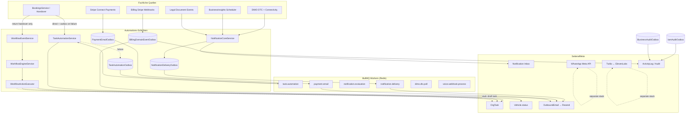

# Workflow Automation — Runtime Baseline Audit

| Field | Value |
|-------|-------|
| **Repository** | `SYNQDRIVE-alpha` (`FATIHS-MGCKS/SYNQDRIVE-alpha`) |
| **Audit date** | 2026-07-24 |
| **Commit analyzed** | `f5a5b4e33006585774cf728814404eebde3578cb` (detached HEAD) |
| **Scope** | Phase 1, Prompt 1 — static inventory only; **no production code changes** |
| **Method** | Code inspection, existing architecture/audit docs, targeted unit tests, `tsc --noEmit` |

---

## 1. Executive Summary

SynqDrive betreibt **kein einheitliches Workflow-Automation-Monolith**, sondern **vier parallel existierende Automations- und Kommunikationsschichten**, die sich teilweise überschneiden, aber unterschiedliche Persistenz-, Retry- und Tenant-Grenzen haben:

| Schicht | Reifegrad | Persistenz | Primärer Zweck |
|---------|-----------|------------|----------------|
| **Task Automation** (code-defined catalog) | **Produktiv** | `OrgTask` + `TaskAutomationOutbox` | Buchungs-, Dokumenten-, Rechnungs-, Insight- und Reinigungsaufgaben materialisieren |
| **OrgWorkflow Engine** (user-defined) | **Teilweise verdrahtet** | `OrgWorkflow*` Tabellen | Org-spezifische Trigger→Conditions→Actions; nur 2 von 8 Event-Typen werden produktiv emittiert |
| **Notification Engine V2** | **Feature-flagged** | `Notification*` + `NotificationDeliveryOutbox` | Kanonische In-App-Inbox + optional E-Mail-Delivery |
| **Parallele Kommunikationskanäle** | **Getrennte Stacks** | Eigene Outboxen/Tabellen | Billing-E-Mail, Payment-E-Mail, WhatsApp, Voice (Twilio+ElevenLabs), IAM-Invite |

**Kernbefunde (sicher belegt):**

1. **Booking Automation ist produktionsreif** über `TaskAutomationService` + Outbox (`backend/src/modules/tasks/`), angebunden an `BookingsService` und `BookingsHandoverService`.
2. **OrgWorkflow Engine ist implementiert, aber Event-Wiring minimal** — nur `booking.returned` und `booking.completed` werden aus `bookings-handover.service.ts` via `WorkflowEventService.scheduleEmit()` emittiert; Health/DTC/Invoice/Complaint-Trigger existieren in Konstanten und UI, haben aber **keinen Producer**.
3. **Mehrere Workflow-Actions sind bewusste Stubs** — `notification.prepare` und `ai.suggest_action` erzeugen Review-Tasks, senden aber keine Nachrichten (`workflow-action-executor.service.ts`).
4. **Workflow-Approvals führen Actions nach Freigabe nicht erneut aus** — `executedAfterApproval: false` in `workflows.service.ts:approveActionRun`.
5. **Notification Engine V2** hat 46+ Registry-Event-Typen, aber nur **3 shadow-enabled** Producer-Pfade; V1-`ActionQueue` komponiert weiterhin 6+ parallele Quellen (`docs/notification-engine-current-state.md`).
6. **E-Mail ist produktiv über Resend** (`outbound-email/`), aber **fragmentiert** in mindestens 5 unabhängige Pipelines (Notification-Delivery, Billing, Payment, Documents, Invite).
7. **SMS und Push sind nicht implementiert** — Prisma-Enum `NotificationDeliveryChannel.SMS` existiert; Push gibt `PUSH_NOT_IMPLEMENTED` zurück.
8. **WhatsApp und Voice sind vollständig separate Produktmodule**, nicht an OrgWorkflow oder Notification Engine angebunden (`whatsapp-automation-hooks.service.ts` mit TODOs).
9. **BullMQ + Redis** betreiben 20 Queues embedded im API-Prozess; Worker-Aktivierung hängt von Redis-Erreichbarkeit beim Bootstrap ab (`RuntimeStatusRegistry`), nicht von `WORKERS_ENABLED` env (nur dokumentiert).
10. **10 Postgres-Outbox-Tabellen** plus Webhook-Inboxes bilden das durable-async-Rückgrat; IAM/Business-Audit-Outboxen folgen dem transactional-outbox-Muster (`architecture/BUSINESS_AUDIT_OUTBOX_2026-07-23.md`, `architecture/IAM_TRANSACTIONAL_AUDIT_OUTBOX_2026-07-21.md`).

**Vorläufiges Production-Readiness-Urteil:** **Nicht production-ready als einheitliche Workflow-Automation-Plattform.** Einzelne Subsysteme (Task Automation, Billing-Outbox, DIMO-Connectivity, Voice/WhatsApp als eigenständige Produkte) sind weit fortgeschritten. Die **übergreifende Orchestrierung** (einheitliche Events, kanonische Delivery, Approval→Execution, Cross-Channel-Actions) ist fragmentiert, flag-gated oder stubbed.

**Compliance-Hinweis (keine Zertifizierungsbehauptung):** Technische Bausteine für DSGVO (Tenant-Scoping, IAM-Audit-Outbox, Retention-Scheduler, Legal-Hold-Modelle), ISO/IEC 27001/27701 (Audit-Trails, Access-Review-Kampagnen, Secret-Masking in Audit-Payloads) und AI-Governance (Voice-MCP-Tool-Approvals, Workflow-Blocked-Actions für `ai.execute`) sind **teilweise vorhanden**, aber **nicht durchgängig** über alle Automationspfade verdrahtet.

---

## 2. Systemlandkarte

```
┌─────────────────────────────────────────────────────────────────────────────┐
│                         FACHLICHE EREIGNISQUELLEN                            │
├──────────────┬──────────────┬──────────────┬──────────────┬─────────────────┤
│ Bookings     │ DIMO/Telem.  │ Vehicle      │ Billing/     │ Documents/Legal │
│ Handover     │ DTC/Connect. │ Health/BI    │ Payments     │ Intake          │
└──────┬───────┴──────┬───────┴──────┬───────┴──────┬───────┴────────┬────────┘
       │              │              │              │                │
       ▼              ▼              ▼              ▼                ▼
┌──────────────┐ ┌───────────┐ ┌────────────┐ ┌────────────┐ ┌──────────────┐
│ Task         │ │ Notif.    │ │ OrgWorkflow│ │ Billing    │ │ Legal Doc    │
│ Automation   │ │ Engine V2 │ │ Engine     │ │ Domain     │ │ Operational  │
│ Service      │ │ ingest    │ │ scheduleEmit│ │ Outbox     │ │ Notification │
└──────┬───────┘ └─────┬─────┘ └─────┬──────┘ └─────┬──────┘ └──────┬───────┘
       │               │             │              │               │
       ▼               ▼             ▼              ▼               ▼
┌──────────────┐ ┌───────────┐ ┌────────────┐ ┌────────────┐ ┌──────────────┐
│ TaskAuto     │ │ Notif.    │ │ OrgWorkflow│ │ Billing    │ │ Notification │
│ Outbox →     │ │ Delivery  │ │ Run/Action │ │ Email      │ │ Core         │
│ BullMQ       │ │ Outbox    │ │ Run tables │ │ Worker     │ │ ingest       │
└──────┬───────┘ └─────┬─────┘ └────────────┘ └─────┬──────┘ └──────────────┘
       │               │                              │
       ▼               ▼                              ▼
┌──────────────┐ ┌───────────┐              ┌────────────┐
│ OrgTask      │ │ Outbound  │              │ Resend     │
│ materialize  │ │ Email     │              │ (shared)   │
└──────────────┘ │ (Resend)  │              └────────────┘
                 └───────────┘

┌──────────────── PARALLEL (nicht an Workflow Engine) ────────────────────────┐
│ WhatsApp Meta API │ Twilio Voice PSTN │ ElevenLabs Agent │ Payment Email  │
│ (whatsapp/)       │ (twilio/)         │ (voice-assistant/)│ Outbox         │
└─────────────────────────────────────────────────────────────────────────────┘

┌──────────────── INFRASTRUKTUR ──────────────────────────────────────────────┐
│ Redis (BullMQ broker, locks, caches) │ Postgres (Outboxes, State) │ Cron     │
└─────────────────────────────────────────────────────────────────────────────┘
```

### 2.1 Modul-Verzeichnis (Backend)

| Bereich | Pfad |
|---------|------|
| OrgWorkflow Engine | `backend/src/modules/workflows/` |
| Task Automation | `backend/src/modules/tasks/automation/`, `task-automation.service.ts`, `outbox/` |
| Notification Engine V2 | `backend/src/modules/notifications/` (~90 Dateien) |
| Outbound E-Mail (Resend) | `backend/src/modules/outbound-email/` |
| Billing Domain Events + E-Mail | `backend/src/modules/billing/`, `billing/email/` |
| Payment E-Mail | `backend/src/modules/payments/email/` |
| WhatsApp | `backend/src/modules/whatsapp/` |
| Twilio | `backend/src/modules/twilio/` |
| Voice Assistant + ElevenLabs | `backend/src/modules/voice-assistant/elevenlabs-provider/` |
| Voice Call Orchestration | `backend/src/modules/voice-call-orchestration/` |
| Voice Webhook Ingestion | `backend/src/modules/voice-webhook-ingestion/` |
| Voice MCP Gateway | `backend/src/modules/voice-mcp-gateway/` |
| DIMO Connectivity Alerts | `backend/src/modules/dimo/connectivity-alert/` |
| DTC Processing | `backend/src/workers/processors/dimo-dtc.processor.ts` |
| Business Insights (Notification Producer) | `backend/src/modules/business-insights/` |
| Business Audit Outbox | `backend/src/modules/business-audit/` |
| IAM Audit Outbox | `backend/src/modules/users/iam-audit-outbox.*` |
| BullMQ Workers | `backend/src/workers/processors/`, `workers/schedulers/` |
| Queue Names | `backend/src/workers/queues/queue-names.ts` |

### 2.2 Frontend

| Bereich | Pfad |
|---------|------|
| Workflow Automation UI (OrgWorkflow + Task Rules) | `frontend/src/rental/components/WorkflowAutomationView.tsx` |
| Task Automation Sub-UI | `frontend/src/rental/components/workflow-automation/` |
| Notification V2 Panel | `frontend/src/rental/components/dashboard/notifications/` |
| Notification V2 Client | `frontend/src/rental/lib/notifications/notification-client.ts` |
| V1 ActionQueue (Legacy) | `frontend/src/rental/components/dashboard/actionQueue/` |
| WhatsApp Business UI | `frontend/src/rental/components/WhatsAppBusinessView.tsx` |
| Voice Assistant UI | `frontend/src/rental/components/voice-assistant/` |
| API Bindings | `frontend/src/lib/api.ts` (`api.workflows`, `api.taskAutomation`, `api.notifications`, `api.whatsapp`, `api.voiceAssistant`) |

### 2.3 Bestehende Architektur-/Audit-Dokumente (vor Erstellung dieser Datei geprüft)

| Dokument | Relevanz |
|----------|----------|
| `docs/notification-engine-current-state.md` | V1/V2 Parallelität, ActionQueue-Quellen |
| `docs/notification-engine-production-readiness.md` | Conditional Go für Notification V2 |
| `docs/task-automation-outbox-ops.md` | Task-Automation-Outbox-Betrieb |
| `docs/audits/booking-task-trigger-map.md` | Booking→Task-Wiring |
| `architecture/BUSINESS_AUDIT_OUTBOX_2026-07-23.md` | Business-Audit-Outbox |
| `architecture/IAM_TRANSACTIONAL_AUDIT_OUTBOX_2026-07-21.md` | IAM-Audit-Outbox |
| `architecture/LEGAL_DOCUMENT_OPERATIONAL_NOTIFICATIONS_2026-07-22.md` | Legal-Doc-Notifications |
| `architecture/VOICE_AI_AGENT_DEPLOYMENT_WORKFLOW_2026-07-17.md` | Voice-Deployment |
| `architecture/OUTBOUND_EMAIL_2026-07-10.md` | Resend-Infrastruktur |

---

## 3. Datenflussdiagramm (Mermaid)



---

## 4. Tabelle aller Trigger

### 4.1 OrgWorkflow Engine — Event-Typen

Quelle: `backend/src/modules/workflows/workflow.constants.ts`

| Trigger (canonical) | Legacy-Alias | Produktiv emittiert? | Producer (Dateipfad) | Status |
|-------------------|--------------|----------------------|----------------------|--------|
| `booking.returned` | `vehicle_returned` | **Ja** | `bookings-handover.service.ts` → `scheduleEmit` | Sicher belegt |
| `booking.completed` | — | **Ja** | `bookings-handover.service.ts` → `scheduleEmit` | Sicher belegt |
| `vehicle.health.warning` | `health_threshold` | **Nein** | — (nur Konstante + UI) | Sicher belegt |
| `vehicle.health.critical` | — | **Nein** | — | Sicher belegt |
| `vehicle.dtc.critical` | — | **Nein** | — | Sicher belegt |
| `invoice.overdue` | `invoice_overdue` | **Nein** | Billing nutzt `billing.invoice.overdue` Outbox, nicht Workflow | Sicher belegt |
| `customer.complaint.created` | `fine_created` | **Nein** | — | Sicher belegt |
| `manual.test` | `manual` | **Nur Test-API** | `workflows.service.ts` → `testWorkflow()` | Sicher belegt |

**Frontend-only Trigger (UI-Editor, Backend lehnt ab):** `geofence_exit`, `geofence_dwell`, `schedule` — Konfigurator in `WorkflowAutomationView.tsx` (cases ab Z.1324), **nicht** in `WORKFLOW_EVENT_TYPES` / Validator.

**Emission-Pattern:** `WorkflowEventService.scheduleEmit()` ist **fire-and-forget** (`void this.emitEvent().catch(...)`) — nicht atomar mit der auslösenden DB-Transaktion (`workflow-event.service.ts:30-38`).

### 4.2 Task Automation — Activation Strategies (Triggers)

Quelle: `backend/src/modules/tasks/automation/task-automation-rule.catalog.ts`

| Activation Strategy | Materialisiert Task? | Producer-Pfad |
|---------------------|---------------------|---------------|
| `ON_BOOKING_CONFIRMED` | Ja (Prep, Pickup) | `bookings.service.ts` → `ensureBookingLifecycleTasks` |
| `ON_BOOKING_ACTIVE` | Ja (Return) | `bookings.service.ts` |
| `ON_DOCUMENT_PACKAGE_GAP` | Ja | `booking-document-bundle.service.ts` |
| `ON_INVOICE_PAYMENT_OPEN` | Ja | `invoice-payment-task.service.ts` |
| `ON_VEHICLE_NEEDS_CLEANING` | Ja | `vehicle-cleaning-task.service.ts` |
| `ON_INSIGHT_MATERIALIZE` | Ja | `insight-task-bridge.service.ts` |
| `ON_VENDOR_REPAIR_REQUEST` | Ja | `document-follow-up-suggestion.service.ts` |
| `ON_LIFECYCLE_EVENT` | Nein (Orchestrierung) | Cancel/No-show/Handover/Supersede-Regeln |
| `MANUAL_ONLY` | — | Admin/Simulation only |

### 4.3 Notification Engine V2 — Registry Event Types (46 + 18 Legal = 64 total)

**Haupt-Registry:** `notification-event-registry.definitions.ts` (46 `eventType`-Einträge)  
**Legal-Doc-Registry:** `legal-document-notification-event.definitions.ts` (18 `LEGAL_*` Event-Typen)

| Kategorie | Beispiel-EventTypes | Produktiv emittiert? | Producer |
|-----------|---------------------|----------------------|----------|
| Fleet/Station | `STATION_SHORTAGE`, `LOW_UTILIZATION` | Ja (wenn `NOTIFICATIONS_V2=true`) | `business-insights` → adapter ingest |
| Vehicle Health | `ACTIVE_DTC`, `BATTERY_CRITICAL`, `BRAKE_CRITICAL`, `TIRE_CRITICAL` | Ja | DTC worker, BI sweep, brake evidence producer |
| Connectivity | `TELEMETRY_OFFLINE`, `DEVICE_UNPLUGGED`, `DEVICE_RECONNECTED`, … | Ja | `connectivity-alert.service.ts` |
| Driving Analysis | `DRIVING_ASSESSMENT_DEVICE_QUALITY`, `DATA_QUALITY_LIMITED` | Ja (shadow für DEVICE_QUALITY) | `driving-assessment-device-quality.service.ts` |
| Technical Obs | `TECHNICAL_OBSERVATION_ACTIVE` | Ja (shadow) | `technical-observations.service.ts` |
| Booking Ops | `PICKUP_OVERDUE`, `RETURN_OVERDUE`, `BOOKING_CREATED`, `PICKUP_DUE`, … | **Nein** (Registry only) | Kein Producer gefunden |
| Finance | `INVOICE_OVERDUE`, `PAYMENT_FAILED`, `DEPOSIT_PROBLEM` | **Nein** | Billing/Payment nutzen eigene Outboxen |
| Legal Documents | `LEGAL_BUNDLE_INCOMPLETE`, `LEGAL_PICKUP_BLOCKED_MISSING_PROOF`, … | Ja | `legal-document-operational-notification.service.ts` |

**Shadow-Mode (nur 3):** `STATION_SHORTAGE`, `TECHNICAL_OBSERVATION_ACTIVE`, `DRIVING_ASSESSMENT_DEVICE_QUALITY` (`shadowModeEnabled: true`).

**Feature Gate:** `NotificationCoreService.ingestCandidate()` → `skipped_flag_off` wenn `NOTIFICATIONS_V2 !== 'true'` (`notification-core.service.ts:68-71`).

### 4.4 Billing Domain Events

Quelle: `backend/src/modules/billing/domain/billing-domain.events.ts` — 27 Event-Typen (`billing.subscription.*`, `billing.invoice.*`, `billing.payment.*`, …). Produktiv enqueued via Stripe-Webhooks, Payment-Ledger, Subscription-Lifecycle (`billing-domain-event-outbox.service.ts`).

### 4.5 DIMO / Telemetrie

| Trigger | Mechanismus | Pfad |
|---------|-------------|------|
| DTC Poll (3h) | BullMQ JobScheduler | `workers/schedulers/dimo-dtc.scheduler.ts` |
| DTC Codes changed | Worker processor | `workers/processors/dimo-dtc.processor.ts` |
| Device unplug/reconnect | Webhook inbox → episode | `device-connection-webhook*.ts` |
| Connectivity runtime | Episode resolution | `connectivity-alert.service.ts` |
| Snapshot poll | Interval 30s | `workers/schedulers/dimo-snapshot.scheduler.ts` |

### 4.6 Cron/Scheduler-getriebene Trigger (Auswahl)

| Scheduler | Intervall | Pfad |
|-----------|-----------|------|
| Business Insights + Notification Evaluation | `2,32 * * * *` | `business-insights-scheduler.service.ts` |
| Invoice overdue mark | `15 1 * * *` | `invoice-overdue-scheduler.service.ts` |
| Task Automation Outbox poll | `*/30 * * * * *` | `task-automation-outbox-scheduler.service.ts` |
| Notification Delivery Outbox poll | `*/30 * * * * *` | `notification-delivery-scheduler.service.ts` |
| IAM/Business Audit Outbox poll | `*/15 * * * * *` | `iam-audit-outbox.scheduler.service.ts`, `business-audit-outbox.scheduler.service.ts` |

---

## 5. Tabelle aller Actions

### 5.1 OrgWorkflow Actions

Quelle: `workflow.constants.ts`, Ausführung: `workflow-action-executor.service.ts`

| Action (canonical) | Legacy | Echter Seiteneffekt? | Verhalten |
|--------------------|--------|----------------------|-----------|
| `task.create` | `create_task` | **Ja** | `TasksService.upsertByDedup` → `OrgTask` |
| `vehicle.status.update` | `change_vehicle_status` | **Ja** | `prisma.vehicle.update` (tenant-scoped) |
| `alert.create` | `create_alert` | **Stub-artig** | Erstellt Alert als Task; `preparedOnly: true` |
| `notification.prepare` | `send_notification` | **Stub** | Task „Notification draft (not sent)" — kein Versand |
| `ai.suggest_action` | `ai_suggest` | **Stub** | Suggestion-Task + Approval; `suggestionOnly: true` |
| `workflow.approval.request` | `request_approval` | **Partial** | Erstellt Approval-Record; keine Re-Execution nach Approve |

**Blockiert (Validator):** `ai.execute`, `ai.send_message`, `ai.book_appointment`, `customer.contact.send`, `invoice.charge`, `booking.cancel` (`workflow-definition.validator.ts:96-110`).

**Frontend „coming soon" (nicht im Backend):** `change_cleaning_status`, `ai_execute`, `ai_send_message`, `ai_book_appointment`, `assign_vendor` (`WorkflowAutomationView.tsx:115-119`).

### 5.2 Task Automation — Materialization Rules (13 task-producing)

| Catalog Key | ruleId | Task Type |
|-------------|--------|-----------|
| `BOOKING_PREPARATION` | `booking.lifecycle.confirmed.prep` | `BOOKING_PREPARATION` |
| `BOOKING_PICKUP` | `booking.lifecycle.confirmed.pickup` | `BOOKING_PICKUP` |
| `BOOKING_RETURN` | `booking.lifecycle.active.return` | `BOOKING_RETURN` |
| `DOCUMENT_PACKAGE_INCOMPLETE` | `booking.document.package.review` | `DOCUMENT_REVIEW` |
| `INVOICE_PAYMENT_CHECK` | `invoice.payment.check` | `INVOICE_REQUIRED` |
| `VEHICLE_CLEANING_REQUIRED` | `vehicle.cleaning.required` | `VEHICLE_CLEANING` |
| `VEHICLE_SERVICE_OVERDUE` | `insight.service_overdue` | Service task |
| `VEHICLE_INSPECTION_TUV_DUE` | `insight.compliance.tuv_overdue` | Compliance task |
| `VEHICLE_INSPECTION_BOKRAFT_DUE` | `insight.compliance.bokraft_overdue` | Compliance task |
| `TIRE_CRITICAL_HEALTH` | `insight.health.tire_critical` | Health task |
| `BRAKE_CRITICAL_HEALTH` | `insight.health.brake_critical` | Health task |
| `BATTERY_CRITICAL_HEALTH` | `insight.health.battery_critical` | Health task |
| `REPAIR_REQUIRED` | `vendor.repair.ensure` | Repair task |

**Lifecycle/Orchestrierung (8 Regeln, keine Task-Materialisierung):** cancel, no-show, pickup/return completed, lifecycle ensure, document supersede/close, invoice payment received/terminal.

### 5.3 Notification Delivery Actions

| Channel | Implementierung | Status |
|---------|-----------------|--------|
| `IN_APP` | `Notification` + `NotificationReceipt` | Produktiv (flag-gated) |
| `EMAIL` | `NotificationEmailChannelService` → `OutboundEmail` → Resend | Produktiv (`NOTIFICATIONS_DELIVERY_ENABLED`) |
| `PUSH` | `NotificationPushChannelService` | **Stub** — `PUSH_NOT_IMPLEMENTED` |
| `SMS` | — | **Nicht implementiert** |

### 5.4 Kommunikations-Actions (parallele Stacks)

| Kanal | Service | An Workflow gebunden? |
|-------|---------|---------------------|
| E-Mail (Billing) | `billing-email-sender.service.ts` | Nein |
| E-Mail (Payment) | `payment-email-enqueue.service.ts` | Nein |
| E-Mail (Documents) | `booking-document-email.service.ts`, `invoice-document-email.service.ts` | Nein |
| E-Mail (IAM Invite) | `invite-email-delivery.service.ts` + `TransactionalMailService` | Nein — **Stub** (log only) |
| WhatsApp | `whatsapp-booking-reminder.service.ts` | Nein — manuell/API |
| SMS (Twilio) | Provisioning trackt Capability | **Kein Send-Service** |
| Voice PSTN | `voice-call-orchestration.service.ts` | Nein — eigenes MCP/Approval-System |

---

## 6. Tabelle aller Worker und Queues

Quelle: `backend/src/workers/queues/queue-names.ts`, `backend/src/workers/workers.module.ts`

| Queue Name | Processor | Scheduler | Domäne |
|------------|-----------|-----------|--------|
| `dimo.snapshot.poll` | `dimo-snapshot.processor.ts` | `dimo-snapshot.scheduler.ts` (30s) | DIMO Telemetrie |
| `dimo.vehicle.sync` | `dimo-vehicle-sync.processor.ts` | BullMQ 24h | DIMO Fahrzeuge |
| `dimo.dtc.poll` | `dimo-dtc.processor.ts` | BullMQ 3h | DTC Events |
| `dimo.tire.recalculation` | `tire-recalculation.processor.ts` | 1h interval | Reifen Health |
| `dimo.brake.recalculation` | `brake-recalculation.processor.ts` | 1h interval | Bremsen Health |
| `dimo.trip-tracking` | `trip-tracking.processor.ts` | 2m recovery | Trip Tracking |
| `trip.behavior.enrichment` | `trip-behavior-enrichment.processor.ts` | — | Trip Enrichment |
| `trip.driving-impact.compute` | `driving-impact.processor.ts` | — | Driving Impact |
| `driving.intelligence.jobs` | `driving-intelligence-job.processor.ts` | 10m reconciliation | Driving Intel V2 |
| `document.extraction` | `document-extraction.processor.ts` | stale recovery | AI Document Upload |
| `booking.document.generation` | `booking-document-generation.processor.ts` | minute + 5m recovery | PDF Generation |
| `dtc.knowledge.enrichment` | `dtc-knowledge.processor.ts` | — | DTC Knowledge Base |
| `notification.evaluation` | `notification-evaluation.processor.ts` | BI cron `2,32` | Notification Producer Sync |
| `notification.delivery` | `notification-delivery.processor.ts` | 30s cron poll | E-Mail/Push Delivery |
| `payment.email` | `payment-email.processor.ts` | 30s cron poll | Payment E-Mails |
| `task.automation` | `task-automation-outbox.processor.ts` | 30s cron poll | Task Automation Retry |
| `battery.v2` | `battery-v2.processor.ts` | reconciliation scheduler | Battery Health V2 |
| `voice.webhook.process` | `voice-webhook.processor.ts` | backlog gauges | Voice Lifecycle |
| `connectivity.webhook.process` | `device-connection-webhook.processor.ts` | 30s inbox poll | DIMO Connectivity |

**Nicht-BullMQ Worker:**

| Worker | Mechanismus | Pfad |
|--------|-------------|------|
| Billing Domain Event Outbox | `@Interval` | `billing-domain-event-outbox.worker.service.ts` |
| Billing Email Consumer | `@Interval` | `billing-domain-event-email.worker.service.ts` |
| IAM Data Retention | scheduler + worker | `iam-data-retention-worker.service.ts` |
| Invite Email | cron inline (kein BullMQ) | `invite-email-scheduler.service.ts` |
| IAM Audit Outbox | cron 15s inline | `iam-audit-outbox.scheduler.service.ts` |
| Business Audit Outbox | cron 15s inline | `business-audit-outbox.scheduler.service.ts` |

**BullMQ Defaults:** 3 attempts, exponential backoff 5s (`app.module.ts`). Per-queue overrides in job-options utilities.

**Worker Gate:** Redis ≥5.0 beim Bootstrap → `RuntimeStatusRegistry.setWorkersEnabled()`. `canEnqueueQueue()` skippt `.add()` wenn Redis down.

---

## 7. Tabelle aller relevanten Prisma-Modelle

### 7.1 Workflow & Task Automation

| Modell | Tabelle | Zweck |
|--------|---------|-------|
| `OrgWorkflow` | `org_workflows` | Workflow-Definition (JSON trigger/conditions/actions) |
| `OrgWorkflowRun` | `org_workflow_runs` | Ausführungslauf pro Event |
| `OrgWorkflowActionRun` | `org_workflow_action_runs` | Action-Status pro Lauf |
| `OrgWorkflowApproval` | `org_workflow_approvals` | Approval-Gates |
| `OrgTask` | `org_tasks` | Materialisierte Aufgaben (Task Automation + Workflow) |
| `TaskAutomationOutbox` | `task_automation_outbox` | Durable Retry für Task-Automation |
| `OrgTaskAutomationRuleOverride` | `org_task_automation_rule_overrides` | Org-Overrides für Catalog-Regeln |
| `OrgTaskAutomationRuleOverrideRevision` | `org_task_automation_rule_override_revisions` | Immutable Override-Audit |

### 7.2 Notification Engine

| Modell | Tabelle | Zweck |
|--------|---------|-------|
| `Notification` | `notifications` | Kanonische Notification (V2 Inbox) |
| `NotificationOccurrence` | `notification_occurrences` | Append-only Occurrence-Log |
| `NotificationReceipt` | `notification_receipts` | Per-User Read/Ack/Snooze |
| `NotificationDeliveryOutbox` | `notification_delivery_outbox` | Channel-Delivery Retry |
| `UserNotificationPreference` | `user_notification_preferences` | Kategorie-Präferenzen (inApp/email/push/sms) |
| `DashboardInsight` | `dashboard_insights` | Legacy V1 Insight Store |

### 7.3 Outbox & Durable Async

| Modell | Tabelle | Domäne |
|--------|---------|--------|
| `BillingDomainEventOutbox` | `billing_domain_event_outbox` | SaaS Billing Events |
| `BillingDomainEventOutboxDelivery` | `billing_domain_event_outbox_deliveries` | Multi-Consumer Delivery |
| `PaymentEmailOutbox` | `payment_email_outbox` | End-Customer Payment E-Mails |
| `OutboundEmail` | `outbound_emails` | Shared E-Mail Send Log |
| `OutboundEmailEvent` | `outbound_email_events` | Resend Webhook Events |
| `InviteEmailOutbox` | `invite_email_outbox` | IAM Invite Delivery |
| `IamAuditOutbox` | `iam_audit_outbox` | IAM Critical Audit |
| `BusinessAuditOutbox` | `business_audit_outbox` | Business Critical Audit |
| `BrakeServiceOutbox` | `brake_service_outbox` | Brake Recalculation |
| `DeviceConnectionEpisodeResolutionOutbox` | `device_connection_episode_resolution_outbox` | Connectivity Resolution |
| `StripeWebhookEvent` | `stripe_webhook_events` | Billing Webhook Store |
| `StripeConnectWebhookEvent` | `stripe_connect_webhook_events` | Payment Webhook Store |
| `VoiceProviderWebhookEvent` | `voice_provider_webhook_events` | Voice Webhook Inbox |
| `DeviceConnectionWebhookInbox` | `device_connection_webhook_inbox` | DIMO Connectivity Inbox |
| `DrivingIntelligenceJob` | `driving_intelligence_jobs` | Persistent Job Envelope |
| `BatteryV2JobDeadLetter` | `battery_v2_job_dead_letters` | Battery DLQ Suppression |

### 7.4 Kommunikation

| Modell | Tabelle | Domäne |
|--------|---------|--------|
| `WhatsAppConversation` | `whatsapp_conversations` | WhatsApp Inbox |
| `WhatsAppMessage` | `whatsapp_messages` | Nachrichten |
| `WhatsAppConsent` | `whatsapp_consents` | Opt-in/DSGVO |
| `WhatsAppWebhookEvent` | `whatsapp_webhook_events` | Meta Webhooks |
| `VoiceAssistant` | `voice_assistants` | Voice Agent Config |
| `VoiceConversation` | `voice_conversations` | Call Lifecycle |
| `VoiceAgentDeployment` | `voice_agent_deployments` | ElevenLabs Deployment |
| `VoiceApprovalRequest` | `voice_approval_requests` | MCP Tool Approvals |
| `VoiceUsageEvent` | `voice_usage_events` | Usage Metering |

### 7.5 Audit & IAM

| Modell | Tabelle | Zweck |
|--------|---------|-------|
| `ActivityLog` | `activity_logs` | Zentraler Audit-Store |
| `BillingAuditLog` | `billing_audit_logs` | Billing-spezifisch |
| `BookingPickupGateAuditEvent` | `booking_pickup_gate_audit_events` | Pickup Gate |
| `AccessReviewCampaign` / `AccessReviewItem` | `access_review_*` | ISO 27001 Access Reviews |
| `IamLegalHold` | `iam_legal_holds` | DSGVO Legal Hold |
| `IamRetentionPolicyOverride` | `iam_retention_policy_overrides` | Retention |

### 7.6 Vehicle Health / DTC / Telemetrie

| Modell | Tabelle | Zweck |
|--------|---------|-------|
| `VehicleDtcEvent` | `vehicle_dtc_events` | DTC Persistenz |
| `DimoDeviceConnectionEvent` | `dimo_device_connection_events` | Connection Events |
| `DeviceConnectionEpisode` | `device_connection_episodes` | Episode State Machine |
| `VehicleDrivingAssessmentQuality` | `vehicle_driving_assessment_quality` | LTE_R1 Quality |
| `VehicleComplaint` | `vehicle_complaints` | Technical Observations |

---

## 8. Frontend- und Backend-Verdrahtung

### 8.1 OrgWorkflow API

| Endpoint | Controller | Auth |
|----------|------------|------|
| `GET/POST/PATCH/DELETE /organizations/:orgId/workflows` | `workflows.controller.ts` | `OrgScopingGuard` + `RolesGuard` — `ORG_ADMIN`, `SUB_ADMIN`, `MASTER_ADMIN` |
| `POST /:id/test` | Manual test trigger | Write roles |
| `POST /action-runs/:id/approve\|reject` | Approval flow | Write roles |

Frontend: `api.workflows.*` in `frontend/src/lib/api.ts` → `WorkflowAutomationView.tsx`.

### 8.2 Task Automation API

| Endpoint | Controller | Auth |
|----------|------------|------|
| `GET /organizations/:orgId/task-automation/rules` | `task-automation-admin.controller.ts` | `RequirePermission('workflow-automation', 'read')` |
| `PATCH /rules/:ruleId/override` | Override CRUD | `workflow-automation` write |
| `POST /rules/:ruleId/simulate` | Simulation | read |
| `POST /outbox/:outboxId/replay` | DLQ replay | write |

Frontend: `useTaskAutomationCenter.ts`, `TaskAutomationRulesSection.tsx`. Sidebar-Gate: `hasPermission('workflow-automation', 'read')` (`Sidebar.tsx`).

### 8.3 Notification V2 API

| Endpoint | Modul | Feature Flag |
|----------|-------|--------------|
| `GET /organizations/:orgId/notifications` | `notifications/api/` | `NOTIFICATIONS_V2=true` (503 wenn off) |
| Read/Ack/Snooze/Resolve/Archive | REST | Tenant-scoped |

Frontend cutover: `VITE_NOTIFICATIONS_V2` — `off` | `shadow` | `on` (`notifications-v2-flag.ts`).

### 8.4 Direkte Modul-Kopplungen (Anti-Pattern Inventory)

| Quelle | Ziel | Kopplungstyp |
|--------|------|--------------|
| `ConnectivityAlertService` | `NotificationCoreService` | Direct inject (bypass adapter router) |
| `LegalDocumentOperationalNotificationService` | `NotificationCoreService` | Direct inject |
| `PaymentDisputeNotifierService` | `PaymentEmailEnqueueService` | Direct (bypass Notification Engine) |
| `BookingDocumentEmailService` | `OutboundEmailModule` | Direct |
| `WhatsAppBookingReminderService` | Meta Graph API | Direct (bypass all engines) |
| `VoiceCallOrchestrationService` | Twilio + ElevenLabs | Direct (bypass all engines) |
| `AuditService.record()` | ActivityLog | Fire-and-forget (global interceptor) |

---

## 9. Überschneidungen und Redundanzen

| Überschneidung | System A | System B | Konflikt |
|----------------|----------|----------|----------|
| Fahrzeug-Gesundheit Alerts | `DashboardInsight` + ActionQueue V1 | `Notification` V2 Inbox | Doppelte Darstellung, unterschiedliche Dedupe-Keys |
| DTC Critical | Notification `ACTIVE_DTC` | OrgWorkflow `vehicle.dtc.critical` (nicht emittiert) | Workflow-Trigger ohne Producer |
| Invoice Overdue | Billing Outbox `billing.invoice.overdue` | OrgWorkflow `invoice.overdue` + Notification `INVOICE_OVERDUE` | 3 parallele Definitionen, 1 produktiv (Billing) |
| Task-Erstellung | Task Automation Catalog | OrgWorkflow `task.create` | Zwei Wege zu `OrgTask`, unterschiedliche Dedup-Strategien |
| E-Mail Versand | Notification Delivery Outbox | Billing/Payment/Document Outboxen | 4+ unabhängige Resend-Pipelines |
| Booking Reminders | Task Automation (Prep/Pickup/Return) | WhatsApp Reminders (separat) | Keine gemeinsame Orchestrierung |
| Audit Trail | `AuditService` (fire-and-forget) | IAM/Business Audit Outbox (durable) | Zwei Zuverlässigkeitsstufen |
| Approval Flows | OrgWorkflow Approval | Voice MCP Approval | Getrennte Approval-Modelle |
| User Notification Prefs | `UserNotificationPreference` (DB) | Notification Delivery Policy | Prefs existieren, SMS/Push nicht konsumiert |

### Konkurrierende Sources of Truth

| Domäne | SSOT (beabsichtigt) | Konkurrierend |
|--------|---------------------|---------------|
| Booking Tasks | `task-automation-rule.catalog.ts` | OrgWorkflow `task.create`, manuelle Tasks |
| Trip Boundaries | DIMO Segments (Architektur-Regel) | — |
| In-App Alerts | Notification V2 (Ziel) | DashboardInsight, ActionQueue, RentalHealth, Runtime |
| Billing Events | `BillingDomainEventOutbox` | Stripe webhook tables, ActivityLog |
| Connectivity State | `DeviceConnectionEpisode` | Runtime projection, Notification events |

---

## 10. P0 / P1 / P2-Befunde

### P0 — Blocker für einheitliche Production-Readiness

| ID | Befund | Evidenz | Risiko |
|----|--------|---------|--------|
| P0-1 | OrgWorkflow Events größtenteils **nicht emittiert** — UI/Starter-Templates suggerieren Health/DTC/Invoice-Automation, die nie feuert | `workflow.constants.ts` vs. `grep scheduleEmit` → nur `bookings-handover.service.ts` | Falsche Erwartungen, tote Automationen |
| P0-2 | Workflow `notification.prepare` und `ai.suggest_action` sind **Stubs** — keine echte Kommunikation/AI | `workflow-action-executor.service.ts:196-274` | Nutzer glauben, Nachrichten werden gesendet |
| P0-3 | Approval markiert SUCCESS **ohne Action-Re-Execution** | `workflows.service.ts:302` `executedAfterApproval: false` | Genehmigte Actions werden nie ausgeführt |
| P0-4 | `WorkflowEventService.scheduleEmit` ist **fire-and-forget**, nicht transaktional | `workflow-event.service.ts:30-38` | Event-Verlust bei Crash zwischen Commit und Emit |
| P0-5 | Notification V2 **flag-off by default**; V1 ActionQueue komponiert 6+ Quellen parallel | `notification-core.service.ts:68`, `docs/notification-engine-current-state.md` | Inkonsistente Inbox, Duplikate |
| P0-6 | IAM `TransactionalMailService` ist **Stub** (log only) — Invites/Password-Reset nicht zugestellt | `transactional-mail.service.ts:57` | Sicherheits-/Onboarding-Lücke |

### P1 — Hohes Risiko / technische Schuld

| ID | Befund | Evidenz |
|----|--------|---------|
| P1-1 | Frontend Workflow-Editor zeigt `geofence_*`/`schedule` Trigger, Backend validiert sie nicht | `WorkflowAutomationView.tsx:1324+` vs. `workflow-definition.validator.ts` |
| P1-2 | 43+ Notification Registry Events ohne Producer | `notification-event-registry.definitions.ts` vs. `ingestCandidate` call sites |
| P1-3 | `UserNotificationPreference.sms` existiert, kein Consumer | `schema.prisma` + `AccountNotificationsSection.tsx` |
| P1-4 | 5+ parallele E-Mail-Pipelines ohne Unified Delivery | Siehe §9 |
| P1-5 | `WhatsAppAutomationHooksService` exportiert, aber **nirgends aus Booking-Flow aufgerufen** | `grep WhatsAppAutomationHooksService` → nur module registration |
| P1-6 | Stripe Billing Webhook nutzt `setImmediate` In-Process Queue | `billing/stripe-webhook.processor.ts` (fire-and-forget) |
| P1-7 | Global `AuditInterceptor` + `AuditService.record()` swallowed errors | `audit.service.ts` — Audit-Verlust bei DB-Fehler |
| P1-8 | Workers embedded in API-Prozess (kein separater Worker-Pod) | `workers.module.ts`, `AGENTS.md` PM2 single process |

### P2 — Verbesserungen / Beobachtungen

| ID | Befund | Evidenz |
|----|--------|---------|
| P2-1 | Task Automation Simulation vorhanden, OrgWorkflow hat nur `testWorkflow` ohne Dry-Run-Simulation | `task-automation-simulation.service.ts` |
| P2-2 | OrgWorkflow nutzt Roles-basierte Auth, Task Automation nutzt Permission-System | `workflows.controller.ts` vs. `task-automation-admin.controller.ts` |
| P2-3 | Voice hat eigenes Approval-System (`VoiceApprovalRequest`), nicht an OrgWorkflow angebunden | `voice_approval_requests` model |
| P2-4 | Prometheus Alerts für Outbox-DLQ definiert | `backend/monitoring/prometheus/alerts.yml` |
| P2-5 | `TASK_AUTOMATION_OUTBOX_ENABLED=false` in Prod blockiert per Config-Guard | `docs/task-automation-outbox-ops.md` |
| P2-6 | ThrottlerModule in-memory (nicht Redis) — 200 req/min/IP | `app.module.ts` |

---

## 11. Fehlende Tests

### Gut abgedeckt (sicher belegt — Tests ausgeführt 2026-07-24)

| Bereich | Spec-Dateien | Ergebnis |
|---------|--------------|----------|
| Workflows | `workflows.service.spec.ts`, `vehicle-status.util.spec.ts` | In targeted run enthalten |
| Task Automation | 15+ specs inkl. `booking-task.pipeline.integration.spec.ts`, `task-automation-outbox.spec.ts` | **136 tests passed** |
| Notification Delivery/Producers | `notification-delivery.spec.ts`, `notification-producers-phase1.spec.ts` | In targeted run enthalten |
| Audit Outboxes | `business-audit-outbox.security.spec.ts`, `iam-audit-outbox.security.spec.ts` | In targeted run enthalten |
| Frontend Workflow/Notifications | 6 test files, 39 tests | **All passed** |

### Lücken

| Bereich | Fehlende Abdeckung |
|---------|-------------------|
| OrgWorkflow End-to-End | Kein Integrationstest für `scheduleEmit` → Engine → Action → DB |
| Workflow Event Producers | Kein Test, der fehlende Health/DTC/Invoice-Emissionen dokumentiert/regressionssichert |
| Workflow Approval Re-Execution | Kein Test für post-approval action execution (weil Feature fehlt) |
| Notification V2 Full Cutover | Kein E2E für alle 64 Registry-Event-Typen |
| WhatsApp Automation Hooks | Keine Integration mit Booking-Lifecycle |
| Voice ↔ Workflow | Keine Cross-System-Tests |
| SMS/Push Delivery | Nicht implementiert → keine Tests |
| TransactionalMailService | Nur Stub-Verhalten getestet |
| Cross-Tenant Isolation Workflow Runs | OrgScoping in Controller, aber kein dedizierter Workflow-Engine-Tenant-Test |
| Geofence/Schedule UI Triggers | Kein Test für Frontend/Backend-Mismatch |
| Stripe `setImmediate` webhook durability | Kein Crash-Recovery-Test |
| VPS Production Flag State | Welche Flags aktiv sind — **nicht aus Code ableitbar** |

---

## 12. Offene VPS-Prüfpunkte

Diese Punkte sind **im Code nicht final belegbar** und müssen auf der Produktions-VPS (`app.synqdrive.eu`) verifiziert werden:

| Prüfpunkt | Env-Variable / Ort | Prüfmethode |
|-----------|-------------------|-------------|
| Notification V2 aktiv? | `NOTIFICATIONS_V2`, `NOTIFICATIONS_DELIVERY_ENABLED` | `backend.env` auf VPS |
| Frontend V2 Cutover? | `VITE_NOTIFICATIONS_V2` | `frontend.env` auf VPS |
| Redis erreichbar → Workers aktiv? | Redis + Bootstrap log | PM2 logs `synqdrive` |
| Task Automation Outbox aktiv? | `TASK_AUTOMATION_OUTBOX_ENABLED` | `backend.env` |
| Resend API Key gesetzt? | `RESEND_API_KEY` | Provider health / test send |
| WhatsApp Provider konfiguriert? | WhatsApp config vars | `WHATSAPP_PROVIDER_NOT_CONFIGURED` Fehler prüfen |
| Twilio/Voice Integration aktiv? | `VOICE_NATIVE_TWILIO_INTEGRATION`, etc. | Voice staging E2E |
| Outbox Backlogs / DLQ Counts | Prometheus/Grafana | `synqdrive_*_outbox_*` Metriken |
| BullMQ Failed Jobs | Redis | `inspect-dimo-snapshot-queue.ts` Pattern |
| IAM Invite E-Mail tatsächlich versendet? | Invite flow E2E | Wahrscheinlich **nein** (Stub) |
| Welche OrgWorkflows sind ACTIVE in Prod? | DB `org_workflows` | SQL Query |
| Notification Shadow-Mode Produktionseffekt | BI ingest logs | Log-Analyse |

---

## 13. Idempotenz-, Tenant-, Approval- und Dry-Run-Risiken

| Risiko | Bewertung | Evidenz |
|--------|-----------|---------|
| **Cross-Tenant** | Niedrig-Mittel für API (OrgScopingGuard); Mittel für Engine (orgId in Queries) | Controller guards; `workflow-engine.service.ts` filtert by orgId |
| **Idempotenz Task Automation** | Gut — dedupKey + Outbox idempotencyKey | `task-automation-outbox.repository.ts` |
| **Idempotenz Notification V2** | Gut — fingerprint + partial unique index | `notification-fingerprint.factory.ts` |
| **Idempotenz OrgWorkflow** | Mittel — idempotencyKey pro Run, aber fire-and-forget Emit | `workflow-engine.service.ts` |
| **Idempotenz Billing Outbox** | Gut — unique idempotencyKey | `billing-domain-event-outbox.repository.ts` |
| **Approval ohne Execution** | **Hoch** | `executedAfterApproval: false` |
| **Dry-Run** | Task Automation: Simulation API vorhanden; OrgWorkflow: nur `testWorkflow` (echter Run) | `task-automation-simulation.service.ts` |
| **AI Governance** | Voice MCP hat Tool-Approvals; OrgWorkflow blockiert destructive AI actions | `APPROVAL_REQUIRED_ACTIONS`, `voice_approval_requests` |
| **DSGVO** | Retention-Scheduler, Legal Hold, Consent-Modelle vorhanden; nicht alle Pfade auditierbar | `iam-data-retention`, `whatsapp_consents` |

---

## 14. Ausgeführte Prüfungen (nicht-invasiv)

| Prüfung | Befehl | Ergebnis |
|---------|--------|----------|
| Backend Unit Tests (Automation-relevant) | `npm test -- --testPathPattern="(workflows\|task-automation\|notification-delivery\|...)"` | **15 suites, 136 tests passed** |
| Frontend Unit Tests | `npm test -- --run src/rental/components/workflow-automation/ src/rental/lib/notifications/` | **6 files, 39 tests passed** |
| Backend Typecheck | `npx tsc --noEmit -p tsconfig.json` | **Exit 0** (keine Fehler) |

**Nicht ausgeführt:** Lint (nicht angefordert), Full test suite (Scope-Begrenzung), VPS-SSH, Prod-DB-Queries, E2E Playwright.

---

## 15. Nicht prüfbare Punkte (in dieser Session)

- Produktions-Environment-Variablen auf VPS
- Tatsächliche Redis/BullMQ Queue-Tiefen in Produktion
- Resend/WhatsApp/Twilio/ElevenLabs Live-API-Zustand
- PM2-Prozess-Topologie und Ressourcenlimits
- ClickHouse-Analytics-Pipeline für Automation-Metriken
- Didit/Stripe Webhook-Empfang in Prod
- Nutzerakzeptanz / operatives Runbook-Following
- ISO/DSGVO-Zertifizierungsstatus (bewusst nicht behauptet)

---

## 16. Konkrete Dateipfade — Quick Reference

### Trigger-Produzenten (produktiv)
- `backend/src/modules/bookings/bookings-handover.service.ts` — Workflow events + Task automation handover
- `backend/src/modules/bookings/bookings.service.ts` — Task automation lifecycle
- `backend/src/workers/processors/dimo-dtc.processor.ts` — DTC → Notification
- `backend/src/modules/dimo/connectivity-alert/connectivity-alert.service.ts` — Connectivity → Notification
- `backend/src/modules/business-insights/business-insights.service.ts` — BI → Notification adapters
- `backend/src/modules/billing/stripe-webhook-dispatcher.service.ts` — Billing events

### Action-Executoren
- `backend/src/modules/workflows/workflow-action-executor.service.ts` — OrgWorkflow actions
- `backend/src/modules/tasks/task-automation.service.ts` — Task materialization
- `backend/src/modules/notifications/delivery/notification-delivery-processor.service.ts` — Email delivery
- `backend/src/modules/outbound-email/providers/resend-email.provider.ts` — Resend

### Outbox-Kern
- `backend/src/modules/tasks/outbox/task-automation-outbox-enqueue.service.ts`
- `backend/src/modules/notifications/delivery/notification-delivery-enqueue.service.ts`
- `backend/src/modules/billing/billing-domain-event-outbox.service.ts`
- `backend/src/modules/payments/email/payment-email-enqueue.service.ts`

### Config
- `backend/src/config/task-automation-outbox.config.ts`
- `backend/src/config/notification-delivery.config.ts`
- `backend/src/config/email.config.ts`
- `backend/src/config/whatsapp.config.ts`
- `backend/src/config/twilio.config.ts`

---

## 17. Vorläufiges Production-Readiness-Urteil

| Subsystem | Urteil | Begründung |
|-----------|--------|------------|
| **Task Automation (Booking/Invoice/Document/Insight)** | **Bedingt Go** | Produktiv verdrahtet, Outbox+Tests, Org-Overrides; VPS-Flags prüfen |
| **OrgWorkflow Engine** | **No-Go als Plattform** | Engine existiert, aber Trigger-Wiring ~25%, Actions teils Stub, Approval broken |
| **Notification Engine V2** | **Conditional Go** | Architektur solide, flag-gated, V1 parallel; siehe `docs/notification-engine-production-readiness.md` |
| **E-Mail (Resend)** | **Go** (Infrastruktur) | Produktiv, aber fragmentiert über Pipelines |
| **WhatsApp** | **Go** (eigenständiges Modul) | Nicht Workflow-integriert |
| **Voice (Twilio+ElevenLabs)** | **Go** (eigenständiges Modul) | Umfangreiche Architektur, feature-flagged |
| **SMS** | **No-Go** | Nicht implementiert |
| **Gesamt Workflow Automation Platform** | **No-Go** | Kein einheitlicher Event Bus, keine kanonische Delivery, parallele SSOTs |

**Nächster empfohlener Schritt (Phase 1, Prompt 2+):** Event-Inventar mit VPS-Flag-Verifikation, dann konsolidierte Trigger→Action-Matrix mit klarem SSOT pro Domäne — **ohne** vorzeitige Neuentwicklung.

---

*Erstellt als statische Bestandsaufnahme. Keine produktiven Codeänderungen, keine Migrationen, keine Dateilöschungen.*
