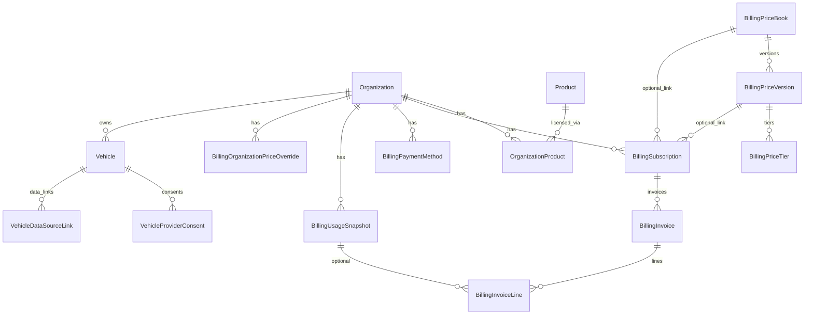
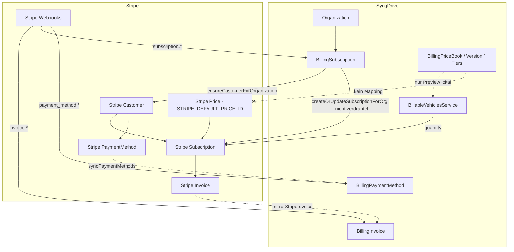
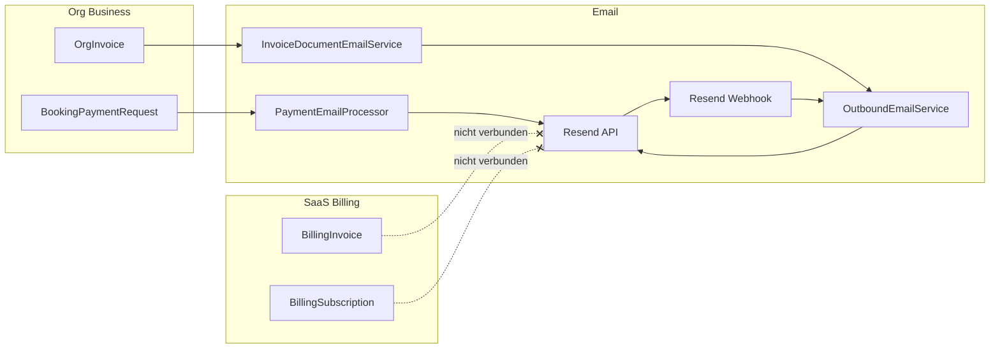
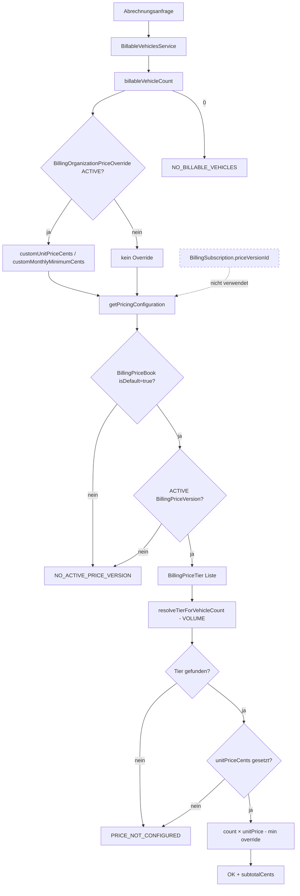
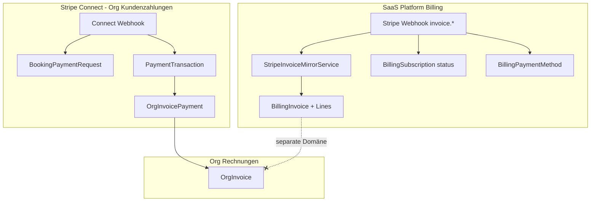

# Billing — Technische Bestandsaufnahme (Current State)

**Stand:** Code-Inventur Prompt 1/44 · Characterization Tests Prompt 2/44 · Canonical Types Prompt 3/44  
**Repository:** `SYNQDRIVE-alpha`  
**Scope:** Verwaltung → Abrechnung & Abo → SynqDrive-Abonnement (Platform-SaaS-Billing)

---

## Executive Summary

Im Code existieren **vier getrennte Billing-/Preis-Domänen**, die nicht vollständig vereinheitlicht sind:

| Domäne | Modelle / Modul | Zweck |
|--------|-----------------|-------|
| **Platform SaaS Billing** | `Billing*` | SynqDrive-Abonnement, Stripe Customer/Subscription, SaaS-Rechnungen |
| **Product Licensing** | `Product`, `OrganizationProduct` | Rental / Fleet / Taxi-Lizenz, Plan-Tier (Starter … Enterprise) |
| **Rental Pricing** | `PriceBook`, `PriceTariff*` | Miet-Tarife pro Organisation (Buchungen, nicht SaaS) |
| **Org Payments & Invoices** | `OrgInvoice*`, `BookingPaymentRequest`, Stripe Connect | Kundenzahlungen der Vermieter, keine SaaS-Abrechnung |

Diese Dokumentation fokussiert auf **Platform SaaS Billing** und die direkt verknüpften Querschnitte (Produkte, Fahrzeug-Abrechnung, Stripe, Resend).

---

## 1. Datenmodelle und Beziehungen

### 1.1 Platform SaaS Billing (`Billing*`)

Definiert in `backend/prisma/schema.prisma` (ab Zeile ~2470).

| Modell | Tabelle | Zweck |
|--------|---------|-------|
| `BillingPriceBook` | `billing_price_books` | Preisbuch (Name, `productKey`, `billingModel`, `interval`, `currency`, `isDefault`) |
| `BillingPriceVersion` | `billing_price_versions` | Versioniertes Preisblatt (`DRAFT` / `ACTIVE` / `ARCHIVED`, `effectiveFrom`/`To`, `tierMode`) |
| `BillingPriceTier` | `billing_price_tiers` | Staffeln (`minVehicles`, `maxVehicles`, `unitPriceCents`, `sortOrder`) |
| `BillingSubscription` | `billing_subscriptions` | Org-Subscription, Stripe-IDs, Status, optional `priceBookId`/`priceVersionId` |
| `BillingInvoice` | `billing_invoices` | Gespiegelte Stripe-SaaS-Rechnung |
| `BillingInvoiceLine` | `billing_invoice_lines` | Rechnungspositionen (optional `usageSnapshotId`) |
| `BillingUsageSnapshot` | `billing_usage_snapshots` | Abrechnungs-Snapshot (Fahrzeuge, Preis, Berechnungsstatus) |
| `BillingPaymentMethod` | `billing_payment_methods` | Gespiegelte Stripe-Zahlungsmethoden |
| `BillingAuditLog` | `billing_audit_logs` | Fachliches Billing-Audit |
| `BillingOrganizationPriceOverride` | `billing_organization_price_overrides` | Org-spezifische Preis-Overrides (Schema vorhanden, **kein API**) |
| `StripeWebhookEvent` | `stripe_webhook_events` | Idempotente Stripe-Webhook-Verarbeitung |

**Beziehungen (vereinfacht):**

```
Organization ──1:N──► BillingSubscription ──1:N──► BillingInvoice ──1:N──► BillingInvoiceLine
     │                      │ optional
     │                      ├──► BillingPriceBook
     │                      └──► BillingPriceVersion
     ├──1:N──► BillingPaymentMethod
     ├──1:N──► BillingUsageSnapshot
     └──1:N──► BillingOrganizationPriceOverride

BillingPriceBook ──1:N──► BillingPriceVersion ──1:N──► BillingPriceTier
```

### 1.2 Product Licensing

| Modell | Tabelle | Zweck |
|--------|---------|-------|
| `Product` | `products` | Katalog: `RENTAL`, `FLEET`, `TAXI` |
| `OrganizationProduct` | `organization_products` | Zuweisung Org ↔ Produkt, `status`, `plan` (`OrgProductPlan`) |

**Enums:** `ProductSlug`, `OrgProductStatus` (ACTIVE/TRIAL/SUSPENDED/CANCELLED), `OrgProductPlan` (STARTER/BUSINESS/PROFESSIONAL/ENTERPRISE/CUSTOM).

### 1.3 Abrechenbare Fahrzeuge

Relevantes Feld auf `Vehicle`:

- `billingExcluded` (`Boolean`, Migration `20260620140000_vehicle_billing_excluded`)

Connectivity wird indirekt über `VehicleProviderConsent` (status ACTIVE) oder `VehicleDataSourceLink` (`isActive`) bestimmt — **kein** `isConnected`-Flag auf `Vehicle`.

### 1.4 Rental Pricing (nicht SaaS)

| Modell | Tabelle | Zweck |
|--------|---------|-------|
| `PriceBook` | `price_books` | Org-spezifisches Miet-Preisbuch |
| `PriceTariffGroup` | `price_tariff_groups` | Tarifgruppen |
| `PriceTariffVersion` | `price_tariff_versions` | Versionierte Miet-Tarife |
| `TariffRate`, `MileagePackage`, … | diverse | Buchungspreise |

Modul: `backend/src/modules/pricing/` — **keine Verknüpfung** zu `BillingPriceBook`.

### 1.5 Org-Rechnungen & Kundenzahlungen (Stripe Connect)

| Modell | Tabelle | Zweck |
|--------|---------|-------|
| `OrgInvoice` | `org_invoices` | Vermieter-Rechnungen an Endkunden |
| `OrgInvoicePayment` | `org_invoice_payments` | Zahlungen auf Org-Rechnungen |
| `BookingPaymentRequest` | `booking_payment_requests` | Stripe-Checkout für Buchungen |
| `PaymentTransaction` | `payment_transactions` | Connect-Zahlungsfluss |
| `OrganizationPaymentAccount` | `organization_payment_accounts` | Stripe Connect Account |

Modul: `backend/src/modules/payments/`, `backend/src/modules/invoices/`.

**Credit Notes / Refunds (SaaS):** Kein dediziertes `BillingCreditNote`- oder `BillingRefund`-Modell. Stripe-Webhook `charge.refunded` triggert nur `syncPaymentMethods`, speichert Refunds nicht lokal.

### 1.6 Migrationen

| Migration | Inhalt |
|-----------|--------|
| `20260311224040_init` | `billing_subscriptions`, `billing_invoices` (Basis) |
| `20260620120000_billing_pricebook_v2` | Pricebook v2, Tiers, Snapshots, Lines, Payment Methods, Webhooks, Audit, Overrides |
| `20260620140000_vehicle_billing_excluded` | `vehicles.billing_excluded` |

Seed (`backend/prisma/seed.ts`): legt Produkte RENTAL/FLEET/TAXI und ein **Default-Preisbuch** mit `productKey: 'FLEET'` an (ohne aktive Version/Preise).

### 1.7 Diagramm: Billing-Datenstruktur



---

## 2. Billing-Backend-Endpunkte

Controller: `backend/src/modules/billing/billing.controller.ts`  
Webhook: `backend/src/modules/billing/stripe-webhook.controller.ts` (`POST /webhooks/stripe`, **ohne JWT**)

### 2.1 Tenant (Permission `billing`)

| Methode | Pfad | Permission | Service |
|---------|------|------------|---------|
| GET | `/billing/summary` | `billing.read` | `BillingSummaryService.getSummary` |
| GET | `/billing/billable-vehicles` | `billing.read` | `BillableVehiclesService` |
| GET | `/billing/next-invoice-preview` | `billing.read` | `BillingSummaryService.getNextInvoicePreview` |
| GET | `/billing/subscriptions` | `billing.read` | `BillingService.findSubscription` |
| GET | `/billing/subscriptions/:id` | `billing.read` | `BillingService.findSubscriptionById` |
| GET | `/billing/invoices` | `billing.read` | `BillingService.findInvoices` |
| GET | `/billing/usage/preview` | `billing.read` | `BillingUsageService.previewUsage` |
| GET | `/billing/usage/snapshots` | `billing.read` | `BillingUsageService.listUsageSnapshots` |
| GET | `/billing/payment-methods` | `billing.read` | `BillingService.findPaymentMethods` |
| GET | `/billing/payment-method` | `billing.read` | `StripePreparedService.getDefaultPaymentMethod` |
| POST | `/billing/stripe/customer-portal` | `billing.write` | `StripePreparedService.createCustomerPortalSession` |
| POST | `/billing/stripe/setup-intent` | `billing.write` | `StripePreparedService.createSetupIntent` |

Org-Scope: `resolveOrgScope()` — Tenant nutzt JWT-`organizationId`; Master Admin muss `?orgId=` übergeben.

### 2.2 Master Admin (`@Roles('MASTER_ADMIN')`)

| Methode | Pfad | Service |
|---------|------|---------|
| GET | `/admin/billing/overview` | `BillingAdminService.getOverview` |
| GET | `/admin/billing/organizations` | `BillingAdminService.listOrganizationsBilling` |
| POST | `/admin/billing/organizations/:orgId/sync-stripe` | `StripePreparedService.syncOrganizationStripe` |
| GET | `/admin/billing/invoices` | `BillingAdminService.listInvoices` |
| GET | `/admin/billing/audit-log` | `BillingAdminService.listAuditLog` |
| GET | `/admin/billing/subscriptions` | `BillingService.findAllSubscriptions` |
| GET | `/admin/billing/revenue-stats` | `BillingService.getRevenueStats` |
| GET | `/admin/billing/pricebooks` | `PricebookService.listPriceBooks` |
| GET | `/admin/billing/pricebooks/config` | `PricebookService.getPricingConfiguration` |
| GET | `/admin/billing/pricebooks/:id` | `PricebookService.getPriceBook` |
| GET | `/admin/billing/pricebooks/:id/versions` | `PricebookService.listVersions` |
| POST | `/admin/billing/pricebooks` | `PricebookService.createPriceBook` |
| POST | `/admin/billing/pricebooks/:priceBookId/versions` | `PricebookService.createDraftVersion` |
| PATCH | `/admin/billing/price-versions/:versionId` | `PricebookService.patchDraftVersion` |
| PUT | `/admin/billing/price-versions/:versionId/tiers` | `PricebookService.replaceDraftTiers` |
| POST | `/admin/billing/price-versions/:versionId/publish` | `PricebookService.publishVersion` |
| POST | `/admin/billing/price-versions/:versionId/archive` | `PricebookService.archiveVersion` |
| GET | `/admin/billing/payment-methods` | `BillingAdminService.listPaymentMethodsAdmin` |
| GET | `/admin/billing/stripe-status` | `BillingAdminService.getStripeStatus` |
| GET | `/admin/billing/webhook-events` | `BillingAdminService.listWebhookEvents` |
| POST | `/billing/subscriptions` | `BillingService.createSubscription` (manuell, Master only) |

### 2.3 Verwandte Endpunkte (nicht SaaS-Billing)

| Modul | Pfad-Präfix | Zweck |
|-------|-------------|-------|
| `products` | `/admin/products/*` | Produkt-Zuweisung an Orgs |
| `pricing` | `/pricing/*`, `/price-tariffs/*` | Miet-Tarife |
| `payments` | `/payments-connect/*`, `/bookings/:id/payments/*` | Stripe Connect |
| `invoices` | `/invoices/*` | `OrgInvoice` CRUD |
| `outbound-email` | `/org-email/*`, `POST /webhooks/resend` | E-Mail-Versand |

**Kein dediziertes Billing-Repository:** Alle Billing-Services nutzen `PrismaService` direkt.

---

## 3. Services und Verantwortlichkeiten

| Service | Datei | Verantwortung |
|---------|-------|---------------|
| `BillingService` | `billing.service.ts` | Subscriptions/Invoices lesen, Plan-Display aus `OrganizationProduct`, MRR aus letzter PAID-Invoice, manuelles `createSubscription`/`recordInvoice` |
| `PricebookService` | `pricebook.service.ts` | CRUD Preisbücher/Versionen/Tiers, Publish/Archive, `getPricingConfiguration()` (globaler Default) |
| `BillingPriceResolutionService` | `billing-price-resolution.service.ts` | Tier-Auflösung, VOLUME-Preisberechnung, Org-Overrides einbeziehen |
| `BillingCalculationUtil` | `billing-calculation.util.ts` | Reine Funktionen: Tier-Validierung, Overlap-Check, `calculateVolumePricing` |
| `BillableVehiclesService` | `billable-vehicles.service.ts` | Connected/Billable-Fahrzeuglogik |
| `BillingUsageService` | `billing-usage.service.ts` | Usage-Preview, `createUsageSnapshot` (nicht automatisch getriggert) |
| `BillingSummaryService` | `billing-summary.service.ts` | Tenant-`summary`, `next-invoice-preview`, Warnings |
| `BillingAdminService` | `billing-admin.service.ts` | Master-Overview, Org-Liste, Admin-Invoices, Stripe-Status |
| `StripeBillingService` | `stripe-billing.service.ts` | Stripe Customer, Portal, SetupIntent, Subscription create/update, PaymentMethod-Sync |
| `StripePreparedService` | `stripe-prepared.service.ts` | Graceful Degradation wenn Stripe nicht konfiguriert (501 NOT_IMPLEMENTED) |
| `StripeInvoiceMirrorService` | `stripe-invoice-mirror.service.ts` | Stripe Invoice → `BillingInvoice` + Lines |
| `StripeWebhookService` | `stripe-webhook.service.ts` | Webhook-Verifikation, Event-Dispatch, Idempotenz |
| `BillingAuditService` | `billing-audit.service.ts` | Schreibt `BillingAuditLog` |
| `BillingScopeUtil` | `billing-scope.util.ts` | Org-Scope-Auflösung |
| `StripeStatusMapper` | `stripe-status.mapper.ts` | Stripe → `BillingStatus` / `InvoiceStatus` Mapping |
| `ProductsService` | `modules/products/products.service.ts` | Produkt-Zuweisung (RENTAL/FLEET/TAXI) |

---

## 4. Bestehender Stripe-Ablauf (SaaS)

### 4.1 Konfiguration

`backend/src/config/stripe.config.ts`:

| Env-Variable | Verwendung |
|--------------|------------|
| `STRIPE_SECRET_KEY` | API-Client |
| `STRIPE_WEBHOOK_SECRET` | SaaS-Webhook-Signatur |
| `STRIPE_CONNECT_WEBHOOK_SECRET` | Connect-Webhook (separates Modul) |
| `STRIPE_DEFAULT_PRICE_ID` | **Einziger** Stripe Price für Subscriptions |
| `STRIPE_CUSTOMER_PORTAL_RETURN_URL` / `APP_URL` | Portal-Rückkehr-URL |

### 4.2 Customer-Erstellung

`StripeBillingService.ensureCustomerForOrganization()`:

1. Prüft bestehende `stripeCustomerId` auf `BillingSubscription`
2. Erstellt Stripe Customer mit Org-Metadaten (`organizationId`, `synqdrive: true`)
3. Speichert `stripeCustomerId` auf primärer `BillingSubscription` (legt Record mit Status `TRIALING` an falls fehlend)

### 4.3 Subscription-Erstellung

`StripeBillingService.createOrUpdateSubscriptionForOrg()`:

1. Liest `STRIPE_DEFAULT_PRICE_ID` — **ohne Mapping** zu SynqDrive-Pricebook
2. `quantity = max(billableVehicleCount, 1)`
3. Create oder Update via Stripe API (`items: [{ price, quantity }]`)
4. `applyStripeSubscription()` spiegelt Status/Perioden lokal

**Wichtig:** Diese Methode wird **nirgends aus Controller/Webhook aufgerufen** — nur intern definiert und in Specs testbar.

### 4.4 Webhooks (`POST /webhooks/stripe`)

Verarbeitete Events:

| Event | Aktion |
|-------|--------|
| `customer.updated` | `syncPaymentMethods` |
| `payment_method.attached` | `syncPaymentMethods` |
| `customer.subscription.*` | `applyStripeSubscription` + `syncPaymentMethods` |
| `invoice.created/finalized/paid/payment_failed` | `mirrorStripeInvoice` + Subscription-Refresh + PM-Sync |
| `charge.refunded` | nur `syncPaymentMethods` |

Idempotenz über `StripeWebhookEvent` (`stripeEventId` unique).

### 4.5 Customer Portal

`stripe.billingPortal.sessions.create({ customer, return_url })` — Tenant-Endpunkt `POST /billing/stripe/customer-portal`.

### 4.6 Stripe Products / Prices

- **Kein** lokales Mapping-Modell `StripeProduct` / `StripePrice`
- SynqDrive-Preisbuch ist **vollständig entkoppelt** von Stripe Prices
- Ein globaler `STRIPE_DEFAULT_PRICE_ID` steuert die tatsächliche Stripe-Abrechnung

### 4.7 Diagramm: Stripe-Verdrahtung



---

## 5. Bestehender Resend-Ablauf

### 5.1 Outbound Email (Resend)

Modul: `backend/src/modules/outbound-email/`

- Provider: `ResendEmailProvider` (`providers/resend-email.provider.ts`)
- Webhook: `POST /webhooks/resend` (`resend-webhook.controller.ts`)
- Konfiguration: `email.resendApiKey` (Config-Modul)

**Verwendung:**

| Service | Zweck |
|---------|-------|
| `InvoiceDocumentEmailService` | Versand von `OrgInvoice`-PDFs an Endkunden |
| `BookingDocumentEmailService` | Buchungsdokumente |
| `OutboundEmailPolicyService` | Absender/Reply-To (inkl. `org.invoiceEmail`) |

### 5.2 Payment Email (Connect, nicht SaaS)

Modul: `backend/src/modules/payments/email/`

- `PaymentEmailSchedulerService` — Cron `*/30 * * * * *` (alle 30s)
- `PaymentEmailResendService` — erneuter Versand von Zahlungslinks (Buchungen)
- Nutzt Resend indirekt über Payment-Email-Pipeline

### 5.3 Verbindung zu SaaS-Billing

**Resend ist nicht mit SaaS-Billing-Ereignissen verbunden:**

- Kein Versand bei `invoice.paid`, `invoice.payment_failed`, Subscription-Änderungen
- Keine Billing-Templates für SynqDrive-Plattform-Rechnungen
- `BillingInvoice` hat kein `outboundEmail`-Link

### 5.4 Diagramm: Resend-Verdrahtung



---

## 6. Master-Admin-Billing-Oberfläche

**Einstieg:** Master Sidebar Route `billing` → `BillingControlCenter`  
**Datei:** `frontend/src/master/components/billing/BillingControlCenter.tsx`  
**Deprecated Alias:** `SubscriptionsView.tsx` re-exportiert `BillingControlCenter`

### 6.1 Tabs

| Tab | Komponente | API |
|-----|------------|-----|
| Overview | `BillingOverviewTab.tsx` | `GET /admin/billing/overview` |
| Organizations | `BillingOrganizationsTab.tsx` | `GET /admin/billing/organizations` |
| Pricing | `BillingPricingTab.tsx` | Pricebook-CRUD-Endpunkte |
| Invoices | `BillingInvoicesTab.tsx` | `GET /admin/billing/invoices` |
| Payment Methods | `BillingPaymentMethodsTab.tsx` | `GET /admin/billing/payment-methods` |
| Stripe / Webhooks | `BillingStripeTab.tsx` | `stripe-status`, `webhook-events` |
| Audit Log | `BillingAuditLogTab.tsx` | `GET /admin/billing/audit-log` |

### 6.2 Org-Detail-Drawer

`BillingOrgDetailDrawer.tsx`:

- Zeigt Subscription, Fahrzeuge, Preisstatus, Preview, letzte Rechnung
- **Funktional:** `POST /admin/billing/organizations/:orgId/sync-stripe`
- **Nicht angebunden (UI-Hinweis):** Trial, Status-Override, Custom Price Override

### 6.3 Deaktivierte / Mock-UI

| Element | Datei | Status |
|---------|-------|--------|
| „Invoice Export“ Button | `BillingControlCenter.tsx` | `disabled`, Tooltip: Backend nicht angebunden |
| „Stripe Sync prüfen“ | `BillingStripeTab.tsx` | `disabled`, Tooltip: Prompt 2 |
| `api.billing.subscriptions()` | `api.ts` | Definiert, **Frontend nutzt es nicht** |
| `api.billing.revenueStats()` | `api.ts` | Definiert, **Frontend nutzt es nicht** |

### 6.4 Zugriff

Nur `MASTER_ADMIN` (`isMasterAdmin()` / `platformRole === 'MASTER_ADMIN'`).

---

## 7. Tenant-Billing-Oberfläche

**Einstieg:** Verwaltung → Abrechnung & Abo (`SettingsView.tsx`, Tab `billing`)  
**Komponente:** `frontend/src/rental/components/billing/BillingTab.tsx`

### 7.1 Abschnitte

| Bereich | Komponente | Datenquelle |
|---------|------------|-------------|
| Status-Hero | `BillingStatusHero.tsx` | `GET /billing/summary` |
| Subscription | `BillingSubscriptionCard.tsx` | summary |
| Preisstaffel | `BillingPriceTierLadder.tsx` | summary.`priceTiers` |
| Zahlungsmethode | `BillingPaymentMethodCard.tsx` | summary + Stripe Actions |
| Rechnungen | `BillingInvoiceSection.tsx` | `GET /billing/invoices` |
| Fahrzeuge | `BillableVehiclesDrawer.tsx` | `GET /billing/billable-vehicles` |
| Kundenzahlungen | `CustomerPaymentsTab.tsx` | Stripe Connect (`api.paymentsConnect.*`) |

### 7.2 Stripe-Aktionen (Tenant)

`useBillingStripeActions.ts`:

- Customer Portal (`POST /billing/stripe/customer-portal`) wenn Stripe konfiguriert
- Graceful Fehler bei `NOT_CONFIGURED` / HTTP 501

### 7.3 Permission

Modul-Key `billing` — Org Admin: read/write/manage; Sub-Admin: read-only (`organization-role.defaults.ts`).

### 7.4 Daten-Hook

`useBillingData.ts` lädt parallel:

- `api.billing.orgSummary(orgId)`
- `api.billing.orgInvoices(orgId)`
- `api.billing.orgBillableVehicles(orgId)`

**Nicht geladen:** `orgSubscriptions()`, `usage/preview`, `usage/snapshots` (obwohl API existiert).

---

## 8. Aktuell verwendete Tarif- und Preiswahrheiten

| Wahrheit | Quelle | Verwendung |
|----------|--------|------------|
| **Produkttyp (Rental/Fleet)** | `OrganizationProduct` + `Product.slug` | UI-Anzeige, Plan-Label; **nicht** für Preisauflösung |
| **Plan-Tier** | `OrganizationProduct.plan` | Display in `BillingService.computePlan()` / Summary — **kein Einfluss auf Preisberechnung** |
| **SaaS-Preis** | `BillingPriceBook` mit `isDefault=true` + ACTIVE `BillingPriceVersion` + Tiers | Preview, Summary, Admin-Overview |
| **Org-Override** | `BillingOrganizationPriceOverride` (ACTIVE, gültig) | In Preview/Summary berücksichtigt — **nur lesend**, kein Admin-API |
| **Stripe-Abrechnung** | `STRIPE_DEFAULT_PRICE_ID` × quantity | Tatsächliche Stripe-Subscription (wenn erstellt) |
| **MRR (Admin)** | Letzte `PAID` `BillingInvoice.amountCents` pro Subscription | `getRevenueStats`, `getOverview` |
| **Miet-Tarife** | Org-`PriceBook` / `PriceTariffVersion` | Buchungen only |
| **Org BusinessType** | `Organization.businessType` | Profil/Stats — **nicht** an `ProductSlug` gekoppelt |

**Seed-Default:** Preisbuch `productKey: 'FLEET'`, `isDefault: true` — gilt global für alle Orgs unabhängig vom zugewiesenen Produkt.

---

## 9. Bekannte Legacy-Strukturen

| Legacy | Details |
|--------|---------|
| `OrgProductPlan` STARTER…ENTERPRISE | Ursprüngliches Plan-Modell; weiterhin in UI als Label, nicht preisrelevant |
| `BillingSubscription` ohne Pricebook-Link | `priceBookId`/`priceVersionId` existieren seit v2-Migration, werden **nicht** bei Erstellung/Sync gesetzt |
| `SubscriptionsView` | Deprecated Wrapper um `BillingControlCenter` |
| `BillingService.mapInvoiceStatus` | Mappt `VOID` → Display „Paid“ (vermutlich Legacy-Kompatibilität) |
| `OrgInvoice.invoiceNumber` | Deprecated global autoincrement |
| `ProductLicenseGuard` + `@RequireProduct` | Guard implementiert, Decorator **nirgends verwendet** |
| `BillingTierMode.GRADUATED` | Enum + Kommentar „reserved for future“ — Logik fällt auf VOLUME zurück |
| Demo-Fahrzeug-Erkennung | `[DEMO]`-Prefix in `vehicleName` statt dediziertem Flag |
| Init-Migration `billing_*` | Subscriptions/Invoices ohne Lines/Snapshots; v2 erweitert |

---

## 10. Risiken und Inkonsistenzen

### 10.1 Konkurrierende Billing-Wahrheiten

1. **SynqDrive Pricebook vs. Stripe Price** — Preview nutzt lokale Tiers; Stripe nutzt `STRIPE_DEFAULT_PRICE_ID`
2. **`OrganizationProduct.plan` vs. Billing-Tiers** — Plan-Label unabhängig von Fahrzeug-Staffelpreis
3. **`productKey` auf Default-Pricebook vs. Org-Produkt** — Seed/Default=FLEET; Org kann RENTAL haben
4. **MRR-Berechnung** — Letzte PAID-Invoice (historisch) vs. `next-invoice-preview` (berechnet)
5. **`BillingSubscription.priceVersionId`** — Schema-Feld vs. globale `getPricingConfiguration()`
6. **Rental `PriceBook` vs. `BillingPriceBook`** — Namensähnlich, völlig getrennte Domänen
7. **`Organization.businessType` vs. `ProductSlug`** — Parallele Konzepte ohne Sync

### 10.2 Kritische Risiken

| Risiko | Auswirkung |
|--------|------------|
| `createOrUpdateSubscriptionForOrg` nicht verdrahtet | Stripe-Subscriptions werden nicht automatisch aus Fahrzeugzahl erstellt/aktualisiert |
| Kein Pricebook→Stripe-Mapping | Admin-konfigurierte Preise beeinflussen Stripe nicht |
| `createUsageSnapshot` ohne Scheduler | Keine periodischen Abrechnungs-Snapshots |
| Refunds nicht lokal persistiert | `charge.refunded` ohne Billing-Audit/Invoice-Anpassung |
| Payment failures nur via Invoice-Status | Kein dediziertes Failure-Event-Modell |
| `BillingOrganizationPriceOverride` ohne API | Overrides nur per DB/manuell |
| `ProductLicenseGuard` ungenutzt | Produkt-Lizenz nicht durchgängig erzwungen |
| Quantity min 1 bei 0 billable vehicles | Stripe würde mindestens 1 Einheit berechnen |
| `GRADUATED` tier mode unimplementiert | Veröffentlichte graduated Versionen verhalten sich wie VOLUME |

---

## 11. Relevante Dateien (vollständige Pfade)

### Backend — Billing-Kern

```
backend/prisma/schema.prisma
backend/prisma/seed.ts
backend/prisma/migrations/20260311224040_init/migration.sql
backend/prisma/migrations/20260620120000_billing_pricebook_v2/migration.sql
backend/prisma/migrations/20260620140000_vehicle_billing_excluded/migration.sql
backend/src/config/stripe.config.ts
backend/src/modules/billing/billing.module.ts
backend/src/modules/billing/billing.controller.ts
backend/src/modules/billing/billing.service.ts
backend/src/modules/billing/billing-admin.service.ts
backend/src/modules/billing/billing-summary.service.ts
backend/src/modules/billing/billing-usage.service.ts
backend/src/modules/billing/billing-price-resolution.service.ts
backend/src/modules/billing/billing-calculation.util.ts
backend/src/modules/billing/billing-audit.service.ts
backend/src/modules/billing/billing-scope.util.ts
backend/src/modules/billing/billable-vehicles.service.ts
backend/src/modules/billing/pricebook.service.ts
backend/src/modules/billing/stripe-billing.service.ts
backend/src/modules/billing/stripe-prepared.service.ts
backend/src/modules/billing/stripe-invoice-mirror.service.ts
backend/src/modules/billing/stripe-webhook.service.ts
backend/src/modules/billing/stripe-webhook.controller.ts
backend/src/modules/billing/stripe-status.mapper.ts
backend/src/modules/billing/stripe-client.util.ts
backend/src/modules/billing/dto/billing.dto.ts
```

### Backend — Verwandt

```
backend/src/modules/products/products.module.ts
backend/src/modules/products/products.controller.ts
backend/src/modules/products/products.service.ts
backend/src/shared/guards/product-license.guard.ts
backend/src/shared/decorators/require-product.decorator.ts
backend/src/modules/users/defaults/organization-role.defaults.ts
backend/src/modules/pricing/  (Rental — gesamtes Modul)
backend/src/modules/payments/  (Stripe Connect — gesamtes Modul)
backend/src/modules/invoices/  (OrgInvoice — gesamtes Modul)
backend/src/modules/outbound-email/  (Resend — gesamtes Modul)
backend/src/modules/organizations/organizations.service.ts
```

### Frontend — Master Admin

```
frontend/src/master/App.tsx
frontend/src/master/components/billing/BillingControlCenter.tsx
frontend/src/master/components/billing/BillingOverviewTab.tsx
frontend/src/master/components/billing/BillingOrganizationsTab.tsx
frontend/src/master/components/billing/BillingPricingTab.tsx
frontend/src/master/components/billing/BillingInvoicesTab.tsx
frontend/src/master/components/billing/BillingPaymentMethodsTab.tsx
frontend/src/master/components/billing/BillingStripeTab.tsx
frontend/src/master/components/billing/BillingAuditLogTab.tsx
frontend/src/master/components/billing/BillingOrgDetailDrawer.tsx
frontend/src/master/components/billing/BillingAdminInvoiceDrawer.tsx
frontend/src/master/components/billing/BillingPublishModal.tsx
frontend/src/master/components/billing/useAdminBillingCore.ts
frontend/src/master/components/billing/admin-billing.utils.ts
frontend/src/master/types/admin-billing.types.ts
frontend/src/master/components/SubscriptionsView.tsx
```

### Frontend — Tenant

```
frontend/src/rental/components/SettingsView.tsx
frontend/src/rental/components/billing/BillingTab.tsx
frontend/src/rental/components/billing/BillingStatusHero.tsx
frontend/src/rental/components/billing/BillingSubscriptionCard.tsx
frontend/src/rental/components/billing/BillingPriceTierLadder.tsx
frontend/src/rental/components/billing/BillingPaymentMethodCard.tsx
frontend/src/rental/components/billing/BillingInvoiceSection.tsx
frontend/src/rental/components/billing/BillingInvoiceDetailDrawer.tsx
frontend/src/rental/components/billing/BillableVehiclesDrawer.tsx
frontend/src/rental/components/billing/CustomerPaymentsTab.tsx
frontend/src/rental/components/billing/useBillingData.ts
frontend/src/rental/components/billing/useBillingStripeActions.ts
frontend/src/rental/components/billing/billing-stripe-ui.ts
frontend/src/rental/components/billing/billing.utils.ts
frontend/src/rental/components/billing/billing-load.utils.ts
frontend/src/rental/types/billing.types.ts
frontend/src/lib/api.ts
```

---

## 12. Tests und Testlücken

### 12.1 Vorhandene Tests (Billing)

**Backend** (`backend/src/modules/billing/*.spec.ts`):

| Datei | Fokus |
|-------|-------|
| `billing.service.spec.ts` | Subscription-Formatierung, Plan-Compute |
| `billing-summary.service.spec.ts` | Preview-Erklärungen, Warnings |
| `billing-calculation.util.spec.ts` | Tier-Logik, Overrides |
| `billing-scope.util.spec.ts` | Org-Scope |
| `billable-vehicles.service.spec.ts` | Billable/Excluded-Logik |
| `pricebook.service.spec.ts` | Publish, Tier-Validation |
| `stripe-billing.service.spec.ts` | Customer idempotent, Portal, Sync |
| `stripe-prepared.service.spec.ts` | NOT_CONFIGURED-Pfade |
| `stripe-status.mapper.spec.ts` | Status-Mapping |
| `stripe-webhook.service.spec.ts` | Webhook-Dispatch |

**Frontend:**

| Datei | Fokus |
|-------|-------|
| `billing-load.utils.test.ts` | Fehler-Mapping |
| `useBillingData.test.ts` | Hook-Verhalten |
| `payments-connect.utils.test.ts` | Connect-UI + BillingTab-Struktur |
| `billing-control-center.test.ts` | Deprecated-Alias |

### 12.2 Testlücken

| Bereich | Lücke |
|---------|-------|
| `billing-admin.service` | Keine Spec |
| `billing-price-resolution.service` | Characterization in `billing-price-resolution.characterization.spec.ts` |
| `stripe-invoice-mirror.service` | Characterization in `stripe-invoice-mirror.characterization.spec.ts` |
| `billing.controller` | Security/isolation in `billing.controller.security.characterization.spec.ts` |
| Pricebook ↔ Stripe Mapping | Nicht testbar (nicht implementiert) |
| `createUsageSnapshot` + Scheduler | Kein Test, kein Scheduler |
| `BillingOrganizationPriceOverride` API | Kein API → keine Tests |
| SaaS-Billing E2E | Keine Playwright/Cypress-Suite |
| Webhook `invoice.payment_failed` End-to-End | Unit + characterization dispatch |
| Master Admin Pricing Tab | Keine Component-Tests |
| Resend + SaaS Billing | Characterization: bewusst getrennt dokumentiert |

---

## Characterization test coverage (Prompt 2)

**Commit:** `billing: prompt 02 characterization tests`  
**Ausführung:** `cd backend && npm test -- --testPathPattern="billing|outbound-email-infrastructure"`

Alle Characterization-Tests mocken **Stripe** (`stripe-client.util`, Stripe SDK-Methoden) und **Resend** (`global.fetch`) vollständig — keine echten Provider-Aufrufe.

### Getestete Bereiche

| Bereich | Testdatei(en) | Abgedeckte Szenarien |
|---------|---------------|----------------------|
| Controller-Security & Permissions | `billing.controller.security.characterization.spec.ts`, `billing.permissions.characterization.spec.ts` | Guards, `billing.read`/`billing.write`, MASTER_ADMIN-Routen |
| Organisationsisolation | `billing.controller.security.characterization.spec.ts`, `billing-multi-tenant.access.characterization.spec.ts`, `billing-scope.util.spec.ts` | Org-Scope, Cross-Org-Ablehnung, Invoice/PM-Query-Scoping |
| Billing Summary | `billing-summary.characterization.spec.ts` | Produkte, Fahrzeuge, Tier, Preview, Warnings, Overrides |
| Tarif-/Preisauflösung | `billing-price-resolution.characterization.spec.ts`, `billing-calculation.util.spec.ts` | Default-Pricebook, Version, Tiers, Overrides, NO_*-Status |
| Abrechenbare Fahrzeuge | `billable-vehicles.characterization.spec.ts`, `billable-vehicles.service.spec.ts` | Connectivity, Status, DEMO, billingExcluded, Org inactive |
| Rechnungsstatus | `billing-invoice-status.characterization.spec.ts`, `stripe-status.mapper.spec.ts` | PAID/OPEN/VOID/UNCOLLECTIBLE, Stripe→lokal |
| Stripe Webhooks | `stripe-webhook.characterization.spec.ts`, `stripe-webhook.service.spec.ts` | Signatur, Idempotenz, Duplikate, invoice.*, charge.refunded |
| Zahlungsmethoden-Sync | `stripe-billing.characterization.spec.ts`, `stripe-billing.service.spec.ts` | upsert/detach, default PM, kein Customer |
| Customer Portal | `stripe-billing.characterization.spec.ts`, `stripe-billing.service.spec.ts` | Portal-Session, returnUrl |
| Invoice Mirror | `stripe-invoice-mirror.characterization.spec.ts` | create/update, kein Mapping, Line-Replace |
| Resend / Outbound Email | `outbound-email-infrastructure.characterization.spec.ts` | Provider-Auswahl, mocked fetch, Billing-Entkopplung |
| Master vs Tenant | `billing.controller.security.characterization.spec.ts`, `billing.permissions.characterization.spec.ts` | MASTER_ADMIN bypass, Tenant org-bound |

**Teststand Prompt 2:** 21 Suites, 151 Tests (billing + outbound-email-infrastructure), alle grün.

### Bewusst festgehaltenes Legacy-Verhalten

| Test | Aktuelles Verhalten | Problem | Korrektur geplant |
|------|---------------------|---------|-------------------|
| `billing-invoice-status` — VOID → Paid | `displayStatus: 'Paid'` für `InvoiceStatus.VOID` | Stornierte Rechnung wirkt bezahlt | Prompt 25 |
| `billing-summary` / `billing-price-resolution` — subscription priceVersionId | Globaler Default-Pricebook, nicht `BillingSubscription.priceVersionId` | Org-/Vertragsspezifische Preise ignoriert | Prompt 10 |
| `stripe-webhook` — charge.refunded | Nur `syncPaymentMethods`, kein Refund-Record | Keine lokale Refund-Historie | Prompt 25 |
| `stripe-invoice-mirror` — usageSnapshotId | Mirror-Lines ohne Usage-Snapshot-Link | Keine lokale Abrechnungs-Nachvollziehbarkeit pro Periode | Prompt 25 |
| `outbound-email` — billing boundary | SaaS-Billing importiert keine Resend-Services | Keine Plattform-Rechnungs-E-Mails | Prompt 30+ |

### Testability-Anpassungen

**Keine Produktionslogik geändert.** Alle Tests nutzen bestehende öffentliche APIs (`formatInvoiceForApi`, Controller-Methoden, Services mit gemocktem Prisma/Stripe).

### Verbleibende Testlücken (nach Prompt 2)

| Bereich | Status |
|---------|--------|
| `billing-admin.service` | Ungetestet |
| `createOrUpdateSubscriptionForOrg` End-to-End | Ungetestet (Methode nicht verdrahtet) |
| HTTP E2E (supertest) für `/billing/*` | Ungetestet |
| Frontend Billing Characterization | Nur bestehende 4 Frontend-Tests |
| `BillingUsageService.createUsageSnapshot` | Ungetestet |
| Stripe Connect (separate Domäne) | Eigene Specs in `payments/`, nicht Teil dieses Prompts |
| Resend Webhook (`resend-webhook.service.spec.ts`) | Vorhanden, nicht billing-gekoppelt |


---

## Prüffragen (explizite Antworten aus dem Code)

### Wo wird entschieden, ob eine Organisation Rental oder Fleet besitzt?

Über **`OrganizationProduct`** mit Verknüpfung zu **`Product.slug`** (`RENTAL`, `FLEET`, `TAXI`).

- **Zuweisung:** `ProductsService.assignProduct(orgId, productSlug, plan?)` via `POST /admin/products/assign`
- **Anzeige:** `BillingSummaryService.getSummary()` → `products[]` aus aktiven `OrganizationProduct`-Einträgen
- **Erzwingung:** `ProductLicenseGuard` prüft ACTIVE-Lizenz — **aber `@RequireProduct` wird nirgends deklariert**, Guard ist effektiv ungenutzt
- **Nicht verwendet:** `Organization.businessType` (eigenes Enum) für Billing-Entscheidungen

### Wo wird entschieden, welche Preisversion für eine Organisation gilt?

**Globaler Default**, nicht org-spezifisch:

1. `PricebookService.getPricingConfiguration()` → `BillingPriceBook` mit `isDefault: true`
2. ACTIVE `BillingPriceVersion` (höchste `versionNumber`, `effectiveFrom`/`To` geprüft in `findActiveVersion`)
3. Optional: `BillingOrganizationPriceOverride` für `customUnitPriceCents` / `customMonthlyMinimumCents` (nur Berechnung, nicht Version-Auswahl)

**`BillingSubscription.priceVersionId` wird in der Preisauflösung nicht gelesen.**

### Wird die Subscription-spezifische Price Version verwendet oder ein globaler Default?

**Globaler Default** (`isDefault` Pricebook + ACTIVE Version). Subscription-Felder `priceBookId`/`priceVersionId` sind Schema-only.

### Wo wird die abrechenbare Fahrzeugmenge berechnet?

`BillableVehiclesService.getBillableConnectedVehiclesForOrganization()` in  
`backend/src/modules/billing/billable-vehicles.service.ts`

Verwendet von: Summary, Usage-Preview, Admin-Overview, Stripe `createOrUpdateSubscriptionForOrg` (quantity).

### Welche Fahrzeugzustände beeinflussen die Abrechnung?

| Bedingung | Effekt |
|-----------|--------|
| Org `status !== ACTIVE` | EXCLUDED (`ORG_INACTIVE`) |
| `vehicle.billingExcluded === true` | EXCLUDED (`BILLING_EXCLUDED`) |
| `vehicle.status === OUT_OF_SERVICE` | EXCLUDED (`DISABLED`) |
| `vehicleName` matcht `/^\[DEMO\]/i` | EXCLUDED (`DEMO`) |
| Nicht connected (kein ACTIVE Consent, kein active DataSourceLink) | EXCLUDED (`NOT_CONNECTED`) |
| Sonst + connected | **BILLABLE** |

`AVAILABLE`, `RENTED`, `IN_SERVICE`, `RESERVED` sind billable, sofern connected und nicht ausgeschlossen.

### Wie wird eine Stripe Subscription erstellt?

`StripeBillingService.createOrUpdateSubscriptionForOrg()`:

```typescript
stripe.subscriptions.create({
  customer: customerId,
  items: [{ price: STRIPE_DEFAULT_PRICE_ID, quantity: max(billable, 1) }],
  metadata: { organizationId },
});
```

Oder Update bestehender Subscription-Item-Quantity.  
**Kein Controller-/Webhook-Aufruf** im aktuellen Code — manuell nur indirekt über Stripe Dashboard + Webhook-Sync möglich.

### Wie werden Stripe Product und Stripe Price zugeordnet?

**Gar nicht lokal.** Einzige Zuordnung: Env-Variable `STRIPE_DEFAULT_PRICE_ID`. Kein SynqDrive-Modell für Stripe Product/Price IDs.

### Wie werden Rechnungen lokal gespeichert?

`StripeInvoiceMirrorService.mirrorStripeInvoice()`:

- Upsert `BillingInvoice` keyed by `stripeInvoiceId`
- Ersetzt `BillingInvoiceLine` aus `invoice.lines.data`
- Verknüpft über `BillingSubscription` (via `stripeSubscriptionId` oder `stripeCustomerId`)
- **Keine** Verknüpfung zu `BillingUsageSnapshot` beim Mirror (usageSnapshotId bleibt null)

Zusätzlich: `BillingService.recordInvoice()` für manuelle Erstellung (nicht Webhook-Pfad).

### Wie werden Zahlungen und Zahlungsfehler gespeichert?

**Zahlungen (SaaS):**

- Erfolg: `BillingInvoice.status = PAID`, `paidAt` aus Stripe
- Offen: `OPEN` / `DRAFT`
- Fehler: `invoice.payment_failed` Webhook → Mirror mit Status `OPEN`/`UNCOLLECTIBLE` + Subscription-Status `PAST_DUE` via `mapStripeSubscriptionStatus`

**Zahlungsmethoden:** `BillingPaymentMethod` via `syncPaymentMethods()` (Karten-Metadaten, default flag)

**Nicht vorhanden:** Dediziertes `BillingPayment`/`BillingPaymentFailure`-Event, Retry-Historie, Dunning-Log

### Ist Resend bereits mit Billing-Ereignissen verbunden?

**Nein** für SaaS-Billing. Resend wird für OrgInvoice-Dokumente und Connect-Payment-Emails genutzt, nicht für SynqDrive-Subscription/Rechnungen.

### Welche Teile sind nur UI oder Mock und nicht funktional angebunden?

| Teil | Status |
|------|--------|
| Master „Invoice Export“ | UI disabled |
| Master „Stripe Sync prüfen“ (Stripe Tab) | UI disabled |
| Org Drawer: Trial / Status-Override / Price Override | UI-Hinweis „nicht angebunden“ |
| `api.billing.subscriptions()` / `revenueStats()` | API existiert, Frontend ungenutzt |
| `createOrUpdateSubscriptionForOrg` | Backend-only, nicht exponiert |
| `BillingOrganizationPriceOverride` | DB-Schema + Leselogik, kein CRUD-API |
| `ProductLicenseGuard` | Implementiert, nicht angewendet |
| Tenant `usage/snapshots` API | Nicht in UI eingebunden |

### Welche konkurrierenden Billing-Wahrheiten existieren?

Siehe Abschnitt 10.1 (7 dokumentierte Konflikte).

---

## Diagramm: Preisauflösung (aktuell)



---

## Diagramm: Rechnungs- und Zahlungsverdrahtung



---

## Jobs, Cronjobs, Queues, Worker

| Komponente | Billing-Relevanz |
|------------|------------------|
| `BillingUsageService.createUsageSnapshot()` | **Manuell aufrufbar**, kein Scheduler |
| `PaymentEmailSchedulerService` | Cron 30s — **Connect** Payment-Emails, nicht SaaS |
| `InvoiceOverdueSchedulerService` | Cron — **OrgInvoice** overdue, nicht BillingInvoice |
| `StripeWebhookService` | Event-driven, keine Queue |
| Task/Notification Schedulers | Nicht billing-bezogen |

**Kein SaaS-Billing-Cron** für Snapshot-Erstellung, Subscription-Quantity-Sync oder Dunning.

---

## Rollen und Permissions

| Akteur | Billing-Zugriff |
|--------|-----------------|
| `MASTER_ADMIN` | Alle `/admin/billing/*`, kann `?orgId=` für Tenant-Endpunkte |
| Org Admin | `billing`: read/write/manage |
| Sub-Admin | `billing`: read-only |
| Worker-Rollen | `billing`: read (in workerReadPermissions-Liste) |

Permission-Key: `billing` (Modul in `organization-role.defaults.ts`).

Payment-Submodule (`payments`, `payments-connect`, `payments-refund`, …) sind **separat** von SaaS-`billing`.

---

## Abschlussbericht (Prompt 1)

### Erstellte Dateien

- `docs/billing/billing-current-state.md` (diese Datei)

### Untersuchte Hauptmodule

- `backend/src/modules/billing/` (vollständig)
- `backend/prisma/schema.prisma` + Migrationen + Seed
- `backend/src/modules/products/`
- `backend/src/modules/pricing/` (Abgrenzung Rental)
- `backend/src/modules/payments/` + `invoices/` (Abgrenzung Connect)
- `backend/src/modules/outbound-email/` (Resend)
- `frontend/src/master/components/billing/`
- `frontend/src/rental/components/billing/`
- `frontend/src/lib/api.ts` (billing API-Client)

### Gefundene konkurrierende Billing-Wahrheiten

1. Lokales Pricebook vs. `STRIPE_DEFAULT_PRICE_ID`
2. `OrganizationProduct.plan` vs. Fahrzeug-Staffelpreis
3. Default-Pricebook `productKey=FLEET` vs. Org-Produkt RENTAL/FLEET
4. MRR aus historischer Invoice vs. berechnete Preview
5. `BillingSubscription.priceVersionId` (Schema) vs. globaler Default
6. Rental `PriceBook` vs. `BillingPriceBook`
7. `Organization.businessType` vs. `ProductSlug`

### Kritische Risiken

- Stripe-Subscription-Erstellung nicht angebunden (`createOrUpdateSubscriptionForOrg` orphan)
- Kein Pricebook→Stripe-Price-Mapping → Admin-Preise wirken nicht auf Stripe
- Keine automatischen Usage-Snapshots / Quantity-Sync
- Refunds und Payment-Failures ohne vollständige lokale Historie
- Product-Licensing-Guard ungenutzt
- Resend nicht an SaaS-Billing gekoppelt

### Offene Punkte (im Code nicht eindeutig)

- Ob/wann `createOrUpdateSubscriptionForOrg` in Produktion manuell oder per externem Script aufgerufen wird
- Ob `BillingOrganizationPriceOverride`-Datensätze in Staging/Prod existieren (nur Schema + Lesepfad)
- Welcher Stripe Product/Price hinter `STRIPE_DEFAULT_PRICE_ID` in jeweiliger Umgebung konfiguriert ist (nur Env, nicht im Repo)
- Ob `GRADUATED` tier mode jemals veröffentlicht werden soll oder entfernt werden kann
- Vollständige Liste der Stripe Customer Portal Konfiguration im Stripe Dashboard (nicht im Code)

### Ausgeführte Such- und Prüfkommandos

```bash
# Modul-Inventur
glob backend/src/modules/billing/**/*.ts
glob frontend/src/**/billing/**/*.tsx
glob docs/billing/**

# Schema & Enums
rg "model Billing|model OrganizationProduct|model Product|model PriceBook" backend/prisma/schema.prisma
rg "enum (Billing|Invoice|OrgProduct|ProductSlug|Stripe)" backend/prisma/schema.prisma

# Endpunkte & Services
rg "billing|pricebook|subscription|stripe" backend/src/modules/billing/
rg "billing|pricebook|stripe" frontend/src/lib/api.ts

# Produkt-Lizenz & Entitlements
rg "ProductLicenseGuard|RequireProduct|assignProduct|OrganizationProduct" backend/src

# Stripe-Verdrahtung
rg "createOrUpdateSubscription|STRIPE_DEFAULT_PRICE|ensureCustomer" backend/src
rg "charge.refunded|invoice.payment_failed|mirrorStripeInvoice" backend/src

# Resend
rg -i "resend|billing" backend/src/modules/outbound-email/
rg "billing" backend/src/modules/payments/email/

# UI Mock / disabled
rg "disabled|nicht angebunden|prepared" frontend/src/master/components/billing/
rg "api\.billing\.(subscriptions|revenueStats)" frontend/src

# Tests
glob backend/src/modules/billing/**/*.spec.ts
glob frontend/src/**/*billing*.test.ts

# Migrationen
rg "billing_" backend/prisma/migrations/
rg "billingExcluded|billing_excluded" backend/prisma/

# Cron / Jobs
rg "@Cron|createUsageSnapshot" backend/src/modules/billing/
rg "BillingUsage|billing" backend/src --glob "**/*scheduler*"

# Permissions
rg "billing" backend/src/modules/users/defaults/organization-role.defaults.ts
```

---

*Ende Bestandsaufnahme Prompt 1 — keine Produktionslogik verändert.*
