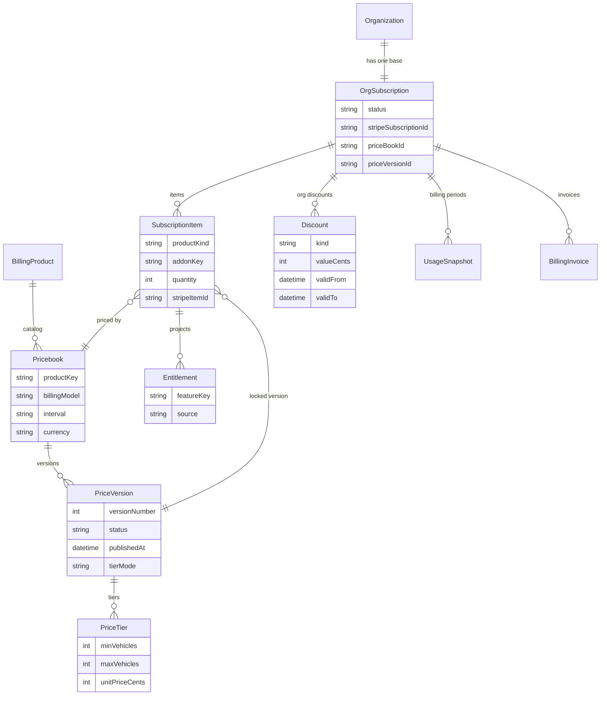
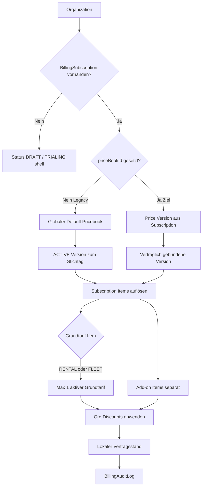
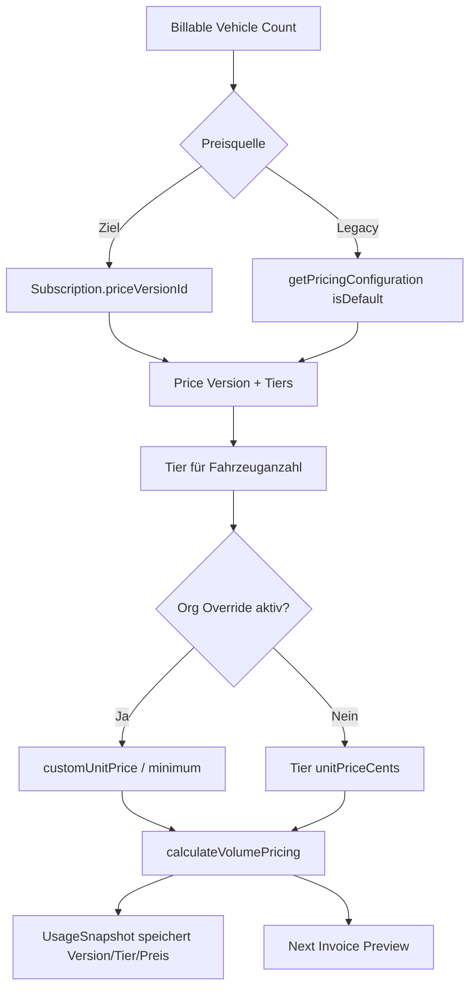
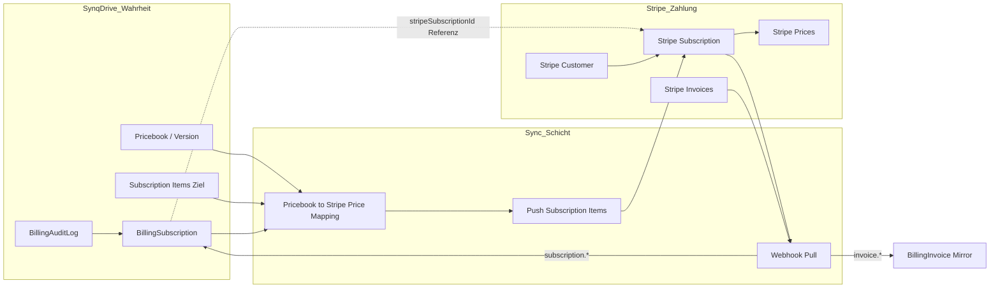
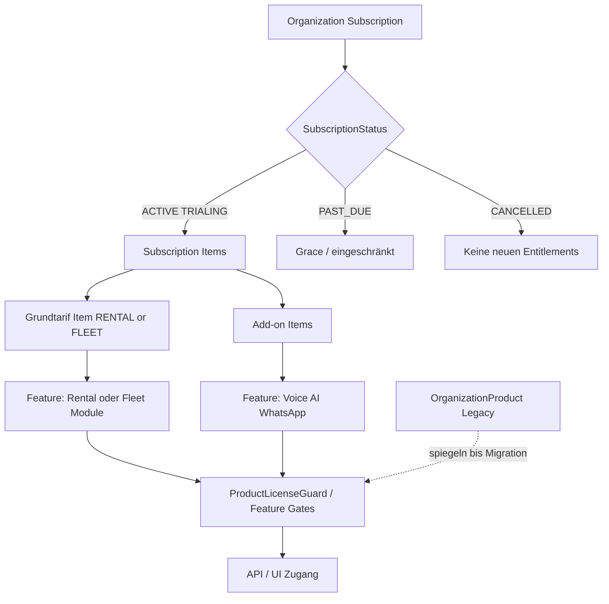
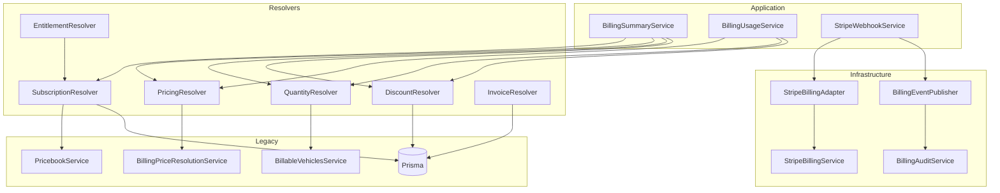

# Billing Target Domain

**Stand:** Prompt 5/44 — Domain Service Boundaries  
**Bezug:** `docs/billing/billing-current-state.md` (Ist-Zustand)  
**Typen & Mapper:** `backend/src/modules/billing/domain/`, `frontend/src/lib/billing-domain.ts`

Dieses Dokument definiert die **einzige fachliche Billing-Wahrheit** für SynqDrive Platform Billing.  
Es beschreibt Zielentitäten, Auflösungsregeln und die Einordnung bestehender Strukturen — ohne Migration oder UI-Änderung in diesem Prompt.

---

## Fachliche Zielhierarchie

SynqDrive Billing folgt einer strikten Hierarchie. Jede Ebene hat genau eine kanonische Bedeutung; untergeordnete Ebenen dürfen die übergeordnete Wahrheit nicht ersetzen.

```
Billing Product
  → Price / Pricebook
    → Price Version
      → Price Tier
        → Organization Subscription
          → Subscription Items
            → Discounts
              → Entitlements
```

| Ebene | Kanonische Rolle | Kurz |
|-------|------------------|------|
| **Billing Product** | Was wird verkauft? (RENTAL, FLEET, ADDON) | Produktkatalog |
| **Pricebook** | Preisliste für ein Produkt (Intervall, Währung, Modell) | Katalog-Container |
| **Price Version** | Veröffentlichter Preisstand zu einem Zeitpunkt | Immutable nach Publish |
| **Price Tier** | Staffelpreis (z. B. pro verbundenem Fahrzeug) | Berechnungsregel |
| **Organization Subscription** | Vertrag zwischen SynqDrive und Organisation | Lokale Vertragswahrheit |
| **Subscription Item** | Abrechenbare Position (Grundtarif oder Add-on) | Vertragsposition |
| **Discount** | Org-spezifischer Preisnachlass | Kein globaler Override |
| **Entitlement** | Abgeleitete Berechtigung (Feature-Zugang) | Nur Projektion |

**Leitprinzip:** SynqDrive hält **lokale Vertrags-, Preis- und Audit-Wahrheit**. Stripe ist **Zahlungsprovider**, nicht alleinige Vertragswahrheit.

---

## Kanonische Domänenentitäten

### Billing Product

**Definition:** Ein verkaufbares SynqDrive-Angebot auf Plattformebene.

| Attribut | Wert / Regel |
|----------|--------------|
| Domain-Typ | `BillingProductKind`: `RENTAL`, `FLEET`, `ADDON` |
| Grundtarife | Genau **einer** von `RENTAL` oder `FLEET` pro Organisation (aktiv) |
| Add-ons | `ADDON` mit `BillingAddonKey` (`VOICE_AGENT`, `AI_PACKAGE`, `WHATSAPP`) |
| Persistenz (Ziel) | `BillingPriceBook.productKey` + explizites Produkt-Registry-Modell (später) |
| Nicht SaaS-Billing | Rental-`PriceBook` (`modules/pricing/`) — **separate Domäne** für Miet-Tarife |

**Grundtarif-Regel:** Eine Organisation hat maximal **einen aktiven Grundtarif** — entweder Rental oder Fleet, nie beides gleichzeitig als Basis-Abo.

---

### Price / Pricebook

**Definition:** Preisliste für ein Billing Product. Enthält Metadaten zu Abrechnungsmodell, Intervall und Währung; die eigentlichen Preise liegen in Versionen.

| Attribut | Kanonisch |
|----------|-----------|
| Name, `productKey`, `billingModel`, `interval`, `currency` | Ja |
| `isDefault` (global) | **Legacy** — Übergangshilfe; Ziel: Zuordnung über Subscription |
| Mehrere Pricebooks pro Product | Erlaubt (z. B. EUR Monthly Fleet, EUR Yearly Fleet) |
| Stripe Price ID auf Pricebook | **Nein** — Mapping in separater Sync-Schicht (Prompt 15+) |

**Synonym:** Im Code heißt die Entität `BillingPriceBook` (Tabelle `billing_price_books`). Fachlich: **Pricebook** = kanonischer Begriff.

---

### Price Version

**Definition:** Ein veröffentlichter oder entworfener Preisstand innerhalb eines Pricebooks.

| Status (Prisma) | Domain-Bedeutung | Mutierbarkeit |
|-----------------|------------------|---------------|
| `DRAFT` | Entwurf | Voll editierbar |
| `ACTIVE` | Veröffentlicht / wirksam | **Immutable** nach `publishedAt` |
| `ARCHIVED` | Historisch | Read-only |

**Verbindliche Regel:** **Published Price Versions sind unveränderlich.** Änderungen erfordern eine neue Version (Draft → Publish). Tiers einer ACTIVE Version dürfen nicht nachträglich geändert werden.

**Wirksamkeit:** `effectiveFrom` / `effectiveTo` steuern zeitliche Gültigkeit; `tierMode` (`VOLUME` / `GRADUATED`) definiert das Preismodell.

---

### Price Tier

**Definition:** Eine Staffel innerhalb einer Price Version — typischerweise nach verbundenen/abrechenbaren Fahrzeugen (`minVehicles`, `maxVehicles`, `unitPriceCents`).

| Attribut | Rolle |
|----------|-------|
| `minVehicles` / `maxVehicles` | Staffelgrenzen |
| `unitPriceCents` | Preis pro Einheit (Fahrzeug) |
| `sortOrder` | Auflösungsreihenfolge bei Überlappung |

Tiers gehören **immer** zu genau einer Price Version. Globale Tier-Overrides existieren nicht.

---

### Organization Subscription

**Definition:** Der lokale Vertrag zwischen SynqDrive und einer Organisation für Platform-SaaS-Billing.

| Attribut | Kanonische Rolle |
|----------|------------------|
| `organizationId` | Mandant |
| `status` | Domain `SubscriptionStatus` (über Mapper von Prisma `BillingStatus` / Stripe) |
| `priceBookId` | **Vertraglich gebundenes Pricebook** (Ziel) |
| `priceVersionId` | **Vertraglich gebundene Preisversion** (Ziel) |
| `currentPeriodStart` / `currentPeriodEnd` | Abrechnungsperiode |
| `cancelAtPeriodEnd` | Kündigung zum Periodenende |
| `stripeSubscriptionId` / `stripeCustomerId` | **Sync-Referenz** — nicht Vertragswahrheit |

**Regel:** Maximal **ein aktives Subscription-Objekt** als Grundtarif-Container je Organisation. Add-ons werden nicht als zweite Subscription, sondern als **Subscription Items** modelliert.

**Ist-Zustand:** `BillingSubscription` existiert; `priceBookId`/`priceVersionId` werden bei Erstellung/Sync **nicht** gesetzt; Preisauflösung ignoriert sie (→ Prompt 10).

---

### Subscription Item

**Definition:** Eine einzelne abrechenbare Position innerhalb einer Organization Subscription.

| Item-Typ | `productKind` | Beispiel |
|----------|---------------|----------|
| Grundtarif | `RENTAL` oder `FLEET` | Per-vehicle Platform-Abo |
| Add-on | `ADDON` | Voice Agent, AI Package |

| Attribut (Ziel) | Bedeutung |
|-----------------|-----------|
| `subscriptionId` | Parent-Subscription |
| `productKind` / `addonKey` | Was abgerechnet wird |
| `priceBookId` / `priceVersionId` | Preisquelle für dieses Item |
| `quantity` | Abrechenbare Menge (z. B. Fahrzeuge) |
| `stripeSubscriptionItemId` | Stripe-Sync-Referenz |

**Regel:** **Add-ons sind separate Subscription Items** — nicht als Quantity-Trick auf dem Grundtarif.

**Ist-Zustand:** Kein `BillingSubscriptionItem`-Modell. Stripe kennt nur ein Item (`STRIPE_DEFAULT_PRICE_ID` × quantity). Ziel-Entität wird in Prompt 10+ eingeführt.

---

### Discount

**Definition:** Org-spezifischer Preisnachlass, der **einen Vertrag** modifiziert — nicht den globalen Katalog.

| Domain-Typ | `DiscountKind`: `PERCENTAGE`, `FIXED_AMOUNT` |
|------------|---------------------------------------------|
| Gültigkeit | `validFrom` / `validTo`, org-gebunden |
| Scope | Optional an `priceBookId` / `priceVersionId` gebunden |
| Felder | `customUnitPriceCents`, `customMonthlyMinimumCents`, `reason` |

**Verbindliche Regel:** **Preise werden nicht global überschrieben.** Rabatte gelten nur für eine konkrete Organisation (und optional ein Pricebook/Version-Paar).

**Ist-Zustand:** `BillingOrganizationPriceOverride` deckt den fachlichen Discount-Bedarf teilweise ab (Leselogik in `BillingSummaryService`); kein formales `Discount`-Modell, kein Admin-API.

---

### Entitlement

**Definition:** Abgeleitete **Berechtigungsprojektion** — welche Features/Produkte eine Organisation nutzen darf. **Keine Billing-Wahrheit.**

| Quelle (Ziel) | Bedingung |
|---------------|-----------|
| Aktive Subscription + Items | Grundtarif ACTIVE / TRIALING |
| Add-on Items | Jeweiliges Add-on aktiv |
| `OrganizationProduct.status` | Spiegel für UI/Legacy-Guards |

**Auflösung:** Entitlements werden aus Subscription Items + Status berechnet, nicht unabhängig gespeichert (außer Cache/Denormalisierung).

**Ist-Zustand:** `OrganizationProduct` + `ProductLicenseGuard` / `@RequireProduct` (Decorator existiert, **nicht verdrahtet**). `OrgProductPlan` (STARTER…ENTERPRISE) ist **kein** Entitlement und **nicht** preisrelevant.

---

## Verbindliche Geschäftsregeln

| # | Regel |
|---|-------|
| R1 | Maximal **ein aktiver Grundtarif** je Organisation (`RENTAL` **oder** `FLEET`) |
| R2 | Grundtarif ist Rental oder Fleet; Add-ons sind **separate Subscription Items** |
| R3 | **Preise werden nicht global überschrieben** — nur org-spezifische Discounts/Overrides |
| R4 | **Published Price Versions sind unveränderlich** (ACTIVE + `publishedAt`) |
| R5 | **Stripe ist Zahlungsprovider**, nicht alleinige Vertragswahrheit |
| R6 | **SynqDrive hält lokale Vertrags-, Preis- und Audit-Wahrheit** (`BillingAuditLog`) |
| R7 | Rental-`PriceBook` (Miet-Tarife) ist **nicht** Teil der SaaS-Billing-Wahrheit |
| R8 | Usage-Snapshots referenzieren die **aufgelöste** Price Version/Tier zum Snapshot-Zeitpunkt |

---

## Ist-Analyse bestehender Strukturen

### OrganizationProduct & Plan-Felder

| Feld / Struktur | Ist-Verhalten | Bewertung |
|-----------------|---------------|-----------|
| `Product` (`RENTAL`, `FLEET`, `TAXI`) | Katalog via `ProductsService.assignProduct()` | **Legacy-Lizenzmodell** |
| `OrganizationProduct.plan` (`OrgProductPlan`) | STARTER…ENTERPRISE; UI-Label in `BillingService.computePlan()` | **Legacy** — nicht preisgebunden |
| `OrganizationProduct.status` | ACTIVE/TRIAL/SUSPENDED/CANCELLED | **Berechtigungsprojektion** (vorläufig) |
| `ProductSlug.TAXI` | Eigener Slug, Domain mapped zu `RENTAL` | **Legacy** — Produkt-Split offen |

**Problem:** Produktzuweisung (`assignProduct`) und Billing-Subscription sind **entkoppelt**. Eine Org kann Rental-Lizenz haben, während Stripe/Pricebook Fleet-default nutzt.

### Pricebook-Referenzen

| Struktur | Ist-Verhalten |
|----------|---------------|
| `BillingPriceBook.isDefault` | Globaler Default (`seed`: `productKey=FLEET`, `isDefault=true`) |
| `getPricingConfiguration()` | Liest **globalen** Default, nicht Subscription |
| `BillingSubscription.priceBookId` | Schema vorhanden, **nicht befüllt** bei Sync |
| `BillingSubscription.priceVersionId` | Schema vorhanden, **ignoriert** in `BillingPriceResolutionService` |
| `BillingUsageSnapshot.priceBookId/Version/Tier` | Korrekt bei Snapshot-Erstellung aus Auflösung |

### Subscription-Felder

| Feld | Ist | Ziel |
|------|-----|------|
| `status` (`BillingStatus`) | 4 Prisma-Werte; Domain reicher (`SubscriptionStatus`) | Mapper kanonisch (Prompt 3) |
| `stripeSubscriptionId` | Gesetzt via Webhook/Sync | Sync-Referenz |
| `priceBookId` / `priceVersionId` | Leer / ignoriert | **Vertragsanker** |
| Keine Subscription Items | Ein Stripe-Item mit Quantity | Mehrere Items (Grundtarif + Add-ons) |

### Stripe Price IDs

| Mechanismus | Ist |
|-------------|-----|
| `STRIPE_DEFAULT_PRICE_ID` | Einziger Stripe Price für alle Subscriptions |
| Mapping Pricebook → Stripe Price | **Existiert nicht** |
| `createOrUpdateSubscriptionForOrg()` | Nutzt Env-Price × `billableVehicleCount`; **nicht** an Controller verdrahtet |
| Stripe Product/Price lokal | Kein Modell |

---

## Klassifikation

### Kanonisch (Ziel-Wahrheit)

| Entität / Konzept | Persistenz / Code |
|-------------------|-------------------|
| Billing Product Kind | `BillingProductKind`, `BillingPriceBook.productKey` |
| Pricebook | `BillingPriceBook` |
| Price Version | `BillingPriceVersion` (ACTIVE = published) |
| Price Tier | `BillingPriceTier` |
| Organization Subscription | `BillingSubscription` (Felder `priceBookId`/`priceVersionId` werden kanonisch) |
| Subscription Item | **Zielmodell** (noch nicht in DB) |
| Discount | Domain `DiscountKind` + `BillingOrganizationPriceOverride` (interim) |
| Domain-Typen & Mapper | `backend/src/modules/billing/domain/` |
| Usage-Snapshot-Preisreferenz | `BillingUsageSnapshot` (priceBook/Version/Tier) |
| Audit | `BillingAuditLog` |

### Legacy (beibehalten, schrittweise ersetzen)

| Struktur | Grund | Ziel-Prompt |
|----------|-------|-------------|
| `Product` / `OrganizationProduct` | Paralleles Lizenzmodell | Entitlement-Projektion (Prompt 20+) |
| `OrgProductPlan` STARTER…ENTERPRISE | Historisches Plan-Label | Entfernen aus Billing-UI (Prompt 25+) |
| `ProductSlug.TAXI` | Separater Slug ohne Billing-Trennung | Produkt-Split-Entscheidung |
| `BillingPriceBook.isDefault` (global) | Ein Default für alle Orgs | Subscription-gebundene Auflösung (Prompt 10) |
| `STRIPE_DEFAULT_PRICE_ID` | Ein Stripe Price für alle | Pricebook→Stripe-Mapping (Prompt 15+) |
| Prisma `BillingStatus` (4 Werte) | Untermenge von `SubscriptionStatus` | Prompt 10 |
| `BillingService.computePlan()` aus `OrganizationProduct` | Plan ≠ Preis | Subscription-basiertes Display |
| `stripe-status.mapper.ts` (Re-Export) | Kompatibilitätsschicht | Entfernen nach Migration |

### Nur Berechtigungsprojektion (keine Billing-Wahrheit)

| Struktur | Hinweis |
|----------|---------|
| `OrganizationProduct.status` ACTIVE/TRIAL | Steuert `ProductLicenseGuard` |
| `OrgProductPlan` | UI/Marketing-Label, kein Tier-Preis |
| `@RequireProduct` / `ProductLicenseGuard` | Feature-Gate, nicht Abrechnung |
| Rental `PriceBook` / `PriceTariff*` | Mietpreise für Buchungen |

### Muss migriert werden

| Von | Nach | Prompt |
|-----|------|--------|
| Globaler Default-Pricebook | Subscription.`priceBookId` + `priceVersionId` | 10 |
| `STRIPE_DEFAULT_PRICE_ID` allein | Stripe Price pro Pricebook/Version/Item | 15 |
| `OrganizationProduct` als Lizenz | Entitlements aus Subscription Items | 20 |
| `BillingOrganizationPriceOverride` ohne API | Formales Discount-Modell + Admin-API | 12 |
| Ein Stripe Subscription Item | `BillingSubscriptionItem` + Multi-Item-Sync | 10, 15 |
| `BillingStatus` Prisma-Enum | Erweitertes `SubscriptionStatus` persistiert | 10 |

### Später entfernbar

| Struktur | Bedingung |
|----------|-----------|
| `BillingPriceBook.isDefault` | Wenn alle Subscriptions pricebook-gebunden |
| `OrgProductPlan` in Billing-Kontexten | Wenn Subscription Items + Entitlements stabil |
| `stripe-status.mapper.ts` Re-Export-Pfad | Wenn alle Imports auf `domain/` zeigen |
| `createOrUpdateSubscriptionForOrg` Single-Price-Logik | Wenn Multi-Item-Mapping live |
| Manuelles `BillingService.createSubscription` | Wenn Stripe-Sync vollständig |

---

## Canonical billing types

*(Eingeführt Prompt 3 — unverändert kanonisch.)*

### Produktarten (`BillingProductKind`)

| Domain | Bedeutung |
|--------|-----------|
| `RENTAL` | SynqDrive Rental Grundtarif |
| `FLEET` | SynqDrive Fleet Grundtarif |
| `ADDON` | Zusatzmodul (architektonisch vorbereitet) |

**Vorbereitete Add-on-Keys (`BillingAddonKey`):** `VOICE_AGENT`, `AI_PACKAGE`, `WHATSAPP`

### Subscription-Status (`SubscriptionStatus`)

| Domain | Beschreibung |
|--------|--------------|
| `DRAFT` | Noch nicht aktiv/abrechenbar |
| `TRIALING` | Testphase |
| `ACTIVE` | Aktives Abo |
| `PAST_DUE` | Zahlung überfällig |
| `PAUSED` | Stripe-pausiert |
| `CANCEL_SCHEDULED` | Kündigung zum Periodenende (`cancelAtPeriodEnd`) |
| `CANCELLED` | Beendet |
| `INCOMPLETE` | Unvollständig / unbekannter Stripe-Status |

### Abrechnungsintervalle (`BillingIntervalKind`)

| Domain | Legacy Prisma |
|--------|---------------|
| `MONTH` | `BillingInterval.MONTHLY` |
| `YEAR` | *(noch nicht in Prisma — mapped vorläufig auf MONTHLY)* |

### Pricing Models (`PricingModel`)

| Domain | Legacy Prisma `BillingTierMode` |
|--------|----------------------------------|
| `VOLUME` | `VOLUME` |
| `GRADUATED` | `GRADUATED` |
| `FLAT` | *(noch nicht in DB)* |
| `USAGE_BASED` | *(noch nicht in DB)* |

### Rabattarten (`DiscountKind`)

| Domain |
|--------|
| `PERCENTAGE` |
| `FIXED_AMOUNT` |

### Rechnungsstatus (`InvoiceStatusDomain`)

| Domain | Prisma `InvoiceStatus` | Display (`InvoiceDisplayStatus`) |
|--------|------------------------|----------------------------------|
| `DRAFT` | `DRAFT` | `Pending` |
| `OPEN` | `OPEN` | `Pending` / `Overdue` (nach Fälligkeit) |
| `PAID` | `PAID` | `Paid` |
| `VOID` | `VOID` | **`Void` — niemals `Paid`** |
| `UNCOLLECTIBLE` | `UNCOLLECTIBLE` | `Overdue` |

### Zahlungsstatus (`PaymentStatusDomain`)

| Domain | Stripe-Quelle |
|--------|---------------|
| `PENDING` | `processing`, `requires_*` |
| `SUCCEEDED` | `succeeded` |
| `FAILED` | `failed`, `canceled` |
| `REFUNDED` | Charge vollständig refunded |
| `PARTIALLY_REFUNDED` | Charge teilweise refunded |

### Stripe-Modus (`StripeMode`)

| Domain | Quelle |
|--------|--------|
| `TEST` | `livemode === false` |
| `LIVE` | `livemode === true` |

### Sync-Status (`SyncStatus`)

| Domain | Legacy-Strings |
|--------|----------------|
| `PENDING` | `PREPARED`, `NOT_CONNECTED` |
| `SYNCED` | `SYNCED` |
| `FAILED` | `FAILED` |
| `DRIFTED` | `DRIFTED` |

---

## Mapping-Richtung

```
Stripe API strings  →  Domain types  →  Prisma persistence (legacy)
                         ↓
                    Display / API DTOs
```

**Regeln:**

1. Stripe-Status **niemals** ungeprüft als Domain- oder Display-Status verwenden.
2. Unbekannte externe Werte → sicherer Fallback + `BillingDomain` Logger-Warnung.
3. Eine Mapping-Implementierung pro Richtung — keine verteilten Switches.

### Zentrale Mapping-Dateien

| Datei | Verantwortung |
|-------|---------------|
| `domain/mappers/stripe-subscription-status.mapper.ts` | Stripe Subscription → `SubscriptionStatus` → Prisma `BillingStatus` |
| `domain/mappers/stripe-invoice-status.mapper.ts` | Stripe Invoice → `InvoiceStatusDomain` → Prisma `InvoiceStatus` |
| `domain/mappers/stripe-payment-status.mapper.ts` | PaymentIntent/Charge → `PaymentStatusDomain` |
| `domain/mappers/billing-legacy.mappers.ts` | Produkt, Intervall, Pricing, Rabatt, Sync, **Invoice Display** |

### Kompatibilitätsschicht

`stripe-status.mapper.ts` re-exportiert aus Domain-Mappern (deprecated Pfad für inkrementelle Migration).

### Prompt-3-Korrektur: VOID ≠ PAID

`mapPrismaInvoiceToDisplayStatus` mappt `VOID` → `Void`. `BillingService` nutzt diese Map seit Prompt 3.

---

## Diagramme

### 1. Ziel-Datenmodell



*Hinweis: `SubscriptionItem` und formales `Discount` sind Zielentitäten; heute teilweise durch `BillingSubscription` (single item) und `BillingOrganizationPriceOverride` approximiert.*

### 2. Vertragsauflösung



**Ziel:** Vertrag = Subscription + Items + gebundene Price Version + org-Discounts. **Ist:** Subscription ohne Pricebook-Link; globaler Default.

### 3. Preisauflösung



**Regel:** Kein globaler Preis-Override — nur org-spezifischer Discount. Snapshot friert aufgelösten Preis ein.

### 4. Stripe-Sync



**Prinzip:** SynqDrive → Stripe (Push) bei Vertragsänderung; Stripe → SynqDrive (Pull) für Zahlungsstatus. **Stripe ändert nicht** die lokale Price Version.

### 5. Entitlement-Auflösung



**Regel:** Entitlements sind **Projektion** aus Subscription Items + Status. `OrganizationProduct` bleibt bis Prompt 20+ als Legacy-Spiegel.

---

## Migrationsrichtung (ohne Big-Bang)

| Phase | Prompt-Bereich | Inhalt |
|-------|----------------|--------|
| **A — Vertragsanker** | 10 | `priceBookId`/`priceVersionId` auf Subscription befüllen; Preisauflösung subscription-first |
| **B — Subscription Items** | 10–12 | `BillingSubscriptionItem`; Add-ons als eigene Items |
| **C — Discount-API** | 12 | `BillingOrganizationPriceOverride` → formales Discount mit Admin-API |
| **D — Stripe-Mapping** | 15 | Pricebook/Version/Item → Stripe Price; `STRIPE_DEFAULT_PRICE_ID` ablösen |
| **E — Entitlements** | 20+ | `OrganizationProduct` → berechnete Entitlements; Guards auf Subscription |
| **F — Cleanup** | 25+ | `isDefault` global, `OrgProductPlan` in Billing, Legacy-Mapper entfernen |

**Nicht in diesem Prompt:** Keine DB-Migration, keine UI-Änderung, keine Stripe-Subscription-Erstellung.

---

## Offene Entscheidungen

| # | Frage | Optionen |
|---|-------|----------|
| O1 | **TAXI-Produkt** | Eigenes `BillingProductKind` vs. Mapping zu `RENTAL` vs. Abschaffung |
| O2 | **OrgProductPlan** | Komplett entfernen vs. als Marketing-Label ohne Billing-Bezug behalten |
| O3 | **Grace bei PAST_DUE** | Entitlements sofort sperren vs. Kulanzperiode |
| O4 | **Jahresabonnement** | `BillingInterval.YEAR` in Prisma vs. separates Pricebook |
| O5 | **GRADUATED vs. VOLUME** | Beide produktiv oder VOLUME als Default für v1 |
| O6 | **Override-Scope** | Discount nur auf Version vs. auf gesamtes Pricebook |
| O7 | **Multi-Subscription** | Strikt eine Subscription vs. eine pro Product (aktuell: eine Subscription, mehrere Items) |
| O8 | **Stripe Price Granularität** | Ein Stripe Price pro Tier vs. metered/quantity-basiert |

---

## Service Ownership & Abhängigkeiten (Prompt 5)

### Schichtenmodell

```
Controller / Webhook
  → Application Services (BillingSummary, BillingService, BillingUsage, …)
    → Resolvers (Domain-Auflösung)
      → Legacy Services / Prisma (Pricebook, BillableVehicles, PriceResolution, …)
StripeBillingAdapter → StripeBillingService → Stripe SDK
BillingEventPublisher → BillingAuditLog (+ optionale Listener)
```

**Regeln:**

| Regel | Umsetzung |
|-------|-----------|
| Domain exportiert keine Stripe-Typen | `domain/` enthält nur Domain- und Resolver-Typen |
| Controller enthalten keine Preislogik | Preis über `PricingResolverService` |
| Frontend-DTOs bestimmen nicht die Domain | Resolver liefern Domain-Typen; DTOs mappen in Controllern |
| Keine zyklischen Abhängigkeiten | Resolvers bilden DAG; `SubscriptionResolver` kennt keinen `QuantityResolver` |
| Stripe nur im Adapter | `adapters/stripe-billing.adapter.ts` |

### Service Ownership

| Service | Verantwortung | Delegiert an |
|---------|---------------|--------------|
| **SubscriptionResolverService** | Organisationsvertrag zu Stichtag | `PrismaService`, `PricebookService` |
| **PricingResolverService** | Price Version + Tier + Betrag für Item | `BillingPriceResolutionService` |
| **QuantityResolverService** | Abrechenbare Menge (Fahrzeuge) | `BillableVehiclesService` |
| **DiscountResolverService** | Org-Rabatte + Reihenfolge | `PrismaService` (`BillingOrganizationPriceOverride`) |
| **InvoiceResolverService** | Lokale Rechnungen + Zahlungsstatus | `PrismaService`, Domain-Invoice-Mapper |
| **EntitlementResolverService** | Berechtigungsprojektion | `SubscriptionResolverService`, `PrismaService` |
| **StripeBillingAdapter** | Stripe-Operationen, Domain-Mapping | `StripeBillingService` |
| **BillingEventPublisher** | Domain Events (ohne E-Mail) | `BillingAuditService` |

### Erlaubte Abhängigkeiten



### Verbotene Abhängigkeiten

| Von | Nach | Grund |
|-----|------|-------|
| `domain/` | `stripe` Paket | Stripe-Typen bleiben im Adapter |
| Resolver | `StripeBillingService` | Zahlung ≠ Vertragsauflösung |
| `SubscriptionResolver` | `QuantityResolver` | Zyklusgefahr; Quantity wird vom Caller übergeben |
| `PricingResolver` | `StripeBillingAdapter` | Preis ist lokale Wahrheit |
| `BillingEventPublisher` | E-Mail / Resend | Prompt 30+ |
| Controller | `BillingPriceResolutionService` direkt | Nur über Resolver oder Application Service |

### Integrationen (Prompt 5)

| Consumer | Vorher | Nachher |
|----------|--------|---------|
| `BillingSummaryService` | Direkt Prisma + PriceResolution + BillableVehicles | Resolver-Orchestrierung |
| `BillingUsageService` | Direkt Override-Query + PriceResolution | `DiscountResolver` + `PricingResolver` |
| `StripeWebhookService` (Subscription) | `StripeBillingService.applyStripeSubscription` | `StripeBillingAdapter` + `BillingEventPublisher` |

### Übergangsstrukturen (noch aktiv)

| Struktur | Status |
|----------|--------|
| `BillingPriceResolutionService` | Interner Motor von `PricingResolver` |
| `BillableVehiclesService` | Interner Motor von `QuantityResolver` |
| `StripeBillingService` | Wird nur noch vom Adapter aufgerufen (Webhooks teilweise migriert) |
| `BillingOrganizationPriceOverride` | Über `DiscountResolver`; formales Discount-Modell folgt Prompt 12 |
| Synthetische Subscription Items | In `SubscriptionResolver` bis `BillingSubscriptionItem` existiert |
| `OrganizationProduct` in Entitlements | Legacy-Spiegel in `EntitlementResolver` |

### Tests (Prompt 5)

| Datei | Prüft |
|-------|-------|
| `resolvers/billing-resolver.boundaries.spec.ts` | Resolver-Grenzen, keine Stripe-Typen in Responses |
| `adapters/stripe-billing.adapter.spec.ts` | Domain-Mapping aus Stripe-Operationen |
| `events/billing-event.publisher.spec.ts` | Audit-Persistenz ohne E-Mail |

---

## Abschluss (Prompt 4)

### Kanonische Wahrheit

1. **Hierarchie:** Billing Product → Pricebook → Price Version → Price Tier → Organization Subscription → Subscription Items → Discounts → Entitlements  
2. **Lokaler Vertrag:** `BillingSubscription` + (zukünftig) Items + gebundene Price Version  
3. **Preis:** Published ACTIVE Version + Tiers; org-Discounts nur per Override/Discount  
4. **Domain-Typen:** `backend/src/modules/billing/domain/` — einzige Vokabular-Wahrheit für Status und Enums  
5. **Audit:** `BillingAuditLog` für alle Vertrags- und Preisänderungen  

### Legacy-Strukturen

- `OrganizationProduct` + `OrgProductPlan` — Lizenz/Label, nicht Preis  
- Globaler `BillingPriceBook.isDefault` — ersetzt durch Subscription-Bindung  
- `STRIPE_DEFAULT_PRICE_ID` — ersetzt durch Pricebook-Mapping  
- Rental-`PriceBook` — separate Domäne, nicht SaaS  
- `stripe-status.mapper.ts` — Kompatibilitäts-Re-Export  

### Migrationsrichtung

Subscription-first Preisauflösung → Subscription Items → Discount-API → Stripe-Mapping → Entitlement-Projektion → Legacy-Cleanup (Phasen A–F).

### Tests

`backend/src/modules/billing/domain/billing-domain.mappers.spec.ts`  
`backend/src/modules/billing/resolvers/billing-resolver.boundaries.spec.ts`  
`backend/src/modules/billing/adapters/stripe-billing.adapter.spec.ts`  
`backend/src/modules/billing/events/billing-event.publisher.spec.ts`  
`backend/src/modules/billing/*.characterization.spec.ts` (Ist-Verhalten dokumentiert)  
`frontend/src/lib/billing-domain.test.ts`

---

*Ende Ziel-Domäne Prompt 5 — Servicegrenzen eingeführt, keine Parallelarchitektur.*
