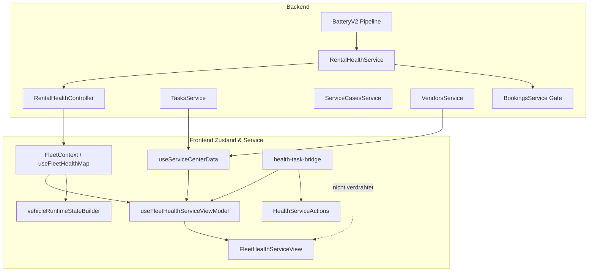

# Fleet „Zustand & Service“ — Remediation Call-Site Baseline

| Feld | Wert |
|------|------|
| **Phase** | 0, Prompt 4 von 66 |
| **Repository-Commit** | `a145918fe8c3601154632428562acea14d643677` (`cursor/fleet-health-remediation-tracker-bad3`) |
| **Erstellt / aktualisiert (UTC)** | 2026-07-20 |
| **Modus** | Read-only Inventur + vorhandene Tests; keine Codeänderungen |
| **Basis-Audits** | [`fleet-health-service-production-reality.md`](../audits/fleet-health-service-production-reality.md), [`fleet-health-service-workflow-ux-test-matrix.md`](../audits/fleet-health-service-workflow-ux-test-matrix.md) |
| **Remediation-Docs** | [`fleet-health-service-remediation-contract.md`](./fleet-health-service-remediation-contract.md) (P1), [`fleet-health-service-remediation-tracker.md`](./fleet-health-service-remediation-tracker.md) (P2), [`fleet-health-service-domain-boundaries.md`](../architecture/fleet-health-service-domain-boundaries.md) (P3) |
| **UI-Contract** | [`FLEET_HEALTH_SERVICE_CONTRACT.md`](../../frontend/src/rental/components/fleet-health-service/FLEET_HEALTH_SERVICE_CONTRACT.md) |

**Deployment-Hinweis:** Deployter VPS-Stand (`ac856881`, Audit 1) kann vom Repository abweichen. Es wird **nicht** angenommen, dass `main` deployed ist.

---

## 1. Zweck

Exakte Baseline aller betroffenen Call-Sites, Datenflüsse und bestehenden Tests **vor** Remediation-Code (Prompts 7–66). Jede Änderung muss gegen diese Inventur und die [Domain Boundaries](../architecture/fleet-health-service-domain-boundaries.md) geprüft werden.

---

## 2. Architektur-Invarianten (Ist vs. Ziel)

Aus [Domain Boundaries §2–§5](../architecture/fleet-health-service-domain-boundaries.md) und Code-Inventur:

| Invariante | Ist-Stand (Code) | Remediation-Ziel |
|------------|------------------|------------------|
| Rental Health = technische Diagnose | `RentalHealthService` aggregiert 7 Module | Beibehalten |
| Task = einzelne operative Arbeit | `OrgTask`, `useServiceCenterData` | Beibehalten |
| Service Case = übergeordneter Vorgang | Backend vorhanden, **FHS-UI fehlt** | Verdrahten (P8–P9) |
| Runtime State = endgültige Mietbereitschaft | `vehicleRuntimeStateBuilder` + `deriveIsReadyForRenting` | Beibehalten; `ServiceCase.blocksRental` → Runtime (P20) |
| `unknown` ≠ safe | `computeOverallState`, `healthSeverityBand` → `limited` | Beibehalten |
| Warning blockiert nicht auto. | `collectBlockingReasons` Hard-Block only | Beibehalten |
| Task DONE ≠ Health behoben | Getrennte Schichten | Beibehalten |
| `ServiceCase.blocksRental` | Feld existiert, **nicht** in Rental Health | → Runtime State (nicht Rental Health) |
| Vendor/Health API-Fehler | Vendor silent `[]`; Health batch stub `rental_blocked: false` | Ehrliche Fehlerzustände (P7, P10) |

---

## 3. Backend Call-Sites

### 3.1 `RentalHealthService`

| | |
|--|--|
| **Pfad** | `backend/src/modules/rental-health/rental-health.service.ts` |
| **Modul** | `backend/src/modules/rental-health/rental-health.module.ts` |
| **Typen** | `backend/src/modules/rental-health/rental-health.types.ts` |
| **Policies** | `tire-rental-health.policy.ts`, `brake-rental-health.policy.ts` |
| **Review** | `tire-rental-health-review.service.ts`, `brake-rental-health-review.service.ts` |

**Öffentliche API:**

| Methode | Zeilen | Input | Output |
|---------|--------|-------|--------|
| `getVehicleHealth(orgId, vehicleId)` | 100–235 | Org + Vehicle | `VehicleHealth` (7 Module, `overall_state`, `rental_blocked`, `blocking_reasons`) |
| `isRentalBlocked(orgId, vehicleId)` | 243–279 | Org + Vehicle | `RentalHealthGateResult` — fail-closed bei Exception (`UNAVAILABLE`, `manualReviewRequired`) |

**Interne Evaluatoren:** `evaluateBattery`, `evaluateTires`, `evaluateBrakes`, `evaluateErrorCodes`, `evaluateComplaints`, `evaluateVehicleAlerts`, `collectBlockingReasons` (~644–720).

**Upstream (Promise.allSettled, ~121–161):**

| Modul | Service |
|-------|---------|
| battery | `CanonicalBatteryHealthService.getSummary` |
| tires | `HmSignalUsageService.getTirePressureSignals` → `TireHealthService.getSummary` |
| brakes | `BrakeHealthService.getSummary` |
| error_codes | `DtcService.getSummary` |
| vehicle_alerts | `HmSignalUsageService.getAiHealthCareSignals` |
| complaints | `prisma.vehicleComplaint.findMany` |
| service_compliance | `ServiceComplianceService.evaluateCompliance` |

**Backend-Caller (direkt DI):**

| Caller | Pfad | Methode |
|--------|------|---------|
| Rental Health API | `rental-health.controller.ts` | `getVehicleHealth` |
| Booking Gate | `bookings.service.ts:196–200, 1648–1652` | `isRentalBlocked` |
| Booking Detail (read-only) | `bookings.service.ts:995–997` | `getVehicleHealth` (Fehler → `null`) |
| Health Tab Summary | `vehicle-health-tab-summary.service.ts:126–143` | `getVehicleHealth` |
| Vehicle File Summary | `vehicle-file-summary.service.ts` | `getVehicleHealth` (`.catch(() => null)`) |
| Business Insights | `business-insights.service.ts` | `getVehicleHealth` (optional) |

**Tests:** `rental-health.service.spec.ts` (39), `rental-health.types.spec.ts` (5), `tire-rental-health.policy.spec.ts` (12), `brake-rental-health.policy.spec.ts` (13), `brake-rental-health-review.service.spec.ts` (2), `rental-health-notification.spec.ts` (5)

---

### 3.2 `RentalHealthController`

| | |
|--|--|
| **Pfad** | `backend/src/modules/rental-health/rental-health.controller.ts` |
| **Prefix** | `/api/v1/organizations/:orgId` |
| **Guards** | `OrgScopingGuard`, `RolesGuard`, `PermissionsGuard` |

| Route | Permission | Verhalten |
|-------|------------|-----------|
| `GET vehicles/:vehicleId/rental-health` | `fleet.read` | Einzelfahrzeug; Service-Fehler propagieren |
| `GET rental-health?vehicleIds=` | `fleet.read` | Fleet batch, **`BATCH=10`** (Z.81), per-vehicle `.catch` → stub `unknown`, **`rental_blocked: false`** (Z.89–109) |
| `POST/DELETE …/tire-rental-health/review-override` | `fleet.write` | Manuelle Tire-Freigabe |
| `POST/DELETE …/brake-rental-health/review-override` | `fleet.write` | Manuelle Brake-Freigabe |

**Audit-Abweichung bestätigt:** Fleet per-vehicle Fehler degradieren zu `rental_blocked: false` — **FAIL** (FHS-T-021).

---

### 3.3 Battery V2 Producer & Scheduler (indirekt Rental Health)

Battery speist `CanonicalBatteryHealthService` → `evaluateBattery`. Kein direkter RentalHealth→BatteryV2-Call.

| Komponente | Pfad |
|------------|------|
| Job Producer | `backend/src/modules/vehicle-intelligence/battery-health/jobs/battery-v2-job-producer.service.ts` |
| Job ID Builder | `battery-v2-job-queue.util.ts` — `buildBatteryV2JobId()` prefix `battery-v2:` + key; Hash nur bei Länge >128 |
| Queue | `battery.v2` (`backend/src/workers/queues/queue-names.ts`) |
| Module | `battery-v2-jobs-producer.module.ts` |
| Reconciliation Scheduler | `backend/src/workers/schedulers/battery-v2-reconciliation.scheduler.ts` (`@Interval`) |
| Retention Scheduler | `battery-v2-retention.scheduler.ts` (`@Cron` — kein Enqueue) |
| Domain Producers | `battery-v2-snapshot-observation.producer.ts`, `battery-v2-rest-target.producer.ts`, `battery-v2-trip-start.producer.ts`, `hv-capacity-shadow-producer.service.ts`, … |

**Weitere Health-Scheduler (Rental-Health-Upstream):**

| Scheduler | Pfad | Intervall |
|-----------|------|-----------|
| Tire Recalc | `workers/schedulers/tire-recalculation.scheduler.ts` | 1h |
| Brake Recalc | `workers/schedulers/brake-recalculation.scheduler.ts` | 1h |
| DTC Poll | `workers/schedulers/dimo-dtc.scheduler.ts` | 3h |
| HM Health Polling | `workers/schedulers/hm-health-polling.scheduler.ts` | 5 min |

**Audit-Abweichung bestätigt:** Prod-Log `Custom Id cannot contain :` — `buildBatteryV2JobId` hasht **nicht** bei `:` in Key (nur bei Länge >128); idempotency keys mit `:` → BullMQ-Fehler (FHS-T-092).

**Battery-V2-Tests (nicht in Baseline-Hauptlauf):** `battery-v2-job-queue.util.spec.ts`, `battery-v2-producer-migration.spec.ts`, `battery-v2-rest-target.producer.spec.ts`, `battery-v2-reconciliation.spec.ts`

---

### 3.4 `TasksController` & `TasksService`

| | |
|--|--|
| **Controller** | `backend/src/modules/tasks/tasks.controller.ts` |
| **Service** | `backend/src/modules/tasks/tasks.service.ts` |
| **DTO** | `backend/src/modules/tasks/task.dto.ts` — `ListTasksQueryDto` ohne `page`/`limit` |
| **Guards** | `OrgScopingGuard`, `RolesGuard` — **kein** `PermissionsGuard`, **kein** `@Roles()` |

**Relevante Endpoints:**

| Method | Path | Service |
|--------|------|---------|
| GET | `organizations/:orgId/tasks` | `listTasks` (~669–786) — **ohne Pagination** (`findMany` ohne `take`) |
| GET | `organizations/:orgId/tasks/summary` | `getDashboardSummary` (~945) |
| GET | `organizations/:orgId/vehicles/:vehicleId/tasks` | `getTasksForVehicle` |
| POST/PATCH | `…/tasks`, `…/start`, `…/complete`, `…/cancel`, … | Lifecycle + bulk |

**FHS-relevant:** `useServiceCenterData` ruft `summary` + `list` auf.

**Tests:** `tasks.controller.spec.ts` (5 — Guards only), `tasks.service.spec.ts` (93 — nicht im Baseline-Pattern)

**Audit-Abweichung bestätigt:** Keine `tasks.read`/`tasks.write` Permissions; volle Org-Task-Liste ohne `take` (FHS-T-078).

---

### 3.5 `ServiceCasesController` & `ServiceCasesService`

| | |
|--|--|
| **Controller** | `backend/src/modules/service-cases/service-cases.controller.ts` |
| **Service** | `backend/src/modules/service-cases/service-cases.service.ts` |
| **Guards** | `OrgScopingGuard`, `RolesGuard` — **kein** `PermissionsGuard` |

**Endpoints:** `GET/POST/PATCH …/service-cases`, `…/complete`, `…/cancel`, `…/comments`, `…/attachments`, `…/vehicles/:vehicleId/service-cases`, `…/vendors/:vendorId/service-cases`.

**`list` (~146–167):** `findMany` **ohne Pagination**.

**`blocksRental`:** Prisma-Feld auf `ServiceCase` — **nicht** von `RentalHealthService.collectBlockingReasons` gelesen.

**FHS:** **Kein** `api.serviceCases` in `useServiceCenterData` — Lookup nur in `TasksView` / `TasksNewTaskDialog`.

**Tests:** `service-cases.service.spec.ts` (6 Tests)

**Audit-Abweichung bestätigt:** Service Cases **SHADOW_ONLY** in FHS-UI (P0-1, FHS-T-054).

---

### 3.6 Vendors API

| | |
|--|--|
| **Controller** | `backend/src/modules/vendors/vendors.controller.ts` |
| **Service** | `backend/src/modules/vendors/vendors.service.ts` |
| **Guards** | `OrgScopingGuard`, `PermissionsGuard` — `vendor-management:read/write` |

**Frontend:** `api.vendors.list(orgId)` → `GET /organizations/:orgId/vendors` (`api.ts` ~3954).

**FHS:** `useServiceCenterData` → `api.vendors.list(orgId).catch(() => [])` (Z.30).

**Tests:** `vendors.service.spec.ts` (10 — nicht im Baseline-Pattern)

**Audit-Abweichung bestätigt:** Silent vendor fail (P0-2, FHS-T-063).

---

### 3.7 Booking Health Gate

| | |
|--|--|
| **Pfad** | `backend/src/modules/bookings/bookings.service.ts` |
| **DI** | `RentalHealthService` via `forwardRef` (`bookings.module.ts`) |

| Methode | Zeilen | Verhalten |
|---------|--------|-----------|
| `enforceRentalHealthGate` | 113–142 | `VEHICLE_RENTAL_BLOCKED` oder `VEHICLE_HEALTH_GATE_UNAVAILABLE` + `manualReviewRequired` |
| `create` | 196–200 | Gate vor Buchungserstellung |
| `update` | 1648–1652 | Gate bei Fahrzeug-/Datumswechsel |
| Detail enrichment | 995–997, 1068+ | `getVehicleHealth` read-only; Fehler → `null` |

**`isRentalBlocked` fail-closed:** Exception → `blocked: true`, `healthGateStatus: UNAVAILABLE` (~265–277).

**Frontend:** `NewBookingView`, `booking-vehicle-preflight.ts`, `bookingHandoverGates.ts`, `bookingActionRules.ts`.

**Gate-Tests:** indirekt in `rental-health.service.spec.ts` (`Rental-health gate unavailable` Warn-Log).

---

## 4. Frontend Call-Sites

### 4.1 `useFleetHealthMap` / `useVehicleHealth`

| | |
|--|--|
| **Pfad** | `frontend/src/rental/hooks/useVehicleHealth.ts` |
| **API** | `api.rentalHealth.getFleet` / `getVehicle` (`frontend/src/lib/api.ts` ~3465–3478) |

| Hook | Zeilen | Error | Refresh |
|------|--------|-------|---------|
| `useVehicleHealth` | 20–60 | `.catch` → EN message | `reload()` |
| `useFleetHealthMap` | 68–118 | `.catch` → `healthError` | `reload()`; deps `[orgId, idsKey]` |

**Importer:**

| Datei | Nutzung |
|-------|---------|
| `FleetContext.tsx:71–72` | Kanonische Org-Batch-Health |
| `NewBookingView.tsx:37,518` | **Zweite** `useFleetHealthMap`-Instanz (Picker-IDs) |
| `BookingVehicleHealthTab.tsx` | Einzelfahrzeug |
| `BookingsView.tsx:930` | `useVehicleHealth` — **`detailHealth` ungenutzt (dead)** |

---

### 4.2 `FleetContext`

| | |
|--|--|
| **Pfad** | `frontend/src/rental/FleetContext.tsx` |

| Concern | Implementation |
|---------|----------------|
| Fleet Map | `useFleetMapStore` → `api.vehicles.fleetMap`, 30s Poll |
| Health | `useFleetHealthMap(orgId, fleetVehicleIds)` |
| Invalidation | `vehicleOperationalQueryKeys.fleetHealth(orgId)` → `reloadHealth()` |
| Export | `healthMap`, `healthLoading`, `healthError`, `reloadHealth`, `useEffectiveHealth` |

**Provider:** `App.tsx` (Rental-Tree)

---

### 4.3 `useServiceCenterData`

| | |
|--|--|
| **Pfad** | `frontend/src/rental/components/service-center/useServiceCenterData.ts` |

| API | Zeile | Error |
|-----|-------|-------|
| `api.tasks.summary(orgId)` | 28 | Outer `catch` → `serviceError`, leere Arrays (36–41) |
| `api.tasks.list(orgId)` | 29 | Wie oben |
| `api.vendors.list(orgId)` | 30 | **`.catch(() => [])`** — silent |

**Refresh:** `subscribeTaskQueryInvalidation` → `reload()` bei Task-Mutationen (50–57).

**Importer:** `useFleetHealthServiceViewModel.ts`, `ServiceCenterView.tsx` (legacy).

**Nicht geladen:** `api.serviceCases.*`

---

### 4.4 `useFleetHealthServiceViewModel` + View Model

| Datei | Rolle |
|-------|-------|
| `useFleetHealthServiceViewModel.ts` | Composes `useFleetVehicles` + `useServiceCenterData` → `buildFleetHealthServiceViewModel` |
| `fleet-health-service.view-model.ts` | Pure: KPIs, groups, `matchOpenTaskForHealthSignal`, `buildPrioritizedOverviewRows` |
| `fleet-health-service-labels.ts` | DE-Labels |
| `fleet-health-service.types.ts` | Tab types, `normalizeFleetTab` |
| `fleet-health-service-shell.ts` | Layout tokens |

**Bridge-Import:** `findDuplicateHealthTask` aus `health-task-bridge.utils.ts`.

**Importer:** `FleetHealthServiceView.tsx` only.

**Tests:** `fleet-health-service.view-model.test.ts` (10), `fleet-health-service.types.test.ts` (4)

---

### 4.5 `health-task-bridge.utils.ts`

| | |
|--|--|
| **Pfad** | `frontend/src/rental/lib/health-task-bridge.utils.ts` |
| **API-Calls** | Keine (pure functions) |
| **Dedizierte Tests** | **Keine** |

**Exports:** `buildHealthTaskPrefill`, `findDuplicateHealthTask`, `healthModuleNeedsAction`, `isHealthOriginatedTask`, `healthContextFromTask`, `MODULE_TASK_TYPES`, `complianceSignalsForModule`.

**`findDuplicateHealthTask` (215–232):** Match wenn gleiches `vehicleId` + offener Status und:
1. `metadata.healthModule === module`, **oder**
2. `task.type` ∈ `MODULE_TASK_TYPES[module]` **oder** `=== preferredType` (breit — FALSE_MATCH), **oder**
3. `sourceType === 'HEALTH'` + passender Typ, **oder**
4. `source` starts with `INSIGHT_` + passender Typ

**Importer:**

| Datei | Symbole |
|-------|---------|
| `fleet-health-service.view-model.ts` | `findDuplicateHealthTask` |
| `health/HealthServiceActions.tsx` | prefill, duplicate, needs-action |
| `health/HealthVehicleDetailPanel.tsx` | `HealthActionModule` |
| `health/HealthTaskContextPanel.tsx` | `healthContextFromTask` |
| `service-center/ServiceTaskCreateModal.tsx` | `HealthTaskPrefill` |
| `dashboard/notifications/notification-task-bridge.ts` | `buildHealthTaskPrefill` |

**Audit-Abweichung bestätigt:** Typ-only-Match ohne `sourceFindingId` (FHS-T-032–034, 044).

---

### 4.6 `HealthServiceActions`

| | |
|--|--|
| **Pfad** | `frontend/src/rental/components/health/HealthServiceActions.tsx` |

| API | Error |
|-----|-------|
| `api.tasks.forVehicle` | `.catch(() => [])` (~58–60) |
| `api.vendors.list` | `.catch(() => [])` |

**Importer:** `HealthVehicleDetailPanel.tsx`, `HealthErrorsView.tsx`

**Gap:** Nach Task-Create nur lokales `forVehicle`-Reload — **kein** `invalidateTaskQueries`; FHS Task-Tab refresht nicht automatisch.

---

### 4.7 `vehicleRuntimeStateBuilder` + `rentalReadiness`

| Datei | Rolle |
|-------|-------|
| `frontend/src/rental/components/dashboard/runtime/rentalReadiness.ts` | `deriveIsReadyForRenting`, `reasonBlocksReadyForRenting` |
| `frontend/src/rental/components/dashboard/runtime/vehicleRuntimeStateBuilder.ts` | `buildVehicleRuntimeStates` — `addHealthReasons` (424–503) |

**Health in Runtime:** `rental_blocked` + `blocking_reasons` → blockierende Reasons; Modul `warning`/`critical` **ohne** auto-`preventsReady`. **`ServiceCase.blocksRental` noch nicht verdrahtet** (Ziel P20).

**Importer:** `dashboardSliceBuilder.ts` → `useDashboardViewModel.ts`

**Tests:** `vehicleRuntimeStateBuilder.test.ts` (10), `rentalReadiness.test.ts` (7), `dashboardRuntime.test.ts` (27)

---

### 4.8 `FleetHealthServiceView` und Subtabs

| | |
|--|--|
| **Root** | `frontend/src/rental/components/fleet-health-service/FleetHealthServiceView.tsx` |
| **Hub** | `frontend/src/rental/components/FleetHubView.tsx` — Refresh **nur** `reloadHealth()` (Z.131) |
| **Contract** | `FLEET_HEALTH_SERVICE_CONTRACT.md` |

| Subtab | Panel | Datenquelle | Direkte API |
|--------|-------|-------------|-------------|
| `overview` | `FleetHealthServiceOverviewPanel` + `KpiStrip` + `PrioritizedList` | `vm` | — |
| `vehicles` | `FleetConditionView` (embedded) | `FleetContext.healthMap` | — |
| `tasks` | `FleetHealthServiceTasksPanel` → `ServiceTasksPanel` | `vm.allTasks`, `vm.vendors` | `vm.reloadService()` |
| `schedule` | `FleetHealthServiceSchedulePanel` → `ServiceSchedulePanel` | `vm.allTasks` | — |
| `vendors` | `FleetHealthServiceVendorsPanel` → `VendorManagementView` | eigenes Fetch | `api.vendors.*` |
| `history` | `FleetHealthServiceHistoryPanel` → `ServiceHistoryPanel` | `vm.allTasks` DONE/CANCELLED via `service-history.utils` | — |

**Weitere FHS-Dateien:** `FleetHealthServiceTabBar.tsx`, `FleetHealthServiceKpiStrip.tsx`, `FleetHealthServicePrioritizedList.tsx`

**Tab-Wiring:** `FleetHealthServiceView.tsx:56–116`

---

### 4.9 `FleetConditionView` & `HealthVehicleDetailPanel`

| Datei | Health-Bezug |
|-------|--------------|
| `FleetConditionView.tsx` | `healthMap`, `fleet-health-control-center.ts`, Detail: `HealthVehicleDetailPanel` |
| `health/HealthVehicleDetailPanel.tsx` | Lazy `useHealthVehicleDetailData`, `HealthServiceActions` pro Modul |
| `health/useHealthVehicleDetailData.ts` | Modul-APIs mit `.catch(() => null/[])` |

**FHS embedded:** `hideKpiStrip`, `uiLocale="de"`, `getExistingTaskId` von VM.

---

## 5. Datenfluss (End-to-End)



---

## 6. Test-Inventar

### 6.1 Ausgeführte Tests (Baseline-Lauf 2026-07-20)

| Bereich | Datei | Tests |
|---------|-------|-------|
| FHS View Model | `fleet-health-service.view-model.test.ts` | 10 |
| FHS Types | `fleet-health-service.types.test.ts` | 4 |
| Fleet Health Control | `fleet-health-control-center.test.ts` | 15 |
| Runtime Builder | `vehicleRuntimeStateBuilder.test.ts` | 10 |
| Rental Readiness | `rentalReadiness.test.ts` | 7 |
| Dashboard Runtime | `dashboardRuntime.test.ts` | 27 |
| Operational Issues | `operationalIssues.test.ts` | 18 |
| Reason Display | `reasonDisplay.test.ts` | 12 |
| Action Queue | `actionQueueGrouping.test.ts` | 27 |
| Dashboard Drawer | `dashboardDrawerNormalize.test.ts` | 6 |
| Attention Builder | `dashboardAttentionBuilder.test.ts` | 5 |
| Todays Slice | `todaysOperationalSlice.test.ts` | 8 |
| Notifications+Health | `merge-v2-with-vehicle-health.test.ts` | 9 |
| Rental Health Service | `rental-health.service.spec.ts` | 39 |
| Rental Health Types | `rental-health.types.spec.ts` | 5 |
| Tire/Brake Policy | `tire/brake-rental-health.policy.spec.ts` | 25 |
| Brake Review | `brake-rental-health-review.service.spec.ts` | 2 |
| Tasks Controller | `tasks.controller.spec.ts` | 5 |
| Service Cases | `service-cases.service.spec.ts` | 6 |
| Technical Observations | `technical-observations.service.spec.ts` | (in 125 total) |
| Health Tab Summary | `vehicle-health-tab-summary.service.spec.ts` | 16 |
| Rental Health Notification | `rental-health-notification.spec.ts` | 5 |

### 6.2 Vorhanden, nicht im Baseline-Lauf

| Bereich | Datei |
|---------|-------|
| Tasks Service | `tasks.service.spec.ts` (93) |
| Vendors Service | `vendors.service.spec.ts` (10) |
| Battery V2 Job ID | `battery-v2-job-queue.util.spec.ts` (3) |
| Battery V2 Producers | `battery-v2-producer-migration.spec.ts`, `battery-v2-rest-target.producer.spec.ts`, … |
| Tire/Brake UI | `tire-rental-health-ui.test.ts`, `brake-rental-health-ui.test.ts` |

### 6.3 Fehlende Tests (Remediation-relevant)

| Bereich | Status |
|---------|--------|
| `health-task-bridge.utils.ts` | **Kein dediziertes Spec** |
| `useServiceCenterData` (vendor error) | **Kein Spec** |
| `useFleetHealthMap` / `FleetContext` | **Kein Spec** |
| `HealthServiceActions` | **Kein Spec** |
| `useFleetHealthServiceViewModel` (Hook) | View-model getestet; Hook nicht |
| `FleetHealthServiceView` / Subtabs | **Kein Component-Test** |
| `FleetConditionView` | **Kein Spec** |
| FHS E2E (6 Subtabs) | **Kein dedizierter Playwright-Spec** |
| Booking Gate E2E | Indirekt via Fixtures, nicht Gate-Codes |

### 6.4 Playwright (vorhanden, indirekt)

| Datei | Bezug zu FHS / Rental Health |
|-------|------------------------------|
| `frontend/e2e/fleet-operational-flow.spec.ts` | Fleet Status — **nicht** Zustand & Service |
| `frontend/e2e/fleet-operational-responsive.spec.ts` | Responsive ops |
| `frontend/e2e/fleet-operational-fixtures.ts` | Mock `rental-health` API |
| `frontend/e2e/dashboard-notifications-v2.spec.ts` | Mock `rental-health` |
| `frontend/e2e/tasks-flow.spec.ts` | Tasks allgemein |
| `frontend/e2e/battery-health-flow.spec.ts` | Battery detail |
| `frontend/e2e/battery-health-fixtures.ts` | Klickt Tab „Zustand & Service“ (Z.413) |
| `frontend/e2e/task-fixtures.ts`, `invoice-fixtures.ts` | Mock `rental-health` |

**Kein** `fleet-health-service-flow.spec.ts` (Ziel Prompt 63).

---

## 7. Ausgeführte Testbefehle und Resultate

### Frontend (158 Tests, 13 Dateien)

```bash
cd frontend && npm test -- --run \
  fleet-health-service.view-model.test.ts \
  fleet-health-service.types.test.ts \
  fleet-health-control-center.test.ts \
  dashboardRuntime.test.ts \
  operationalIssues.test.ts \
  reasonDisplay.test.ts \
  vehicleRuntimeStateBuilder.test.ts \
  rentalReadiness.test.ts \
  todaysOperationalSlice.test.ts \
  dashboardDrawerNormalize.test.ts \
  dashboardAttentionBuilder.test.ts \
  actionQueueGrouping.test.ts \
  merge-v2-with-vehicle-health.test.ts
```

**Ergebnis:** 13/13 files PASS, **158/158** tests PASS (Vitest 3.2.6, 2026-07-20T10:32 UTC).

### Backend (125 Tests, 10 Suites)

```bash
cd backend && npm test -- \
  --testPathPattern="rental-health|tasks.controller|service-cases|vehicle-health-tab|rental-health-notification|technical-observations" \
  --passWithNoTests
```

**Ergebnis:** 10/10 suites PASS, **125/125** tests PASS (Jest, 2026-07-20T10:32 UTC).

### Gesamt Baseline-Lauf

| | Anzahl |
|--|--------|
| **Ausgeführte Tests** | **283** |
| **Failures** | **0** |

---

## 8. Bestätigte Abweichungen von den Audits

| ID | Audit-Finding | Baseline-Bestätigung | Evidenz |
|----|---------------|----------------------|---------|
| P0-1 | Service Cases nicht in FHS | **Bestätigt** | `useServiceCenterData` ohne `serviceCases`; Contract Z.67 |
| P0-2 | Vendor silent fail | **Bestätigt** | `useServiceCenterData.ts:30`, `HealthServiceActions.tsx:59–60` |
| P0-3 | Battery V2 Prod-Enqueue | **Bestätigt** (Audit 1 Log) | `buildBatteryV2JobId` — `:` nicht sanitisiert |
| P0-4 | Fleet per-vehicle error → `rental_blocked: false` | **Bestätigt** | `rental-health.controller.ts:96` |
| P0-5 | Tasks ohne Pagination | **Bestätigt** | `tasks.service.ts` `findMany` ohne `take` |
| P1-1 | Health→Task FALSE_MATCH | **Bestätigt** | `health-task-bridge.utils.ts:227–228` |
| P1-2 | Refresh nur Health | **Bestätigt** | `FleetHubView.tsx:131` `reloadHealth()` only |
| P1-3 | Eine Overview-Zeile/Fahrzeug | **Bestätigt** | `buildPrioritizedOverviewRows` |
| P1-4 | RBAC Tasks/SC partial | **Bestätigt** | Controller guards ohne Permission keys |
| P1-5 | `ServiceCase.blocksRental` nicht in Rental Health | **Bestätigt** | Kein Consumer in `rental-health.service.ts` |
| P1-6 | Kein `sourceFindingId` | **Bestätigt** | `buildHealthTaskPrefill` metadata ohne stable id |
| P1-7 | Termine = Task due only | **Bestätigt** | Kein Case-`scheduledAt` in Schedule-Panel |
| P1-8 | Skalierung 500+ | **Bestätigt** | BATCH=10, no pagination, URL length risk |
| — | `BookingsView.detailHealth` dead | **Bestätigt** | `useVehicleHealth` unused |
| — | Dual `useFleetHealthMap` | **Bestätigt** | FleetContext + NewBookingView |
| — | HealthServiceActions no task invalidation | **Bestätigt** | Kein `invalidateTaskQueries` nach create |

### Nicht re-verifiziert in diesem Prompt

| Thema | Status |
|-------|--------|
| Prod PostgreSQL-Zahlen (7 Fahrzeuge, 0 SC) | Audit 1 only |
| PM2 Restarts | Audit 1 only |
| Grafana FHS Dashboard | Weiterhin nicht vorhanden |
| Authentifizierte Prod Rental-Health API | Nicht ausgeführt |

---

## 9. Refresh-/Invalidierungs-Matrix (Ist)

| Trigger | Fleet Map | Health | Tasks | Vendors | Service Cases |
|---------|-----------|--------|-------|---------|---------------|
| Mount / orgId | ✓ | ✓ | ✓ | ✓ | — |
| 30s Poll | ✓ | — | — | — | — |
| Header Refresh (FHS) | — | ✓ | — | — | — |
| Task Mutation | — | — | ✓ (event) | — | — |
| Operational Invalidation | ✓ | ✓ | — | — | — |
| Window Focus | — | — | — | — | — |

---

## 10. RBAC-Matrix (Ist)

| Surface | Org Guard | Roles | Permission | FHS-relevant |
|---------|-----------|-------|------------|--------------|
| Rental Health GET | ✓ | pass-through | `fleet.read` | ✓ |
| Tasks CRUD | ✓ | pass-through | — | ✓ |
| Service Cases CRUD | ✓ | pass-through | — | Remediation |
| Vendors | ✓ | — | `vendor-management` | ✓ (Partner-Tab) |

---

## 11. Nächste Remediation-Prompts (Referenz)

Empfohlene Reihenfolge aus Audit 2 §29 und Tracker Phase 1:

1. **P7** Vendor-Fehler in `useServiceCenterData`
2. **P8–P9** `serviceCases` Data Layer + UI
3. **P10** Per-vehicle Health-Degradation im Controller
4. **P11** `findDuplicateHealthTask` + `sourceFindingId`
5. **P12** Unified `reloadAll()`
6. **P13–P15** Pagination + Health batch POST
7. **P16** Battery V2 job id sanitization
8. **P20** `ServiceCase.blocksRental` → Runtime State

---

*Baseline erstellt ohne Produktivcodeänderung. Verweist auf Contract (P1), Tracker (P2) und Domain Boundaries ADR (P3).*
