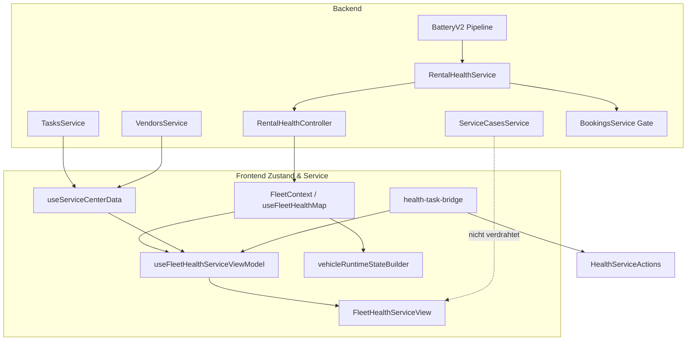

# Fleet „Zustand & Service“ — Remediation Call-Site Baseline

| Feld | Wert |
|------|------|
| **Phase** | 0, Prompt 4 von 66 |
| **Repository-Commit** | `ba8d8b77d90aadb80436d47221f05a65564dee34` (`main`) |
| **Erstellt (UTC)** | 2026-07-20 |
| **Modus** | Read-only Inventur + vorhandene Tests; keine Codeänderungen |
| **Basis-Audits** | `docs/audits/fleet-health-service-production-reality.md`, `docs/audits/fleet-health-service-workflow-ux-test-matrix.md` |
| **Contract / Tracker / ADR** | **Noch nicht im Repo** — Prompts 1–3 nicht committed; Invarianten aus Audit 2 + `FLEET_HEALTH_SERVICE_CONTRACT.md` |

---

## 1. Zweck

Exakte Baseline aller betroffenen Call-Sites, Datenflüsse und bestehenden Tests **vor** Remediation. Dient als Referenz für Prompts 5–66; jede Änderung muss gegen diese Inventur geprüft werden.

---

## 2. Architektur-Invarianten (Remediation-Ziel)

| Invariante | Ist-Stand (Code) | Remediation-Ziel |
|------------|------------------|------------------|
| Rental Health = technische Diagnose | `RentalHealthService` aggregiert 7 Module | Beibehalten |
| Task = einzelne operative Arbeit | `OrgTask`, `useServiceCenterData` | Beibehalten |
| Service Case = übergeordneter Vorgang | Backend vorhanden, **FHS-UI fehlt** | Verdrahten |
| Runtime State = endgültige Mietbereitschaft | `vehicleRuntimeStateBuilder` + `deriveIsReadyForRenting` | Beibehalten / schärfen |
| `unknown` ≠ safe | `healthSeverityBand` → `limited` | Beibehalten |
| Warning blockiert nicht auto. | `collectBlockingReasons` Hard-Block only | Beibehalten |
| Task DONE ≠ Health behoben | Getrennte Schichten | Beibehalten |
| `ServiceCase.blocksRental` | Feld existiert, **nicht** in Rental Health | → **Runtime State** (nicht Rental Health) |

---

## 3. Backend Call-Sites

### 3.1 `RentalHealthService`

| | |
|--|--|
| **Pfad** | `backend/src/modules/rental-health/rental-health.service.ts` |
| **Modul** | `backend/src/modules/rental-health/rental-health.module.ts` |
| **Typen** | `backend/src/modules/rental-health/rental-health.types.ts` |
| **Policies** | `tire-rental-health.policy.ts`, `brake-rental-health.policy.ts` |
| **Review** | `tire-rental-health-review.service.ts`, `brake-rental-health-review.service.ts` |

**Öffentliche API:**

| Methode | Zeilen (ca.) | Input | Output |
|---------|--------------|-------|--------|
| `getVehicleHealth(orgId, vehicleId)` | 100–235 | Org + Vehicle | `VehicleHealth` (7 Module, `overall_state`, `rental_blocked`, `blocking_reasons`) |
| `isRentalBlocked(orgId, vehicleId)` | 243–279 | Org + Vehicle | `RentalHealthGateResult` (fail-closed bei Fehler) |

**Interne Evaluatoren:** `evaluateBattery`, `evaluateTires`, `evaluateBrakes`, `evaluateErrorCodes`, `evaluateComplaints`, `evaluateVehicleAlerts`, `collectBlockingReasons`.

**Upstream (Promise.allSettled, ~121–161):**

| Modul | Service |
|-------|---------|
| battery | `CanonicalBatteryHealthService.getSummary` |
| tires | `HmSignalUsageService.getTirePressureSignals` → `TireHealthService.getSummary` |
| brakes | `BrakeHealthService.getSummary` |
| error_codes | `DtcService.getSummary` |
| vehicle_alerts | `HmSignalUsageService.getAiHealthCareSignals` |
| complaints | `prisma.vehicleComplaint.findMany` |
| service_compliance | `ServiceComplianceService.evaluateCompliance` |

**Backend-Caller:**

| Caller | Pfad | Methode |
|--------|------|---------|
| Rental Health API | `rental-health.controller.ts` | `getVehicleHealth` |
| Booking Gate | `bookings.service.ts:196–200, 1648–1652` | `isRentalBlocked` |
| Booking Detail (read-only) | `bookings.service.ts:995–997` | `getVehicleHealth` |
| Health Tab Summary | `vehicle-health-tab-summary.service.ts` | `getVehicleHealth` |
| Vehicle File Summary | `vehicle-file-summary.service.ts` | `getVehicleHealth` |
| Business Insights / Notifications | `business-insights.service.ts` | `getVehicleHealth` |

**Tests:** `rental-health.service.spec.ts`, `rental-health.types.spec.ts`, `tire-rental-health.policy.spec.ts`, `brake-rental-health.policy.spec.ts`, `brake-rental-health-review.service.spec.ts`, `rental-health-notification.spec.ts`

---

### 3.2 `RentalHealthController`

| | |
|--|--|
| **Pfad** | `backend/src/modules/rental-health/rental-health.controller.ts` |
| **Prefix** | `/api/v1/organizations/:orgId` |
| **Guards** | `OrgScopingGuard`, `RolesGuard`, `PermissionsGuard` |

| Route | Permission | Verhalten |
|-------|------------|-----------|
| `GET vehicles/:vehicleId/rental-health` | `fleet.read` | Einzelfahrzeug |
| `GET rental-health?vehicleIds=` | `fleet.read` | Fleet batch, **BATCH=10**, per-vehicle `.catch` → stub `unknown`, **`rental_blocked: false`** (Zeilen 81–109) |
| `POST/DELETE …/tire-rental-health/review-override` | `fleet.write` | Manuelle Tire-Freigabe |
| `POST/DELETE …/brake-rental-health/review-override` | `fleet.write` | Manuelle Brake-Freigabe |

**Audit-Abweichung bestätigt:** Fleet per-vehicle Fehler degradieren zu `rental_blocked: false` — **FAIL** laut Audit 2 (FHS-T-021).

---

### 3.3 Battery V2 Producer & Scheduler (indirekt Rental Health)

Battery speist `CanonicalBatteryHealthService` → `evaluateBattery`. Kein direkter RentalHealth→BatteryV2-Call.

| Komponente | Pfad |
|------------|------|
| Job Producer | `backend/src/modules/vehicle-intelligence/battery-health/jobs/battery-v2-job-producer.service.ts` |
| Queue | `battery.v2` (`backend/src/workers/queues/queue-names.ts`) |
| Reconciliation Scheduler | `backend/src/workers/schedulers/battery-v2-reconciliation.scheduler.ts` |
| Retention Scheduler | `backend/src/workers/schedulers/battery-v2-retention.scheduler.ts` |
| Snapshot Producer | `battery-v2-snapshot-observation.producer.ts` |
| Rest Target Producer | `battery-v2-rest-target.producer.ts` |
| Trip Start Producer | `battery-v2-trip-start.producer.ts` |

**Weitere Health-Scheduler (Rental-Health-Upstream):**

| Scheduler | Pfad | Intervall |
|-----------|------|-----------|
| Tire Recalc | `workers/schedulers/tire-recalculation.scheduler.ts` | 1h |
| Brake Recalc | `workers/schedulers/brake-recalculation.scheduler.ts` | 1h |
| DTC Poll | `workers/schedulers/dimo-dtc.scheduler.ts` | 3h |
| HM Health Polling | `workers/schedulers/hm-health-polling.scheduler.ts` | 5 min |

**Audit-Abweichung bestätigt:** Prod-Log `Custom Id cannot contain :` bei Battery-V2-Enqueue (Audit 1) — Battery-Modul in Rental Health potenziell unvollständig.

**Dedizierte Battery-V2-Tests:** `npm run test:battery:v2` (nicht in dieser Baseline-Lauf ausgeführt).

---

### 3.4 `TasksController` & `TasksService`

| | |
|--|--|
| **Controller** | `backend/src/modules/tasks/tasks.controller.ts` |
| **Service** | `backend/src/modules/tasks/tasks.service.ts` |
| **Guards** | `OrgScopingGuard`, `RolesGuard` — **kein** `PermissionsGuard`, **kein** `@Roles()` |

**Relevante Endpoints:**

| Method | Path | Service |
|--------|------|---------|
| GET | `organizations/:orgId/tasks` | `listTasks` — **ohne Pagination** (`findMany` ~750–766) |
| GET | `organizations/:orgId/tasks/summary` | `getDashboardSummary` |
| GET | `organizations/:orgId/vehicles/:vehicleId/tasks` | `getTasksForVehicle` |
| POST/PATCH | `…/tasks`, `…/start`, `…/complete`, `…/cancel`, … | Lifecycle |

**FHS-relevant:** `useServiceCenterData` ruft `summary` + `list` auf.

**Audit-Abweichung bestätigt:** Keine `tasks.read`/`tasks.write` Permissions; volle Org-Task-Liste ohne `take`.

**Tests:** `tasks.controller.spec.ts` (Guards only), Task-Domain-Audit (`docs/audits/task-domain-v2-final-audit.md`)

---

### 3.5 `ServiceCasesController` & `ServiceCasesService`

| | |
|--|--|
| **Controller** | `backend/src/modules/service-cases/service-cases.controller.ts` |
| **Service** | `backend/src/modules/service-cases/service-cases.service.ts` |
| **Guards** | `OrgScopingGuard`, `RolesGuard` — **kein** `PermissionsGuard` |

**Endpoints:** `GET/POST/PATCH …/service-cases`, `…/complete`, `…/cancel`, `…/vehicles/:vehicleId/service-cases`, `…/vendors/:vendorId/service-cases`.

**`list` (~146–167):** `findMany` **ohne Pagination**.

**`blocksRental`:** Feld auf `ServiceCase` — **nicht** von `RentalHealthService` gelesen.

**FHS:** **Kein** `api.serviceCases` in `useServiceCenterData` — nur in `TasksView` / `TasksNewTaskDialog` Lookup.

**Tests:** `service-cases.service.spec.ts` (10 Tests, PASS)

**Audit-Abweichung bestätigt:** Service Cases **SHADOW_ONLY** in FHS-UI (P0-1).

---

### 3.6 Vendors API

| | |
|--|--|
| **Controller** | `backend/src/modules/vendors/vendors.controller.ts` |
| **Service** | `backend/src/modules/vendors/vendors.service.ts` |
| **Guards** | `OrgScopingGuard`, `PermissionsGuard` — `vendor-management:read/write` |

**FHS:** `useServiceCenterData` → `api.vendors.list(orgId).catch(() => [])`.

**Audit-Abweichung bestätigt:** Silent vendor fail (P0-2).

---

### 3.7 Booking Health Gate

| | |
|--|--|
| **Pfad** | `backend/src/modules/bookings/bookings.service.ts` |
| **DI** | `RentalHealthService` via `forwardRef` (`bookings.module.ts`) |

| Methode | Zeilen | Verhalten |
|---------|--------|-----------|
| `enforceRentalHealthGate` | 113–142 | `VEHICLE_RENTAL_BLOCKED` oder `VEHICLE_HEALTH_GATE_UNAVAILABLE` |
| `create` | 196–200 | Gate vor Buchungserstellung |
| `update` | 1648–1652 | Gate bei Fahrzeug-/Datumswechsel |
| Detail enrichment | 995–997, 1068+ | `getVehicleHealth` read-only; Fehler → `null` |

**`isRentalBlocked` fail-closed:** Bei Exception → `blocked: true`, `UNAVAILABLE` (~265–277 rental-health.service.ts).

**Frontend:** `NewBookingView` (catch Gate-Codes), `booking-vehicle-preflight.ts`, `bookingHandoverGates.ts`, `bookingActionRules.ts`.

---

## 4. Frontend Call-Sites

### 4.1 `useFleetHealthMap` / `useVehicleHealth`

| | |
|--|--|
| **Pfad** | `frontend/src/rental/hooks/useVehicleHealth.ts` |
| **API** | `api.rentalHealth.getFleet` / `getVehicle` (`frontend/src/lib/api.ts` ~3462–3476) |

| Hook | Error | Refresh |
|------|-------|---------|
| `useFleetHealthMap` | `.catch` → `healthError` | `reload()`; deps `[orgId, idsKey]` |
| `useVehicleHealth` | `.catch` → EN message | `reload()` |

**Importer:**

| Datei | Nutzung |
|-------|---------|
| `FleetContext.tsx` | Kanonische Org-Batch-Health |
| `NewBookingView.tsx` | **Zweite** `useFleetHealthMap`-Instanz (Picker-IDs) |
| `BookingVehicleHealthTab.tsx` | Einzelfahrzeug |
| `BookingsView.tsx` | `useVehicleHealth` — **`detailHealth` ungenutzt (dead)** |

---

### 4.2 `FleetContext`

| | |
|--|--|
| **Pfad** | `frontend/src/rental/FleetContext.tsx` |

| Concern | Implementation |
|---------|----------------|
| Fleet Map | `useFleetMapStore` → `api.vehicles.fleetMap`, 30s Poll |
| Health | `useFleetHealthMap(orgId, fleetVehicleIds)` |
| Invalidation | `vehicleOperationalQueryKeys.fleetHealth(orgId)` → `reloadHealth()` |
| Export | `healthMap`, `healthLoading`, `healthError`, `reloadHealth`, `useEffectiveHealth` |

**Provider:** `App.tsx` (Rental-Tree)

---

### 4.3 `useServiceCenterData`

| | |
|--|--|
| **Pfad** | `frontend/src/rental/components/service-center/useServiceCenterData.ts` |

| API | Error |
|-----|-------|
| `api.tasks.summary` | Outer catch → `serviceError`, leere Arrays |
| `api.tasks.list` | Wie oben |
| `api.vendors.list` | **`.catch(() => [])`** — silent |

**Refresh:** `subscribeTaskQueryInvalidation` → `reload()` bei Task-Mutationen.

**Importer:** `useFleetHealthServiceViewModel.ts`, `ServiceCenterView.tsx` (legacy).

**Nicht geladen:** `api.serviceCases.*`

---

### 4.4 `useFleetHealthServiceViewModel` + View Model

| Datei | Rolle |
|-------|-------|
| `useFleetHealthServiceViewModel.ts` | Composes `useFleetVehicles` + `useServiceCenterData` → `buildFleetHealthServiceViewModel` |
| `fleet-health-service.view-model.ts` | Pure derivation: KPIs, groups, `matchOpenTaskForHealthSignal`, `buildPrioritizedOverviewRows` |
| `fleet-health-service-labels.ts` | DE-Labels |
| `fleet-health-service.types.ts` | Tab types, `normalizeFleetTab` |
| `fleet-health-service-shell.ts` | Layout tokens |

**Bridge-Import:** `findDuplicateHealthTask` aus `health-task-bridge.utils.ts`.

**Importer:** `FleetHealthServiceView.tsx` only.

**Tests:** `fleet-health-service.view-model.test.ts` (10), `fleet-health-service.types.test.ts` (4)

---

### 4.5 `health-task-bridge.utils.ts`

| | |
|--|--|
| **Pfad** | `frontend/src/rental/lib/health-task-bridge.utils.ts` |
| **API-Calls** | Keine (pure functions) |
| **Dedizierte Tests** | **Keine** |

**Exports:** `buildHealthTaskPrefill`, `findDuplicateHealthTask`, `healthModuleNeedsAction`, `isHealthOriginatedTask`, `healthContextFromTask`, `MODULE_TASK_TYPES`.

**Importer:**

| Datei | Symbole |
|-------|---------|
| `fleet-health-service.view-model.ts` | `findDuplicateHealthTask` |
| `health/HealthServiceActions.tsx` | prefill, duplicate, needs-action |
| `health/HealthVehicleDetailPanel.tsx` | `HealthActionModule` |
| `health/HealthTaskContextPanel.tsx` | `healthContextFromTask` |
| `service-center/ServiceTaskCreateModal.tsx` | `HealthTaskPrefill` |
| `dashboard/notifications/notification-task-bridge.ts` | `buildHealthTaskPrefill` |

**Audit-Abweichung bestätigt:** `findDuplicateHealthTask` matcht auf Task-Typ allein (Zeilen 227–228) — FALSE_MATCH-Risiko (FHS-T-032–034).

---

### 4.6 `HealthServiceActions`

| | |
|--|--|
| **Pfad** | `frontend/src/rental/components/health/HealthServiceActions.tsx` |

| API | Error |
|-----|-------|
| `api.tasks.forVehicle` | `.catch(() => [])` |
| `api.vendors.list` | `.catch(() => [])` |

**Importer:** `HealthVehicleDetailPanel.tsx`, `HealthErrorsView.tsx`

**Gap:** Nach Task-Create kein `invalidateTaskQueries` — FHS Task-Tab refresht nicht automatisch.

---

### 4.7 `vehicleRuntimeStateBuilder` + `rentalReadiness`

| Datei | Rolle |
|-------|-------|
| `frontend/src/rental/components/dashboard/runtime/rentalReadiness.ts` | `deriveIsReadyForRenting`, `reasonBlocksReadyForRenting` |
| `frontend/src/rental/components/dashboard/runtime/vehicleRuntimeStateBuilder.ts` | `buildVehicleRuntimeStates` — konsumiert `healthMap` für Reasons, **nicht** für finale Readiness allein |

**Health in Runtime:** `addHealthReasons` nutzt `rental_blocked` + `blocking_reasons`; Warning-only blockiert Readiness **nicht** auto.

**Importer:** `dashboardSliceBuilder.ts` → `useDashboardViewModel.ts`

**Tests:** `vehicleRuntimeStateBuilder.test.ts` (10), `rentalReadiness.test.ts` (7), `dashboardRuntime.test.ts` (27)

---

### 4.8 `FleetHealthServiceView` und Subtabs

| | |
|--|--|
| **Root** | `frontend/src/rental/components/fleet-health-service/FleetHealthServiceView.tsx` |
| **Contract** | `FLEET_HEALTH_SERVICE_CONTRACT.md` |

| Subtab | Panel | Datenquelle | Direkte API |
|--------|-------|-------------|-------------|
| `overview` | `FleetHealthServiceOverviewPanel` + KpiStrip + PrioritizedList | `vm` | — |
| `vehicles` | `FleetConditionView` (embedded) | `FleetContext.healthMap` | — |
| `tasks` | `FleetHealthServiceTasksPanel` → `ServiceTasksPanel` | `vm.allTasks`, `vm.vendors` | reload via `vm.reloadService()` |
| `schedule` | `FleetHealthServiceSchedulePanel` → `ServiceSchedulePanel` | `vm.allTasks` | — |
| `vendors` | `FleetHealthServiceVendorsPanel` → `VendorManagementView` | eigenes Fetch | `api.vendors.*` |
| `history` | `FleetHealthServiceHistoryPanel` → `ServiceHistoryPanel` | `vm.allTasks` (DONE/CANCELLED) | — |

**Tab-Bar:** `FleetHealthServiceTabBar.tsx`  
**Hub:** `FleetHubView.tsx` — Refresh-Button ruft nur `reloadHealth()` (overview/vehicles).

---

### 4.9 `FleetConditionView` & `HealthVehicleDetailPanel`

| Datei | Health-Bezug |
|-------|--------------|
| `FleetConditionView.tsx` | `healthMap`, Filter/KPI via `fleet-health-control-center.ts`, Detail: `HealthVehicleDetailPanel` / Drawer |
| `health/HealthVehicleDetailPanel.tsx` | Lazy `useHealthVehicleDetailData`, `HealthServiceActions` pro Modul |
| `health/useHealthVehicleDetailData.ts` | Modul-APIs mit `.catch(() => null/[])` |

**FHS embedded:** `hideKpiStrip`, `uiLocale="de"`, `getExistingTaskId` von VM.

---

## 5. Datenfluss (End-to-End)



---

## 6. Test-Inventar

### 6.1 Vorhandene Tests (relevant)

| Bereich | Datei | Tests |
|---------|-------|-------|
| FHS View Model | `fleet-health-service.view-model.test.ts` | 10 |
| FHS Types | `fleet-health-service.types.test.ts` | 4 |
| Fleet Health Control | `fleet-health-control-center.test.ts` | 15 |
| Runtime Builder | `vehicleRuntimeStateBuilder.test.ts` | 10 |
| Rental Readiness | `rentalReadiness.test.ts` | 7 |
| Dashboard Runtime | `dashboardRuntime.test.ts` | 27 |
| Operational Issues | `operationalIssues.test.ts` | 18 |
| Reason Display | `reasonDisplay.test.ts` | 12 |
| Action Queue | `actionQueueGrouping.test.ts` | 27 |
| Dashboard Drawer | `dashboardDrawerNormalize.test.ts` | 6 |
| Attention Builder | `dashboardAttentionBuilder.test.ts` | 5 |
| Todays Slice | `todaysOperationalSlice.test.ts` | 8 |
| Notifications+Health | `merge-v2-with-vehicle-health.test.ts` | 9 |
| Rental Health Service | `rental-health.service.spec.ts` | (in 86 backend) |
| Rental Health Types | `rental-health.types.spec.ts` | |
| Tire/Brake Policy | `tire/brake-rental-health.policy.spec.ts` | |
| Tasks Controller | `tasks.controller.spec.ts` | |
| Service Cases | `service-cases.service.spec.ts` | |
| Technical Observations | `technical-observations.service.spec.ts` | |
| Health Tab Summary | `vehicle-health-tab-summary.service.spec.ts` | |
| Rental Health Notification | `rental-health-notification.spec.ts` | |

### 6.2 Fehlende Tests (Remediation-relevant)

| Bereich | Status |
|---------|--------|
| `health-task-bridge.utils.ts` | **Kein dediziertes Spec** |
| `useServiceCenterData` (vendor error) | **Kein Spec** |
| `useFleetHealthMap` / `FleetContext` | **Kein Spec** |
| `HealthServiceActions` | **Kein Spec** |
| `FleetHealthServiceView` / Subtabs | **Kein Component-Test** |
| `FleetConditionView` | **Kein Spec** |
| FHS E2E (6 Subtabs) | **Kein Playwright-Spec** |
| Booking Gate E2E mit Health | Teilweise `fleet-operational-flow.spec.ts` (ops, nicht Z&S) |

### 6.3 Playwright (vorhanden, indirekt)

| Datei | Bezug |
|-------|-------|
| `frontend/e2e/fleet-operational-flow.spec.ts` | Fleet Status-Tabs, ops — **nicht** Zustand & Service |
| `frontend/e2e/fleet-operational-responsive.spec.ts` | Responsive ops |
| `frontend/e2e/fleet-operational-fixtures.ts` | Fixtures |
| `frontend/e2e/dashboard-notifications-v2.spec.ts` | Health in Notifications |
| `frontend/e2e/tasks-flow.spec.ts` | Tasks allgemein |
| `frontend/e2e/battery-health-flow.spec.ts` | Battery detail, nicht FHS |

---

## 7. Ausgeführte Testbefehle und Resultate

### Frontend (158 Tests, 13 Dateien)

```bash
cd frontend && npm test -- --run \
  fleet-health-service.view-model.test.ts \
  fleet-health-service.types.test.ts \
  fleet-health-control-center.test.ts \
  dashboardRuntime.test.ts \
  operationalIssues.test.ts \
  reasonDisplay.test.ts \
  vehicleRuntimeStateBuilder.test.ts \
  rentalReadiness.test.ts \
  todaysOperationalSlice.test.ts \
  dashboardDrawerNormalize.test.ts \
  dashboardAttentionBuilder.test.ts \
  actionQueueGrouping.test.ts \
  merge-v2-with-vehicle-health.test.ts
```

**Ergebnis:** 13/13 files PASS, **158/158** tests PASS (2026-07-20).

### Backend (125 Tests, 10 Suites)

```bash
cd backend && npm test -- --testPathPattern="rental-health|tasks.controller|service-cases|vehicle-health-tab|rental-health-notification|technical-observations" --passWithNoTests
```

**Ergebnis:** 10/10 suites PASS, **125/125** tests PASS (2026-07-20).

### Gesamt Baseline-Lauf

| | Anzahl |
|--|--------|
| **Ausgeführte Tests** | **283** |
| **Failures** | **0** |

---

## 8. Bestätigte Abweichungen von den Audits

| ID | Audit-Finding | Baseline-Bestätigung | Evidenz |
|----|---------------|----------------------|---------|
| P0-1 | Service Cases nicht in FHS | **Bestätigt** | `useServiceCenterData` ohne `serviceCases`; Contract Z.67 |
| P0-2 | Vendor silent fail | **Bestätigt** | `useServiceCenterData.ts:30` `.catch(() => [])` |
| P0-3 | Battery V2 Prod-Enqueue | **Bestätigt** (Audit 1 Log) | Producer `battery-v2-job-producer.service.ts` |
| P0-4 | Fleet per-vehicle error → `rental_blocked: false` | **Bestätigt** | `rental-health.controller.ts:96` |
| P0-5 | Tasks ohne Pagination | **Bestätigt** | `tasks.service.ts` `findMany` ohne `take` |
| P1-1 | Health→Task FALSE_MATCH | **Bestätigt** | `health-task-bridge.utils.ts:227-228` |
| P1-2 | Refresh nur Health | **Bestätigt** | `FleetHubView.tsx` `reloadHealth()` only |
| P1-3 | Eine Overview-Zeile/Fahrzeug | **Bestätigt** | `buildPrioritizedOverviewRows` |
| P1-4 | RBAC Tasks/SC partial | **Bestätigt** | Controller guards |
| P1-5 | `ServiceCase.blocksRental` nicht in Rental Health | **Bestätigt** | Kein Consumer in `rental-health.service.ts` |
| P1-6 | Kein `sourceFindingId` | **Bestätigt** | `buildHealthTaskPrefill` metadata |
| P1-7 | Termine = Task due only | **Bestätigt** | `ServiceSchedulePanel` copy |
| P1-8 | Skalierung 500+ | **Bestätigt** | BATCH=10, no pagination |
| — | `BookingsView.detailHealth` dead | **Neu bestätigt** | `useVehicleHealth` unused |
| — | Dual `useFleetHealthMap` | **Bestätigt** | FleetContext + NewBookingView |
| — | HealthServiceActions no task invalidation | **Neu bestätigt** | Kein `invalidateTaskQueries` nach create |

### Noch offene Audit-Aussagen (nicht re-verifiziert in diesem Prompt)

| Thema | Status |
|-------|--------|
| Prod PostgreSQL-Zahlen (7 Fahrzeuge, 0 SC) | Audit 1 only — nicht erneut abgefragt |
| PM2 787 Restarts | Audit 1 only |
| Grafana FHS Dashboard | Weiterhin nicht vorhanden |

---

## 9. Refresh-/Invalidierungs-Matrix (Ist)

| Trigger | Fleet Map | Health | Tasks | Vendors | Service Cases |
|---------|-----------|--------|-------|---------|---------------|
| Mount / orgId | ✓ | ✓ | ✓ | ✓ | — |
| 30s Poll | ✓ | — | — | — | — |
| Header Refresh (FHS) | — | ✓ | — | — | — |
| Task Mutation | — | — | ✓ (event) | — | — |
| Operational Invalidation | ✓ | ✓ | — | — | — |
| Window Focus | — | — | — | — | — |

---

## 10. RBAC-Matrix (Ist, vereinfacht)

| Surface | Org Guard | Roles | Permission | FHS-relevant |
|---------|-----------|-------|------------|--------------|
| Rental Health GET | ✓ | pass-through | `fleet.read` | ✓ |
| Tasks CRUD | ✓ | pass-through | — | ✓ |
| Service Cases CRUD | ✓ | pass-through | — | Remediation |
| Vendors | ✓ | — | `vendor-management` | ✓ (Partner-Tab) |

---

## 11. Nächste Remediation-Prompts (Referenz)

Diese Baseline blockiert keine Arbeit; sie dokumentiert den **Ist-Stand**. Empfohlene erste Code-Prompts (aus Audit 2 Reihenfolge):

1. Vendor error exposure in `useServiceCenterData`
2. `serviceCases` in FHS data layer
3. `findDuplicateHealthTask` enger (sourceFindingId)
4. Unified refresh
5. Per-vehicle health degradation fix in controller
6. `ServiceCase.blocksRental` → Runtime State (nicht Rental Health)

---

*Baseline erstellt ohne Produktivcodeänderung. Contract/Tracker/ADR aus Phase 0 Prompts 1–3 fehlen noch im Repository — bei deren Einchecken diese Baseline referenzieren und ggf. Abschnitt 2 aktualisieren.*
