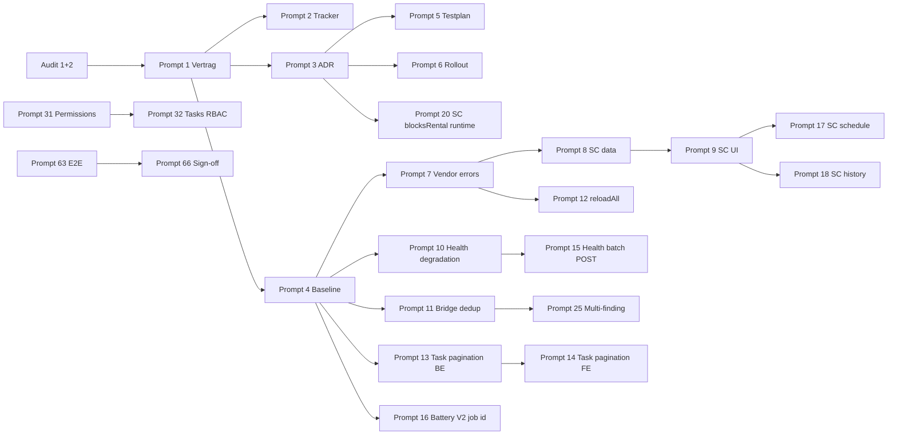

# Fleet „Zustand & Service“ — Remediation-Tracker (66 Prompts)

| Feld | Wert |
|------|------|
| **Version** | 1.0 |
| **Erstellt (UTC)** | 2026-07-20 |
| **Prompt** | 2/66 (Tracker) |
| **Vertrag** | [`fleet-health-service-remediation-contract.md`](./fleet-health-service-remediation-contract.md) |
| **Repository-Baseline (`main`)** | `7192fb4e4e8ad854b3b3415b909513a08b669f90` |
| **Modus** | Nur Dokumentation — keine Produktivcodeänderung in Prompt 2 |

---

## 1. Zweck

Nachvollziehbarer Umsetzungs-Tracker für die gesamte Fleet-Health-Service-Remediation über **66 Prompts**. Jeder Prompt hat Status, Abhängigkeiten, Domäne, Akzeptanzkriterien, Commit-, Test- und Rollback-Felder.

**Legende Status:** `TODO` · `IN_PROGRESS` · `DONE` · `BLOCKED`

---

## 2. Basis-Audits (verbindlich)

| Audit | Datei | Urteil | Commit (Audit-Zeitpunkt) |
|-------|-------|--------|--------------------------|
| **1 — Production Reality** | [`docs/audits/fleet-health-service-production-reality.md`](../audits/fleet-health-service-production-reality.md) | `CONDITIONALLY_READY` | `8d2780ac` (Audit-Repo); VPS deployed `ac856881` |
| **2 — Workflow/UX-Testmatrix** | [`docs/audits/fleet-health-service-workflow-ux-test-matrix.md`](../audits/fleet-health-service-workflow-ux-test-matrix.md) | `CONDITIONALLY_READY` | `8d2780ac` |

---

## 3. Repository- und Deployment-Baseline

### 3.1 Repository (Source of Truth für Umsetzung)

| Feld | Wert |
|------|------|
| Branch | `main` |
| Commit (Tracker-Erstellung) | `7192fb4e4e8ad854b3b3415b909513a08b669f90` |
| Letzter relevanter Docs-Commit | `7192fb4e` — Call-Site-Baseline (Prompt 4) |
| FHS UI-Contract | `frontend/src/rental/components/fleet-health-service/FLEET_HEALTH_SERVICE_CONTRACT.md` |

### 3.2 Deployment vs. Repository (keine Annahme „main = prod“)

| Quelle | Commit / Stand | Abweichung |
|--------|----------------|------------|
| **Lokales `main` (aktuell)** | `7192fb4e…` | — |
| **VPS deployed (Audit 1, 2026-07-18)** | `ac856881…` (`20260718004214_v4994`) | **Hinter** Audit-Repo und aktuellem `main` |
| **Audit 1 Repo-Stand** | `ffcb3e0c…` → später `8d2780ac…` | Audits können älter als `main` sein |
| **Health-Check Prod** | `GET https://app.synqdrive.eu/api/v1/health` → 200 (Audit 1) | Zeitpunktbezogen |

**Regel:** Produktionsbefunde (Battery-V2-Enqueue, PM2-Restarts, DB-Counts) gelten nur für den **Audit-Zeitpunkt**. Vor Deploy-Gate erneut verifizieren. **Nicht** annehmen, dass `main` bereits auf der VPS läuft.

### 3.3 Bestätigte P0-Ausgangsprobleme (Tracker-Start)

| ID | Finding | Audit-Ref |
|----|---------|-----------|
| P0-1 | Service Cases nicht in FHS-UI | Audit 2 §27 |
| P0-2 | Vendor API silent fail → KPI 0 | FHS-T-024, 063 |
| P0-3 | Battery V2 Prod-Enqueue (`Custom Id cannot contain :`) | FHS-T-092 |
| P0-4 | Health per-vehicle error → `rental_blocked: false` | FHS-T-021 |
| P0-5 | Tasks ohne Pagination | FHS-T-078, 138 |

---

## 4. Phasenübersicht

| Phase | Prompts | Fokus | Fortschritt |
|-------|---------|-------|-------------|
| 0 | 1–6 | Planung, Vertrag, Tracker, ADR, Baseline, Testplan, Rollout | 4/6 DONE |
| 1 | 7–16 | P0 — Vendor, Service Cases, Health-Degradation, Pagination, Battery, Refresh | 0/10 |
| 2 | 17–24 | Service Cases — Termine, Historie, Runtime-Blockade, KPI | 0/8 |
| 3 | 25–30 | Health→Task-Brücke, Dedup, Multi-Finding | 0/6 |
| 4 | 31–36 | RBAC Tasks/Service Cases | 0/6 |
| 5 | 37–44 | Skalierung, Batch API, Virtualisierung | 0/8 |
| 6 | 45–50 | Partial Failure, Freshness | 0/6 |
| 7 | 51–58 | UX, i18n, a11y, IA | 0/8 |
| 8 | 59–62 | Observability, Grafana, Runbook | 0/4 |
| 9 | 63–66 | E2E, Gate, Post-Remediation-Audit | 0/4 |

---

## 5. Prompt-Register (vollständig)

### Phase 0 — Planung & Baseline

| ID | Phase | Titel | Abhängigkeiten | Domäne | Akzeptanzkriterien | Status | Commit | Testnachweis | Rollback |
|----|-------|-------|----------------|--------|-------------------|--------|--------|--------------|----------|
| **1** | 0 | Remediation-Ausführungsvertrag | Audit 1 + 2 | Docs / Governance | Vertrag in `docs/implementation/`; Pre-Flight, Git, §5-Invarianten, Phasenübersicht; Audits verlinkt; Repo vs. Deploy dokumentiert | **DONE** | `4f8655e8` | N/A — Docs only | Datei löschen / Revert Commit |
| **2** | 0 | Remediation-Tracker (66 Prompts) | Prompt 1 | Docs / Governance | Tracker mit allen 66 Zeilen; Status P1 DONE, P2 DONE; Baseline + Deploy-Hinweis; Audit-Links | **DONE** | `4f8655e8` | N/A — Docs only | Revert Commit |
| **3** | 0 | Zielarchitektur Domain Boundaries | Prompt 1, 2 | Docs / Architektur | `docs/architecture/fleet-health-service-domain-boundaries.md`; 9 Konzepte, Owner/Consumer, Mermaid, keine Codeänderung | **DONE** | `e722687c` | N/A — Docs only | Revert ADR-Datei |
| **4** | 0 | Call-Site-Baseline | Audit 1, 2, P3 ADR | Docs / Inventur | Vollständige Backend/Frontend Call-Sites + Tests inventarisiert; 283 Tests PASS | **DONE** | *(dieser Commit)* | 283 Tests PASS (§7) | Revert Baseline-Doc |
| **5** | 0 | Testplan & Fixture-Katalog | Prompt 3, 4 | Docs / QA | Matrix FHS-T-001–142 → Prompt-Zuordnung; fehlende Specs gelistet; Golden-Fixture-Plan | TODO | — | — | Revert Testplan-Doc |
| **6** | 0 | Rollout-Flags & Deploy-Runbook | Prompt 3, 5 | Docs / Ops | Feature-Flags für schrittweise FHS-Aktivierung; kein Auto-Deploy; Rollback-Schritte | TODO | — | — | Revert Runbook |

### Phase 1 — P0 Kritisch

| ID | Phase | Titel | Abhängigkeiten | Domäne | Akzeptanzkriterien | Status | Commit | Testnachweis | Rollback |
|----|-------|-------|----------------|--------|-------------------|--------|--------|--------------|----------|
| **7** | 1 | Vendor-Fehler exponieren (kein silent `[]`) | Prompt 4, 6 | Frontend / `useServiceCenterData` | API-Fehler → `vendorError` im ViewModel; KPI „Wartet Partner“ zeigt Fehlerzustand, nicht 0; FHS-T-024/063 grün | TODO | — | — | Revert Hook + ViewModel |
| **8** | 1 | Service Cases in Data Layer | Prompt 4, 7 | Frontend / API | `api.serviceCases.list` in `useServiceCenterData`; org-scoped; Fehler nicht verschluckt | TODO | — | — | Feature-Flag aus |
| **9** | 1 | Service Cases UI — Listen/Detail | Prompt 8 | Frontend / FHS UI | Cases in FHS sichtbar (Subtab/Panel); FHS-T-054 PASS | TODO | — | — | UI-Flag aus |
| **10** | 1 | Health per-vehicle Degradation ehrlich | Prompt 4 | Backend / Rental Health | Fleet batch: Fehler → `unknown` + kein falsches `rental_blocked: false`; FHS-T-021 | TODO | — | — | Controller-Revert |
| **11** | 1 | `sourceFindingId` + enger Dedup | Prompt 4 | Frontend / Bridge | `findDuplicateHealthTask` nur `healthModule` + `sourceFindingId`; FHS-T-032–034, 044 | TODO | — | — | Bridge-Revert |
| **12** | 1 | Unified `reloadAll()` Refresh | Prompt 7, 8 | Frontend / FHS | Refresh lädt Health + Tasks + Vendors + Cases; FHS-T-027, 108 | TODO | — | — | Revert Refresh-Handler |
| **13** | 1 | Task-Pagination Backend | Prompt 4 | Backend / Tasks | `listTasks` mit `take`/`cursor`; Default-Limit; org-scoped | TODO | — | — | API-Compat: alte Clients ohne cursor |
| **14** | 1 | Task-Pagination Frontend | Prompt 13 | Frontend / Service Center | Infinite scroll oder paging in FHS Aufgaben; FHS-T-078 | TODO | — | — | Client-Flag |
| **15** | 1 | Health Fleet Batch POST | Prompt 10 | Backend + Frontend | `vehicleIds` per POST body; URL-Längen-Limit behoben; FHS-T-077 | TODO | — | — | GET-Fallback behalten |
| **16** | 1 | Battery V2 Job-ID Sanitization | Prompt 4 | Backend / Workers | Kein `:` in BullMQ custom job id; Prod-Log-Fehler behoben; FHS-T-092 | TODO | — | — | Revert Producer |

### Phase 2 — Service Cases Tiefe

| ID | Phase | Titel | Abhängigkeiten | Domäne | Akzeptanzkriterien | Status | Commit | Testnachweis | Rollback |
|----|-------|-------|----------------|--------|-------------------|--------|--------|--------------|----------|
| **17** | 2 | Service Cases — Termine-Tab | Prompt 9 | Frontend / Schedule | `scheduledAt` / `WAITING_PARTS` in Termine; FHS-T-060, 118 | TODO | — | — | UI-Flag |
| **18** | 2 | Service Cases — Historie-Tab | Prompt 9 | Frontend / History | Abgeschlossene Cases in Verlauf; FHS-T-066, 067 | TODO | — | — | UI-Flag |
| **19** | 2 | Case + Task KPI-Schichten | Prompt 9 | Frontend / ViewModel | Übersicht trennt Health-KPI vs. Case-KPI vs. Task-KPI; FHS-T-130 | TODO | — | — | ViewModel-Revert |
| **20** | 2 | `ServiceCase.blocksRental` → Runtime State | Prompt 3 | Backend + Frontend | Blockade in `vehicleRuntimeStateBuilder`, **nicht** Rental Health; FHS-T-105 | TODO | — | — | Flag `runtimeScBlocks` aus |
| **21** | 2 | Health-sourced Case-Erstellung | Prompt 9, 11 | Frontend + Backend | CTA erzeugt Case mit Health-Metadaten; FHS-T-057 | TODO | — | — | Revert CTA |
| **22** | 2 | Case-Dokumente in Historie | Prompt 18 | Frontend | Verknüpfte Dokumente sichtbar; FHS-T-136 | TODO | — | — | UI-Flag |
| **23** | 2 | Case↔Task-Verknüpfung in FHS | Prompt 9 | Frontend | `serviceCaseId` in Task-Detail; FHS-T-104 | TODO | — | — | Revert Panel |
| **24** | 2 | Service-Case Integrationstests | Prompt 17–23 | Tests | Backend + Frontend Specs für Case-Lifecycle in FHS | TODO | — | — | Test-Revert |

### Phase 3 — Health→Task-Brücke

| ID | Phase | Titel | Abhängigkeiten | Domäne | Akzeptanzkriterien | Status | Commit | Testnachweis | Rollback |
|----|-------|-------|----------------|--------|-------------------|--------|--------|--------------|----------|
| **25** | 3 | Multi-Finding Übersicht | Prompt 11 | Frontend / Overview | „+N weitere“ pro Fahrzeug; FHS-T-045 | TODO | — | — | ViewModel-Revert |
| **26** | 3 | `health-task-bridge` Unit-Tests | Prompt 11 | Tests | Dedizierte Spec für Match/Create/Dedup | TODO | — | — | — |
| **27** | 3 | CTA Prefill `sourceFindingId` persistieren | Prompt 11 | Frontend | Task-Metadata enthält stabilen Finding-Key; FHS-T-044 | TODO | — | — | Revert Metadata |
| **28** | 3 | Match-Status-Typen verfeinern | Prompt 26 | Frontend / Types | `EXACT_MATCH` / `FALSE_MATCH` / `MISSED_MATCH` konsistent | TODO | — | — | Type-Revert |
| **29** | 3 | Execution-only vs. Health-linked Dedup | Prompt 25 | Frontend / ViewModel | Overdue ohne Health nicht als Health-Zeile; FHS-T-040 | TODO | — | — | ViewModel-Revert |
| **30** | 3 | Bridge-Contract-Dokumentation | Prompt 26–29 | Docs | `FLEET_HEALTH_SERVICE_CONTRACT.md` + Architektur aktualisiert | TODO | — | — | Doc-Revert |

### Phase 4 — RBAC

| ID | Phase | Titel | Abhängigkeiten | Domäne | Akzeptanzkriterien | Status | Commit | Testnachweis | Rollback |
|----|-------|-------|----------------|--------|-------------------|--------|--------|--------------|----------|
| **31** | 4 | Permission-Keys `tasks.read` / `tasks.write` | Prompt 3 | Backend / Auth | Keys in Permission-Registry | TODO | — | — | Keys deprecaten |
| **32** | 4 | Tasks-Controller `PermissionsGuard` | Prompt 31 | Backend | CRUD an Permissions gebunden; FHS-T-072 | TODO | — | — | Guard-Revert |
| **33** | 4 | Service-Cases-Controller Guards | Prompt 31 | Backend | Analog Tasks; org-scoped | TODO | — | — | Guard-Revert |
| **34** | 4 | Frontend Permission-Gating | Prompt 32, 33 | Frontend | Mutations nur mit Permission; Read-only blockiert | TODO | — | — | UI-Revert |
| **35** | 4 | RBAC Controller-Specs | Prompt 32, 33 | Tests | 403 für fehlende Permissions; FHS-T-074 | TODO | — | — | — |
| **36** | 4 | RBAC-Dokumentation & Rollenmatrix | Prompt 35 | Docs | Matrix aus Audit 2 §5.2 in Architektur | TODO | — | — | Doc-Revert |

### Phase 5 — Skalierung & API

| ID | Phase | Titel | Abhängigkeiten | Domäne | Akzeptanzkriterien | Status | Commit | Testnachweis | Rollback |
|----|-------|-------|----------------|--------|-------------------|--------|--------|--------------|----------|
| **37** | 5 | Rental-Health Batch-Endpoint härten | Prompt 15 | Backend | Batch-Größe konfigurierbar; Timeout-Schutz | TODO | — | — | Config-Default |
| **38** | 5 | Frontend Health-Map Chunking | Prompt 15 | Frontend | Chunked fetch für >N Fahrzeuge; FHS-T-077 | TODO | — | — | Chunk-Size-Config |
| **39** | 5 | Task-List Cursor-API-Vertrag | Prompt 13 | Backend / API | OpenAPI/DTO dokumentiert; stable cursor | TODO | — | — | API v1 compat |
| **40** | 5 | Task-Summary effiziente Aggregate | Prompt 13 | Backend | Summary ohne Full-Scan bei Pagination | TODO | — | — | Revert Query |
| **41** | 5 | Virtualisierte Fahrzeugliste FHS | Prompt 4 | Frontend | Render >500 Zeilen ohne DOM-Kollaps; FHS-T-079 | TODO | — | — | Virtualization-Flag aus |
| **42** | 5 | URL/Chunk-Limits Tests | Prompt 38 | Tests | Synthetic 500/1000/5000 vehicle ids | TODO | — | — | — |
| **43** | 5 | Large-Fleet Load-Harness | Prompt 42 | Tests / Tooling | Harness dokumentiert; keine Prod-Last | TODO | — | — | — |
| **44** | 5 | FHS Cache / SWR-Policy | Prompt 12 | Frontend | Stale-while-revalidate; kein stale KPI 0 | TODO | — | — | Cache-Revert |

### Phase 6 — Partial Failure & Freshness

| ID | Phase | Titel | Abhängigkeiten | Domäne | Akzeptanzkriterien | Status | Commit | Testnachweis | Rollback |
|----|-------|-------|----------------|--------|-------------------|--------|--------|--------------|----------|
| **45** | 6 | Per-Modul-Freshness-Timestamps | Prompt 4 | Frontend | Min/Max oder pro Modul; FHS-T-134 | TODO | — | — | UI-Revert |
| **46** | 6 | KPI-Strip Fehlerzustände | Prompt 7 | Frontend | Kein falscher Null-Wert bei Partial Fail; FHS-T-082 | TODO | — | — | Revert KPI |
| **47** | 6 | Task Partial-Load Fehler | Prompt 7, 14 | Frontend | Summary OK / List fail → ehrliche UI; FHS-T-133 | TODO | — | — | Revert Handler |
| **48** | 6 | Window-Focus Refetch-Policy | Prompt 12 | Frontend | Optional refetch on focus; dokumentiert; FHS-T-029 | TODO | — | — | Flag aus |
| **49** | 6 | Stale-Badge pro Health-Modul | Prompt 45 | Frontend | Modul-stale sichtbar; FHS-T-107 | TODO | — | — | Revert Badge |
| **50** | 6 | Partial-Failure Integrationstests | Prompt 46–49 | Tests | Vendor/Health/Task-Fehlerpfade abgedeckt | TODO | — | — | — |

### Phase 7 — UX / i18n / a11y

| ID | Phase | Titel | Abhängigkeiten | Domäne | Akzeptanzkriterien | Status | Commit | Testnachweis | Rollback |
|----|-------|-------|----------------|--------|-------------------|--------|--------|--------------|----------|
| **51** | 7 | Deutsche Fehlermeldungen FHS | Prompt 4 | Frontend / i18n | Keine EN-Rohstrings in DE-UI; FHS-T-086 | TODO | — | — | i18n-Revert |
| **52** | 7 | Operator-Labels (kein Triage-Jargon) | Prompt 4 | Frontend / Copy | DE-Operator-Sprache; FHS-T-087 | TODO | — | — | Label-Revert |
| **53** | 7 | Keyboard-Navigation Subtabs | Prompt 4 | Frontend / a11y | Roving tabindex; FHS-T-088 | TODO | — | — | Revert a11y |
| **54** | 7 | Mobile Drawer Focus-Trap | Prompt 4 | Frontend / a11y | Trap + return focus; FHS-T-089 | TODO | — | — | Revert Drawer |
| **55** | 7 | Dark-Mode KPI-Kontrast | Prompt 4 | Frontend / Theme | Tokens kontrastreich; FHS-T-128 | TODO | — | — | Theme-Revert |
| **56** | 7 | IA „Arbeiten“-Konsolidierung | Prompt 9, Figma | Frontend / IA | Ziel-IA aus Audit (weniger Fragmentierung); FHS-T-085 | TODO | — | — | Nav-Revert |
| **57** | 7 | Deep-Link & Browser-Back | Prompt 4 | Frontend / Routing | Subtab-State bei Back; FHS-T-140 | TODO | — | — | Routing-Revert |
| **58** | 7 | Permission-Denied UI | Prompt 34 | Frontend | Klare 403-Meldung; FHS-T-116 | TODO | — | — | Revert Messages |

### Phase 8 — Observability

| ID | Phase | Titel | Abhängigkeiten | Domäne | Akzeptanzkriterien | Status | Commit | Testnachweis | Rollback |
|----|-------|-------|----------------|--------|-------------------|--------|--------|--------------|----------|
| **59** | 8 | Prometheus Rental-Health-Metriken | Prompt 10 | Backend / Ops | `synqdrive_rental_health_*` oder äquivalent; FHS-T-095 | TODO | — | — | Metrik-Flag aus |
| **60** | 8 | Grafana FHS-Dashboard | Prompt 59 | Ops / Grafana | Dashboard JSON im Repo; KPIs dokumentiert | TODO | — | — | Dashboard entfernen |
| **61** | 8 | SLO-Alerts FHS-Pfade | Prompt 60 | Ops | Alert-Rules für Latenz/Fehlerrate | TODO | — | — | Alerts deaktivieren |
| **62** | 8 | Ops-Runbook FHS-Incidents | Prompt 60 | Docs / Runbook | Vendor-Fail, Health-Degradation, Queue-Störung | TODO | — | — | Doc-Revert |

### Phase 9 — E2E & Abnahme

| ID | Phase | Titel | Abhängigkeiten | Domäne | Akzeptanzkriterien | Status | Commit | Testnachweis | Rollback |
|----|-------|-------|----------------|--------|-------------------|--------|--------|--------------|----------|
| **63** | 9 | Playwright `fleet-health-service-flow` | Prompt 5, Phase 1–7 | E2E | Spec deckt 6 Subtabs + Refresh; FHS-T-091 | TODO | — | — | Spec skip/entfernen |
| **64** | 9 | E2E Matrix-Abdeckung | Prompt 63 | QA | Mapping FHS-T → automatisierbar ≥80% P0/P1 | TODO | — | — | — |
| **65** | 9 | Production-Readiness-Gate | Prompt 1–64 | Docs / QA | Alle Gates aus Audit 2 §28 grün oder dokumentierte Ausnahme | TODO | — | — | — |
| **66** | 9 | Post-Remediation-Audit & Sign-off | Prompt 65 | Docs / Audit | Read-only Audit 3; Urteil vs. CONDITIONALLY_READY | TODO | — | — | — |

---

## 6. Abhängigkeitsgraph (Kernpfad)



---

## 7. Standard-Testbefehle (Referenz)

Aus [`fleet-health-service-callsite-baseline.md`](./fleet-health-service-callsite-baseline.md) §10:

```bash
# Frontend — FHS core
cd frontend && npm test -- --run \
  fleet-health-service.view-model.test.ts \
  fleet-health-service.types.test.ts \
  fleet-health-control-center.test.ts

# Frontend — Runtime separation
cd frontend && npm test -- --run \
  dashboardRuntime.test.ts operationalIssues.test.ts reasonDisplay.test.ts

# Backend — Rental Health + Tasks + Service Cases
cd backend && npm test -- \
  --testPathPattern="rental-health|tasks.controller|service-cases|vehicle-health-tab|rental-health-notification|technical-observations"
```

**Baseline-Nachweis (Prompt 4):** 283 Tests (158 FE + 125 BE), alle PASS.

---

## 8. Tracker-Pflege (Pflicht pro Prompt)

Nach Abschluss jedes Prompts **2–66**:

1. Status auf `DONE` setzen (oder `BLOCKED` mit Begründung).
2. Commit-Hash und Message eintragen.
3. Testnachweis (Befehl + Ergebnis) eintragen.
4. Bei Architekturänderung: Changes/Architektur aktualisieren (vgl. Vertrag §2.4).

---

## 9. Änderungshistorie

| Datum (UTC) | Prompt | Änderung |
|-------------|--------|----------|
| 2026-07-20 | 2 | Initiale Tracker-Erstellung; P1 DONE; P2 DONE; P4 DONE; 63× TODO |
| 2026-07-20 | 3 | Domain Boundaries ADR; P3 DONE |

---

*Tracker erstellt ohne Produktivcodeänderung. Deploy-Stand kann vom Repository abweichen — siehe §3.2.*
