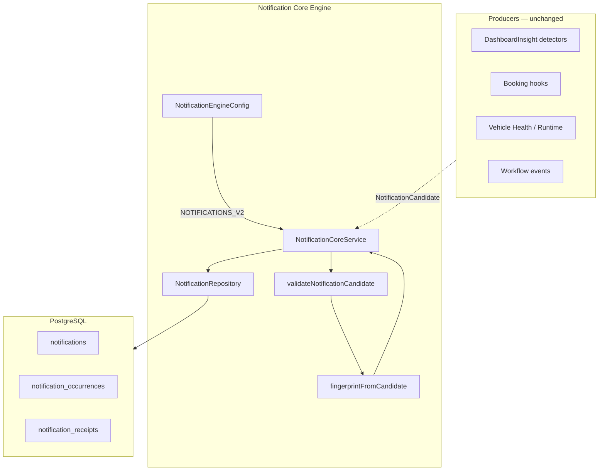

# Notification Engine — Core Service (V4.9.352)

> **Status:** Kanonische Core Engine (Prompt 7) — parallel unter `NOTIFICATIONS_V2`, kein Dashboard-API-Cutover.

## Architektur



## Service-Struktur

| Komponente | Rolle |
|------------|-------|
| `NotificationCoreService` | Use Cases: ingest, lifecycle, receipts, queries |
| `NotificationRepository` | Prisma-Zugriff, Transaktionen |
| `NotificationEngineConfig` | Feature Flag `NOTIFICATIONS_V2` |
| `notification-candidate.validator` | Pflichtfelder + Fingerprint-Buildability |
| `notification-fingerprint.factory` | Kanonische Identität |
| `notification-reopen.policy` | RESOLVED → REOPEN / CREATE / IGNORE |
| `notification-status.transitions` | Ungültige Lifecycle-Übergänge blockieren |
| `notification-severity.policy` | Eskalation INFO→WARNING→CRITICAL, Recovery |
| `notification-prisma.util` | P2002-Retry |

Detectoren bleiben in ihren Modulen und liefern nur `NotificationCandidate`.

## Core-API (`NotificationCoreService`)

| Methode | Beschreibung |
|---------|--------------|
| `ingestCandidate(candidate, options?)` | Feature-Flag-gated Einstieg |
| `createOrUpdateNotification(candidate)` | Materialisierung / Dedup |
| `appendOccurrence(notificationId, candidate)` | Explizite Occurrence |
| `resolveNotificationByFingerprint({ org, fingerprint })` | Producer-Resolution |
| `resolveNotification(id, orgId, at?, { manual? })` | Explizite Resolution |
| `reopenNotification(id, orgId, candidate)` | Manuelles Reopen mit Occurrence |
| `acknowledgeNotification` | Org-weit ACKNOWLEDGED |
| `snoozeNotification` / `unsnoozeNotification` | Org-weit SNOOZED |
| `archiveNotification` | Administrativ ARCHIVED |
| `markRead` / `markUnread` | Pro User (Receipt) |
| `getNotification` / `listNotifications` | Lesen |
| `getCounts(orgId, userId?)` | Aktive + Severity + optional unread |
| `expireOrganizationNotifications` | Expiry-Sweep |

## Transaktionsverhalten

### `createOrUpdateNotification`

1. Fingerprint validieren / berechnen
2. `prisma.$transaction`:
   - aktive Notification suchen (`findAnyActiveByFingerprint`)
   - **aktiv** → Occurrence + Update (severity escalate, template merge)
   - **RESOLVED** → `evaluateReopenDecision` → REOPEN | CREATE (neue Generation) | IGNORE
   - **ARCHIVED** → IGNORE
   - **keine Zeile** → CREATE + erste Occurrence
3. Bei Recovery (`SUCCESS`) → aktive Zeile RESOLVED, keine neue Warnung

Alle Schreibpfade in einer Transaktion; Occurrence + Counter atomar.

## Concurrency

| Mechanismus | Zweck |
|-------------|--------|
| Partial UNIQUE `(org, fingerprint, generation)` WHERE active | Max. eine aktive Zeile |
| `withUniqueConflictRetry` (max 4) | Parallele CREATE → Retry → UPDATE |
| `version` + optimistic update | Lifecycle-Änderungen |

Zwei parallele identische Candidates → eine aktive Notification, `occurrenceCount ≥ 2`.

## Lifecycle

- Org-weit: `OPEN` → `ACKNOWLEDGED` / `SNOOZED` → `RESOLVED` / `ARCHIVED`
- Reopen nach Domain-Policy (Cooldown, maxReopens → neue Generation)
- Read: `NotificationReceipt.readAt` pro User — unabhängig vom Lifecycle

## Severity

- Eskalation nur nach oben (`notification-severity.policy`)
- `SUCCESS` = Recovery → `RESOLVED`, kein neuer aktiver WARN/CRITICAL

## Logging

Strukturierte Nest-Logger-Objekte:

```json
{
  "msg": "notification.updated",
  "organizationId": "…",
  "notificationId": "…",
  "fingerprint": "…",
  "eventType": "…",
  "sourceType": "…",
  "sourceRef": "…",
  "operation": "created|updated|resolved|reopened|ignored|skipped_flag_off",
  "occurrenceCount": 3,
  "runId": "optional"
}
```

Keine `templateParams`-Vollpayloads oder Dokumentinhalte.

## Feature Flag

```bash
NOTIFICATIONS_V2=false   # default — Engine no-op für Writes
NOTIFICATIONS_V2=true    # Shadow mode — schreibt V2-Tabellen, Dashboard unverändert
```

`ingestCandidate` gibt `{ enabled: false, operation: 'skipped_flag_off' }` zurück wenn Flag aus.

## Beispielabläufe

### 1. Erster Candidate (STATE, WARNING)

```
ingestCandidate → CREATE notification (gen=1, occurrenceCount=1) + occurrence
```

### 2. Gleicher Fingerprint, höhere Severity

```
ingestCandidate → UPDATE same id, severity CRITICAL, occurrenceCount++, lastSeenAt
```

### 3. Recovery (SUCCESS)

```
ingestCandidate → RESOLVED, resolvedAt set, occurrence logged, no active row
```

### 4. Reopen nach Cooldown

```
ingestCandidate → REOPEN same id, status OPEN, reopenCount++
```

### 5. User liest, löst nicht

```
markRead(userId) → receipt.readAt set, notification.status unchanged
acknowledgeNotification → notification.status = ACKNOWLEDGED (org-weit)
```

## Noch nicht migrierte Producer

| Producer | Status |
|----------|--------|
| `DashboardInsight` publish pipeline | Legacy — kein automatischer `ingestCandidate` |
| `normalizeOperationalIssues` / ActionQueue | Frontend-only |
| Booking / Handover hooks | Nicht verdrahtet |
| Vehicle Health detectors | Nicht verdrahtet |
| Workflow notifications | Nicht verdrahtet |
| Inbox / Dashboard API | Folgt in späterem Prompt |

Bridge bereit: `notificationCandidateFromInsight()` — Aufruf aus Materialize-Worker folgt separat.

## Verwandte Docs

- `docs/notification-engine-domain-contract.md`
- `docs/notification-engine-migration-plan.md`
- `docs/notification-engine-source-ownership.md`
