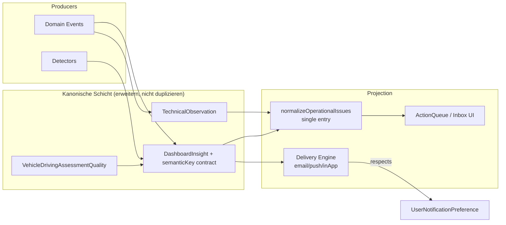

# Notification Engine — Ist-Analyse (Stand: 2026-07-10)

**Repository:** `SYNQDRIVE-alpha` (Branch `main`, Analyse-Datum 2026-07-10)  
**Scope:** Read-only Ist-Analyse — keine produktiven Codeänderungen in diesem Prompt.  
**Fokus:** Dashboard Notification Box (`ActionQueue`), parallele Meldungspfade, WOB L 7503 / LTE_R1 Fahrbewertung.

---

## 1. Executive Summary

SynqDrive hat **keine dedizierte Notification Engine** im Sinne eines zentralen Inbox-/Delivery-Systems mit Read/Ack/Resolve-Lifecycle pro Benutzer. Stattdessen existieren **mehrere parallel verdrahtete Subsysteme**, die im Dashboard als „Meldungen“ erscheinen:

| Subsystem | Rolle heute | Persistenz | Dashboard-Bezug |
|-----------|-------------|------------|-----------------|
| **Business Insights** | Nächstliegende „Alert Engine“ — Detektoren → `DashboardInsight` | PostgreSQL (`dashboard_insights`) | ActionQueue (normalisiert + Legacy), BusinessInsightsBox |
| **Operational Issue Normalization** | Frontend-Kanonisierung + `semanticKey`-Dedupe | In-Memory (pro Render) | Primärer Pfad in `buildUnifiedActionQueue` |
| **Rental Health V1** | Fahrzeug-Gesundheit inkl. Technical Observations (`complaints`) | Live-API (`/rental-health`) | `useVehicleHealthAlerts` → Runtime + ActionQueue |
| **Vehicle Runtime State** | KPI-Slices, Fleet Board, Reason-Pills | In-Memory (pro Render) | Parallele Reasons aus Health + Insights |
| **Technical Observations** | Kanonische fachliche Beobachtungen (`VehicleComplaint`) | PostgreSQL | Rental-Health `complaints`-Modul, Fahrzeug-Health-UI |
| **Driving Assessment Device Quality** | LTE_R1 Event-Qualität → Quality-State + Observation + Insight | PostgreSQL + Trip-Enrichment | **Dreifach** im Dashboard (s. WOB L 7503) |
| **OrgTask + Insight→Task Bridge** | Eskalations-/Aufgaben-Layer | PostgreSQL (`org_tasks`) | Nicht direkt in ActionQueue, aber paralleler Alert-Pfad |
| **UserNotificationPreference** | Kategorie-Präferenzen (inApp/email/push/sms) | PostgreSQL | **Nicht** an Inbox/Delivery angebunden |
| **Synthetische `dashboardNotifications`** | Frontend-only Feed aus Insights | Keine | Expliziter Legacy-Pfad in ActionQueue |

**Kernbefund:** Die Dashboard Notification Box (`ActionQueue`) ist ein **kompositorischer ViewModel-Stack**, der aus mindestens **6 Eingabequellen** Items baut, teils mit **unterschiedlichen Dedupe-Keys**, teils **ohne `semanticKey`**, und anschließend gruppiert/dedupliziert. Das erklärt die beobachteten Duplikate (gleiches Fahrzeug, unterschiedliche Texte/Severities/Zeiten).

**Empfehlung:** Die bestehende **Business-Insights + Operational-Issue-Schicht erweitern**, statt eine zweite parallele Notification-Architektur aufzubauen. Langfristig: ein kanonisches **`OperationalNotification`**-Modell (oder Insight-Typ-Erweiterung) mit stabiler `semanticKey`, fachlicher Event-Zeit, i18n-Keys und User-Lifecycle — die ActionQueue bleibt reine **Projektion**.

---

## 2. Architekturdiagramm (Mermaid)

```mermaid
flowchart TB
  subgraph Events["Fachliche Ereignisse / Zustände"]
    E1[Trip LTE_R1 Enrichment]
    E2[Rental Health Module States]
    E3[Bookings Pickup/Return]
    E4[Invoices / Finance]
    E5[Telemetry Freshness]
    E6[Technical Observations]
  end

  subgraph Backend["Backend Producer"]
    TB[TripBehaviorEnrichmentService]
    DAQ[DrivingAssessmentDeviceQualityService]
    TO[TechnicalObservationsService]
    RH[RentalHealthService]
    DET[11 Insight Detectors]
    BIS[BusinessInsightsService]
    SCH[@Cron 2,32 * * * *]
    TRG[BusinessInsightsTriggerService<br/>Redis debounce 2min]
    REPO[DashboardInsightsRepository]
  end

  subgraph Persist["PostgreSQL"]
    VDAQ[(VehicleDrivingAssessmentQuality)]
    VC[(VehicleComplaint)]
    DI[(DashboardInsight)]
    OT[(OrgTask)]
    UNP[(UserNotificationPreference)]
  end

  subgraph Frontend["Frontend Composition"]
    CTX[DashboardInsightsContext]
    FLEET[FleetContext healthMap]
    VM[useDashboardViewModel]
    NORM[normalizeOperationalIssues]
    BUILD[buildUnifiedActionQueue]
    GRP[prepareActionQueueRenderModel<br/>dedupe → group → filter]
    AQ[ActionQueue.tsx]
    BIB[BusinessInsightsBox tabs]
  end

  E1 --> TB --> DAQ
  DAQ --> VDAQ
  DAQ --> TO --> VC
  DAQ --> TRG --> BIS
  SCH --> BIS
  BIS --> DET --> REPO --> DI
  E2 --> RH
  RH --> VC
  E6 --> VC

  DI --> CTX
  FLEET --> VM
  CTX --> VM
  VM -->|dashboardNotifications synth| BUILD
  VM --> NORM --> BUILD --> GRP --> AQ
  CTX --> BIB
  FLEET --> BIB

  UNP -.->|kein Consumer| X[❌ Kein Delivery Engine]
  OT -.->|InsightTaskBridge| DI
```

---

## 3. Source-Ownership-Matrix

| Ereignistyp | Fachliche Quelle | Detector / Producer | Backend-Service | Persistiertes Modell | API-Endpunkt | Frontend-Quelle | Queue-/Adapter-Pfad | Aktueller Dedupe-Key | Entity-Verknüpfung | Aktueller CTA | Lifecycle | Mögliches Duplikat mit | Zukünftiger kanonischer Owner |
|-------------|------------------|---------------------|-----------------|-------------------|--------------|-----------------|---------------------|----------------------|-------------------|---------------|-----------|------------------------|------------------------------|
| LTE_R1 Fahrbewertung eingeschränkt | Native Event-Spam / Gerätequalität | `DrivingAssessmentDeviceQualityDetector` | `DrivingAssessmentDeviceQualityService` → `BusinessInsightsService` | `VehicleDrivingAssessmentQuality`, `DashboardInsight`, `VehicleComplaint` | `GET .../dashboard-insights`, `GET .../rental-health`, Trips API | `insights` + synthetisch `dashboardNotifications` | normalize → `issue-*` **und** legacy `insight-*` **und** `notif-*` | Backend: `driving_assessment_device_quality:{vehicleId}`; Frontend normalized: `vehicle:{id}:health:driving_assessment_device_quality`; Legacy: `insight-{uuid}`; Notif: `notif-{title}-{time}` | `vehicleId` | `open-vehicle` | Insight: `isActive` swap per Run; Observation: ACTIVE→resolve; Quality: DEGRADED/RECOVERING/NORMAL | Technical Observation, Legacy Insight, Notification-Thread | `DrivingAssessmentDeviceQuality` Insight + Rental-Health linkage |
| Fahrbewertung normalisiert sich (RECOVERING) | Quality-State RECOVERING | gleicher Detector | gleicher Service | gleiche Modelle | gleiche APIs | gleiche Pfade | Recovery als `severity: INFO` backend, aber Frontend `type: alert` + `attention`/`warning` | wie oben | `vehicleId` | `open-vehicle` | RECOVERING → Observation bleibt bis NORMAL | Degraded-Insight, Complaints-Modul | Recovery als INFO-Hinweis, nicht WARNING |
| Aktive technische Beobachtung | `VehicleComplaint` (system_import) | `DrivingAssessmentDeviceQualityService.syncObservation` | `TechnicalObservationsService`, `RentalHealthService.evaluateComplaints` | `VehicleComplaint` | `GET .../technical-observations`, `GET .../rental-health` | `healthMap` → `useVehicleHealthAlerts` → Runtime **oder** HealthAlert-Module | Runtime: `rental-health:complaints` → `vehicle:{id}:damage:suspicion`; Non-runtime HealthAlert: `vehicle:{id}:health:review_required` | **Zwei Keys je Modus!** | `vehicleId` | `open-vehicle` (über Health-Group) | Observation: ACTIVE/resolve; kein User-read-state | Driving-Assessment-Insight, generischer Health-Hinweis | Technical Observation → ein `complaints`-Semantic-Key |
| Generischer Fahrzeug-Gesundheitshinweis | `healthRiskVehicleIds` Fallback | `vehicleRuntimeStateBuilder.addHealthReasons` | Rental Health (indirekt) | Keine dedizierte Notification | Rental Health | `dashboard-health-risk` Runtime Reason | `vehicle:{id}:health:review_required` | `vehicle:{id}:health:review_required` | `vehicleId` | `open-vehicle` | Kein persistierter User-State | Konkrete Modul-Issues (suppressed wenn concrete health existiert) | Suppression-Regel beibehalten + erweitern |
| Service überfällig | HM/OEM / Service-Daten | `ServiceOverdueDetector` (via Compliance) | Business Insights | `DashboardInsight`, ggf. `OrgTask` | Dashboard Insights | Insight + Runtime (wenn im RUNTIME_SET) | Normalized: `vehicle:{id}:service_compliance:overdue` | `service_overdue:{vehicleId}` (backend dedupeKey) | `vehicleId` | `open-vehicle` | Insight swap; Task dedupKey | Service Window, Health-Module service_compliance | Insight + Task Bridge |
| Batterie kritisch | Rental Health battery module | `BatteryCriticalDetector` | Business Insights + Rental Health | `DashboardInsight` + Health | Beide APIs | HealthAlert module + Insight (legacy wenn nicht runtime) | `vehicle:{id}:health:battery_critical` | `battery_critical:{vehicleId}` | `vehicleId` | `open-vehicle` | Insight `isActive` | Runtime battery reason, Health group child | Rental Health module als SSOT |
| Reifen kritisch | Tire wear signals | `TireCriticalDetector` | Business Insights + Rental Health | wie oben | wie oben | wie oben | `vehicle:{id}:health:tire_*` | `tire_critical:{vehicleId}` | `vehicleId` | `open-vehicle` | wie oben | Health runtime reason | Rental Health |
| Pickup überfällig | Booking state | `PickupOverdueDetector` | Bookings + Insights | `DashboardInsight`, Booking | Bookings today API + Insights | Pickup tiles + normalized insight | `booking:{id}:booking:pickup_overdue` | `pickup_overdue:{bookingId}` | `bookingId` | `start-handover-pickup` | Booking-Status | Pickup tile row | Booking operational issue |
| Return überfällig / Prüfung | Booking state | `ReturnNeedsInspectionDetector` | Bookings + Insights | wie oben | wie oben | Return tiles + insight | `booking:{id}:return:overdue` etc. | detector-specific | `bookingId` | `start-handover-return` / `open-booking` | Booking-Status | Return tile | Booking issue |
| Telemetry soft/offline | Last signal timestamp | Derived + Runtime | Telemetry freshness builders | Keine Notification-DB | Fleet telemetry | `deriveOperationalInsights`, Runtime telemetry | `vehicle:{id}:telemetry:soft_offline` | Runtime-/derived-id | `vehicleId` | `open-vehicle` | Keiner | Predictive SOFT_OFFLINE | Runtime telemetry issue |
| Station shortage | Inventory/bookings | `StationShortageDetector` | Business Insights | `DashboardInsight` | Dashboard Insights | Legacy insight path (nicht in NORMALIZED set für alle) | `station:{id}:...` | `station_shortage:...` | `stationId` | `open-stations` | Insight swap | — | Insight |
| Low utilization (finance) | Revenue metrics | `LowUtilizationDetector` | Business Insights | `DashboardInsight` | Dashboard Insights | BusinessInsightsBox (filtered aus ActionQueue) | Finance tab only | grouped dedupeKey | org-level | `open-rental` | Insight swap | — | Business Insights (nicht ActionQueue) |
| Predictive ops (SERVICE_WINDOW etc.) | Client-side derivation | `derivePredictiveOperationsInsights` | Kein Backend-Detector | Keine | — | `useDashboardViewModel` | Normalized wenn im PREDICTIVE set | insight-type keys | `vehicleId`/`bookingId` | varies | Keiner | Runtime SERVICE_WINDOW | Predictive layer |
| OrgTask aus Insight | Insight materialization | `InsightTaskBridgeService` | TasksService | `OrgTask` (`dedupKey`, `alertId`) | Tasks API | **Nicht** in ActionQueue standard | Tasks-View | `dedupKey` auf Task | `vehicleId`, `alertId` | Task UI | OPEN/DONE | Insight duplicate semantics | Tasks als Action-Layer, nicht Notification |
| User Notification Preferences | User settings | Account PATCH | `AccountService` | `UserNotificationPreference` | `PATCH .../account/me/notifications` | Account settings only | **Kein Pfad zur ActionQueue** | per category | user+org | — | Präferenz-Flags | — | Zukünftige Delivery Engine |

---

## 4. Datenflussdiagramm — Dashboard Notification Box

```mermaid
sequenceDiagram
  participant API as GET dashboard-insights
  participant Health as GET rental-health batch
  participant VM as useDashboardViewModel
  participant Synth as dashboardNotifications useMemo
  participant Norm as normalizeOperationalIssues
  participant Build as buildUnifiedActionQueue
  participant Dedupe as dedupeActionQueueItems
  participant Group as groupActionQueueEntries
  participant AQ as ActionQueue.tsx

  API->>VM: insights[]
  Health->>VM: healthMap → vehicleHealthAlerts
  VM->>Synth: filter DRIVING_ASSESSMENT_DEVICE_QUALITY
  Note over Synth: Hardcoded DE titles,<br/>time = insightsResponse.generatedAt

  VM->>Build: insights, alerts, pickups, returns,<br/>dashboardNotifications, derived, predictive, runtime

  Build->>Norm: runtime states, insights, health alerts, predictive
  Norm-->>Build: OperationalIssue[] (semanticKey merge)

  loop Legacy fallbacks
    Build->>Build: push insight-* (non-NORMALIZED types)
    Build->>Build: push pickup/return rows
    Build->>Build: push notif-{title}-{time}
    Build->>Build: push derived-*, predictive-*
  end

  Build->>Dedupe: ActionQueueItem[] (by semanticKey ?? id)
  Note over Dedupe: Collides only when keys match;<br/>insight-* and notif-* bypass semantic dedupe

  Dedupe->>Group: vehicle-health groups by vehicleId
  Group->>AQ: render entries + CTAs
```

**Einstiegspunkte in `useDashboardViewModel` (ca. Z.816–848):**

```typescript
buildUnifiedActionQueue({
  insights,
  vehicleHealthAlerts,
  pickupItems,
  returnItems,
  notifications: dashboardNotifications,  // synthetisch
  derivedInsights,
  predictiveInsights,
  dashboardRuntime,
  ...
})
```

---

## 5. Konkrete Duplikatursachen

### D1 — `DRIVING_ASSESSMENT_DEVICE_QUALITY` fehlt in Legacy-Suppression-Sets

In `actionQueueBuilder.ts`:

- `NORMALIZED_INSIGHT_TYPES` enthält **nicht** `DRIVING_ASSESSMENT_DEVICE_QUALITY`.
- `RUNTIME_INSIGHT_TYPES` / `filterInsightsForRuntimeAttention` enthält **nicht** diesen Typ.

**Folge:** Derselbe Insight wird **zuerst** über `normalizeOperationalIssues` → `issue-{semanticKey}` gemappt **und danach** erneut über die Legacy-Schleife als `insight-{insight.id}` eingefügt (ohne `semanticKey`).

### D2 — Synthetischer `dashboardNotifications`-Pfad (Phase 4, V4.9.307)

`useDashboardViewModel.ts` (Z.567–587) erzeugt aus **denselben** Insights einen zweiten Feed:

- ID: implizit über `notif-${title}-${time}` in `actionQueueBuilder.ts` (Z.555)
- **Kein `semanticKey`**
- `groupKey: notification-thread:${title}` — gruppiert nur nach Titel, nicht nach Fahrzeug
- Filter: `type === 'alert'` wird **immer** angezeigt, auch bei `unread: false` (Recovery)

### D3 — Technical Observation ↔ Driving Assessment ↔ Complaints-Modul

`DrivingAssessmentDeviceQualityService.syncObservation` erzeugt parallel:

1. `VehicleComplaint` (Technical Observation)
2. `VehicleDrivingAssessmentQuality` State
3. Triggert Insight-Rerun → `DashboardInsight`

Rental-Health `evaluateComplaints` liefert **„Aktive technische Beobachtung“** als `complaints`-Modul → eigener ActionQueue-Eintrag mit **anderem semanticKey** als Driving-Assessment-Insight.

### D4 — Runtime vs. Non-Runtime unterschiedliche Keys für Complaints

| Modus | Pfad | semanticKey (typisch) |
|-------|------|------------------------|
| `usesRuntimeAttentionSource` = true | `vehicleHealthAlerts` **unterdrückt**; Reasons aus `rental-health:complaints` (category `damage`) | `vehicle:{id}:damage:suspicion` |
| Runtime = false | `vehicleHealthAlertToIssueDrafts` → `complaints` default branch | `vehicle:{id}:health:review_required` |

Gleiche fachliche Beobachtung, **zwei Taxonomien**.

### D5 — Vehicle-Health-Grouping zeigt mehrere Kinder pro Fahrzeug

`actionQueueGrouping.ts` gruppiert nach `groupKey: vehicle-health:{vehicleId}`. Driving Assessment + Complaints + Battery etc. werden als **separate atomare Kinder** gezählt — gewollt für Module, ungewollt wenn semantisch identisch.

### D6 — Generischer „Health prüfen“ trotz konkreter Module

`healthRiskVehicleIds` = alle `vehicleHealthAlerts` → Runtime-Fallback `dashboard-health-risk` wenn keine konkreten Module-Reasons. Suppression in `suppressGenericHealthFallbacks` greift nur bei `health_review_required` **und** vorhandenen concrete health issues — nicht bei cross-domain Duplikaten (D3).

### D7 — Backend Insight-Publish ersetzt komplett (`isActive: false` für alle, dann neu)

`publishInsights` deaktiviert alle aktiven Insights und erstellt neue Rows. Frontend kann während Polling kurz **alte + neue** IDs sehen (Race, s. Abschnitt 8).

---

## 6. Konkrete Inkonsistenzursachen

| Bereich | Symptom | Ursache im Code |
|---------|---------|-------------------|
| **Severity** | Recovery als Warnung | `dashboardNotifications`: `type: 'alert'` → severity `warning`; Detector: `RECOVERING` → `INFO`; Normalizer: `attention` |
| **Zeit** | Inkonsistente Zeitlabels | `mapOperationalIssueToActionQueueItem`: `timeSortMs: Date.now()`; Notifications: `generatedAt` der **gesamten Insight-Response**; Legacy insights: `createdAt` |
| **i18n** | DE/EN gemischt | Detector-Titel hardcoded DE; `ActionQueue` CTAs lokalisiert; `RENTAL_HEALTH_MODULE_LABELS` EN; Complaints-Reasons DE im Backend |
| **Titel** | Gleicher Sachverhalt, anderer Text | Observation title: „Fahrbewertung eingeschränkt — Telematik-Gerät“; Insight: „… — {Kennzeichen}“; Complaints: „Aktive technische Beobachtung vom …“ |
| **Badges/Typo** | Uneinheitliche Hierarchie | `AttentionItemRow` severity labels vs. `StatusChip` tones vs. group subtitles — keine zentrale Copy-Quelle für ActionQueue |
| **IDs instabil** | Re-Render erzeugt „neue“ Meldungen | `notif-${title}-${time}` ändert sich mit `generatedAt`; `insight-{uuid}` wechselt bei jedem Publish-Run |
| **Entity** | CTA korrekt, Row-Click nicht | `ActionQueue` row click → `openDrilldown({ type: 'action-item' })`; `DashboardView` ignoriert `action-item` — Drawer öffnet nicht |

---

## 7. Race-Condition-Risiken

| Risiko | Mechanismus | Auswirkung |
|--------|-------------|------------|
| **R1 Insight publish swap** | `publishInsights` transaction: deactivate all → create new | Frontend-Poll (5 min + manuell) kann transient doppelte oder leere Zustände zeigen |
| **R2 Debounced insight rerun** | Redis `bi:debounce:*` 2 min + in-memory `pendingTimers` | Trip-Enrichment triggert Rerun; Scheduler @:02/:32 kann parallel laufen → `running` guard im Scheduler, **nicht** im Trigger |
| **R3 Quality evaluate + observation sync** | `evaluateAfterLteR1Trip` async, `void requestInsightsRerun` | Health/Insight/Observation können kurz divergieren |
| **R4 Org baseline cache** | In-memory 1h TTL in `DrivingAssessmentDeviceQualityService` | Multi-Instance: unterschiedliche Baselines möglich (⚠️ Unsicherheit: nur ein Backend-Prozess auf VPS angenommen) |
| **R5 Frontend dedupe timing** | `dedupeActionQueueItems` vor Grouping, keine atomare Backend-ID | Zwei Pfade mit verschiedenen IDs erscheinen bis Dedupe — Dedupe schlägt fehl ohne semanticKey |

---

## 8. Datenmodellprobleme

1. **Kein User-Notification-Inbox-Modell** — `UserNotificationPreference` steuert Kategorien, aber es gibt keine `UserNotification`/`NotificationDelivery`-Tabelle.
2. **Kein Read/Ack/Resolved auf Insight-Ebene** — `DashboardInsight.isActive` ist systemweit, nicht pro User.
3. **`DashboardInsight` Publish = Replace** — historische Insights für Audit vorhanden, aber kein stabiler „Notification-ID“-Bezug fürs Frontend über Runs hinweg.
4. **Technical Observation ≠ Dashboard Notification** — `VehicleComplaint` hat eigenen Lifecycle (resolve/dismiss), nicht mit Insight synchronisiert außer über Quality-Service.
5. **`VehicleDrivingAssessmentQuality.activeObservationId`** — Verknüpfung vorhanden, aber Frontend nutzt sie **nicht** für Dedupe.
6. **OrgTask.dedupKey** — parallel für Tasks, nicht für ActionQueue.
7. **Fehlende `semanticKey` in DB** — Dedupe nur im Detector-`dedupeKey` (backend) und frontend generiert — keine gemeinsame Spalte.

---

## 9. API-Probleme

| Endpoint | Problem |
|----------|---------|
| `GET /organizations/:orgId/dashboard-insights` | Liefert flache Insight-Liste; kein `semanticKey` im DTO; `createdAt` ≠ fachliches Ereignisdatum (`degradedSince` nur in `metrics`) |
| `GET .../dashboard-insights/summary` | `generatedAt` wird für **alle** synthetischen Notification-Zeiten missbraucht |
| `GET .../rental-health` | Batch-Read; Complaints-Reason ist display-ready DE-String — keine i18n-Keys |
| `GET .../technical-observations` | Nicht direkt in ActionQueue; nur indirekt über Rental Health |
| `PATCH .../account/me/notifications` | Schreibt Präferenzen; **kein** Reader in Dashboard-Pipeline |
| Kein `POST .../notifications/:id/ack` | Lifecycle-API fehlt vollständig |

---

## 10. Frontend-Probleme

1. **Multi-Path Composition** in `buildUnifiedActionQueue` — normalisiert + 5 Legacy-Pfade.
2. **`DRIVING_ASSESSMENT_DEVICE_QUALITY` nicht in Suppression-Listen** — Hauptbug für Insight-Doppelung.
3. **`dashboardNotifications` synthetisch** — sollte entfernt oder in Normalizer integriert werden.
4. **`mapOperationalIssueToActionQueueItem` setzt `timeSortMs: now`** — sortiert nach Render-Zeit, nicht Ereigniszeit.
5. **Legacy `insight-*` Items ohne `semanticKey`** — umgehen semantisches Dedupe.
6. **`action-item` Drilldown tot** — `DashboardDrilldownDrawer` verarbeitet nur Slice/Metric-IDs.
7. **Parallele UI: `BusinessInsightsBox`** — eigene Tabs (Business / Vehicle Alerts / Notifications) zeigen dieselben Daten mit anderer Gruppierung.
8. **`usesRuntimeAttentionSource`** schaltet Health-Alert-Input ab, nicht aber Insight-Legacy oder Notifications.

---

## 11. i18n- und Copy-Probleme

| Quelle | Beispiel | Problem |
|--------|----------|---------|
| `driving-assessment-device-quality.detector.ts` | „Fahrbewertung eingeschränkt — {plate}“ | Hardcoded DE im Backend |
| `useDashboardViewModel` dashboardNotifications | Fallback-Titel DE | Ignoriert `locale` |
| `rental-health.service.ts` evaluateComplaints | „Aktive technische Beobachtung…“ | DE only |
| `deriveVehicleHealthAlertsFromRentalHealth` | `RENTAL_HEALTH_MODULE_LABELS` EN | Gemischt mit DE-Reasons |
| `actionQueueBuilder` pickup/return | DE/EN über `locale` | Inkonsistent zum Rest |
| `AttentionItemRow` | DE/EN severity labels | OK, aber nicht mit Backend-Copy abgestimmt |

**Es gibt keine `notification.*` i18n-Keys für operative Dashboard-Meldungen** — nur generische Dashboard-Keys.

---

## 12. CTA- und Routing-Probleme

| CTA | Auflösung | Problem |
|-----|-----------|---------|
| `open-vehicle` | `onOpenVehicleById(vehicleId)` | OK wenn `vehicleId` gesetzt |
| `open-booking` | `bookingId` oder fallback `bookings` view | OK |
| `start-handover-pickup/return` | `vm.handleConfirmPickup/Return` | Nur auf Leaf-Rows, nicht Group-Children-Navigation |
| `open-rental` | Default fallback | **Notifications** nutzen `open-rental` statt `open-vehicle` (Z.565) |
| Row click `action-item` | `openDrilldown` → **kein Handler** | Drawer bleibt zu; UX-Bruch |
| Insight `actionType: OPEN_VEHICLE` | Wird zu `open-vehicle` in normalized path | Legacy insight path nutzt `insightCta` — OK |

**Notification-Thread-Items** (`dashboardNotifications`) haben **kein `vehicleId`** im ActionQueueItem → CTA `open-rental` statt Fahrzeug.

---

## 13. Lifecycle-Probleme

| Konzept | Existiert? | Verhalten |
|---------|------------|-----------|
| `unread` | Nur frontend `DashboardNotificationItem` | Keine Persistenz; `unread: !recovering` hardcoded |
| `acknowledged` | ❌ | — |
| `resolved` | Technical Observation + Task | Nicht in ActionQueue reflektiert |
| `snoozed` | ❌ | — |
| `isActive` (Insight) | ✅ | Global pro Org, Publish-Swap |
| Insight expire | ✅ `expiresAt` | Repository expire job |
| User preferences | ✅ `UserNotificationPreference` | Kein Effekt auf ActionQueue |

**Folge:** Operatoren können Meldungen nicht zuverlässig „wegklicken“; Recovery verschwindet erst wenn Backend-State NORMAL ist und nächster Insight-Run durchlief.

---

## 14. Priorisierung (P0 / P1 / P2)

### P0 — Duplikate & falsche Semantik (sofort)

1. `DRIVING_ASSESSMENT_DEVICE_QUALITY` zu `NORMALIZED_INSIGHT_TYPES` **und** Runtime-Filter hinzufügen **oder** Legacy-Pfad explizit skippen.
2. Synthetischen `dashboardNotifications`-Pfad aus ActionQueue entfernen / in Normalizer konsolidieren.
3. Legacy `insight-*` für alle in Normalizer abgedeckten Typen unterbinden.
4. `dashboardNotifications` → `vehicleId` + `semanticKey` + korrekte Severity (RECOVERING = info/attention, nicht alert).
5. Notification-CTA: `open-vehicle` mit `entityIds[0]`.

### P1 — Konsistenz & UX

1. `timeSortMs` aus fachlicher Zeit (`degradedSince`, `createdAt`, observation `updatedAt`).
2. Einheitliche `complaints`-semanticKey (`vehicle:{id}:health:technical_observation` o.ä.).
3. `action-item` Drilldown implementieren oder Row-Click auf `runCta` umstellen.
4. Backend Detector-Copy → i18n-Keys oder locale-aware Formatter.
5. `mapOperationalIssueToActionQueueItem` timeLabel befüllen.

### P2 — Architektur & Delivery

1. `UserNotificationPreference` an Delivery koppeln.
2. Stabiles Notification-ID-Modell (optional `UserNotificationState` pro semanticKey).
3. Email/Push-Pipeline für CRITICAL (heute nicht für Dashboard-Insights verdrahtet).
4. BusinessInsightsBox mit ActionQueue als Single Projection Source.
5. Insight publish: upsert by dedupeKey statt full swap (optional).

---

## 15. Empfohlene zukünftige kanonische Architektur



**Prinzipien:**

1. **Ein kanonischer semantischer Key pro fachlichem Sachverhalt** — backend `dedupeKey` = frontend `semanticKey`.
2. **ActionQueue = reine Projektion** — keine synthetischen Parallel-Feeds.
3. **Technical Observation für Evidence**, **Insight für Attention**, verknüpft über `metrics.observationId` / `activeObservationId`.
4. **Business Insights Engine erweitern** (Detektoren, Formatter, Publish-Upsert) statt neuer Notification-Microservice.
5. **User-Lifecycle** als dünne Schicht über `semanticKey` (read/dismiss/snooze), getrennt von `isActive`.

---

## 16. Konkrete Dateien für nächste Prompts

### P0-Änderungen (Frontend)

| Datei | Änderung |
|-------|----------|
| `frontend/src/rental/components/dashboard/actionQueueBuilder.ts` | `DRIVING_ASSESSMENT_DEVICE_QUALITY` in Suppression-Sets; Notifications mit semanticKey/vehicleId; timeSortMs fix |
| `frontend/src/rental/components/dashboard/useDashboardViewModel.ts` | `dashboardNotifications` entfernen oder auf Normalizer umstellen |
| `frontend/src/rental/lib/operational-issues/normalizeOperationalIssues.ts` | Complaints-semanticKey; cross-link Observation ↔ Driving Assessment |
| `frontend/src/rental/components/dashboard/dashboardAttentionBuilder.ts` | Runtime-Filter für driving assessment |

### P0-Änderungen (Backend)

| Datei | Änderung |
|-------|----------|
| `backend/src/modules/business-insights/detectors/driving-assessment-device-quality.detector.ts` | i18n-Keys; `metrics.observationId`; RECOVERING severity konsistent |
| `backend/src/modules/vehicle-intelligence/trips/driving-assessment-device-quality.service.ts` | Observation-Insight-Kopplung im metrics payload |

### P1-Änderungen

| Datei | Änderung |
|-------|----------|
| `frontend/src/rental/components/dashboard/DashboardDrilldownDrawer.tsx` | `action-item` handler |
| `frontend/src/rental/components/dashboard/ActionQueue.tsx` | Row-click → CTA fallback |
| `frontend/src/rental/components/BusinessInsightsBox.tsx` | Projection aus ActionQueue oder shared selector |
| `backend/src/modules/rental-health/rental-health.service.ts` | Complaints reason keys statt hardcoded DE |
| `backend/src/modules/business-insights/insight-formatter.service.ts` | Locale-aware formatting |

### Tests

| Datei | Änderung |
|-------|----------|
| `frontend/src/rental/components/dashboard/actionQueueGrouping.test.ts` | WOB-L-7503-Szenario: max 1 driving assessment + 1 observation sichtbar |
| `frontend/src/rental/lib/operational-issues/operationalIssues.test.ts` | Complaints/driving assessment dedupe |
| `backend/src/modules/business-insights/business-insights.spec.ts` | Device quality detector contracts |

### Doku / Architektur (nach Implementierung)

| Datei | Änderung |
|-------|----------|
| `docs/operational-issue-normalization.md` | Driving assessment + complaints ownership |
| `architecture/` | Notification projection architecture entry |
| `frontend/src/master/components/ChangesView.tsx` | Changelog |

---

## Anhang A — WOB L 7503: konkrete Codepfade für Duplikate

**Kontext (aus Changes V4.9.305–307):** Fahrzeug WOB L 7503 (Tiguan, LTE_R1, tokenId 192922) — DIMO native event spam → `VehicleDrivingAssessmentQuality` DEGRADED/RECOVERING.

### Pfad 1 — Normalized Operational Issue (ActionQueue)

```
TripBehaviorEnrichmentService
  → DrivingAssessmentDeviceQualityService.evaluateAfterLteR1Trip
  → VehicleDrivingAssessmentQuality (DEGRADED|RECOVERING)
  → BusinessInsightsTriggerService.requestDebouncedRerun
  → DrivingAssessmentDeviceQualityDetector.detect
  → DashboardInsight (dedupeKey: driving_assessment_device_quality:{vehicleId})
  → GET dashboard-insights
  → normalizeOperationalIssues → dashboardInsightToIssueDrafts (case DRIVING_ASSESSMENT_DEVICE_QUALITY)
  → semanticKey: vehicle:{vehicleId}:health:driving_assessment_device_quality
  → mapOperationalIssueToActionQueueItem → id: issue-{semanticKey}
  → groupKey: vehicle-health:{vehicleId}
```

**Sichtbarer Titel:** „Fahrbewertung normalisiert sich — WOB L 7503“ (RECOVERING) oder „…eingeschränkt…“ (DEGRADED).

### Pfad 2 — Legacy Insight Row (Duplikat)

```
Gleicher DashboardInsight
  → buildUnifiedActionQueue legacy loop (Z.395–452)
  → DRIVING_ASSESSMENT_DEVICE_QUALITY NOT IN NORMALIZED_INSIGHT_TYPES → NOT skipped
  → push { id: insight-{insight.uuid}, NO semanticKey, groupKey: vehicle-health:{vehicleId} }
  → dedupeActionQueueItems: key = id (nicht semanticKey) → BLEIBT NEBEN Pfad 1
```

### Pfad 3 — Synthetische Notification (Duplikat)

```
useDashboardViewModel dashboardNotifications (Z.567–587)
  → filter insights type === DRIVING_ASSESSMENT_DEVICE_QUALITY
  → { type: 'alert', title: hardcoded DE fallback, time: insightsResponse.generatedAt }
  → buildUnifiedActionQueue notifications loop (Z.551–570)
  → id: notif-{title}-{time}
  → severity: warning (because type==='alert')
  → cta: open-rental (KEIN vehicleId)
```

### Pfad 4 — „Aktive technische Beobachtung“ (Duplikat)

```
DrivingAssessmentDeviceQualityService.syncObservation
  → TechnicalObservationsService.create (SYSTEM_IMPORT, driving_behavior)
  → VehicleComplaint ACTIVE
  → RentalHealthService.evaluateComplaints
  → complaints module state: warning, reason: „Aktive technische Beobachtung vom …“
  → useVehicleHealthAlerts → vehicleHealthAlerts

Wenn runtime-backed:
  → vehicleRuntimeStateBuilder.addHealthReasons (rental-health:complaints)
  → normalizeOperationalIssues runtimeReasonToIssueDraft (category damage)
  → semanticKey: vehicle:{id}:damage:suspicion

Wenn NICHT runtime-backed:
  → vehicleHealthAlertToIssueDrafts → complaints default
  → semanticKey: vehicle:{id}:health:review_required
```

**Titel:** „Aktive technische Beobachtung vom {Datum}“ — anderer Wortlaut als Fahrbewertung-Insight.

### Pfad 5 — Generischer Gesundheitshinweis (möglich)

```
healthRiskVehicleIds enthält vehicleId (weil vehicleHealthAlerts Eintrag existiert)
  → addHealthReasons Fallback dashboard-health-risk nur wenn keine concrete rental-health reasons
  → Unterdrückung wenn concrete health modules existieren

⚠️ Wenn Complaints-Modul als concrete health zählt, wird generischer Fallback unterdrückt.
   Duplikat eher über Pfad 4 + 1/2/3, nicht über „Health prüfen“.
```

### Erwartetes Dashboard-Bild für WOB L 7503 (RECOVERING)

| # | Quelle | Typischer Titel | Severity |
|---|--------|-----------------|----------|
| 1 | Normalized issue | Fahrbewertung normalisiert sich — WOB L 7503 | attention |
| 2 | Legacy insight | Gleicher Titel | info (insight) / attention (mapped) |
| 3 | Notification thread | Fahrbewertung normalisiert sich | warning (alert) |
| 4 | Complaints module | Aktive technische Beobachtung vom … | warning |

Alle vier können unter **einer** `vehicle-health:{vehicleId}`-Gruppe als separate Kinder erscheinen → „4 Meldungen“ für einen Sachverhalt.

---

## Anhang B — Durchgeführte Prüfungen

- [x] Vollständige Code-Suche nach: Notification, Alert, Insight, ActionQueue, AttentionItem, dedupeKey, semanticKey, groupKey, unread, acknowledged, resolved, TechnicalObservation, DrivingAssessment, OperationalIssue
- [x] Backend: `business-insights/*`, Scheduler, Trigger, Repository, Detectors (inkl. driving-assessment-device-quality)
- [x] Backend: `driving-assessment-device-quality.service.ts`, Trip-Enrichment-Hook
- [x] Backend: `rental-health.service.ts` (complaints), `technical-observations`
- [x] Backend: Prisma-Modelle `DashboardInsight`, `UserNotificationPreference`, `OrgTask`, `VehicleComplaint`, `VehicleDrivingAssessmentQuality`
- [x] Frontend: `useDashboardViewModel`, `actionQueueBuilder`, `actionQueueGrouping`, `normalizeOperationalIssues`
- [x] Frontend: `DashboardInsightsContext`, `useVehicleHealthAlerts`, `vehicleRuntimeStateBuilder`
- [x] Frontend: `ActionQueue.tsx`, `AttentionItemRow`, `DashboardDrilldownDrawer`, `BusinessInsightsBox`
- [x] BullMQ/Scheduler: Insights via `@Cron` + Redis debounce; **kein** BullMQ für Insights; Trip-Enrichment über BullMQ (separater Queue)
- [x] UserNotificationPreference: nur Account-Modul, kein Dashboard-Consumer
- [x] Changes/Architektur-Referenzen V4.9.305–307 (WOB L 7503)

---

## Anhang C — Explizite Unsicherheiten

| Thema | Unsicherheit |
|-------|--------------|
| Produktionsdaten WOB L 7503 | Analyse basiert auf Code + Changes-Dokumentation; kein Live-DB-Read in diesem Prompt |
| Anzahl gleichzeitiger Backend-Instanzen | Baseline-Cache und `running`-Guards — Verhalten bei horizontaler Skalierung nicht verifiziert |
| Rental-Health Complaints bei RECOVERING | Ob Observation auto-resolved wird erst bei NORMAL — während RECOVERING bleibt Complaint aktiv → Pfad 4 wahrscheinlich |
| `BusinessInsightsBox` vs. `ActionQueue` | Ob Nutzer beide Surfaces gleichzeitig sieht, hängt vom Dashboard-Layout ab; Standard-Layout zeigt nur ActionQueue in Row 2 |
| Email/Push für Insights | Kein verdrahteter Sender gefunden; Resend-Setup existiert (`docs/resend-setup.md`) für andere Flows |
| Master/Operator Surfaces | Analyse fokussiert Rental-Dashboard; Master-Views nicht vollständig geprüft |

---

## Anhang D — Existiert bereits eine „Notification Engine“?

**Teilweise ja** — unter dem Namen **Business Insights**:

- Detektoren, Dedupe (`dedupeKey`), Ranking, Grouping, Persistenz, Scheduler, Event-Trigger, Task-Brücke.
- Frontend **Operational Issue Normalization** ist die zweite Hälfte einer Notification Pipeline (Projektion + Dedupe).

**Was fehlt für eine vollständige Engine:**

- User-scoped Inbox und Lifecycle (read/ack/snooze)
- Delivery (inApp ist de facto ActionQueue; email/push nicht angebunden)
- Single frontend composition path
- Stabile IDs und i18n-contract über Backend/Frontend

**Empfehlung:** Beides zusammenführen unter „Operational Notifications“ — Backend = Insight/Detection, Frontend = ein Normalizer, eine Queue.

---

*Erstellt als reine Ist-Analyse. Keine produktiven Codeänderungen, Migrationen oder Löschungen in diesem Prompt.*
