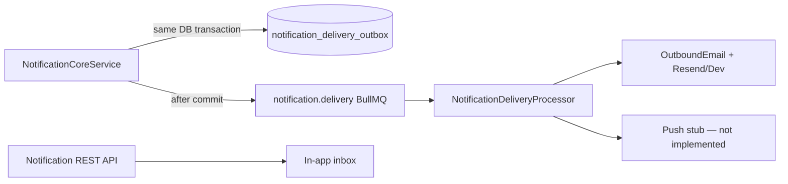

# Notification Engine — Delivery & Observability

Production delivery layer for the SynqDrive Notification Engine (V4.9.358).

## Architecture overview



**Principles**

- Notification persistence and outbox rows are written in the **same PostgreSQL transaction**.
- Channel dispatch runs **asynchronously** via BullMQ worker — never inside the notification transaction.
- **Idempotency** at outbox level prevents duplicate emails on retries or repeated candidates.
- **In-app** delivery remains the existing Notification API (no outbox row for `IN_APP`).

## Transactional outbox

Table: `notification_delivery_outbox`

| Field | Purpose |
|-------|---------|
| `id` | Outbox row UUID |
| `organizationId` | Tenant scope |
| `notificationId` | Source notification |
| `lifecycleGeneration` | Fingerprint generation |
| `eventType` | Denormalized registry code |
| `deliveryTransition` | `OPEN_CREATED`, `SEVERITY_ESCALATED`, `ACKNOWLEDGED`, `RESOLVED`, `REOPENED` |
| `channel` | `EMAIL`, `PUSH` (SMS not implemented) |
| `recipientId` | Target user |
| `audienceKey` | Stable audience scope (`user:{id}`) |
| `payloadRef` | Non-sensitive reference (`titleKey`, `bodyKey`, severity, transition) |
| `status` | `PENDING` → `PROCESSING` → `COMPLETED` / `DEAD_LETTER` / `SUPPRESSED` |
| `attempts` | Delivery try count |
| `availableAt` | Retry / quiet-hours / digest scheduling |
| `idempotencyKey` | Unique — see below |
| `outboundEmailId` | Link to `outbound_emails` audit row |

Poller: `NotificationDeliverySchedulerService` (30s cron) + immediate BullMQ enqueue after transaction commit.

## Delivery policies

Delivery is enqueued only on these transitions:

| Transition | When |
|------------|------|
| `OPEN_CREATED` | New notification materialized |
| `SEVERITY_ESCALATED` | Active notification severity increases |
| `REOPENED` | RESOLVED → OPEN (true reopen) |
| `RESOLVED` | STATE events with outbound channels in registry, or `notifyOnResolved: true` |
| `ACKNOWLEDGED` | Only when registry `notifyOnAcknowledged: true` (default off) |

**Not delivered**

- `lastSeenAt` / `occurrenceCount` updates without severity escalation
- Duplicate ingest of same fingerprint at same severity
- Archived / ignored ingest paths

Registry `deliveryPolicy.channels` controls which outbound channels are eligible (`EMAIL`, `PUSH`). `IN_APP` is always via API reads.

## Channels

### In-app

Always served by `GET /notifications` and related API. Preference filtering via `NotificationPreferenceService.evaluateInAppDelivery`.

### Email

Uses existing **Outbound Email** architecture:

- `OutboundEmailPolicyService.resolveIdentity` — org custom domain or platform noreply fallback
- `EmailProviderRegistry` — Resend (prod) / Dev simulate (local)
- `OutboundEmailSourceType.NOTIFICATION` audit rows
- No send inside notification transaction

### Push

`NotificationPushChannelService` returns `PUSH_NOT_IMPLEMENTED` — outbox rows are marked `SUPPRESSED`. No push provider exists yet.

### SMS

Not implemented.

## Preferences, digest, quiet hours

Uses existing `UserNotificationPreference` per `NotificationCategory`:

| Mode | Behavior |
|------|----------|
| Immediate | Default — `availableAt = now` (subject to quiet hours) |
| Disabled | `email: false` / `push: false` suppresses channel (mandatory notifications bypass mute) |
| Digest | `WEEKLY_REPORTS` category defers email to daily digest hour (`NOTIFICATION_DIGEST_HOUR_LOCAL`, default 08:00 user/org TZ) |
| Quiet hours | `NOTIFICATION_QUIET_HOURS_START` / `END` (default 22:00–07:00 local). **CRITICAL** and mandatory notifications override quiet hours. |

Quiet hours / digest are **not** yet persisted per user in DB — env defaults apply until schema extension.

## Retry & dead letter

| Setting | Env | Default |
|---------|-----|---------|
| Max attempts | `NOTIFICATIONS_DELIVERY_MAX_ATTEMPTS` | 5 |
| Backoff base | `NOTIFICATIONS_DELIVERY_BACKOFF_MS` | 60000 |
| BullMQ attempts | `NOTIFICATIONS_DELIVERY_JOB_ATTEMPTS` | 5 |

- Transient provider errors (429, 5xx) → `PENDING` with exponential `availableAt`
- Permanent errors (invalid recipient, not found) → `DEAD_LETTER`
- Manual retry: re-queue dead-letter rows via ops (authorized org admin API — future)

## Idempotency

```
{idempotencyKey} = {notificationId}:{lifecycleGeneration}:{deliveryTransition}:{channel}:{recipientId}
```

Unique index on `idempotency_key` — duplicate enqueue in same transaction or retry is a no-op.

## Metrics (Prometheus)

Exposed on `GET /api/v1/metrics` via `TripMetricsService`:

- `synqdrive_notifications_created_total{domain}`
- `synqdrive_notifications_updated_total{domain}`
- `synqdrive_notifications_resolved_total{domain}`
- `synqdrive_notifications_reopened_total{domain}`
- `synqdrive_notification_occurrences_total`
- `synqdrive_notification_deduplicated_total`
- `synqdrive_notification_processing_duration_seconds`
- `synqdrive_notification_run_duration_seconds`
- `synqdrive_notification_lock_contention_total`
- `synqdrive_notification_delivery_enqueued_total{channel,transition}`
- `synqdrive_notification_delivery_sent_total{channel}`
- `synqdrive_notification_delivery_failed_total{channel,error_code}`
- `synqdrive_notification_delivery_retry_total{channel}`
- `synqdrive_notification_open_age_seconds{severity}`
- `synqdrive_notification_queue_backlog`
- `synqdrive_notification_duplicate_constraint_violation_total`

No vehicle/user IDs as label values.

## Grafana

Extended `backend/monitoring/grafana/dashboards/synqdrive-ops.json`:

- Created / updated / resolved rates
- Outbox backlog
- Delivery success rate & failures
- Processing duration p95
- Dedupe violations & lock contention

## Alerts

`backend/monitoring/prometheus/alerts.yml` group `synqdrive_notifications`:

- `NotificationDeliveryBacklogHigh`
- `NotificationDeliveryFailureRateHigh`
- `NotificationDeliveryWorkerStalled`
- `NotificationOpenAgeHigh`
- `NotificationDuplicateConstraintViolations`
- `NotificationEvaluationRunsMissing`

## Structured logging

Delivery operations log (no full message bodies):

```json
{
  "msg": "notification.delivery.sent",
  "notificationId": "...",
  "organizationId": "...",
  "eventType": "STATION_SHORTAGE",
  "operation": "sent",
  "deliveryId": "...",
  "channel": "EMAIL",
  "attempts": 1
}
```

## Operations handbook

### Enable delivery

```bash
NOTIFICATIONS_V2=true
NOTIFICATIONS_DELIVERY_ENABLED=true
WORKERS_ENABLED=true
```

Apply migration `20260711140000_notification_delivery_outbox`.

### Verify

1. `GET /api/v1/health` — backend up
2. `GET /api/v1/metrics` — notification counters present
3. Grafana `synqdrive-ops` — notification panels
4. Create test notification (shadow producer) — one outbox row per eligible recipient/channel
5. Check `notification_delivery_outbox` → `COMPLETED` + `outbound_emails` row

### Troubleshooting

| Symptom | Check |
|---------|-------|
| No emails | `NOTIFICATIONS_DELIVERY_ENABLED`, registry `channels` includes EMAIL, user `email` pref, station scope |
| Duplicate emails | `idempotency_key` collisions in logs — should be zero sends |
| Backlog growing | `notification.delivery` queue, worker logs, Resend credentials |
| Push errors | Expected — push suppressed until infrastructure exists |

### Rollback

Set `NOTIFICATIONS_DELIVERY_ENABLED=false` — ingest and in-app API continue; outbox rows remain but are not processed.

## Feature flags

| Variable | Required with V2 | Purpose |
|----------|----------------|---------|
| `NOTIFICATIONS_V2` | yes | Core engine |
| `NOTIFICATIONS_DELIVERY_ENABLED` | yes for outbound | Outbox + worker |
| `WORKERS_ENABLED` | yes | BullMQ processors |
