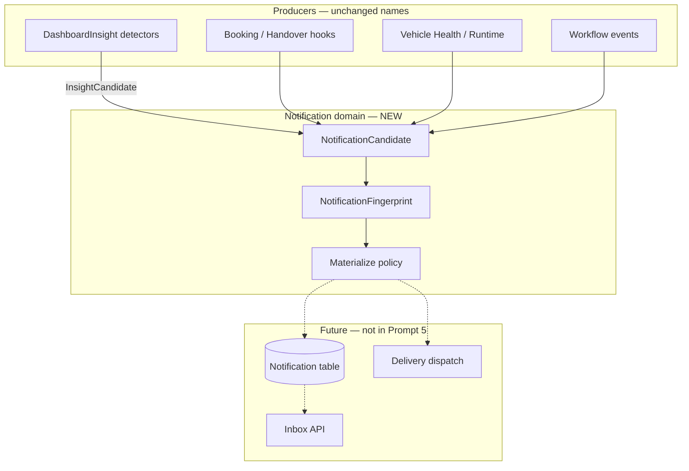
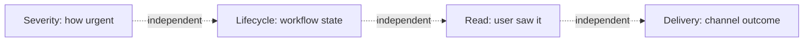
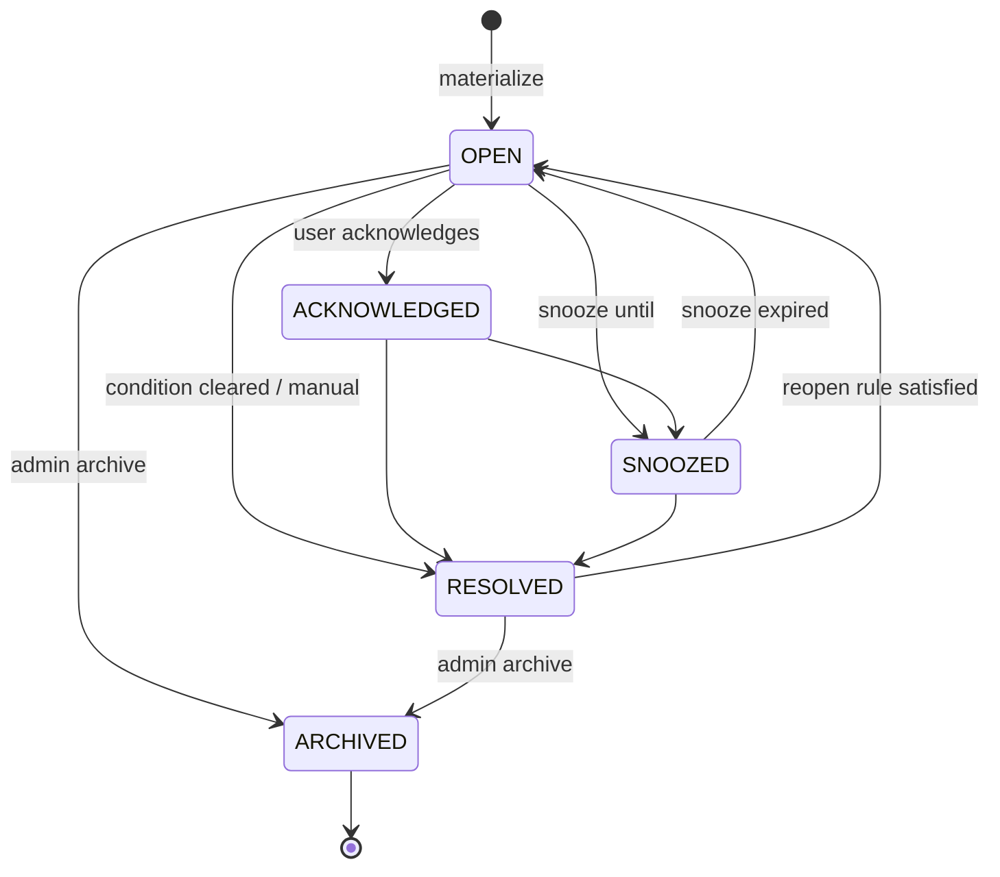

# Notification Engine — Domain Contract (Backend)

> **Status:** Kanonische Domain-Definition (Prompt 5) — **keine** produktive Migration, **kein** Dashboard-Cutover.  
> **Scope:** Backend-Verträge, Enums, Fingerprints, Lifecycle — `backend/src/modules/notifications/`.

## Ziel

`Notification` ist die **sichtbare, persistente und lifecycle-fähige Darstellung** eines fachlichen Zustands oder Ereignisses.

`DashboardInsight` bleibt ein **Producer** (Detector-Output) und wird nicht umbenannt. Materialisierung mappt `InsightCandidate` → `NotificationCandidate` → persistierte `NotificationRecord` (zukünftig).

---

## Architektur-Schichten



---

## Domain-Modell

| Konzept | Beschreibung |
|---------|--------------|
| **NotificationCandidate** | Ephemeres Ingest-Payload von Producern |
| **NotificationFingerprint** | Locale-unabhängige Identität |
| **NotificationRecord** | Persistierter Datensatz (Vertrag nur, noch keine Prisma-Tabelle) |
| **NotificationOccurrenceInput** | Beobachtung / Event gegen bestehenden Fingerprint |
| **generation** | Lifecycle-Generation — neue Zeile bei Identitäts-Bruch oder max Reopens |

Implementierung: `backend/src/modules/notifications/`

---

## Enums

### Severity (`NotificationSeverity`)

| Wert | Bedeutung |
|------|-----------|
| `CRITICAL` | Sofort handeln |
| `WARNING` | Aktiver Handlungsbedarf |
| `INFO` | Hinweis |
| `SUCCESS` | Behoben / normalisiert (kein aktiver Handlungsdruck) |

**Nicht** aus `unread`, UI-Text oder `type: alert` ableiten.

### Lifecycle (`NotificationStatus`)

| Wert | Bedeutung |
|------|-----------|
| `OPEN` | Aktiv sichtbar |
| `ACKNOWLEDGED` | Zur Kenntnis genommen |
| `SNOOZED` | Zeitlich zurückgestellt |
| `RESOLVED` | Fachlich behoben |
| `ARCHIVED` | Administrativ geschlossen |

### Read State (`NotificationReadState`)

`UNREAD` | `READ` — pro Empfänger, **orthogonal** zu Severity und Lifecycle.

### Delivery State (`NotificationDeliveryState`)

`PENDING` | `DELIVERED` | `SUPPRESSED` | `FAILED` — Kanal-Zustellung, **orthogonal** zu Lifecycle.

### Domain (`NotificationDomain`)

`OPERATIONS` | `VEHICLE_HEALTH` | `DRIVING_ANALYSIS` | `BOOKINGS` | `HANDOVERS` | `DOCUMENTS` | `BILLING` | `SECURITY` | `SYSTEM`

---

## Event vs. State

| Art | `NotificationEventKind` | Beispiele | Resolution |
|-----|-------------------------|-----------|------------|
| **Event** | `EVENT` | Buchung erstellt, Fahrzeug zurückgegeben | Schließt sich fachlich ab; Reopen → neue Generation |
| **State** | `STATE` | TÜV überfällig, Telemetriequalität eingeschränkt, technische Beobachtung offen | Bleibt `OPEN` bis Bedingung weg; `autoResolveWhenConditionClears` |

---

## Severity vs. Lifecycle vs. Read vs. Delivery



| Dimension | Beispiel |
|-----------|----------|
| Severity | `WARNING` bei degradierter Fahrbewertung |
| Lifecycle | `RESOLVED` wenn Bedingung weg |
| Read | `UNREAD` trotz `SUCCESS` möglich (selten) |
| Delivery | `SUPPRESSED` wegen User-Preference trotz `CRITICAL` (wenn Policy es erlaubt) |

---

## Lifecycle-Diagramm



Ungültige Übergänge werden in `notification-status.transitions.ts` programmatisch verhindert.

---

## Fingerprint-Regeln

### Struktur

```
organizationId | eventType | entityType | entityId | conditionCode | v{scopeVersion}
```

Beispiel WOB L 7503 Fahrbewertung:

```
org-wob|DRIVING_ASSESSMENT_DEVICE_QUALITY|VEHICLE|veh-wob-l-7503|driving_assessment_device_quality|v1
```

### Verboten im Fingerprint

- Lokalisierte Texte
- Beschreibung / Message
- Relative Zeit (`vor 22 Min.`)
- `Date.now()`
- Zufällige IDs
- **Severity** (darf nur eskalieren, Identität bleibt)
- UI-Routen

### Registry

`notification-fingerprint.registry.ts` — zentrale Liste registrierter `eventType` / `conditionCode` Paare.

### Bridges (kein Umbenennen)

| Legacy | Bridge |
|--------|--------|
| `InsightCandidate.dedupeKey` | `fingerprintPartsFromInsightDedupeKey()` |
| Frontend `semanticKey` | `fingerprintPartsFromSemanticKey()` |

---

## Reopen-Regeln

| Situation | Verhalten |
|-----------|-----------|
| STATE kurz flattert nach RESOLVED | **IGNORE** innerhalb `cooldownMs` (Default 15 min) |
| STATE stabil wieder aktiv nach Cooldown | **REOPEN** gleiche Generation, `reopenCount++` |
| Reopen-Count ≥ `maxReopensBeforeNewGeneration` | **CREATE** neue Generation |
| EVENT erneut | **CREATE** neue Generation |
| ARCHIVED | **IGNORE** alle Occurrences |

Default-Policy: `DEFAULT_STATE_REOPEN_POLICY` in `notification-reopen.policy.ts`.

---

## Resolution & Delivery Policies

### `NotificationResolutionPolicy`

```typescript
{
  eventKind: 'STATE' | 'EVENT',
  autoResolveWhenConditionClears: boolean,
  reopenPolicy?: { cooldownMs, stabilityWindowMs?, maxReopensBeforeNewGeneration? }
}
```

### `NotificationDeliveryPolicy`

```typescript
{
  channels: ['IN_APP', 'EMAIL', 'PUSH', 'SMS'],
  respectUserPreferences: boolean,
  criticalOverridesPreferences: boolean
}
```

Verknüpft mit bestehendem `UserNotificationPreference` / `NotificationCategory` (Account-Modul) — noch nicht verdrahtet.

---

## Candidate-Vertrag

Pflichtfelder siehe `NotificationCandidate` in `notification.types.ts`.

Validierung: `validateNotificationCandidate()` — erzwingt i18n-Keys (`notification.*`), gültige Enums, baubaren Fingerprint.

Producer-Bridge: `notificationCandidateFromInsight()` — mappt `InsightCandidate` ohne Titel-Übernahme als Identität.

---

## Beispiele

### Fachlich gleich (ein Fingerprint)

| Quelle | DedupeKey / SemanticKey | Fingerprint |
|--------|-------------------------|-------------|
| DashboardInsight DEGRADED | `driving_assessment_device_quality:veh-wob-l-7503` | gleich |
| Runtime Reason (gleiche Bedingung) | `vehicle:veh-wob-l-7503:vehicle_health:driving_assessment_device_quality` | gleich (via conditionCode) |

### Fachlich verschieden (verschiedene Fingerprints)

| Meldung | conditionCode |
|---------|---------------|
| Fahrbewertung eingeschränkt | `driving_assessment_device_quality` |
| Technische Beobachtung | `technical_observation_active` |

Gleiches Fahrzeug WOB L 7503 — **zwei** Fingerprints, **zwei** Notifications.

### WOB L 7503 RECOVERING

| Feld | Wert |
|------|------|
| Severity | `SUCCESS` |
| Lifecycle | `RESOLVED` (bei Materialisierung) |
| Fingerprint | **gleich** wie DEGRADED (STATE-Reopen/Update, keine neue Identität) |

---

## Bewusst nicht in Prompt 5

- Dashboard-API-Cutover
- Entfernen alter Pfade (`DashboardInsight`, `dedupeKey` publish)
- Delivery-Dispatcher / Inbox-API
- Produktive Materialisierung aus Detectors

**Prompt 6 (V4.9.351):** Prisma-Tabellen `notifications`, `notification_occurrences`, `notification_receipts` — siehe `docs/notification-engine-migration-plan.md`. Kein Insight-Backfill in diesem Schritt.

---

## Verwandte Dokumentation

- `docs/notification-engine-source-ownership.md` — Frontend P0 Übergang
- `backend/src/modules/business-insights/insight.types.ts` — Insight producer
- `backend/src/modules/notifications/` — Domain-Implementierung
