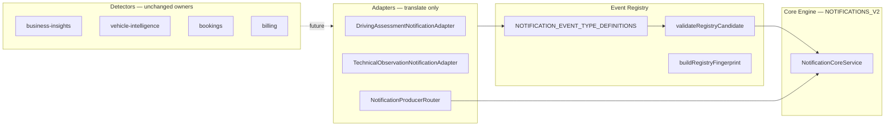

# Notification Engine — Event-Type Registry (V4.9.353)

> **Status:** Zentrale Producer Registry (Prompt 8) — Konfiguration + Adapter-Verträge, **keine** vollständige Producer-Migration.  
> **Code:** `backend/src/modules/notifications/registry/`

## Architektur



**Regeln:**

- Jedes `eventType` ist **einmalig** in der Registry registriert.
- Fingerprints werden **nur** über `buildRegistryFingerprint()` / Registry-Definition erzeugt.
- Adapter kennen **keine** lokalisierten Volltexte — nur `titleKey` / `bodyKey` aus der Registry.
- Detectoren bleiben Owner der fachlichen Erkennung.

---

## Registry-Struktur

| Datei | Rolle |
|-------|------|
| `notification-event-registry.types.ts` | `NotificationEventTypeDefinition`, Build-Input |
| `notification-event-registry.definitions.ts` | Alle Event-Type-Konfigurationen |
| `notification-event-registry.ts` | Bootstrap, Lookup, Fingerprint + Candidate Builder |
| `notification-event-registry.validator.ts` | Pflicht-Params, Severity, Action Target |
| `notification-event-target.builders.ts` | Wiederverwendbare `actionTargetBuilder` |
| `notification-event-registry.policies.ts` | Default Resolution / Delivery / Expiry |

### `NotificationEventTypeDefinition` (Pflichtfelder)

| Feld | Beschreibung |
|------|--------------|
| `slug` | Kebab-case Dokumentations-/Routing-ID (eindeutig) |
| `eventType` | Uppercase kanonischer Code (eindeutig, Fingerprint-Bestandteil) |
| `domain` | `NotificationDomain` |
| `defaultEntityType` | Standard-Entität |
| `conditionCode` | Stabile Bedingung innerhalb der Entität |
| `fingerprintVersion` | `scopeVersion` im Fingerprint (`vN`) |
| `eventKind` | `EVENT` oder `STATE` |
| `defaultSeverity` | Start-Severity |
| `allowedSeverityEscalations` | Erlaubte Eskalationswerte |
| `titleKey` / `bodyKey` | i18n-Keys (`notification.*`) |
| `requiredTemplateParams` | Pflicht-Interpolation |
| `actionType` / `actionTargetBuilder` | Navigation |
| `sourceType` | Default-Producer-Quelle |
| `resolutionPolicy` / `reopenPolicy` | Lifecycle |
| `expiryPolicy` | Optional für EVENT-Typen |
| `deliveryPolicy` | Kanal-Defaults |
| `preferenceCategory` | `UserNotificationPreference` Kategorie |
| `supportedRoles` | Sichtbare Rollen |
| `groupingRule` | Optionale Gruppierung |
| `requiresNavigation` | Erzwingt vollständiges Action Target |
| `shadowModeEnabled` | Darf in `NOTIFICATIONS_V2` schreiben |
| `producerModule` | Owning SynqDrive-Modul |

### Slug-Aliase

| Alias | Kanonischer Slug |
|-------|------------------|
| `pickup-overdue` | `overdue-pickup` |
| `return-overdue` | `overdue-return` |
| `driving-assessment-recovered` | `driving-assessment-limited` (gleicher Fingerprint, SUCCESS/Recovery) |

`suspicious-access` — **nicht** registriert (im Codebase nicht vorhanden).

---

## Registrierte Event-Typen

| Slug | eventType | Domain | Kind | Default Severity | conditionCode | Shadow |
|------|-----------|--------|------|------------------|---------------|--------|
| station-shortage | STATION_SHORTAGE | OPERATIONS | STATE | WARNING | shortage | |
| overdue-pickup | PICKUP_OVERDUE | HANDOVERS | STATE | WARNING | pickup_overdue | |
| overdue-return | RETURN_OVERDUE | HANDOVERS | STATE | WARNING | return_overdue | |
| blocked-vehicle | BLOCKED_VEHICLE | OPERATIONS | STATE | WARNING | blocked_vehicle | |
| vehicle-not-ready | VEHICLE_NOT_READY | OPERATIONS | STATE | WARNING | vehicle_not_ready | |
| maintenance-required | MAINTENANCE_REQUIRED | OPERATIONS | STATE | WARNING | maintenance_required | |
| active-dtc | ACTIVE_DTC | VEHICLE_HEALTH | STATE | WARNING | active_dtc | |
| battery-health-warning | BATTERY_CRITICAL | VEHICLE_HEALTH | STATE | CRITICAL | battery_critical | |
| tire-health-warning | TIRE_CRITICAL | VEHICLE_HEALTH | STATE | CRITICAL | tires_critical | |
| brake-health-warning | BRAKE_CRITICAL | VEHICLE_HEALTH | STATE | CRITICAL | brakes_critical | |
| compliance-expired | COMPLIANCE_EXPIRED | VEHICLE_HEALTH | STATE | WARNING | compliance_expired | |
| service-overdue | SERVICE_OVERDUE | VEHICLE_HEALTH | STATE | WARNING | service_overdue | |
| technical-observation-open | TECHNICAL_OBSERVATION_ACTIVE | VEHICLE_HEALTH | STATE | WARNING | technical_observation_active | **yes** |
| driving-assessment-limited | DRIVING_ASSESSMENT_DEVICE_QUALITY | DRIVING_ANALYSIS | STATE | WARNING | driving_assessment_device_quality | **yes** |
| trip-analysis-completed | TRIP_ANALYSIS_COMPLETED | DRIVING_ANALYSIS | EVENT | INFO | trip_analysis_completed | |
| misuse-detected | MISUSE_DETECTED | DRIVING_ANALYSIS | STATE | WARNING | misuse_detected | |
| possible-impact | POSSIBLE_IMPACT | DRIVING_ANALYSIS | STATE | WARNING | possible_impact | |
| data-quality-limited | DATA_QUALITY_LIMITED | DRIVING_ANALYSIS | STATE | INFO | data_quality_limited | |
| booking-created | BOOKING_CREATED | BOOKINGS | EVENT | INFO | booking_created | |
| booking-updated | BOOKING_UPDATED | BOOKINGS | EVENT | INFO | booking_updated | |
| pickup-due | PICKUP_DUE | HANDOVERS | EVENT | INFO | pickup_due | |
| return-due | RETURN_DUE | HANDOVERS | EVENT | INFO | return_due | |
| handover-incomplete | HANDOVER_INCOMPLETE | HANDOVERS | STATE | WARNING | handover_incomplete | |
| required-document-missing | REQUIRED_DOCUMENT_MISSING | DOCUMENTS | STATE | WARNING | required_document_missing | |
| payment-failed | PAYMENT_FAILED | BILLING | STATE | CRITICAL | payment_failed | |
| invoice-overdue | INVOICE_OVERDUE | BILLING | STATE | WARNING | invoice_overdue | |
| deposit-problem | DEPOSIT_PROBLEM | BILLING | STATE | WARNING | deposit_problem | |
| integration-disconnected | INTEGRATION_DISCONNECTED | SYSTEM | STATE | CRITICAL | integration_disconnected | |
| telemetry-offline | TELEMETRY_OFFLINE | SYSTEM | STATE | WARNING | telemetry_offline | |
| webhook-failure | WEBHOOK_FAILURE | SYSTEM | EVENT | WARNING | webhook_failure | |

---

## Fingerprint-Regeln

```
organizationId | eventType | entityType | entityId | conditionCode | v{fingerprintVersion}
```

- **Keine** Severity, UI-Texte oder `sourceType` im Fingerprint.
- Gleiche Entität + anderer `conditionCode` → **anderer** Fingerprint.
- Gleiche Ursache, andere `sourceType` → **gleicher** Fingerprint.
- API: `buildRegistryFingerprint(orgId, eventType, entityId)`.

Legacy `notification-fingerprint.registry.ts` delegiert an diese Registry.

---

## Validierungsregeln

| Regel | Enforcement |
|-------|-------------|
| Duplicate `eventType` | Bootstrap wirft `NotificationEventRegistryError` |
| Duplicate `slug` | Bootstrap wirft |
| Pflicht `templateParams` | `validateRegistryCandidate` / `validateRegistryBuildInput` |
| Navigierbare Events | `requiresNavigation` → `entityId` + Action-Ref |
| Severity | Muss in `allowedSeverityEscalations` liegen (außer SUCCESS/Recovery) |
| Domain / conditionCode / eventKind | Müssen Registry-Definition entsprechen |
| titleKey | Muss `notification.*` sein; Recovery darf abweichen bei SUCCESS |

---

## Adapter-Verträge

Basis: `NotificationProducerAdapter<TSource>` in `adapters/notification-adapter.types.ts`.

| Interface / Adapter | Zweck |
|---------------------|-------|
| `DashboardInsightAdapterSource` | Business-Insight-Bridge (noch nicht verdrahtet) |
| `RuntimeStateAdapterSource` | Runtime-Zustände |
| `VehicleHealthAdapterSource` | Health-Alerts |
| `BookingAdapterSource` | Buchungs-/Handover-Events |
| `DrivingAssessmentNotificationAdapter` | **Shadow** — Fahrbewertung |
| `TechnicalObservationNotificationAdapter` | **Shadow** — Technische Beobachtung |
| `NotificationProducerRouter` | Flag + Shadow-Gate → `NotificationCoreService` |

Adapter mit `shadowModeOnly: true` schreiben nur wenn:

1. `NOTIFICATIONS_V2=true`
2. `eventType.shadowModeEnabled=true`

---

## Noch zu migrierende Producer

| Modul | Event-Typen (Auswahl) | Status |
|-------|----------------------|--------|
| `business-insights` | STATION_SHORTAGE, PICKUP_OVERDUE, BATTERY_CRITICAL, … | Detector aktiv, **kein** Registry-Adapter ingest |
| `vehicle-intelligence` | DRIVING_ASSESSMENT_DEVICE_QUALITY, MISUSE_DETECTED, TRIP_ANALYSIS_COMPLETED | Shadow-Adapter für Fahrbewertung only |
| `vehicle-complaints` | TECHNICAL_OBSERVATION_ACTIVE | Shadow-Adapter only |
| `bookings` | BOOKING_CREATED, PICKUP_DUE, HANDOVER_INCOMPLETE | Nicht verdrahtet |
| `billing` | PAYMENT_FAILED, INVOICE_OVERDUE | Nicht verdrahtet |
| `dimo` / `webhooks` | TELEMETRY_OFFLINE, WEBHOOK_FAILURE | Nicht verdrahtet |
| `insight-candidate.mapper` | Legacy Bridge | Nutzt teils alte `conditionCode`-Werte — Migration folgt |

---

## Verwandte Docs

- `docs/notification-engine-domain-contract.md`
- `docs/notification-engine-core.md`
- `docs/notification-engine-migration-plan.md`
