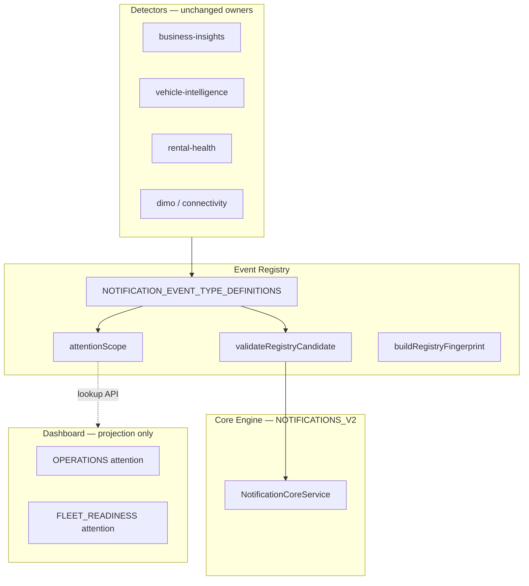

# Notification Engine — Event-Type Registry (V4.9.919)

> **Status:** Zentrale Producer Registry — Konfiguration + Adapter-Verträge + kanonisches `attentionScope` Routing (P1.1).  
> **Code:** `backend/src/modules/notifications/registry/`  
> **Audit:** `docs/audits/fleet-readiness-notification-parity-2026-08.md`

## Architektur


```mermaid
flowchart TD
  subgraph detectors [Detectors — unchanged owners]
    BI[business-insights]
    VI[vehicle-intelligence]
    RH[rental-health]
    DIMO[dimo / connectivity]
  end

  subgraph registry [Event Registry]
    DEF[NOTIFICATION_EVENT_TYPE_DEFINITIONS]
    AS[attentionScope]
    VAL[validateRegistryCandidate]
    FP[buildRegistryFingerprint]
  end

  subgraph core [Core Engine — NOTIFICATIONS_V2]
    CS[NotificationCoreService]
  end

  subgraph dashboard [Dashboard — projection only]
    OPS[OPERATIONS attention]
    FR[FLEET_READINESS attention]
  end

  detectors --> DEF
  DEF --> AS
  DEF --> VAL --> CS
  AS -.->|lookup API| dashboard
```

**Regeln:**

- Jedes `eventType` ist **einmalig** in der Registry registriert.
- Fingerprints werden **nur** über `buildRegistryFingerprint()` / Registry-Definition erzeugt.
- Adapter kennen **keine** lokalisierten Volltexte — nur `titleKey` / `bodyKey` aus der Registry.
- Detectoren bleiben Owner der fachlichen Erkennung.
- `attentionScope` ist **reine Routing-Klassifikation** — kein Persistence-/Fingerprint-Feld.

---

## `attentionScope` vs `domain`

| Aspekt | `domain` | `attentionScope` |
|--------|----------|-------------------|
| Zweck | Fachliche Notification-Domäne (Filter, Counts, Preferences-Kontext) | Dashboard-Attention-Space (Operations vs Fleet Readiness) |
| Werte | `OPERATIONS`, `VEHICLE_HEALTH`, `HANDOVERS`, `BOOKINGS`, `BILLING`, `DOCUMENTS`, `DRIVING_ANALYSIS`, `SYSTEM`, `SECURITY` | `OPERATIONS`, `FLEET_READINESS` |
| Persistenz | In Notification-Record (`domain`) | **Nicht** persistiert — Registry-Lookup zur Laufzeit |
| Fingerprint | Nein | **Nein** |
| User Preference | Indirekt über `preferenceCategory` | **Nein** |
| Pflichtfeld | Ja | Ja (Compile/Test-Enforcement) |

**Architekturregel:** Keine dritte Wahrheit. Rental Health bleibt Source of Truth für Fahrzeugzustand; Notification V2 für Lifecycle; `attentionScope` nur für Dashboard-Routing-Projektion.

**Beispiel:** `VEHICLE_NOT_READY` hat `domain: OPERATIONS` (historisch korrekt) aber `attentionScope: FLEET_READINESS` (Dashboard-Zielbereich).

### Lookup-API

```typescript
getNotificationEventTypesByAttentionScope('FLEET_READINESS')
getNotificationDefinitionsByAttentionScope('OPERATIONS')
getNotificationAttentionScope('ACTIVE_DTC') // → 'FLEET_READINESS'
requireNotificationAttentionScope(eventType)
isNotificationAttentionScope(value)
```

**Regel für neue Event Types:** Jede neue `NotificationEventTypeDefinition` **muss** explizit `attentionScope` setzen — kein Default-Fallback. TypeScript `satisfies` + Registry-Tests erzwingen Vollständigkeit.

### Aktuelle Verteilung (Code-Stand)

| attentionScope | Anzahl |
|----------------|--------|
| `FLEET_READINESS` | 23 |
| `OPERATIONS` | 42 |
| **Gesamt** | **65** |

Vollständige Matrix: Code (`notification-event-registry.definitions.ts`, `legal-document-notification-event.definitions.ts`) oder Audit-Dokument §3.

---

## Registry-Struktur

| Datei | Rolle |
|-------|------|
| `notification-event-registry.types.ts` | `NotificationEventTypeDefinition`, Build-Input |
| `notification-event-registry.definitions.ts` | Alle Event-Type-Konfigurationen |
| `notification-event-registry.ts` | Bootstrap, Lookup, Fingerprint + Candidate Builder |
| `notification-event-registry.validator.ts` | Pflicht-Params, Severity, Action Target |
| `notification-event-target.builders.ts` | Wiederverwendbare `actionTargetBuilder` |
| `notification-event-registry.policies.ts` | Default Resolution / Delivery / Expiry |

### `NotificationEventTypeDefinition` (Pflichtfelder)

| Feld | Beschreibung |
|------|--------------|
| `slug` | Kebab-case Dokumentations-/Routing-ID (eindeutig) |
| `eventType` | Uppercase kanonischer Code (eindeutig, Fingerprint-Bestandteil) |
| `attentionScope` | `OPERATIONS` \| `FLEET_READINESS` — Dashboard-Routing (Pflicht, nicht persistiert) |
| `domain` | `NotificationDomain` |
| `defaultEntityType` | Standard-Entität |
| `conditionCode` | Stabile Bedingung innerhalb der Entität |
| `fingerprintVersion` | `scopeVersion` im Fingerprint (`vN`) |
| `eventKind` | `EVENT` oder `STATE` |
| `defaultSeverity` | Start-Severity |
| `allowedSeverityEscalations` | Erlaubte Eskalationswerte |
| `titleKey` / `bodyKey` | i18n-Keys (`notification.*`) |
| `requiredTemplateParams` | Pflicht-Interpolation |
| `actionType` / `actionTargetBuilder` | Navigation |
| `sourceType` | Default-Producer-Quelle |
| `resolutionPolicy` / `reopenPolicy` | Lifecycle |
| `expiryPolicy` | Optional für EVENT-Typen |
| `deliveryPolicy` | Kanal-Defaults |
| `preferenceCategory` | `UserNotificationPreference` Kategorie |
| `supportedRoles` | Sichtbare Rollen |
| `groupingRule` | Optionale Gruppierung |
| `requiresNavigation` | Erzwingt vollständiges Action Target |
| `shadowModeEnabled` | Darf in `NOTIFICATIONS_V2` schreiben |
| `producerModule` | Owning SynqDrive-Modul |

### Slug-Aliase

| Alias | Kanonischer Slug |
|-------|------------------|
| `pickup-overdue` | `overdue-pickup` |
| `return-overdue` | `overdue-return` |
| `driving-assessment-recovered` | `driving-assessment-limited` (gleicher Fingerprint, SUCCESS/Recovery) |

`suspicious-access` — **nicht** registriert (im Codebase nicht vorhanden).

---

## Registrierte Event-Typen

> **Hinweis:** Die vollständige, aktuelle Liste (65 Event Types inkl. Legal-Dokument-Events und Connectivity-Typen) liegt im Code. Diese Tabelle ist eine Kurzreferenz — bei Abweichungen gilt der Code.

| Slug | eventType | Domain | attentionScope | Kind | Shadow |
|------|-----------|--------|----------------|------|--------|
| blocked-vehicle | BLOCKED_VEHICLE | OPERATIONS | FLEET_READINESS | STATE | |
| vehicle-not-ready | VEHICLE_NOT_READY | OPERATIONS | FLEET_READINESS | STATE | |
| active-dtc | ACTIVE_DTC | VEHICLE_HEALTH | FLEET_READINESS | STATE | |
| battery-health-warning | BATTERY_CRITICAL | VEHICLE_HEALTH | FLEET_READINESS | STATE | |
| tire-health-warning | TIRE_CRITICAL | VEHICLE_HEALTH | FLEET_READINESS | STATE | |
| brake-health-warning | BRAKE_CRITICAL | VEHICLE_HEALTH | FLEET_READINESS | STATE | |
| technical-observation-open | TECHNICAL_OBSERVATION_ACTIVE | VEHICLE_HEALTH | FLEET_READINESS | STATE | **yes** |
| telemetry-offline | TELEMETRY_OFFLINE | SYSTEM | FLEET_READINESS | STATE | |
| station-shortage | STATION_SHORTAGE | OPERATIONS | OPERATIONS | STATE | **yes** |
| low-utilization | LOW_UTILIZATION | OPERATIONS | OPERATIONS | STATE | |
| driving-assessment-limited | DRIVING_ASSESSMENT_DEVICE_QUALITY | DRIVING_ANALYSIS | OPERATIONS | STATE | **yes** |
| possible-impact | POSSIBLE_IMPACT | DRIVING_ANALYSIS | OPERATIONS | STATE | |
| integration-disconnected | INTEGRATION_DISCONNECTED | SYSTEM | OPERATIONS | STATE | |
| booking-created | BOOKING_CREATED | BOOKINGS | OPERATIONS | EVENT | |

Weitere Typen (Handovers, Billing, Legal, Connectivity, …): siehe Registry-Code und Audit §3.

---

## Fingerprint-Regeln

```
organizationId | eventType | entityType | entityId | conditionCode | v{fingerprintVersion}
```

- **Keine** Severity, UI-Texte, `sourceType` oder `attentionScope` im Fingerprint.
- Gleiche Entität + anderer `conditionCode` → **anderer** Fingerprint.
- Gleiche Ursache, andere `sourceType` → **gleicher** Fingerprint.
- API: `buildRegistryFingerprint(orgId, eventType, entityId)`.

Legacy `notification-fingerprint.registry.ts` delegiert an diese Registry.

---

## Validierungsregeln

| Regel | Enforcement |
|-------|-------------|
| Duplicate `eventType` | Bootstrap wirft `NotificationEventRegistryError` |
| Duplicate `slug` | Bootstrap wirft |
| Pflicht `templateParams` | `validateRegistryCandidate` / `validateRegistryBuildInput` |
| Navigierbare Events | `requiresNavigation` → `entityId` + Action-Ref |
| Severity | Muss in `allowedSeverityEscalations` liegen (außer SUCCESS/Recovery) |
| Domain / conditionCode / eventKind | Müssen Registry-Definition entsprechen |
| titleKey | Muss `notification.*` sein; Recovery darf abweichen bei SUCCESS |

---

## Adapter-Verträge

Basis: `NotificationProducerAdapter<TSource>` in `adapters/notification-adapter.types.ts`.

| Interface / Adapter | Zweck |
|---------------------|-------|
| `DashboardInsightAdapterSource` | Business-Insight-Bridge (noch nicht verdrahtet) |
| `RuntimeStateAdapterSource` | Runtime-Zustände |
| `VehicleHealthAdapterSource` | Health-Alerts |
| `BookingAdapterSource` | Buchungs-/Handover-Events |
| `DrivingAssessmentNotificationAdapter` | **Shadow** — Fahrbewertung |
| `TechnicalObservationNotificationAdapter` | **Shadow** — Technische Beobachtung |
| `NotificationProducerRouter` | Flag + Shadow-Gate → `NotificationCoreService` |

Adapter mit `shadowModeOnly: true` schreiben nur wenn:

1. `NOTIFICATIONS_V2=true`
2. `eventType.shadowModeEnabled=true`

---

## Noch zu migrierende Producer

| Modul | Event-Typen (Auswahl) | Status |
|-------|----------------------|--------|
| `business-insights` | STATION_SHORTAGE, PICKUP_OVERDUE, BATTERY_CRITICAL, … | Detector aktiv, **kein** Registry-Adapter ingest |
| `vehicle-intelligence` | DRIVING_ASSESSMENT_DEVICE_QUALITY, MISUSE_DETECTED, TRIP_ANALYSIS_COMPLETED | Shadow-Adapter für Fahrbewertung only |
| `vehicle-complaints` | TECHNICAL_OBSERVATION_ACTIVE | Shadow-Adapter only |
| `bookings` | BOOKING_CREATED, PICKUP_DUE, HANDOVER_INCOMPLETE | Nicht verdrahtet |
| `billing` | PAYMENT_FAILED, INVOICE_OVERDUE | Nicht verdrahtet |
| `dimo` / `webhooks` | TELEMETRY_OFFLINE, WEBHOOK_FAILURE | Nicht verdrahtet |
| `insight-candidate.mapper` | Legacy Bridge | Nutzt teils alte `conditionCode`-Werte — Migration folgt |

---

## Verwandte Docs

- `docs/audits/fleet-readiness-notification-parity-2026-08.md`
- `docs/notification-engine-domain-contract.md`
- `docs/notification-engine-core.md`
- `docs/notification-engine-migration-plan.md`
