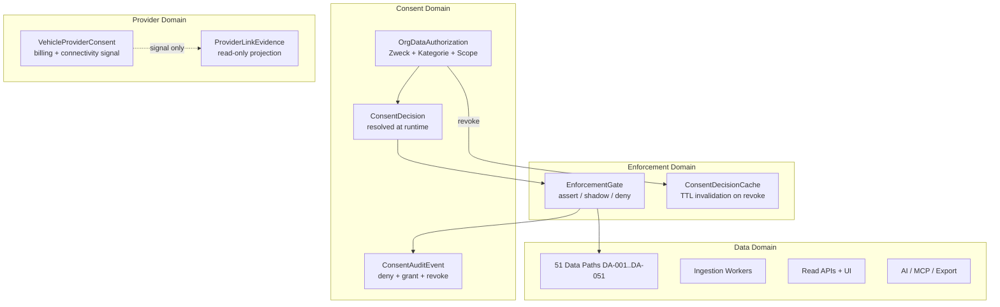
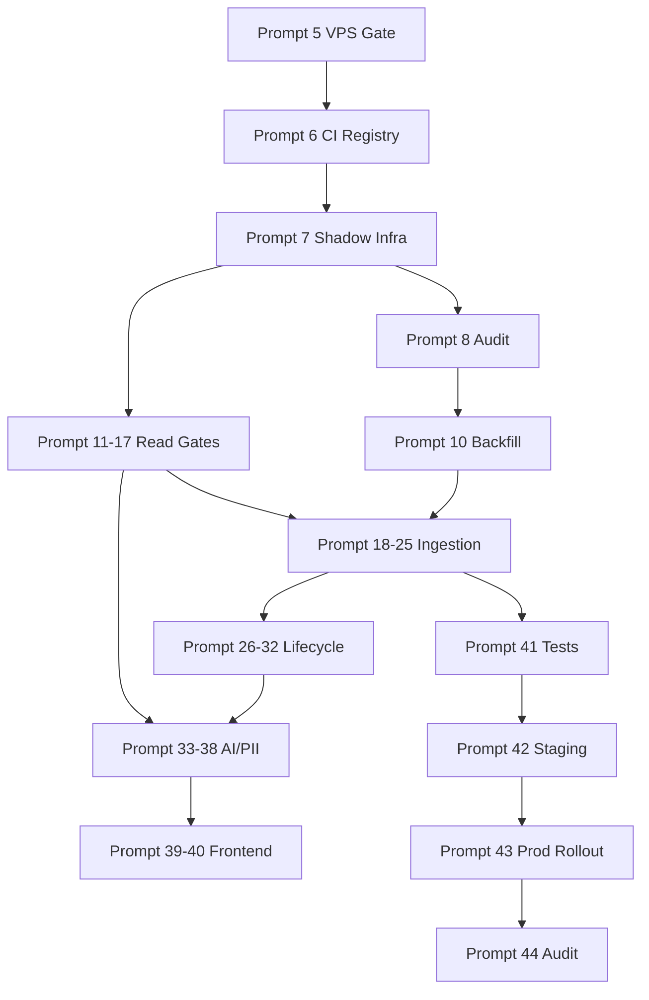

# Data Authorization — Verbindlicher Remediation- und Migrationsplan

**Prompt:** 4 von 44  
**Datum:** 2026-07-23  
**Status:** **EINGEFROREN** — verbindliche Zielarchitektur und Migrationsreihenfolge für Prompts 5–44  
**Repository:** `SYNQDRIVE-alpha`  
**Referenzen:**

| Dokument | Rolle |
|----------|-------|
| `docs/audits/data-authorization-remediation-baseline-2026-07.md` | Ist-Analyse Code/Schema/Tests |
| `docs/architecture/data-authorization-dataflow-and-enforcement-map-2026-07.md` | 51 Datenpfade, Enforcement-Karte |
| `docs/architecture/data-authorization-enforcement-coverage.json` | Maschinenlesbare Coverage-Matrix |
| `docs/audits/data-authorization-vps-runtime-baseline-2026-07.md` | VPS Runtime-Ist (PM2, Queues, Env) |

**Scope dieses Prompts:** Planung und Dokumentation — **keine produktiven Code-Änderungen**.

---

## Executive Summary

SynqDrive besitzt ein Consent Center (`OrgDataAuthorization`) und ein Provider-Ledger (`VehicleProviderConsent`), aber **0 von 51 Datenpfaden sind vollständig geschützt**; nur Live-GPS (`DA-001`) und WhatsApp-GPS (`DA-034`) sind teilweise enforced. Zum Prüfzeitpunkt ist die **Produktions-VPS offline** (PM2 Crash-Loop, HTTP 502) — jede Enforcement-Rollout-Planung muss mit **VPS-Stabilisierung** beginnen.

Dieser Plan definiert die **Zielarchitektur**, **12 Datenbankmigrationen**, **8 Feature-Flags**, **4 Shadow-Mode-Phasen**, **6 Rollback-Punkte** und die **verbindliche Zuordnung der Prompts 5–44** zu Architekturbausteinen.

---

## 0. Repository vs. VPS — Architekturabgleich

| Dimension | Repository (Soll-Design) | VPS Runtime (Ist 2026-07-23) | Abweichung / Konsequenz |
|-----------|--------------------------|------------------------------|-------------------------|
| **App-Prozess** | NestJS Monolith (API + Worker embedded) | PM2 `synqdrive` — **Crash-Loop** auf `ba9eaa3` | **P0:** Kein Enforcement wirksam; Prompt 5 muss Stabilität herstellen |
| **Worker-Topologie** | BullMQ-Consumer im selben Prozess | Identisch — **offline** mit App | Kein separater Worker-Prozess; Queue-Migration = Code-Deploy |
| **PostgreSQL** | Prisma, `org_data_authorizations`, `vehicle_provider_consents` | PG 16 native, 1 ACTIVE DIMO_TELEMETRY, 3 ACTIVE VPC | Schema konsistent; Ledger-Lücke 6 DIMO / 3 VPC |
| **Redis** | BullMQ backing | Redis 7 native, 1239 `bull:*` Keys | Kein Consent-Cache |
| **ClickHouse** | Optional via `CLICKHOUSE_URL` | Docker `synqdrive-clickhouse` 25.8, localhost | Repo-Doku „optional"; VPS = Docker — kein Blocker |
| **Enforcement-Config** | Code-only `DataAuthorizationEnforcementService` | **Keine** `DATA_AUTH*` Env-Keys | Rollout braucht Feature-Flags (neu) |
| **Deploy** | Release-Symlinks unter `/opt/synqdrive` | 140 Releases, Disk 89 %, paralleler Build | Deploy-Hygiene vor Enforcement-Rollout |
| **Monitoring** | Prometheus/Grafana (optional) | Docker Prometheus + Grafana lokal | Consent-Metriken noch nicht definiert |
| **Notifications** | `NOTIFICATIONS_V2` | Delivery **disabled** (`NOTIFICATIONS_DELIVERY_ENABLED=false`) | Alert-Enforcement testbar ohne E-Mail-Risiko |
| **HM Telemetry** | MQTT consumer code | `HM_TELEMETRY_APP_MQTT_ENABLED=false` | HM-GPS-Pfade nicht operational auf VPS |

**Verbindliche Schlussfolgerung:** Repository-Architektur und VPS-Architektur sind **strukturell aligned** (Monolith + embedded Workers), aber **operational divergent** (App down, keine Enforcement-Flags, Ledger-Lücken). **Prompt 5** adressiert ausschließlich den **VPS-Stabilitäts- und Messungs-Gate** — keine Enforcement-Umschaltung vor erfolgreichem Health-Check.

---

## 1. Fachliche Zielarchitektur

### 1.1 Leitprinzipien (DSGVO / ISO 27001)

1. **Zweckbindung:** Jeder Zugriff auf personenbezogene oder telemetrische Fahrzeugdaten ist an einen dokumentierten Verarbeitungszweck (`purpose`) und eine Datenkategorie (`dataCategory`) gebunden.
2. **Widerrufswirkung:** Ein Widerruf (`REVOKED`) blockiert **innerhalb definierter SLAs** (≤ 5 min Read, ≤ 15 min Ingestion) alle betroffenen Pfade — nicht nur Live-GPS.
3. **Expliziter Consent:** Systemgenerierte Freigaben (`DIMO_TELEMETRY`, künftig `HIGH_MOBILITY_TELEMETRY`) starten als `PENDING` und werden nur durch expliziten Admin-Grant (`manage`) `ACTIVE`.
4. **Nachweisbarkeit:** Jede verweigerte Zugriffsentscheidung wird auditiert; jede gewährte System-Freigabe hat einen Audit-Trail mit Actor und Zeitstempel.
5. **Tenant-Isolation:** Consent-Entscheidungen sind strikt org-scoped; kein Cross-Tenant-Fallback.
6. **Keine stillschweigende Genehmigung:** Historische Daten, fehlende Ledger-Einträge oder implizite Provider-Scopes werden **niemals** als rechtmäßige Freigabe interpretiert.

### 1.2 Fachliche Domänen



### 1.3 Rollenmodell (unverändert, aber klar getrennt)

| Rolle | Consent Center | IAM `data-authorization.*` | Integrations Connect |
|-------|----------------|---------------------------|----------------------|
| Org Admin | read/write/manage | — | — |
| Sub-Admin | read only | — | — |
| Integrations Operator | — | — | `data-authorization.manage` (IAM ≠ Org-Consent) |

---

## 2. Technische Zielarchitektur

### 2.1 Schichtenmodell

```
┌─────────────────────────────────────────────────────────────┐
│  UI: DataAuthorizationTab, Fleet Connectivity (read-only)   │
├─────────────────────────────────────────────────────────────┤
│  API: DataAuthorizationsController + Consumer Services      │
├─────────────────────────────────────────────────────────────┤
│  Enforcement Layer (NEU — zentral)                          │
│  ├── DataAuthorizationEnforcementService (erweitert)        │
│  ├── ConsentDecisionResolver (NEU)                          │
│  ├── EnforcementGateInterceptor / WorkerGuard (NEU)         │
│  └── ConsentAuditService (NEU — deny events)              │
├─────────────────────────────────────────────────────────────┤
│  Consent Store                                              │
│  ├── org_data_authorizations (primär)                       │
│  ├── consent_audit_events (NEU)                             │
│  └── vehicle_provider_consents (Legacy-Signal, Billing)     │
├─────────────────────────────────────────────────────────────┤
│  Workers / Schedulers (BullMQ embedded)                     │
│  └── pre-persist EnforcementGate per category/purpose       │
├─────────────────────────────────────────────────────────────┤
│  Cache: Redis ConsentDecisionCache (NEU, optional Phase B)  │
└─────────────────────────────────────────────────────────────┘
```

### 2.2 Enforcement-Topologie (Ziel)

| Stufe | Mechanismus | Fail-Modus (Ziel) |
|-------|-------------|-------------------|
| **Read API** | `assertDataAuthorization` vor Datenabruf | **fail-closed** |
| **Ingestion Worker** | `EnforcementGate.assertBeforePersist` | **fail-closed** (skip job, log) |
| **AI/MCP Tool** | Category + purpose check pro Tool | **fail-closed** |
| **Export/DSAR** | Consent-Nachweis in Payload + Gate | **fail-closed** |
| **Shadow Mode** | `isAuthorized` log-only, Metriken | observe only |
| **Billing** | `VehicleProviderConsent` (unverändert) | N/A — kein Datenzugriff |

### 2.3 Zentrale API-Verträge (neu / erweitert)

```typescript
// Ziel-Vertrag (konzeptionell — Implementierung ab Prompt 7)
interface EnforcementContext {
  organizationId: string;
  vehicleId?: string;
  customerId?: string;
  bookingId?: string;
  sourceType: DataAuthorizationSourceType;
  dataCategory: DataCategory;
  purpose: DataPurpose;
  pathId: string; // DA-001..DA-051
}

interface EnforcementResult {
  allowed: boolean;
  mode: 'shadow' | 'enforce';
  matchedAuthorizationId?: string;
  denyReason?: string;
}
```

### 2.4 VPS-Zielbild (unveränderte Topologie, erweiterte Observability)

- **PM2 Monolith** bleibt — kein separater Enforcement-Worker in Phase 1–3
- **Neue Env-Keys** in `backend.env` (siehe Abschnitt 7)
- **Prometheus-Metriken** für `consent_enforcement_*` (Counter/Histogram)
- **Grafana-Dashboard** „Data Authorization Enforcement"

---

## 3. Neue Domänenmodelle

### 3.1 `ConsentAuditEvent` (neu — Tabelle `consent_audit_events`)

| Feld | Typ | Zweck |
|------|-----|-------|
| `id` | UUID | PK |
| `organizationId` | UUID | Tenant scope |
| `eventType` | enum | `ACCESS_DENIED`, `ACCESS_GRANTED`, `INGESTION_SKIPPED`, `SHADOW_WOULD_DENY` |
| `pathId` | string | `DA-001` etc. |
| `dataCategory` | string | |
| `purpose` | string | |
| `vehicleId` | UUID? | |
| `authorizationId` | UUID? | matched or expected |
| `actorType` | enum | `USER`, `SYSTEM`, `WORKER` |
| `actorId` | string? | |
| `metadata` | JSON | redacted context |
| `createdAt` | timestamp | |

**Retention:** Legal-Hold — **nicht** durch `RETENTION_ACTIVITY_LOGS_DAYS` löschbar.

### 3.2 `ConsentDecisionResolver` (neu — Service, kein DB-Modell)

- Einheitliche Auflösung: `OrgDataAuthorization` + Scope + Category + Purpose
- Ersetzt verstreute `findMany` + In-Memory-Filter-Logik
- Input: `EnforcementContext` → Output: `EnforcementResult`

### 3.3 `EnforcementCoverageRegistry` (neu — Code-Artefakt)

- TypeScript-Registry generiert aus `data-authorization-enforcement-coverage.json`
- CI-Gate: jeder registrierte Pfad muss `enforcementHook` oder explizites `exemptReason` haben

### 3.4 Erweiterungen bestehender Modelle

| Modell | Änderung |
|--------|----------|
| `OrgDataAuthorization` | Neues Feld `migrationStatus`: `MIGRATED` \| `REVIEW_REQUIRED` \| `LEGACY_IMPLICIT` |
| `OrgDataAuthorization` | Neues Feld `enforcementVersion`: int (für Schema-Evolution) |
| `VehicleProviderConsent` | Neues Feld `linkedOrgAuthorizationId` (nullable FK) — Provider-Konsolidierung |
| `DataAuthorizationStatus` | Kein neuer Enum-Wert; `REVIEW_REQUIRED` nur auf `migrationStatus` |

### 3.5 Neue System-Keys (Constants)

| systemKey | sourceType | Default-Status (neu) |
|-----------|------------|----------------------|
| `DIMO_TELEMETRY` | DIMO | `PENDING` (nicht mehr AUTO-ACTIVE) |
| `HIGH_MOBILITY_TELEMETRY` | API_INTEGRATION | `PENDING` |
| `HIGH_MOBILITY_HEALTH` | API_INTEGRATION | `PENDING` |

---

## 4. Legacy-Kompatibilität

### 4.1 Parallelbetrieb-Regeln

| Legacy-Element | Behandlung | End-of-Life |
|----------------|------------|-------------|
| `OrgDataAuthorization` (bestehend) | Bleibt primärer Consent-Store | — |
| `VehicleProviderConsent` | Bleibt für Billing + Connectivity-Signal | Phase 4: read-only Signal |
| `ensureDimoTelemetryAuthorization` AUTO-ACTIVE | **Deprecated** — Feature-Flag `DATA_AUTH_DIMO_AUTO_ACTIVE=false` | Prompt 29 |
| `isAuthorized()` ungenutzt | Wird Shadow-Mode-Einstieg | Prompt 7 |
| Leeres `purposes` JSON = alle Zwecke | **Deprecated** — Backfill setzt explizite purposes | Prompt 10 Backfill |
| `partner_data_authorizations` | Bereits gedroppt — keine Rückmigration | — |
| `InsuranceDataAuthorizationLog` | Separates Modell — **out of scope** | — |
| Deprecated PATCH grant/revoke | Bleibt bis Frontend migriert | Prompt 39 |

### 4.2 API-Kompatibilität

- Bestehende CRUD-Endpunkte bleiben **rückwärtskompatibel**
- Neue Felder (`migrationStatus`) sind optional in Responses
- `403 DATA_AUTHORIZATION_DENIED` wird **neu** auf weiteren Endpunkten — dokumentiert in Changelog

### 4.3 Worker-Kompatibilität

- Jobs in Queue bei Revoke: **nicht löschen**, sondern **skip at processing** (idempotent)
- Bestehende persisted Daten: **nicht automatisch löschen** bei Revoke (separate Retention/Lösch-Prompts)

---

## 5. Migrationsreihenfolge (verbindlich)

### Phase 0 — VPS & Messungs-Gate (Prompt 5)

> **Voraussetzung für alle weiteren Phasen.** Kein Enforcement-Rollout bei HTTP 502.

| Schritt | Inhalt | Rollback-Punkt |
|---------|--------|----------------|
| 0.1 | VPS Crash-Loop beheben (`BookingsModule` DI) | RP-0 |
| 0.2 | Release-Cleanup (Disk < 80 %) | — |
| 0.3 | Health 200 lokal + öffentlich | RP-0 validieren |
| 0.4 | Readonly-Baseline erneut ausführen | — |

### Phase A — Foundation & Messung (Prompts 6–10)

| Schritt | Migration | Prompt | Deliverable |
|---------|-----------|--------|-------------|
| A.1 | — | 6 | `EnforcementCoverageRegistry` + CI-Workflow |
| A.2 | — | 7 | Shadow-Mode-Infrastruktur (`isAuthorized` + Metriken) |
| A.3 | `20260724_consent_audit_events` | 8 | `ConsentAuditService` + deny logging |
| A.4 | — | 9 | Legal-Hold für Consent-Audit (Retention-Config) |
| A.5 | `20260725_auth_migration_status` | 10 | `migrationStatus`-Feld + Backfill-Skript |

**Rollback-Punkt:** **RP-A** — Shadow-Mode abschaltbar via `DATA_AUTH_ENFORCEMENT_MODE=off`

### Phase B — Read-Path Enforcement (Prompts 11–17)

| Schritt | Pfade | Prompt | Fail-Modus |
|---------|-------|--------|------------|
| B.1 | DA-003 Telemetry API | 11 | shadow → enforce |
| B.2 | DA-004 Fleet Map | 12 | shadow → enforce |
| B.3 | DA-001 Live-GPS Cache-Fallback | 14 | enforce (fail-closed cache) |
| B.4 | DA-015–020 Health/DTC Read | 15 | shadow → enforce |
| B.5 | DA-007, DA-008 Trip/Route Read | 16 | shadow → enforce |
| B.6 | DA-031 Data Analyse | 17 | shadow → enforce |
| B.7 | Shared Read-Gate Refactor | 13 | — |

**Rollback-Punkt:** **RP-B** — `DATA_AUTH_READ_ENFORCEMENT=false` (per-category override möglich)

### Phase C — Ingestion Enforcement (Prompts 18–25)

| Schritt | Worker/Queue | Pfade | Prompt |
|---------|--------------|-------|--------|
| C.1 | `dimo.snapshot.poll` | DA-002, DA-045 | 18, 22 |
| C.2 | `dimo.dtc.poll` | DA-006 | 19 |
| C.3 | `dimo.trip-tracking`, `trip.behavior.enrichment` | DA-007, DA-009 | 20 |
| C.4 | `battery.v2`, `tire.recalculation`, `brake.recalculation` | DA-015–017 | 21 |
| C.5 | `notification.evaluation` | DA-022 | 23 |
| C.6 | `connectivity.webhook.process` | DA-005 | 24 |
| C.7 | `dimo.vehicle.sync` | DA-038, DA-047 | 25 |

**Rollback-Punkt:** **RP-C** — `DATA_AUTH_INGESTION_ENFORCEMENT=false` (Worker skip deaktiviert)

### Phase D — Provider & Lifecycle (Prompts 26–32)

| Schritt | Inhalt | Prompt | Migration |
|---------|--------|--------|-----------|
| D.1 | HM System-Keys + SourceType | 26 | `20260726_hm_system_authorizations` |
| D.2 | HM Worker Gates | 27 | — |
| D.3 | VPC ↔ ODA Link | 28 | `20260727_vpc_org_auth_link` |
| D.4 | Expliziter DIMO Grant (kein AUTO-ACTIVE) | 29 | Backfill only |
| D.5 | Revoke → Worker Suppression | 30 | — |
| D.6 | FK `organization_id` | 31 | `20260728_org_auth_fk` |
| D.7 | Consent Retention Policy | 32 | `20260729_consent_retention_config` |

**Rollback-Punkt:** **RP-D** — `DATA_AUTH_DIMO_AUTO_ACTIVE=true` (nur nach Legal-Review)

### Phase E — AI, PII, Export (Prompts 33–38)

| Schritt | Pfade | Prompt |
|---------|-------|--------|
| E.1 | DA-034 WhatsApp (alle Kategorien) | 33 |
| E.2 | DA-033 Voice MCP | 34 |
| E.3 | DA-032 Org Chat | 35 |
| E.4 | DA-025, DA-026 Customer/Booking | 36 |
| E.5 | DA-030 DSAR Export | 37 |
| E.6 | DA-027–029 Documents | 38 |

**Rollback-Punkt:** **RP-E** — AI-Tools einzeln per `DATA_AUTH_AI_ENFORCEMENT_PATHS` denylist

### Phase F — UI, Tests, Rollout (Prompts 39–44)

| Schritt | Inhalt | Prompt |
|---------|--------|--------|
| F.1 | Frontend Scope-Picker, Server-Filter, KPI | 39 |
| F.2 | i18n + UX-Harmonisierung | 40 |
| F.3 | Integration Tests + CI `test:data-authorization` | 41 |
| F.4 | Staging-Verifikation (REVOKED-Org-Suite) | 42 |
| F.5 | Production Rollout + Fail-Closed Switch | 43 |
| F.6 | Post-Remediation Readiness Audit | 44 |

**Rollback-Punkt:** **RP-F (final)** — Global `DATA_AUTH_ENFORCEMENT_MODE=shadow` → notfalls `off`

---

## 6. Backfill-Strategie

### 6.1 Automatische Migration (sicher)

| Daten | Aktion | Bedingung |
|-------|--------|-----------|
| Bestehende `DIMO_TELEMETRY` mit `status=ACTIVE` + `isSystemGenerated=true` | `migrationStatus=MIGRATED`, purposes explizit setzen | Record hat `grantedAt` oder `accessCount > 0` |
| `VehicleProviderConsent` ACTIVE (DIMO) | `linkedOrgAuthorizationId` setzen wenn ODA existiert | 1:1 org match |
| Leere `purposes` JSON | Setze purposes aus `DIMO_TELEMETRY_AUTHORIZATION.purposes` | Alle Records |
| Legacy category keys | `normalizeDataCategories()` anwenden | Idempotent |

### 6.2 REVIEW_REQUIRED (manueller Grant erforderlich)

| Daten | Grund | Aktion |
|-------|-------|--------|
| `DIMO_TELEMETRY` ACTIVE **ohne** `grantedById` und `accessCount=0` | Implizite Auto-Aktivierung (DA-P0-02) | `migrationStatus=REVIEW_REQUIRED`, `status` → `PENDING` |
| DIMO-linked Vehicle **ohne** ACTIVE `VehicleProviderConsent` | Ledger-Lücke (FC-P1-03, VPS: 6/3) | VPC-Backfill-Versuch; sonst `REVIEW_REQUIRED` |
| `OrgDataAuthorization` mit `scope=VEHICLE` aber leere `vehicleIds` | Inkonsistenter Scope | `REVIEW_REQUIRED` |
| HM-Fahrzeuge ohne `HIGH_MOBILITY_*` System-Key | Fehlende HM-Auth | `REVIEW_REQUIRED` |
| Records mit `expiresAt < now()` und `status=ACTIVE` | Expired aber nicht umgestellt | `status=EXPIRED` (auto) + Audit |

### 6.3 Niemals automatisch als rechtmäßig/genehmigt interpretieren

| Daten / Zustand | Verbot |
|-----------------|--------|
| Fehlender `OrgDataAuthorization`-Record | ❌ Kein Default-Allow |
| `VehicleProviderConsent` allein | ❌ Kein Enforcement-Substitut |
| `PENDING` Status | ❌ Kein Zugriff in enforce-Mode |
| `REVOKED` Status | ❌ Niemals reaktivieren ohne neuen Record |
| `REVIEW_REQUIRED` migrationStatus | ❌ Kein Zugriff bis Admin-Grant |
| Leeres `purposes` nach Backfill-Fenster | ❌ Fail-closed (kein „alle Zwecke") |
| Historische ClickHouse/PG Telemetrie bei widerrufener Auth | ❌ Nicht „grandfathered" für neue Reads |
| `ensureDimoTelemetryAuthorization` Side-Effect | ❌ Kein Auto-ACTIVE nach Prompt 29 |
| Master-Admin Cross-Tenant-Zugriff | ❌ Kein Consent-Bypass (nur IAM-Audit) |
| AI-extrahierte Dokumentdaten (unconfirmed) | ❌ Bereits Architektur-Regel — bleibt |

---

## 7. Feature Flags

Alle Flags werden in `backend.env` (VPS: `/opt/synqdrive/shared/backend.env`) geführt.

| Flag | Default (neu) | Werte | Phase |
|------|---------------|-------|-------|
| `DATA_AUTH_ENFORCEMENT_MODE` | `off` | `off` \| `shadow` \| `enforce` | A |
| `DATA_AUTH_READ_ENFORCEMENT` | `false` | boolean | B |
| `DATA_AUTH_INGESTION_ENFORCEMENT` | `false` | boolean | C |
| `DATA_AUTH_DIMO_AUTO_ACTIVE` | `true` → `false` | boolean | D.4 |
| `DATA_AUTH_AI_ENFORCEMENT` | `false` | boolean | E |
| `DATA_AUTH_AI_ENFORCEMENT_PATHS` | `""` | comma DA-IDs | E |
| `DATA_AUTH_CONSENT_CACHE_ENABLED` | `false` | boolean | B+ |
| `DATA_AUTH_CONSENT_CACHE_TTL_SEC` | `60` | int | B+ |

**Hierarchie:** `DATA_AUTH_ENFORCEMENT_MODE=off` überschreibt alle Sub-Flags (Not-Aus).

---

## 8. Shadow Mode

### 8.1 Prinzip

- `isAuthorized()` wird auf jedem Ziel-Pfad aufgerufen
- Bei `wouldDeny`: `ConsentAuditEvent(SHADOW_WOULD_DENY)` + Prometheus-Counter
- **Keine Blockierung** — Datenfluss unverändert
- Metriken entscheiden über enforce-Umschaltung (Abschnitt 8.3)

### 8.2 Shadow-Reihenfolge (verbindlich)

| Priorität | Enforcement Point | Pfade | Prompt | Begründung |
|-----------|-------------------|-------|--------|------------|
| **1** | Ingestion: `dimo.snapshot.poll` | DA-002 | 18 | Höchstes Volumen, P0 |
| **2** | Read: `getVehicleWithTelemetry` | DA-003 | 11 | Bekannter Bypass (DA-P0-03) |
| **3** | Read: Fleet Map / VLS | DA-004 | 12 | Gleiche GPS-Daten |
| **4** | Ingestion: `dimo.dtc.poll` | DA-006 | 19 | Health-kritisch |
| **5** | Ingestion: `dimo.trip-tracking` | DA-007 | 20 | Trip-Daten |
| **6** | Read: Health/DTC APIs | DA-015–020 | 15 | User-facing |
| **7** | Ingestion: `battery.v2` | DA-015 | 21 | VPS: 21 failed jobs — nach Fix |
| **8** | AI: Voice MCP tools | DA-033 | 34 | PII-Risiko |
| **9** | Notifications: evaluation | DA-022 | 23 | Abgeleitet |
| **10** | HM: Health MQTT + REST | DA-011–014 | 26–27 | HM separater Stack |

**Bereits enforced (kein Shadow nötig, nur Härtung):** DA-001 Live-GPS → Prompt 14 direkt enforce für Cache-Fallback.

### 8.3 Fail-Closed-Umschaltkriterien (pro Pfad-Gruppe)

Shadow-Mode muss **mindestens 72h** in Staging und **24h** in Production laufen, bevor enforce.

| Metrik | Schwellwert enforce | Quelle |
|--------|---------------------|--------|
| `shadow_would_deny_rate` | < 0,1 % der Requests/Jobs **oder** alle Denies erklärt (bekannte REVOKED-Test-Orgs) | Prometheus |
| `shadow_would_deny_unexplained` | **0** für 24h | ConsentAuditEvent |
| `enforcement_latency_p99` | < 50 ms (mit Cache), < 200 ms (ohne) | Prometheus |
| `false_positive_reports` | 0 offene Support-Tickets | Support |
| `backfill_review_required_count` | 0 für betroffene Prod-Orgs **oder** explizit sign-off | Admin-Dashboard |
| `ci_enforcement_coverage` | 51/51 Pfade registered | CI |
| `unit_test_pass` | 100 % data-authorization suite | CI |

**Umschaltung:** Staging enforce → 24h soak → Production `DATA_AUTH_ENFORCEMENT_MODE=shadow` global → per Sub-Flag enforce → global enforce (Prompt 43).

---

## 9. Rollback-Punkte

| ID | Nach Phase | Rollback-Aktion | Datenverlust? | Max. Rollback-Fenster |
|----|------------|-----------------|---------------|----------------------|
| **RP-0** | VPS-Fix | Symlink auf letzten grünen Release (`546c4cb`) | Nein | Sofort |
| **RP-A** | Foundation | `DATA_AUTH_ENFORCEMENT_MODE=off` | Nein | Jederzeit |
| **RP-B** | Read enforce | `DATA_AUTH_READ_ENFORCEMENT=false` | Nein | 7 Tage |
| **RP-C** | Ingestion enforce | `DATA_AUTH_INGESTION_ENFORCEMENT=false` | Nein (Jobs resume) | 7 Tage |
| **RP-D** | Lifecycle | `DATA_AUTH_DIMO_AUTO_ACTIVE=true` + Backfill rückgängig (nur mit Legal) | Nein | 14 Tage |
| **RP-F** | Production | Global shadow → off; DB-Migrationen **nicht** auto-revert | Nein | 30 Tage |

**Nach RP-F + 30 Tage:** DB-Migrationen gelten als **irreversibel** ohne expliziten Migrations-Rollback-Plan.

### 9.1 Rollback-Grenzen pro DB-Migration

| Migration | Reversibel? | Rollback-Methode |
|-----------|-------------|------------------|
| `20260724_consent_audit_events` | Ja | Drop table (Audit exportiert) |
| `20260725_auth_migration_status` | Ja | Drop column |
| `20260726_hm_system_authorizations` | Teilweise | Neue Records löschen |
| `20260727_vpc_org_auth_link` | Ja | Null FK |
| `20260728_org_auth_fk` | **Nein** ohne Orphan-Cleanup | Forward-only |
| `20260729_consent_retention_config` | Ja | Config revert |

---

## 10. Datenbankmigrationen (12 geplant)

| # | ID | Inhalt | Prompt | Abhängigkeit |
|---|-----|--------|--------|--------------|
| M-01 | `20260724_consent_audit_events` | Tabelle `consent_audit_events` + Indizes | 8 | — |
| M-02 | `20260725_auth_migration_status` | `migration_status`, `enforcement_version` auf ODA | 10 | — |
| M-03 | `20260725_backfill_purposes` | SQL/Data-Migration: leere purposes | 10 | M-02 |
| M-04 | `20260726_hm_system_authorizations` | HM System-Key Records (PENDING) | 26 | M-02 |
| M-05 | `20260727_vpc_org_auth_link` | `linked_org_authorization_id` auf VPC | 28 | M-02 |
| M-06 | `20260728_org_auth_fk` | FK `org_data_authorizations.organization_id` | 31 | Orphan cleanup |
| M-07 | `20260729_consent_retention_config` | Retention-Metadaten / Legal-Hold-Flag | 32 | M-01 |
| M-08 | `20260730_consent_decision_cache_meta` | Optional: cache invalidation version on ODA | 13 | — |
| M-09 | `20260731_enforcement_path_registry` | DB-View oder Materialized Summary für Coverage | 6 | — |
| M-10 | `20260801_review_required_backfill` | Status PENDING für REVIEW_REQUIRED | 10 | M-02, M-03 |
| M-11 | `20260802_vpc_backfill_dimo` | VPC für fehlende DIMO vehicles | 28 | M-05 |
| M-12 | `20260803_activity_log_legal_hold` | `legal_hold` flag auf activity_logs entity filter | 9 | — |

**Gesamt: 12 Migrationen** über Prompts 6–32.

---

## 11. Queue- und Worker-Migrationen

### 11.1 Strategie

Kein Queue-Schema-Wechsel — Enforcement als **Pre-Processor-Guard** im bestehenden Worker.

| Queue | Änderung | Shadow | Enforce | Prompt |
|-------|----------|--------|---------|--------|
| `dimo.snapshot.poll` | Gate vor Upsert | ✓ | ✓ | 18 |
| `dimo.dtc.poll` | Gate vor DTC persist | ✓ | ✓ | 19 |
| `dimo.trip-tracking` | Gate + skip route persist | ✓ | ✓ | 20 |
| `trip.behavior.enrichment` | Gate DRIVING_BEHAVIOR | ✓ | ✓ | 20 |
| `battery.v2` | Gate HEALTH_SIGNALS | ✓ | ✓ | 21 |
| `tire.recalculation` | Gate HEALTH_SIGNALS | ✓ | ✓ | 21 |
| `brake.recalculation` | Gate HEALTH_SIGNALS | ✓ | ✓ | 21 |
| `notification.evaluation` | Gate ALERTS | ✓ | ✓ | 23 |
| `connectivity.webhook.process` | Gate TELEMETRY | ✓ | ✓ | 24 |
| `dimo.vehicle.sync` | Gate VEHICLE_IDENTITY | ✓ | ✓ | 25 |
| `document.extraction` | Gate DOCUMENT_DATA | ✓ | ✓ | 38 |
| `driving.intelligence.jobs` | Gate ABUSE_MISUSE | ✓ | ✓ | 20 |
| HM MQTT consumers | Gate HEALTH_SIGNALS | ✓ | ✓ | 27 |

### 11.2 Revoke-Verhalten (Prompt 30)

- Kein `redis-cli DEL` / Queue-Purge
- Worker prüft Consent **bei Job-Start** (nicht bei Enqueue)
- `ConsentDecisionCache` invalidiert bei Revoke-Event (orgId + vehicleIds)
- Delayed Jobs: akzeptabel bis nächster Run (≤ Scheduler-Intervall)

### 11.3 VPS-Prozess-Anpassungen (später)

| Prozess | Aktion | Prompt |
|---------|--------|--------|
| PM2 `synqdrive` | Restart nach jedem Enforcement-Deploy | alle |
| `dimo.snapshot.poll` Scheduler | Kein Stop — Gate im Processor | 18 |
| `HM_TELEMETRY_APP_MQTT` | Erst aktivieren **nach** HM Gate (Prompt 27) | 27 |
| `NOTIFICATIONS_DELIVERY_ENABLED` | Erst `true` **nach** DA-022 enforce | 43 |
| Failed `battery.v2` (21) | Drain **vor** enforce | 21 |
| Failed `dimo.trip-tracking` (2) | FK-Fix **vor** enforce | 20 |
| Paralleler Deploy | Verboten während Shadow→Enforce | 43 |
| 140 Release-Dirs | Rotation auf ≤ 10 | 5 |

---

## 12. Provider-Konsolidierung

### 12.1 Zielmodell

```
VehicleProviderConsent (Ledger)     OrgDataAuthorization (Consent)
         │                                    │
         │  linkedOrgAuthorizationId          │  systemKey: DIMO_TELEMETRY
         └──────────────┬─────────────────────┘
                        │
              ProviderLinkEvidence (read-only)
              ├── providerConsentStatus
              ├── orgAuthorizationStatus
              └── enforcementEffectiveStatus (NEU)
```

### 12.2 Konsolidierungsregeln

| Regel | Beschreibung |
|-------|--------------|
| **Enforcement-Quelle** | Ausschließlich `OrgDataAuthorization` via `ConsentDecisionResolver` |
| **VPC-Rolle** | Billing (`billable-vehicles`), Connectivity-UI-Signal — **nicht** Gate |
| **DIMO Registration** | Erzeugt VPC + ODA (PENDING) — **kein** AUTO-ACTIVE |
| **HM Clearance** | Erzeugt VPC + `HIGH_MOBILITY_HEALTH` ODA (PENDING) |
| **Mismatch** | VPC ACTIVE + ODA REVOKED → UI zeigt „Enforcement blocked" |

---

## 13. Cache-Invalidierung

| Event | Invalidierung |
|-------|---------------|
| `POST .../revoke` | `orgId` + alle `vehicleIds` im Scope |
| `POST .../grant` | `orgId` |
| `ensureDimoTelemetry` Scope-Sync | Betroffene `vehicleIds` |
| `VehicleProviderConsent` revoke | **Kein** Cache (nicht Enforcement-Quelle) |
| TTL expiry | 60s Default — akzeptables Fenster |

**Implementierung:** Redis-Key `consent:decision:{orgId}:{vehicleId}:{category}:{purpose}` — Prompt 13.

---

## 14. Monitoring

### 14.1 Prometheus-Metriken (neu)

| Metrik | Typ | Labels |
|--------|-----|--------|
| `consent_enforcement_total` | Counter | `path_id`, `result` (allow/deny/shadow_deny), `mode` |
| `consent_enforcement_duration_seconds` | Histogram | `path_id` |
| `consent_audit_events_total` | Counter | `event_type` |
| `consent_review_required_gauge` | Gauge | `org_id` |
| `consent_cache_hit_total` | Counter | `hit/miss` |

### 14.2 Alerts (Grafana)

| Alert | Bedingung | Schwere |
|-------|-----------|---------|
| High Deny Rate | `deny_rate > 5%` für 15 min | Warning |
| Shadow Unexplained | `shadow_would_deny_unexplained > 0` | Critical |
| Enforcement Latency | `p99 > 500ms` | Warning |
| REVIEW_REQUIRED Prod | `count > 0` nach Rollout-Deadline | Critical |

### 14.3 Logs

- Structured JSON: `consent.enforcement` namespace
- Keine GPS/PII in Logs — nur IDs und pathId

---

## 15. Staging-Verifikation

### 15.1 Staging-Umgebung

- **Primär:** VPS mit Feature-Flags auf Shadow/Enforce — kein separates Staging-VPS dokumentiert
- **Staging-Artefakte:** `/opt/synqdrive/shared/staging-verification/` (existiert auf VPS)
- **Test-Org:** Dedizierte Org mit REVOKED `DIMO_TELEMETRY` + bekannten DIMO-Vehicles

### 15.2 Verifikations-Suite (Prompt 42)

| # | Test | Erwartung (enforce) |
|---|------|---------------------|
| 1 | Health 200 | Pass |
| 2 | Live-GPS widerrufen | 403 |
| 3 | Telemetry widerrufen | 403 |
| 4 | Fleet Map widerrufen | Keine GPS-Daten |
| 5 | Snapshot Worker widerrufen | Kein neuer VLS-Upsert |
| 6 | DTC API widerrufen | 403 |
| 7 | Trip Route widerrufen | 403 |
| 8 | WhatsApp GPS widerrufen | Tool error |
| 9 | Voice MCP customer tool | 403 ohne CUSTOMER_DATA consent |
| 10 | Grant → Zugriff OK | 200 |
| 11 | Revoke → ≤ 5 min Read block | 403 |
| 12 | PM2 restarts 15 min | < 5 |
| 13 | `consent_enforcement_total` | Metriken sichtbar |
| 14 | Readonly VPS script diff | Keine Regression |

---

## 16. Production-Rollout

### 16.1 Production-Gates (alle müssen PASS sein)

| Gate | Kriterium | Verantwortlich |
|------|-----------|----------------|
| **G-01** | VPS Health 200 (lokal + öffentlich) | Ops |
| **G-02** | Disk < 80 % | Ops |
| **G-03** | PM2 stabil < 5 restarts / 15 min | Ops |
| **G-04** | CI `test:data-authorization` grün | CI |
| **G-05** | Coverage Registry 51/51 | CI |
| **G-06** | Staging Suite 14/14 PASS | QA |
| **G-07** | Shadow 24h Production: `unexplained_denies=0` | Eng |
| **G-08** | Backfill: 0 Prod-Orgs `REVIEW_REQUIRED` ohne Sign-off | Product/Legal |
| **G-09** | Legal Sign-off expliziter DIMO Grant (Prompt 29) | Legal |
| **G-10** | Rollback-Runbook dokumentiert | Eng |
| **G-11** | Failed Jobs drained (battery.v2, trip-tracking) | Eng |
| **G-12** | Changelog + Help Center aktualisiert | Product |

### 16.2 Rollout-Fahrplan (Prompt 43)

```
Tag 0: Deploy Foundation (Phase A) — MODE=off
Tag 1: Deploy Read Shadow (Phase B) — READ=false, shadow logs only
Tag 2: Deploy Ingestion Shadow (Phase C)
Tag 3-5: Shadow soak 72h Staging
Tag 6: Staging enforce (READ + INGESTION=true)
Tag 7: Staging soak 24h
Tag 8: Production MODE=shadow
Tag 9: Production READ=true
Tag 10: Production INGESTION=true
Tag 11: Production MODE=enforce (global)
Tag 12+: Post-audit (Prompt 44)
```

---

## 17. Verbindliche Antworten auf die 10 Pflichtfragen

### 1. Welche bestehenden Modelle bleiben vorübergehend erhalten?

| Modell | Vorübergehend | Endzustand |
|--------|---------------|------------|
| `OrgDataAuthorization` | ✅ Primär — erweitert | Bleibt |
| `VehicleProviderConsent` | ✅ Billing + UI-Signal | Read-only Signal |
| `DataAuthorizationEnforcementService` | ✅ Erweitert | Bleibt |
| `ensureDimoTelemetryAuthorization` | ✅ Bis Prompt 29 | Deprecated |
| `InsuranceDataAuthorizationLog` | ✅ Unverändert | Out of scope |
| `activity_logs` (Consent-Audit) | ✅ Bis Legal-Hold live | Supplementiert durch `consent_audit_events` |

### 2. Welche Modelle werden abgelöst?

| Modell / Pattern | Abgelöst durch |
|------------------|----------------|
| `VehicleProviderConsent` als Enforcement-Quelle | `OrgDataAuthorization` + `ConsentDecisionResolver` |
| `ensureDimoTelemetryAuthorization` AUTO-ACTIVE | Expliziter Grant-Flow |
| `isAuthorized()` Dead Code | Shadow-Mode Entry Point |
| Leeres `purposes` = allow all | Explizite purposes (Backfill) |
| `findMany` + In-Memory Filter in Enforcement | `ConsentDecisionResolver` |
| Implizite Provider-Scopes als Consent | `systemKey`-basierte ODA |

### 3. Welche Daten werden automatisch migriert?

- `purposes` Backfill aus `DIMO_TELEMETRY_AUTHORIZATION` Spec
- Legacy `dataCategories` Normalisierung
- `expiresAt` passed → `status=EXPIRED`
- `VehicleProviderConsent` → `linkedOrgAuthorizationId` (wenn 1:1 match)
- VPC-Backfill für DIMO vehicles mit fehlendem Ledger (M-11)
- `migrationStatus=MIGRATED` für ACTIVE Records mit nachweislichem Grant oder Nutzung

### 4. Welche Legacy-Datensätze werden als REVIEW_REQUIRED markiert?

- `DIMO_TELEMETRY` ACTIVE ohne `grantedById` und ohne `accessCount`
- ODA mit `scope=VEHICLE` und leerer `vehicleIds`
- DIMO vehicles ohne VPC (nach Backfill-Versuch)
- HM vehicles ohne `HIGH_MOBILITY_*` System-Key
- Alle Orgs nach Prompt 29 wenn `DATA_AUTH_DIMO_AUTO_ACTIVE=false` und kein expliziter Grant

### 5. Welche Daten dürfen niemals automatisch als rechtmäßig oder genehmigt interpretiert werden?

Siehe Abschnitt 6.3 — zusammengefasst: **fehlende Records, PENDING, REVOKED, REVIEW_REQUIRED, VPC allein, historische persisted Daten, unbestätigte AI-Extraktion, Master-Admin-Bypass.**

### 6. Welche Enforcement Points laufen zuerst im Shadow Mode?

Siehe Abschnitt 8.2 — Priorität 1–10: **dimo.snapshot → telemetry read → fleet map → dtc poll → trip tracking → health APIs → battery.v2 → voice MCP → notifications → HM.**

### 7. Welche Messwerte entscheiden über die Umschaltung auf Fail-closed?

Siehe Abschnitt 8.3: `shadow_would_deny_rate < 0.1%`, `unexplained_denies=0` für 24h, `p99 < 50/200ms`, `false_positive_reports=0`, `review_required=0` (oder sign-off), CI 51/51, Tests grün, 72h Staging + 24h Prod Shadow.

### 8. Welche Production-Gates müssen erfüllt sein?

Siehe Abschnitt 16.1 — **G-01 bis G-12** (Health, Disk, PM2, CI, Coverage, Staging Suite, Shadow soak, Backfill sign-off, Legal, Runbook, Failed jobs, Docs).

### 9. Welche Rollback-Grenzen bestehen nach einzelnen Migrationen?

Siehe Abschnitt 9 und 9.1 — **RP-0 bis RP-F**; M-06 (`org_auth_fk`) und post-RP-F **irreversibel** ohne manuellen Plan.

### 10. Welche Runtime-Prozesse auf der VPS müssen später angepasst oder gestoppt werden?

| Prozess | Aktion |
|---------|--------|
| PM2 `synqdrive` | Restart nach Deploys (nicht stoppen) |
| Paralleler Deploy | **Stoppen** während Rollout-Fenster |
| `HM_TELEMETRY_APP_MQTT` | Erst aktivieren nach HM Gate |
| `NOTIFICATIONS_DELIVERY_ENABLED` | Erst `true` nach Alert-Gate |
| Release-Rotation | Alte 130+ Releases **löschen** |
| ClickHouse Docker | Kein Stop — TTL bleibt |
| nginx | Kein Stop |
| Redis | Kein Stop — Cache-Keys neu |

---

## 18. Prompt-Zuordnung 5–44 → Architekturbausteine

| Prompt | Phase | Architekturbaustein | Pfade / Migrationen | Deliverable |
|--------|-------|---------------------|---------------------|-------------|
| **5** | 0 | **VPS Stability Gate** | — | App online, Health 200, Disk cleanup, Baseline re-run |
| **6** | A | **EnforcementCoverageRegistry + CI** | DA-001..051 | M-09, CI workflow |
| **7** | A | **Shadow-Mode Infrastructure** | alle | `isAuthorized` wiring, Prometheus |
| **8** | A | **ConsentAuditService** | alle | M-01, deny events |
| **9** | A | **Legal-Hold Retention** | DA-051 | M-12, activity_log config |
| **10** | A | **Backfill + migrationStatus** | — | M-02, M-03, M-10 |
| **11** | B | **Read Gate: Telemetry API** | DA-003 | shadow → enforce |
| **12** | B | **Read Gate: Fleet Map** | DA-004 | shadow → enforce |
| **13** | B | **ConsentDecisionResolver + Cache** | alle Read | M-08, Redis cache |
| **14** | B | **Live-GPS Hardening** | DA-001 | fail-closed cache |
| **15** | B | **Health/DTC Read APIs** | DA-015–020 | shadow → enforce |
| **16** | B | **Trip/Route Read APIs** | DA-007, DA-008 | shadow → enforce |
| **17** | B | **Data Analyse Read** | DA-031 | shadow → enforce |
| **18** | C | **Ingestion Gate: DIMO Snapshot** | DA-002 | shadow → enforce |
| **19** | C | **Ingestion Gate: DTC Poll** | DA-006 | shadow → enforce |
| **20** | C | **Ingestion Gate: Trips + Behavior** | DA-007, DA-009, DA-010 | shadow → enforce |
| **21** | C | **Ingestion Gate: Health Workers** | DA-015–017 | drain failed jobs first |
| **22** | C | **ClickHouse Mirror Gate** | DA-045 | HF_MIRROR / WAYPOINT_MIRROR |
| **23** | C | **Notification Evaluation Gate** | DA-022 | ALERTS purpose |
| **24** | C | **DIMO Webhook Gate** | DA-005 | connectivity.webhook |
| **25** | C | **DIMO Vehicle Sync + Registration** | DA-038, DA-047 | no auto-consent |
| **26** | D | **HM System Authorizations** | DA-011–014 | M-04 |
| **27** | D | **HM Worker Gates** | DA-011–014 | enable MQTT after gate |
| **28** | D | **Provider Consolidation** | DA-048 | M-05, M-11 |
| **29** | D | **Explicit DIMO Grant Flow** | DA-047 | `DATA_AUTH_DIMO_AUTO_ACTIVE=false` |
| **30** | D | **Revoke Worker Suppression** | alle Worker | cache invalidation |
| **31** | D | **FK + Orphan Cleanup** | — | M-06 |
| **32** | D | **Consent Retention Policy** | DA-051 | M-07 |
| **33** | E | **WhatsApp AI Full Coverage** | DA-034 | beyond GPS |
| **34** | E | **Voice MCP Enforcement** | DA-033 | per-tool category |
| **35** | E | **Org Chat AI Gate** | DA-032 | VEHICLE_IDENTITY |
| **36** | E | **Customer/Booking PII** | DA-025, DA-026 | CUSTOMER/BOOKING |
| **37** | E | **DSAR Export Gate** | DA-030 | consent proof in ZIP |
| **38** | E | **Document Flows Gate** | DA-027–029 | DOCUMENT_DATA |
| **39** | F | **Frontend: Scope Picker + Filters** | UI | server-side filter |
| **40** | F | **Frontend: i18n + KPI Fixes** | UI | expiry filter |
| **41** | F | **Integration Tests + CI** | alle | `test:data-authorization` |
| **42** | F | **Staging Verification Suite** | alle | 14 Tests |
| **43** | F | **Production Rollout** | alle | G-01..G-12, MODE=enforce |
| **44** | F | **Post-Remediation Audit** | alle | Readiness report |

---

## 19. Abhängigkeitsgraph (vereinfacht)



---

## 20. Externe und betriebliche Voraussetzungen

| Voraussetzung | Verantwortlich | Blockiert |
|---------------|----------------|-----------|
| VPS SSH Zugang (Path A) | Ops | Prompt 5 |
| `CLOUD_AGENT_SSH_PRIVATE_KEY` in Cursor | Admin | Cloud Agent Deploy |
| Legal Sign-off expliziter DIMO Grant | Legal/Product | Prompt 29, G-09 |
| DIMO MCP für API-Verifikation | Eng | Prompts 18, 24, 25 |
| Produktions-DB Backup vor M-06 | Ops | Prompt 31 |
| Disk Cleanup auf VPS (89 % → < 80 %) | Ops | G-02 |
| Kein paralleler Deploy während Rollout | Ops | G-03, Prompt 43 |
| Grafana Dashboard Import | Ops | Monitoring |
| REVOKED-Test-Org mit DIMO Vehicle | Eng | Prompt 42 |
| Keine Secrets in Git | Eng | alle |

---

## 21. Risiko-Register (Planung)

| ID | Risiko | Mitigation |
|----|--------|------------|
| R-01 | Prod-Ausfall durch enforce zu früh | Shadow 72h + Gates |
| R-02 | Bestandskunden verlieren Telemetrie | Backfill + REVIEW_REQUIRED + Sign-off |
| R-03 | Performance durch per-request Consent-Check | Redis Cache (Prompt 13) |
| R-04 | VPS erneut crash | RP-0, PM2 monitoring |
| R-05 | Legal: impliziter Consent war rechtmäßig | Legal Review G-09 |
| R-06 | HM MQTT enabled ohne Gate | Flag erst nach Prompt 27 |
| R-07 | 21 failed battery jobs | Drain vor Prompt 21 |

---

## Anhang A — Durchgeführte Prüfungen (Prompt 4)

- [x] Vollständig gelesen: `data-authorization-remediation-baseline-2026-07.md`
- [x] Vollständig gelesen: `data-authorization-dataflow-and-enforcement-map-2026-07.md`
- [x] Gelesen: `data-authorization-enforcement-coverage.json` (51 Pfade, Meta + Taxonomie)
- [x] Vollständig gelesen: `data-authorization-vps-runtime-baseline-2026-07.md`
- [x] Repository vs. VPS Abgleich dokumentiert
- [x] Keine produktiven Code-Änderungen

---

## Anhang B — Changes / Architektur

**Changes (Synqdrive Code → Changes):** nicht aktualisiert (Planungs-Prompt, keine Implementierung)  
**Architektur (Synqdrive Code → Architektur):** nicht aktualisiert — dedizierter Plan in `docs/plans/` erstellt

---

*Eingefrorener Remediation- und Migrationsplan für die 44-Prompt-Serie „Verwaltung → Data Authorization / Datenfreigaben". Prompt 5 beginnt mit Phase 0: VPS Stability Gate.*
