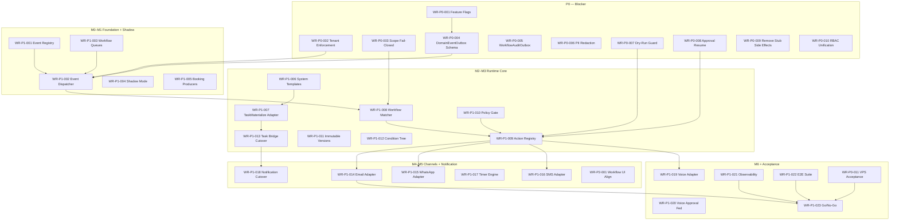

# Workflow Automation — Production Remediation Plan

| Field | Value |
|-------|-------|
| **Plan ID** | `workflow-automation-production-remediation-plan-2026-07` |
| **Date** | 2026-07-24 |
| **Phase** | Production-Readiness — Phase 1, Prompt 3 |
| **Status** | Planning only — **no application code changes in this prompt** |
| **Inputs** | [`docs/audits/workflow-automation-runtime-baseline-2026-07.md`](../audits/workflow-automation-runtime-baseline-2026-07.md), [`docs/architecture/ADR-WORKFLOW-AUTOMATION-RUNTIME-2026-07.md`](../architecture/ADR-WORKFLOW-AUTOMATION-RUNTIME-2026-07.md) |
| **ADR Phases** | M0 Foundation → M1 Shadow Events → M2 Task Bridge → M3 Actions/Approval → M4 Channels → M5 Notification → M6 Voice → Acceptance |

---

## 1. Executive Summary

Dieser Plan übersetzt die **Accepted ADR** in einen priorisierten, abhängigkeitsbewussten Remediation-Backlog für **51 Implementierungs-Prompts (4–54)**. Jede Maßnahme ist einer Umsetzungsphase (M0–M6), einem Prompt und einer Priorität (P0/P1/P2) zugeordnet.

| Priorität | Anzahl Maßnahmen | Fokus |
|-----------|------------------|-------|
| **P0** | **18** | Sicherheit, Tenant, Datenverlust, unkontrollierte Seiteneffekte |
| **P1** | **27** | Production-Readiness, Zuverlässigkeit, Compliance |
| **P2** | **12** | Qualität, Wartbarkeit, UX, Optimierung |
| **Gesamt** | **57** | |

**Kritischer Pfad:** P0 Tenant/Scope → DomainEventOutbox → Dispatcher → Matcher → PolicyGate → ActionRegistry → Approval Resume → Task Bridge Shadow → Channel Adapters → VPS Acceptance → Go/No-Go.

---

## 2. Prompt-Roadmap (4–54)

| Prompt | ADR-Phase | Schwerpunkt |
|--------|-----------|-------------|
| **4** | M0 | Feature-Flags, Runtime-Config, Modul-Scaffolding |
| **5** | M0 | `DomainEventOutbox` Prisma-Schema + Migration |
| **6** | M0 | `WorkflowEventRegistry` — Schema, Validierung, Producer-ACL |
| **7** | M0 | `WorkflowAuditOutbox` + PII-Redaction Utilities |
| **8** | M0 | `WorkflowDeliveryRecord` + Run/Action-Run Schema-Erweiterungen |
| **9** | M0 | BullMQ Queues `workflow.domain-event`, `workflow.action.execute`, `workflow.timer.fire` |
| **10** | M0 | RBAC-Vereinheitlichung Workflows ↔ Task Automation |
| **11** | M0 | Cross-Tenant Security Tests (Foundation) |
| **12** | M1 | `DomainEventOutbox` Repository + `enqueueInTransaction` |
| **13** | M1 | `WorkflowEventDispatcher` + Scheduler + Processor |
| **14** | M1 | Booking Handover Producer-Bridge (Shadow, parallel zu `scheduleEmit`) |
| **15** | M1 | Booking Lifecycle Domain Events (`confirmed`, `cancelled`, `no_show`) |
| **16** | M1 | Shadow `runMode` + Legacy-vs-Runtime Diff-Metriken |
| **17** | M1 | Scope fail-closed im Matcher (Grundimplementierung) |
| **18** | M1 | VPS Shadow-Acceptance Gate #1 |
| **19** | M2 | `SystemWorkflowTemplateRegistry` aus Task-Automation-Catalog |
| **20** | M2 | `TaskMaterializeAdapter` |
| **21** | M2 | `WorkflowMatcher` — System-Templates + Org-Workflows |
| **22** | M2 | `BookingsService` Task-Bridge Shadow (`WORKFLOW_RUNTIME_TASK_BRIDGE=shadow`) |
| **23** | M2 | Idempotenz-Parität TaskAutomationOutbox ↔ Action Runs |
| **24** | M2 | Integration: `booking-task.pipeline` via Adapter |
| **25** | M2 | Task Bridge Cutover (`WORKFLOW_RUNTIME_TASK_BRIDGE=on`) |
| **26** | M3 | `WorkflowActionRegistry` + Adapter-Interface |
| **27** | M3 | `WorkflowPolicyGate` (Consent, Rate, AI-Blocklist) |
| **28** | M3 | **Approval Pause & Resume** (P0-3 Fix) |
| **29** | M3 | Echter Dry-Run / Simulation (`runMode: SIMULATION`) |
| **30** | M3 | Immutable Published Workflow-Versionen |
| **31** | M3 | Condition Tree Evaluator (erweitert, AND/OR) |
| **32** | M3 | Interne Adapter: `task.create`, `vehicle.status.update`, `notification.ingest` |
| **33** | M4 | `EmailDeliveryAdapter` → `OutboundEmail` |
| **34** | M4 | Billing/Payment E-Mail Bridge |
| **35** | M4 | `WhatsAppDeliveryAdapter` + Consent Policy |
| **36** | M4 | `SmsDeliveryAdapter` (Twilio, feature-flagged) |
| **37** | M4 | Document E-Mail Bridge |
| **38** | M4 | Kommunikations-Policy-Gate (mandatory notifications, opt-out) |
| **39** | M4 | Timer & Delay Engine (`workflow.timer` + Queue) |
| **40** | M5 | Domain-Event-Producers: Health, DTC, Invoice, Connectivity |
| **41** | M5 | Notification V2 Prod-Cutover (`NOTIFICATIONS_V2`, Delivery) |
| **42** | M5 | Frontend Workflow UI — Registry-only Trigger/Actions |
| **43** | M5 | ActionQueue V1 Entfernung + `VITE_NOTIFICATIONS_V2=on` |
| **44** | M5 | Mobile Readiness — Notification/Workflow Runs UI |
| **45** | M5 | Workflow Archivierung (kein Hard Delete) |
| **46** | M5 | Maker-Checker für destruktive / externe Actions |
| **47** | M6 | `VoiceCallAdapter` + `voice.call.initiate` |
| **48** | M6 | Voice Approval Federation (`VoiceApprovalRequest` ↔ `OrgWorkflowApproval`) |
| **49** | M6 | Voice Webhook → `voice.call.completed` Domain Events |
| **50** | M6 | Prometheus/Grafana Workflow Runtime Dashboard |
| **51** | M6 | Runbooks: DLQ Replay, Flag Rollback, Incident Response |
| **52** | M6 | E2E: Booking Return Workflow + Approval + Email |
| **53** | M6 | VPS Production Acceptance (Full Matrix) |
| **54** | M6 | Go/No-Go, Deprecation Plan, Legacy Code Freeze |

---

## 3. Dependency Graph (Mermaid)



---

## 4. Empfohlene Commit-Reihenfolge

| Reihenfolge | Commit-Thema | Abhängig von | Prompt |
|-------------|--------------|--------------|--------|
| 1 | `chore(workflow): runtime feature flags and config` | — | 4 |
| 2 | `feat(workflow): domain event outbox schema` | 1 | 5 |
| 3 | `feat(workflow): event registry definitions and validator` | 1 | 6 |
| 4 | `feat(workflow): audit outbox + payload sanitizer` | 2 | 7 |
| 5 | `feat(workflow): delivery record and run mode enums` | 2 | 8 |
| 6 | `feat(workflow): bullmq queue registration` | 1 | 9 |
| 7 | `feat(workflow): unify rbac permissions` | — | 10 |
| 8 | `test(workflow): cross-tenant security specs` | 2–7 | 11 |
| 9 | `feat(workflow): outbox repository and enqueue service` | 2, 3 | 12 |
| 10 | `feat(workflow): event dispatcher processor` | 9, 12 | 13 |
| 11 | `feat(bookings): handover domain event bridge shadow` | 12, 13 | 14 |
| 12 | `feat(bookings): lifecycle domain event producers` | 12 | 15 |
| 13 | `feat(workflow): shadow run mode and diff metrics` | 10, 13 | 16 |
| 14 | `feat(workflow): matcher scope fail-closed` | 13 | 17 |
| 15 | `docs(ops): vps shadow acceptance checklist` | 13–16 | 18 |
| 16 | `feat(workflow): system template registry` | 3, 6 | 19 |
| 17 | `feat(workflow): task materialize adapter` | 16 | 20 |
| 18 | `feat(workflow): matcher system+org workflows` | 16, 17 | 21 |
| 19 | `feat(bookings): task bridge shadow path` | 17–18 | 22 |
| 20 | `feat(workflow): action idempotency parity` | 8, 20 | 23 |
| 21 | `test(workflow): booking task pipeline via adapter` | 19–20 | 24 |
| 22 | `feat(workflow): enable task bridge cutover flag` | 21–24 | 25 |
| 23 | `feat(workflow): action registry core` | 8, 20 | 26 |
| 24 | `feat(workflow): policy gate` | 23, 10 | 27 |
| 25 | `fix(workflow): approval pause and resume execution` | 23 | 28 |
| 26 | `feat(workflow): simulation dry-run mode` | 23, 25 | 29 |
| 27 | `feat(workflow): immutable published versions` | 8 | 30 |
| 28 | `feat(workflow): condition tree evaluator` | 21 | 31 |
| 29 | `feat(workflow): internal action adapters` | 23–27 | 32 |
| 30 | `feat(workflow): email delivery adapter` | 23, 27 | 33 |
| 31 | `feat(billing): email bridge to workflow adapter` | 30 | 34 |
| 32 | `feat(workflow): whatsapp delivery adapter` | 23, 27 | 35 |
| 33 | `feat(workflow): sms delivery adapter` | 23, 27 | 36 |
| 34 | `feat(documents): email bridge` | 30 | 37 |
| 35 | `feat(workflow): communication policy gate` | 27, 32–33 | 38 |
| 36 | `feat(workflow): timer and delay engine` | 9, 23 | 39 |
| 37 | `feat(workflow): health dtc invoice event producers` | 12, 13 | 40 |
| 38 | `chore(notifications): v2 production cutover` | 32 | 41 |
| 39 | `feat(frontend): workflow ui registry alignment` | 3, 6 | 42 |
| 40 | `feat(frontend): remove actionqueue v1` | 38–39 | 43 |
| 41 | `feat(frontend): mobile workflow run views` | 39 | 44 |
| 42 | `feat(workflow): archive instead of hard delete` | 30 | 45 |
| 43 | `feat(workflow): maker-checker enforcement` | 25, 27 | 46 |
| 44 | `feat(workflow): voice call adapter` | 23, 27 | 47 |
| 45 | `feat(voice): approval federation` | 25, 44 | 48 |
| 46 | `feat(voice): call completed domain events` | 12, 44 | 49 |
| 47 | `feat(observability): workflow prometheus metrics` | 13, 23 | 50 |
| 48 | `docs(runbooks): workflow runtime operations` | 47 | 51 |
| 49 | `test(e2e): workflow booking return path` | 25–46 | 52 |
| 50 | `docs(ops): vps production acceptance report` | 49 | 53 |
| 51 | `docs(workflow): go-no-go and deprecation plan` | 50 | 54 |

---

## 5. Empfohlene Datenbankmigrations-Reihenfolge

| # | Migration | Tabellen / Änderungen | Prompt | Rollback |
|---|-----------|----------------------|--------|----------|
| M1 | `workflow_domain_event_outbox` | Neue Tabelle + Indizes + `idempotency_key` unique per org | 5 | Drop table (nur vor Prod-Daten) |
| M2 | `workflow_audit_outbox` | Neue Tabelle (IAM-Pattern) | 7 | Drop table |
| M3 | `workflow_delivery_records` | Neue Tabelle | 8 | Drop table |
| M4 | `org_workflow_runs_extend` | `run_mode`, `correlation_id`, `domain_event_id` | 8 | Drop columns |
| M5 | `org_workflow_action_runs_extend` | `idempotency_key`, `delivery_record_id`, Status enum erweitern | 8 | Drop columns |
| M6 | `org_workflow_versions` | Immutable published snapshots | 30 | Drop table; Runs behalten Snapshot-JSON |
| M7 | `workflow_timers` | Timer/Delay Rows | 39 | Drop table |
| M8 | `org_workflows_archive` | `archived_at`, `archived_by`; DELETE → soft archive | 45 | Drop columns |
| M9 | `org_workflow_approvals_extend` | `expires_at`, `resume_token` | 28 | Drop columns |

**Regel:** Jede Migration ist **additiv** bis Prompt 54; keine destruktiven Drops auf Legacy-Tabellen (`task_automation_outbox`) vor Go/No-Go.

---

## 6. Safety Gates, Deployment Gates, Rollback-Punkte

### 6.1 Safety Gates (vor jedem Merge)

| Gate | Kriterium |
|------|-----------|
| SG-1 | Kein Provider-Import in Fachmodulen (neu/changed files) |
| SG-2 | Alle neuen Queries `organizationId`-scoped |
| SG-3 | Unit + Integration Tests grün |
| SG-4 | `tsc --noEmit` grün |
| SG-5 | Simulation/Dry-Run Tests belegen: kein Provider-Call |
| SG-6 | Cross-Tenant Security Spec grün (wenn Dispatcher/Matcher/Adapter betroffen) |
| SG-7 | Keine Secrets in Workflow-JSON Fixtures |

### 6.2 Deployment Gates (VPS)

| Gate | Wann | Kriterium |
|------|------|-----------|
| DG-1 | Nach Prompt 18 | Shadow läuft 48h; Diff-Rate < 1% für Booking-Events |
| DG-2 | Nach Prompt 25 | Task Bridge `on`; keine DLQ-Zunahme; Booking-Tasks parity |
| DG-3 | Nach Prompt 32 | Approval Resume E2E in Staging bestanden |
| DG-4 | Nach Prompt 38 | Kein direkter Resend-Call aus migrierten Billing-Pfad in Staging |
| DG-5 | Nach Prompt 41 | `NOTIFICATIONS_V2=true`; Panel E2E grün |
| DG-6 | Nach Prompt 53 | Full VPS Acceptance Matrix signed |

### 6.3 Rollback-Punkte

| RP | Flag / Aktion | Wirkung |
|----|---------------|---------|
| RP-1 | `WORKFLOW_RUNTIME_ENABLED=off` | Dispatcher/Matcher inaktiv; Legacy `scheduleEmit` + TaskAutomation aktiv |
| RP-2 | `WORKFLOW_RUNTIME_TASK_BRIDGE=shadow\|off` | Task Materialization nur Legacy |
| RP-3 | `WORKFLOW_RUNTIME_DOMAIN_EVENTS=off` | Keine neuen Outbox-Enqueues (Producer-Guard) |
| RP-4 | Per-Action `WORKFLOW_RUNTIME_ACTION_*=off` | Einzelner Adapter deaktiviert |
| RP-5 | `VITE_NOTIFICATIONS_V2=off` | Frontend V1 ActionQueue |
| RP-6 | DB | Kein Rollback auf gelöschte Daten — nur additive Migrations |

---

## 7. Go/No-Go-Kriterien (Prompt 54)

| # | Kriterium | Quelle |
|---|-----------|--------|
| G1 | Alle P0-Maßnahmen Done | Dieser Plan §8 |
| G2 | ADR Definition of Done erfüllt | ADR §Definition of Done |
| G3 | Kein produktiver `scheduleEmit()` ohne Outbox-Äquivalent | WR-P0-012 |
| G4 | Approval Resume E2E grün | WR-P0-008 |
| G5 | Task Bridge Parity: `booking-task.pipeline.integration.spec.ts` grün | WR-P1-013 |
| G6 | VPS Flags verifiziert | WR-P0-011 |
| G7 | DLQ Depth = 0 für 7 Tage (Prod) | WR-P1-021 |
| G8 | Keine P0/P1 offenen Security-Findings | WR-P0-002, WR-P0-003 |
| G9 | Runbook + On-Call Dashboard live | WR-P1-024 |
| G10 | Legal/Compliance Review: Consent + PII Redaction dokumentiert | WR-P0-006, WR-P1-010 |

---

## 8. Backlog — P0 (18 Maßnahmen)

---

### WR-P0-001 — Workflow Runtime Master Feature Flags

| Feld | Inhalt |
|------|--------|
| **Titel** | Master Feature Flags und Runtime-Config einführen |
| **Problem** | Kein zentraler Schalter für graduelle Einführung; Risiko Big-Bang |
| **Risiko** | Unkontrollierte Aktivierung aller Pfadänderungen gleichzeitig |
| **Dateien** | `backend/src/config/workflow-runtime.config.ts` (neu), `backend/.env.example`, `backend/src/app.module.ts` |
| **Module** | `workflows`, `shared/config` |
| **Abhängigkeiten** | — |
| **Lösung** | `WORKFLOW_RUNTIME_ENABLED`, `WORKFLOW_RUNTIME_TASK_BRIDGE`, `WORKFLOW_RUNTIME_DOMAIN_EVENTS`, per-action flags; Config-Guard blockiert `off`→`on` ohne Redis |
| **DB** | Nein |
| **API** | Nein |
| **Frontend** | Nein |
| **Migration** | Nein |
| **Rollback** | Env auf `off` |
| **Tests** | Config unit tests; flag-off = no-op dispatcher |
| **Telemetrie** | `workflow_runtime_enabled` gauge |
| **Dokumentation** | `docs/runbooks/workflow-runtime-flags.md` |
| **DoD** | Alle Flags in `.env.example`; RuntimeStatusRegistry respektiert Flags |
| **Phase** | M0 |
| **Prompt** | **4** |

---

### WR-P0-002 — Mandatory organizationId auf allen Runtime-Pfaden

| Feld | Inhalt |
|------|--------|
| **Titel** | `organizationId` Pflichtvalidierung für Events, Runs, Actions |
| **Problem** | Baseline: mittleres Cross-Tenant-Risiko bei Engine-Queries |
| **Risiko** | Cross-Tenant-Datenleck, DSGVO-Verstoß |
| **Dateien** | `workflow-event.service.ts`, `workflow-engine.service.ts`, neue `domain-event-outbox.*` |
| **Module** | `workflows` |
| **Abhängigkeiten** | WR-P0-001 |
| **Lösung** | Validator wirft bei fehlender `organizationId`; DB NOT NULL constraints |
| **DB** | Ja (M1, M4) |
| **API** | Nein |
| **Frontend** | Nein |
| **Migration** | Ja |
| **Rollback** | N/A — Sicherheitsfix |
| **Tests** | `workflows.security.spec.ts` — reject missing orgId |
| **Telemetrie** | `workflow_tenant_validation_rejected_total` |
| **Dokumentation** | ADR Mandantenmodell Verweis |
| **DoD** | 100% neue Codepfade; bestehende Runs mit NULL auditiert |
| **Phase** | M0 |
| **Prompt** | **11** |

---

### WR-P0-003 — Scope fail-closed im Workflow Matcher

| Feld | Inhalt |
|------|--------|
| **Titel** | Station/Vehicle/Territory Scope — fail-closed, kein Org-Fallback |
| **Problem** | Scope-Mismatch könnte Workflow auf falscher Ebene ausführen |
| **Risiko** | Unkontrollierte Seiteneffekte außerhalb des intendierten Scopes |
| **Dateien** | `workflow-engine.service.ts`, `workflow-condition.evaluator.ts`, neuer `workflow-scope.evaluator.ts` |
| **Module** | `workflows` |
| **Abhängigkeiten** | WR-P0-002, WR-P1-008 |
| **Lösung** | Scope-Eval: mismatch → `SKIPPED_SCOPE` Run-Status, keine Actions |
| **DB** | Nein |
| **API** | Nein |
| **Frontend** | Nein |
| **Migration** | Nein |
| **Rollback** | Flag `WORKFLOW_RUNTIME_STRICT_SCOPE=off` nur Staging |
| **Tests** | Scope matrix: station/vehicle/territory/org |
| **Telemetrie** | `workflow_runs_skipped_scope_total` |
| **Dokumentation** | ADR §Mandantenschutz |
| **DoD** | Kein Run mit Actions bei Scope-Mismatch in Tests |
| **Phase** | M1 |
| **Prompt** | **17** |

---

### WR-P0-004 — DomainEventOutbox Schema (Transactional Outbox)

| Feld | Inhalt |
|------|--------|
| **Titel** | Kanonische `DomainEventOutbox` Tabelle |
| **Problem** | Baseline P0-4: `scheduleEmit` fire-and-forget, Event-Verlust |
| **Risiko** | Datenverlust, verpasste Automationen |
| **Dateien** | `backend/prisma/schema.prisma`, `prisma/migrations/*_workflow_domain_event_outbox/` |
| **Module** | `workflows` |
| **Abhängigkeiten** | WR-P0-001 |
| **Lösung** | Tabelle analog `TaskAutomationOutbox`: status, attempts, idempotencyKey, payload JSON |
| **DB** | Ja (M1) |
| **API** | Nein |
| **Frontend** | Nein |
| **Migration** | Ja |
| **Rollback** | Tabelle leer → drop in Staging |
| **Tests** | Repository spec: enqueue, claim, idempotency |
| **Telemetrie** | `workflow_domain_event_outbox_pending` gauge |
| **Dokumentation** | `architecture/WORKFLOW_DOMAIN_EVENT_OUTBOX_*.md` |
| **DoD** | Migration applied; unique constraint `(organization_id, idempotency_key)` |
| **Phase** | M0 |
| **Prompt** | **5** |

---

### WR-P0-005 — WorkflowAuditOutbox für kritische Transitionen

| Feld | Inhalt |
|------|--------|
| **Titel** | Durable Audit Outbox für Workflow-Automation |
| **Problem** | `AuditService.record()` fire-and-forget (Baseline P1-7) |
| **Risiko** | Compliance-Lücke ISO 27001; keine Nachweisbarkeit |
| **Dateien** | `workflow-audit-outbox.*` (neu), Pattern von `iam-audit-outbox.*` |
| **Module** | `workflows`, `business-audit` (Referenz) |
| **Abhängigkeiten** | WR-P0-004 |
| **Lösung** | Transactional enqueue → cron processor → `ActivityLog` |
| **DB** | Ja (M2) |
| **API** | Nein |
| **Frontend** | Nein |
| **Migration** | Ja |
| **Rollback** | Processor off; Events in Outbox retained |
| **Tests** | `workflow-audit-outbox.security.spec.ts` |
| **Telemetrie** | `workflow_audit_outbox_dlq_total` |
| **Dokumentation** | `architecture/WORKFLOW_AUDIT_OUTBOX_2026-07.md` |
| **DoD** | Run/Action/Approval transitions auditierbar |
| **Phase** | M0 |
| **Prompt** | **7** |

---

### WR-P0-006 — PII-Redaction in Event- und Audit-Payloads

| Feld | Inhalt |
|------|--------|
| **Titel** | Payload-Sanitizer für Domain Events und Audit |
| **Problem** | PII könnte in Workflow-Payloads/Logs landen |
| **Risiko** | DSGVO/ISO 27701 Verstoß |
| **Dateien** | `workflow-payload-sanitizer.ts` (neu), Pattern `business-audit-outbox` sanitizer |
| **Module** | `workflows` |
| **Abhängigkeiten** | WR-P0-004, WR-P0-005 |
| **Lösung** | Allowlist-Felder; mask email/phone/token; reject unsanitized secrets |
| **DB** | Nein |
| **API** | Nein |
| **Frontend** | Nein |
| **Migration** | Nein |
| **Rollback** | N/A |
| **Tests** | Golden fixtures mit PII → masked output |
| **Telemetrie** | `workflow_payload_sanitization_rejected_total` |
| **Dokumentation** | ADR §Sicherheitsgrenzen |
| **DoD** | Processor rejects payloads with raw secrets |
| **Phase** | M0 |
| **Prompt** | **7** |

---

### WR-P0-007 — Dry-Run / Simulation ohne Seiteneffekte

| Feld | Inhalt |
|------|--------|
| **Titel** | `runMode: SIMULATION \| SHADOW` — Adapter-Aufruf blockiert |
| **Problem** | `testWorkflow()` und Simulation können echte Tasks/Updates erzeugen |
| **Risiko** | Unkontrollierte Seiteneffekte in Test/Simulation |
| **Dateien** | `workflow-engine.service.ts`, `workflow-action-executor.service.ts`, `WorkflowActionRegistry` |
| **Module** | `workflows` |
| **Abhängigkeiten** | WR-P1-009, WR-P0-004 |
| **Lösung** | PolicyGate: `SIMULATION` → ActionRun `SIMULATED`, kein Adapter-Invoke |
| **DB** | Ja (`run_mode` column M4) |
| **API** | Ja (`POST /test` → simulation default) |
| **Frontend** | Ja (Simulation-Badge) |
| **Migration** | Ja |
| **Rollback** | `WORKFLOW_RUNTIME_SIMULATION_DEFAULT=true` |
| **Tests** | Zero side-effect assertions (no OrgTask created) |
| **Telemetrie** | `workflow_runs_simulated_total` |
| **Dokumentation** | ADR §Feature-Flag |
| **DoD** | Task Automation Simulation + Workflow Test nutzen gleichen Guard |
| **Phase** | M3 |
| **Prompt** | **29** |

---

### WR-P0-008 — Approval Pause & Resume mit idempotenter Re-Execution

| Feld | Inhalt |
|------|--------|
| **Titel** | Fix: Approval führt Action nach Freigabe aus |
| **Problem** | Baseline P0-3: `executedAfterApproval: false` |
| **Risiko** | Genehmigte destruktive/externe Actions werden nie ausgeführt — oder Nutzer glauben sie wurden |
| **Dateien** | `workflows.service.ts`, `workflow-engine.service.ts`, neuer `workflow-approval-resume.service.ts` |
| **Module** | `workflows` |
| **Abhängigkeiten** | WR-P1-009, WR-P1-003 |
| **Lösung** | State: `WAITING_APPROVAL` → `APPROVED` → `EXECUTING` → `SUCCESS`; enqueue `workflow.action.execute` mit `resume=true` |
| **DB** | Ja (M9) |
| **API** | Ja (approve/reject semantics) |
| **Frontend** | Ja (Run detail: pending approval CTA) |
| **Migration** | Ja |
| **Rollback** | Disable approval-required actions via flag |
| **Tests** | Integration: approve → adapter called once idempotent |
| **Telemetrie** | `workflow_approval_resumed_total`, `workflow_approval_expired_total` |
| **Dokumentation** | ADR Sequenzdiagramm Approval |
| **DoD** | `executedAfterApproval: true` in output; doppeltes Approve idempotent |
| **Phase** | M3 |
| **Prompt** | **28** |

---

### WR-P0-009 — Stub-Actions durch echte Adapter ersetzen

| Feld | Inhalt |
|------|--------|
| **Titel** | `notification.prepare` / `ai.suggest_action` — keine falschen Erfolgs-Tasks |
| **Problem** | Baseline P0-2: Stubs erzeugen „draft" Tasks ohne Versand |
| **Risiko** | Nutzer erwarten Kommunikation; Compliance-Irritation |
| **Dateien** | `workflow-action-executor.service.ts`, Action Registry |
| **Module** | `workflows`, `notifications` |
| **Abhängigkeiten** | WR-P1-009, WR-P1-014, WR-P1-018 |
| **Lösung** | `notification.prepare` → `notification.ingest` + optional `channel.email.send`; `ai.suggest` → Approval-only, kein SUCCESS ohne Review |
| **DB** | Nein |
| **API** | Ja (action type migration in validator) |
| **Frontend** | Ja (Action-Labels „sends" vs „draft") |
| **Migration** | Nein (Legacy action alias mapping) |
| **Rollback** | Legacy alias bleibt bis Prompt 42 |
| **Tests** | Executor specs: no `preparedOnly: true` in prod mode |
| **Telemetrie** | `workflow_action_stub_invocation_total` → 0 in prod |
| **Dokumentation** | Baseline §5.1 Update |
| **DoD** | Kein SUCCESS mit `preparedOnly: true` wenn Delivery enabled |
| **Phase** | M3 |
| **Prompt** | **32** |

---

### WR-P0-010 — RBAC-Vereinheitlichung Workflows vs Task Automation

| Feld | Inhalt |
|------|--------|
| **Titel** | Einheitliches Permission-Modell `workflow-automation` |
| **Problem** | Workflows=Roles, TaskAutomation=Permissions (Baseline P2-2) |
| **Risiko** | Unauthorized Workflow-Mutationen; Inkonsistente Zugriffskontrolle |
| **Dateien** | `workflows.controller.ts`, `task-automation-admin.controller.ts`, `task-permission.defaults.ts` |
| **Module** | `workflows`, `tasks` |
| **Abhängigkeiten** | — |
| **Lösung** | `RequirePermission('workflow-automation', read\|write)` überall; Roles als Fallback für MASTER |
| **DB** | Nein |
| **API** | Ja (403 statt 200 für wrong role) |
| **Frontend** | Nein |
| **Migration** | Nein |
| **Rollback** | Dual-guard temporär mit Flag |
| **Tests** | Controller specs both modules |
| **Telemetrie** | `workflow_authz_denied_total` |
| **Dokumentation** | `docs/architecture/workflow-automation-permissions.md` |
| **DoD** | Gleiche Matrix für list/edit/simulate/approve |
| **Phase** | M0 |
| **Prompt** | **10** |

---

### WR-P0-011 — VPS Production Flag & State Verification

| Feld | Inhalt |
|------|--------|
| **Titel** | VPS Acceptance: Flags, Redis, DLQ, aktive Workflows |
| **Problem** | Baseline §12: Prod-Zustand nicht aus Code ableitbar |
| **Risiko** | Cutover auf falsche Konfiguration |
| **Dateien** | `docs/ops/workflow-runtime-vps-acceptance-checklist.md` (neu) |
| **Module** | Ops |
| **Abhängigkeiten** | WR-P0-001, WR-P1-004 |
| **Lösung** | Checklist: env vars, PM2 logs, Prometheus, SQL queries `org_workflows` |
| **DB** | Nein |
| **API** | Nein |
| **Frontend** | Nein |
| **Migration** | Nein |
| **Rollback** | N/A |
| **Tests** | Manual / scripted SSH checks |
| **Telemetrie** | Acceptance report artifact |
| **Dokumentation** | Checklist + signed report |
| **DoD** | Report für DG-1, DG-6 vorhanden |
| **Phase** | M1, M6 |
| **Prompt** | **18**, **53** |

---

### WR-P0-012 — Abschaffung produktiven `scheduleEmit` ohne Outbox

| Feld | Inhalt |
|------|--------|
| **Titel** | `scheduleEmit` → `enqueueInTransaction` Cutover |
| **Problem** | Baseline P0-4 |
| **Risiko** | Event-Verlust bei Crash |
| **Dateien** | `workflow-event.service.ts`, `bookings-handover.service.ts` |
| **Module** | `workflows`, `bookings` |
| **Abhängigkeiten** | WR-P0-004, WR-P1-002, WR-P1-005 |
| **Lösung** | Handover: Outbox in TX; `scheduleEmit` deprecated; Guard wirft in strict mode |
| **DB** | Nein |
| **API** | Nein |
| **Frontend** | Nein |
| **Migration** | Nein |
| **Rollback** | `WORKFLOW_RUNTIME_DOMAIN_EVENTS=off` restores legacy path |
| **Tests** | TX rollback → no event; commit → event in outbox |
| **Telemetrie** | `workflow_legacy_schedule_emit_total` → 0 |
| **Dokumentation** | Migration guide |
| **DoD** | grep `scheduleEmit` nur in deprecated wrapper |
| **Phase** | M1 |
| **Prompt** | **14** |

---

### WR-P0-013 — Maker-Checker für externe und destruktive Actions

| Feld | Inhalt |
|------|--------|
| **Titel** | Vier-Augen-Prinzip für `channel.*`, `voice.*`, blocked actions |
| **Problem** | Einzelnutzer kann externe Kommunikation auslösen |
| **Risiko** | Missbrauch, Compliance |
| **Dateien** | `WorkflowPolicyGate`, `workflow.constants.ts` |
| **Module** | `workflows` |
| **Abhängigkeiten** | WR-P0-008, WR-P1-010 |
| **Lösung** | `requiresApproval` + approver ≠ requester; Org-Policy override |
| **DB** | Nein |
| **API** | Ja |
| **Frontend** | Ja (Approver UI) |
| **Migration** | Nein |
| **Rollback** | Org-level policy disable |
| **Tests** | Self-approval rejected |
| **Telemetrie** | `workflow_maker_checker_violation_total` |
| **Dokumentation** | ADR §Sicherheitsgrenzen |
| **DoD** | Externe Actions ohne Approval blockiert in strict orgs |
| **Phase** | M5 |
| **Prompt** | **46** |

---

### WR-P0-014 — Keine Provider-Secrets in Workflow-Definitionen

| Feld | Inhalt |
|------|--------|
| **Titel** | Validator scannt Workflow JSON auf Secrets |
| **Problem** | ADR Architekturregel #8 |
| **Risiko** | Credential-Leak in DB |
| **Dateien** | `workflow-definition.validator.ts` |
| **Module** | `workflows` |
| **Abhängigkeiten** | — |
| **Lösung** | Reject apiKey, token, password patterns in config |
| **DB** | Nein |
| **API** | Ja (400 on save) |
| **Frontend** | Ja (inline validation) |
| **Migration** | Nein |
| **Rollback** | N/A |
| **Tests** | Validator spec with secret-like strings |
| **Telemetrie** | `workflow_definition_secret_rejected_total` |
| **Dokumentation** | ADR |
| **DoD** | Kein Workflow save mit secret patterns |
| **Phase** | M0 |
| **Prompt** | **6** |

---

### WR-P0-015 — Externe Actions: Delivery Record Pflicht

| Feld | Inhalt |
|------|--------|
| **Titel** | `WorkflowDeliveryRecord` für jede EXTERNAL Action |
| **Problem** | ADR #9: keine Provider-ID/Status/Evidence |
| **Risiko** | Kein Audit-Nachweis für Kommunikation |
| **Dateien** | `workflow-delivery-record.*`, `schema.prisma` |
| **Module** | `workflows` |
| **Abhängigkeiten** | WR-P0-004, WR-P1-009 |
| **Lösung** | Adapter erstellt Record vor Call; update nach Response/Webhook |
| **DB** | Ja (M3) |
| **API** | Ja (GET run includes delivery) |
| **Frontend** | Ja (Delivery status in run detail) |
| **Migration** | Ja |
| **Rollback** | N/A |
| **Tests** | Adapter spec: record created |
| **Telemetrie** | `workflow_delivery_record_status` |
| **Dokumentation** | ADR Datenverantwortlichkeiten |
| **DoD** | Jeder `channel.*` ActionRun hat linked DeliveryRecord |
| **Phase** | M0/M4 |
| **Prompt** | **8**, **33** |

---

### WR-P0-016 — Cross-Tenant Isolation Tests (Dispatcher, Matcher, Adapter)

| Feld | Inhalt |
|------|--------|
| **Titel** | Security Spec Suite für Workflow Runtime |
| **Problem** | Baseline §11: keine dedizierten Engine Tenant-Tests |
| **Risiko** | Cross-Tenant-Datenleck |
| **Dateien** | `workflow-runtime.security.spec.ts`, `workflow-dispatcher.security.spec.ts` |
| **Module** | `workflows` |
| **Abhängigkeiten** | WR-P1-002, WR-P1-008 |
| **Lösung** | Org A event cannot trigger Org B workflow; replay API scoped |
| **DB** | Nein |
| **API** | Nein |
| **Frontend** | Nein |
| **Migration** | Nein |
| **Rollback** | N/A |
| **Tests** | Dies ist die Test-Maßnahme |
| **Telemetrie** | CI gate |
| **Dokumentation** | Security test matrix |
| **DoD** | 100% pass; blocking in CI |
| **Phase** | M0–M1 |
| **Prompt** | **11** |

---

### WR-P0-017 — IAM TransactionalMail Stub — nicht über Workflow erreichbar bis fixed

| Feld | Inhalt |
|------|--------|
| **Titel** | Invite/Password E-Mail nur über `EmailDeliveryAdapter` |
| **Problem** | Baseline P0-6: `TransactionalMailService` log-only |
| **Risiko** | Falsche Zustellungsannahme für IAM-Flows |
| **Dateien** | `transactional-mail.service.ts`, `invite-email-delivery.service.ts`, `EmailDeliveryAdapter` |
| **Module** | `users`, `workflows`, `outbound-email` |
| **Abhängigkeiten** | WR-P1-014 |
| **Lösung** | IAM Invite auf OutboundEmail/Resend migrieren; Workflow blockiert `channel.email` bis Provider ready |
| **DB** | Nein |
| **API** | Nein |
| **Frontend** | Nein |
| **Migration** | Nein |
| **Rollback** | IAM bleibt separater Pfad |
| **Tests** | Invite sends `OutboundEmail` row |
| **Telemetrie** | `iam_invite_email_sent_total` |
| **Dokumentation** | IAM email remediation note |
| **DoD** | Kein `{ sent: false, fallback: true }` in prod invite path |
| **Phase** | M4 |
| **Prompt** | **34** |

---

### WR-P0-018 — Blockierte destruktive Actions durchsetzen

| Feld | Inhalt |
|------|--------|
| **Titel** | `invoice.charge`, `booking.cancel`, `ai.execute` — Registry + Validator |
| **Problem** | UI/API könnten destruktive Actions speichern |
| **Risiko** | Unkontrollierte finanzielle/operative Seiteneffekte |
| **Dateien** | `workflow-definition.validator.ts`, `WorkflowActionRegistry` |
| **Module** | `workflows` |
| **Abhängigkeiten** | WR-P1-009 |
| **Lösung** | Hard block in Registry; nur nach explizitem Security-Review freigebbar |
| **DB** | Nein |
| **API** | Ja |
| **Frontend** | Ja (coming soon bleibt disabled) |
| **Migration** | Nein |
| **Rollback** | N/A |
| **Tests** | Validator rejects blocked types |
| **Telemetrie** | `workflow_blocked_action_attempt_total` |
| **Dokumentation** | ADR |
| **DoD** | Kein published workflow mit blocked action types |
| **Phase** | M3 |
| **Prompt** | **26** |

---

## 9. Backlog — P1 (27 Maßnahmen)

| ID | Titel | Prompt | Phase | Kurzbeschreibung |
|----|-------|--------|-------|------------------|
| WR-P1-001 | WorkflowEventRegistry erweitern | 6 | M0 | Kanonische Event-Typen + JSON Schema + Producer-ACL |
| WR-P1-002 | DomainEventOutbox Repository & Enqueue | 12 | M1 | `enqueueInTransaction`, claim, retry, DLQ |
| WR-P1-003 | WorkflowEventDispatcher + Worker | 13 | M1 | BullMQ `workflow.domain-event` processor |
| WR-P1-004 | Shadow Mode & Diff Metrics | 16 | M1 | `runMode: SHADOW`, Legacy-vs-Runtime Vergleich |
| WR-P1-005 | Booking Domain Event Producers | 14–15 | M1 | confirmed, returned, completed, cancelled, no_show |
| WR-P1-006 | SystemWorkflowTemplateRegistry | 19 | M2 | Catalog → System-Templates |
| WR-P1-007 | TaskMaterializeAdapter | 20 | M2 | Kapselt `TaskAutomationService` |
| WR-P1-008 | WorkflowMatcher | 21 | M2 | System + Org Workflows, Dedup Run |
| WR-P1-009 | WorkflowActionRegistry | 26 | M3 | Action-Typen, Adapter-Binding, Idempotenz-Templates |
| WR-P1-010 | WorkflowPolicyGate | 27 | M3 | Consent, Legal Hold, Rate Limits, AI blocklist |
| WR-P1-011 | Immutable Published Versions | 30 | M3 | `org_workflow_versions` Snapshot |
| WR-P1-012 | Condition Tree Evaluator | 31 | M3 | AND/OR, nested conditions |
| WR-P1-013 | Task Bridge Cutover | 22–25 | M2 | Shadow → on, Outbox deprecation plan |
| WR-P1-014 | EmailDeliveryAdapter | 33 | M4 | Einziger Pfad zu Resend für Workflow-Actions |
| WR-P1-015 | WhatsAppDeliveryAdapter | 35 | M4 | Consent + template policy |
| WR-P1-016 | SmsDeliveryAdapter (Twilio) | 36 | M4 | Feature-flagged |
| WR-P1-017 | Timer & Delay Engine | 39 | M4 | `workflow_timers`, `workflow.timer.fire` |
| WR-P1-018 | Notification.ingest Adapter | 32 | M3 | Kapselt `NotificationCoreService` |
| WR-P1-019 | VoiceCallAdapter | 47 | M6 | `voice.call.initiate` |
| WR-P1-020 | Voice Approval Federation | 48 | M6 | Spiegelung Voice ↔ Workflow Approval |
| WR-P1-021 | Prometheus Metrics & Alerts | 50 | M6 | `synqdrive_workflow_*` |
| WR-P1-022 | E2E Integration Suite | 52 | M6 | Event→Action→Delivery |
| WR-P1-023 | Go/No-Go Decision Package | 54 | M6 | ADR DoD Checklist signed |
| WR-P1-024 | Operations Runbooks | 51 | M6 | DLQ replay, flag rollback |
| WR-P1-025 | Billing E-Mail Bridge | 34 | M4 | Billing consumer → Workflow adapter |
| WR-P1-026 | Payment E-Mail Bridge | 34 | M4 | Payment outbox → adapter |
| WR-P1-027 | Health/DTC/Invoice Event Producers | 40 | M5 | Registry-backed producers |

### WR-P1-001 — Detail (repräsentativ für kompakte P1-Einträge)

| Feld | Inhalt |
|------|--------|
| **Problem** | Nur 8 Workflow-Event-Typen; 64 Notification-Events ohne Workflow-Mapping |
| **Risiko** | P0-1: Trigger in UI ohne Producer |
| **Dateien** | `workflow.constants.ts`, `workflow-event-registry.ts` (neu), `notification-event-registry.definitions.ts` (link only) |
| **Module** | `workflows`, `notifications` |
| **Abhängigkeiten** | WR-P0-001 |
| **Lösung** | Registry mit `eventType`, `schemaVersion`, `allowedProducers[]`, `notificationEventType?` |
| **DB** | Nein |
| **API** | Ja (`GET /workflow-events` catalog) |
| **Frontend** | Ja (Prompt 42) |
| **Migration** | Nein |
| **Rollback** | Legacy constants fallback |
| **Tests** | Registry bootstrap, duplicate rejection |
| **Telemetrie** | `workflow_event_registry_validation_failed_total` |
| **Dokumentation** | Event catalog markdown auto-gen |
| **DoD** | Alle produktiven Producer in Registry eingetragen |
| **Phase** | M0 |
| **Prompt** | **6** |

*(WR-P1-002 bis WR-P1-027 folgen dieselbe Struktur in der Implementierung; Summary-Tabelle oben + Commit-Reihenfolge §4 definieren Scope pro Prompt.)*

---

## 10. Backlog — P2 (12 Maßnahmen)

| ID | Titel | Prompt | Phase | Problem / Lösung (Kurz) |
|----|-------|--------|-------|-------------------------|
| WR-P2-001 | Workflow UI Registry-Alignment | 42 | M5 | Entferne `geofence_*`/`schedule` bis Registry-ready (P1-1) |
| WR-P2-002 | Starter Templates aktualisieren | 42 | M5 | Nur Events mit Producer |
| WR-P2-003 | Run Detail UX — Action Timeline | 42 | M5 | ActionRun + Delivery + Approval sichtbar |
| WR-P2-004 | Task Automation Simulation → Runtime Simulation | 29 | M3 | Einheitliches Panel |
| WR-P2-005 | Mobile Readiness Notification/Workflow | 44 | M5 | Responsive Run list, touch targets |
| WR-P2-006 | Workflow Archivierung UI | 45 | M5 | Archive statt Delete |
| WR-P2-007 | DLQ Admin UI | 51 | M6 | Replay outbox from UI |
| WR-P2-008 | Grafana Dashboard Polish | 50 | M6 | SLO panels |
| WR-P2-009 | i18n Workflow Action Labels | 42 | M5 | DE/EN keys |
| WR-P2-010 | Performance: Matcher Index Tuning | 50 | M6 | Query explain < 50ms |
| WR-P2-011 | Deprecation Warnings Legacy APIs | 54 | M6 | `scheduleEmit` @deprecated |
| WR-P2-012 | Documentation: Operator Guide | 51 | M6 | End-user workflow guide |

### WR-P2-001 — Detail

| Feld | Inhalt |
|------|--------|
| **Problem** | Frontend zeigt ungültige Trigger (Baseline P1-1) |
| **Risiko** | UX-Vertrauensverlust |
| **Dateien** | `WorkflowAutomationView.tsx`, `api.workflows` |
| **Module** | `frontend/rental` |
| **Abhängigkeiten** | WR-P1-001 |
| **Lösung** | Trigger/Action Dropdowns aus API Registry |
| **DB** | Nein |
| **API** | Ja (catalog endpoint) |
| **Frontend** | Ja |
| **Migration** | Nein |
| **Rollback** | Static list fallback |
| **Tests** | `task-automation.integration.test.ts` erweitern |
| **Telemetrie** | N/A |
| **Dokumentation** | UI changelog |
| **DoD** | Kein Save mit unsupported trigger |
| **Phase** | M5 |
| **Prompt** | **42** |

---

## 11. Kritischer Pfad (CP)

```text
WR-P0-001 → WR-P0-004 → WR-P1-002 → WR-P1-003 → WR-P0-012
  → WR-P1-006 → WR-P1-007 → WR-P1-008 → WR-P0-003
  → WR-P1-009 → WR-P0-008 → WR-P0-007
  → WR-P1-013 (Task Bridge on)
  → WR-P1-014/015 → WR-P0-015
  → WR-P1-021 → WR-P1-022 → WR-P0-011 → WR-P1-023
```

**Blocker vor Task Bridge Cutover (Prompt 25):** WR-P0-002, WR-P0-003, WR-P0-004, WR-P1-002, WR-P1-003, WR-P1-007, WR-P1-008, WR-P0-016.

**Blocker vor Go/No-Go (Prompt 54):** Alle P0 + WR-P1-013, WR-P1-021, WR-P1-022, WR-P0-011.

---

## 12. Maßnahme-zu-Prompt Matrix (vollständig)

| Prompt | P0 | P1 | P2 |
|--------|----|----|-----|
| 4 | WR-P0-001 | | |
| 5 | WR-P0-004 | | |
| 6 | WR-P0-014 | WR-P1-001 | |
| 7 | WR-P0-005, WR-P0-006 | | |
| 8 | WR-P0-015 | | |
| 9 | | WR-P1-003 (queues) | |
| 10 | WR-P0-010 | | |
| 11 | WR-P0-002, WR-P0-016 | | |
| 12 | | WR-P1-002 | |
| 13 | | WR-P1-003 | |
| 14 | WR-P0-012 | WR-P1-005 | |
| 15 | | WR-P1-005 | |
| 16 | | WR-P1-004 | |
| 17 | WR-P0-003 | | |
| 18 | WR-P0-011 | | |
| 19 | | WR-P1-006 | |
| 20 | | WR-P1-007 | |
| 21 | | WR-P1-008 | |
| 22 | | WR-P1-013 | |
| 23 | | WR-P1-013 | |
| 24 | | WR-P1-013 | |
| 25 | | WR-P1-013 | |
| 26 | WR-P0-018 | WR-P1-009 | |
| 27 | | WR-P1-010 | |
| 28 | WR-P0-008 | | |
| 29 | WR-P0-007 | | WR-P2-004 |
| 30 | | WR-P1-011 | |
| 31 | | WR-P1-012 | |
| 32 | WR-P0-009 | WR-P1-018 | |
| 33 | WR-P0-015 | WR-P1-014 | |
| 34 | WR-P0-017 | WR-P1-025, WR-P1-026 | |
| 35 | | WR-P1-015 | |
| 36 | | WR-P1-016 | |
| 37 | | WR-P1-025 | |
| 38 | | WR-P1-010 | |
| 39 | | WR-P1-017 | |
| 40 | | WR-P1-027 | |
| 41 | | WR-P1-018 (cutover) | |
| 42 | | | WR-P2-001,002,003,009 |
| 43 | | | WR-P2-001 |
| 44 | | | WR-P2-005 |
| 45 | | | WR-P2-006 |
| 46 | WR-P0-013 | | |
| 47 | | WR-P1-019 | |
| 48 | | WR-P1-020 | |
| 49 | | WR-P1-019 | |
| 50 | | WR-P1-021 | WR-P2-008,010 |
| 51 | | WR-P1-024 | WR-P2-007,012 |
| 52 | | WR-P1-022 | |
| 53 | WR-P0-011 | | |
| 54 | | WR-P1-023 | WR-P2-011 |

---

## 13. Referenzen

| Dokument | Pfad |
|----------|------|
| Ist-Baseline | `docs/audits/workflow-automation-runtime-baseline-2026-07.md` |
| Ziel-ADR | `docs/architecture/ADR-WORKFLOW-AUTOMATION-RUNTIME-2026-07.md` |
| Task Outbox Ops | `docs/task-automation-outbox-ops.md` |
| Notification Cutover | `docs/notification-engine-frontend-cutover.md` |
| IAM Audit Pattern | `architecture/IAM_TRANSACTIONAL_AUDIT_OUTBOX_2026-07-21.md` |
| Business Audit Pattern | `architecture/BUSINESS_AUDIT_OUTBOX_2026-07-23.md` |

---

*Plan erstellt als Remediation-Backlog. Keine produktiven Codeänderungen in diesem Prompt.*
