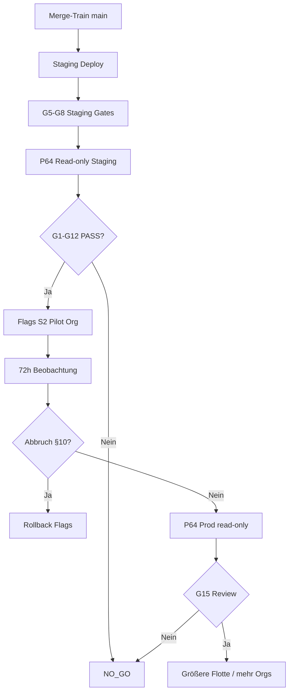

# Fleet „Zustand & Service“ — Kontrollierter Go/No-Go-Rollout-Plan

| Feld | Wert |
|------|------|
| **Plan-ID** | `fleet-health-service-rollout-plan-2026-07-21` |
| **Prompt** | Phase 9, **66/66** (Sign-off) |
| **Owner** | Platform + Rental Health + Service Center (`fleet-health-service`) |
| **Integrations-Branch (Code-Stand)** | `cursor/fleet-health-e2e-bad3` @ `439ed532` |
| **Post-Remediation-Audit** | [`docs/audits/fleet-health-service-post-remediation-readiness.md`](../audits/fleet-health-service-post-remediation-readiness.md) |
| **Remediation-Tracker (final)** | [`docs/implementation/fleet-health-service-remediation-tracker.md`](../implementation/fleet-health-service-remediation-tracker.md) |
| **Read-only Prod-Validation** | [`docs/runbooks/fleet-health-service-production-validation.md`](../runbooks/fleet-health-service-production-validation.md) (Branch `cursor/fleet-health-prod-validation-bad3`) |
| **Incident-Runbook** | [`docs/runbooks/fleet-health-service-readiness.md`](../runbooks/fleet-health-service-readiness.md) |
| **Aktuelles Urteil** | **`NO_GO`** — kein automatischer Rollout, kein Deployment in diesem Prompt |

---

## 1. Executive Summary

Dieser Plan definiert die **verbindlichen Gates** für einen kontrollierten Pilot und spätere Flottenerweiterung des Fleet-Tabs **„Zustand & Service“**. Er basiert auf dem Post-Remediation-Audit (Prompt 65): Integrations-Branch **`CONDITIONALLY_READY`**, Production/Pilot **`NOT_READY`**.

**Verboten ohne Gate-Freigabe:**

- Unkontrolliertes Deploy auf Produktion
- Automatischer Org-weiter Rollout
- Behauptung „production ready“ ohne Nachweis aller Pflicht-Gates
- Schreibende Prod-Validierung (Tasks/Cases anlegen, Queue-Mutationen, Restarts)

**Empfohlener Pfad:** Merge-Train → Staging-Deploy → read-only Validation (P64) → Pilot-Org (kleine Flotte) → Beobachtungsfenster → erweiterte Flotte.

---

## 2. Go/No-Go-Entscheidung (aktuell)

| Ebene | Entscheidung | Begründung |
|-------|--------------|------------|
| **Sofort-Deploy Produktion** | **NO_GO** | Remediation nicht auf `main`; offene P0 (§4) |
| **Staging-Pilot (intern)** | **NO_GO** bis G1–G8 grün | Branch-Konsolidierung + Blocker-Schließung erforderlich |
| **Produktions-Pilot (1 Org, kleine Flotte)** | **NO_GO** bis G1–G12 grün | Staging-Sign-off + P64 PASS + Beobachtungsplan |
| **Breiter Rollout (>1 Org / >50 Fahrzeuge)** | **NO_GO** bis G1–G15 grün | 72h+ Pilot ohne Abbruchkriterien |
| **Production-Ready (alle Tenants)** | **NO_GO** | P0 geschlossen, RBAC live, FALSE_MATCH-Risiko behoben, Prod-Evidenz |

---

## 3. Verpflichtende Go-Live-Gates

Alle Gates müssen **PASS** sein (oder formal deferiert mit Owner + Ticket + Ablaufdatum). Ein einzelnes **FAIL** auf P0-Gates → **NO_GO**.

### 3.1 Code- und Merge-Gates (G1–G4)

| Gate | Kriterium | Status | Nachweis |
|------|-----------|--------|----------|
| **G1** | Merge-Train abgeschlossen: `unified-refresh`, `freshness`, `service-cases-list`, RBAC → Integrations-Branch → `main` | **FAIL** | Offene PRs / parallele Branches |
| **G2** | CI grün: Backend + Frontend Build, 178+ FHS-relevante Tests PASS inkl. RBAC-Suite | **FAIL** | RBAC-Specs nicht auf Integrations-Branch |
| **G3** | Keine offenen **P0**-Findings im Integrations-Branch (§4) | **FAIL** | P0-2, P0-4, P0-5 offen |
| **G4** | Architektur-Invarianten: kein falsches `rental_blocked: false` bei Degradation | **FAIL** | `degradedVehicleHealth` |

### 3.2 Staging-Gates (G5–G8)

| Gate | Kriterium | Status | Nachweis |
|------|-----------|--------|----------|
| **G5** | Staging-Deploy = Ziel-Commit aus `main` (nicht Feature-Branch isoliert) | **FAIL** | Nicht ausgeführt |
| **G6** | Read-only Staging-Validation analog P64 (alle Bereiche PASS oder dokumentierte Hinweise) | **FAIL** | Runbook nicht gegen Staging gelaufen |
| **G7** | Grafana Dashboard `synqdrive-fleet-health-service` importiert; Metriken sichtbar | **FAIL** | JSON im Repo; VPS-Provisionierung offen |
| **G8** | Prometheus Alerts `synqdrive_fleet_health` aktiv; Test-Fire in Staging | **FAIL** | `alerts.yml` im Repo |

### 3.3 Pilot-Gates (G9–G12)

| Gate | Kriterium | Status | Nachweis |
|------|-----------|--------|----------|
| **G9** | Feature-Flags konfiguriert (§6); Pilot-Org in Allowlist | **FAIL** | Flags noch nicht implementiert (P6) |
| **G10** | Pilot-Org nominiert + Owner bestätigt (§7) | **FAIL** | — |
| **G11** | Read-only **Production**-Validation (P64) nach Staging-Deploy PASS | **FAIL** | Nicht ausgeführt |
| **G12** | Go/No-Go-Meeting: Product + Ops + Engineering Sign-off (schriftlich) | **FAIL** | — |

### 3.4 Erweiterungs-Gates (G13–G15)

| Gate | Kriterium | Status | Nachweis |
|------|-----------|--------|----------|
| **G13** | Beobachtungszeitraum Pilot ≥ **72h** ohne Abbruch (§8) | **FAIL** | Pilot nicht gestartet |
| **G13b** | Kein P0/P1-Incident im Pilot-Fenster (Battery, Permission, False-Safe) | **FAIL** | — |
| **G14** | Task-Pagination oder dokumentiertes Fleet-Size-Limit für Pilot-Org | **FAIL** | P0-5 offen |
| **G15** | Freigabe größere Flotten: zweites Go/No-Go nach Pilot-Review | **FAIL** | — |

---

## 4. Verbleibende Blocker (BLOCKED)

Offene Punkte aus Post-Remediation-Audit. **Ohne Schließung oder formalen Defer: NO_GO.**

### 4.1 P0 — Rollout-blockierend

| ID | Blocker | Tracker | Status | Owner-Rolle | Schließungskriterium |
|----|---------|---------|--------|-------------|-------------------|
| **P0-2** | Vendor API silent fail → KPI „Wartet Partner“ = 0 bei Ausfall | P7, P46 | **BLOCKED** | Frontend | `useServiceCenterData` exponiert Fehler; unified-refresh mergen |
| **P0-4** | Health-Degradation setzt `rental_blocked: false` (False-Safe) | P10 | **BLOCKED** | Backend Rental Health | Per-vehicle Fehler → `unknown`/`limited`, kein „frei“ |
| **P0-5** | Tasks ohne Pagination — Full `findMany` | P13–P14 | **BLOCKED** | Backend + Frontend | Cursor-API + UI-Paging oder hartes Pilot-Fleet-Limit |
| **GOV** | Remediation-Stack nicht auf `main` / Prod | G1 | **BLOCKED** | Platform | Merge-Train + VPS-Deploy |
| **GOV** | Kein Staging-/Prod-Validation-Lauf | G6, G11 | **BLOCKED** | Ops | P64 Runbook PASS-Protokoll |

### 4.2 P1 — Pilot-blockierend (Defer nur mit Schrift + Risikoakzeptanz)

| ID | Blocker | Tracker | Status | Hinweis |
|----|---------|---------|--------|---------|
| **P1-1** | Health→Task FALSE_MATCH (`findDuplicateHealthTask`) | P11, P26–P28 | **BLOCKED** | Risiko falscher Dedup bei Pilot mit Task-Erstellung |
| **P1-4** | RBAC PermissionsGuard nicht im Integrations-Branch | P31–P36 | **BLOCKED** | RBAC-Branch mergen; 101 Specs auf Ziel-Branch |
| **P1-5** | `ServiceCase.blocksRental` nicht in `vehicleRuntimeStateBuilder` | P20 | **BLOCKED** | Mietbereitschaft unvollständig |
| **P1-6** | Kein `sourceFindingId` in Bridge-Metadata | P11, P27 | **BLOCKED** | Dedup nicht stabil |
| **P1-2** | Unified `reloadAll()` nur auf Branch | P12 | **BLOCKED** | Partial-Refresh-Risiko |

### 4.3 Akzeptierte Deferrals (nur nach Pilot, nicht für Go-Live)

| ID | Thema | Status | Bedingung für späteren Rollout |
|----|-------|--------|--------------------------------|
| P1-7 | Cases in Termine-Tab | DEFER | Nach Pilot-Review |
| P1-8 | Skalierung >500 Fahrzeuge | DEFER | Erst nach G14 + Pagination |
| P2-2 | Per-Modul-Freshness | DEFER | freshness-Branch mergen |
| P2-5 | PM2-Restarts Prod | MONITOR | P64 § PM2 bei jedem Deploy |

---

## 5. Feature-Flag-Strategie

**Prinzip:** SynqDrive-Standard (`registerAs` + Env + optional Org-Allowlist). **Kein** externes Flag-SaaS. **Default in Produktion: alles `false`.**

> **Hinweis:** Flags sind in Prompt 6 spezifiziert; Code-Implementierung folgt im Merge-Train. Bis G9: **kein** UI-Rollout ohne Allowlist.

### 5.1 Flag-Katalog (Zielvertrag)

| Code-Flag | Environment Variable | Default (Prod) | Wirkung |
|-----------|---------------------|----------------|---------|
| `fleetHealthServiceV2Enabled` | `FLEET_HEALTH_SERVICE_V2_ENABLED` | `false` | Master-Gate: neue FHS-IA (4 Tabs, KPI-Split, Work-Panel) |
| `fleetHealthServiceCasesEnabled` | `FLEET_HEALTH_SERVICE_CASES_ENABLED` | `false` | Service-Case-Fetch + Overview/Drawer in FHS |
| `fleetHealthUnifiedRefreshEnabled` | `FLEET_HEALTH_SERVICE_UNIFIED_REFRESH_ENABLED` | `false` | Koordinierter Refresh Health + Tasks + Vendors + Cases |
| `fleetHealthSourceStateEnabled` | `FLEET_HEALTH_SERVICE_SOURCE_STATE_ENABLED` | `false` | Per-Modul Partial-Failure / Vendor-Fehler-UI |
| `fleetHealthRbacEnforcementEnabled` | `FLEET_HEALTH_SERVICE_RBAC_ENFORCEMENT_ENABLED` | `false` | Backend PermissionsGuard + Frontend Mutation-Gating |
| `fleetHealthFreshnessBadgesEnabled` | `FLEET_HEALTH_SERVICE_FRESHNESS_ENABLED` | `false` | Per-Modul Stale-Badges (freshness-Branch) |
| `fleetHealthObservabilityEnabled` | `FLEET_HEALTH_SERVICE_OBSERVABILITY_ENABLED` | `false` | Zusätzliche Client-Metriken / Refresh-Telemetrie |

### 5.2 Org-Allowlist (Pilot)

| Variable | Wert | Regel |
|----------|------|-------|
| `FLEET_HEALTH_SERVICE_ORG_ALLOWLIST` | `<pilot-org-uuid>` | Komma-separiert; **nur** gelistete Orgs erhalten effektive `true`-Flags |
| Leer / unset | — | Alle Orgs: alle FHS-V2-Flags `false` (Legacy-UI oder Tab deaktiviert) |

### 5.3 Rollout-Stufen (manuell, Ops-gesteuert)

| Stufe | Flags aktiv | Zielgruppe |
|-------|-------------|------------|
| **S0 — Dark** | alle `false` | Produktion (aktuell) |
| **S1 — Staging intern** | alle `true`, Allowlist = Staging-Org | Engineering + QA |
| **S2 — Pilot** | V2 + Cases + Unified Refresh + Source State; RBAC wenn G2 PASS | 1 Pilot-Org, ≤50 Fahrzeuge |
| **S3 — Pilot+** | + Freshness + Observability | Gleiche Org nach 72h ohne Incident |
| **S4 — Erweitert** | Allowlist erweitern oder global `true` | Nach G15 Freigabe |

### 5.4 Rollback per Flag (bevorzugt vor Code-Revert)

1. Pilot-Org aus `FLEET_HEALTH_SERVICE_ORG_ALLOWLIST` entfernen **oder**
2. `FLEET_HEALTH_SERVICE_V2_ENABLED=false` setzen → Legacy-Pfad
3. PM2 reload nur nach Ops-Freigabe (nicht Teil dieses Prompts)
4. Incident-Runbook § Allgemeine Reaktion

**Kein automatischer Flag-Rollout** — jede Stufe erfordert Ticket + Gate-Checkliste.

---

## 6. Pilotorganisation

### 6.1 Auswahlkriterien (Pflicht)

| Kriterium | Anforderung |
|-----------|-------------|
| Flottengröße | **≤ 50 Fahrzeuge** (Bucket **S**); ideal ≤ 20 für erste 72h |
| Health-Daten | Mindestens 3 Module mit Coverage (Reifen/Bremsen/Batterie) — sonst eingeschränkte Aussagekraft |
| Service-Aktivität | Bekannte Task-Nutzung; optional 0 Cases (neu) |
| Betrieb | Dedizierter Org-Admin + Service-Manager als Ansprechpartner |
| Risiko | Keine SLA-kritische Peak-Miete im ersten Beobachtungsfenster |
| Zustimmung | Schriftliche Pilot-Einwilligung (internes Ticket) |

### 6.2 Nomination (Template)

```markdown
## FHS Pilot Nomination

| Feld | Wert |
|------|------|
| Org-Bucket | S (≤50) / M (51–200) / L (>200) |
| Fahrzeuganzahl | <n> |
| Nominiert von | <Name / Rolle> |
| Product Owner OK | ja / nein |
| Ops OK | ja / nein |
| Geplanter Start (UTC) | YYYY-MM-DD |
| Beobachtungsende (72h) | YYYY-MM-DD |
```

**Aktuell:** Keine Org nominiert → **G10 FAIL**.

### 6.3 Kleine Flotte zuerst

| Phase | Max. Fahrzeuge | Max. Orgs | Dauer |
|-------|----------------|-----------|-------|
| Staging | Staging-Fixture-Flotte | 1 | Bis G6 PASS |
| Pilot T0 | **≤ 20** empfohlen, hard cap **50** | **1** | 72h |
| Pilot T1 | ≤ 50 | 1 | +72h wenn T0 grün |
| Erweiterung T2 | 51–200 | 1–3 | Nach G15 |
| Breit | >200 | alle | Nur nach Pagination + Last-Tests |

**Regel:** Niemals gleichzeitig neue Org **und** große Flotte aktivieren.

---

## 7. Beobachtungszeitraum

### 7.1 Pilot-Phase (Pflicht)

| Fenster | Dauer | Fokus |
|---------|-------|-------|
| **T+0 – T+24h** | 24h | Deploy-Stabilität, API-Fehler, UI-Smoke, Battery-Enqueue-Logs |
| **T+24h – T+72h** | 48h | Metriken-Trends, Operator-Feedback, Permission-Checks |
| **T+72h Review** | Meeting | Go/No-Go für T1 oder Rollback |

### 7.2 Tägliche Checks (Pilot)

| Check | Quelle | PASS |
|-------|--------|------|
| API Health | `GET /api/v1/health` | 200 |
| FHS Availability Share | Grafana `ready_share` | ≥ 80% (Fleet ≥ 10) |
| Battery V2 Queue | `battery.v2` failed jobs | 0 neue `Custom Id cannot contain` |
| Task/Case API Errors | `FleetHealthTaskApiErrorsSustained`, `FleetHealthCaseApiErrorsSustained` | nicht firing |
| Vendor API | `FleetHealthVendorApiErrorsSustained` + UI-Fehlerzustand | nicht firing / sichtbar |
| RBAC | Testuser B/C (P64 §3.1) | 403 wo erwartet |
| Operator-Ticket | Support-Inbox | kein P0-FHS-Thema |

### 7.3 Erweiterung

Nach **72h PASS**: zweites Go/No-Go (G15) für Allowlist-Erweiterung oder Bucket M.

---

## 8. Metriken und Alerts

### 8.1 Pflicht-Metriken (Pilot)

| Metrik / Panel | Alert | Abbruch-Schwelle (§10) |
|----------------|-------|------------------------|
| `synqdrive:fleet_health:ready_share` | `FleetHealthUnavailableShareHigh` | unavailable > 20% für 20m (fleet ≥ 10) |
| `synqdrive_fleet_health_battery_publication_coverage_ratio` | `FleetHealthBatteryPublicationCoverageLow` | < 50% + Enqueue-Fehler in Logs |
| `synqdrive_fleet_health_refresh_partial_failure_total` | `FleetHealthPartialRefreshFailuresSustained` | Anstieg > 5/30m |
| Task/Case/Vendor API error counters | `FleetHealth*ApiErrorsSustained` | ≥ 3/15m sustained |
| `synqdrive:fleet_health:rental_health_request_p99_seconds` | `FleetHealthRentalRequestLatencyP99High` | p99 > 8s 15m |
| `synqdrive_queue_failed_jobs` | `FleetHealthQueueFailedJobsElevated` | > 5 oder > 2% fleet |

**Referenz:** [`docs/architecture/fleet-health-prometheus-metrics.md`](../architecture/fleet-health-prometheus-metrics.md), [`docs/architecture/fleet-health-service-readiness-alerts-slo.md`](../architecture/fleet-health-service-readiness-alerts-slo.md).

### 8.2 Grafana

- Dashboard UID: `synqdrive-fleet-health-service`
- Import vor G7; Screenshot im Validation-Protokoll (anonym)

### 8.3 Logging (Battery-spezifisch)

Täglich während Pilot:

```bash
# VPS read-only — keine Restarts
grep -i 'Custom Id cannot contain' /root/.pm2/logs/synqdrive-error.log | tail -20
grep -i 'battery.v2' /root/.pm2/logs/synqdrive-out.log | tail -50
```

**Abbruch:** Jeder neue Battery-V2-Enqueue-Fehler mit `:` nach Deploy mit P16-Fix → **sofortiger Rollback** (§10.1).

---

## 9. Rollback-Kriterien

### 9.1 Sofort-Rollback (automatische Ops-Empfehlung)

| Trigger | Aktion |
|---------|--------|
| P0-Incident: falsche Mietfreigabe (False-Safe) | Flag aus + Incident P0 + Code-Hotfix |
| Battery V2 Enqueue-Fehler reproduziert | Flag aus; Battery-Queue prüfen; kein manuelles Re-Enqueue ohne Runbook |
| RBAC: unberechtigte Mutation (Task/Case) | Flag aus + PermissionsGuard-Review |
| `FleetHealthUnavailableShareHigh` critical 30m+ | Flag aus für Pilot-Org; Root-Cause |
| Datenkorruption / falscher Dedup (FALSE_MATCH bestätigt) | Flag aus; Task-Bridge disable |

### 9.2 Geplanter Rollback (weicher)

| Trigger | Aktion |
|---------|--------|
| Operator-Feedback „unbrauchbar“ 2+ unabhängige Reports | Review-Meeting innerhalb 24h |
| Latenz p99 dauerhaft > SLO ohne Erklärung | Pagination/Limit; ggf. Flag aus |
| Pilot-Review T+72h FAIL | Allowlist leeren; Post-Mortem |

### 9.3 Rollback-Mechanismus (Reihenfolge)

1. **Feature-Flags** auf `false` / Org aus Allowlist (§5.4)
2. **Kein** DB-Rollback — Schema ist forward-compatible
3. Code-Revert nur wenn Flag-Rollback nicht ausreicht (neuer Deploy)
4. P64 erneut read-only nach Rollback-Deploy

---

## 10. Abbruch bei Battery-, Permission- oder False-Safe-Problemen

### 10.1 Battery (P0-3)

| Signal | Schwelle | Aktion |
|--------|----------|--------|
| Log `Custom Id cannot contain :` | ≥ 1 nach Deploy mit `buildBatteryV2JobId` | **STOP** Pilot; Rollback §9.1 |
| `battery.v2` failed jobs Anstieg | > 3 in 1h | Untersuchung; STOP wenn reproduzierbar |
| Coverage-Alert + 0 Publications | 30m sustained, fleet ≥ 5 battery rows | Eskalation; kein weiterer Rollout |

### 10.2 Permission (P1-4)

| Signal | Schwelle | Aktion |
|--------|----------|--------|
| User ohne `tasks.write` erstellt Task | 1 bestätigter Fall | **STOP**; RBAC-Branch-Regression |
| User ohne `fleet.read` sieht FHS-Daten | 1 Fall | **STOP** |
| 500 statt 403 auf geschütztem Endpoint | sustained | **STOP** |
| RBAC-Suite nicht grün auf Deploy-Commit | G2 FAIL | **NO_GO** vor Pilot |

### 10.3 False-Safe (P0-4, Architektur)

| Signal | Schwelle | Aktion |
|--------|----------|--------|
| Fahrzeug mit Health-`_error` zeigt `rental_blocked: false` und Runtime „mietbar“ | 1 bestätigter Fall | **STOP** — höchste Priorität |
| KPI „Technisch unauffällig“ bei `unknown`/degraded | Operator-Report + Code-Path | **STOP** bis P10 gefixt |
| Vendor-Fehler → KPI 0 „Wartet Partner“ | reproduzierbar | **STOP** bis P7 gefixt |

**Regel:** Bei jedem dieser drei Bereiche gilt: **kein weiterer Flotten-Rollout**, bis Root-Cause behoben und Staging erneut PASS.

---

## 11. Read-only Production-Validation

Vor **jedem** Produktions-Pilot-Flag (`S2`):

1. Runbook [`fleet-health-service-production-validation.md`](../runbooks/fleet-health-service-production-validation.md) vollständig ausführen
2. Protokoll-Vorlage §2 des Runbooks ausfüllen (anonymisiert)
3. **PASS** erforderlich für: API health, Commit-Match, PM2, Battery-Logs, Queues, Modul-Coverage, Pagination-Stichprobe, Permissions (Rollen A/B/C), UI-Smoke (lesend)
4. Bei **FAIL**: NO_GO; keine Flags setzen

**Verboten im Validation-Lauf:** POST/PATCH/DELETE, Queue-Mutationen, `pm2 restart`, manuelle Jobs.

Nach Pilot-Start: **wöchentliche** read-only Re-Validation bis G15.

---

## 12. Freigabe für größere Flotten

| Stufe | Voraussetzung | Freigeber |
|-------|---------------|-----------|
| **Bucket M (51–200)** | G13 PASS + P0-5 geschlossen oder hartes API-Limit dokumentiert | Engineering + Ops |
| **Bucket L (>200)** | Pagination BE+FE PASS + Scale-Tests (P42–P43) + Last-Review | Engineering + Product |
| **Multi-Org** | Je Org separater 72h-Pilot oder gemeinsames Review mit N≤3 | Product Owner |
| **Global `true`** | Alle P0/P1 BLOCKED geschlossen; Post-Remediation-Audit erneut **CONDITIONALLY_READY** oder besser | Steering |

**Keine Freigabe** nur auf Basis lokaler 178 Tests — Staging- und Prod-Validation erforderlich.

---

## 13. Support- und Incident-Verantwortung

| Rolle | Verantwortung | Kanal |
|-------|---------------|-------|
| **Primary Owner** | `fleet-health-service` (Platform) | Ops-On-Call Rotation |
| **Domain Owner Rental Health** | Health-Degradation, Module, `rental_blocked` | #rental-health |
| **Domain Owner Service Center** | Tasks, Cases, Vendors | #service-center |
| **Pilot Org Admin** | User-Feedback, Acceptance | Ticket / direkter Draht |
| **Incident Commander** | Abbruchentscheidung §10 | On-Call |

### Eskalationsmatrix

| Severity | Beispiel | Reaktionszeit | Entscheidung |
|----------|----------|---------------|--------------|
| **P0** | False-Safe Mietfreigabe, RBAC-Bypass | < 15 min | Rollback + IC |
| **P1** | Battery enqueue fail, Vendor silent fail in Prod | < 1h | Flag aus + Fix-Branch |
| **P2** | Latenz, KPI-Verwirrung | < 4h | Nächster Business Day Review |

**Runbook:** [`fleet-health-service-readiness.md`](../runbooks/fleet-health-service-readiness.md) — Alert → Panel → Logs → Mitigate.

---

## 14. Rollout-Sequenz (Referenz — nicht in diesem Prompt ausführen)



1. Merge-Train abschließen (G1)
2. Staging deployen (manuell, Ticket)
3. CI + Staging-Validation (G2–G8, P64)
4. Go/No-Go-Meeting (G12)
5. Prod-Deploy + read-only P64 (G11)
6. Flags S2 nur für Pilot-Org
7. 72h Beobachtung (§7)
8. Review → T1 oder Rollback
9. G15 für Erweiterung

---

## 15. Verwandte Artefakte

| Artefakt | Pfad |
|----------|------|
| Post-Remediation Audit | `docs/audits/fleet-health-service-post-remediation-readiness.md` |
| Production Reality (Audit 1) | `docs/audits/fleet-health-service-production-reality.md` |
| UX/Test-Matrix (Audit 2) | `docs/audits/fleet-health-service-workflow-ux-test-matrix.md` |
| Remediation Tracker (final) | `docs/implementation/fleet-health-service-remediation-tracker.md` |
| Domain Integration Tests | `docs/testing/fleet-health-service-domain-integration.md` |
| E2E Spec | `frontend/e2e/fleet-health-service-flow.spec.ts` |

---

## 16. Changelog

| Version | Datum | Änderung |
|---------|-------|----------|
| 1.0 | 2026-07-21 | Initiales Go/No-Go-Rollout (Prompt 66/66); Urteil **NO_GO** |

---

## 17. Sign-off (Prompt 66)

| Rolle | Name | Datum | Entscheidung |
|-------|------|-------|--------------|
| Engineering | _ausstehend_ | — | **NO_GO** (G1–G15 offen) |
| Product | _ausstehend_ | — | **NO_GO** |
| Ops | _ausstehend_ | — | **NO_GO** |

**Ergebnis Phase 9:** Remediation-Dokumentation und Test-Stack abgeschlossen; **kontrollierter Produktions-Pilot erst nach Gate-Erfüllung**. Kein „Production Ready“.
