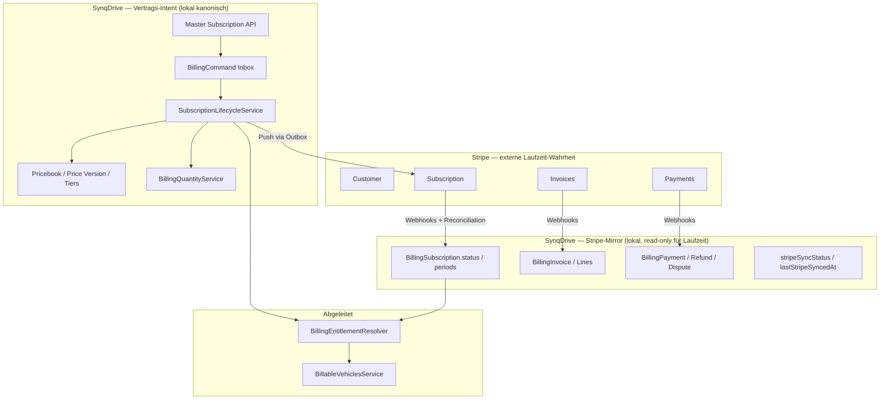

# Master Admin Remediation — Phase 2B.1: Billing Source of Truth

| Feld | Wert |
|------|------|
| **Remediation ID** | `billing-source-of-truth` |
| **Phase** | **2B.1** — Kanonische Billing-Architektur (Analyse only) |
| **Datum** | 2026-07-26 |
| **Status** | Analyse abgeschlossen — **keine Code-Änderungen** in dieser Phase |
| **Scope** | Platform SaaS Billing (`backend/src/modules/billing/`) |
| **Nicht im Scope** | Stripe Connect Endkunden-Zahlungen (`modules/payments/`), Rental-`PriceBook` (`modules/pricing/`), Voice Billing (`modules/voice-billing/`) |

---

## Executive Answer

### Welches System ist künftig die einzige Wahrheit?

**Es gibt keine einzelne globale Wahrheit — es gibt eine kanonische Zweiteilung:**

| Schicht | System | Rolle |
|---------|--------|-------|
| **Externe Laufzeit-Wahrheit** | **Stripe** | Subscription Status, Renewal/Perioden, Cancellation, Payment Status, Invoice Status |
| **Interne Vertrags-Wahrheit** | **SynqDrive PostgreSQL** (`Billing*`-Modelle) | Kommerzieller Vertrag: Produkt, Price Version, Items, Discounts, Quantity-Intent, Audit |
| **Abgeleitete Produktivität** | **Entitlement-Resolver** (berechnet) | Produktiver Feature-Zugang nur wenn **Vertrag + Stripe-Bestätigung** konsistent sind |

**Kurzform:**

> **Stripe entscheidet, ob eine Subscription zahlungstechnisch lebt.**  
> **SynqDrive entscheidet, was verkauft wurde.**  
> **Die lokale Datenbank spiegelt Stripe für Laufzeitstatus — sie ersetzt ihn nicht.**

### Verbindliche Regeln (2B.1)

1. **Stripe** ist die **einzige externe Wahrheit** für:
   - Subscription Status (`active`, `trialing`, `past_due`, `canceled`, …)
   - Renewal / Abrechnungsperioden (`current_period_start`, `current_period_end`)
   - Cancellation (`cancel_at_period_end`, `canceled_at`)
   - Payment Status (PaymentIntents, Charges, Refunds, Disputes)
   - Invoice Status (`draft`, `open`, `paid`, `void`, …)

2. Die **lokale Datenbank** speichert für diese Felder **ausschließlich den synchronisierten Zustand** (Mirror), aktualisiert durch:
   - Stripe Webhooks (`POST /webhooks/stripe`)
   - Expliziten Pull (`syncSubscriptionFromStripe`, Reconciliation)

3. **Lokale Statusänderungen ohne Stripe dürfen keine produktive Subscription aktivieren.**
   - Master-`activate` / `startTrial` dürfen Vertrags-**Intent** setzen (`DRAFT` → `PENDING_STRIPE` o.ä.).
   - **Produktiver Zugang** (Entitlements, Billable Vehicles, Feature Gates) erfordert bestätigten Stripe-Zustand.

4. **Vertragsfelder** (Price Version, Items, Discounts, Quantity Ledger) bleiben **lokal kanonisch** — Stripe erhält sie per Push (`StripeSubscriptionOrchestrator`), ändert sie aber nicht zurück (außer Quantity/Price via Subscription Items).

---

## 1. Architektur-Übersicht (Soll-Zustand 2B.1)



### Produktive Subscription — Definition (2B.1)

Eine Organisation hat eine **produktive Platform-Subscription**, wenn **alle** Bedingungen erfüllt sind:

| # | Bedingung | Quelle |
|---|-----------|--------|
| 1 | Lokaler Vertrag mit mindestens einem syncable Base-Item (`ACTIVE` oder `TRIALING`) | `BillingSubscriptionItem` |
| 2 | `stripeSubscriptionId` gesetzt | DB Mirror |
| 3 | `stripeSyncStatus = SYNCED` (kein ausstehender Push-Fehler) | DB |
| 4 | Stripe Subscription Status ∈ `{ active, trialing }` (ggf. `past_due` mit Grace) | **Stripe** → Mirror |
| 5 | Kein offener `STATUS_MISMATCH` Drift (Reconciliation) | Reconciliation |

**Bis Bedingung 4–5 erfüllt:** Status lokal = `PENDING_STRIPE_CONFIRMATION` (Ziel-Status, noch nicht im Code) oder äquivalent `INCOMPLETE` / `stripeSyncStatus=PENDING|FAILED`.

---

## 2. Vollständige Ist-Analyse

### 2.1 Stripe

| Komponente | Datei | Funktion |
|------------|-------|----------|
| SDK-Grenze | `adapters/stripe-billing.adapter.ts` | Einziger Billing-Adapter für Stripe-Operationen |
| Client | `stripe-client.util.ts`, `config/stripe.config.ts` | `STRIPE_SECRET_KEY`, Webhook-Secrets, `STRIPE_DEFAULT_PRICE_ID` |
| Customer Sync | `stripe-billing.service.ts#ensureCustomerForOrganization` | `stripe.customers.create` + `metadata.organizationId` |
| Subscription Push | `stripe-subscription-orchestrator.service.ts` | create/update Stripe Subscription aus lokalem Vertrag |
| Subscription Pull | `stripe-billing.service.ts#applyStripeSubscription` | Webhook/Admin-Pull → lokaler Status + Perioden |
| Invoice Mirror | `stripe-invoice-mirror.service.ts` | Stripe Invoice → `BillingInvoice` |
| Payment Ledger | `stripe-payment-ledger.service.ts` | PaymentIntents, Refunds, Disputes |
| Catalog Push | `stripe-catalog-sync.service.ts` | Published Price Version → Stripe Product/Price |
| Catalog Mapping | `stripe-catalog-mapping.service.ts` | `priceVersionId` → `stripePriceId` |
| Status Mapping | `domain/mappers/stripe-subscription-status.mapper.ts` | Stripe string → Domain → Prisma `BillingStatus` |

**Stripe-Customer-ID:** auf `BillingSubscription.stripeCustomerId` — **nicht** auf `Organization`.

**Checkout:** Kein SaaS-Stripe-Checkout. Tenant nutzt Billing Portal (`POST /billing/stripe/customer-portal`) und Setup Intent.

---

### 2.2 Datenbank (Prisma)

Kernmodelle (`backend/prisma/schema.prisma`):

| Modell | Tabelle | Rolle in 2B.1 |
|--------|---------|---------------|
| `BillingSubscription` | `billing_subscriptions` | Vertrags-Container + Stripe-Mirror-Felder |
| `BillingSubscriptionItem` | `billing_subscription_items` | Vertragspositionen (Base + Add-ons) |
| `BillingDiscount` | `billing_discounts` | Org-Rabatte (+ Stripe Coupon Ref) |
| `BillingInvoice` / `BillingInvoiceLine` | `billing_invoices` | Invoice-Mirror |
| `BillingPayment*` | diverse | Payment-Mirror |
| `BillingQuantityEvent` | `billing_quantity_events` | Append-only Quantity Ledger (lokal) |
| `BillingUsageSnapshot` | `billing_usage_snapshots` | Perioden-Snapshots |
| `BillingDomainEventOutbox` | `billing_domain_event_outbox` | Transactional Outbox |
| `BillingAuditLog` | `billing_audit_logs` | Audit (before/after JSON) |
| `BillingReconciliationRun` / `Drift` | reconciliation | Drift-Erkennung |
| `StripeWebhookEvent` | `stripe_webhook_events` | Webhook-Idempotenz |
| `BillingCommand` | `billing_commands` | Idempotente Master-Mutationen |

**Legacy parallel (nicht kanonisch für 2B.1):**

| Modell | Problem |
|--------|---------|
| `OrganizationProduct` | Lokale Lizenz **ohne Stripe** — `ProductsService.assignProduct()` |
| `BillingOrganizationPriceOverride` | Legacy Discount Override |
| `BillingStripePriceMapping` | Ältere Mapping-Tabelle (neben `BillingStripeCatalogMapping`) |

---

### 2.3 Subscription Service

| Service | Pfad | Verantwortung |
|---------|------|---------------|
| `SubscriptionLifecycleService` | `subscription-lifecycle.service.ts` | **Lokale** Zustandsmaschine: draft, trial, activate, pause, cancel, … |
| `BillingSubscriptionAdminService` | `billing-subscription-admin.service.ts` | Master-API-Orchestrierung |
| `BillingCommandService` | `billing-command.service.ts` | Idempotenz (`BillingCommand` + Header) |
| `SubscriptionResolverService` | `resolvers/subscription-resolver.service.ts` | Vertragsauflösung für Reads |
| `BillingEntitlementResolver` | `billing-entitlement-resolver.service.ts` | Feature-Zugang aus Vertrag |
| `EntitlementResolverService` | `resolvers/entitlement-resolver.service.ts` | Vertrag **+ Legacy** `OrganizationProduct` Merge |

**Master-Endpoints** (`master-subscription.controller.ts`):

```
POST .../draft | assign-rental | assign-fleet | trial | activate
POST .../pause | reactivate | cancel | schedule-cancel | ...
```

**Aktivierungsfluss heute:**

```
POST activate
  → BillingCommandService
  → SubscriptionLifecycleService.activate()     ← setzt lokal ACTIVE sofort
  → BillingDomainEventOutbox (SUBSCRIPTION_ACTIVATED)
  → Outbox Worker (30s)
  → BillingStripeSyncListener
  → StripeSubscriptionOrchestrator.push
  → (später) Webhook applyStripeSubscription    ← kann Status überschreiben
```

**Gap vs. 2B.1:** Schritt `activate` setzt lokal `ACTIVE` **bevor** Stripe bestätigt. Entitlements lesen lokalen Status → **produktive Aktivierung ohne Stripe möglich**.

---

### 2.4 Billing Worker

| Worker | Datei | Intervall | Funktion |
|--------|-------|-----------|----------|
| Domain Event Outbox | `billing-domain-event-outbox.worker.service.ts` | 30s | Outbox → Publisher → Stripe Sync Listener |
| Email Outbox | `email/billing-domain-event-email.worker.service.ts` | 30s | Billing-Benachrichtigungen |
| Reconciliation | `workers/schedulers/billing-reconciliation.scheduler.ts` | 6h | `BillingReconciliationService.runPeriodicReconciliation` |

**Flag:** `BILLING_STRIPE_SYNC_ON_LIFECYCLE_ENABLED` (default **on**) — steuert Push nach Lifecycle-Events.

**Quantity:** `billing-quantity-vehicle.integration.ts` schreibt `BillingQuantityEvent` bei Vehicle Connect — **triggert keinen Stripe-Push**. Quantity-Drift bis zum nächsten Lifecycle-Event oder Reconciliation.

---

### 2.5 Webhooks

**Ingress:** `stripe-webhook.controller.ts` → `StripeWebhookService` → `StripeWebhookDispatcherService`

| Event-Gruppe | Aktion | Schreibt lokale Laufzeit-Wahrheit? |
|--------------|--------|-------------------------------------|
| `customer.subscription.*` | `applyStripeSubscription` + PM Sync | **Ja** — Status, Perioden, cancel flags |
| `customer.subscription.trial_will_end` | Email-Outbox nur | **Nein** |
| `invoice.*` | Invoice Mirror + Subscription Refresh | **Ja** — Invoice Status |
| `payment_intent.*` | Payment Ledger | **Ja** |
| `charge.refunded` | Refund Ledger | **Ja** |
| `credit_note.created` | Credit Note Mirror | **Ja** |
| `charge.dispute.*` | Dispute Mirror | **Ja** |
| `payment_method.*`, `setup_intent.*` | PM Sync | **Ja** |

**Idempotenz:** `StripeWebhookEvent` (`stripeEventId` unique).

**`applyStripeSubscription` schreibt:**

```228:257:backend/src/modules/billing/stripe-billing.service.ts
  async applyStripeSubscription(organizationId: string, stripeSub: Stripe.Subscription) {
    const mapped = mapStripeSubscriptionStatus(stripeSub.status, { ... });
    // ...
    data: {
      stripeSubscriptionId, stripeCustomerId, stripeMode,
      status: mapped.billingStatus,           // ← Stripe → lokal
      currentPeriodStart, currentPeriodEnd,    // ← Renewal
      cancelAtPeriodEnd,                       // ← Cancellation
    },
  }
```

**Schreibt NICHT:** `trialStartAt`, `trialEndAt`, `priceVersionId`, Subscription Items.

---

### 2.6 Customer Sync

| Pfad | Richtung | Details |
|------|----------|---------|
| `ensureCustomerForOrganization` | Lokal → Stripe | Erstellt Stripe Customer wenn `stripeCustomerId` fehlt |
| Org-Auflösung | Stripe → Lokal | `metadata.organizationId` + `stripeMode`-scoped Lookup |
| Admin Sync | Pull | `POST /admin/billing/organizations/:orgId/sync-stripe` |
| Portal / Setup Intent | Stripe UI | Tenant self-service PM |

**Shell-Erstellung:** `ensurePrimarySubscriptionRecord` legt bei Bedarf `BillingSubscription` mit `status: TRIALING` an — **ohne Stripe Subscription**.

---

### 2.7 Organization Status

| Feld | Modell | Bedeutung | Billing-Bezug |
|------|--------|-----------|---------------|
| `Organization.status` | `ACTIVE \| SUSPENDED \| PENDING \| ARCHIVED` | IAM/Operations | Beeinflusst `BillableVehiclesService` (`ORG_INACTIVE`) — **nicht** Subscription Status |
| `Organization.paymentsEnabled` | Boolean | **Stripe Connect** für Endkunden | Separate Domäne — nicht SaaS Billing |
| `BillingSubscription.status` | `BillingStatus` | Vertrag + Mirror | Entitlements |
| `OrganizationProduct.status` | Legacy Lizenz | Parallel ohne Stripe | Noch in `EntitlementResolverService` gemerged |

**Keine automatische Kopplung** `Organization.status` ↔ `BillingSubscription.status`.

---

### 2.8 Trial Handling

| Mechanismus | Richtung | Ist-Verhalten |
|-------------|----------|---------------|
| `POST .../trial` | Lokal | Setzt `trialStartAt`, `trialEndAt`, Item `TRIALING` |
| Orchestrator Push | Lokal → Stripe | `trial_end` Unix aus `trialEndAt` |
| Webhook `trial_will_end` | Stripe → Lokal | **Nur Email** — keine Trial-Datum-Synchronisation |
| `applyStripeSubscription` | Stripe → Lokal | Mappt Status `trialing` — **ohne** Trial-Datum-Backfill |
| `OrganizationProduct.status=TRIAL` | Legacy lokal | Unabhängig von Billing Subscription |
| Voice `trialEndsAt` | Separates Produkt | Außerhalb Platform SaaS Billing |

**Gap:** Lokale und Stripe Trial-End-Daten können divergieren. Reconciliation prüft `STATUS_MISMATCH`, nicht explizit Trial-Datum-Drift.

---

## 3. Source-of-Truth-Matrix (Soll 2B.1)

| Datenfeld | Kanonische Wahrheit | DB-Rolle | Sync-Richtung | Produktiv relevant? |
|-----------|---------------------|----------|---------------|---------------------|
| Pricebook / Price Version / Tiers | **SynqDrive** | Master | SD → Stripe (Catalog Sync) | Konfiguration |
| Subscription Items (Plan, Add-ons) | **SynqDrive** | Master | SD → Stripe (Orchestrator) | Vertrag |
| Discounts | **SynqDrive** | Master | SD → Stripe (Coupons) | Vertrag |
| Quantity Ledger | **SynqDrive** | Master (Intent) | SD → Stripe (Orchestrator, **nicht bei Vehicle-Event**) | Abrechnung |
| **Subscription Status** | **Stripe** | **Mirror only** | Stripe → SD (Webhook/Recon) | **Ja** |
| **current_period_start/end** (Renewal) | **Stripe** | **Mirror only** | Stripe → SD | **Ja** |
| **cancel_at_period_end / canceled** | **Stripe** | **Mirror only** | Stripe → SD | **Ja** |
| **Invoice Status** | **Stripe** | **Mirror only** | Stripe → SD | **Ja** |
| **Payment Status** | **Stripe** | **Mirror only** | Stripe → SD | **Ja** |
| `stripeCustomerId` / `stripeSubscriptionId` | **Stripe** (nach Erstellung) | Referenz | Bidirektional | Gate |
| `stripeSyncStatus` | **SynqDrive** (Sync-Metadaten) | Operational | SD internal | Gate |
| Entitlements | **Abgeleitet** | Projection | — | **Ja** |
| `Organization.status` | **IAM/Ops** | Unabhängig | — | Indirekt (Billable) |
| `OrganizationProduct` | **Legacy** | **Deprecated** | Keine | Soll entfallen |

---

## 4. Konflikte mit bestehender Dokumentation

`docs/billing/billing-target-domain.md` (Prompt 7/44) definiert:

- **R5:** „Stripe ist Zahlungsprovider, nicht alleinige Vertragswahrheit“
- **R6:** „SynqDrive hält lokale Vertrags-, Preis- und Audit-Wahrheit“

**Phase 2B.1 präzisiert und ergänzt R5/R6:**

| Aspekt | billing-target-domain (R5/R6) | 2B.1 Remediation |
|--------|------------------------------|------------------|
| Vertrag / Preis / Audit | Lokal kanonisch | **Unverändert kanonisch** |
| Subscription **Laufzeitstatus** | Über Mapper von Stripe **und** lokal | **Stripe allein** (DB = Mirror) |
| Renewal / Cancel / Payment / Invoice | Nicht explizit getrennt | **Stripe allein** |
| Produktive Aktivierung | Implizit über Lifecycle | **Explizit Stripe-Gate** |

`docs/billing/billing-current-state.md` ist **teilweise veraltet** (beschreibt fehlende Subscription Items, keinen Orchestrator). Für Remediation nicht als Ist-Quelle verwenden.

---

## 5. Ist vs. Soll — Abweichungen (Gaps)

### 5.1 P0 — Verletzungen der 2B.1-Regeln

| ID | Gap | Evidenz | Risiko |
|----|-----|---------|--------|
| GAP-01 | **Lokales `activate` setzt sofort `ACTIVE`** ohne Stripe-Bestätigung | `subscription-lifecycle.service.ts#activate` | Produktive Subscription ohne Zahlung |
| GAP-02 | **Entitlements lesen lokalen Vertragsstatus** | `billing-entitlement-resolver.service.ts`, `resolveBillingEntitlements` | Feature-Zugang ohne Stripe |
| GAP-03 | **`BillingService.createSubscription`** schreibt `ACTIVE` + Stripe IDs direkt | `billing.service.ts#createSubscription` | Bypass Lifecycle + Orchestrator |
| GAP-04 | **`ProductsService.assignProduct`** aktiviert `OrganizationProduct` ohne Stripe | `products.service.ts` | Parallel-Lizenz ohne Billing |
| GAP-05 | **`EntitlementResolverService` merged Legacy-Lizenzen** | `entitlement-resolver.service.ts` | Zugang ohne Stripe-Vertrag |
| GAP-06 | **Status-Dual-Write** — Lifecycle + Webhook überschreiben `BillingSubscription.status` | Lifecycle + `applyStripeSubscription` | Race / Inkonsistenz |

### 5.2 P1 — Sync-Lücken

| ID | Gap | Evidenz |
|----|-----|---------|
| GAP-07 | Quantity-Änderungen pushen nicht zu Stripe | `billing-quantity-vehicle.integration.ts` — kein Outbox-Event |
| GAP-08 | Trial-Daten nur Lokal → Stripe, nicht zurück | Webhook `trial_will_end` = Email only |
| GAP-09 | Reconciliation erkennt `STATUS_MISMATCH`, auto-fix limitiert | Nur PM + stuck webhook |
| GAP-10 | `STRIPE_DEFAULT_PRICE_ID` Fallback umgeht Catalog Mapping | `stripe-catalog-mapping.service.ts` |
| GAP-11 | `pause()` speichert Prisma `ACTIVE` bei Domain `PAUSED` | `subscription-lifecycle.service.ts#pause` |

### 5.3 P2 — Tech Debt / Grenzen

| ID | Gap | Evidenz |
|----|-----|---------|
| GAP-12 | Manuelles `recordInvoice` / `updateSubscriptionStatus` | `billing.service.ts` |
| GAP-13 | Global Default Pricebook Fallback | `PricingResolverService` |
| GAP-14 | Vier getrennte Billing-Domänen (SaaS, Legacy Product, Rental PriceBook, Connect) | Architektur |
| GAP-15 | `billing-current-state.md` widerspricht Code | Dokumentation |

---

## 6. Datenflüsse (Referenz)

### 6.1 Push — Vertragsänderung → Stripe

```
Master API / Lifecycle Mutation
  → BillingDomainEventOutbox (SUBSCRIPTION_ACTIVATED | CHANGED | CANCELLED | ...)
  → BillingDomainEventOutboxWorker (30s)
  → BillingEventPublisher
  → BillingStripeSyncListenerService
  → StripeSubscriptionOrchestratorService.syncOrganizationSubscription
      → ensureCustomerForOrganization (Stripe Customer)
      → buildLinePlans (Catalog Mapping)
      → stripe.subscriptions.create | update
      → persist stripeSubscriptionId, item IDs, stripeSyncStatus
```

### 6.2 Pull — Stripe → Mirror

```
Stripe Webhook
  → StripeWebhookDispatcher
  → applyStripeSubscription (Status, Perioden, Cancel)
  → StripeInvoiceMirrorService (Invoice Status)
  → StripePaymentLedgerService (Payment Status)
```

### 6.3 Entitlements (heute vs. Soll)

**Heute:**

```
BillingSubscription.status (lokal, oft vor Stripe)
  + BillingSubscriptionItem.status
  → resolveBillingEntitlements → active: true
```

**Soll (2B.1):**

```
BillingSubscriptionItem (lokal Vertrag)
  + BillingSubscription.status (Stripe-Mirror)
  + stripeSyncStatus === SYNCED
  + stripeSubscriptionId present
  → resolveBillingEntitlements → active nur wenn Stripe granting
```

---

## 7. Reconciliation als Sicherheitsnetz

`BillingReconciliationService` (Scheduler 6h, Flag `BILLING_RECONCILIATION_SCHEDULER_ENABLED`):

| Drift-Typ | Bedeutung | Auto-Fix heute |
|-----------|-----------|----------------|
| `STATUS_MISMATCH` | Lokal ≠ Stripe Status | **Nein** |
| `QUANTITY_MISMATCH` | Lokal ≠ Stripe Quantity | **Nein** |
| `WRONG_PRICE_ID` | Mapping-Drift | **Nein** |
| `LOCAL_SUBSCRIPTION_WITHOUT_STRIPE` | Vertrag ohne Stripe Sub | **Nein** |
| `STRIPE_SUBSCRIPTION_WITHOUT_LOCAL` | Stripe ohne lokalen Vertrag | **Nein** |
| `MISSING_DEFAULT_PAYMENT_METHOD` | Kein Default PM | **Ja** (PM Sync) |
| `STUCK_WEBHOOK` | Webhook hängt | **Ja** (Retry) |

**2B.1 Empfehlung:** Bei `STATUS_MISMATCH` mit Severity HIGH → Entitlements auf `INACTIVE` bis Stripe gewinnt (Stripe = Laufzeit-Wahrheit).

---

## 8. Environment Flags (Billing-relevant)

| Variable | Default | Wirkung |
|----------|---------|---------|
| `STRIPE_SECRET_KEY` | — | Aktiviert Stripe; leitet TEST/LIVE Mode |
| `STRIPE_WEBHOOK_SECRET` | — | SaaS Webhook-Verifikation |
| `STRIPE_DEFAULT_PRICE_ID` | — | Legacy Single-Price Fallback (**soll ablösen**) |
| `BILLING_STRIPE_SYNC_ON_LIFECYCLE_ENABLED` | `true` | Push nach Lifecycle-Events |
| `BILLING_RECONCILIATION_SCHEDULER_ENABLED` | `true` | 6h Drift-Scan |
| `BILLING_EMAIL_ENABLED` | prod on | Billing-Emails |

---

## 9. Schlüsseldateien (Index)

```
backend/prisma/schema.prisma                           # Billing* Modelle
backend/src/config/stripe.config.ts
backend/src/modules/billing/
  master-subscription.controller.ts                    # Master Vertrags-API
  subscription-lifecycle.service.ts                    # Lokale Zustandsmaschine
  stripe-subscription-orchestrator.service.ts          # Push → Stripe
  stripe-billing.service.ts                            # Customer + applyStripeSubscription
  stripe-webhook-dispatcher.service.ts                 # Webhook-Routing
  stripe-invoice-mirror.service.ts                     # Invoice Mirror
  stripe-payment-ledger.service.ts                     # Payment Mirror
  billing-reconciliation.service.ts                    # Drift Detection
  billing-domain-event-outbox.worker.service.ts        # Outbox Worker
  events/billing-stripe-sync.listener.service.ts       # Lifecycle → Stripe
  billing-entitlement-resolver.service.ts              # Entitlements
  resolvers/entitlement-resolver.service.ts            # + Legacy Merge
  domain/mappers/stripe-subscription-status.mapper.ts  # Status Mapping
  domain/billing-reconciliation.ts                     # Drift Types
backend/src/modules/products/products.service.ts       # Legacy OrganizationProduct
docs/billing/billing-target-domain.md                  # Vertrags-Domain (R5/R6)
```

---

## 10. Empfohlene Remediation-Roadmap (2B.2+, nur Planung)

| Phase | Ziel | Typ |
|-------|------|-----|
| **2B.2** | Entitlement-Gate: `active` nur mit Stripe-bestätigtem Status | Code |
| **2B.3** | Lifecycle: `activate` → `PENDING_STRIPE` bis Webhook `active`/`trialing` | Code |
| **2B.4** | Legacy-Pfade deprecaten: `createSubscription`, `assignProduct` Merge | Code |
| **2B.5** | Quantity → Stripe Push bei Vehicle Events | Code |
| **2B.6** | Reconciliation: STATUS_MISMATCH → Entitlement-Deny + Alert | Code |
| **2B.7** | Trial-Datum Stripe → Lokal Backfill Policy | Code + Doc |
| **2B.8** | `billing-target-domain.md` R5/R6 mit 2B.1 abstimmen | Doc |

---

## 11. Zusammenfassung

| Frage | Antwort |
|-------|---------|
| **Welches System ist die einzige Wahrheit?** | **Zweiteilung:** Stripe für Laufzeit/Zahlung; SynqDrive DB für Vertrag/Preis/Audit; Entitlements abgeleitet mit Stripe-Gate |
| **Ist das heute so implementiert?** | **Nein** — lokale Aktivierung, Legacy-Lizenzen und Status-Dual-Write verletzen die 2B.1-Regeln |
| **Was ist der kritischste Gap?** | `activate` + Entitlement-Resolver gewähren produktiven Zugang vor Stripe-Bestätigung |
| **Code-Änderungen in 2B.1?** | **Keine** — nur Architektur-Definition und Gap-Analyse |

---

**Changes / Architektur:** Nicht aktualisiert (Analyse-Dokument only; keine Implementierung).
