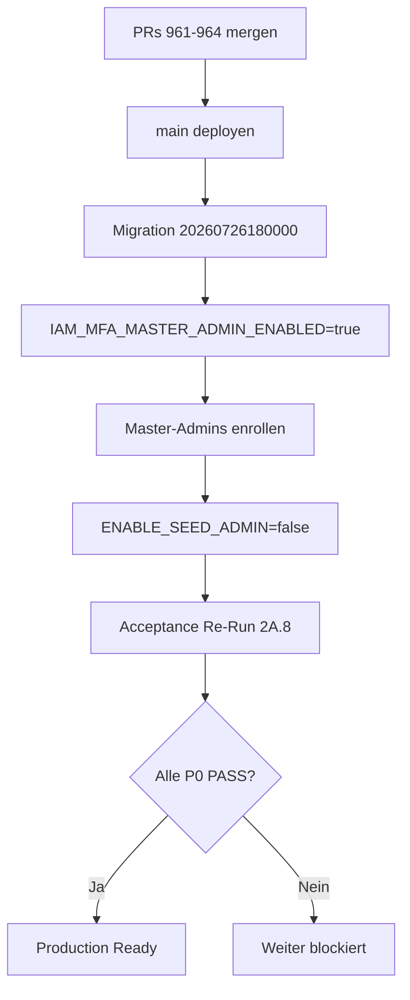

# Master Admin Remediation — Phase 2A.8: Security Acceptance

| Feld | Wert |
|------|------|
| **Remediation ID** | `master-admin-security-acceptance` |
| **Phase** | **2A.8** — Security Acceptance (Gesamtvalidierung) |
| **Host** | `srv1374778.hstgr.cloud` / `https://app.synqdrive.eu` |
| **Validiert (UTC)** | `2026-07-26T10:55Z` |
| **Methodik** | Code-Review aller Remediation-PRs + Live-Probes (öffentlich + SSH read-only als `synqdrive-admin`) |
| **Bezug** | Phasen 2A.1–2A.7, VPS-Audits Phase 1 (Step 6), Operator-Audit Prompt 42 |

---

## Executive Answer

### Ist die Security-Basis der Master-Admin-Control-Plane jetzt production ready?

# **Nein — noch nicht production ready**

Die **Infrastruktur-Basis** (SSH, Root-Login, UFW, Secret-Dateiberechtigungen, Health/Readiness) ist auf dem VPS **weitgehend gehärtet und live verifiziert**.

Die **Anwendungs- und Governance-Schicht** der Master-Admin-Control-Plane (OpenAPI-Abschaltung, MFA-Pflicht, privilegierte Zugriffs-Auditierung, unveränderliche Audit-Logs) ist **implementiert, aber nicht in `main` gemergt und nicht produktiv deployt**. Zusätzlich sind **kritische Produktions-Endpunkte** (`/docs`, `/docs-json`) **weiterhin öffentlich erreichbar**.

**Freigabeempfehlung:** Erst nach Abschluss der **P0-Restpunkte** (siehe §8) und erneuter Acceptance-Prüfung freigeben.

---

## 1. Validierungsmatrix

Legende: **PASS** = Anforderung erfüllt und verifiziert · **PARTIAL** = umgesetzt, aber nicht vollständig deployt/aktiviert · **FAIL** = Anforderung nicht erfüllt · **N/A** = außerhalb Scope dieser Phase

| # | Prüfbereich | Phase | Code/PR | VPS live | Acceptance |
|---|-------------|-------|---------|----------|------------|
| 1 | **SSH** | 2A.2 | [#959](https://github.com/FATIHS-MGCKS/SYNQDRIVE-alpha/pull/959) | **PASS** | **PASS** |
| 2 | **Firewall** | 2A.3 | [#960](https://github.com/FATIHS-MGCKS/SYNQDRIVE-alpha/pull/960) | **PASS** | **PASS** |
| 3 | **Secrets** | 2A.1 | [#958](https://github.com/FATIHS-MGCKS/SYNQDRIVE-alpha/pull/958) | **PASS** | **PASS** |
| 4 | **Audit Logs** | 2A.7 | [#964](https://github.com/FATIHS-MGCKS/SYNQDRIVE-alpha/pull/964) | **FAIL** | **PARTIAL** |
| 5 | **MFA** | 2A.5 | [#962](https://github.com/FATIHS-MGCKS/SYNQDRIVE-alpha/pull/962) | **FAIL** | **PARTIAL** |
| 6 | **OpenAPI** | 2A.4 | [#961](https://github.com/FATIHS-MGCKS/SYNQDRIVE-alpha/pull/961) | **FAIL** | **FAIL** |
| 7 | **Privileged Access** | 2A.6 | [#963](https://github.com/FATIHS-MGCKS/SYNQDRIVE-alpha/pull/963) | **FAIL** | **PARTIAL** |
| 8 | **Env Files** | 2A.1 | [#958](https://github.com/FATIHS-MGCKS/SYNQDRIVE-alpha/pull/958) | **PASS** | **PARTIAL** |
| 9 | **Root Login** | 2A.2 | [#959](https://github.com/FATIHS-MGCKS/SYNQDRIVE-alpha/pull/959) | **PASS** | **PASS** |
| 10 | **Health Checks** | — | `health.controller.ts`, `vps-deploy-release.sh` | **PASS** | **PASS** |
| 11 | **Rollback** | — | Deploy-Skript + Runbooks | **PARTIAL** | **PARTIAL** |

**Gesamt:** 4× PASS · 4× PARTIAL · 3× FAIL (live) · 1× PARTIAL (Rollback)

---

## 2. SSH (2A.2)

### Anforderung

Key-only SSH, dedizierter Admin-User, keine Passwort-Auth, Root-SSH deaktiviert.

### Validierung

| Prüfpunkt | Ergebnis | Evidenz |
|-----------|----------|---------|
| `synqdrive-admin` SSH-Zugang | **PASS** | SSH-Session erfolgreich (`whoami` → `synqdrive-admin`) |
| `PermitRootLogin` | **PASS** | `sshd -T` → `permitrootlogin no` |
| `PasswordAuthentication` | **PASS** | `sshd -T` → `passwordauthentication no` |
| `AllowUsers` | **PASS** | `allowusers synqdrive-admin` |
| Root-SSH blockiert | **PASS** | `cloud-agent-verify-vps.sh` → `SSH auth failed for root@…` |
| Ops-Docs + Tooling im Repo | **PASS** | PR #959: `docs/remediation/master-admin-ssh-hardening.md` |

### Restpunkte

| ID | Priorität | Restpunkt |
|----|-----------|-----------|
| SSH-R1 | **P2** | `AGENTS.md` / Deploy-Skripte referenzieren noch `root@` als Default — auf `synqdrive-admin` vereinheitlichen |
| SSH-R2 | **P2** | `fail2ban` nicht im Repo dokumentiert/implementiert |

---

## 3. Firewall (2A.3)

### Anforderung

UFW aktiv, Default deny incoming, nur 22 (Allowlist), 80, 443 öffentlich; interne Ports blockiert.

### Validierung

| Prüfpunkt | Ergebnis | Evidenz |
|-----------|----------|---------|
| UFW Status | **PASS** | `Status: active`, `Default: deny (incoming)` |
| HTTP/HTTPS | **PASS** | `80/tcp`, `443/tcp` ALLOW |
| SSH Allowlist | **PASS** | `22/tcp` nur von `32.192.159.40`, `3.226.203.3` |
| Backend :3001 extern | **PASS** | `3001/tcp DENY IN` |
| DB/Redis intern | **PASS** | `5432`, `6379` DENY IN |
| Nginx `/metrics` | **PASS** | `GET https://app.synqdrive.eu/metrics` → **404** |
| API Metrics Auth | **PASS** | `GET /api/v1/metrics` → **401** ohne Bearer |

### Restpunkte

| ID | Priorität | Restpunkt |
|----|-----------|-----------|
| FW-R1 | **P1** | Firewall-Skripte (`vps-setup-firewall.sh`, `vps-firewall-allow-ssh.sh`) nur auf PR #960 — **nicht in `main`** |
| FW-R2 | **P1** | Neue Cloud-Agent-/Deploy-Egress-IPs müssen vor Deploy in Allowlist — sonst SSH-Lockout-Risiko |
| FW-R3 | **P2** | Nginx `limit_req` Rate-Limiting nicht verifiziert |

---

## 4. Secrets (2A.1)

### Anforderung

Produktive Secrets nicht world-readable; Backups mit Credentials geschützt.

### Validierung

| Prüfpunkt | Ergebnis | Evidenz |
|-----------|----------|---------|
| `backend.env` Permissions | **PASS** | `600 root:root` (live `stat`) |
| `frontend.env` | **PASS** | laut 2A.1 bereits `600` |
| Backup-Permissions | **PASS** | laut 2A.1: 46 world-readable Backups → `600` (VPS-Remediation) |
| Cursor Secret-Modell | **PASS** | `AGENTS.md` Runtime Secret vs Environment Variable |
| Keine Secrets in Git | **PASS** | `.env.example` ohne echte Werte |

### Restpunkte

| ID | Priorität | Restpunkt |
|----|-----------|-----------|
| SEC-R1 | **P2** | `ENABLE_SEED_ADMIN` / `SEED_ADMIN_TOKEN` fehlen in `backend/.env.example` |
| SEC-R2 | **P2** | `STRIPE_WEBHOOK_SECRET` laut Workflow-VPS-Audit teils EMPTY — Klärung erforderlich |
| SEC-R3 | **P3** | Kein automatischer Secret-Rotation-Prozess (bewusst außerhalb 2A.1) |

---

## 5. Audit Logs (2A.7)

### Anforderung

Keine Löschung/Manipulation, append-only, vollständige Historie, strukturierte Felder, Export.

### Validierung

| Prüfpunkt | Code (PR #964) | Produktion |
|-----------|----------------|------------|
| DB Append-Only Trigger | **PASS** | Migration `20260726180000` | **Nicht deployt** |
| Prune löscht Audit-Logs nicht | **PASS** | Code geändert | **Nicht deployt** |
| IAM Retention mutiert nicht | **PASS** | Worker angepasst | **Nicht deployt** |
| Kanonisches Envelope | **PASS** | `audit-envelope.util.ts` | **Nicht deployt** |
| Export API | **PASS** | `GET /admin/activity-log/export` | **Nicht deployt** |
| Actor/Target/Tenant/Trace/Diff | **PASS** | Envelope-Spec | Legacy-Rows ohne Envelope in DB |

### Restpunkte

| ID | Priorität | Restpunkt |
|----|-----------|-----------|
| AUD-R1 | **P0** | PR #964 mergen + Migration deployen |
| AUD-R2 | **P1** | Post-Deploy: `UPDATE activity_logs` → Exception verifizieren |
| AUD-R3 | **P2** | Domain-Audit-Tabellen (workflow, notification, voice) nicht vereinheitlicht |
| AUD-R4 | **P3** | Kein `billing_audit_logs`-Export-Endpoint |

---

## 6. MFA (2A.5)

### Anforderung

Pflicht-MFA für Master-Admin-Control-Plane, Enrollment, Step-up, Recovery.

### Validierung

| Prüfpunkt | Code (PR #962) | Produktion |
|-----------|----------------|------------|
| `IAM_MFA_MASTER_ADMIN_ENABLED` Flag | **PASS** | Default `false` in `.env.example` |
| `MasterAdminMfaGuard` | **PASS** | Billing, Orgs, Users, DIMO, HM, Voice, Settings |
| Login-MFA-Gate | **PASS** | `POST /auth/login/mfa` |
| Frontend Gate/Enrollment | **PASS** | `MasterMfaGate`, `MfaStepUpDialog` |
| MFA in Produktion aktiv | — | **Nicht verifiziert / vermutlich AUS** |

### Restpunkte

| ID | Priorität | Restpunkt |
|----|-----------|-----------|
| MFA-R1 | **P0** | PR #962 mergen + `IAM_MFA_MASTER_ADMIN_ENABLED=true` in Prod-`backend.env` |
| MFA-R2 | **P0** | Alle Master-Admins enrollen + Step-up Smoke-Test vor Freigabe |
| MFA-R3 | **P1** | MFA-Guard fehlt auf ~21 Admin-Routen (prospects, products, insurances, voice-admin, …) |
| MFA-R4 | **P2** | `MASTER_API_KEYS` Step-up reserviert, nicht implementiert |

---

## 7. OpenAPI / Swagger (2A.4)

### Anforderung

Keine öffentliche API-Dokumentation in Produktion.

### Validierung (Live — 2026-07-26)

| Endpoint | HTTP | Erwartung | Ergebnis |
|----------|------|-----------|----------|
| `https://app.synqdrive.eu/api/v1/health` | **200** | 200 | **PASS** |
| `https://app.synqdrive.eu/docs` | **200** | 404/403 | **FAIL** |
| `https://app.synqdrive.eu/docs-json` | **200** | 404/403 | **FAIL** |
| `https://app.synqdrive.eu/api/docs` | **404** | 404 | **PASS** (Nginx) |
| `http://127.0.0.1:3001/docs` (VPS lokal) | **200** | 404/disabled | **FAIL** |

**Root Cause:** `backend/src/main.ts` auf `main` registriert `SwaggerModule.setup('docs', …)` **unconditional**. PR #961 (`resolveSwaggerEnabled`) ist **nicht gemergt/deployt**.

### Restpunkte

| ID | Priorität | Restpunkt |
|----|-----------|-----------|
| API-R1 | **P0** | PR #961 mergen + deployen — öffentliche Schema-Offenlegung (~255+ Routes) |
| API-R2 | **P1** | Post-Deploy: `/docs` und `/docs-json` müssen 404 liefern |

---

## 8. Privileged Access Audit (2A.6)

### Anforderung

Vollständige Nachvollziehbarkeit privilegierter Master-Admin-Mutationen.

### Validierung

| Prüfpunkt | Code (PR #963) | Produktion |
|-----------|----------------|------------|
| `MasterAdminPrivilegedAuditInterceptor` | **PASS** | Global für `/api/v1/admin/*` | **Nicht deployt** |
| Reason-Pflicht (destructive) | **PASS** | `PRIVILEGED_REASON_REQUIRED` | **Nicht deployt** |
| MFA Step-up Audit | **PASS** | `recordMfaStepUp()` | **Nicht deployt** |
| Correlation ID in Audit | **PASS** | `metaJson.trace` | Teilweise via HTTP-Logs only |
| Billing separate Audit | **PASS** | `billing_audit_logs` | Vorhanden, kein HTTP-Correlation-ID-Wiring |

### Restpunkte

| ID | Priorität | Restpunkt |
|----|-----------|-----------|
| PRIV-R1 | **P0** | PR #963 mergen + deployen |
| PRIV-R2 | **P1** | Breaking Change kommunizieren: `reason` / `x-privileged-reason` für DELETE/Prune |
| PRIV-R3 | **P2** | Billing-Controller: `requestId` durchgängig verdrahten |
| PRIV-R4 | **P3** | Master-Admin-Audit-UI-Filter im Frontend |

---

## 9. Env Files (2A.1 + Betrieb)

### Validierung

| Prüfpunkt | Ergebnis | Evidenz |
|-----------|----------|---------|
| Shared-Env-Symlink-Modell | **PASS** | `vps-deploy-release.sh` → `/opt/synqdrive/shared/backend.env` |
| `backend.env` nicht im Release-Tree | **PASS** | Symlink pro Release |
| `backend/.env.example` vollständig | **PARTIAL** | 682 Zeilen; Seed-Admin-Keys fehlen |
| `ENABLE_SEED_ADMIN` in Prod | **FAIL** | IAM-Audit Jul 2026: **`true` auf VPS** — Bootstrap-Endpunkt aktiv |
| Frontend `.env.example` | **FAIL** | Nicht im Repo |

### Restpunkte

| ID | Priorität | Restpunkt |
|----|-----------|-----------|
| ENV-R1 | **P0** | `ENABLE_SEED_ADMIN=false` in Produktion verifizieren und erzwingen |
| ENV-R2 | **P1** | Seed-Admin-Variablen in `.env.example` dokumentieren |
| ENV-R3 | **P2** | `frontend/.env.example` ergänzen |

---

## 10. Root Login (2A.2)

### Validierung

| Prüfpunkt | Ergebnis |
|-----------|----------|
| `PermitRootLogin no` | **PASS** |
| Root-SSH von außen | **BLOCKIERT** |
| Privilegierte Ops via `synqdrive-admin` + sudo | **PASS** |

**Acceptance: PASS** — keine Restpunkte auf P0/P1.

---

## 11. Health Checks

### Validierung

| Endpoint | Öffentlich | VPS lokal | Deploy-Gate |
|----------|------------|-----------|-------------|
| `GET /api/v1/health` | **200** | **200** | `curl -sf` in `vps-deploy-release.sh` |
| `GET /api/v1/health/readiness` | **200** | — | Postgres/Redis/ClickHouse/Workers |
| Cloud-Agent post-deploy | — | — | `https://app.synqdrive.eu/api/v1/health` |

**Acceptance: PASS**

### Restpunkte

| ID | Priorität | Restpunkt |
|----|-----------|-----------|
| HC-R1 | **P2** | Kein Alertmanager auf VPS (Workflow-Audit) |
| HC-R2 | **P3** | PM2 kumulative Restarts hoch (historisch) — kein aktiver Crash-Loop zum Prüfzeitpunkt |

---

## 12. Rollback

### Validierung

| Mechanismus | Status | Evidenz |
|-------------|--------|---------|
| Pre-Deploy DB-Backup | **PASS** | `pg_dump` → `shared/backups/db-pre-deploy-*.sql.gz` |
| Release-Retention | **PASS** | Mehrere Releases unter `/opt/synqdrive/releases/` |
| Manueller Symlink-Rollback | **PASS** | Dokumentiert in Operator-VPS-Audit |
| Automatischer Rollback im Deploy | **FAIL** | `vps-deploy-release.sh` wechselt Symlink vorwärts only |
| `vps-rollback-release.sh` | **FAIL** | Nicht im Repo |
| `vps-backup-database.sh` | **FAIL** | In Runbook referenziert, Datei fehlt |
| MFA-Flag-Rollback | **PASS** | `IAM_MFA_MASTER_ADMIN_ENABLED=false` + PM2 restart |
| OpenAPI-Rollback | **PASS** | `SWAGGER_ENABLED=true` (Notfall, nicht empfohlen) |

**Acceptance: PARTIAL**

### Restpunkte

| ID | Priorität | Restpunkt |
|----|-----------|-----------|
| RB-R1 | **P1** | `vps-rollback-release.sh` implementieren (Symlink + PM2 + Health) |
| RB-R2 | **P2** | `vps-backup-database.sh` bereitstellen oder Runbook korrigieren |
| RB-R3 | **P2** | Restore-Runbook für `shared/backups/` testen (VPS-DATA-005) |

---

## 13. PR-/Deploy-Status (Stand 2026-07-26)

| Phase | PR | Branch | In `main` | Auf VPS deployt | Acceptance |
|-------|-----|--------|-----------|-----------------|------------|
| 2A.1 Secrets | #958 | `cursor/master-admin-secret-hardening-2a1-b5f0` | Nein | **Ja** (manuell) | PASS |
| 2A.2 SSH | #959 | `cursor/master-admin-ssh-hardening-2a2-b5f0` | Nein | **Ja** (manuell) | PASS |
| 2A.3 Firewall | #960 | `cursor/master-admin-firewall-2a3-b5f0` | Nein | **Ja** (manuell) | PASS |
| 2A.4 OpenAPI | #961 | `cursor/master-admin-openapi-hardening-2a4-b5f0` | Nein | **Nein** | **FAIL** |
| 2A.5 MFA | #962 | `cursor/master-admin-mfa-2a5-b5f0` | Nein | **Nein** | PARTIAL |
| 2A.6 Privileged Access | #963 | `cursor/master-admin-privileged-access-2a6-b5f0` | Nein | **Nein** | PARTIAL |
| 2A.7 Audit Logs | #964 | `cursor/master-admin-audit-log-immutable-2a7-b5f0` | Nein | **Nein** | PARTIAL |

**Hinweis:** Infrastruktur-Phasen 2A.1–2A.3 wurden operativ auf dem VPS angewendet, sind aber **nicht in `main` versioniert** (Ops-Skripte/Docs fehlen auf `main`).

---

## 14. Priorisierte Restpunkte (Gesamt)

### P0 — Freigabe-Blocker

| ID | Bereich | Restpunkt | Aktion |
|----|---------|-----------|--------|
| API-R1 | OpenAPI | `/docs` + `/docs-json` öffentlich (HTTP 200) | PR #961 mergen + deployen |
| MFA-R1 | MFA | Master-Admin-MFA nicht produktiv aktiv | PR #962 mergen + Flag setzen |
| MFA-R2 | MFA | Enrollment + Step-up nicht abgeschlossen | Alle Master-Admins enrollen, Smoke-Tests |
| PRIV-R1 | Privileged Access | Strukturiertes Audit nicht live | PR #963 mergen + deployen |
| AUD-R1 | Audit Logs | Append-only nicht in DB | PR #964 mergen + Migration |
| ENV-R1 | Env / Bootstrap | `ENABLE_SEED_ADMIN` vermutlich noch `true` | Auf `false` setzen, Endpoint verifizieren |

### P1 — Vor produktiver Master-Admin-Freigabe schließen

| ID | Bereich | Restpunkt |
|----|---------|-----------|
| FW-R1 | Firewall | Ops-Skripte in `main` mergen (PR #960) |
| FW-R2 | Firewall | Deploy-Runbook: SSH-Allowlist vor jedem Deploy |
| AUD-R2 | Audit Logs | Post-Deploy Immutability-SQL-Test |
| PRIV-R2 | Privileged Access | Reason-Header Breaking Change dokumentieren |
| MFA-R3 | MFA | MFA-Guard auf verbleibende Admin-Controller |
| RB-R1 | Rollback | Automatisiertes Release-Rollback-Skript |
| SSH-R1 | SSH | Deploy-Docs auf `synqdrive-admin` umstellen |

### P2 — Hardening / Tech Debt

| ID | Bereich | Restpunkt |
|----|---------|-----------|
| SEC-R1 | Secrets | Seed-Admin in `.env.example` |
| ENV-R2 | Env | Seed-Admin-Dokumentation |
| ENV-R3 | Env | `frontend/.env.example` |
| PRIV-R3 | Privileged Access | Billing `requestId`-Wiring |
| AUD-R3 | Audit Logs | Domain-Audit-Vereinheitlichung |
| RB-R2 | Rollback | Backup-Skript / Runbook-Fix |
| RB-R3 | Rollback | Restore-Test |
| SSH-R2 | SSH | fail2ban evaluieren |
| FW-R3 | Firewall | Nginx rate limiting |
| HC-R1 | Health | Alertmanager |

### P3 — Backlog

| ID | Bereich | Restpunkt |
|----|---------|-----------|
| AUD-R4 | Audit Logs | Billing-Audit-Export |
| PRIV-R4 | Privileged Access | Audit-UI-Filter |
| MFA-R4 | MFA | `MASTER_API_KEYS` |
| SEC-R3 | Secrets | Rotation-Prozess |
| HC-R2 | Health | PM2 Restart-Historie bereinigen/monitoren |

---

## 15. Empfohlene Freigabe-Sequenz

**Minimaler Re-Test nach Deploy:**

1. `curl -sS -o /dev/null -w "%{http_code}" https://app.synqdrive.eu/docs` → **404**
2. Master-Admin-Login → MFA erforderlich
3. Destructive Admin-Aktion ohne `reason` → **400**
4. `UPDATE activity_logs` → DB-Exception
5. `GET /admin/activity-log/export` ohne Step-up → **403**
6. `GET /api/v1/health/readiness` → **200**

---

## 16. Abnahme-Entscheidung

| Kriterium | Status |
|-----------|--------|
| Infrastruktur (SSH, Firewall, Root, Secrets-Permissions) | **Abgenommen** |
| Anwendungs-Security (OpenAPI, MFA, Privileged Audit, Immutable Audit) | **Nicht abgenommen** |
| Betriebs-Security (Seed-Admin aus, Rollback automatisierbar) | **Nicht abgenommen** |
| **Gesamt: Master-Admin-Control-Plane production ready?** | **NEIN** |

**Nächster Schritt:** P0-Restpunkte abarbeiten → erneute 2A.8-Validierung nach Deploy.

---

**Changes / Architektur:** Nicht aktualisiert (Acceptance-Dokumentation only).
