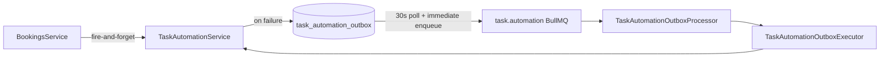

# Task Automation Outbox — Operations & Monitoring

Durable retry layer for optional task automation side-effects (booking lifecycle, invoice payment checks, document packages, vehicle cleaning, insight→task bridge).

## Architecture



**Principles**

- Core domain writes (booking create, invoice issue, …) **never fail** because of task automation errors.
- Automation failures are **persisted** in `task_automation_outbox` and retried asynchronously.
- **Idempotency** at outbox level (`idempotencyKey` unique) plus task-level `dedupKey` upsert prevents duplicate tasks on retry.
- Payload stores **IDs and operational hints only** — no customer PII in `lastError` or outbox JSON.

## Outbox schema

Table: `task_automation_outbox`

| Field | Purpose |
|-------|---------|
| `organizationId` | Tenant scope |
| `ruleId` | Stable automation rule identifier |
| `ruleVersion` | Rule version for replay compatibility |
| `entityType` | `BOOKING`, `INVOICE`, `VEHICLE`, `DOCUMENT`, `VENDOR`, `INSIGHT` |
| `entityId` | Primary entity id for the operation |
| `idempotencyKey` | Unique — `task-auto:{orgId}:{ruleId}:{entityType}:{entityId}` |
| `payload` | `{ operation, bookingId?, invoiceId?, … }` — non-sensitive |
| `status` | `PENDING` → `PROCESSING` → `COMPLETED` / `DEAD_LETTER` |
| `attempts` | Worker try count |
| `availableAt` | Exponential backoff scheduling |
| `lastError` | Sanitized error message (max 2000 chars) |
| `processedAt` | Set on `COMPLETED` or `DEAD_LETTER` |

Repeat failures for the same idempotency key **refresh** the row (reset from `DEAD_LETTER`, update payload/error).

## Configuration

| Variable | Default | Description |
|----------|---------|-------------|
| `TASK_AUTOMATION_OUTBOX_ENABLED` | `true` | Master switch (`false` disables enqueue + poller) |
| `TASK_AUTOMATION_OUTBOX_MAX_ATTEMPTS` | `5` | Outbox-level attempts before dead-letter |
| `TASK_AUTOMATION_OUTBOX_BACKOFF_MS` | `60000` | Base backoff (exponential per attempt) |
| `TASK_AUTOMATION_OUTBOX_POLL_BATCH` | `50` | Cron poller batch size |
| `TASK_AUTOMATION_OUTBOX_JOB_ATTEMPTS` | `5` | BullMQ job attempts |
| `TASK_AUTOMATION_OUTBOX_JOB_BACKOFF_MS` | `30000` | BullMQ exponential backoff |

Requires Redis (BullMQ) and worker process (`WorkersModule`).

## Prometheus metrics

| Metric | Type | Labels |
|--------|------|--------|
| `synqdrive_task_automation_outbox_enqueued_total` | Counter | `rule_id` |
| `synqdrive_task_automation_outbox_completed_total` | Counter | `rule_id` |
| `synqdrive_task_automation_outbox_failed_total` | Counter | `rule_id`, `error_code` |
| `synqdrive_task_automation_outbox_retry_total` | Counter | `rule_id` |
| `synqdrive_task_automation_outbox_refreshed_total` | Counter | — |
| `synqdrive_task_automation_outbox_backlog` | Gauge | — |
| `synqdrive_task_automation_outbox_processing_duration_seconds` | Histogram | — |

Also covered by generic worker alerts: `QueueLagHigh`, `QueueFailedJobsHigh` on queue `task.automation`.

## Structured logs

Log prefix: `task.automation.outbox.*`

| Operation | When |
|-----------|------|
| `enqueued` | Initial failure persisted |
| `process_started` | Worker claimed row |
| `completed` | Successful replay |
| `retry_scheduled` | Recoverable failure, backoff applied |
| `dead_letter` | Max attempts exceeded |

Fields: `organizationId`, `ruleId`, `entityType`, `entityId`, `outboxId`, `attempts`, `errorCode`.

## Runbook

### Inspect backlog

```sql
SELECT status, count(*) FROM task_automation_outbox GROUP BY status;
SELECT * FROM task_automation_outbox
 WHERE status IN ('PENDING', 'DEAD_LETTER')
 ORDER BY available_at ASC LIMIT 50;
```

### Dead-letter triage

1. Read `last_error` and `payload` (operation + entity ids).
2. Fix root cause (DB constraint, missing FK, downstream outage).
3. Reset row for replay:

```sql
UPDATE task_automation_outbox
SET status = 'PENDING', attempts = 0, available_at = NOW(), processed_at = NULL
WHERE id = '<outbox-id>' AND organization_id = '<org-id>';
```

Poller picks it up within 30s or enqueue a BullMQ job manually in ops tooling.

### Disable during incident

Set `TASK_AUTOMATION_OUTBOX_ENABLED=false` — automations fail open (logged warn only, no new outbox rows). Re-enable after recovery; replay missed automations via booking/invoice refresh hooks or manual SQL reset of dead letters.

## Covered automation sources

| Source | Rule examples |
|--------|----------------|
| `TaskAutomationService` | `booking.lifecycle.*`, `booking.document.package.*`, `vendor.repair.ensure` |
| `InvoicePaymentTaskService` | `invoice.payment.check` |
| `VehicleCleaningTaskService` | `vehicle.cleaning.*` |
| `InsightTaskBridgeService` | `insight.task.{INSIGHT_TYPE}` |
